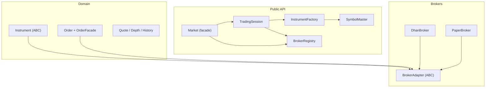
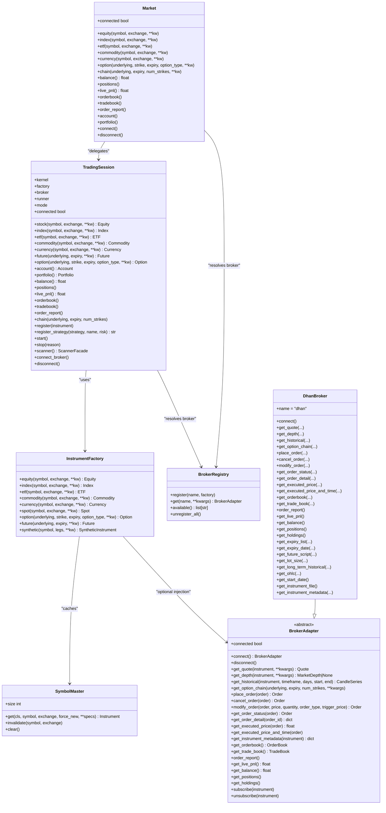
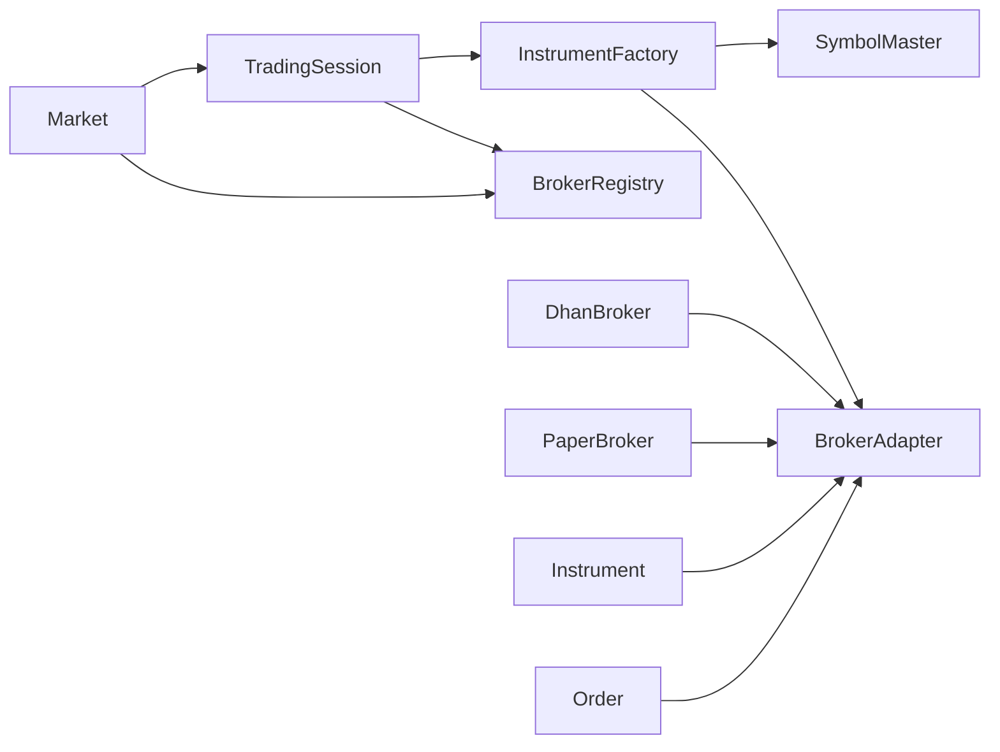

# API Reference

<cite>
**Referenced Files in This Document**
- [facade.py](file://ntrade/facade.py)
- [factories.py](file://ntrade/factories.py)
- [registry.py](file://ntrade/registry.py)
- [__init__.py](file://ntrade/__init__.py)
- [base.py](file://ntrade/domain/instruments/base.py)
- [order.py](file://ntrade/domain/orders/order.py)
- [base.py](file://ntrade/brokers/base.py)
- [dhan.py](file://ntrade/brokers/dhan.py)
- [dhan_auth_provider.py](file://ntrade/brokers/dhan_auth_provider.py)
- [trading_session.py](file://ntrade/kernel/trading_session.py)
- [ARCHITECTURE.md](file://ARCHITECTURE.md)
</cite>

## Table of Contents
1. [Introduction](#introduction)
2. [Project Structure](#project-structure)
3. [Core Components](#core-components)
4. [Architecture Overview](#architecture-overview)
5. [Detailed Component Analysis](#detailed-component-analysis)
6. [Dependency Analysis](#dependency-analysis)
7. [Performance Considerations](#performance-considerations)
8. [Troubleshooting Guide](#troubleshooting-guide)
9. [Conclusion](#conclusion)
10. [Appendices](#appendices)

## Introduction
This document provides comprehensive API documentation for nTrade’s public interfaces, focusing on:
- Market facade as the legacy entry point and TradingSession as the preferred unified session
- InstrumentFactory for creating domain instruments with broker-specific configuration
- SymbolMaster flyweight for shared instrument instances and metadata management
- BrokerRegistry for switching between broker implementations (e.g., dhan, paper)
- Order creation via rich domain models and type-safe enums
- Configuration options, environment variables, and initialization parameters
- Error handling patterns, exception types, and debugging techniques
- Migration guidance and best practices

The goal is to enable both new users and experienced developers to understand and use the SDK effectively across live, paper, and replay modes.

## Project Structure
At a high level, the public API surface is exposed through:
- Facade and factories for user-facing object creation
- Registry components for symbol caching and broker selection
- Domain objects representing instruments, orders, and market data
- Broker adapters abstracting transport details
- Kernel and session orchestration for lifecycle and execution

**Diagram sources**
- [facade.py:27-101](file://ntrade/facade.py#L27-L101)
- [trading_session.py:39-306](file://ntrade/kernel/trading_session.py#L39-L306)
- [factories.py:20-84](file://ntrade/factories.py#L20-L84)
- [registry.py:16-125](file://ntrade/registry.py#L16-L125)
- [base.py:50-305](file://ntrade/domain/instruments/base.py#L50-L305)
- [order.py:44-173](file://ntrade/domain/orders/order.py#L44-L173)
- [base.py:25-163](file://ntrade/brokers/base.py#L25-L163)
- [dhan.py:54-630](file://ntrade/brokers/dhan.py#L54-L630)

**Section sources**
- [ARCHITECTURE.md:20-51](file://ARCHITECTURE.md#L20-L51)
- [ARCHITECTURE.md:302-308](file://ARCHITECTURE.md#L302-L308)

## Core Components
- Market facade: thin adapter over TradingSession for backward compatibility; exposes instrument creation, account/portfolio accessors, and lifecycle methods.
- TradingSession: unified entry point combining broker connection, kernel, strategy runner, and instrument factory.
- InstrumentFactory: creates typed instruments (equity, index, ETF, commodity, currency, spot, option, future, synthetic) using SymbolMaster for flyweight caching.
- SymbolMaster: thread-safe flyweight cache keyed by (kind, symbol, exchange); supports force_new and invalidation.
- BrokerRegistry: name-to-factory registry with default brokers (dhan, paper) registered lazily; supports custom registration.
- BrokerAdapter: abstract base defining get_quote, get_historical, place_order, portfolio methods, and streaming helpers.
- DhanBroker: concrete implementation wrapping Dhan-Tradehull with auth provider, transport, mapping, and robust error handling.
- Orders: rich model with OrderSide, OrderType, TradeType, OrderStatus enums and OrderFacade for natural DSL-like order placement.

Key responsibilities and interactions are detailed below.

**Section sources**
- [facade.py:27-101](file://ntrade/facade.py#L27-L101)
- [trading_session.py:39-306](file://ntrade/kernel/trading_session.py#L39-L306)
- [factories.py:20-84](file://ntrade/factories.py#L20-L84)
- [registry.py:16-125](file://ntrade/registry.py#L16-L125)
- [base.py:25-163](file://ntrade/brokers/base.py#L25-L163)
- [dhan.py:54-630](file://ntrade/brokers/dhan.py#L54-L630)
- [order.py:44-173](file://ntrade/domain/orders/order.py#L44-L173)

## Architecture Overview
The system follows Clean Architecture principles:
- Public API layer (facade + factories) hides infrastructure
- Domain layer contains pure Python models (instruments, orders, analytics)
- Broker layer adapts external APIs into domain objects
- Kernel orchestrates event-driven engines and execution

**Diagram sources**
- [facade.py:27-101](file://ntrade/facade.py#L27-L101)
- [trading_session.py:39-306](file://ntrade/kernel/trading_session.py#L39-L306)
- [factories.py:20-84](file://ntrade/factories.py#L20-L84)
- [registry.py:16-125](file://ntrade/registry.py#L16-L125)
- [base.py:25-163](file://ntrade/brokers/base.py#L25-L163)
- [dhan.py:54-630](file://ntrade/brokers/dhan.py#L54-L630)

## Detailed Component Analysis

### Market Facade
Purpose:
- Legacy entry point that delegates to TradingSession for consistency and T-004 consolidation.
- Provides convenient shortcuts for instrument creation, account/portfolio queries, and lifecycle control.

Key methods and behavior:
- Instrument creation: equity, index, etf, commodity, currency, option, chain
- Account and portfolio: balance, positions, live_pnl, orderbook, tradebook, order_report, account, portfolio
- Lifecycle: connect, disconnect, connected property

Usage example pattern:
- Initialize with broker name or instance; defaults to paper if none provided
- Create instruments via session methods; refresh market data via instrument.market.refresh()

Configuration:
- Constructor accepts broker name, optional broker_instance, env_path, env

Return types and exceptions:
- Methods delegate to TradingSession; errors originate from underlying broker/session layers

Best practices:
- Prefer TradingSession for new code; Market remains for backward compatibility

**Section sources**
- [facade.py:27-101](file://ntrade/facade.py#L27-L101)
- [trading_session.py:39-306](file://ntrade/kernel/trading_session.py#L39-L306)

### TradingSession
Purpose:
- Unified session combining broker connection, kernel, strategy runner, and instrument factory.
- Preferred entry point for live, paper, and replay modes.

Key methods and behavior:
- Constructors: connect(broker, env_path, env), paper(), replay(events, broker)
- Instruments: stock, index, etf, commodity, currency, future, option
- Account and portfolio: account, portfolio, balance, positions, live_pnl, orderbook, tradebook, order_report
- Engine stack: register(instrument), register_strategy(strategy, name, risk), start, stop
- Scanner: scanner()
- Accessors: kernel, factory, broker, runner, mode
- Lifecycle: connect_broker, disconnect, connected

Usage example pattern:
- Connect to a named broker or create paper/replay sessions
- Register instruments and strategies; start the kernel; interact with instruments

Configuration:
- initial_cash, timeframe, session_id, mode, kernel kwargs

Return types and exceptions:
- Returns typed domain objects where applicable; raises when broker operations fail

Best practices:
- Use connect/paper/replay constructors; avoid direct instantiation
- Use session.factory for consistent instrument creation

**Section sources**
- [trading_session.py:39-306](file://ntrade/kernel/trading_session.py#L39-L306)

### InstrumentFactory
Purpose:
- Centralized factory for creating domain instruments with optional broker binding.
- Uses SymbolMaster for flyweight caching to ensure shared instances per symbol/exchange.

Key methods and behavior:
- equity, index, etf, commodity, currency, spot: return typed instruments via master.get
- option: constructs Option with symbol generation and underlying linkage
- future: constructs Future with symbol generation and underlying linkage
- synthetic: constructs SyntheticInstrument from legs

Usage example pattern:
- Instantiate with broker and/or SymbolMaster; call typed methods to create instruments

Return types and exceptions:
- Returns strongly-typed domain objects; exceptions propagate from broker or symbol resolution

Best practices:
- Reuse the same factory instance to benefit from flyweight caching
- Pass broker only when needed; instruments can be created broker-free for analytics

**Section sources**
- [factories.py:20-84](file://ntrade/factories.py#L20-L84)
- [registry.py:16-54](file://ntrade/registry.py#L16-L54)

### SymbolMaster (Flyweight)
Purpose:
- Thread-safe flyweight cache ensuring identical (kind, symbol, exchange) resolves to the same Instrument instance.
- Supports force_new to bypass cache, invalidate specific symbols, and clear all entries.

Key methods and behavior:
- get(cls, symbol, exchange, force_new, **specs): returns cached or newly created instrument
- invalidate(symbol, exchange=None): removes matching entries
- clear(): resets entire cache
- size: number of cached entries

Thread safety:
- Guarded by reentrant lock to prevent race conditions across threads

Usage example pattern:
- Used internally by InstrumentFactory; rarely called directly unless advanced scenarios require cache control

**Section sources**
- [registry.py:16-54](file://ntrade/registry.py#L16-L54)

### BrokerRegistry
Purpose:
- Name-to-factory registry for broker implementations; lazy registration of defaults (dhan, paper).
- Supports custom registration and test isolation via unregister_all.

Key methods and behavior:
- register(name, factory): adds a broker factory
- get(name, **kwargs): retrieves broker instance; raises KeyError if not found
- available(): lists registered broker names
- unregister_all(): clears registry and resets default registration flag

Default brokers:
- dhan: requires optional dependencies; gracefully skipped if unavailable
- paper: always available for offline testing

Usage example pattern:
- Market and TradingSession use BrokerRegistry.get("dhan") or "paper"
- Custom brokers can be registered before first use

**Section sources**
- [registry.py:61-125](file://ntrade/registry.py#L61-L125)

### BrokerAdapter (Abstract Base)
Purpose:
- Defines the contract for broker implementations; domain objects never talk directly to REST/websocket.
- Includes market data, orders, portfolio, and streaming capabilities.

Key methods and behavior:
- Connection: connect, disconnect, connected
- Market data: get_quote, get_depth, get_historical, get_option_chain
- Orders: place_order, cancel_order, modify_order, get_order_status, get_order_detail, get_executed_price, get_executed_price_and_time
- Portfolio: get_instrument_metadata, get_orderbook, get_trade_book, order_report, get_live_pnl, get_balance, get_positions, get_holdings
- Streaming: subscribe, unsubscribe, _dispatch_tick

Implementation notes:
- Abstract methods must be implemented by concrete brokers
- Optional methods raise NotImplementedError if unsupported

**Section sources**
- [base.py:25-163](file://ntrade/brokers/base.py#L25-L163)

### DhanBroker
Purpose:
- Concrete implementation of BrokerAdapter for Dhan-Tradehull integration.
- Handles authentication, token refresh, transport calls, and normalization of responses into domain objects.

Key methods and behavior:
- Authentication: connect uses DhanAuthProvider; automatic token refresh via _ensure_tsl
- Market data: get_quote with retries; get_depth with timeout; get_historical with DAY fallback; get_option_chain with retry logic
- Orders: place_order enforces SEBI rules (LIMIT for F&O), routes BRACKET to place_super_order; cancel/modify/status/detail
- Portfolio: get_balance, get_positions, get_holdings, order_report, live pnl
- Utilities: get_expiry_list, get_expiry_date, get_future_script, get_lot_size, get_long_term_historical, get_ohlc, get_start_date, get_instrument_file, get_instrument_metadata

Error handling:
- Retries for transient failures; raises RuntimeError for critical issues
- Normalizes diverse response shapes into consistent domain objects

Usage example pattern:
- Constructed via BrokerRegistry.get("dhan", env_path=".env", env={...})
- Integrated automatically by TradingSession.connect("dhan")

**Section sources**
- [dhan.py:54-630](file://ntrade/brokers/dhan.py#L54-L630)
- [dhan_auth_provider.py:28-142](file://ntrade/brokers/dhan_auth_provider.py#L28-L142)

### Orders and OrderFacade
Purpose:
- Rich order model with type-safe enums and natural DSL-like placement methods bound to an Instrument.

Key classes and enums:
- OrderSide: BUY, SELL
- OrderType: LIMIT, MARKET, STOP_LIMIT, STOP_MARKET, COVER, BRACKET
- TradeType: MIS, CNC, MARGIN, MTF
- OrderStatus: PENDING, COMPLETED, REJECTED, CANCELLED, PARTIALLY_FILLED
- Order: dataclass with lifecycle methods (cancel, modify, refresh, executed_price, executed_price_and_time)
- OrderFacade: DSL methods buy, sell, limit, market, stop, cover, bracket, place

Usage example pattern:
- instrument.order.buy(quantity, price=..., order_type=...)
- instrument.order.bracket(side, quantity, price, target_price, stop_loss_price)

Error handling:
- Raises RuntimeError if no broker adapter is attached to the instrument

**Section sources**
- [order.py:44-173](file://ntrade/domain/orders/order.py#L44-L173)

### Instrument Base Class
Purpose:
- Abstract root of all market entities; owns state (quote, depth, history, stream, indicators, signals, metadata) and exposes capability objects.

Key features:
- Broker wiring via constructor injection; lazy broker adapter resolution
- Capability properties: market, trade, stream, analytics, derivatives, extension
- Quote/depth projection via apply_quote, apply_depth
- Lifecycle: refresh, hydrate, session, corporate actions, signals, snapshot, clone, serialize, tag, annotate

Usage example pattern:
- Subclasses specialize per asset class; created via InstrumentFactory and cached by SymbolMaster

**Section sources**
- [base.py:50-305](file://ntrade/domain/instruments/base.py#L50-L305)

## Dependency Analysis
The following diagram illustrates key dependencies among core components:

**Diagram sources**
- [facade.py:27-101](file://ntrade/facade.py#L27-L101)
- [trading_session.py:39-306](file://ntrade/kernel/trading_session.py#L39-L306)
- [factories.py:20-84](file://ntrade/factories.py#L20-L84)
- [registry.py:16-125](file://ntrade/registry.py#L16-L125)
- [base.py:25-163](file://ntrade/brokers/base.py#L25-L163)
- [dhan.py:54-630](file://ntrade/brokers/dhan.py#L54-L630)

**Section sources**
- [ARCHITECTURE.md:302-308](file://ARCHITECTURE.md#L302-L308)

## Performance Considerations
- Flyweight caching via SymbolMaster reduces memory usage and ensures consistent subscriptions/metadata across references
- BrokerAdapter subscription multiplexing minimizes transport overhead
- DhanBroker implements retries and timeouts for resilient market data retrieval
- Event-driven kernel avoids polling loops; instruments update via events for efficiency
- PaperBroker enables deterministic backtesting without network latency

[No sources needed since this section provides general guidance]

## Troubleshooting Guide
Common issues and debugging techniques:
- Broker connectivity: verify BrokerRegistry.available(); ensure env_path/env are correct for authentication
- Token expiration: DhanAuthProvider proactively refreshes tokens; check time_until_expiry() and logs
- Order rejections: capture stdout around order_placement; log request and raw reply; handle cases where reason fields are None
- Rate limiting: Dhan may return failure with no reason; implement retry/backoff and log full context
- Missing instrument metadata: call instrument.hydrate() to fetch tick/lot/freeze qty from broker

Exception types:
- RuntimeError for critical failures (e.g., missing broker adapter, LTP zero conversion)
- KeyError for unknown broker names
- ValueError for unsupported timeframes or parameters

Debugging tips:
- Use instrument.snapshot() to inspect state
- Log broker adapter methods and responses
- Leverage ReplayEngine and EventStore for deterministic reproduction

**Section sources**
- [dhan.py:103-136](file://ntrade/brokers/dhan.py#L103-L136)
- [dhan.py:300-347](file://ntrade/brokers/dhan.py#L300-L347)
- [dhan_auth_provider.py:28-142](file://ntrade/brokers/dhan_auth_provider.py#L28-L142)

## Conclusion
nTrade provides a robust, extensible trading framework with clear separation of concerns:
- Public API via Market and TradingSession offers intuitive instrument creation and session management
- Factory and flyweight patterns ensure efficient, type-safe object creation
- Broker abstraction enables seamless switching between implementations
- Rich domain models and event-driven architecture support scalable, maintainable strategies

Adopt TradingSession for new development, leverage InstrumentFactory for consistent instrument creation, and extend capabilities through BrokerRegistry and capability decorators.

[No sources needed since this section summarizes without analyzing specific files]

## Appendices

### Configuration Options and Environment Variables
- Market constructor: broker, broker_instance, env_path, env
- TradingSession.connect: broker, env_path, env, session_id, initial_cash, timeframe
- DhanBroker: env_path, env, connect flag
- DhanAuthProvider: env_path, env; automatic token refresh based on JWT expiry

Initialization parameters:
- initial_cash seeds paper broker balance
- timeframe controls candle engine granularity
- session_id identifies kernel sessions

Environment variables:
- Loaded via dotenv from env_path; includes credentials for Dhan authentication

**Section sources**
- [facade.py:28-36](file://ntrade/facade.py#L28-L36)
- [trading_session.py:73-116](file://ntrade/kernel/trading_session.py#L73-L116)
- [dhan.py:57-67](file://ntrade/brokers/dhan.py#L57-L67)
- [dhan_auth_provider.py:40-56](file://ntrade/brokers/dhan_auth_provider.py#L40-L56)

### Migration Guide and Deprecation Notices
- Prefer TradingSession over Market for new code; Market remains for backward compatibility
- Instrument creation should go through InstrumentFactory or TradingSession methods
- Broker selection via BrokerRegistry.get("dhan") or "paper"; custom brokers can be registered
- Deprecated patterns: direct broker imports in domain code; use BrokerAdapter abstraction

Version considerations:
- __version__ indicates current SDK version
- Backward compatibility maintained via facade and registry defaults

**Section sources**
- [facade.py:1-18](file://ntrade/facade.py#L1-L18)
- [__init__.py:70-104](file://ntrade/__init__.py#L70-L104)
- [ARCHITECTURE.md:358-373](file://ARCHITECTURE.md#L358-L373)

### Code Examples and Best Practices
- Session initialization:
  - Live: session = TradingSession.connect("dhan", env_path=".env")
  - Paper: session = TradingSession.paper(initial_cash=100000)
  - Replay: session = TradingSession.replay(events, broker=...)
- Instrument creation:
  - nifty = session.index("NIFTY")
  - tcs = session.stock("TCS")
  - option = session.option(nifty, strike=15000, expiry=date(2024,12,31), option_type="CE")
- Order placement:
  - tcs.order.buy(75, price=3500)
  - tcs.order.bracket("BUY", 75, price=3500, target_price=3600, stop_loss_price=3450)
- Market data:
  - nifty.market.refresh()
  - quote = nifty.quote
- Error handling:
  - Wrap order placement in try/except; log request and response
  - Handle rate limiting with exponential backoff

Best practices:
- Always hydrate instruments before placing orders to ensure metadata availability
- Use session.register(instrument) to integrate with kernel
- Leverage event-driven updates instead of polling
- Implement proper logging and monitoring for production deployments

**Section sources**
- [trading_session.py:73-142](file://ntrade/kernel/trading_session.py#L73-L142)
- [factories.py:28-66](file://ntrade/factories.py#L28-L66)
- [order.py:118-173](file://ntrade/domain/orders/order.py#L118-L173)
- [base.py:169-209](file://ntrade/domain/instruments/base.py#L169-L209)