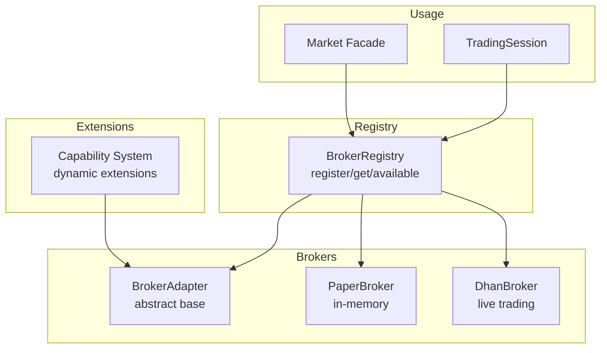
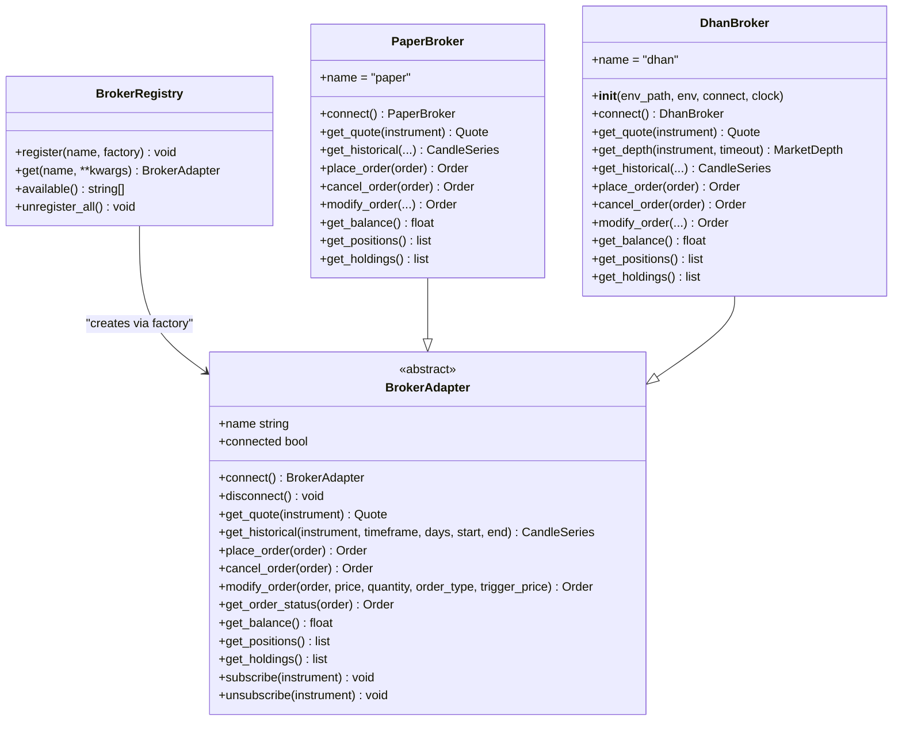
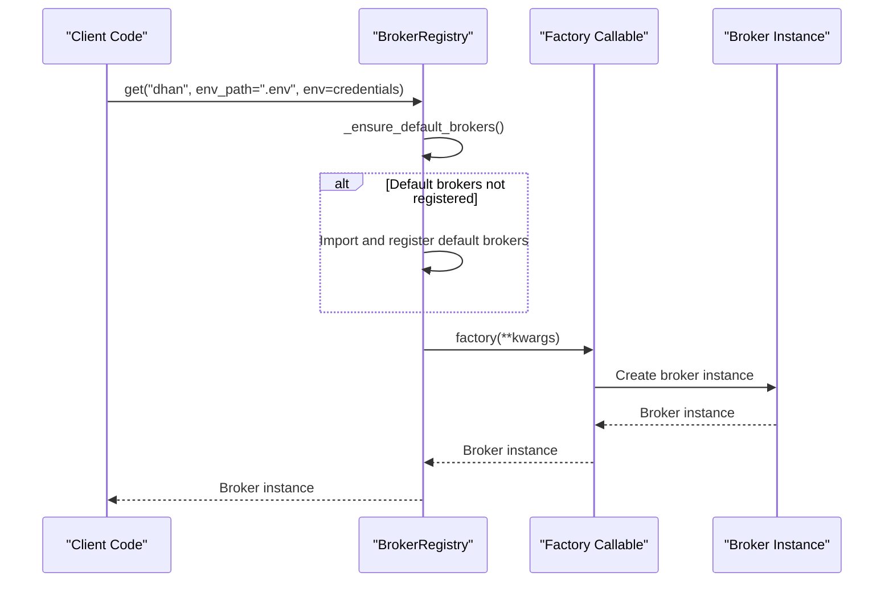
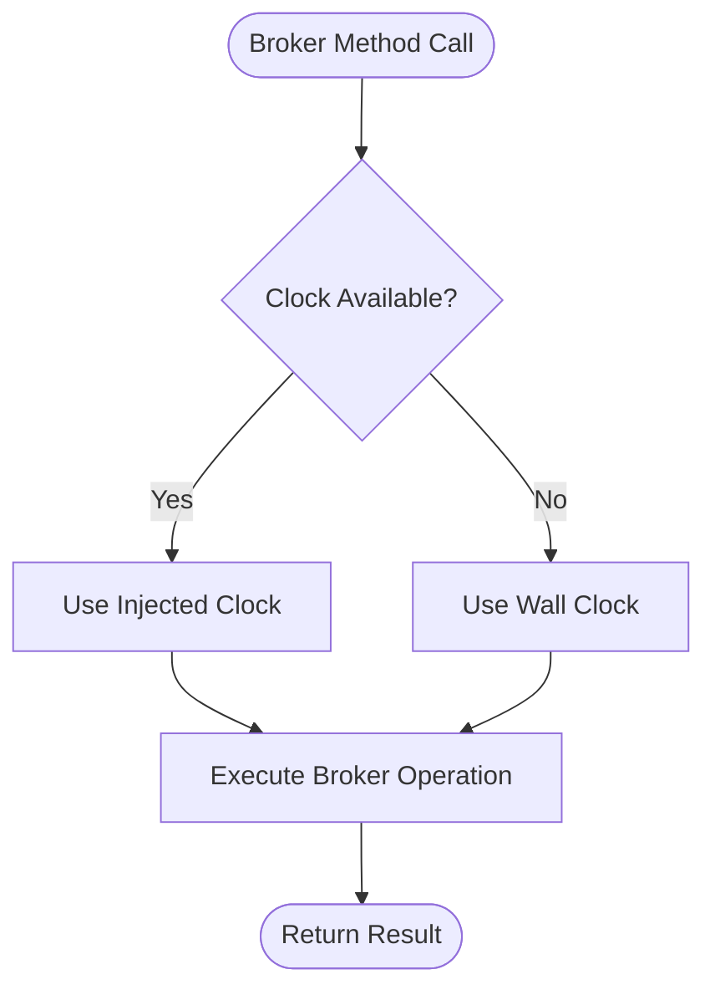
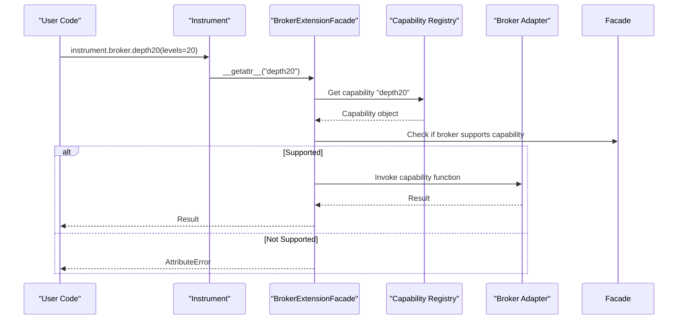
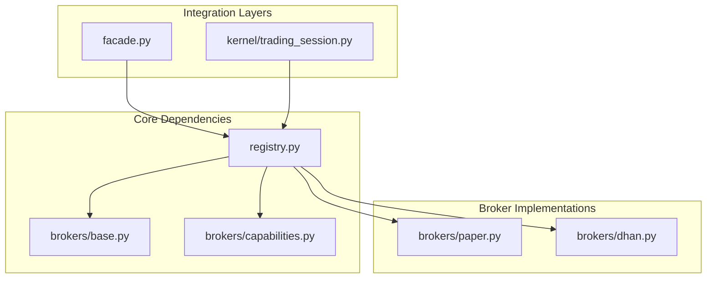

# Broker Registry

<cite>
**Referenced Files in This Document**
- [registry.py](file://ntrade/registry.py)
- [base.py](file://ntrade/brokers/base.py)
- [capabilities.py](file://ntrade/brokers/capabilities.py)
- [paper.py](file://ntrade/brokers/paper.py)
- [dhan.py](file://ntrade/brokers/dhan.py)
- [facade.py](file://ntrade/facade.py)
- [trading_session.py](file://ntrade/kernel/trading_session.py)
- [factories.py](file://ntrade/factories.py)
- [test_registry.py](file://tests/test_registry.py)
</cite>

## Table of Contents
1. [Introduction](#introduction)
2. [Project Structure](#project-structure)
3. [Core Components](#core-components)
4. [Architecture Overview](#architecture-overview)
5. [Detailed Component Analysis](#detailed-component-analysis)
6. [Dependency Analysis](#dependency-analysis)
7. [Performance Considerations](#performance-considerations)
8. [Troubleshooting Guide](#troubleshooting-guide)
9. [Conclusion](#conclusion)

## Introduction
This document provides comprehensive API documentation for the BrokerRegistry system that manages broker implementations and switching between different brokers. It covers registration methods, retrieval methods, configuration management, broker lifecycle, connection handling, capability discovery, environment variable handling, credential management, error handling, and examples for programmatic broker switching and dynamic selection at runtime.

## Project Structure
The BrokerRegistry is part of a modular architecture where:
- The registry lazily registers default brokers and exposes factory-based retrieval.
- Brokers implement a common adapter interface to abstract transport details from domain logic.
- Capabilities provide dynamic extension points for broker-specific features.
- Facades and sessions use the registry to obtain broker instances based on configuration or runtime conditions.

**Diagram sources**
- [registry.py:61-125](file://ntrade/registry.py#L61-L125)
- [base.py:25-163](file://ntrade/brokers/base.py#L25-L163)
- [paper.py:23-216](file://ntrade/brokers/paper.py#L23-L216)
- [dhan.py:54-200](file://ntrade/brokers/dhan.py#L54-L200)
- [capabilities.py:16-74](file://ntrade/brokers/capabilities.py#L16-L74)
- [facade.py:27-36](file://ntrade/facade.py#L27-L36)
- [trading_session.py:80-94](file://ntrade/kernel/trading_session.py#L80-L94)

**Section sources**
- [registry.py:61-125](file://ntrade/registry.py#L61-L125)
- [base.py:25-163](file://ntrade/brokers/base.py#L25-L163)
- [capabilities.py:16-74](file://ntrade/brokers/capabilities.py#L16-L74)
- [paper.py:23-216](file://ntrade/brokers/paper.py#L23-L216)
- [dhan.py:54-200](file://ntrade/brokers/dhan.py#L54-L200)
- [facade.py:27-36](file://ntrade/facade.py#L27-L36)
- [trading_session.py:80-94](file://ntrade/kernel/trading_session.py#L80-L94)

## Core Components
- BrokerRegistry: Thread-safe registry mapping names to factory callables; lazy loading of default brokers; supports register, get, available, unregister_all.
- BrokerAdapter: Abstract base defining the contract for all brokers (connect, disconnect, market data, orders, portfolio, streaming).
- Capability System: Dynamic extension mechanism allowing broker-specific features exposed via instrument.broker.<capability>.
- PaperBroker: In-memory broker implementing the adapter contract for testing/backtesting/replay.
- DhanBroker: Live broker implementation using external libraries for authentication, transport, and mapping.

Key responsibilities:
- Registration: Add new broker implementations with unique names.
- Retrieval: Get broker instances by name with kwargs passed to the factory.
- Configuration: Accept env_path/env parameters for credentials and environment setup.
- Lifecycle: Connect/disconnect, subscription management, clock injection for time parity.
- Capabilities: Discover and invoke broker-specific features safely.

**Section sources**
- [registry.py:61-125](file://ntrade/registry.py#L61-L125)
- [base.py:25-163](file://ntrade/brokers/base.py#L25-L163)
- [capabilities.py:16-74](file://ntrade/brokers/capabilities.py#L16-L74)
- [paper.py:23-216](file://ntrade/brokers/paper.py#L23-L216)
- [dhan.py:54-200](file://ntrade/brokers/dhan.py#L54-L200)

## Architecture Overview
The BrokerRegistry acts as a central factory for broker instances, ensuring thread safety and lazy initialization. Brokers implement the BrokerAdapter interface, providing consistent APIs across different backends. The capability system enables dynamic feature discovery and invocation without polluting the base API.

**Diagram sources**
- [registry.py:61-125](file://ntrade/registry.py#L61-L125)
- [base.py:25-163](file://ntrade/brokers/base.py#L25-L163)
- [paper.py:23-216](file://ntrade/brokers/paper.py#L23-L216)
- [dhan.py:54-200](file://ntrade/brokers/dhan.py#L54-L200)

## Detailed Component Analysis

### BrokerRegistry API
The BrokerRegistry provides a thread-safe registry for broker factories with lazy loading of default implementations.

Key methods:
- register(name, factory): Register a new broker factory with a unique name
- get(name, **kwargs): Retrieve a broker instance by name, passing kwargs to the factory
- available(): List all registered broker names
- unregister_all(): Clear all registrations and reset default broker flags

Lifecycle behavior:
- Default brokers are registered lazily when first accessed
- Thread-safe operations using reentrant locks
- ImportError handling for optional dependencies

**Diagram sources**
- [registry.py:77-83](file://ntrade/registry.py#L77-L83)
- [registry.py:104-119](file://ntrade/registry.py#L104-L119)

**Section sources**
- [registry.py:61-125](file://ntrade/registry.py#L61-L125)
- [test_registry.py:1-35](file://tests/test_registry.py#L1-35)

### BrokerAdapter Interface
The BrokerAdapter defines the contract that all broker implementations must follow, providing a consistent API regardless of the underlying broker technology.

Core responsibilities:
- Connection management (connect/disconnect)
- Market data access (quotes, depth, historical data)
- Order lifecycle management (placement, cancellation, modification)
- Portfolio information (balance, positions, holdings)
- Streaming subscriptions

Time source abstraction:
- Supports injected clock for replay/backtesting scenarios
- Falls back to wall clock when no clock is provided
- Ensures zero-parity timestamps across components

**Diagram sources**
- [base.py:30-57](file://ntrade/brokers/base.py#L30-L57)

**Section sources**
- [base.py:25-163](file://ntrade/brokers/base.py#L25-L163)

### Capability System
The capability system enables dynamic extension of broker functionality without modifying the base interface. Capabilities are registered globally and can be conditionally supported by specific brokers.

Key features:
- Decorator-based capability registration
- Runtime capability discovery per broker
- Safe attribute access with clear error messages
- Support for broker-specific features like depth20, kill_switch, etc.

**Diagram sources**
- [capabilities.py:48-74](file://ntrade/brokers/capabilities.py#L48-L74)

**Section sources**
- [capabilities.py:16-74](file://ntrade/brokers/capabilities.py#L16-L74)

### PaperBroker Implementation
PaperBroker provides an in-memory implementation of the BrokerAdapter for testing, backtesting, and replay scenarios. It offers deterministic behavior with configurable random seeds and clock injection.

Key capabilities:
- Simulated market data generation
- Order placement with immediate fills
- Balance and position tracking
- Historical data generation
- Full order book and trade book simulation

Configuration options:
- seed: Random seed for reproducible results
- clock: Trading clock for time control
- Initial balance configuration

**Section sources**
- [paper.py:23-216](file://ntrade/brokers/paper.py#L23-L216)

### DhanBroker Implementation
DhanBroker implements live trading functionality through the Dhan-Tradehull library, handling authentication, market data, and order execution.

Key features:
- Authentication with JWT token refresh
- Market data retrieval with retry logic
- Depth data support with timeout handling
- SEBI-compliant order placement
- Comprehensive error handling and recovery

Authentication flow:
- Environment-based credential loading
- Token validation and automatic refresh
- Shared token storage for process coordination

**Section sources**
- [dhan.py:54-200](file://ntrade/brokers/dhan.py#L54-L200)
- [dhan_auth.py:42-118](file://ntrade/brokers/dhan_auth.py#L42-L118)

### Integration Points
The BrokerRegistry integrates with higher-level components through facades and sessions:

Market Facade:
- Provides legacy API compatibility
- Automatically selects paper broker when none specified
- Delegates to TradingSession for core functionality

TradingSession:
- Creates live sessions with named brokers
- Supports paper and replay modes
- Manages broker lifecycle within session context

**Section sources**
- [facade.py:27-36](file://ntrade/facade.py#L27-L36)
- [trading_session.py:80-94](file://ntrade/kernel/trading_session.py#L80-L94)

## Dependency Analysis
The BrokerRegistry has minimal external dependencies but coordinates multiple components:

Internal dependencies:
- BrokerAdapter base class for interface definition
- Individual broker implementations (PaperBroker, DhanBroker)
- Capability system for dynamic extensions

External dependencies:
- Optional imports for broker modules (handled gracefully)
- Third-party libraries for specific broker implementations

Thread safety considerations:
- Class-level reentrant locks protect registry operations
- Lazy initialization prevents race conditions
- Test isolation through unregister_all method

**Diagram sources**
- [registry.py:61-125](file://ntrade/registry.py#L61-L125)
- [base.py:25-163](file://ntrade/brokers/base.py#L25-L163)
- [capabilities.py:16-74](file://ntrade/brokers/capabilities.py#L16-L74)
- [paper.py:23-216](file://ntrade/brokers/paper.py#L23-L216)
- [dhan.py:54-200](file://ntrade/brokers/dhan.py#L54-L200)
- [facade.py:27-36](file://ntrade/facade.py#L27-L36)
- [trading_session.py:80-94](file://ntrade/kernel/trading_session.py#L80-L94)

**Section sources**
- [registry.py:61-125](file://ntrade/registry.py#L61-L125)

## Performance Considerations
- Lazy loading: Broker modules are only imported when needed, reducing startup time
- Thread safety: Reentrant locks ensure safe concurrent access without performance bottlenecks
- Memory efficiency: Flyweight pattern for instruments reduces memory usage
- Retry mechanisms: Built-in retry logic handles transient network failures
- Time source optimization: Injected clocks eliminate datetime.now() calls in hot paths

Optimization opportunities:
- Connection pooling for network brokers
- Caching of frequently accessed market data
- Asynchronous operations for non-blocking I/O
- Batch processing for multiple instrument requests

## Troubleshooting Guide

Common issues and solutions:

Missing broker errors:
- Symptom: KeyError when calling BrokerRegistry.get()
- Cause: Broker not registered or module import failure
- Solution: Ensure broker module is installed and properly registered

Connection failures:
- Symptom: Network timeouts or authentication errors
- Cause: Invalid credentials, network issues, or rate limiting
- Solution: Verify environment variables, check network connectivity, implement retry logic

Capability mismatches:
- Symptom: AttributeError when accessing broker-specific features
- Cause: Capability not supported by current broker
- Solution: Check capability availability before use or implement fallback logic

Environment configuration:
- Issue: Credentials not loaded properly
- Cause: Incorrect .env file path or missing environment variables
- Solution: Verify .env file location and content, pass explicit env parameter

Error handling patterns:
- Graceful degradation for optional dependencies
- Clear error messages with available broker names
- Timeout handling for network operations
- Token refresh mechanisms for authentication

**Section sources**
- [registry.py:77-83](file://ntrade/registry.py#L77-L83)
- [dhan.py:107-140](file://ntrade/brokers/dhan.py#L107-L140)
- [capabilities.py:60-70](file://ntrade/brokers/capabilities.py#L60-L70)

## Conclusion
The BrokerRegistry system provides a robust, extensible framework for managing broker implementations with strong emphasis on thread safety, lazy initialization, and clean separation of concerns. The design enables easy addition of new brokers, dynamic capability discovery, and seamless switching between different broker types based on runtime conditions. The comprehensive error handling and configuration management make it suitable for both development and production environments.

Key benefits:
- Clean abstraction over diverse broker implementations
- Thread-safe registry with lazy loading
- Dynamic capability system for broker-specific features
- Comprehensive configuration and credential management
- Extensive error handling and recovery mechanisms

The system successfully balances flexibility with simplicity, making it easy to extend while maintaining reliable operation across different trading scenarios.