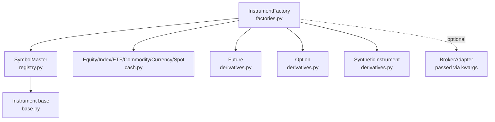
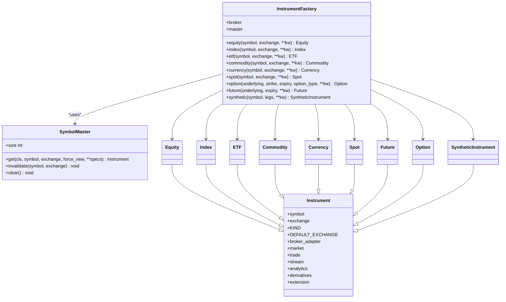
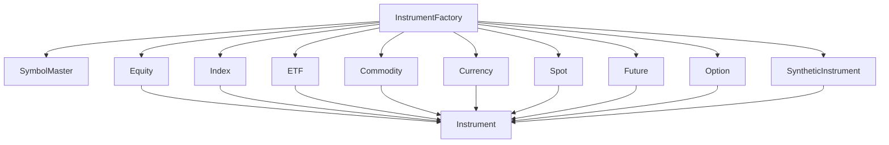
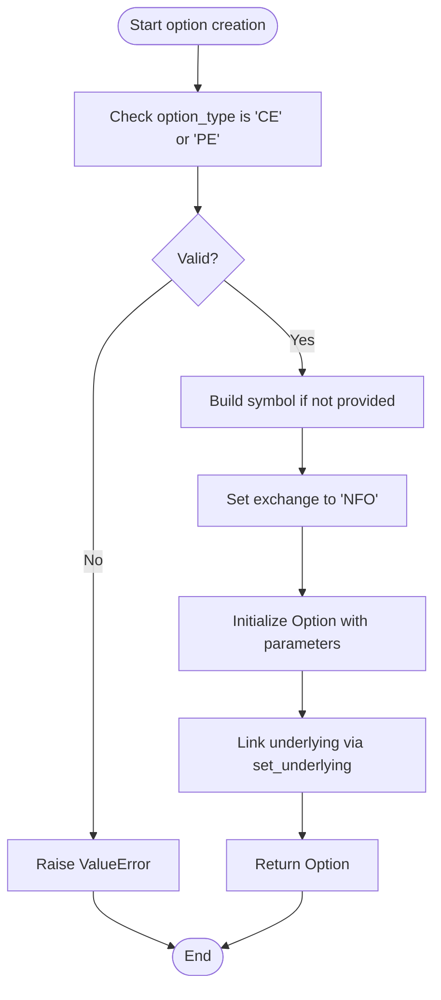

# Instrument Factory

<cite>
**Referenced Files in This Document**
- [factories.py](file://ntrade/factories.py)
- [registry.py](file://ntrade/registry.py)
- [base.py](file://ntrade/domain/instruments/base.py)
- [cash.py](file://ntrade/domain/instruments/cash.py)
- [derivatives.py](file://ntrade/domain/instruments/derivatives.py)
- [chain.py](file://ntrade/domain/instruments/chain.py)
- [capabilities.py](file://ntrade/brokers/capabilities.py)
- [test_instruments.py](file://tests/test_instruments.py)
- [test_factories_facade.py](file://tests/test_factories_facade.py)
</cite>

## Table of Contents
1. [Introduction](#introduction)
2. [Project Structure](#project-structure)
3. [Core Components](#core-components)
4. [Architecture Overview](#architecture-overview)
5. [Detailed Component Analysis](#detailed-component-analysis)
6. [Dependency Analysis](#dependency-analysis)
7. [Performance Considerations](#performance-considerations)
8. [Troubleshooting Guide](#troubleshooting-guide)
9. [Conclusion](#conclusion)
10. [Appendices](#appendices)

## Introduction
This document provides comprehensive API documentation for the InstrumentFactory class and its related components used to create domain instruments with type safety, consistent defaults, and broker-specific configuration. It covers factory methods for equities, indices, ETFs, commodities, currencies, spot instruments, futures, options, and synthetic instruments. It also explains how the factory integrates with the SymbolMaster registry for flyweight caching, how broker capabilities are wired via BrokerExtensionFacade, and how errors are handled for invalid parameters or unsupported instrument types. Examples include creating complex derivatives such as options with strike prices and expiry dates.

## Project Structure
The InstrumentFactory lives in a small, focused module that delegates creation to:
- The SymbolMaster registry for flyweight caching and exchange defaults
- Concrete instrument classes under the domain/instruments package
- Optional broker adapters passed through to instruments for live data and trading



**Diagram sources**
- [factories.py:20-66](file://ntrade/factories.py#L20-L66)
- [registry.py:16-43](file://ntrade/registry.py#L16-L43)
- [cash.py:8-50](file://ntrade/domain/instruments/cash.py#L8-L50)
- [derivatives.py:16-245](file://ntrade/domain/instruments/derivatives.py#L16-L245)
- [base.py:50-104](file://ntrade/domain/instruments/base.py#L50-L104)

**Section sources**
- [factories.py:1-84](file://ntrade/factories.py#L1-L84)
- [registry.py:1-125](file://ntrade/registry.py#L1-L125)
- [base.py:1-305](file://ntrade/domain/instruments/base.py#L1-L305)
- [cash.py:1-50](file://ntrade/domain/instruments/cash.py#L1-L50)
- [derivatives.py:1-245](file://ntrade/domain/instruments/derivatives.py#L1-L245)

## Core Components
- InstrumentFactory: Central factory for creating typed instruments with optional broker wiring and SymbolMaster-backed caching.
- OptionFactory: Stateless helper for analytics/testing without requiring a broker.
- SymbolMaster: Flyweight cache keyed by (kind, symbol, exchange), ensuring shared instances and thread-safe access.
- Instrument base and subclasses: Define KIND, DEFAULT_EXCHANGE, and specialized behavior per asset class.
- Derivatives: Future and Option with validation and analytics helpers; SyntheticInstrument composes legs.
- BrokerExtensionFacade: Capability-driven access to broker-specific features on instruments.

Key responsibilities:
- Type-safe creation via explicit factory methods
- Default exchange selection per instrument kind
- Optional broker injection into instruments
- Flyweight caching to avoid duplicate instances
- Validation for derivative parameters

**Section sources**
- [factories.py:20-84](file://ntrade/factories.py#L20-L84)
- [registry.py:16-59](file://ntrade/registry.py#L16-L59)
- [base.py:50-104](file://ntrade/domain/instruments/base.py#L50-L104)
- [cash.py:8-50](file://ntrade/domain/instruments/cash.py#L8-L50)
- [derivatives.py:16-245](file://ntrade/domain/instruments/derivatives.py#L16-L245)
- [capabilities.py:48-74](file://ntrade/brokers/capabilities.py#L48-L74)

## Architecture Overview
The factory pattern is implemented with a thin facade over SymbolMaster and concrete instrument constructors. Instruments may carry an optional BrokerAdapter for live operations. Derivative creation enforces parameter validation at construction time.



**Diagram sources**
- [factories.py:20-66](file://ntrade/factories.py#L20-L66)
- [registry.py:16-43](file://ntrade/registry.py#L16-L43)
- [base.py:50-104](file://ntrade/domain/instruments/base.py#L50-L104)
- [cash.py:8-50](file://ntrade/domain/instruments/cash.py#L8-L50)
- [derivatives.py:16-245](file://ntrade/domain/instruments/derivatives.py#L16-L245)

## Detailed Component Analysis

### InstrumentFactory API
- equity(symbol, exchange=None, **kw) -> Equity
  - Creates or retrieves an Equity instance via SymbolMaster.get(Equity, ...).
  - Defaults: exchange uses Equity.DEFAULT_EXCHANGE if None.
  - Broker wiring: passes broker kwarg if provided.
  - Additional metadata can be passed via **kw.

- index(symbol, exchange=None, **kw) -> Index
  - Same pattern as equity; default exchange from Index.DEFAULT_EXCHANGE.

- etf(symbol, exchange=None, **kw) -> ETF
  - Same pattern; default exchange from ETF.DEFAULT_EXCHANGE.

- commodity(symbol, exchange=None, **kw) -> Commodity
  - Same pattern; default exchange from Commodity.DEFAULT_EXCHANGE.

- currency(symbol, exchange=None, **kw) -> Currency
  - Same pattern; default exchange from Currency.DEFAULT_EXCHANGE.

- spot(symbol, exchange=None, **kw) -> Spot
  - Same pattern; default exchange from Spot.DEFAULT_EXCHANGE.

- option(underlying, strike, expiry, option_type, **kw) -> Option
  - Validates option_type must be CE or PE (enforced by Option constructor).
  - Builds symbol automatically unless provided: "{underlying.symbol} {int(strike)} {option_type} {expiry:%d%b%y}".
  - Sets exchange to NFO by default for options.
  - Links underlying via set_underlying.
  - Passes broker kwarg if provided.

- future(underlying, expiry, **kw) -> Future
  - Builds symbol automatically unless provided: "{underlying.symbol} {expiry:%d%b%y}".
  - Sets exchange to NFO by default for futures.
  - Links underlying via set_underlying.
  - Passes broker kwarg if provided.

- synthetic(symbol, legs, **kw) -> SyntheticInstrument
  - Creates composite instrument aggregating multiple legs.
  - Passes broker kwarg if provided.

Parameter validation and defaults:
- Exchange defaults come from each instrument’s DEFAULT_EXCHANGE when not specified.
- option_type is validated strictly in Option constructor; invalid values raise ValueError.
- Futures and Options use NFO exchange by default when created via factory methods.
- Symbols auto-generated for derivatives unless explicitly overridden via kw.

Broker-specific configuration:
- If a BrokerAdapter is supplied to InstrumentFactory, it is forwarded to instruments via kwargs.
- Instruments expose broker_adapter lazily and capability extensions via BrokerExtensionFacade.

Examples:
- Create an option with strike and expiry:
  - Use factory.option(underlying, strike=..., expiry=date(...), option_type="CE")
  - Underlying is linked automatically.

- Create a synthetic straddle:
  - Use factory.synthetic("STRADDLE", legs=[call, put])

**Section sources**
- [factories.py:20-66](file://ntrade/factories.py#L20-L66)
- [derivatives.py:109-142](file://ntrade/domain/instruments/derivatives.py#L109-L142)
- [base.py:50-104](file://ntrade/domain/instruments/base.py#L50-L104)

### OptionFactory
- Static method create(underlying, strike, expiry, option_type, **kw) -> Option
  - For analytics/testing without requiring a broker.
  - Auto-generates symbol similarly to InstrumentFactory.option.
  - Sets exchange to NFO and links underlying.

Use cases:
- Quick option creation in tests or analytical pipelines where no broker is needed.

**Section sources**
- [factories.py:74-84](file://ntrade/factories.py#L74-L84)
- [derivatives.py:109-142](file://ntrade/domain/instruments/derivatives.py#L109-L142)

### SymbolMaster Registry
- get(cls, symbol, exchange=None, force_new=False, **specs) -> Instrument
  - Caches instances keyed by (KIND, symbol, exchange).
  - Thread-safe via reentrant lock.
  - Ensures repeated lookups return the same object (flyweight).
  - Supports force_new to bypass cache.

Integration points:
- All cash and spot instrument factories route through SymbolMaster.get.
- Ensures consistent metadata sharing across subscriptions and caches.

**Section sources**
- [registry.py:16-59](file://ntrade/registry.py#L16-L59)

### Instrument Base and Capabilities
- Instrument defines core state (quote, depth, history, stream), lifecycle (refresh, hydrate), and capability accessors (market, trade, stream, analytics, derivatives, extension).
- Broker wiring is lazy; broker_adapter property instantiates via stored factory if present.
- Extensions exposed via instrument.broker.<capability>() using BrokerExtensionFacade.

Capabilities:
- MarketCapability: read-only market data view.
- TradeCapability: fluent order builder.
- StreamCapability: live streaming management.
- AnalyticsCapability: indicators and patterns.
- DerivativesCapability: option chain fetch.
- ExtensionCapability: provider-specific extensions.

**Section sources**
- [base.py:50-152](file://ntrade/domain/instruments/base.py#L50-L152)
- [capabilities.py:37-101](file://ntrade/domain/instruments/capabilities.py#L37-L101)
- [capabilities.py:190-207](file://ntrade/domain/instruments/capabilities.py#L190-L207)
- [capabilities.py:213-259](file://ntrade/domain/instruments/capabilities.py#L213-L259)
- [capabilities.py:269-345](file://ntrade/domain/instruments/capabilities.py#L269-L345)
- [capabilities.py:351-360](file://ntrade/domain/instruments/capabilities.py#L351-L360)
- [capabilities.py:366-383](file://ntrade/domain/instruments/capabilities.py#L366-L383)

### Derivatives: Future and Option
- Future:
  - Stores underlying_symbol, expiry, and links to front/next month contracts.
  - Provides basis, cost_of_carry, roll_yield, continuous series, rollover.
- Option:
  - Validates option_type (CE/PE).
  - Exposes greeks properties, intrinsic/extrinsic value, moneyness, Black-Scholes pricing, implied volatility, payoff, pnl.
  - Maintains iv and Greeks objects.

Validation:
- Invalid option_type raises ValueError during Option construction.

**Section sources**
- [derivatives.py:16-107](file://ntrade/domain/instruments/derivatives.py#L16-L107)
- [derivatives.py:109-224](file://ntrade/domain/instruments/derivatives.py#L109-L224)

### OptionChain Integration
- OptionChain.fetch(underlying, expiry, num_strikes, **kwargs) obtains a chain via the underlying’s broker adapter.
- Provides views: calls, puts, expiries, strikes, ATM, ITM/OTM lists.
- Analytics: PCR, max pain, IV surface, Greeks table.

Error handling:
- Raises RuntimeError if underlying has no broker adapter.
- Raises KeyError when accessing non-existent strike.

**Section sources**
- [chain.py:19-102](file://ntrade/domain/instruments/chain.py#L19-L102)
- [chain.py:106-176](file://ntrade/domain/instruments/chain.py#L106-L176)
- [chain.py:179-202](file://ntrade/domain/instruments/chain.py#L179-L202)

### Broker Capabilities and Extension Facade
- BrokerExtensionFacade resolves capabilities dynamically based on the current broker name.
- Unsupported capabilities raise AttributeError with descriptive message.
- Capability registration supports specifying supported brokers.

**Section sources**
- [capabilities.py:48-74](file://ntrade/brokers/capabilities.py#L48-L74)

## Dependency Analysis
The factory depends on:
- SymbolMaster for flyweight caching and exchange defaults
- Instrument base and subclasses for type-safe creation
- Optional BrokerAdapter for live operations and capability resolution



**Diagram sources**
- [factories.py:20-66](file://ntrade/factories.py#L20-L66)
- [registry.py:16-43](file://ntrade/registry.py#L16-L43)
- [cash.py:8-50](file://ntrade/domain/instruments/cash.py#L8-L50)
- [derivatives.py:16-245](file://ntrade/domain/instruments/derivatives.py#L16-L245)
- [base.py:50-104](file://ntrade/domain/instruments/base.py#L50-L104)

**Section sources**
- [factories.py:1-84](file://ntrade/factories.py#L1-L84)
- [registry.py:1-125](file://ntrade/registry.py#L1-L125)
- [base.py:1-305](file://ntrade/domain/instruments/base.py#L1-L305)
- [cash.py:1-50](file://ntrade/domain/instruments/cash.py#L1-L50)
- [derivatives.py:1-245](file://ntrade/domain/instruments/derivatives.py#L1-L245)

## Performance Considerations
- Flyweight caching via SymbolMaster ensures minimal memory usage and shared state across subscribers.
- Lazy broker instantiation avoids unnecessary network setup until required.
- Derivative computations (greeks, pricing) are encapsulated and can be cached within instruments.
- Avoid frequent force_new=True calls to prevent cache churn.

[No sources needed since this section provides general guidance]

## Troubleshooting Guide
Common issues and resolutions:
- Invalid option_type:
  - Symptom: ValueError raised during Option creation.
  - Cause: option_type not CE or PE.
  - Resolution: Ensure option_type is one of "CE" or "PE".

- Missing broker adapter for option chain:
  - Symptom: RuntimeError when fetching OptionChain.
  - Cause: Underlying instrument has no broker_adapter.
  - Resolution: Provide a BrokerAdapter to the instrument or factory.

- Unsupported broker capability:
  - Symptom: AttributeError when calling instrument.broker.<capability>().
  - Cause: Current broker does not support the requested capability.
  - Resolution: Check available capabilities via instrument.broker.available() or switch to a compatible broker.

- Cache-related identity confusion:
  - Symptom: Unexpected shared state between instruments.
  - Cause: SymbolMaster returns cached instances.
  - Resolution: Use force_new=True when necessary or clear specific entries via SymbolMaster.invalidate.

**Section sources**
- [derivatives.py:129-132](file://ntrade/domain/instruments/derivatives.py#L129-L132)
- [chain.py:57-62](file://ntrade/domain/instruments/chain.py#L57-L62)
- [capabilities.py:60-70](file://ntrade/brokers/capabilities.py#L60-L70)
- [registry.py:28-43](file://ntrade/registry.py#L28-L43)

## Conclusion
InstrumentFactory provides a clean, type-safe interface for creating all supported instrument types with consistent defaults and optional broker integration. Through SymbolMaster, it ensures efficient reuse of instrument instances. Derivative creation enforces strict validation, while OptionChain and capability mechanisms enable advanced analytics and broker-specific features. This design balances simplicity, performance, and extensibility for both live and testing environments.

[No sources needed since this section summarizes without analyzing specific files]

## Appendices

### Usage Examples
- Create an equity with broker:
  - factory.equity("RELIANCE", broker=broker)
- Create an index:
  - factory.index("NIFTY")
- Create an ETF:
  - factory.etf("NIFTYBEES")
- Create a commodity:
  - factory.commodity("CRUDEOIL")
- Create a currency:
  - factory.currency("USDINR")
- Create a spot:
  - factory.spot("USDINR")
- Create an option:
  - factory.option(nifty, strike=24500, expiry=date.today(), option_type="CE")
- Create a future:
  - factory.future(nifty, expiry=date.today())
- Create a synthetic instrument:
  - factory.synthetic("STRADDLE", legs=[call, put])

**Section sources**
- [test_factories_facade.py:21-46](file://tests/test_factories_facade.py#L21-L46)
- [test_instruments.py:153-165](file://tests/test_instruments.py#L153-L165)

### Sequence Diagram: Creating an Option via InstrumentFactory
```mermaid
sequenceDiagram
participant Client as "Client Code"
participant Factory as "InstrumentFactory"
participant Master as "SymbolMaster"
participant Opt as "Option"
participant Base as "Instrument"
Client->>Factory : option(underlying, strike, expiry, option_type, **kw)
Factory->>Factory : build symbol if not provided
Factory->>Opt : __init__(symbol, exchange="NFO", strike, expiry, option_type, underlying_symbol, **kw)
Opt->>Base : super().__init__(...)
Factory->>Opt : set_underlying(underlying)
Opt-->>Factory : Option instance
Factory-->>Client : Option instance
```

**Diagram sources**
- [factories.py:46-54](file://ntrade/factories.py#L46-L54)
- [derivatives.py:109-142](file://ntrade/domain/instruments/derivatives.py#L109-L142)
- [base.py:50-104](file://ntrade/domain/instruments/base.py#L50-L104)

### Flowchart: Parameter Validation for Option Creation


**Diagram sources**
- [derivatives.py:129-132](file://ntrade/domain/instruments/derivatives.py#L129-L132)
- [factories.py:46-54](file://ntrade/factories.py#L46-L54)