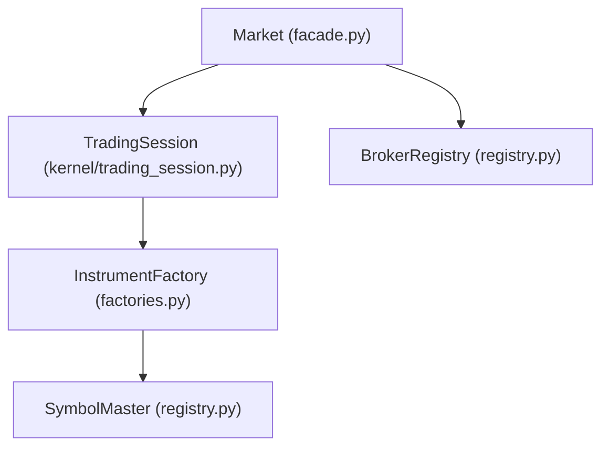
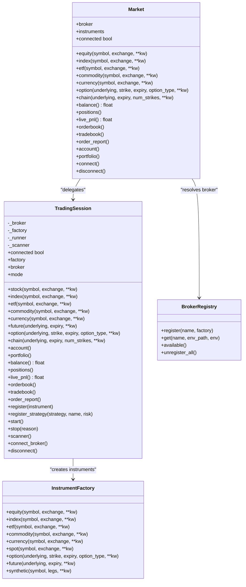
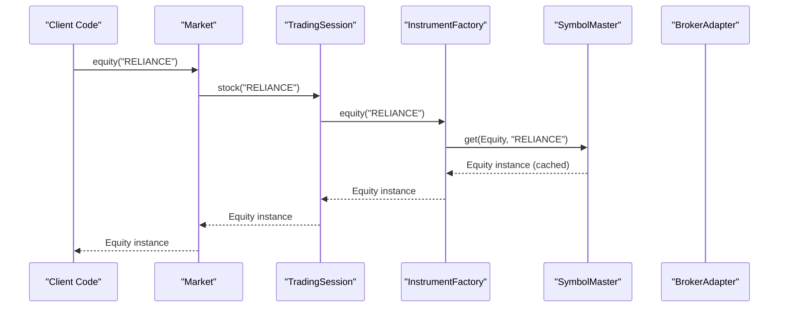
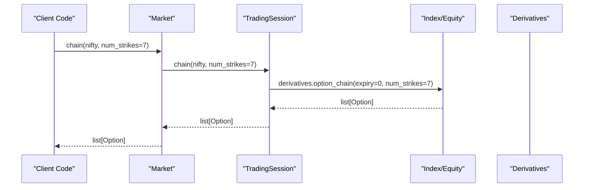
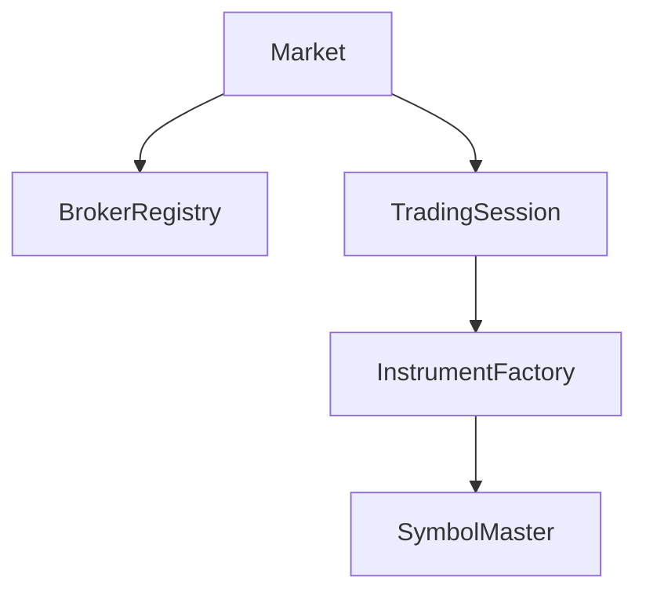

# Market Facade

<cite>
**Referenced Files in This Document**
- [facade.py](file://ntrade/facade.py)
- [trading_session.py](file://ntrade/kernel/trading_session.py)
- [factories.py](file://ntrade/factories.py)
- [registry.py](file://ntrade/registry.py)
- [__init__.py](file://ntrade/__init__.py)
- [test_factories_facade.py](file://tests/test_factories_facade.py)
- [test_findings_batch3.py](file://tests/test_findings_batch3.py)
- [test_gap_closure.py](file://tests/test_gap_closure.py)
</cite>

## Table of Contents
1. Introduction
2. Project Structure
3. Core Components
4. Architecture Overview
5. Detailed Component Analysis
6. Dependency Analysis
7. Performance Considerations
8. Troubleshooting Guide
9. Conclusion
10. Appendices

## Introduction
The Market facade is the legacy public entry point to nTrade, providing a thin adapter over the unified TradingSession. It exists for backward compatibility and delegates all instrument creation, account queries, and lifecycle operations to a single implementation: TradingSession. The preferred modern entry point is TradingSession; Market remains to preserve existing code paths while consolidating SDK behavior under one session.

Key points:
- Market wraps a BrokerAdapter obtained via BrokerRegistry or an injected instance.
- All methods (equity, index, etf, commodity, currency, option, chain, balance, positions, live_pnl, orderbook, tradebook, order_report, connect, disconnect, connected) delegate to TradingSession.
- Instrument instances are created through InstrumentFactory backed by SymbolMaster flyweight caching.

**Section sources**
- [facade.py:1-18](file://ntrade/facade.py#L1-L18)
- [trading_session.py:1-15](file://ntrade/kernel/trading_session.py#L1-L15)

## Project Structure
Market is defined in the facade module and depends on:
- TradingSession (unified session)
- BrokerRegistry (broker name resolution)
- InstrumentFactory (instrument creation with flyweight caching)

**Diagram sources**
- [facade.py:27-36](file://ntrade/facade.py#L27-L36)
- [trading_session.py:39-68](file://ntrade/kernel/trading_session.py#L39-L68)
- [factories.py:20-26](file://ntrade/factories.py#L20-L26)
- [registry.py:16-26](file://ntrade/registry.py#L16-L26)

**Section sources**
- [facade.py:27-36](file://ntrade/facade.py#L27-L36)
- [trading_session.py:39-68](file://ntrade/kernel/trading_session.py#L39-L68)
- [factories.py:20-26](file://ntrade/factories.py#L20-L26)
- [registry.py:16-26](file://ntrade/registry.py#L16-L26)

## Core Components
- Market: Legacy facade that adapts to TradingSession.
- TradingSession: Unified session combining broker connection, instrument factory, kernel, and strategy runner.
- BrokerRegistry: Registry mapping broker names to factories; supports default registrations and custom registration.
- InstrumentFactory: Creates instruments using SymbolMaster for flyweight sharing.

Key behaviors:
- Market initializes a broker either from a provided instance or via BrokerRegistry; defaults to paper if none specified.
- Market exposes instrument accessors that map directly to TradingSession equivalents.
- Account methods return values from the underlying broker or kernel context depending on mode.

**Section sources**
- [facade.py:27-98](file://ntrade/facade.py#L27-L98)
- [trading_session.py:39-221](file://ntrade/kernel/trading_session.py#L39-L221)
- [registry.py:61-99](file://ntrade/registry.py#L61-L99)
- [factories.py:20-66](file://ntrade/factories.py#L20-L66)

## Architecture Overview
Market acts as a thin wrapper around TradingSession. Every method call goes through the session, ensuring a single implementation of the SDK API.

**Diagram sources**
- [facade.py:27-98](file://ntrade/facade.py#L27-L98)
- [trading_session.py:39-221](file://ntrade/kernel/trading_session.py#L39-L221)
- [registry.py:61-99](file://ntrade/registry.py#L61-L99)
- [factories.py:20-66](file://ntrade/factories.py#L20-L66)

## Detailed Component Analysis

### Market Facade API
Market provides a consistent interface for instrument creation, account queries, and lifecycle management. All calls delegate to TradingSession.

- Initialization parameters:
  - broker: str | None — Name of a registered broker (e.g., "dhan", "paper"). If provided, resolved via BrokerRegistry.
  - broker_instance: any — Directly inject a broker instance; overrides broker name resolution.
  - env_path: str — Path to environment file used when resolving named brokers.
  - env: dict | None — Environment variables passed to broker resolution.

- Instrument methods:
  - equity(symbol, exchange=None, **kw) -> Equity
  - index(symbol, exchange=None, **kw) -> Index
  - etf(symbol, exchange=None, **kw) -> ETF
  - commodity(symbol, exchange=None, **kw) -> Commodity
  - currency(symbol, exchange=None, **kw) -> Currency
  - option(underlying, strike, expiry, option_type, **kw) -> Option
  - chain(underlying, expiry=0, num_strikes=10, **kw) -> list[Option]

- Account methods:
  - balance() -> float
  - positions() -> list
  - live_pnl() -> float
  - orderbook() -> list
  - tradebook() -> list
  - order_report() -> dict
  - account() -> Account
  - portfolio() -> Portfolio

- Lifecycle:
  - connect() -> Market — Connects the underlying broker via TradingSession.connect_broker().
  - disconnect() -> None — Disconnects the underlying broker via TradingSession.disconnect().
  - connected -> bool — Returns whether the underlying broker is connected.

Usage examples (described):
- Create a Market with a named broker and fetch an equity:
  - Instantiate Market(broker="paper"), then call equity("RELIANCE") and refresh its market data.
- Fetch an option chain:
  - Create an index instrument via index("NIFTY"), set a quote LTP, then call chain(nifty, num_strikes=7).
- Default broker:
  - Instantiate Market() without arguments; it defaults to the paper broker.

Error handling patterns:
- Unknown broker name raises KeyError during BrokerRegistry.get().
- Capability mismatches raise AttributeError when calling unsupported broker capabilities.

Migration guidance:
- Replace Market usage with TradingSession.connect("dhan") or TradingSession.paper() for new code.
- Keep Market for backward compatibility where existing code relies on this facade.

**Section sources**
- [facade.py:27-98](file://ntrade/facade.py#L27-L98)
- [test_factories_facade.py:57-84](file://tests/test_factories_facade.py#L57-L84)
- [test_findings_batch3.py:217-240](file://tests/test_findings_batch3.py#L217-L240)
- [test_gap_closure.py:138-146](file://tests/test_gap_closure.py#L138-L146)

### TradingSession Relationship
Market is a thin adapter over TradingSession. All methods forward to the session, ensuring a single implementation of the SDK API.

- Market._session holds a TradingSession instance initialized with the resolved broker and mode "live".
- Market.instruments is bound to TradingSession.factory, ensuring shared instrument creation behavior.
- Lifecycle methods connect(), disconnect(), and connected property mirror TradingSession’s broker lifecycle.

Why Market is kept:
- Backward compatibility for existing codebases.
- Consolidation ensures no divergence between legacy and modern APIs.

**Section sources**
- [facade.py:27-36](file://ntrade/facade.py#L27-L36)
- [trading_session.py:39-68](file://ntrade/kernel/trading_session.py#L39-L68)
- [test_findings_batch3.py:217-230](file://tests/test_findings_batch3.py#L217-L230)

### Instrument Creation Flow
Instrument creation uses InstrumentFactory and SymbolMaster to ensure flyweight caching and consistent broker injection.

**Diagram sources**
- [facade.py:39-40](file://ntrade/facade.py#L39-L40)
- [trading_session.py:146-147](file://ntrade/kernel/trading_session.py#L146-L147)
- [factories.py:28-29](file://ntrade/factories.py#L28-L29)
- [registry.py:28-43](file://ntrade/registry.py#L28-L43)

### Option Chain Retrieval
Chain retrieval delegates to the domain object’s derivatives.option_chain method.

**Diagram sources**
- [facade.py:57-59](file://ntrade/facade.py#L57-L59)
- [trading_session.py:218-221](file://ntrade/kernel/trading_session.py#L218-L221)

### Account Methods Behavior
Account methods return values from the underlying broker when available; otherwise, they fall back to kernel context or defaults.

- balance(): returns broker.get_balance() or kernel ctx.account.balance.
- positions(): returns broker.get_positions() or kernel ctx.portfolio.positions.
- live_pnl(): returns broker.get_live_pnl() or 0.0.
- orderbook(): returns broker.get_orderbook() or None.
- tradebook(): returns broker.get_trade_book() or None.
- order_report(): returns broker.order_report() or {}.

**Section sources**
- [trading_session.py:188-216](file://ntrade/kernel/trading_session.py#L188-L216)

## Dependency Analysis
Market depends on:
- BrokerRegistry for broker resolution.
- TradingSession for unified session behavior.
- InstrumentFactory for instrument creation.
- SymbolMaster for flyweight caching.

**Diagram sources**
- [facade.py:27-36](file://ntrade/facade.py#L27-L36)
- [trading_session.py:39-68](file://ntrade/kernel/trading_session.py#L39-L68)
- [factories.py:20-26](file://ntrade/factories.py#L20-L26)
- [registry.py:16-26](file://ntrade/registry.py#L16-L26)

**Section sources**
- [facade.py:27-36](file://ntrade/facade.py#L27-L36)
- [trading_session.py:39-68](file://ntrade/kernel/trading_session.py#L39-L68)
- [factories.py:20-26](file://ntrade/factories.py#L20-L26)
- [registry.py:16-26](file://ntrade/registry.py#L16-L26)

## Performance Considerations
- Flyweight caching via SymbolMaster reduces memory overhead and ensures consistent metadata across instrument instances.
- Single implementation through TradingSession avoids duplication and simplifies maintenance.
- Lazy creation of scanner and other components minimizes startup cost.

[No sources needed since this section provides general guidance]

## Troubleshooting Guide
Common issues and resolutions:
- KeyError when resolving broker name: Ensure the broker is registered or use a supported default ("dhan", "paper").
- AttributeError when calling broker capabilities: Check capability support via registered_capabilities(); some brokers may not implement certain features.
- Empty orderbook/tradebook in paper mode: Verify that orders have been placed and processed; paper broker simulates execution.

Example references:
- Broker registry error handling:
  - [test_factories_facade.py:48-54](file://tests/test_factories_facade.py#L48-L54)
- Capability mismatch:
  - [test_brokers.py:38-52](file://tests/test_brokers.py#L38-L52)
- Paper broker orderbook/tradebook behavior:
  - [test_gap_closure.py:138-146](file://tests/test_gap_closure.py#L138-L146)

**Section sources**
- [test_factories_facade.py:48-54](file://tests/test_factories_facade.py#L48-L54)
- [test_brokers.py:38-52](file://tests/test_brokers.py#L38-L52)
- [test_gap_closure.py:138-146](file://tests/test_gap_closure.py#L138-L146)

## Conclusion
Market serves as a backward-compatible facade over TradingSession, preserving legacy usage while consolidating SDK behavior. For new development, prefer TradingSession.connect or TradingSession.paper. Market continues to provide a simple entry point for instrument creation, account queries, and lifecycle management, delegating all functionality to the unified session.

[No sources needed since this section summarizes without analyzing specific files]

## Appendices

### Migration from Market to TradingSession
- Replace Market instantiation with TradingSession.connect("dhan") or TradingSession.paper().
- Map Market methods to TradingSession equivalents:
  - equity -> stock
  - index -> index
  - etf -> etf
  - commodity -> commodity
  - currency -> currency
  - option -> option
  - chain -> chain
  - balance -> balance
  - positions -> positions
  - live_pnl -> live_pnl
  - orderbook -> orderbook
  - tradebook -> tradebook
  - order_report -> order_report
  - connect -> connect_broker
  - disconnect -> disconnect
  - connected -> connected

**Section sources**
- [facade.py:27-98](file://ntrade/facade.py#L27-L98)
- [trading_session.py:39-221](file://ntrade/kernel/trading_session.py#L39-L221)

### Public API Exposure
Market is exposed at the package level for convenience.

**Section sources**
- [__init__.py:18](file://ntrade/__init__.py#L18)