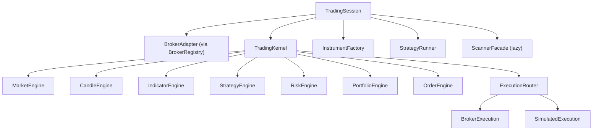
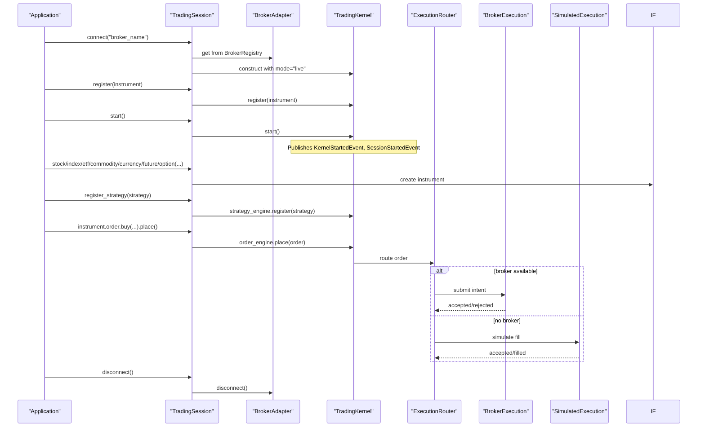
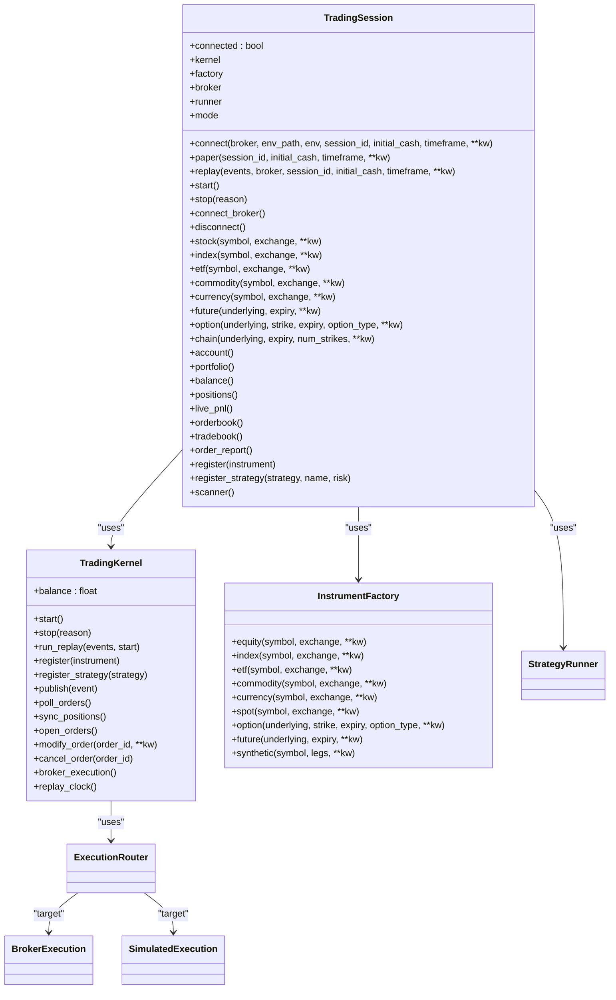

# Trading Session API

<cite>
**Referenced Files in This Document**
- [trading_session.py](file://ntrade/kernel/trading_session.py)
- [session.py](file://ntrade/domain/session.py)
- [facade.py](file://ntrade/facade.py)
- [__init__.py](file://ntrade/__init__.py)
- [session.py](file://ntrade/kernel/session.py)
- [factories.py](file://ntrade/factories.py)
- [base.py](file://ntrade/domain/instruments/base.py)
- [cash.py](file://ntrade/domain/instruments/cash.py)
- [derivatives.py](file://ntrade/domain/instruments/derivatives.py)
- [capabilities.py](file://ntrade/domain/instruments/capabilities.py)
- [stream.py](file://ntrade/domain/market/stream.py)
- [base.py](file://ntrade/events/base.py)
- [market.py](file://ntrade/events/market.py)
- [order.py](file://ntrade/domain/orders/order.py)
- [registry.py](file://ntrade/registry.py)
- [test_trading_session.py](file://tests/test_trading_session.py)
</cite>

## Table of Contents
1. [Introduction](#introduction)
2. [Project Structure](#project-structure)
3. [Core Components](#core-components)
4. [Architecture Overview](#architecture-overview)
5. [Detailed Component Analysis](#detailed-component-analysis)
6. [Dependency Analysis](#dependency-analysis)
7. [Performance Considerations](#performance-considerations)
8. [Troubleshooting Guide](#troubleshooting-guide)
9. [Conclusion](#conclusion)
10. [Appendices](#appendices)

## Introduction
This document provides comprehensive API documentation for the TradingSession class, the preferred modern entry point to nTrade. It covers session lifecycle (connect/disconnect/state), instrument creation across all asset types, market data access, portfolio and order management, event subscription mechanisms, asynchronous handling, configuration options, examples, error handling, and debugging techniques.

## Project Structure
TradingSession is a unified facade that composes:
- Broker connection via BrokerRegistry
- Kernel orchestration via TradingKernel
- Instrument creation via InstrumentFactory
- Strategy execution via StrategyRunner
- Scanner facade for scanning capabilities

**Diagram sources**
- [trading_session.py:39-143](file://ntrade/kernel/trading_session.py#L39-L143)
- [session.py:38-101](file://ntrade/kernel/session.py#L38-L101)

**Section sources**
- [trading_session.py:39-143](file://ntrade/kernel/trading_session.py#L39-L143)
- [session.py:38-101](file://ntrade/kernel/session.py#L38-L101)

## Core Components
- TradingSession: Unified entry point with constructors connect(), paper(), replay() and lifecycle methods start(), stop(), connect_broker(), disconnect(), connected property.
- TradingKernel: Orchestrates engines, event bus, clock, context, execution routing, and replay/live modes.
- InstrumentFactory: Creates Equity/Index/ETF/Commodity/Currency/Future/Option/Synthetic instruments through SymbolMaster flyweight cache.
- Instrument base and derivatives: Base Instrument with capabilities (market, trade, stream, analytics, derivatives, extension). Derivatives include Future and Option with analytics helpers.
- StreamCapability and LiveStream: Subscription lifecycle and per-instrument streaming callbacks.
- Order model and facade: Fluent order building and broker-backed placement/modification/cancellation.
- Event system: Immutable events with kernel-clock timestamps; market events include TickEvent, QuoteEvent, DepthEvent, CandleClosedEvent, QuoteUpdatedEvent, IndicatorUpdatedEvent.

**Section sources**
- [trading_session.py:39-143](file://ntrade/kernel/trading_session.py#L39-L143)
- [session.py:38-101](file://ntrade/kernel/session.py#L38-L101)
- [factories.py:20-67](file://ntrade/factories.py#L20-L67)
- [base.py:50-152](file://ntrade/domain/instruments/base.py#L50-L152)
- [derivatives.py:16-245](file://ntrade/domain/instruments/derivatives.py#L16-L245)
- [capabilities.py:37-383](file://ntrade/domain/instruments/capabilities.py#L37-L383)
- [stream.py:27-131](file://ntrade/domain/market/stream.py#L27-L131)
- [order.py:44-173](file://ntrade/domain/orders/order.py#L44-L173)
- [base.py:16-22](file://ntrade/events/base.py#L16-L22)
- [market.py:11-83](file://ntrade/events/market.py#L11-L83)

## Architecture Overview
The TradingSession composes broker connectivity, kernel orchestration, and strategy execution into a single cohesive API. Instruments are created via factory and registered with the kernel. Market data flows through the event bus into engines and capabilities. Orders flow through the order engine to an execution router which selects live or simulated targets.

**Diagram sources**
- [trading_session.py:73-143](file://ntrade/kernel/trading_session.py#L73-L143)
- [session.py:120-146](file://ntrade/kernel/session.py#L120-L146)
- [factories.py:28-67](file://ntrade/factories.py#L28-L67)
- [order.py:118-173](file://ntrade/domain/orders/order.py#L118-L173)

## Detailed Component Analysis

### TradingSession Lifecycle and State Management
- Constructors:
  - connect(broker, env_path, env, session_id, initial_cash, timeframe, **kw): returns a live session using BrokerRegistry.get(broker, ...).
  - paper(session_id, initial_cash, timeframe, **kw): returns a paper-trading session with PaperBroker seeded with initial cash.
  - replay(events, broker, session_id, initial_cash, timeframe, **kw): returns a replay session with ReplayClock and preloaded events.
- Lifecycle:
  - start(): starts the kernel; if replay mode, runs replay events through the kernel.
  - stop(reason=""): stops the kernel and flushes state.
  - connect_broker(): explicitly connects the broker adapter.
  - disconnect(): disconnects the broker adapter.
  - connected: boolean indicating broker.connected when broker exists.
- Mode:
  - mode property indicates "live", "paper", or "replay".

**Section sources**
- [trading_session.py:73-143](file://ntrade/kernel/trading_session.py#L73-L143)
- [trading_session.py:240-299](file://ntrade/kernel/trading_session.py#L240-L299)

### Instrument Creation Methods
All methods delegate to InstrumentFactory and return typed instruments:
- stock(symbol, exchange=None, **kw) -> Equity
- index(symbol, exchange=None, **kw) -> Index
- etf(symbol, exchange=None, **kw) -> ETF
- commodity(symbol, exchange=None, **kw) -> Commodity
- currency(symbol, exchange=None, **kw) -> Currency
- future(underlying, expiry, **kw) -> Future
- option(underlying, strike, expiry, option_type, **kw) -> Option
- chain(underlying, expiry=0, num_strikes=10, **kw) -> OptionChain (delegates to underlying.derivatives.option_chain)

Notes:
- Symbols are resolved via SymbolMaster for flyweight caching.
- Derivatives link underlying instruments and support analytics (greeks, implied vol, etc.).

**Section sources**
- [trading_session.py:146-222](file://ntrade/kernel/trading_session.py#L146-L222)
- [factories.py:28-67](file://ntrade/factories.py#L28-L67)
- [cash.py:8-50](file://ntrade/domain/instruments/cash.py#L8-L50)
- [derivatives.py:16-245](file://ntrade/domain/instruments/derivatives.py#L16-L245)

### Market Data Access
Instrument capabilities provide read-only views and refresh operations:
- instrument.market.quote(), history(), candles(), depth()
- Scalars: ltp(), bid(), ask(), volume(), oi(), vwap(), prev_close(), spread(), mid_price()
- Staleness check: is_stale(max_age_seconds, now=None)
- Refresh: instrument.market.refresh() pulls latest quote/depth from broker

Streaming:
- instrument.stream.subscribe()/unsubscribe()
- Callback registration: on_tick(cb), on_quote(cb), on_trade(cb), on_depth(cb), on_disconnect(cb), on_reconnect(cb)
- Buffering: ticks(limit), last_tick, live_ticks_df
- Live state: is_live, is_subscribed

**Section sources**
- [capabilities.py:37-101](file://ntrade/domain/instruments/capabilities.py#L37-L101)
- [stream.py:27-131](file://ntrade/domain/market/stream.py#L27-L131)
- [base.py:169-184](file://ntrade/domain/instruments/base.py#L169-L184)

### Portfolio and Account Management
TradingSession exposes account/portfolio/balance/positions/orderbook/tradebook/order_report:
- account(): returns Account composite (from broker or kernel context)
- portfolio(): returns Portfolio composite (from broker or kernel context)
- balance(): float balance (from broker or kernel context)
- positions(): current positions (from broker or kernel context)
- live_pnl(): live PnL (from broker or 0.0 in sim)
- orderbook(), tradebook(), order_report(): broker-specific order/trade snapshots

**Section sources**
- [trading_session.py:176-217](file://ntrade/kernel/trading_session.py#L176-L217)

### Order Execution Interfaces
Fluent order building via instrument.trade.* and instrument.order.*:
- instrument.trade.buy().market().quantity(n).price(p).target(t).stop_loss(s).place()
- instrument.trade.sell().limit(price).product(product).place()
- instrument.order.buy/sell/limit/market/stop/cover/bracket(place)
- Order properties: side, quantity, order_type, trade_type, price, trigger_price, target_price, stop_loss_price, status, filled_qty, avg_price
- Order lifecycle: cancel(), modify(**kw), refresh(), executed_price(), executed_price_and_time()

Execution routing:
- In live mode, orders go through BrokerExecution; in simulation, SimulatedExecution applies slippage and generates fills deterministically.

**Section sources**
- [capabilities.py:106-207](file://ntrade/domain/instruments/capabilities.py#L106-L207)
- [order.py:44-173](file://ntrade/domain/orders/order.py#L44-L173)
- [session.py:148-190](file://ntrade/kernel/session.py#L148-L190)

### Event Subscription Mechanisms
Events are immutable dataclasses with kernel-clock timestamps:
- Base Event(ts, event_id)
- Market events: TickEvent, QuoteEvent, DepthEvent, CandleClosedEvent, QuoteUpdatedEvent, IndicatorUpdatedEvent
- Lifecycle events: KernelStartedEvent, SessionStartedEvent, SessionStoppedEvent, RunnerStartedEvent, RunnerStoppedEvent, HeartbeatEvent, FeedDisconnectedEvent
- Order events: OrderIntentEvent, OrderAcceptedEvent, OrderRejectedEvent, OrderFilledEvent, OrderUpdatedEvent, OrderTimeoutEvent
- Portfolio events: BalanceChangedEvent, PositionUpdatedEvent
- Risk events: SignalGeneratedEvent, SignalApprovedEvent, SignalRejectedEvent, RiskHaltedEvent, RiskResumedEvent

Subscription patterns:
- Per-instrument streaming via instrument.stream.on_* callbacks
- Kernel-level event bus subscriptions via EventBus (advanced usage)

**Section sources**
- [base.py:16-22](file://ntrade/events/base.py#L16-L22)
- [market.py:11-83](file://ntrade/events/market.py#L11-L83)
- [__init__.py:25-43](file://ntrade/__init__.py#L25-L43)
- [stream.py:83-104](file://ntrade/domain/market/stream.py#L83-L104)

### Configuration Options
TradingSession constructor and kernel options:
- mode: "live", "paper", "replay"
- session_id: unique identifier for session
- initial_cash: seed balance for paper/backtest
- timeframe: candle aggregation interval (e.g., "1m")
- broker: optional explicit BrokerAdapter instance
- kernel_kw: passed to TradingKernel (bus, clock, store, statutory costs)

Replay configuration:
- replay(events, broker, session_id, initial_cash, timeframe, clock=ReplayClock)

Paper trading configuration:
- paper(session_id, initial_cash, timeframe, **kw) seeds PaperBroker with initial_cash

Live broker configuration:
- connect(broker, env_path=".env", env=None, session_id, initial_cash, timeframe, **kw) uses BrokerRegistry.get(broker, ...)

**Section sources**
- [trading_session.py:46-143](file://ntrade/kernel/trading_session.py#L46-L143)
- [session.py:42-101](file://ntrade/kernel/session.py#L42-L101)
- [registry.py:61-84](file://ntrade/registry.py#L61-L84)

### Examples
- Session initialization:
  - Live session: session = TradingSession.connect("dhan")
  - Paper session: session = TradingSession.paper(initial_cash=500_000.0)
  - Replay session: session = TradingSession.replay(events, session_id="replay")
- Instrument creation:
  - equity = session.stock("TCS")
  - index = session.index("NIFTY")
  - etf = session.etf("NIFTYBEES")
  - commodity = session.commodity("GOLD")
  - currency = session.currency("USDINR")
  - future = session.future(index, expiry=date(2026, 12, 31))
  - option = session.option(future, strike=19000, expiry=date(2026, 12, 31), option_type="CE")
- Market data streaming:
  - equity.stream.subscribe()
  - equity.stream.on_quote(lambda tick: print(tick.ltp))
  - equity.market.refresh()
- Order execution:
  - equity.trade.buy().market().quantity(100).place()
  - equity.order.limit("BUY", 100, price=1200).place()
- Cleanup:
  - session.stop(reason="done")
  - session.disconnect()

[No sources needed since this section aggregates previously analyzed functionality]

## Dependency Analysis
TradingSession depends on:
- BrokerRegistry for broker instantiation
- InstrumentFactory for instrument creation
- TradingKernel for orchestration
- StrategyRunner for strategy lifecycle
- ScannerFacade for scanning (lazy)

TradingKernel depends on:
- EventBus, TradingClock, TradingContext
- Engines: Market, Candle, Indicator, Strategy, Risk, Portfolio, Order
- ExecutionRouter with BrokerExecution or SimulatedExecution

**Diagram sources**
- [trading_session.py:39-143](file://ntrade/kernel/trading_session.py#L39-L143)
- [session.py:38-101](file://ntrade/kernel/session.py#L38-L101)
- [factories.py:20-67](file://ntrade/factories.py#L20-L67)

**Section sources**
- [trading_session.py:39-143](file://ntrade/kernel/trading_session.py#L39-L143)
- [session.py:38-101](file://ntrade/kernel/session.py#L38-L101)
- [factories.py:20-67](file://ntrade/factories.py#L20-L67)

## Performance Considerations
- Flyweight instruments via SymbolMaster reduce memory and ensure shared state for subscriptions and metadata.
- Capability objects are cached_property instances on Instrument to avoid repeated construction overhead.
- Streaming buffers up to 10k ticks per instrument; use ticks(limit) to control memory usage.
- Replay mode ensures deterministic behavior by driving the clock from events; prefer ReplayClock for backtesting parity.
- Statutory cost defaults in simulated execution align paper/backtest PnL with live expectations; set statutory=None for zero-cost simulation.

[No sources needed since this section provides general guidance]

## Troubleshooting Guide
Common issues and resolutions:
- No broker adapter available:
  - Ensure broker is registered via BrokerRegistry.get(name) and that the broker supports required methods.
  - For paper mode, confirm PaperBroker is available.
- Order rejection without reason:
  - Capture stdout around broker calls to inspect raw responses; many brokers print reasons only to stdout.
  - Log request payloads and raw replies on every attempt, especially failures.
- Stale quotes:
  - Use instrument.market.is_stale(max_age_seconds) to detect stale data; call refresh() to pull fresh quotes.
- Streaming not receiving events:
  - Verify subscribe() called and broker is connected; check is_live and is_subscribed states.
  - Ensure callbacks do not raise exceptions; errors are swallowed to keep streams alive.
- Replay not deterministic:
  - Confirm ReplayClock is used and events have correct timestamps; avoid datetime.now() in strategies.

**Section sources**
- [registry.py:61-84](file://ntrade/registry.py#L61-L84)
- [stream.py:97-104](file://ntrade/domain/market/stream.py#L97-L104)
- [base.py:169-184](file://ntrade/domain/instruments/base.py#L169-L184)

## Conclusion
TradingSession provides a clean, unified interface to manage broker connections, instrument lifecycles, market data streaming, portfolio and order management, and strategy execution. Its composition-based architecture ensures flexibility across live, paper, and replay modes while maintaining deterministic behavior and robust error handling.

[No sources needed since this section summarizes without analyzing specific files]

## Appendices

### Legacy Facade Compatibility
The legacy Market facade delegates to TradingSession for backward compatibility, exposing equivalent methods for instruments, account, portfolio, and lifecycle.

**Section sources**
- [facade.py:27-101](file://ntrade/facade.py#L27-L101)

### Public API Exports
ntrade.__init__ exports core classes including TradingSession, Instrument types, events, kernels, execution components, and utilities for convenience.

**Section sources**
- [__init__.py:1-105](file://ntrade/__init__.py#L1-L105)

### Test References
Tests validate session construction, paper mode behavior, and basic integration patterns.

**Section sources**
- [test_trading_session.py:20-37](file://tests/test_trading_session.py#L20-L37)