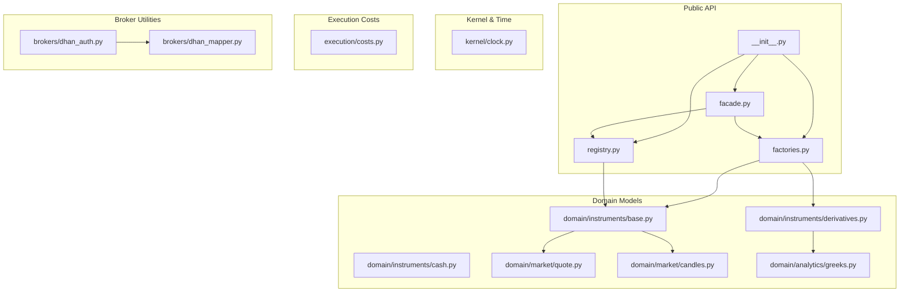
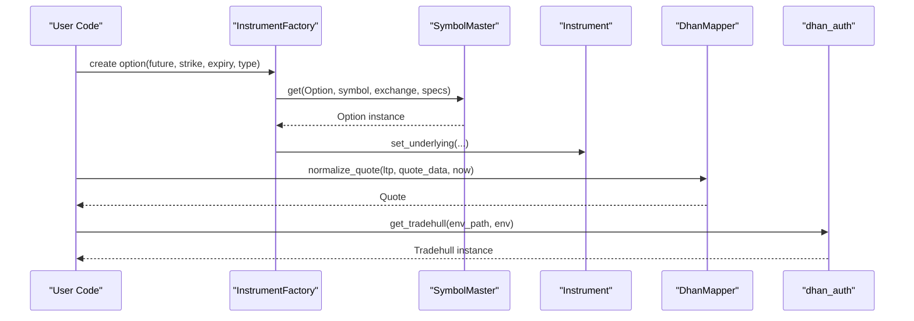
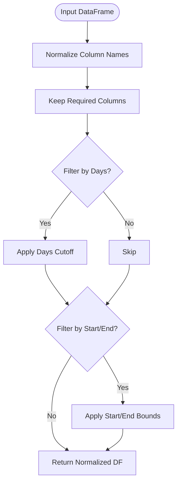
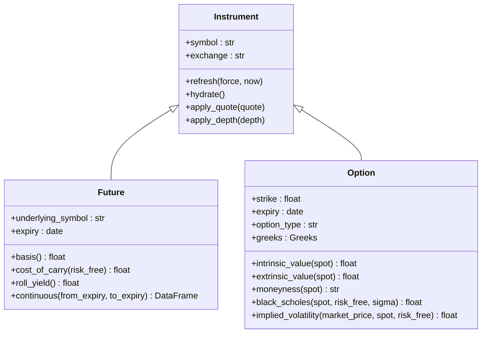
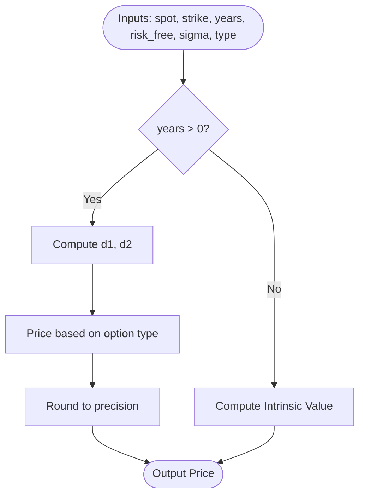
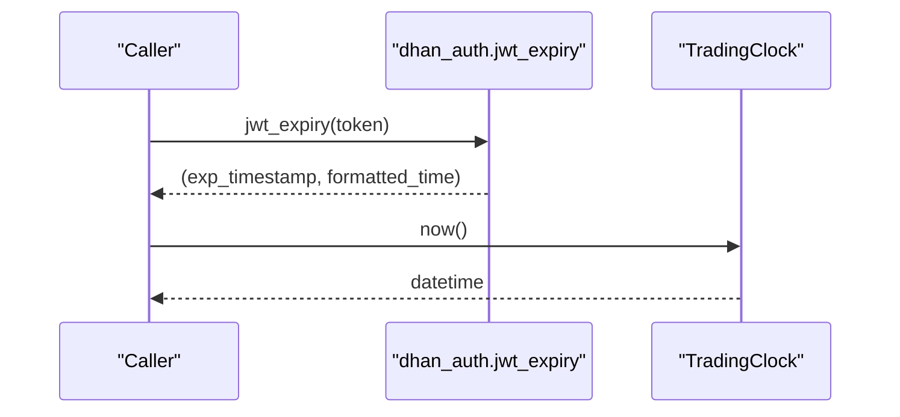
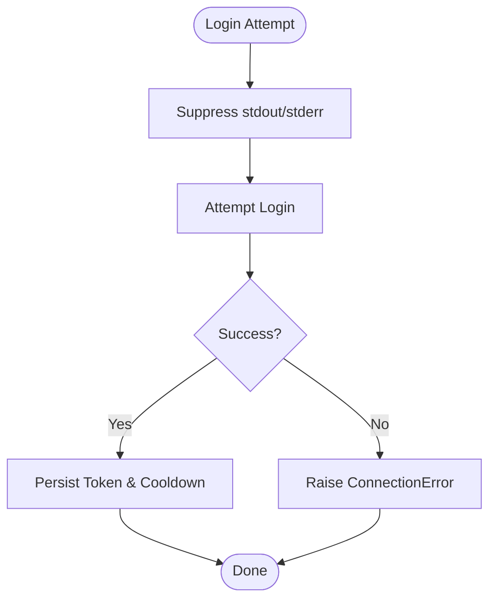
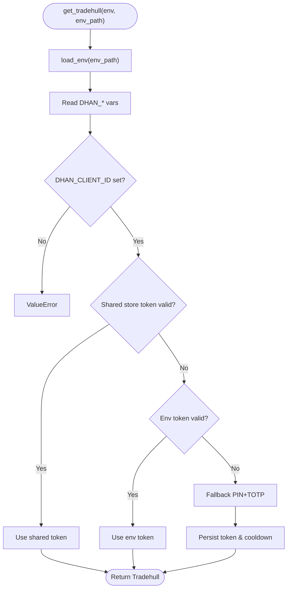
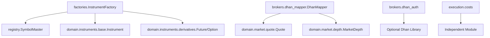

# Utility Functions

<cite>
**Referenced Files in This Document**
- [ntrade/__init__.py](file://ntrade/__init__.py)
- [ntrade/facade.py](file://ntrade/facade.py)
- [ntrade/factories.py](file://ntrade/factories.py)
- [ntrade/registry.py](file://ntrade/registry.py)
- [ntrade/domain/instruments/base.py](file://ntrade/domain/instruments/base.py)
- [ntrade/domain/instruments/cash.py](file://ntrade/domain/instruments/cash.py)
- [ntrade/domain/instruments/derivatives.py](file://ntrade/domain/instruments/derivatives.py)
- [ntrade/domain/market/quote.py](file://ntrade/domain/market/quote.py)
- [ntrade/domain/market/candles.py](file://ntrade/domain/market/candles.py)
- [ntrade/domain/analytics/greeks.py](file://ntrade/domain/analytics/greeks.py)
- [ntrade/kernel/clock.py](file://ntrade/kernel/clock.py)
- [ntrade/execution/costs.py](file://ntrade/execution/costs.py)
- [ntrade/brokers/dhan_auth.py](file://ntrade/brokers/dhan_auth.py)
- [ntrade/brokers/dhan_mapper.py](file://ntrade/brokers/dhan_mapper.py)
</cite>

## Table of Contents
1. Introduction
2. Project Structure
3. Core Components
4. Architecture Overview
5. Detailed Component Analysis
6. Dependency Analysis
7. Performance Considerations
8. Troubleshooting Guide
9. Conclusion
10. Appendices

## Introduction
This document provides comprehensive documentation for nTrade’s utility functions and helper methods exposed through the public API. It focuses on symbol parsing utilities, exchange mapping functions, instrument validation helpers, time zone conversion functions, date formatting utilities, financial calculations, logging configuration, debugging tools, performance monitoring utilities, configuration helpers for environment variables, file path resolution, settings management, error handling patterns, input validation, best practices, and deprecated function guidance. The goal is to make these utilities accessible to both new users and experienced developers building strategies or custom integrations.

## Project Structure
The utility surface spans several modules:
- Public API surface and versioning are centralized in the package init.
- Legacy facade exposes a simple entry point that delegates to the unified session.
- Factories provide object creation for instruments and options.
- Registry implements flyweight caching and broker registration.
- Domain models include instruments, quotes, candles, and analytics.
- Kernel provides deterministic time sources.
- Execution includes cost models and statutory charges.
- Broker utilities include authentication helpers and data mappers.

**Diagram sources**
- [ntrade/__init__.py:1-105](file://ntrade/__init__.py#L1-L105)
- [ntrade/facade.py:1-101](file://ntrade/facade.py#L1-L101)
- [ntrade/factories.py:1-84](file://ntrade/factories.py#L1-L84)
- [ntrade/registry.py:1-125](file://ntrade/registry.py#L1-L125)
- [ntrade/domain/instruments/base.py:1-305](file://ntrade/domain/instruments/base.py#L1-L305)
- [ntrade/domain/instruments/cash.py:1-50](file://ntrade/domain/instruments/cash.py#L1-L50)
- [ntrade/domain/instruments/derivatives.py:1-245](file://ntrade/domain/instruments/derivatives.py#L1-L245)
- [ntrade/domain/market/quote.py:1-91](file://ntrade/domain/market/quote.py#L1-L91)
- [ntrade/domain/market/candles.py:1-67](file://ntrade/domain/market/candles.py#L1-L67)
- [ntrade/domain/analytics/greeks.py:1-120](file://ntrade/domain/analytics/greeks.py#L1-L120)
- [ntrade/kernel/clock.py:1-55](file://ntrade/kernel/clock.py#L1-L55)
- [ntrade/execution/costs.py:1-285](file://ntrade/execution/costs.py#L1-L285)
- [ntrade/brokers/dhan_auth.py:1-173](file://ntrade/brokers/dhan_auth.py#L1-L173)
- [ntrade/brokers/dhan_mapper.py:1-356](file://ntrade/brokers/dhan_mapper.py#L1-L356)

**Section sources**
- [ntrade/__init__.py:1-105](file://ntrade/__init__.py#L1-L105)
- [ntrade/facade.py:1-101](file://ntrade/facade.py#L1-L101)
- [ntrade/factories.py:1-84](file://ntrade/factories.py#L1-L84)
- [ntrade/registry.py:1-125](file://ntrade/registry.py#L1-L125)

## Core Components
- Symbol parsing and exchange mapping:
  - DhanMapper maps user-facing timeframes to broker intervals and constructs tradingsymbols for options using standardized formats.
  - Exchange mapping normalizes derivative exchanges (e.g., NFO/BFO/CUR) to canonical cash exchanges for consistent lookups.
- Instrument validation helpers:
  - Option enforces option_type values and validates strike/expiry usage; Greeks properties ensure safe access even when not computed.
  - Futures provide basis, cost-of-carry, roll yield, and continuous series helpers.
- Financial calculations:
  - Black-Scholes pricing engine computes price, greeks, and implied volatility with robust edge-case handling.
  - IndianStatutoryCosts models STT, exchange charges, SEBI fee, GST, and stamp duty; FuturesCarryCosts models carry and roll costs.
- Time and date utilities:
  - TradingClock provides deterministic time sources for live, replay, and simulation environments.
  - Quote timestamping supports staleness checks and timezone-aware conversions via JWT expiry parsing.
- Configuration and environment:
  - load_env reads .env files; get_tradehull orchestrates credential discovery, token caching, and fallback flows.
  - File path resolution uses pathlib for robust cross-platform paths.
- Logging and debugging:
  - Dhan auth suppresses noisy logs during login attempts; shared stores persist tokens and cooldown state securely.
- Error handling and input validation:
  - Centralized normalization helpers guard against malformed inputs; explicit exceptions for unsupported parameters.

**Section sources**
- [ntrade/brokers/dhan_mapper.py:1-356](file://ntrade/brokers/dhan_mapper.py#L1-L356)
- [ntrade/domain/instruments/derivatives.py:1-245](file://ntrade/domain/instruments/derivatives.py#L1-L245)
- [ntrade/domain/analytics/greeks.py:1-120](file://ntrade/domain/analytics/greeks.py#L1-L120)
- [ntrade/execution/costs.py:1-285](file://ntrade/execution/costs.py#L1-L285)
- [ntrade/kernel/clock.py:1-55](file://ntrade/kernel/clock.py#L1-L55)
- [ntrade/brokers/dhan_auth.py:1-173](file://ntrade/brokers/dhan_auth.py#L1-L173)

## Architecture Overview
The utility layer integrates across domain objects, execution, and broker adapters. Key interactions:
- Factories use SymbolMaster to cache instrument instances and pass broker context.
- DhanMapper transforms raw broker responses into domain-typed objects (Quote, Depth, OrderBook).
- TradingClock abstracts time for deterministic behavior across environments.
- Cost models compute realistic PnL adjustments for backtests and simulations.

**Diagram sources**
- [ntrade/factories.py:1-84](file://ntrade/factories.py#L1-L84)
- [ntrade/registry.py:1-125](file://ntrade/registry.py#L1-L125)
- [ntrade/domain/instruments/derivatives.py:1-245](file://ntrade/domain/instruments/derivatives.py#L1-L245)
- [ntrade/brokers/dhan_mapper.py:1-356](file://ntrade/brokers/dhan_mapper.py#L1-L356)
- [ntrade/brokers/dhan_auth.py:1-173](file://ntrade/brokers/dhan_auth.py#L1-L173)

## Detailed Component Analysis

### Symbol Parsing and Exchange Mapping (DhanMapper)
- Timeframe mapping: Converts user-friendly timeframes to broker-specific interval strings with validation.
- Tradingsymbol construction: Builds standardized option symbols from underlying, strike, expiry, and type.
- History normalization: Standardizes column names and filters by days/start/end with timezone awareness.
- Order/trade book normalization: Maps varied field names into consistent structures.
- Portfolio normalization: Transforms positions and holdings DataFrames into domain objects.
- Depth normalization: Aggregates bid/ask levels into MarketDepth.

**Diagram sources**
- [ntrade/brokers/dhan_mapper.py:97-136](file://ntrade/brokers/dhan_mapper.py#L97-L136)

**Section sources**
- [ntrade/brokers/dhan_mapper.py:23-73](file://ntrade/brokers/dhan_mapper.py#L23-L73)
- [ntrade/brokers/dhan_mapper.py:97-136](file://ntrade/brokers/dhan_mapper.py#L97-L136)
- [ntrade/brokers/dhan_mapper.py:139-171](file://ntrade/brokers/dhan_mapper.py#L139-L171)
- [ntrade/brokers/dhan_mapper.py:174-215](file://ntrade/brokers/dhan_mapper.py#L174-L215)
- [ntrade/brokers/dhan_mapper.py:218-240](file://ntrade/brokers/dhan_mapper.py#L218-L240)

### Instrument Validation Helpers
- Option validation: Enforces option_type values and ensures valid strikes/expiries; provides safe greeks accessors.
- Futures analytics: Basis calculation, cost-of-carry approximation, roll yield, and continuous series generation.
- Synthetic instruments: Composite payoff aggregation and decomposition.

**Diagram sources**
- [ntrade/domain/instruments/base.py:50-210](file://ntrade/domain/instruments/base.py#L50-L210)
- [ntrade/domain/instruments/derivatives.py:16-107](file://ntrade/domain/instruments/derivatives.py#L16-L107)
- [ntrade/domain/instruments/derivatives.py:109-224](file://ntrade/domain/instruments/derivatives.py#L109-L224)

**Section sources**
- [ntrade/domain/instruments/derivatives.py:16-107](file://ntrade/domain/instruments/derivatives.py#L16-L107)
- [ntrade/domain/instruments/derivatives.py:109-224](file://ntrade/domain/instruments/derivatives.py#L109-L224)

### Financial Calculations (Black-Scholes and Greeks)
- Pricing engine: Computes option prices using Black-Scholes with dividend support and edge-case handling.
- Greeks computation: Delta, gamma, theta, vega, rho with normalized outputs.
- Implied volatility solver: Bisection method with tolerance and iteration limits; returns sentinel for no solution.

**Diagram sources**
- [ntrade/domain/analytics/greeks.py:46-66](file://ntrade/domain/analytics/greeks.py#L46-L66)

**Section sources**
- [ntrade/domain/analytics/greeks.py:1-120](file://ntrade/domain/analytics/greeks.py#L1-L120)

### Time Zone Conversion and Date Formatting
- JWT expiry parsing: Extracts expiration timestamp and formats human-readable expiry string with timezone conversion.
- Quote staleness: Checks if timestamps exceed max age relative to provided or current time.
- Deterministic clocks: Live, replay, and simulation clocks ensure consistent time sources across environments.

**Diagram sources**
- [ntrade/brokers/dhan_auth.py:47-56](file://ntrade/brokers/dhan_auth.py#L47-L56)
- [ntrade/kernel/clock.py:14-55](file://ntrade/kernel/clock.py#L14-L55)
- [ntrade/domain/market/quote.py:59-64](file://ntrade/domain/market/quote.py#L59-L64)

**Section sources**
- [ntrade/brokers/dhan_auth.py:47-56](file://ntrade/brokers/dhan_auth.py#L47-L56)
- [ntrade/kernel/clock.py:14-55](file://ntrade/kernel/clock.py#L14-L55)
- [ntrade/domain/market/quote.py:59-64](file://ntrade/domain/market/quote.py#L59-L64)

### Logging Configuration and Debugging Tools
- Log suppression: During Dhan login attempts, stdout/stderr are suppressed to avoid noisy output.
- Shared store persistence: Tokens and cooldown states are persisted securely with appropriate permissions.
- Cooldown enforcement: Prevents rapid TOTP attempts via shared cooldown file.

**Diagram sources**
- [ntrade/brokers/dhan_auth.py:114-167](file://ntrade/brokers/dhan_auth.py#L114-L167)

**Section sources**
- [ntrade/brokers/dhan_auth.py:114-167](file://ntrade/brokers/dhan_auth.py#L114-L167)

### Performance Monitoring Utilities
- Deterministic clocks enable reproducible runs for benchmarking and backtesting.
- Quote staleness checks help monitor data freshness in live streams.
- Event-driven updates reduce unnecessary broker calls, improving efficiency.

[No sources needed since this section provides general guidance]

### Configuration Helpers for Environment Variables, File Path Resolution, Settings Management
- Environment loading: load_env reads .env files using dotenv.
- Credential orchestration: get_tradehull discovers credentials, validates tokens, and falls back to PIN+TOTP.
- File path resolution: Uses pathlib for robust cross-platform operations and secure file permissions.

**Diagram sources**
- [ntrade/brokers/dhan_auth.py:42-45](file://ntrade/brokers/dhan_auth.py#L42-L45)
- [ntrade/brokers/dhan_auth.py:114-167](file://ntrade/brokers/dhan_auth.py#L114-L167)

**Section sources**
- [ntrade/brokers/dhan_auth.py:42-45](file://ntrade/brokers/dhan_auth.py#L42-L45)
- [ntrade/brokers/dhan_auth.py:114-167](file://ntrade/brokers/dhan_auth.py#L114-L167)

### Examples of Using Utility Functions in Strategy Development and Custom Integrations
- Creating instruments via factories and SymbolMaster caching for efficient reuse.
- Normalizing market data with DhanMapper for consistent downstream processing.
- Applying cost models for realistic backtest PnL calculations.
- Using deterministic clocks for reproducible strategy testing.

[No sources needed since this section provides general guidance]

### Error Handling Patterns and Input Validation
- Explicit exceptions for missing credentials, unsupported timeframes, and invalid option types.
- Robust normalization helpers handle missing or malformed fields gracefully.
- Sentinel values distinguish “not computed” from zero values in analytics.

**Section sources**
- [ntrade/brokers/dhan_mapper.py:64-73](file://ntrade/brokers/dhan_mapper.py#L64-L73)
- [ntrade/domain/instruments/derivatives.py:126-135](file://ntrade/domain/instruments/derivatives.py#L126-L135)
- [ntrade/domain/analytics/greeks.py:8-11](file://ntrade/domain/analytics/greeks.py#L8-L11)

### Best Practices for Using Utility Functions
- Prefer factory methods over direct instantiation to leverage caching and broker context.
- Always supply timezone-aware timestamps for deterministic behavior.
- Use cost models consistently across backtests and simulations for convergence.
- Validate inputs early and rely on normalization helpers for robustness.

[No sources needed since this section provides general guidance]

### Deprecated Functions and Replacements
- Legacy Market facade is maintained for backward compatibility but prefers TradingSession for new code.
- Direct datetime.now() usage should be replaced with TradingClock for reproducibility.

**Section sources**
- [ntrade/facade.py:1-18](file://ntrade/facade.py#L1-L18)
- [ntrade/kernel/clock.py:1-7](file://ntrade/kernel/clock.py#L1-L7)

## Dependency Analysis
Key dependencies and relationships:
- Factories depend on SymbolMaster for instrument caching.
- DhanMapper depends on domain models for normalization.
- Authentication helpers depend on optional Dhan library with graceful degradation.
- Cost models are independent and reusable across execution layers.

**Diagram sources**
- [ntrade/factories.py:1-84](file://ntrade/factories.py#L1-L84)
- [ntrade/registry.py:1-125](file://ntrade/registry.py#L1-L125)
- [ntrade/brokers/dhan_mapper.py:1-356](file://ntrade/brokers/dhan_mapper.py#L1-L356)
- [ntrade/brokers/dhan_auth.py:1-173](file://ntrade/brokers/dhan_auth.py#L1-L173)
- [ntrade/execution/costs.py:1-285](file://ntrade/execution/costs.py#L1-L285)

**Section sources**
- [ntrade/factories.py:1-84](file://ntrade/factories.py#L1-L84)
- [ntrade/registry.py:1-125](file://ntrade/registry.py#L1-L125)
- [ntrade/brokers/dhan_mapper.py:1-356](file://ntrade/brokers/dhan_mapper.py#L1-L356)
- [ntrade/brokers/dhan_auth.py:1-173](file://ntrade/brokers/dhan_auth.py#L1-L173)
- [ntrade/execution/costs.py:1-285](file://ntrade/execution/costs.py#L1-L285)

## Performance Considerations
- Use SymbolMaster caching to avoid redundant instrument creation.
- Leverage deterministic clocks for reproducible benchmarks.
- Normalize data once and reuse transformed objects to minimize overhead.
- Employ staleness checks to avoid excessive broker calls.

[No sources needed since this section provides general guidance]

## Troubleshooting Guide
- Missing credentials: Ensure DHAN_CLIENT_ID is set; check .env file path.
- Token expiry: Verify shared store token validity and buffer settings.
- Unsupported timeframes: Use supported intervals (1m, 2m, 3m, 4m, 5m, 15m, 25m, 60m, DAY).
- Invalid option types: Only CE and PE are allowed.
- No solution for IV: Check market price bounds and input parameters.

**Section sources**
- [ntrade/brokers/dhan_auth.py:127-128](file://ntrade/brokers/dhan_auth.py#L127-L128)
- [ntrade/brokers/dhan_mapper.py:64-73](file://ntrade/brokers/dhan_mapper.py#L64-L73)
- [ntrade/domain/analytics/greeks.py:102-106](file://ntrade/domain/analytics/greeks.py#L102-L106)

## Conclusion
nTrade’s utility functions provide a robust foundation for symbol parsing, instrument validation, financial calculations, time management, configuration, and error handling. By following best practices and leveraging the documented helpers, developers can build reliable strategies and integrations with consistent behavior across live, replay, and backtest environments.

[No sources needed since this section summarizes without analyzing specific files]

## Appendices
- Version information: Accessible via __version__ in the package init.
- Public API surface: Comprehensive exports defined in __all__ for easy discovery.

**Section sources**
- [ntrade/__init__.py:70-104](file://ntrade/__init__.py#L70-L104)