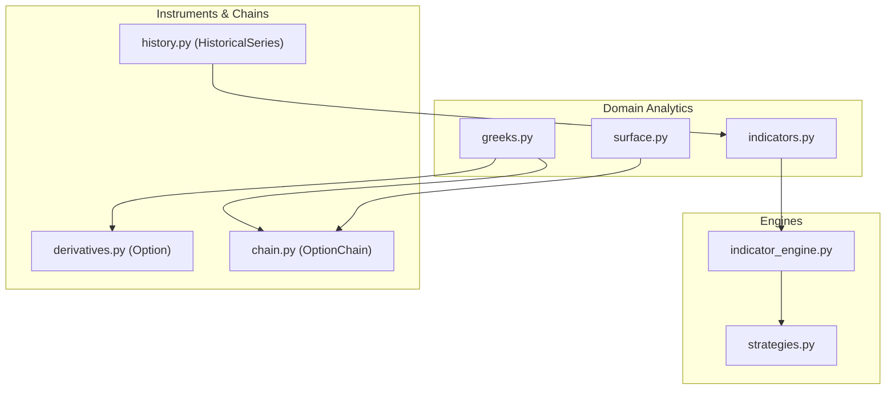
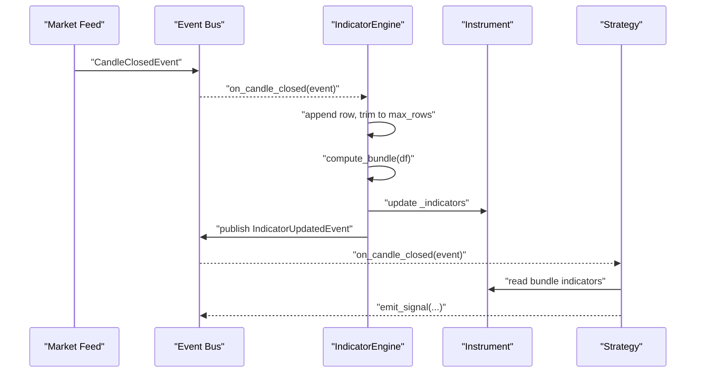
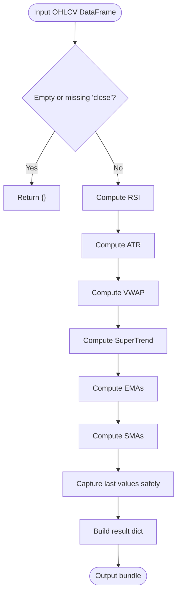
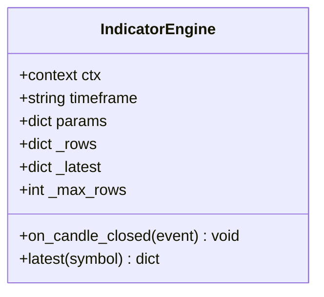
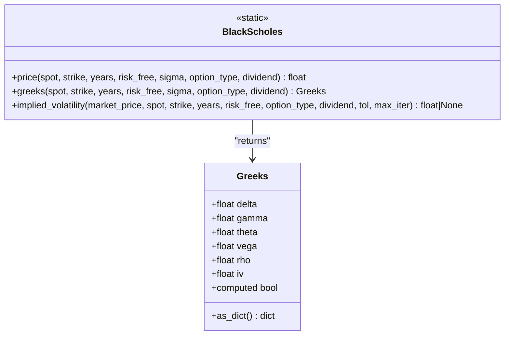
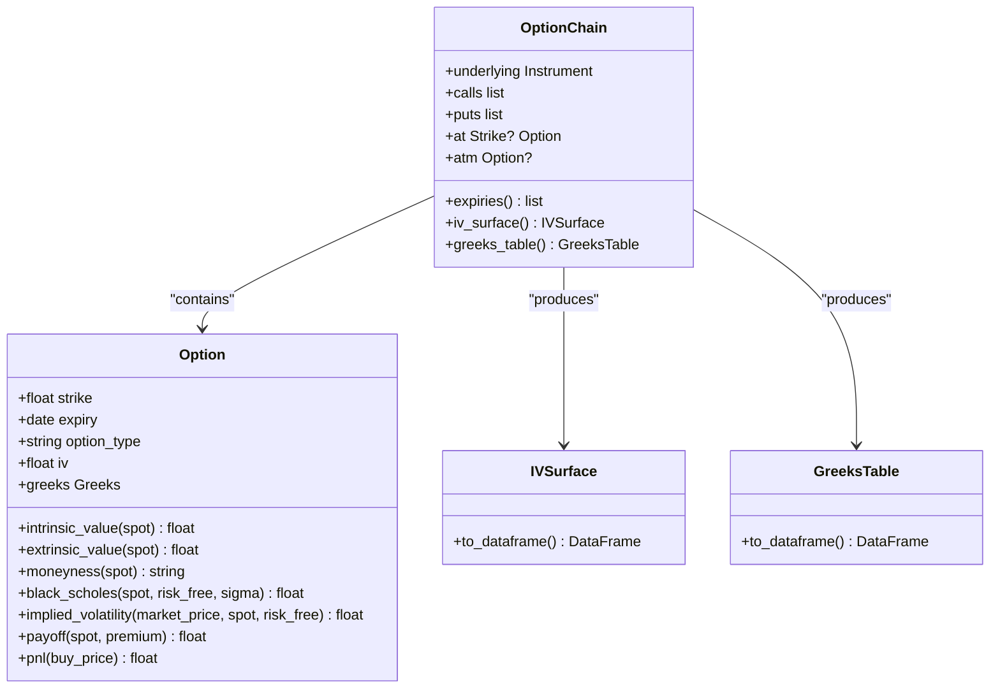
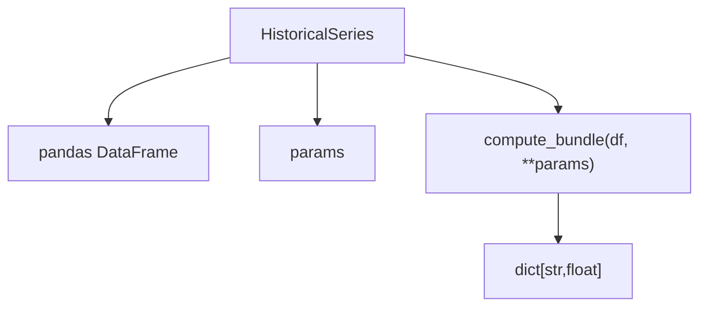
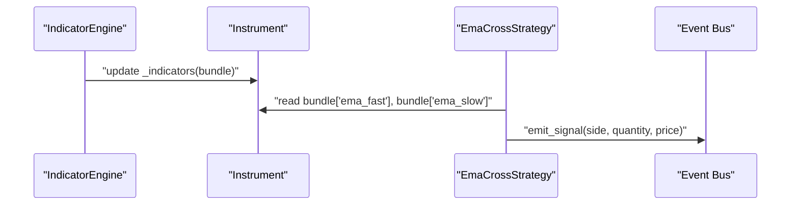
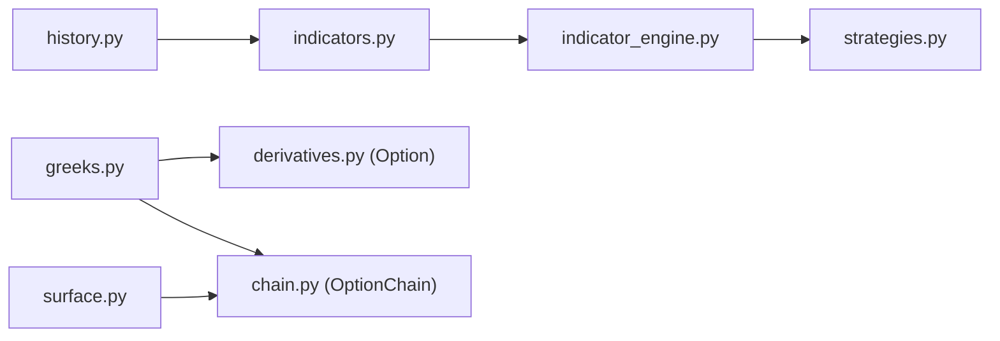

# Analytics & Indicators

<cite>
**Referenced Files in This Document**
- [indicators.py](file://ntrade/domain/analytics/indicators.py)
- [greeks.py](file://ntrade/domain/analytics/greeks.py)
- [surface.py](file://ntrade/domain/analytics/surface.py)
- [indicator_engine.py](file://ntrade/engines/indicator_engine.py)
- [derivatives.py](file://ntrade/domain/instruments/derivatives.py)
- [chain.py](file://ntrade/domain/instruments/chain.py)
- [history.py](file://ntrade/domain/market/history.py)
- [strategies.py](file://ntrade/engines/strategies.py)
- [test_indicators.py](file://tests/test_indicators.py)
- [test_options_analytics.py](file://tests/test_options_analytics.py)
</cite>

## Table of Contents
1. Introduction
2. Project Structure
3. Core Components
4. Architecture Overview
5. Detailed Component Analysis
6. Dependency Analysis
7. Performance Considerations
8. Troubleshooting Guide
9. Conclusion

## Introduction
This document explains the analytics and technical indicators subsystem, including built-in indicators (RSI, ATR, VWAP, SuperTrend), options analytics (Black-Scholes pricing, Greeks, implied volatility surface), and the IndicatorEngine that computes and manages indicator bundles with automatic recalculation on market updates. It also covers how indicators feed into strategies and trading decisions, performance considerations for large-scale computations, and guidance for building custom indicators and integrating them with the strategy engine.

## Project Structure
The analytics and indicators functionality spans three main areas:
- Domain analytics: pure functions and models for indicators, Black-Scholes pricing, Greeks, and option chain analytics wrappers.
- Engines: event-driven computation of indicator bundles on candle close events.
- Instruments and chains: option instruments with Greeks and IV surface generation from a live chain snapshot.

**Diagram sources**
- [indicators.py](file://ntrade/domain/analytics/indicators.py)
- [greeks.py](file://ntrade/domain/analytics/greeks.py)
- [surface.py](file://ntrade/domain/analytics/surface.py)
- [indicator_engine.py](file://ntrade/engines/indicator_engine.py)
- [strategies.py](file://ntrade/engines/strategies.py)
- [derivatives.py](file://ntrade/domain/instruments/derivatives.py)
- [chain.py](file://ntrade/domain/instruments/chain.py)
- [history.py](file://ntrade/domain/market/history.py)

**Section sources**
- [indicators.py](file://ntrade/domain/analytics/indicators.py)
- [greeks.py](file://ntrade/domain/analytics/greeks.py)
- [surface.py](file://ntrade/domain/analytics/surface.py)
- [indicator_engine.py](file://ntrade/engines/indicator_engine.py)
- [derivatives.py](file://ntrade/domain/instruments/derivatives.py)
- [chain.py](file://ntrade/domain/instruments/chain.py)
- [history.py](file://ntrade/domain/market/history.py)
- [strategies.py](file://ntrade/engines/strategies.py)

## Core Components
- Technical indicators: RSI, ATR, SMA, EMA, VWAP, SuperTrend, Heikin-Ashi, Renko bricks; bundle computation over OHLCV dataframes.
- Options analytics: Black-Scholes price, Greeks (Delta, Gamma, Theta, Vega, Rho), implied volatility via bisection solver.
- Option chain analytics: IVSurface and GreeksTable wrappers around DataFrames for term structure and smile analysis.
- IndicatorEngine: maintains rolling OHLCV windows per symbol, recomputes bundles on CandleClosedEvent, updates instrument read model, and publishes IndicatorUpdatedEvent.
- Strategy integration: strategies consume indicator bundles to generate signals (e.g., EMA cross).

Key responsibilities:
- Pure domain math without external TA libraries.
- Event-driven recomputation tied to timeframe-specific candles.
- Clean separation between analytics models and DataFrame interop.

**Section sources**
- [indicators.py](file://ntrade/domain/analytics/indicators.py)
- [greeks.py](file://ntrade/domain/analytics/greeks.py)
- [surface.py](file://ntrade/domain/analytics/surface.py)
- [indicator_engine.py](file://ntrade/engines/indicator_engine.py)
- [strategies.py](file://ntrade/engines/strategies.py)

## Architecture Overview
The system uses an event-driven pipeline:
- Market data produces CandleClosedEvent.
- IndicatorEngine subscribes, maintains a rolling window, computes the indicator bundle, updates the instrument’s indicators, and publishes IndicatorUpdatedEvent.
- Strategies subscribe to events, read indicators from the instrument, and emit trading signals.
- OptionChain exposes IVSurface and GreeksTable for analytics and visualization.

**Diagram sources**
- [indicator_engine.py](file://ntrade/engines/indicator_engine.py)
- [strategies.py](file://ntrade/engines/strategies.py)

## Detailed Component Analysis

### Technical Indicators Module
- RSI: smoothed relative strength using exponential moving averages; bounded to [0, 100].
- ATR: true range smoothed via exponential moving average.
- SMA/EMA: simple and exponential moving averages over close.
- VWAP: volume-weighted average price using cumulative typical price times volume.
- SuperTrend: trend direction series based on ATR bands and close crossings; outputs a directional column keyed by parameters.
- Heikin-Ashi and Renko: optional transformations for smoothing and noise reduction.
- compute_bundle: aggregates latest values of selected indicators into a dictionary keyed by parameterized names.

**Diagram sources**
- [indicators.py](file://ntrade/domain/analytics/indicators.py)

**Section sources**
- [indicators.py](file://ntrade/domain/analytics/indicators.py)
- [test_indicators.py](file://tests/test_indicators.py)

### IndicatorEngine
- Subscribes to CandleClosedEvent for a specific timeframe.
- Maintains per-symbol rolling OHLCV rows up to max_rows.
- Computes indicator bundle on each closed candle after warm-up threshold.
- Updates instrument._indicators and publishes IndicatorUpdatedEvent with the bundle.
- Provides latest(symbol) access to most recent computed bundle.

**Diagram sources**
- [indicator_engine.py](file://ntrade/engines/indicator_engine.py)

**Section sources**
- [indicator_engine.py](file://ntrade/engines/indicator_engine.py)
- [test_indicators.py](file://tests/test_indicators.py)

### Options Analytics: Black-Scholes and Greeks
- BlackScholes.price: theoretical price for CE/PE with dividend support; intrinsic fallback for zero time.
- BlackScholes.greeks: returns Greeks object with delta, gamma, theta, vega, rho, and iv.
- BlackScholes.implied_volatility: bisection solver returning NOT_COMPUTED when no valid solution exists.
- Greeks dataclass: typed fields with a computed property to detect whether any value was actually computed.

**Diagram sources**
- [greeks.py](file://ntrade/domain/analytics/greeks.py)

**Section sources**
- [greeks.py](file://ntrade/domain/analytics/greeks.py)
- [test_options_analytics.py](file://tests/test_options_analytics.py)

### Option Instruments and Chain Analytics
- Option: stores strike, expiry, type; provides intrinsic/extrinsic value, moneyness, Black-Scholes price, implied volatility, payoff, PnL; holds Greeks and iv.
- OptionChain: composite view of options across strikes/expiries; provides ATM selection, ITM/OTM lists, PCR, Max Pain, IVSurface, GreeksTable.
- IVSurface and GreeksTable: lightweight wrappers around DataFrames with escape hatch methods and attribute delegation.

**Diagram sources**
- [derivatives.py](file://ntrade/domain/instruments/derivatives.py)
- [chain.py](file://ntrade/domain/instruments/chain.py)
- [surface.py](file://ntrade/domain/analytics/surface.py)

**Section sources**
- [derivatives.py](file://ntrade/domain/instruments/derivatives.py)
- [chain.py](file://ntrade/domain/instruments/chain.py)
- [surface.py](file://ntrade/domain/analytics/surface.py)
- [test_options_analytics.py](file://tests/test_options_analytics.py)

### Historical Series and Indicator Access
- HistoricalSeries wraps OHLCV DataFrame attached to an instrument; supports resampling and direct indicator bundle computation via history.indicators().

**Diagram sources**
- [history.py](file://ntrade/domain/market/history.py)
- [indicators.py](file://ntrade/domain/analytics/indicators.py)

**Section sources**
- [history.py](file://ntrade/domain/market/history.py)

### Strategy Integration and Signals
- EmaCrossStrategy reads EMA fast/slow from the instrument’s indicator bundle and emits BUY/SELL signals on golden/death crosses.
- The relationship between indicators, signals, and decisions is explicit: indicators are computed by the engine, consumed by strategies, which then emit signals to execution/risk layers.

**Diagram sources**
- [strategies.py](file://ntrade/engines/strategies.py)
- [indicator_engine.py](file://ntrade/engines/indicator_engine.py)

**Section sources**
- [strategies.py](file://ntrade/engines/strategies.py)

## Dependency Analysis
- indicators.py depends only on pandas; no external TA library.
- greeks.py is pure math; used by Option and OptionChain analytics.
- surface.py wraps DataFrames for IVSurface and GreeksTable.
- indicator_engine.py depends on indicators.compute_bundle and events for lifecycle.
- derivatives.Option integrates BlackScholes for pricing and IV.
- chain.OptionChain composes Option objects and exposes analytics views.
- history.HistoricalSeries delegates to compute_bundle for on-demand analytics.

**Diagram sources**
- [indicators.py](file://ntrade/domain/analytics/indicators.py)
- [greeks.py](file://ntrade/domain/analytics/greeks.py)
- [surface.py](file://ntrade/domain/analytics/surface.py)
- [indicator_engine.py](file://ntrade/engines/indicator_engine.py)
- [derivatives.py](file://ntrade/domain/instruments/derivatives.py)
- [chain.py](file://ntrade/domain/instruments/chain.py)
- [history.py](file://ntrade/domain/market/history.py)
- [strategies.py](file://ntrade/engines/strategies.py)

**Section sources**
- [indicators.py](file://ntrade/domain/analytics/indicators.py)
- [greeks.py](file://ntrade/domain/analytics/greeks.py)
- [surface.py](file://ntrade/domain/analytics/surface.py)
- [indicator_engine.py](file://ntrade/engines/indicator_engine.py)
- [derivatives.py](file://ntrade/domain/instruments/derivatives.py)
- [chain.py](file://ntrade/domain/instruments/chain.py)
- [history.py](file://ntrade/domain/market/history.py)
- [strategies.py](file://ntrade/engines/strategies.py)

## Performance Considerations
- Rolling window management: IndicatorEngine trims rows to max_rows to bound memory usage per symbol.
- Warm-up thresholds: minimum rows before computing ensures stable indicator values and avoids NaN propagation.
- Vectorized operations: indicators use pandas vectorization for efficient computation over large datasets.
- Bundle caching: latest(symbol) provides quick access to the most recent bundle without recomputation.
- DataFrame slicing: compute_bundle operates on a slice of recent rows to limit CPU load per event.
- IV solver bounds: implied volatility uses bounded search and early exits to avoid unnecessary iterations.

Recommendations:
- Tune max_rows and timeframe to balance accuracy and memory footprint.
- Use minimal required periods in compute_bundle params to reduce computation.
- For backtesting, precompute and cache historical bundles where possible.

[No sources needed since this section provides general guidance]

## Troubleshooting Guide
Common issues and resolutions:
- Missing indicator keys in bundle: ensure sufficient rows have passed (warm-up) and timeframe matches the engine configuration.
- Zero or NaN values: check input OHLCV quality; some indicators require non-zero volumes or valid ranges.
- Implied volatility not computed: verify market price is above intrinsic and years > 0; otherwise NOT_COMPUTED is returned intentionally.
- SuperTrend direction unexpected: confirm ATR period and multiplier parameters; ensure consistent OHLCV data.

Validation references:
- Indicator tests assert bounds and behavior for RSI, ATR, VWAP, SuperTrend, and bundle composition.
- Options tests validate Black-Scholes parity, Greeks signs, and IV roundtrip.

**Section sources**
- [test_indicators.py](file://tests/test_indicators.py)
- [test_options_analytics.py](file://tests/test_options_analytics.py)

## Conclusion
The analytics and indicators subsystem provides robust, dependency-free technical indicators and comprehensive options analytics integrated into an event-driven architecture. IndicatorEngine automates bundle computation and distribution, while OptionChain offers powerful tools for term structure and volatility smile analysis. Strategies can reliably consume indicators to make informed trading decisions. With careful tuning of parameters and awareness of performance characteristics, the system scales effectively for both live trading and backtesting scenarios.

[No sources needed since this section summarizes without analyzing specific files]