# Market Scanners

<cite>
**Referenced Files in This Document**
- [scanner.py](file://ntrade/domain/scanner.py)
- [builtin.py](file://ntrade/scanners/builtin.py)
- [trading_session.py](file://ntrade/kernel/trading_session.py)
- [context.py](file://ntrade/kernel/context.py)
- [quote.py](file://ntrade/domain/market/quote.py)
- [depth.py](file://ntrade/domain/market/depth.py)
- [04-scanners.md](file://user-guide/04-scanners.md)
- [test_scanner.py](file://tests/test_scanner.py)
</cite>

## Update Summary
**Changes Made**
- Updated GapScanner and ImbalanceScanner throttling configuration to 30 seconds (K-022)
- Enhanced VolumeSpikeScanner with live mode protection against meaningless ratio calculations (K-023)
- Updated performance considerations section to reflect symmetric throttling across all scanners
- Added detailed explanation of live vs backtest behavior for volume spike detection

## Table of Contents
1. [Introduction](#introduction)
2. [Project Structure](#project-structure)
3. [Core Components](#core-components)
4. [Architecture Overview](#architecture-overview)
5. [Detailed Component Analysis](#detailed-component-analysis)
6. [Dependency Analysis](#dependency-analysis)
7. [Performance Considerations](#performance-considerations)
8. [Troubleshooting Guide](#troubleshooting-guide)
9. [Conclusion](#conclusion)
10. [Appendices](#appendices)

## Introduction
This document explains the Market Scanners subsystem of nTrade: how scanners screen a universe of instruments, compute signals and scores, and return ranked results that can be used to build watchlists or feed strategies. It covers the scanner abstraction, built-in implementations, facade orchestration with throttling and caching, integration with TradingSession, and usage patterns from the user guide and tests.

## Project Structure
The scanner subsystem is organized into three layers:
- Domain layer: abstract base classes and result model
- Implementation layer: built-in scanners for common market conditions
- Orchestration layer: ScannerFacade and TradingSession integration

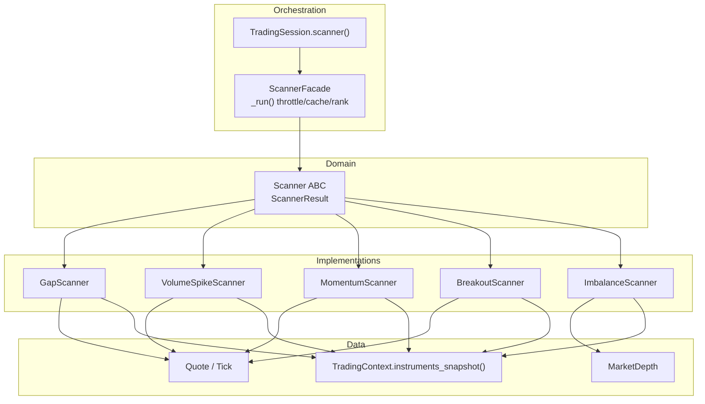

**Diagram sources**
- [scanner.py:28-64](file://ntrade/domain/scanner.py#L28-L64)
- [builtin.py:42-276](file://ntrade/scanners/builtin.py#L42-L276)
- [trading_session.py:253-258](file://ntrade/kernel/trading_session.py#L253-L258)
- [context.py:61-69](file://ntrade/kernel/context.py#L61-L69)
- [quote.py:9-54](file://ntrade/domain/market/quote.py#L9-L54)
- [depth.py:9-49](file://ntrade/domain/market/depth.py#L9-L49)

**Section sources**
- [scanner.py:1-160](file://ntrade/domain/scanner.py#L1-L160)
- [builtin.py:1-276](file://ntrade/scanners/builtin.py#L1-L276)
- [trading_session.py:253-258](file://ntrade/kernel/trading_session.py#L253-L258)
- [context.py:1-79](file://ntrade/kernel/context.py#L1-L79)
- [quote.py:1-91](file://ntrade/domain/market/quote.py#L1-L91)
- [depth.py:1-49](file://ntrade/domain/market/depth.py#L1-L49)

## Core Components
- ScannerResult: frozen dataclass carrying instrument, signal, score, matched conditions, indicator values, rank, metadata, and timestamp.
- Scanner (ABC): defines name and scan(session, **kw) returning raw unranked results.
- ScannerFacade: registers built-in scanners, exposes named methods (gap, volume, momentum, breakout, imbalance), supports custom scanners via register/custom, and centralizes ranking, throttling, and caching through _run().
- Built-in scanners: GapScanner, VolumeSpikeScanner, MomentumScanner, BreakoutScanner, ImbalanceScanner.
- TradingSession.scanner(): lazily creates and caches ScannerFacade per session.

Key behaviors:
- Results are sorted by score descending and ranked starting at 1.
- Throttling honors rate_limit_seconds per scanner; cache keyed by scanner instance and call parameters excluding now and rate_limit_seconds.
- Instruments are iterated via a thread-safe snapshot from TradingContext.

**Updated** All scanners now implement symmetric 30-second throttling for consistent performance characteristics across the scanning system.

**Section sources**
- [scanner.py:28-160](file://ntrade/domain/scanner.py#L28-L160)
- [builtin.py:42-276](file://ntrade/scanners/builtin.py#L42-L276)
- [trading_session.py:253-258](file://ntrade/kernel/trading_session.py#L253-L258)
- [context.py:61-69](file://ntrade/kernel/context.py#L61-L69)

## Architecture Overview
The scanner pipeline integrates with the trading session and kernel context to safely access instruments and their market data.

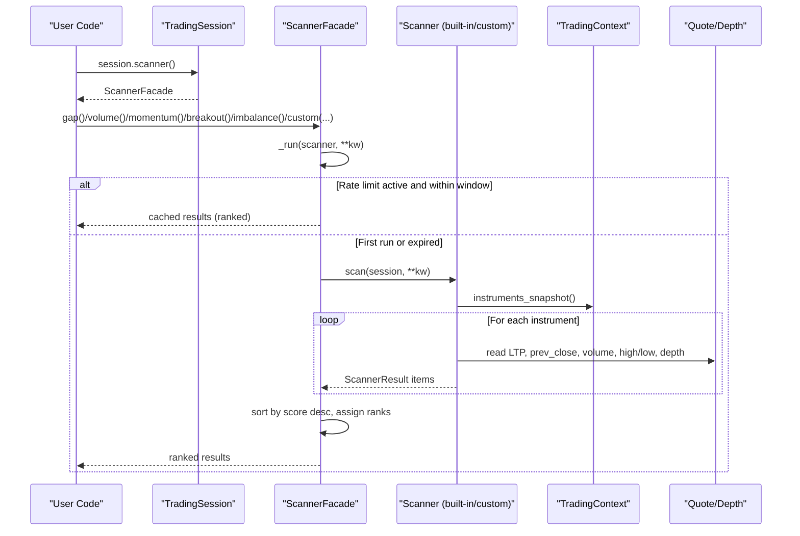

**Diagram sources**
- [trading_session.py:253-258](file://ntrade/kernel/trading_session.py#L253-L258)
- [scanner.py:130-160](file://ntrade/domain/scanner.py#L130-L160)
- [builtin.py:20-27](file://ntrade/scanners/builtin.py#L20-L27)
- [context.py:61-69](file://ntrade/kernel/context.py#L61-L69)
- [quote.py:9-54](file://ntrade/domain/market/quote.py#L9-L54)
- [depth.py:9-49](file://ntrade/domain/market/depth.py#L9-L49)

## Detailed Component Analysis

### ScannerResult and Scanner ABC
- ScannerResult is immutable and carries all fields needed downstream (instrument, signal, score, conditions, indicators, rank, metadata, timestamp).
- Scanner enforces a consistent interface for all scanners, separating logic from orchestration.

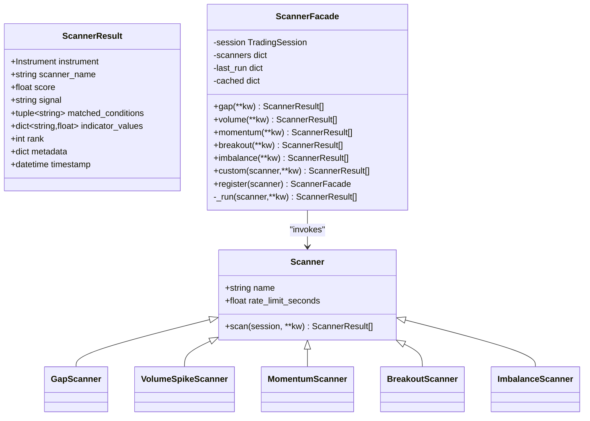

**Diagram sources**
- [scanner.py:28-160](file://ntrade/domain/scanner.py#L28-L160)
- [builtin.py:42-276](file://ntrade/scanners/builtin.py#L42-L276)

**Section sources**
- [scanner.py:28-64](file://ntrade/domain/scanner.py#L28-L64)
- [scanner.py:67-160](file://ntrade/domain/scanner.py#L67-L160)

### Built-in Scanners

#### GapScanner
- Detects gap up/down vs previous close using LTP and prev_close.
- Returns BUY/SELL based on sign of gap percentage; score equals absolute gap percent.
- **Updated**: Now implements 30-second throttling for consistent performance with other scanners.

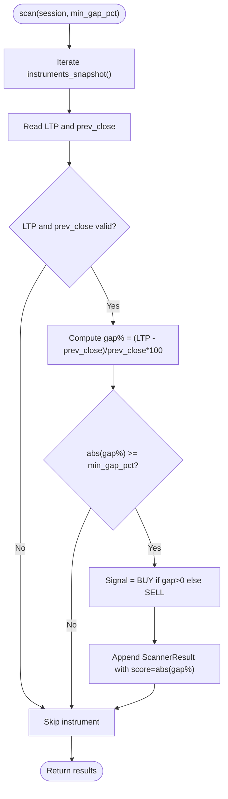

**Diagram sources**
- [builtin.py:42-71](file://ntrade/scanners/builtin.py#L42-L71)

**Section sources**
- [builtin.py:42-71](file://ntrade/scanners/builtin.py#L42-L71)

#### VolumeSpikeScanner
- Uses avg_volume indicator when available; otherwise falls back to absolute min_volume threshold.
- Score reflects spike ratio or normalized absolute volume.
- Implements rate limiting to avoid rescanning every tick.
- **Updated**: Enhanced with live mode protection that skips meaningless ratio calculations in live trading, relying only on absolute min_volume thresholds.

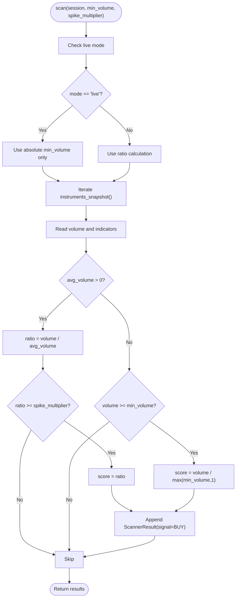

**Diagram sources**
- [builtin.py:76-123](file://ntrade/scanners/builtin.py#L76-L123)

**Section sources**
- [builtin.py:76-123](file://ntrade/scanners/builtin.py#L76-L123)

#### MomentumScanner
- Prefers RSI-based momentum if available; otherwise uses price change from prev_close to LTP.
- Supports both positive and negative momentum signals.
- **Updated**: Maintains 30-second throttling for consistent performance.

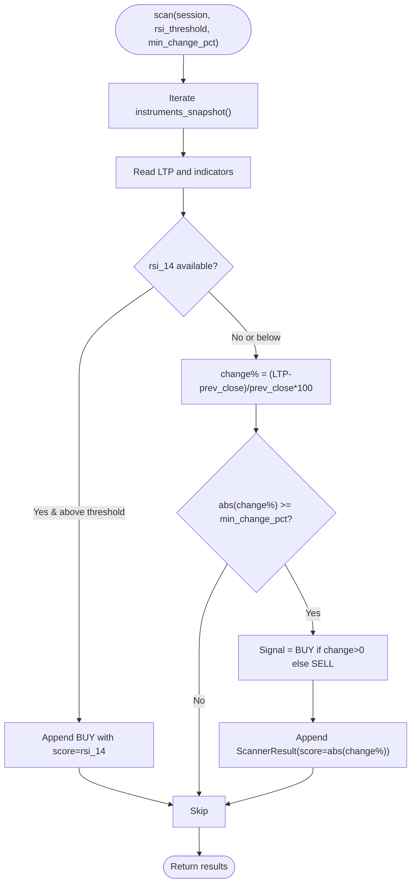

**Diagram sources**
- [builtin.py:120-168](file://ntrade/scanners/builtin.py#L120-L168)

**Section sources**
- [builtin.py:120-168](file://ntrade/scanners/builtin.py#L120-L168)

#### BreakoutScanner
- Attempts supertrend-based breakout if numeric stx_10_3 is present; otherwise uses high/low range breakout.
- Produces BUY on high breakouts and SELL on low breakouts.
- **Updated**: Maintains 30-second throttling for consistent performance.

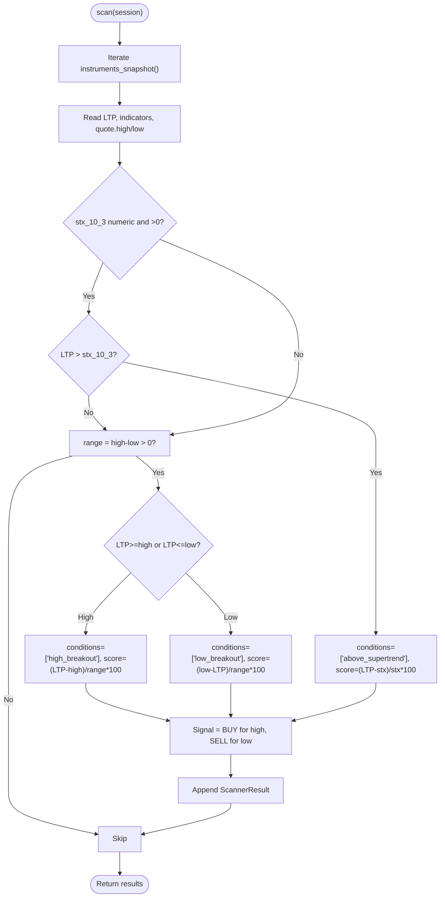

**Diagram sources**
- [builtin.py:165-233](file://ntrade/scanners/builtin.py#L165-L233)

**Section sources**
- [builtin.py:165-233](file://ntrade/scanners/builtin.py#L165-L233)

#### ImbalanceScanner
- Requires depth data; computes bid/ask total quantities and flags significant imbalance.
- BUY when bids dominate; SELL when asks dominate.
- **Updated**: Now implements 30-second throttling for consistent performance with other scanners.

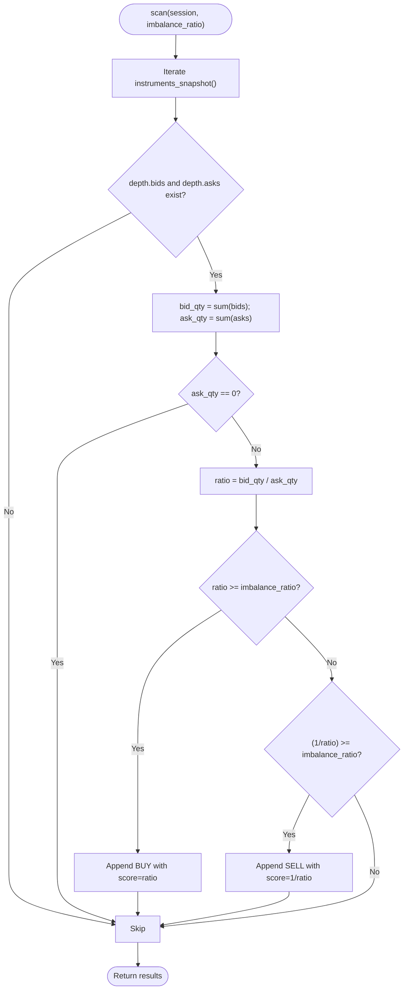

**Diagram sources**
- [builtin.py:230-276](file://ntrade/scanners/builtin.py#L230-L276)

**Section sources**
- [builtin.py:230-276](file://ntrade/scanners/builtin.py#L230-L276)

### ScannerFacade Orchestration
- Named entry points delegate to _run(), which:
  - Computes a cache key from scanner instance and keyword arguments (excluding now and rate_limit_seconds).
  - Honors rate_limit_seconds to serve cached results within the window.
  - Sorts results by score descending and assigns ranks.
  - Caches results keyed by (scanner, params) for subsequent calls.

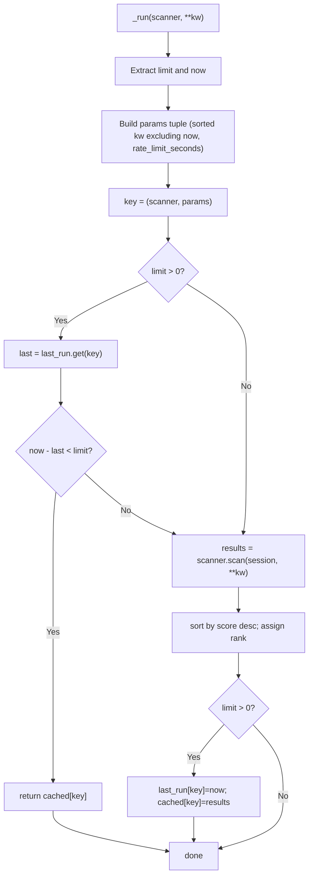

**Diagram sources**
- [scanner.py:130-160](file://ntrade/domain/scanner.py#L130-L160)

**Section sources**
- [scanner.py:67-160](file://ntrade/domain/scanner.py#L67-L160)

### Integration with TradingSession
- session.scanner() returns a lazily created ScannerFacade instance cached on the session.
- Users typically create a paper session, register instruments, refresh quotes, then call scanner methods.

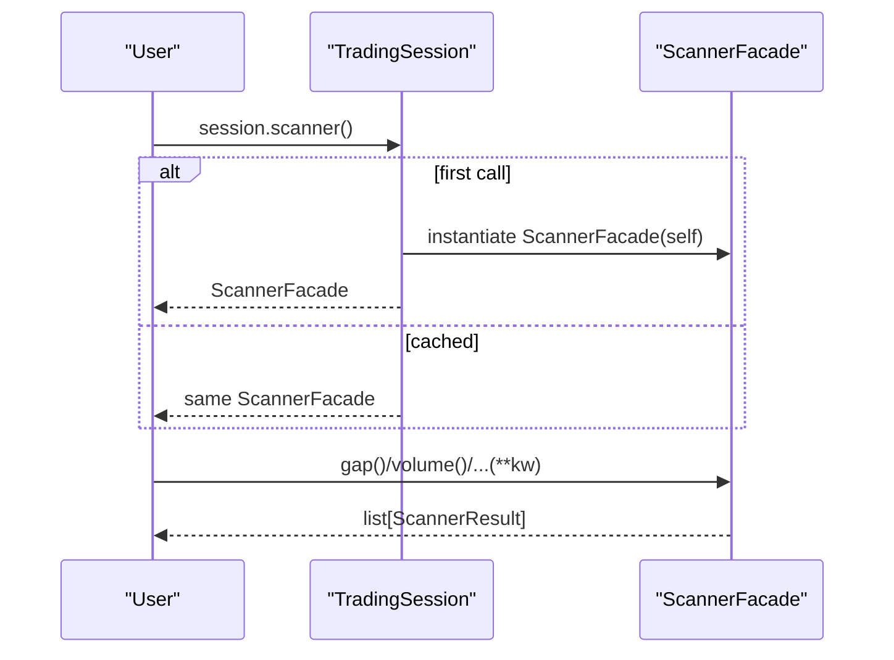

**Diagram sources**
- [trading_session.py:253-258](file://ntrade/kernel/trading_session.py#L253-L258)
- [scanner.py:67-91](file://ntrade/domain/scanner.py#L67-L91)

**Section sources**
- [trading_session.py:253-258](file://ntrade/kernel/trading_session.py#L253-L258)

## Dependency Analysis
- ScannerFacade depends on Scanner ABC and built-in subclasses.
- Built-in scanners depend on Instrument's market API (ltp, prev_close, volume, quote) and optional indicators and depth.
- Instrument iteration is performed via TradingContext.instruments_snapshot() to ensure thread safety.
- Quote and MarketDepth provide immutable snapshots used by scanners.

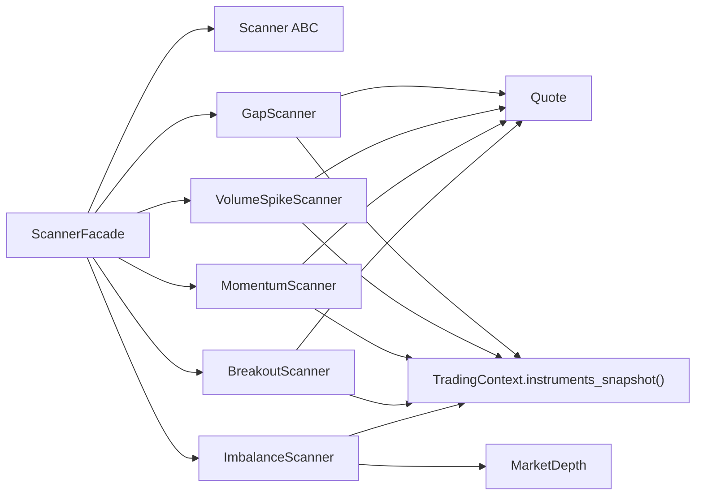

**Diagram sources**
- [scanner.py:67-160](file://ntrade/domain/scanner.py#L67-160)
- [builtin.py:20-27](file://ntrade/scanners/builtin.py#L20-27)
- [quote.py:9-54](file://ntrade/domain/market/quote.py#L9-54)
- [depth.py:9-49](file://ntrade/domain/market/depth.py#L9-L49)
- [context.py:61-69](file://ntrade/kernel/context.py#L61-L69)

**Section sources**
- [scanner.py:67-160](file://ntrade/domain/scanner.py#L67-160)
- [builtin.py:20-27](file://ntrade/scanners/builtin.py#L20-27)
- [context.py:61-69](file://ntrade/kernel/context.py#L61-L69)
- [quote.py:9-54](file://ntrade/domain/market/quote.py#L9-L54)
- [depth.py:9-49](file://ntrade/domain/market/depth.py#L9-L49)

## Performance Considerations
- **Symmetric Throttling**: All scanners now implement 30-second throttling (rate_limit_seconds = 30.0) for consistent performance characteristics across the scanning system. This includes GapScanner and ImbalanceScanner which previously had no throttling.
- **Caching**: ScannerFacade caches results keyed by scanner instance and parameters, ensuring hot loops do not recompute unnecessarily.
- **Snapshot iteration**: Using instruments_snapshot() avoids race conditions with concurrent registration from feed threads.
- **Indicator availability**: Scanners gracefully skip instruments without required data (e.g., no prev_close, no depth), reducing overhead.
- **Live mode optimization**: VolumeSpikeScanner now intelligently handles live vs backtest modes, skipping meaningless ratio calculations in live trading where quote.volume is day-cumulative while avg_volume is per-candle.

**Updated** The throttling enhancement ensures consistent performance across all scanners, preventing any single scanner from overwhelming the system during high-frequency updates.

## Troubleshooting Guide
Common issues and resolutions:
- Empty results: Ensure instruments are registered and quotes refreshed before scanning.
- No depth data: ImbalanceScanner requires depth; verify depth updates are flowing.
- Missing indicators: VolumeSpikeScanner may fall back to absolute thresholds if avg_volume is unavailable; MomentumScanner falls back to price change if RSI is missing.
- Stale timestamps: Use now= parameter in tests or deterministic runs to control timestamps.
- Throttle behavior: If expecting immediate rescan, pass explicit rate_limit_seconds or wait beyond the configured window.
- **Live mode volume spikes**: In live trading, VolumeSpikeScanner relies only on absolute min_volume thresholds since ratio calculations are meaningless with day-cumulative volume data.

**Updated** Added guidance for understanding live mode behavior in VolumeSpikeScanner where ratio-based detection is disabled to prevent false positives from cumulative volume data.

**Section sources**
- [test_scanner.py:155-196](file://tests/test_scanner.py#L155-L196)
- [test_scanner.py:379-394](file://tests/test_scanner.py#L379-L394)
- [test_scanner.py:258-283](file://tests/test_scanner.py#L258-L283)

## Conclusion
The Market Scanners subsystem provides a robust, extensible framework for screening instruments across multiple market conditions. With clear abstractions, safe data access, symmetric throttling, and intelligent live mode handling, it enables efficient watchlist generation and strategy input while remaining easy to extend with custom scanners. The recent enhancements ensure consistent performance characteristics across all scanners and improved reliability in live trading environments.

## Appendices

### Usage Examples and References
- User guide demonstrates typical workflows: creating a paper session, registering instruments, refreshing quotes, and invoking scanner methods.
- Tests validate behavior of all built-in scanners, facade features, and integration with TradingSession.
- **Updated** Tests now include validation for symmetric throttling behavior and live mode protection in VolumeSpikeScanner.

**Section sources**
- [04-scanners.md:1-127](file://user-guide/04-scanners.md#L1-L127)
- [test_scanner.py:1-426](file://tests/test_scanner.py#L1-L426)