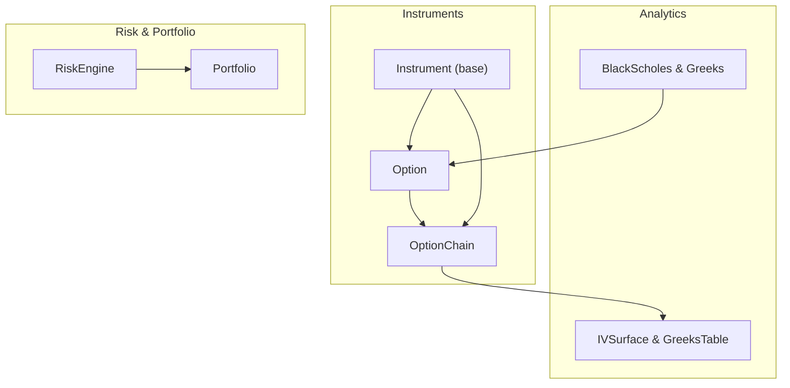
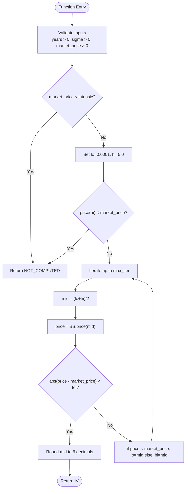
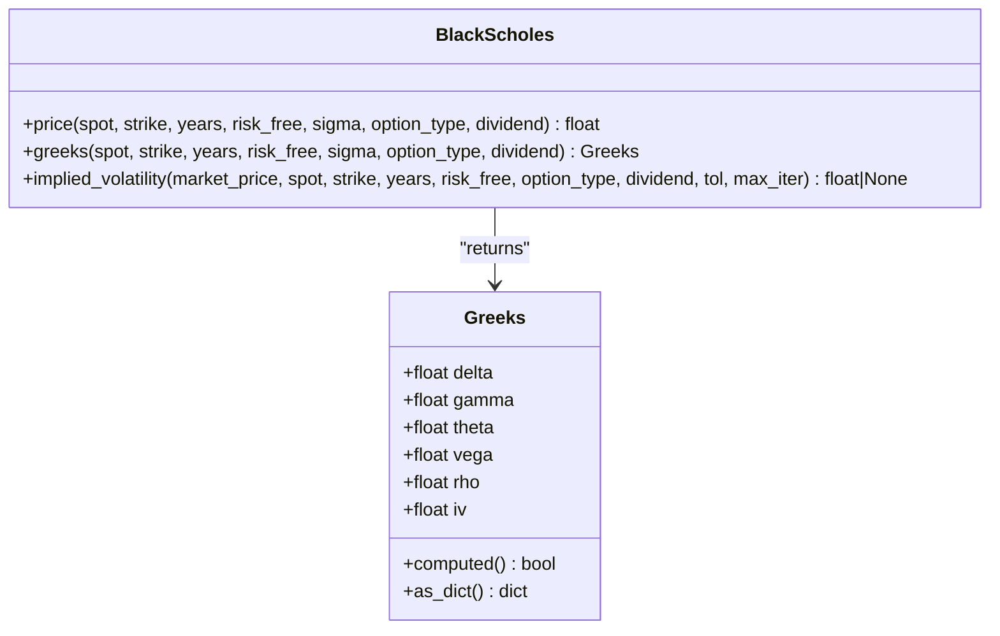
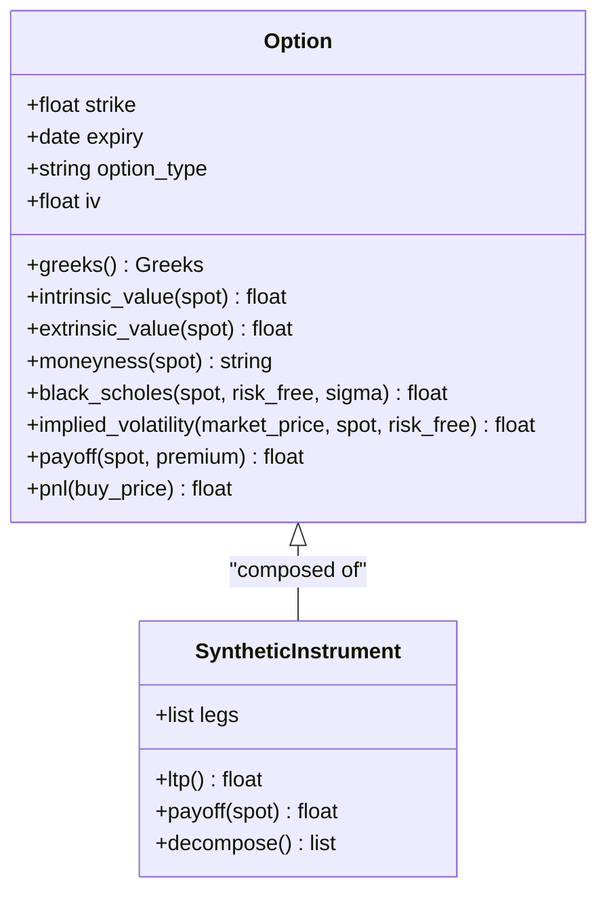
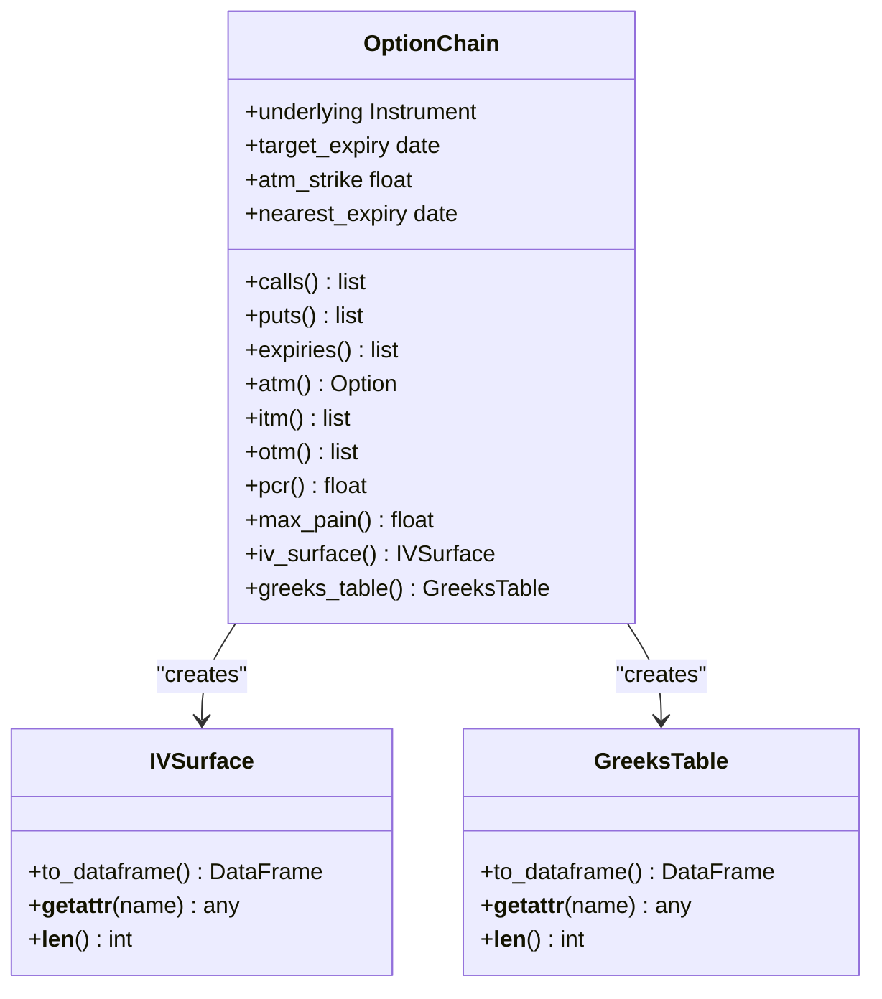
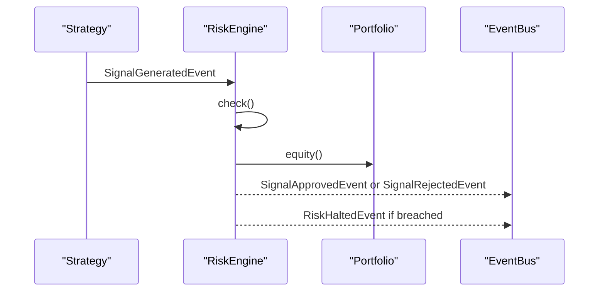
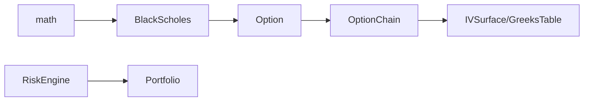

# Options Analytics

<cite>
**Referenced Files in This Document**
- [greeks.py](file://ntrade/domain/analytics/greeks.py)
- [surface.py](file://ntrade/domain/analytics/surface.py)
- [derivatives.py](file://ntrade/domain/instruments/derivatives.py)
- [chain.py](file://ntrade/domain/instruments/chain.py)
- [base.py](file://ntrade/domain/instruments/base.py)
- [risk_engine.py](file://ntrade/engines/risk_engine.py)
- [portfolio.py](file://ntrade/domain/portfolio.py)
- [test_options_analytics.py](file://tests/test_options_analytics.py)
</cite>

## Table of Contents
1. [Introduction](#introduction)
2. [Project Structure](#project-structure)
3. [Core Components](#core-components)
4. [Architecture Overview](#architecture-overview)
5. [Detailed Component Analysis](#detailed-component-analysis)
6. [Dependency Analysis](#dependency-analysis)
7. [Performance Considerations](#performance-considerations)
8. [Troubleshooting Guide](#troubleshooting-guide)
9. [Conclusion](#conclusion)
10. [Appendices](#appendices)

## Introduction
This document explains the options analytics and pricing capabilities implemented in the repository. It focuses on:
- Black-Scholes model implementation for option pricing, including assumptions, limitations, and inputs
- Greeks calculations (Delta, Gamma, Theta, Vega, Rho) and implied volatility computation
- Implied volatility surface construction from market data, volatility smile analysis, and term structure visualization
- Advanced concepts such as delta hedging strategies, position sensitivity analysis, and risk metrics
- Practical examples for calculating option chains, analyzing Greeks exposure, and implementing volatility trading strategies
- Numerical precision considerations, computational efficiency for large option chains, and integration with portfolio risk management systems

The system is designed to be broker-agnostic at the domain layer while providing typed wrappers over pandas DataFrames for analytics outputs.

## Project Structure
The options analytics functionality spans several modules:
- Pricing engine and Greeks: ntrade/domain/analytics/greeks.py
- Analytics wrappers for surfaces and tables: ntrade/domain/analytics/surface.py
- Option instrument and synthetic instruments: ntrade/domain/instruments/derivatives.py
- Option chain composition and analytics: ntrade/domain/instruments/chain.py
- Base instrument abstraction: ntrade/domain/instruments/base.py
- Risk engine for pre-trade screening and circuit breakers: ntrade/engines/risk_engine.py
- Portfolio and positions: ntrade/domain/portfolio.py
- Tests validating behavior: tests/test_options_analytics.py



**Diagram sources**
- [greeks.py:1-120](file://ntrade/domain/analytics/greeks.py#L1-L120)
- [surface.py:1-85](file://ntrade/domain/analytics/surface.py#L1-L85)
- [derivatives.py:109-224](file://ntrade/domain/instruments/derivatives.py#L109-L224)
- [chain.py:19-202](file://ntrade/domain/instruments/chain.py#L19-L202)
- [base.py:50-152](file://ntrade/domain/instruments/base.py#L50-L152)
- [risk_engine.py:19-141](file://ntrade/engines/risk_engine.py#L19-L141)
- [portfolio.py:63-173](file://ntrade/domain/portfolio.py#L63-L173)

**Section sources**
- [greeks.py:1-120](file://ntrade/domain/analytics/greeks.py#L1-L120)
- [surface.py:1-85](file://ntrade/domain/analytics/surface.py#L1-L85)
- [derivatives.py:109-224](file://ntrade/domain/instruments/derivatives.py#L109-L224)
- [chain.py:19-202](file://ntrade/domain/instruments/chain.py#L19-L202)
- [base.py:50-152](file://ntrade/domain/instruments/base.py#L50-L152)
- [risk_engine.py:19-141](file://ntrade/engines/risk_engine.py#L19-L141)
- [portfolio.py:63-173](file://ntrade/domain/portfolio.py#L63-L173)

## Core Components
- BlackScholes: Static methods for pricing, Greeks, and implied volatility using the Black-Scholes model. Inputs include spot, strike, time-to-expiry (years), risk-free rate, volatility, option type, and dividend yield. Outputs are rounded to a fixed precision.
- Greeks: A frozen dataclass holding Delta, Gamma, Theta, Vega, Rho, and IV. Includes a computed flag to distinguish zero-filled defaults from actual computations.
- Option: Derivative instrument with intrinsic/extrinsic value, moneyness classification, Black-Scholes price, implied volatility solver, payoff, and P&L helpers. Integrates with underlying quotes and lot sizes.
- OptionChain: Composite of Option instruments across strikes and expiries. Provides views (calls, puts, ATM, ITM, OTM), analytics (PCR, max pain), and analytics wrappers (iv_surface, greeks_table).
- IVSurface and GreeksTable: Typed wrappers around pandas DataFrames that expose columns like strike, expiry, type, iv, delta, gamma, theta, vega. They delegate unknown attributes to the underlying DataFrame while enforcing domain-typed access.

**Section sources**
- [greeks.py:13-120](file://ntrade/domain/analytics/greeks.py#L13-L120)
- [derivatives.py:109-224](file://ntrade/domain/instruments/derivatives.py#L109-L224)
- [chain.py:19-202](file://ntrade/domain/instruments/chain.py#L19-L202)
- [surface.py:19-85](file://ntrade/domain/analytics/surface.py#L19-L85)

## Architecture Overview
The architecture separates pure math (pricing/Greeks) from domain objects (Option, OptionChain) and provides typed wrappers for analytics outputs. The OptionChain aggregates Option instances and exposes analytics via IVSurface and GreeksTable. RiskEngine sits upstream of order execution to screen signals and enforce limits, integrating with Portfolio for equity and drawdown checks.

```mermaid
sequenceDiagram
participant User as "User Code"
participant Chain as "OptionChain"
participant Opt as "Option"
participant BS as "BlackScholes"
participant Surface as "IVSurface/GreeksTable"
User->>Chain : fetch(underlying, expiry, num_strikes)
Chain-->>User : OptionChain instance
User->>Chain : iv_surface()
Chain->>Opt : iterate options
Opt-->>Chain : {strike, expiry, type, iv}
Chain-->>Surface : build DataFrame rows
Surface-->>User : IVSurface(rows=...)
User->>Chain : greeks_table()
Chain->>Opt : greeks (Greeks object)
Opt-->>Chain : {delta, gamma, theta, vega, iv}
Chain-->>Surface : build DataFrame rows
Surface-->>User : GreeksTable(rows=...)
```

**Diagram sources**
- [chain.py:156-176](file://ntrade/domain/instruments/chain.py#L156-L176)
- [surface.py:19-85](file://ntrade/domain/analytics/surface.py#L19-L85)
- [greeks.py:46-120](file://ntrade/domain/analytics/greeks.py#L46-L120)
- [derivatives.py:149-210](file://ntrade/domain/instruments/derivatives.py#L149-L210)

## Detailed Component Analysis

### Black-Scholes Model Implementation
- Assumptions:
  - European-style exercise (as used by the standard formulas)
  - Constant volatility and risk-free rate over the life of the option
  - Lognormal distribution of underlying returns
  - No transaction costs or taxes; continuous trading
- Limitations:
  - Does not capture jumps, stochastic volatility, or discrete dividends beyond a simple yield adjustment
  - Assumes constant interest rates and no arbitrage opportunities
- Parameter inputs:
  - Spot price, strike price, time-to-expiry in years, risk-free rate, volatility, option type ("CE"/"PE"), dividend yield
- Pricing logic:
  - Computes d1 and d2, then applies call/put formulas with discounting for dividends and interest
  - Returns intrinsic value when time-to-expiry is non-positive
- Greeks:
  - Delta: first derivative w.r.t. spot, adjusted for dividends
  - Gamma: second derivative w.r.t. spot
  - Theta: time decay per day (annualized divided by 365)
  - Vega: sensitivity to volatility (per 1% change)
  - Rho: sensitivity to interest rate (per 1% change)
- Implied volatility:
  - Bisection solver with bounds [0.0001, 5.0], tolerance 1e-6, max iterations 100
  - Returns NOT_COMPUTED sentinel when inputs are invalid or market price below intrinsic



**Diagram sources**
- [greeks.py:94-120](file://ntrade/domain/analytics/greeks.py#L94-L120)

**Section sources**
- [greeks.py:46-120](file://ntrade/domain/analytics/greeks.py#L46-L120)
- [test_options_analytics.py:20-40](file://tests/test_options_analytics.py#L20-L40)

### Greeks Calculation System
- Delta (price sensitivity):
  - CE: positive, between 0 and 1
  - PE: negative, between -1 and 0
- Gamma (rate of change of delta):
  - Always positive for vanilla options
- Theta (time decay):
  - Negative for long options due to time decay
- Vega (volatility sensitivity):
  - Positive for both calls and puts
- Rho (interest rate sensitivity):
  - Positive for calls, negative for puts
- Implementation details:
  - Uses normal PDF/CDF functions
  - Dividend adjustments applied consistently
  - Rounded to 6 decimal places for stability



**Diagram sources**
- [greeks.py:13-92](file://ntrade/domain/analytics/greeks.py#L13-L92)

**Section sources**
- [greeks.py:13-92](file://ntrade/domain/analytics/greeks.py#L13-L92)
- [test_options_analytics.py:42-50](file://tests/test_options_analytics.py#L42-L50)

### Option Instrument and Synthetic Instruments
- Option properties:
  - Intrinsic and extrinsic value calculation
  - Moneyness classification (ITM, ATM, OTM)
  - Black-Scholes price and implied volatility solver
  - Payoff and P&L based on current LTP and buy price
- SyntheticInstrument:
  - Composite of multiple legs (e.g., straddle)
  - Aggregates LTP and payoff across legs



**Diagram sources**
- [derivatives.py:109-224](file://ntrade/domain/instruments/derivatives.py#L109-L224)

**Section sources**
- [derivatives.py:109-224](file://ntrade/domain/instruments/derivatives.py#L109-L224)
- [test_options_analytics.py:52-85](file://tests/test_options_analytics.py#L52-L85)

### OptionChain and Analytics Wrappers
- OptionChain:
  - Fetches live chain via underlying's broker adapter
  - Views: calls, puts, nearest_expiry, atm, itm, otm
  - Analytics: PCR (put-call ratio), max_pain
  - Analytics wrappers: iv_surface(), greeks_table() returning typed DataFrame wrappers
- IVSurface and GreeksTable:
  - Wrap pandas DataFrames with domain-typed APIs
  - Delegate unknown attributes to underlying DataFrame
  - Provide escape hatch via to_dataframe()



**Diagram sources**
- [chain.py:19-202](file://ntrade/domain/instruments/chain.py#L19-L202)
- [surface.py:19-85](file://ntrade/domain/analytics/surface.py#L19-L85)

**Section sources**
- [chain.py:19-202](file://ntrade/domain/instruments/chain.py#L19-L202)
- [surface.py:19-85](file://ntrade/domain/analytics/surface.py#L19-L85)
- [test_options_analytics.py:109-141](file://tests/test_options_analytics.py#L109-L141)

### Integration with Portfolio and Risk Management
- Portfolio:
  - Tracks positions and holdings
  - Computes total P&L and market value
  - Refreshes from broker adapter
- RiskEngine:
  - Screens signals before execution
  - Enforces static limits (quantity, notional, position count)
  - Circuit breakers: daily loss cap, max drawdown halt, price deviation guard
  - Publishes events for approved/rejected signals and halt/resume states



**Diagram sources**
- [risk_engine.py:19-141](file://ntrade/engines/risk_engine.py#L19-L141)
- [portfolio.py:63-173](file://ntrade/domain/portfolio.py#L63-L173)

**Section sources**
- [risk_engine.py:19-141](file://ntrade/engines/risk_engine.py#L19-L141)
- [portfolio.py:63-173](file://ntrade/domain/portfolio.py#L63-L173)

## Dependency Analysis
- BlackScholes depends only on Python's math module (no external dependencies)
- Option uses BlackScholes for pricing and IV calculation
- OptionChain aggregates Option instances and builds analytics tables
- IVSurface and GreeksTable wrap pandas DataFrames but maintain domain typing
- RiskEngine integrates with Portfolio and EventBus for signal screening



**Diagram sources**
- [greeks.py:1-120](file://ntrade/domain/analytics/greeks.py#L1-L120)
- [derivatives.py:109-224](file://ntrade/domain/instruments/derivatives.py#L109-L224)
- [chain.py:19-202](file://ntrade/domain/instruments/chain.py#L19-L202)
- [surface.py:19-85](file://ntrade/domain/analytics/surface.py#L19-L85)
- [risk_engine.py:19-141](file://ntrade/engines/risk_engine.py#L19-L141)
- [portfolio.py:63-173](file://ntrade/domain/portfolio.py#L63-L173)

**Section sources**
- [greeks.py:1-120](file://ntrade/domain/analytics/greeks.py#L1-L120)
- [derivatives.py:109-224](file://ntrade/domain/instruments/derivatives.py#L109-L224)
- [chain.py:19-202](file://ntrade/domain/instruments/chain.py#L19-L202)
- [surface.py:19-85](file://ntrade/domain/analytics/surface.py#L19-L85)
- [risk_engine.py:19-141](file://ntrade/engines/risk_engine.py#L19-L141)
- [portfolio.py:63-173](file://ntrade/domain/portfolio.py#L63-L173)

## Performance Considerations
- Numerical Precision:
  - Prices rounded to 4 decimal places
  - Greeks rounded to 6 decimal places
  - IV solver uses tolerance 1e-6 and bounded search space
- Computational Efficiency:
  - BlackScholes is pure math with minimal overhead
  - OptionChain builds analytics tables in linear time over options
  - IVSurface and GreeksTable use pandas DataFrames for efficient vectorization
- Large Option Chains:
  - Pre-built strike map enables O(1) lookups
  - Streaming subscription updates individual options efficiently
- Integration with Portfolio Risk:
  - RiskEngine evaluates circuit breakers per signal without heavy recomputation
  - Equity and drawdown checks use cached portfolio state

[No sources needed since this section provides general guidance]

## Troubleshooting Guide
- Implied Volatility Not Computed:
  - Check if market price is below intrinsic value
  - Ensure time-to-expiry is positive and market price is positive
  - Verify volatility bounds and convergence criteria
- Missing Greeks Values:
  - Confirm that set_greeks was called on Option instances
  - Use Greeks.computed to distinguish zero-filled defaults from actual values
- Chain Lookup Errors:
  - Verify strike exists in the chain
  - Check ATM strike assignment and underlying LTP availability
- Risk Engine Halts:
  - Review daily loss cap and maximum drawdown settings
  - Check price deviation thresholds and allowlist configuration

**Section sources**
- [greeks.py:94-120](file://ntrade/domain/analytics/greeks.py#L94-L120)
- [chain.py:106-114](file://ntrade/domain/instruments/chain.py#L106-L114)
- [risk_engine.py:64-111](file://ntrade/engines/risk_engine.py#L64-L111)

## Conclusion
The options analytics system provides a robust foundation for Black-Scholes pricing, Greeks calculations, and implied volatility analysis. The design separates pure mathematical computations from domain objects and offers typed wrappers for analytics outputs. Integration with portfolio and risk management ensures safe execution through pre-trade screening and circuit breakers. The system balances numerical precision with computational efficiency, making it suitable for large option chains and real-time applications.

[No sources needed since this section summarizes without analyzing specific files]

## Appendices

### Practical Examples

#### Calculating Option Chains
- Fetch an option chain for an underlying index
- Access ATM options and view Greeks
- Generate IV surface and Greeks table for analysis

**Section sources**
- [test_options_analytics.py:109-141](file://tests/test_options_analytics.py#L109-L141)
- [chain.py:156-176](file://ntrade/domain/instruments/chain.py#L156-L176)

#### Analyzing Greeks Exposure
- Set Greeks on Option instances
- Access individual Greeks properties
- Compute portfolio-level Greeks aggregation

**Section sources**
- [test_options_analytics.py:71-77](file://tests/test_options_analytics.py#L71-L77)
- [derivatives.py:149-181](file://ntrade/domain/instruments/derivatives.py#L149-L181)

#### Implementing Volatility Trading Strategies
- Construct synthetic instruments from option legs
- Calculate straddle premiums and payoffs
- Monitor volatility surface changes

**Section sources**
- [derivatives.py:226-245](file://ntrade/domain/instruments/derivatives.py#L226-L245)
- [surface.py:19-85](file://ntrade/domain/analytics/surface.py#L19-L85)