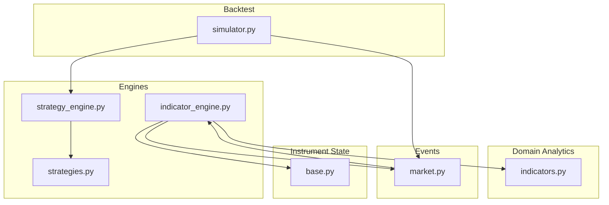
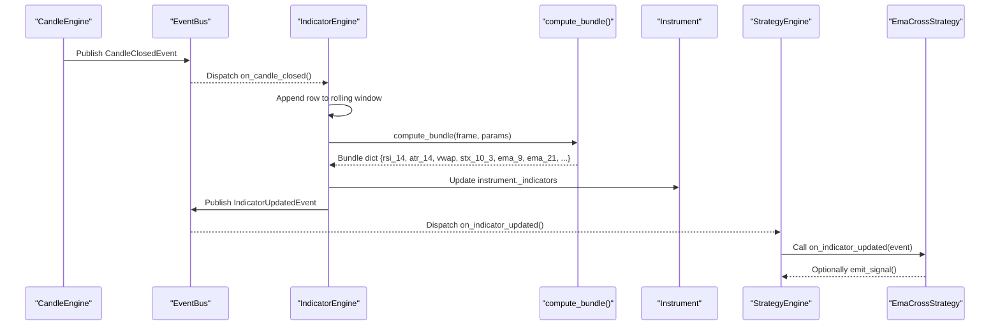
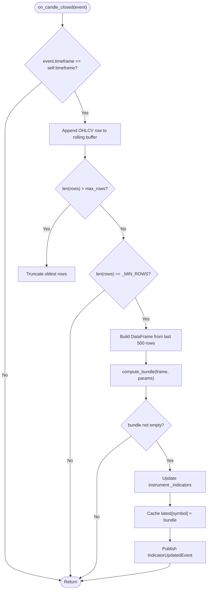
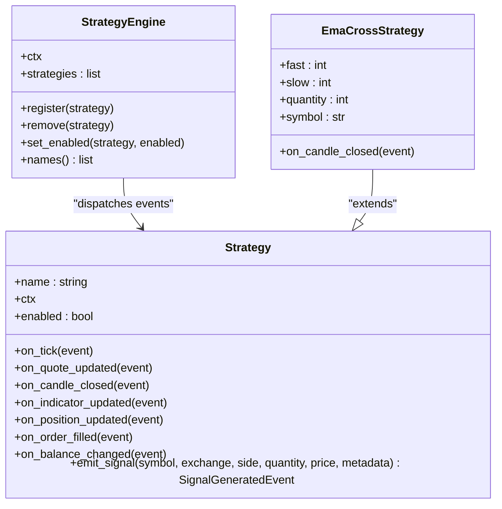
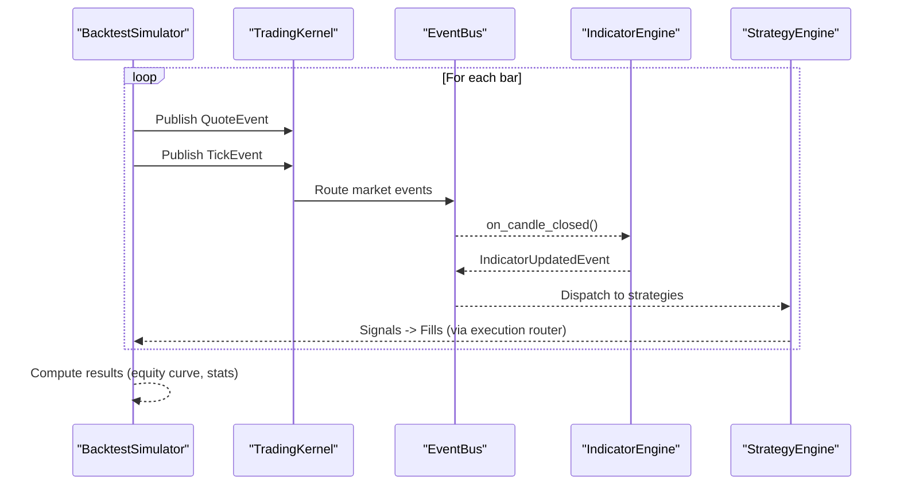
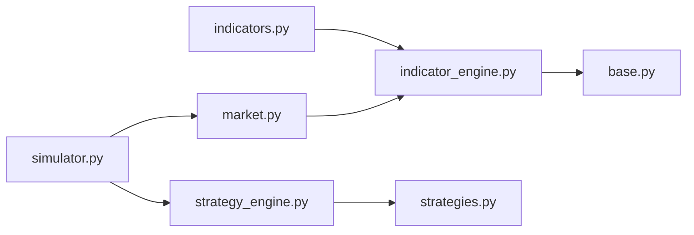

# Technical Indicators

<cite>
**Referenced Files in This Document**
- [indicators.py](file://ntrade/domain/analytics/indicators.py)
- [indicator_engine.py](file://ntrade/engines/indicator_engine.py)
- [market.py](file://ntrade/events/market.py)
- [strategies.py](file://ntrade/engines/strategies.py)
- [strategy_engine.py](file://ntrade/engines/strategy_engine.py)
- [simulator.py](file://ntrade/backtest/simulator.py)
- [base.py](file://ntrade/domain/instruments/base.py)
- [ARCHITECTURE.md](file://ARCHITECTURE.md)
- [test_indicators.py](file://tests/test_indicators.py)
</cite>

## Table of Contents
1. [Introduction](#introduction)
2. [Project Structure](#project-structure)
3. [Core Components](#core-components)
4. [Architecture Overview](#architecture-overview)
5. [Detailed Component Analysis](#detailed-component-analysis)
6. [Dependency Analysis](#dependency-analysis)
7. [Performance Considerations](#performance-considerations)
8. [Troubleshooting Guide](#troubleshooting-guide)
9. [Conclusion](#conclusion)
10. [Appendices](#appendices)

## Introduction
This document explains the technical indicators and their engine in nTrade. It covers built-in indicators (RSI, ATR, VWAP, SuperTrend, EMA, SMA), their mathematical foundations, parameters, and interpretation guidelines. It also documents the IndicatorEngine architecture for computing indicator bundles on candle close with automatic recalculation, how strategies consume these indicators, and how to extend the framework with custom indicators. Practical guidance is provided for performance optimization, memory management, integration with strategy engines, backtesting, and troubleshooting.

## Project Structure
The indicator system spans three layers:
- Domain analytics: pure functions over OHLCV dataframes that compute indicators.
- Engines: event-driven pipeline that maintains rolling windows and recomputes bundles on CandleClosedEvent.
- Strategies: read indicator values from instrument state or events to generate signals.

**Diagram sources**
- [indicators.py](file://ntrade/domain/analytics/indicators.py)
- [indicator_engine.py](file://ntrade/engines/indicator_engine.py)
- [market.py](file://ntrade/events/market.py)
- [strategies.py](file://ntrade/engines/strategies.py)
- [strategy_engine.py](file://ntrade/engines/strategy_engine.py)
- [simulator.py](file://ntrade/backtest/simulator.py)
- [base.py](file://ntrade/domain/instruments/base.py)

**Section sources**
- [ARCHITECTURE.md](file://ARCHITECTURE.md)

## Core Components
- Indicator functions: RSI, ATR, SMA, EMA, VWAP, SuperTrend, Heikin-Ashi, Renko bricks, and a bundle aggregator.
- IndicatorEngine: subscribes to CandleClosedEvent, maintains per-symbol rolling OHLCV window, computes bundle, updates instrument._indicators, and publishes IndicatorUpdatedEvent.
- Strategy base and EmaCrossStrategy: reads indicator bundle keys (e.g., ema_9, ema_21) to detect crossovers and emit signals.
- BacktestSimulator: replays historical bars as Quote/Tick events through the same kernel, ensuring zero parity between live and backtest.

Key responsibilities:
- Pure computation in domain layer keeps analytics dependency-free.
- Event-driven recomputation ensures consistency across live, replay, and backtest.
- Instrument stores computed indicators in a dict for fast access by strategies.

**Section sources**
- [indicators.py](file://ntrade/domain/analytics/indicators.py)
- [indicator_engine.py](file://ntrade/engines/indicator_engine.py)
- [strategies.py](file://ntrade/engines/strategies.py)
- [strategy_engine.py](file://ntrade/engines/strategy_engine.py)
- [simulator.py](file://ntrade/backtest/simulator.py)
- [base.py](file://ntrade/domain/instruments/base.py)

## Architecture Overview
Indicator computation is triggered by completed candles and flows through the event bus to update instruments and notify strategies.

**Diagram sources**
- [indicator_engine.py](file://ntrade/engines/indicator_engine.py)
- [indicators.py](file://ntrade/domain/analytics/indicators.py)
- [market.py](file://ntrade/events/market.py)
- [strategy_engine.py](file://ntrade/engines/strategy_engine.py)
- [strategies.py](file://ntrade/engines/strategies.py)

## Detailed Component Analysis

### Built-in Indicators: Mathematics, Parameters, Interpretation
- RSI (Relative Strength Index)
  - Inputs: close series, period (default 14).
  - Math: Smoothed average gains and losses using exponential weighting; RS = avg_gain / avg_loss; RSI = 100 - 100/(1 + RS). Zero-loss streaks are stabilized to avoid NaN and map to 100.
  - Output: Series clipped to [0, 100].
  - Interpretation: >70 often indicates overbought; <30 oversold; trend strength via slope and persistence.
  - Reference: [indicators.py](file://ntrade/domain/analytics/indicators.py)

- ATR (Average True Range)
  - Inputs: high, low, close; period (default 14).
  - Math: True range = max(high-low, |high-prev_close|, |low-prev_close|); smoothed average using exponential weighting.
  - Output: Series of volatility measure.
  - Interpretation: Higher values indicate higher volatility; used for stop placement and position sizing.
  - Reference: [indicators.py](file://ntrade/domain/analytics/indicators.py)

- VWAP (Volume Weighted Average Price)
  - Inputs: typical price = (H+L+C)/3; volume (defaults to 1 if missing).
  - Math: Cumulative sum of (typical * volume) divided by cumulative volume.
  - Output: Series representing session-average price weighted by volume.
  - Interpretation: Benchmark for intraday fair value; price above/below suggests bullish/bearish pressure.
  - Reference: [indicators.py](file://ntrade/domain/analytics/indicators.py)

- SuperTrend
  - Inputs: high, low, close; atr_period (default 10), multiplier (default 3.0).
  - Math: Uses HL2 and ATR to compute upper/lower bands; tracks trend direction based on closes crossing bands; outputs 'up'/'down'.
  - Output: DataFrame with column STX_{atr_period}_{multiplier}.
  - Interpretation: Trend-following; 'up' implies long bias, 'down' short bias; useful for trailing stops.
  - Reference: [indicators.py](file://ntrade/domain/analytics/indicators.py)

- EMA (Exponential Moving Average)
  - Inputs: close; period (default 9).
  - Math: Exponentially weighted moving average with span=period.
  - Output: Series.
  - Interpretation: Faster response than SMA; used for trend and crossover strategies.
  - Reference: [indicators.py](file://ntrade/domain/analytics/indicators.py)

- SMA (Simple Moving Average)
  - Inputs: close; period (default 20).
  - Math: Rolling mean over period.
  - Output: Series.
  - Interpretation: Smoother trend baseline; slower reaction to price changes.
  - Reference: [indicators.py](file://ntrade/domain/analytics/indicators.py)

- Heikin-Ashi and Renko Bricks
  - Heikin-Ashi transforms OHLC into smoothed candles to visualize trends.
  - Renko builds fixed-box bricks when price moves box_size beyond previous brick, filtering noise.
  - Reference: [indicators.py](file://ntrade/domain/analytics/indicators.py)

- Indicator Bundle Aggregation
  - Function compute_bundle(df, **params) returns a flat dict of latest values for configured indicators.
  - Keys include rsi_{period}, atr_{period}, vwap, stx_{atr_period}_{multiplier}, ema_{period}, sma_{period}.
  - Robustness: logs and skips failed computations rather than failing silently.
  - Reference: [indicators.py](file://ntrade/domain/analytics/indicators.py)

**Section sources**
- [indicators.py](file://ntrade/domain/analytics/indicators.py)
- [test_indicators.py](file://tests/test_indicators.py)

### IndicatorEngine: Recomputation and Management
Responsibilities:
- Subscribes to CandleClosedEvent for a specific timeframe.
- Maintains a rolling list of OHLCV rows per symbol with bounded size (max_rows).
- Builds a pandas DataFrame from recent rows (up to 500) and calls compute_bundle.
- Updates instrument._indicators and caches latest bundle per symbol.
- Publishes IndicatorUpdatedEvent with symbol, exchange, timeframe, indicators, and timestamp.

Behavioral notes:
- Skips computation until at least _MIN_ROWS candles are available.
- Bounded memory usage via max_rows and truncation policy.
- Timeframe filtering ensures only relevant candles trigger updates.

**Diagram sources**
- [indicator_engine.py](file://ntrade/engines/indicator_engine.py)
- [market.py](file://ntrade/events/market.py)

**Section sources**
- [indicator_engine.py](file://ntrade/engines/indicator_engine.py)
- [market.py](file://ntrade/events/market.py)

### Integration with Strategy Engine and Reusable Strategies
- Strategy base class defines hooks (on_tick, on_quote_updated, on_candle_closed, on_indicator_updated, etc.) and emit_signal helper.
- StrategyEngine dispatches events to registered strategies, swallowing exceptions per strategy.
- EmaCrossStrategy reads ema_{fast} and ema_{slow} from instrument._indicators (populated by IndicatorEngine) and emits BUY/SELL on golden/death crosses.

**Diagram sources**
- [strategy_engine.py](file://ntrade/engines/strategy_engine.py)
- [strategies.py](file://ntrade/engines/strategies.py)

**Section sources**
- [strategy_engine.py](file://ntrade/engines/strategy_engine.py)
- [strategies.py](file://ntrade/engines/strategies.py)

### Backtesting Integration
- BacktestSimulator feeds QuoteEvent and TickEvent per bar through the TradingKernel, ensuring identical processing as live trading.
- The same IndicatorEngine and StrategyEngine pipelines run during backtest, producing fills and equity curves.
- Results include final equity, total return, trades, commissions, statutory costs, futures carry costs, and max drawdown.

**Diagram sources**
- [simulator.py](file://ntrade/backtest/simulator.py)
- [indicator_engine.py](file://ntrade/engines/indicator_engine.py)
- [strategy_engine.py](file://ntrade/engines/strategy_engine.py)

**Section sources**
- [simulator.py](file://ntrade/backtest/simulator.py)

## Dependency Analysis
Indicators depend only on pandas and operate on OHLCV frames. IndicatorEngine depends on:
- Events: CandleClosedEvent, IndicatorUpdatedEvent.
- Domain analytics: compute_bundle.
- Context: instrument lookup and event bus publishing.

Strategies depend on:
- Strategy base class and StrategyEngine dispatch.
- Instrument._indicators populated by IndicatorEngine.

**Diagram sources**
- [indicators.py](file://ntrade/domain/analytics/indicators.py)
- [indicator_engine.py](file://ntrade/engines/indicator_engine.py)
- [market.py](file://ntrade/events/market.py)
- [base.py](file://ntrade/domain/instruments/base.py)
- [strategy_engine.py](file://ntrade/engines/strategy_engine.py)
- [strategies.py](file://ntrade/engines/strategies.py)
- [simulator.py](file://ntrade/backtest/simulator.py)

**Section sources**
- [indicators.py](file://ntrade/domain/analytics/indicators.py)
- [indicator_engine.py](file://ntrade/engines/indicator_engine.py)
- [market.py](file://ntrade/events/market.py)
- [base.py](file://ntrade/domain/instruments/base.py)
- [strategy_engine.py](file://ntrade/engines/strategy_engine.py)
- [strategies.py](file://ntrade/engines/strategies.py)
- [simulator.py](file://ntrade/backtest/simulator.py)

## Performance Considerations
- Rolling window bounds: IndicatorEngine limits stored rows via max_rows and truncates oldest entries to control memory.
- DataFrame slicing: Only last 500 rows are converted to DataFrame for computation to reduce overhead.
- Warm-up thresholds: Minimum rows (_MIN_ROWS) prevent premature computation and NaN propagation.
- Vectorized operations: Indicator functions use pandas vectorization (ewm, rolling) for efficient computation.
- Bundle caching: Latest bundle per symbol cached in engine for quick access by consumers.
- Error isolation: Individual indicator failures are logged and skipped without breaking the bundle.

Recommendations:
- Tune max_rows based on memory constraints and required lookback.
- Use appropriate timeframes to balance signal frequency and computational load.
- Avoid excessive indicator periods that increase warm-up time.
- Prefer EMA/SMA where possible for faster convergence compared to longer SMA windows.

[No sources needed since this section provides general guidance]

## Troubleshooting Guide
Common issues and resolutions:
- Missing indicator values:
  - Ensure enough candles have closed to satisfy min_periods for each indicator.
  - Verify timeframe matches the engine’s configured timeframe.
- Unexpected NaNs:
  - Check for insufficient history or malformed OHLCV data.
  - Confirm volume presence for VWAP; defaults to 1 if missing but may affect values.
- SuperTrend anomalies:
  - Validate atr_period and multiplier; extreme multipliers can delay signals.
- Bundle key mismatches:
  - Confirm parameter names passed to compute_bundle match expected keys (e.g., ema_periods, sma_periods).
- Performance degradation:
  - Reduce max_rows or timeframe frequency; ensure DataFrame slicing remains within reasonable bounds.

Diagnostic tips:
- Inspect engine._latest[symbol] for current bundle contents.
- Log warnings from compute_bundle for failed indicators.
- Validate input DataFrame schema includes open/high/low/close/volume/timestamp.

**Section sources**
- [indicators.py](file://ntrade/domain/analytics/indicators.py)
- [indicator_engine.py](file://ntrade/engines/indicator_engine.py)
- [test_indicators.py](file://tests/test_indicators.py)

## Conclusion
nTrade’s indicator system combines pure, vectorized analytics with an event-driven engine to deliver consistent, scalable computation across live, replay, and backtest environments. Built-in indicators cover momentum, volatility, and trend-following needs, while the IndicatorEngine ensures timely updates and robust error handling. Strategies consume indicators via standardized events and instrument state, enabling reusable logic and zero-parity execution. Extensibility is straightforward: add new indicator functions and integrate them into the bundle aggregator.

[No sources needed since this section summarizes without analyzing specific files]

## Appendices

### Custom Indicator Development Patterns
Steps to implement a new indicator:
- Add a pure function in the domain analytics module that accepts a pandas DataFrame and returns a Series or scalar.
- Integrate into compute_bundle by adding a new key and capturing its latest value.
- If needed, expose parameters via compute_bundle kwargs.
- Ensure tests validate behavior and edge cases (NaN handling, bounds, warm-up).

Guidelines:
- Keep functions dependency-free and vectorized.
- Handle missing or invalid data gracefully.
- Provide meaningful default parameters aligned with common usage.

**Section sources**
- [indicators.py](file://ntrade/domain/analytics/indicators.py)
- [test_indicators.py](file://tests/test_indicators.py)

### Practical Examples: Combining Indicators for Signal Generation
- Momentum + Volatility: Use RSI for momentum and ATR for dynamic stop levels.
- Trend + Mean Reversion: Combine SuperTrend direction with EMA crossovers to filter entries.
- Volume Confirmation: Use VWAP to confirm breakouts or reversals signaled by other indicators.

Backtesting approach:
- Register a strategy that reads indicator bundle keys and emits signals on conditions.
- Run BacktestSimulator with historical OHLCV data and evaluate metrics like total return, max drawdown, and trade count.

**Section sources**
- [strategies.py](file://ntrade/engines/strategies.py)
- [simulator.py](file://ntrade/backtest/simulator.py)