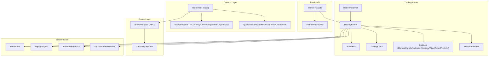
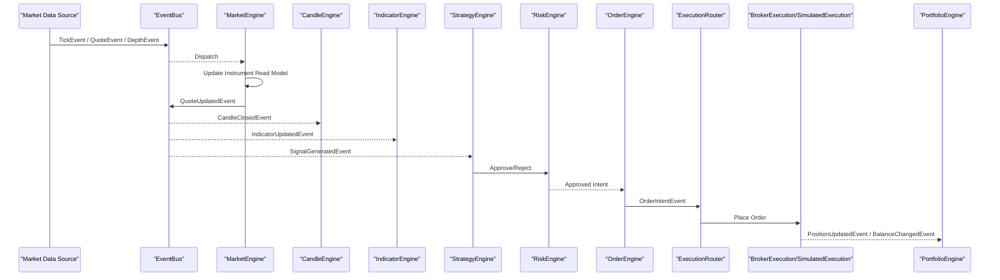
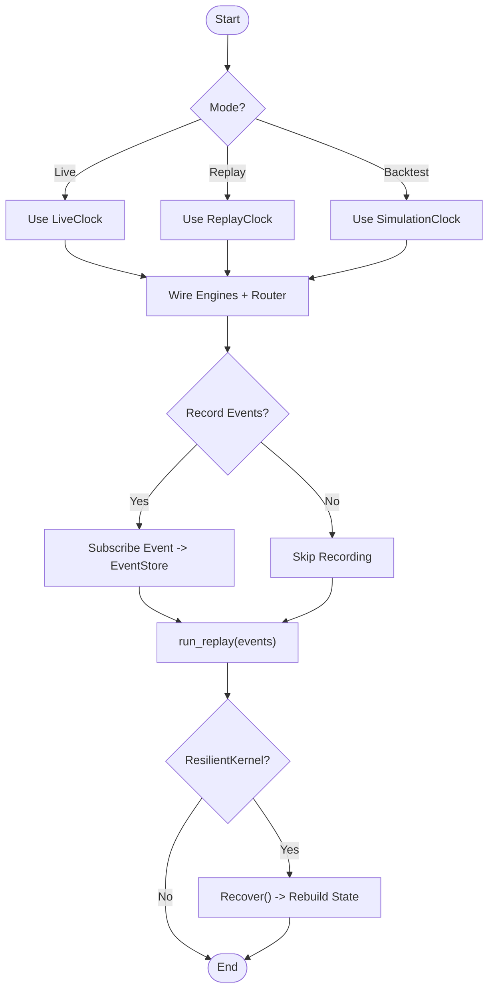
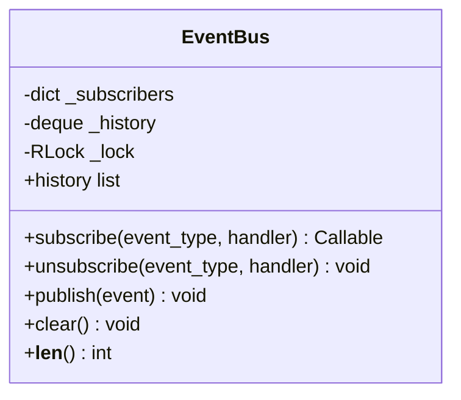
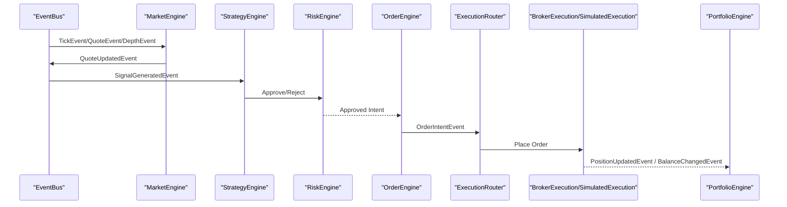
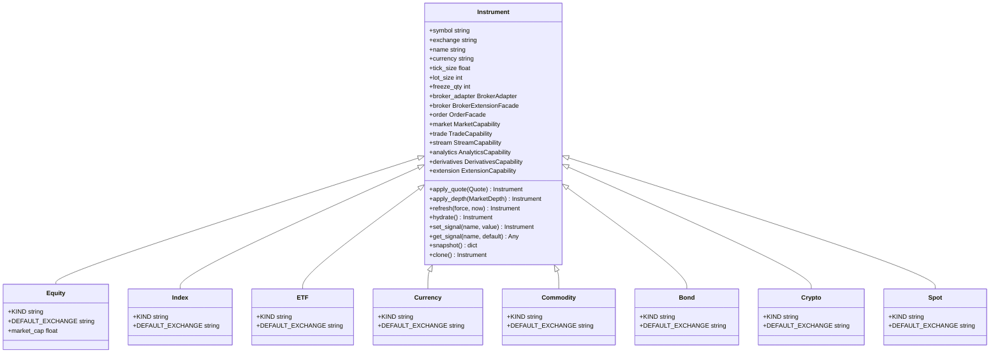
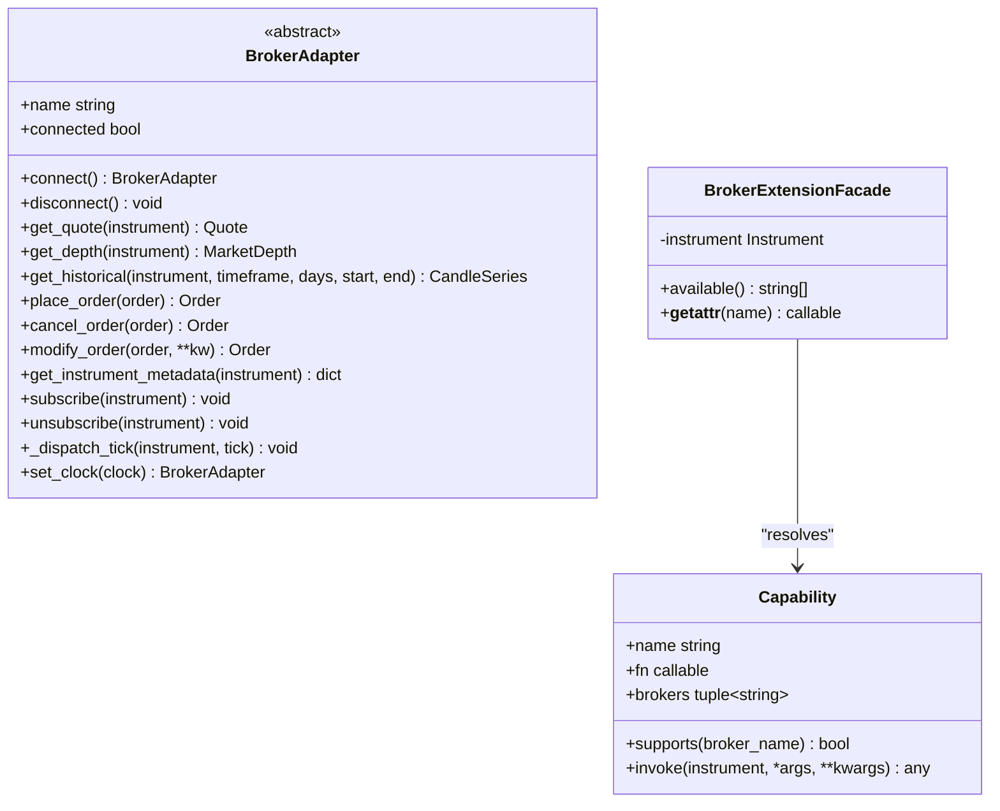
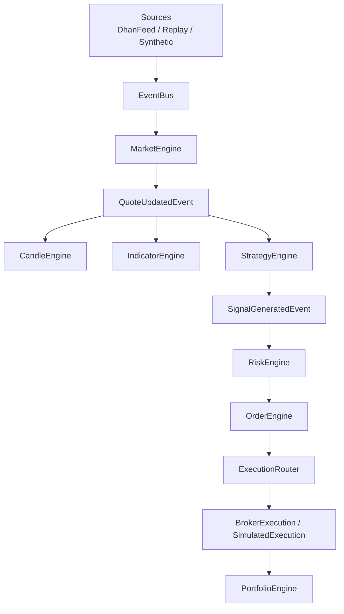
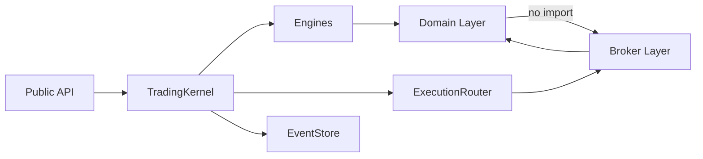

# Architecture Overview

<cite>
**Referenced Files in This Document**
- [ARCHITECTURE.md](file://ARCHITECTURE.md)
- [ntrade/__init__.py](file://ntrade/__init__.py)
- [ntrade/facade.py](file://ntrade/facade.py)
- [ntrade/kernel/trading_session.py](file://ntrade/kernel/trading_session.py)
- [ntrade/kernel/session.py](file://ntrade/kernel/session.py)
- [ntrade/kernel/event_bus.py](file://ntrade/kernel/event_bus.py)
- [ntrade/kernel/resilient.py](file://ntrade/kernel/resilient.py)
- [ntrade/engines/market_engine.py](file://ntrade/engines/market_engine.py)
- [ntrade/engines/strategy_engine.py](file://ntrade/engines/strategy_engine.py)
- [ntrade/domain/instruments/base.py](file://ntrade/domain/instruments/base.py)
- [ntrade/domain/instruments/cash.py](file://ntrade/domain/instruments/cash.py)
- [ntrade/brokers/base.py](file://ntrade/brokers/base.py)
- [ntrade/brokers/capabilities.py](file://ntrade/brokers/capabilities.py)
- [ntrade/events/base.py](file://ntrade/events/base.py)
</cite>

## Table of Contents
1. Introduction
2. Project Structure
3. Core Components
4. Architecture Overview
5. Detailed Component Analysis
6. Dependency Analysis
7. Performance Considerations
8. Troubleshooting Guide
9. Conclusion

## Introduction
This document explains nTrade’s Clean Architecture design and its event-centric trading kernel that guarantees zero parity across live, replay, and backtest modes. It details the layered separation between public API, trading kernel, domain layer, broker layer, and infrastructure; describes component interactions including TradingKernel coordination, EventBus pub/sub, and engine stack processing; documents the domain model hierarchy from base Instrument through asset-specific implementations; and explains the broker abstraction pattern using BrokerAdapter and capability system. It also covers data flows from market data sources through engines to execution, cross-cutting concerns like error isolation and resilience, and technical decisions such as dependency injection, immutable data structures, and observer patterns.

## Project Structure
nTrade is organized into clear layers:
- Public API (facade + factories): Market facade and factory entry points for users.
- Trading Kernel (event-centric): TradingKernel, EventBus, clocks, engines, execution router, replay/backtest simulators.
- Domain Layer: Instruments, market data models, analytics, orders, session state.
- Broker Layer: Adapter abstraction with concrete brokers and capability extensions.
- Infrastructure: Transport, persistence (EventStore), replay, synthetic feeds.

**Diagram sources**
- [ntrade/facade.py:1-101](file://ntrade/facade.py#L1-L101)
- [ntrade/kernel/session.py:1-198](file://ntrade/kernel/session.py#L1-L198)
- [ntrade/kernel/event_bus.py:1-81](file://ntrade/kernel/event_bus.py#L1-L81)
- [ntrade/kernel/resilient.py:1-147](file://ntrade/kernel/resilient.py#L1-L147)
- [ntrade/engines/market_engine.py:1-64](file://ntrade/engines/market_engine.py#L1-L64)
- [ntrade/domain/instruments/base.py:1-305](file://ntrade/domain/instruments/base.py#L1-L305)
- [ntrade/domain/instruments/cash.py:1-50](file://ntrade/domain/instruments/cash.py#L1-L50)
- [ntrade/brokers/base.py:1-163](file://ntrade/brokers/base.py#L1-L163)
- [ntrade/brokers/capabilities.py:1-74](file://ntrade/brokers/capabilities.py#L1-L74)

**Section sources**
- [ARCHITECTURE.md:20-51](file://ARCHITECTURE.md#L20-L51)
- [ntrade/__init__.py:1-105](file://ntrade/__init__.py#L1-L105)

## Core Components
- TradingSession: Unified entry point combining broker connection, instrument creation, kernel lifecycle, and strategy management.
- TradingKernel: Wires the engine stack, event bus, clock, and execution target; supports live/replay/backtest with identical stacks.
- EventBus: Synchronous pub/sub with MRO-based subscription, reentrant dispatch, and per-event history.
- Engines: Market, Candle, Indicator, Strategy, Risk, Order, Portfolio, PositionSync — each subscribes to canonical events and publishes derived events.
- Execution Router: Routes order intents to SimulatedExecution or BrokerExecution based on mode.
- ResilientKernel: Crash recovery by replaying causal events from EventStore without re-trading.

Key responsibilities and interactions are implemented in the following files:
- Session orchestration and lifecycle: [ntrade/kernel/trading_session.py:1-306](file://ntrade/kernel/trading_session.py#L1-L306)
- Kernel wiring and replay: [ntrade/kernel/session.py:1-198](file://ntrade/kernel/session.py#L1-L198)
- Pub/sub bus: [ntrade/kernel/event_bus.py:1-81](file://ntrade/kernel/event_bus.py#L1-L81)
- Engine pipeline (market projection): [ntrade/engines/market_engine.py:1-64](file://ntrade/engines/market_engine.py#L1-L64)
- Strategy hooks and signal emission: [ntrade/engines/strategy_engine.py:1-102](file://ntrade/engines/strategy_engine.py#L1-L102)
- Recovery flow: [ntrade/kernel/resilient.py:1-147](file://ntrade/kernel/resilient.py#L1-L147)

**Section sources**
- [ntrade/kernel/trading_session.py:1-306](file://ntrade/kernel/trading_session.py#L1-L306)
- [ntrade/kernel/session.py:1-198](file://ntrade/kernel/session.py#L1-L198)
- [ntrade/kernel/event_bus.py:1-81](file://ntrade/kernel/event_bus.py#L1-L81)
- [ntrade/engines/market_engine.py:1-64](file://ntrade/engines/market_engine.py#L1-L64)
- [ntrade/engines/strategy_engine.py:1-102](file://ntrade/engines/strategy_engine.py#L1-L102)
- [ntrade/kernel/resilient.py:1-147](file://ntrade/kernel/resilient.py#L1-L147)

## Architecture Overview
The framework enforces a strict dependency rule: domain layer imports nothing from broker layer. Instruments receive a BrokerAdapter via constructor injection and access broker capabilities through a facade that resolves at call time. The kernel is event-centric: brokers, replays, and simulators are interchangeable event sources; instruments become read models updated by events rather than pulling state.

**Diagram sources**
- [ntrade/kernel/session.py:1-198](file://ntrade/kernel/session.py#L1-L198)
- [ntrade/engines/market_engine.py:1-64](file://ntrade/engines/market_engine.py#L1-L64)
- [ntrade/engines/strategy_engine.py:1-102](file://ntrade/engines/strategy_engine.py#L1-L102)

**Section sources**
- [ARCHITECTURE.md:20-51](file://ARCHITECTURE.md#L20-L51)
- [ARCHITECTURE.md:156-215](file://ARCHITECTURE.md#L156-L215)

## Detailed Component Analysis

### TradingKernel Coordination and Zero Parity
- TradingKernel wires engines and execution targets; only clock and execution target differ across modes.
- Replay uses ReplayClock to follow event timestamps; live uses LiveClock; backtest uses SimulationClock.
- EventStore records all published events; run_replay replays a timestamped stream deterministically.
- ResilientKernel recovers state by replaying causal events (market + fills) without re-trading, then rebuilds open-order deltas and reseeds execution sequences.

**Diagram sources**
- [ntrade/kernel/session.py:1-198](file://ntrade/kernel/session.py#L1-L198)
- [ntrade/kernel/resilient.py:1-147](file://ntrade/kernel/resilient.py#L1-L147)

**Section sources**
- [ntrade/kernel/session.py:1-198](file://ntrade/kernel/session.py#L1-L198)
- [ntrade/kernel/resilient.py:1-147](file://ntrade/kernel/resilient.py#L1-L147)

### EventBus Pub/Sub System
- Subscriptions support base-class handlers via MRO; handler exceptions are swallowed to isolate failures.
- Publish serializes dispatch with an RLock; maintains bounded history for replay/debugging.
- Used throughout kernel for decoupling producers/consumers (market data, signals, portfolio updates).

**Diagram sources**
- [ntrade/kernel/event_bus.py:1-81](file://ntrade/kernel/event_bus.py#L1-L81)

**Section sources**
- [ntrade/kernel/event_bus.py:1-81](file://ntrade/kernel/event_bus.py#L1-L81)

### Engine Stack Processing
- MarketEngine projects raw events into instrument read-model state and emits normalized QuoteUpdatedEvent.
- StrategyEngine fans events to strategies via hooks; strategies emit signals which go through RiskEngine before becoming orders.
- OrderEngine routes intents to ExecutionRouter; execution targets publish fill/update events to PortfolioEngine.

**Diagram sources**
- [ntrade/engines/market_engine.py:1-64](file://ntrade/engines/market_engine.py#L1-L64)
- [ntrade/engines/strategy_engine.py:1-102](file://ntrade/engines/strategy_engine.py#L1-L102)

**Section sources**
- [ntrade/engines/market_engine.py:1-64](file://ntrade/engines/market_engine.py#L1-L64)
- [ntrade/engines/strategy_engine.py:1-102](file://ntrade/engines/strategy_engine.py#L1-L102)

### Domain Model Hierarchy
- Base Instrument encapsulates state (quote, depth, history, stream, indicators, signals, metadata, session) and exposes capability objects for market, trade, stream, analytics, derivatives, and extension.
- Asset-specific classes specialize behavior and defaults (e.g., Equity, Index, ETF, Currency, Commodity, Bond, Crypto, Spot).
- Instruments apply events via apply_quote/apply_depth; hydrate metadata lazily from broker adapter.

**Diagram sources**
- [ntrade/domain/instruments/base.py:1-305](file://ntrade/domain/instruments/base.py#L1-L305)
- [ntrade/domain/instruments/cash.py:1-50](file://ntrade/domain/instruments/cash.py#L1-L50)

**Section sources**
- [ntrade/domain/instruments/base.py:1-305](file://ntrade/domain/instruments/base.py#L1-L305)
- [ntrade/domain/instruments/cash.py:1-50](file://ntrade/domain/instruments/cash.py#L1-L50)

### Broker Abstraction Pattern and Capability System
- BrokerAdapter abstracts transport; implements connect/disconnect, quote/depth/history retrieval, order placement, lifecycle methods, streaming multiplexing, and optional portfolio endpoints.
- Capability system registers broker-specific features globally; instrument.broker.<capability>() resolves dynamically and fails fast if unsupported.
- Dependency injection: Instrument receives BrokerAdapter via constructor or lazy factory; kernel injects clock for zero-parity timestamps.

**Diagram sources**
- [ntrade/brokers/base.py:1-163](file://ntrade/brokers/base.py#L1-L163)
- [ntrade/brokers/capabilities.py:1-74](file://ntrade/brokers/capabilities.py#L1-L74)

**Section sources**
- [ntrade/brokers/base.py:1-163](file://ntrade/brokers/base.py#L1-L163)
- [ntrade/brokers/capabilities.py:1-74](file://ntrade/brokers/capabilities.py#L1-L74)

### System Context: Data Flows from Sources to Execution
- Market data sources (live broker feed, replay store, synthetic simulator) produce canonical events.
- EventBus distributes events to engines; MarketEngine updates instrument read models; downstream engines compute candles, indicators, signals, risk checks, and order intents.
- ExecutionRouter selects appropriate execution target; fills update portfolio and publish balance changes.

**Diagram sources**
- [ntrade/kernel/session.py:1-198](file://ntrade/kernel/session.py#L1-L198)
- [ntrade/engines/market_engine.py:1-64](file://ntrade/engines/market_engine.py#L1-L64)
- [ntrade/engines/strategy_engine.py:1-102](file://ntrade/engines/strategy_engine.py#L1-L102)

**Section sources**
- [ARCHITECTURE.md:156-215](file://ARCHITECTURE.md#L156-L215)

## Dependency Analysis
- Dependency direction: Public API depends on Kernel and Domain; Kernel depends on Engines, Execution, Storage; Domain depends on no Broker layer; Broker layer depends on Domain types only.
- Coupling: EventBus decouples engines; BrokerAdapter isolates transport; Capability system avoids conditional logic in domain.
- External dependencies: EventStore for persistence; Clock abstractions for deterministic time; optional broker transports hidden behind adapters.

**Diagram sources**
- [ntrade/facade.py:1-101](file://ntrade/facade.py#L1-L101)
- [ntrade/kernel/session.py:1-198](file://ntrade/kernel/session.py#L1-L198)
- [ntrade/brokers/base.py:1-163](file://ntrade/brokers/base.py#L1-L163)

**Section sources**
- [ARCHITECTURE.md:20-51](file://ARCHITECTURE.md#L20-L51)

## Performance Considerations
- EventBus serialization ensures thread-safe dispatch under concurrent producers (websocket callbacks vs runner loop).
- Immutable events and frozen dataclasses enable safe recording, replay, and comparison.
- Lazy hydration and cached properties reduce overhead until needed.
- Replay/backtest use deterministic clocks to avoid wall-clock variability.

[No sources needed since this section provides general guidance]

## Troubleshooting Guide
- Error isolation: EventBus swallows handler exceptions; one bad subscriber cannot crash the kernel.
- Resilience: ResilientKernel recovers state deterministically without re-trading; open-order deltas restored; execution sequence reseeded.
- Common issues: Missing broker capabilities raise AttributeError; ensure capability registered and supported by current broker.

**Section sources**
- [ntrade/kernel/event_bus.py:1-81](file://ntrade/kernel/event_bus.py#L1-L81)
- [ntrade/kernel/resilient.py:1-147](file://ntrade/kernel/resilient.py#L1-L147)
- [ntrade/brokers/capabilities.py:1-74](file://ntrade/brokers/capabilities.py#L1-L74)

## Conclusion
nTrade’s Clean Architecture separates concerns across layers, enabling interchangeable event sources and execution targets while preserving zero parity across live, replay, and backtest. The event-centric kernel, robust pub/sub system, rich domain model, and extensible broker abstraction provide a resilient, testable, and scalable foundation for institutional-grade trading systems.

[No sources needed since this section summarizes without analyzing specific files]