# Broker Abstraction Pattern

<cite>
**Referenced Files in This Document**
- [base.py](file://ntrade/brokers/base.py)
- [capabilities.py](file://ntrade/brokers/capabilities.py)
- [dhan.py](file://ntrade/brokers/dhan.py)
- [paper.py](file://ntrade/brokers/paper.py)
- [dhan_auth.py](file://ntrade/brokers/dhan_auth.py)
- [dhan_auth_provider.py](file://ntrade/brokers/dhan_auth_provider.py)
- [dhan_mapper.py](file://ntrade/brokers/dhan_mapper.py)
- [dhan_transport.py](file://ntrade/brokers/dhan_transport.py)
- [factories.py](file://ntrade/factories.py)
- [test_brokers.py](file://tests/test_brokers.py)
</cite>

## Table of Contents
1. [Introduction](#introduction)
2. [Project Structure](#project-structure)
3. [Core Components](#core-components)
4. [Architecture Overview](#architecture-overview)
5. [Detailed Component Analysis](#detailed-component-analysis)
6. [Dependency Analysis](#dependency-analysis)
7. [Performance Considerations](#performance-considerations)
8. [Troubleshooting Guide](#troubleshooting-guide)
9. [Conclusion](#conclusion)
10. [Appendices](#appendices)

## Introduction
This document explains nTrade’s broker abstraction pattern that enables seamless switching between live and simulated trading environments without changing strategy or engine code. The core is the BrokerAdapter base class defining a uniform contract for market data, orders, portfolio, and streaming. DhanBroker implements full production capabilities over Dhan-Tradehull, while PaperBroker provides deterministic simulation for testing and backtesting. A capability system exposes broker-specific features dynamically with fail-fast behavior when unsupported.

## Project Structure
The broker layer lives under ntrade/brokers and is composed of:
- Base adapter and capability registry
- Live broker implementation (Dhan)
- Simulation broker (Paper)
- Authentication, transport, and mapping utilities for Dhan

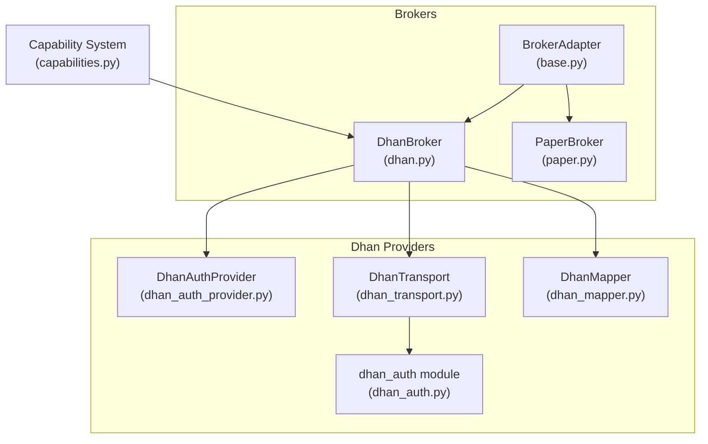

**Diagram sources**
- [base.py](file://ntrade/brokers/base.py)
- [dhan.py](file://ntrade/brokers/dhan.py)
- [paper.py](file://ntrade/brokers/paper.py)
- [dhan_auth_provider.py](file://ntrade/brokers/dhan_auth_provider.py)
- [dhan_transport.py](file://ntrade/brokers/dhan_transport.py)
- [dhan_mapper.py](file://ntrade/brokers/dhan_mapper.py)
- [dhan_auth.py](file://ntrade/brokers/dhan_auth.py)
- [capabilities.py](file://ntrade/brokers/capabilities.py)

**Section sources**
- [base.py](file://ntrade/brokers/base.py)
- [dhan.py](file://ntrade/brokers/dhan.py)
- [paper.py](file://ntrade/brokers/paper.py)
- [capabilities.py](file://ntrade/brokers/capabilities.py)

## Core Components
- BrokerAdapter: Abstract base defining connect/disconnect, market data (quote, depth, historical), order lifecycle, portfolio queries, and subscription multiplexing. It also injects a clock for zero-parity timestamps across replay/live.
- DhanBroker: Full-featured production broker implementing all adapter methods, integrating authentication, transport, and normalization layers.
- PaperBroker: Deterministic in-memory broker for tests/backtests with realistic quote/depth/history generation and immediate fills.
- Capability System: Dynamic feature discovery via decorators; instrument.broker.<capability>() resolves at runtime based on the active broker.

Key responsibilities:
- Uniform domain-facing API regardless of broker
- Time parity through injected clock
- Fail-fast capability checks to avoid hidden if/else branches
- Clean separation of concerns: auth, transport, mapping

**Section sources**
- [base.py](file://ntrade/brokers/base.py)
- [dhan.py](file://ntrade/brokers/dhan.py)
- [paper.py](file://ntrade/brokers/paper.py)
- [capabilities.py](file://ntrade/brokers/capabilities.py)

## Architecture Overview
The DhanBroker composes three providers:
- DhanAuthProvider: Lifecycle management and proactive token refresh using PIN+TOTP fallback
- DhanTransport: Retry and error handling around Tradehull API calls
- DhanMapper: Pure data normalization functions

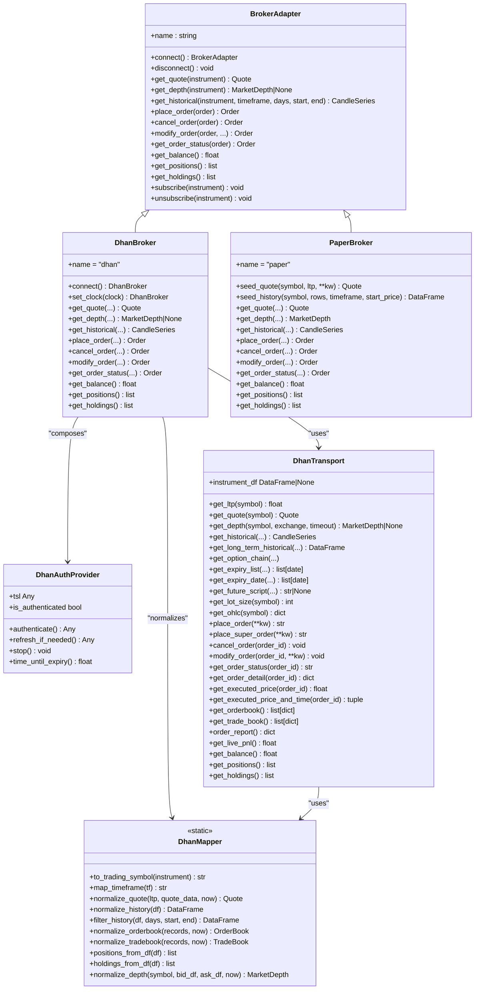

**Diagram sources**
- [base.py](file://ntrade/brokers/base.py)
- [dhan.py](file://ntrade/brokers/dhan.py)
- [paper.py](file://ntrade/brokers/paper.py)
- [dhan_auth_provider.py](file://ntrade/brokers/dhan_auth_provider.py)
- [dhan_transport.py](file://ntrade/brokers/dhan_transport.py)
- [dhan_mapper.py](file://ntrade/brokers/dhan_mapper.py)

## Detailed Component Analysis

### BrokerAdapter (Base Contract)
- Defines the minimal interface every broker must implement: connection, quotes, depth, history, orders, portfolio, and subscriptions.
- Provides default implementations for optional operations (e.g., get_depth returns None by default).
- Manages subscription state and dispatches ticks to instruments’ streams.
- Clock injection ensures replay parity.

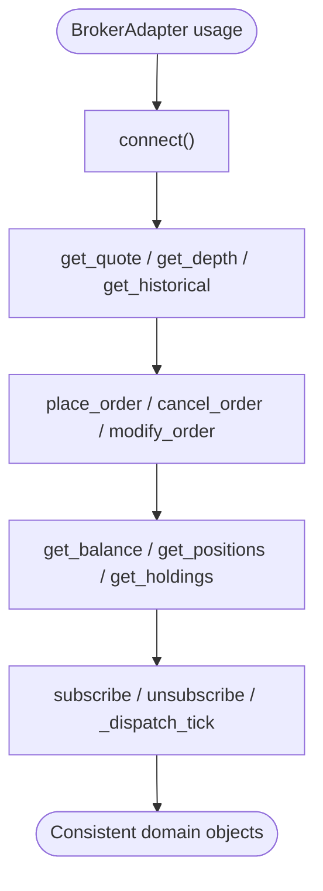

**Section sources**
- [base.py](file://ntrade/brokers/base.py)

### DhanBroker (Production Implementation)
- Implements all adapter methods with robust retry and error handling.
- Enforces SEBI-compliant LIMIT orders for F&O exchanges by converting MARKET to LIMIT with LTP-based price offsets.
- Supports bracket orders via place_super_order.
- Normalizes quotes, depth, history, option chains, and order books into domain types.
- Integrates with DhanAuthProvider for token lifecycle and DhanTransport for API calls.

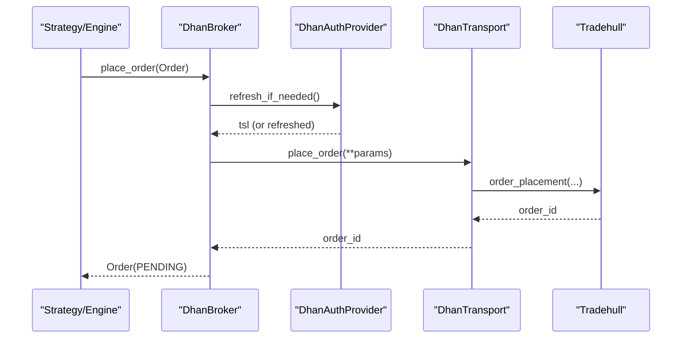

**Diagram sources**
- [dhan.py](file://ntrade/brokers/dhan.py)
- [dhan_auth_provider.py](file://ntrade/brokers/dhan_auth_provider.py)
- [dhan_transport.py](file://ntrade/brokers/dhan_transport.py)

**Section sources**
- [dhan.py](file://ntrade/brokers/dhan.py)

### PaperBroker (Simulation)
- Always connected, deterministic seeding for quotes and history.
- Immediate fills for orders with realistic prices from seeded quotes.
- In-memory order book and trade book for inspection.
- Pushes synthetic ticks to instrument streams for event-driven testing.

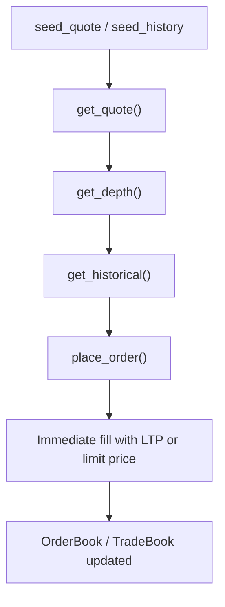

**Diagram sources**
- [paper.py](file://ntrade/brokers/paper.py)

**Section sources**
- [paper.py](file://ntrade/brokers/paper.py)

### Capability System (Dynamic Feature Discovery)
- Capabilities are registered globally with a name, function, and allowed brokers.
- instrument.broker.<cap>() invokes the capability only if supported; otherwise raises AttributeError (fail-fast).
- Many Dhan-specific features are exposed this way (e.g., depth20, market_feed, kill_switch, margin_calculator, super orders).

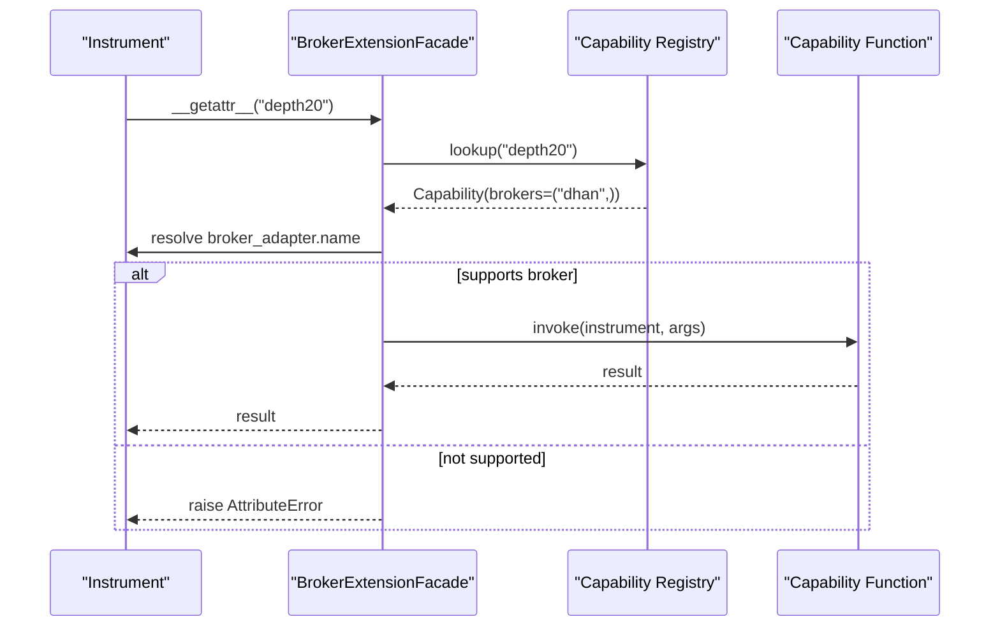

**Diagram sources**
- [capabilities.py](file://ntrade/brokers/capabilities.py)
- [dhan.py](file://ntrade/brokers/dhan.py)

**Section sources**
- [capabilities.py](file://ntrade/brokers/capabilities.py)
- [dhan.py](file://ntrade/brokers/dhan.py)
- [test_brokers.py](file://tests/test_brokers.py)

### Authentication Flow (Dhan)
- Prioritizes shared token store, then env access token (with expiry buffer), finally PIN+TOTP fallback.
- Proactive background refresh avoids mid-session expiry.
- Cooldown protection prevents rapid TOTP attempts.

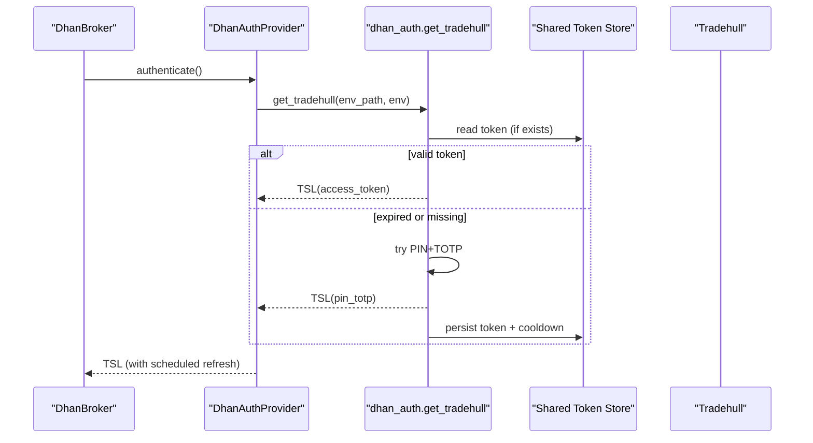

**Diagram sources**
- [dhan_auth_provider.py](file://ntrade/brokers/dhan_auth_provider.py)
- [dhan_auth.py](file://ntrade/brokers/dhan_auth.py)

**Section sources**
- [dhan_auth.py](file://ntrade/brokers/dhan_auth.py)
- [dhan_auth_provider.py](file://ntrade/brokers/dhan_auth_provider.py)

### Connection Management and Streaming
- BrokerAdapter tracks subscriptions per instrument symbol and notifies streams on disconnect.
- DhanBroker propagates clock to transport for time parity.
- PaperBroker always connected; push_tick emits ticks to subscribed streams.

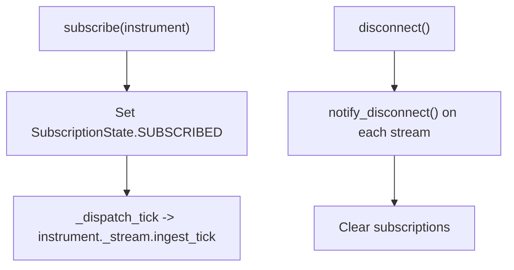

**Section sources**
- [base.py](file://ntrade/brokers/base.py)
- [paper.py](file://ntrade/brokers/paper.py)

### Error Handling Strategies
- DhanTransport wraps flaky endpoints with retries; raises BrokerDataError for critical failures (e.g., zero LTP).
- DhanBroker converts marketplace errors to clear RuntimeError messages and updates order status consistently.
- PaperBroker never fails; deterministic behavior aids debugging.

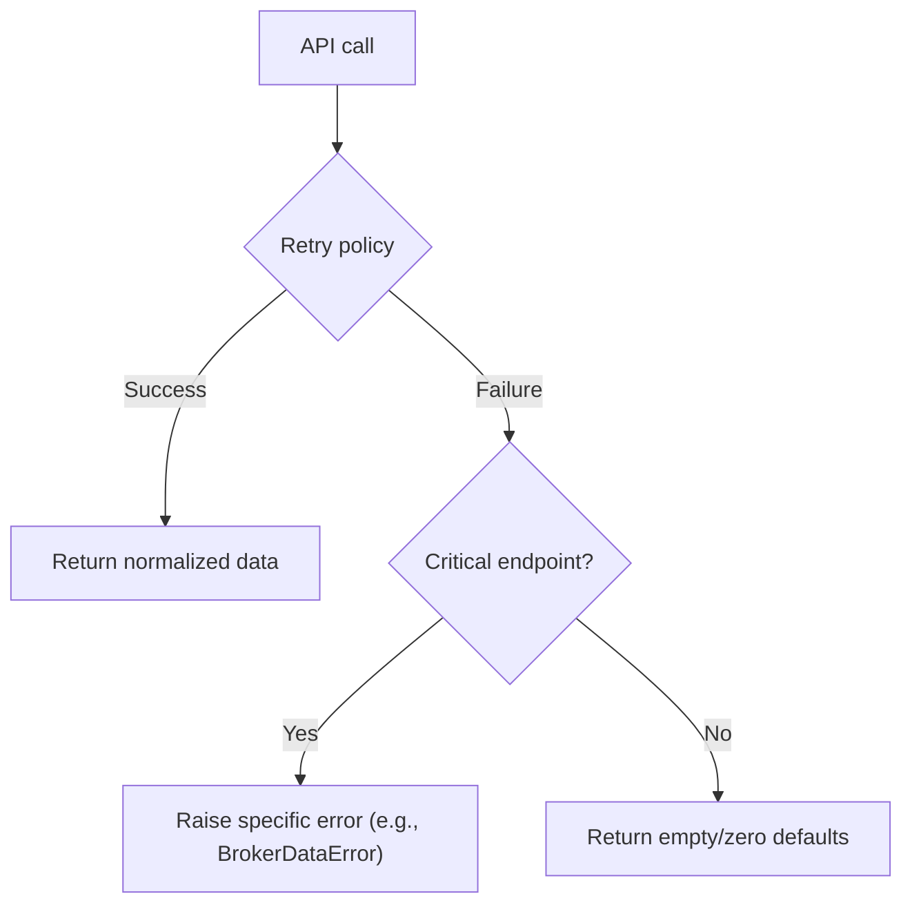

**Section sources**
- [dhan_transport.py](file://ntrade/brokers/dhan_transport.py)
- [dhan.py](file://ntrade/brokers/dhan.py)

### Broker-Specific Order Routing and Fill Handling
- DhanBroker enforces LIMIT for F&O, converts MARKET to LIMIT with LTP-based offset.
- Bracket orders routed to place_super_order; standard orders via order_placement.
- PaperBroker fills immediately at LTP or limit price; maintains internal order list.

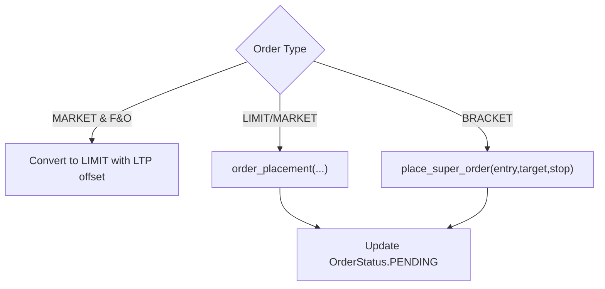

**Section sources**
- [dhan.py](file://ntrade/brokers/dhan.py)
- [paper.py](file://ntrade/brokers/paper.py)

### Market Data Normalization
- DhanMapper normalizes quotes, depth, history, and books into domain types.
- DhanBroker uses mapper helpers to ensure consistent field names and types.
- PaperBroker generates synthetic but structurally identical data.

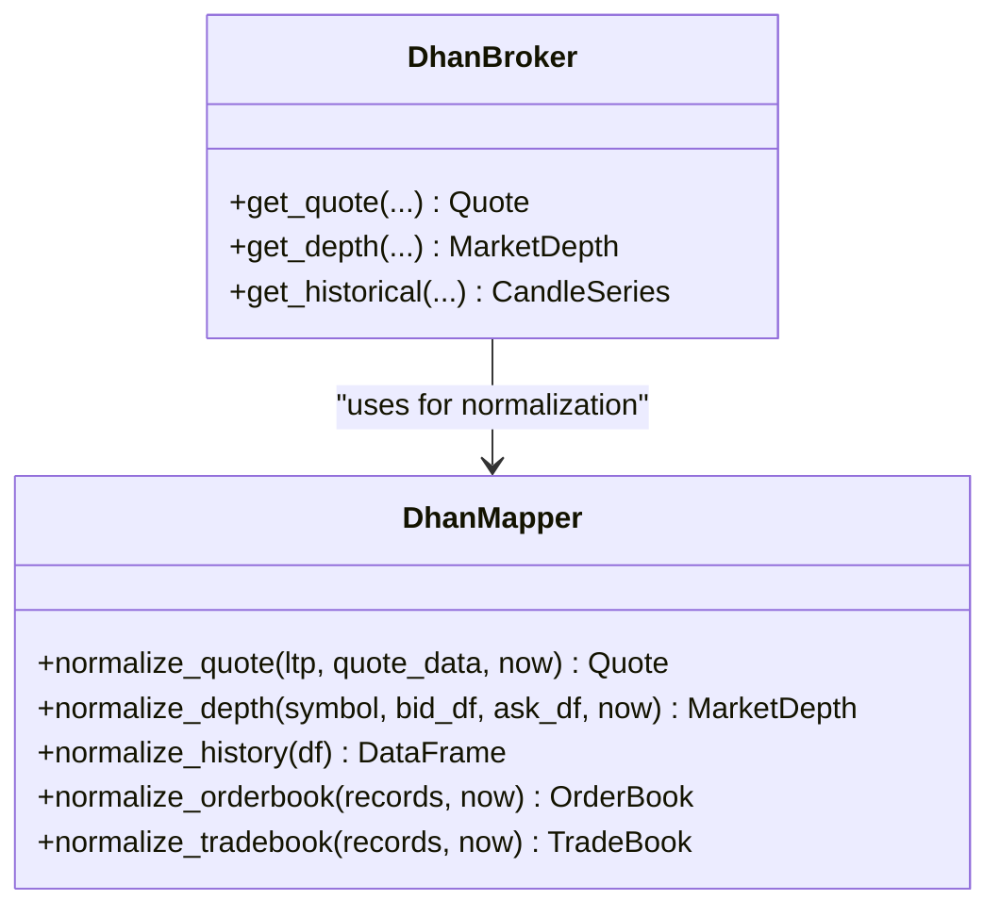

**Diagram sources**
- [dhan_mapper.py](file://ntrade/brokers/dhan_mapper.py)
- [dhan.py](file://ntrade/brokers/dhan.py)

**Section sources**
- [dhan_mapper.py](file://ntrade/brokers/dhan_mapper.py)
- [dhan.py](file://ntrade/brokers/dhan.py)

### Seamless Switching Between Brokers
- Strategy/engine code interacts only with BrokerAdapter methods.
- Swap DhanBroker for PaperBroker by changing instantiation; no other changes required.
- Factories propagate broker instances to instruments automatically.

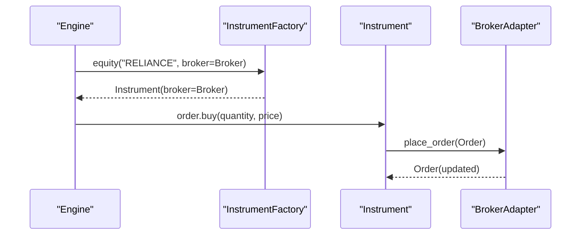

**Diagram sources**
- [factories.py](file://ntrade/factories.py)
- [base.py](file://ntrade/brokers/base.py)

**Section sources**
- [factories.py](file://ntrade/factories.py)
- [base.py](file://ntrade/brokers/base.py)

## Dependency Analysis
- DhanBroker depends on DhanAuthProvider, DhanTransport, and DhanMapper.
- DhanTransport depends on DhanMapper and the underlying Tradehull library.
- Capability system decouples broker-specific extensions from the base API.
- Tests validate capability availability and paper broker behavior.

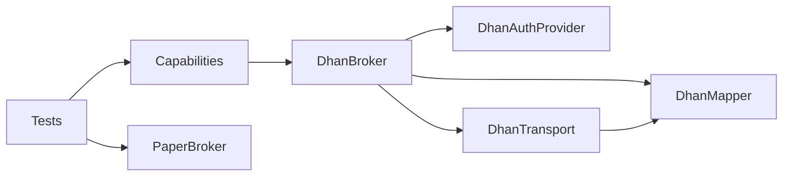

**Diagram sources**
- [dhan.py](file://ntrade/brokers/dhan.py)
- [dhan_auth_provider.py](file://ntrade/brokers/dhan_auth_provider.py)
- [dhan_transport.py](file://ntrade/brokers/dhan_transport.py)
- [dhan_mapper.py](file://ntrade/brokers/dhan_mapper.py)
- [capabilities.py](file://ntrade/brokers/capabilities.py)
- [test_brokers.py](file://tests/test_brokers.py)

**Section sources**
- [dhan.py](file://ntrade/brokers/dhan.py)
- [capabilities.py](file://ntrade/brokers/capabilities.py)
- [test_brokers.py](file://tests/test_brokers.py)

## Performance Considerations
- Retry policies mitigate transient network issues; avoid excessive retries to respect rate limits.
- WebSocket depth snapshot bounded by timeout to prevent blocking.
- Clock injection ensures reproducible timing in replay/backtest scenarios.
- Avoid unnecessary object creation in tight loops; reuse mappers where possible.

## Troubleshooting Guide
- Authentication failures: Check shared token store, env variables, and PIN/TOTP settings; observe cooldown logs.
- Zero LTP or empty quotes: Inspect retry behavior and network connectivity; consider refreshing instrument quotes before placing orders.
- Unsupported capabilities: Ensure the current broker supports the requested capability; use available() to list supported features.
- Order rejections: Verify SEBI constraints (F&O MARKET→LIMIT conversion) and LTP availability.

**Section sources**
- [dhan_auth.py](file://ntrade/brokers/dhan_auth.py)
- [dhan_transport.py](file://ntrade/brokers/dhan_transport.py)
- [dhan.py](file://ntrade/brokers/dhan.py)
- [capabilities.py](file://ntrade/brokers/capabilities.py)

## Conclusion
nTrade’s broker abstraction cleanly separates domain logic from broker specifics. BrokerAdapter defines a stable contract; DhanBroker delivers production-grade functionality with robust auth, transport, and normalization; PaperBroker offers deterministic simulation. The capability system enables dynamic, safe extension points. Together, these patterns allow seamless switching between live and test environments without code changes.

## Appendices

### Implementing a Custom Broker
Steps:
1. Extend BrokerAdapter and implement required abstract methods (connect, get_quote, get_historical, place_order).
2. Optionally override optional methods (get_depth, cancel_order, modify_order, get_balance, etc.).
3. If adding broker-specific features, register them via @capability(name, brokers=(...)).
4. Wire the broker into factories or directly instantiate it for instruments.

Example references:
- Base contract and defaults: [base.py](file://ntrade/brokers/base.py)
- Registration decorator and facade: [capabilities.py](file://ntrade/brokers/capabilities.py)
- Production implementation patterns: [dhan.py](file://ntrade/brokers/dhan.py)
- Simulation reference: [paper.py](file://ntrade/brokers/paper.py)

**Section sources**
- [base.py](file://ntrade/brokers/base.py)
- [capabilities.py](file://ntrade/brokers/capabilities.py)
- [dhan.py](file://ntrade/brokers/dhan.py)
- [paper.py](file://ntrade/brokers/paper.py)