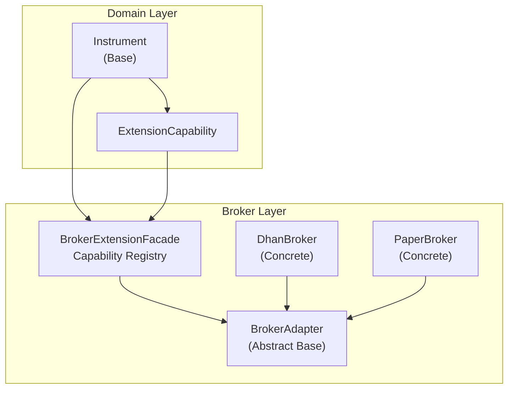
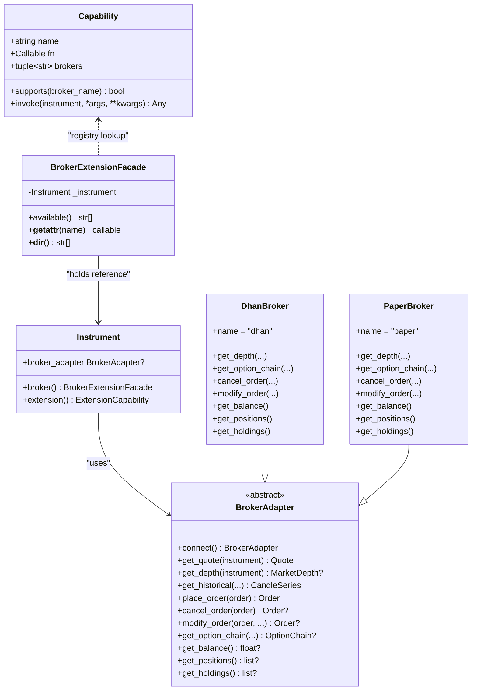
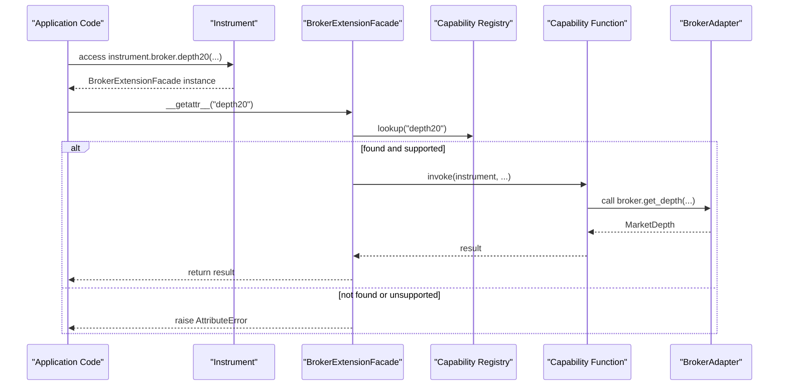
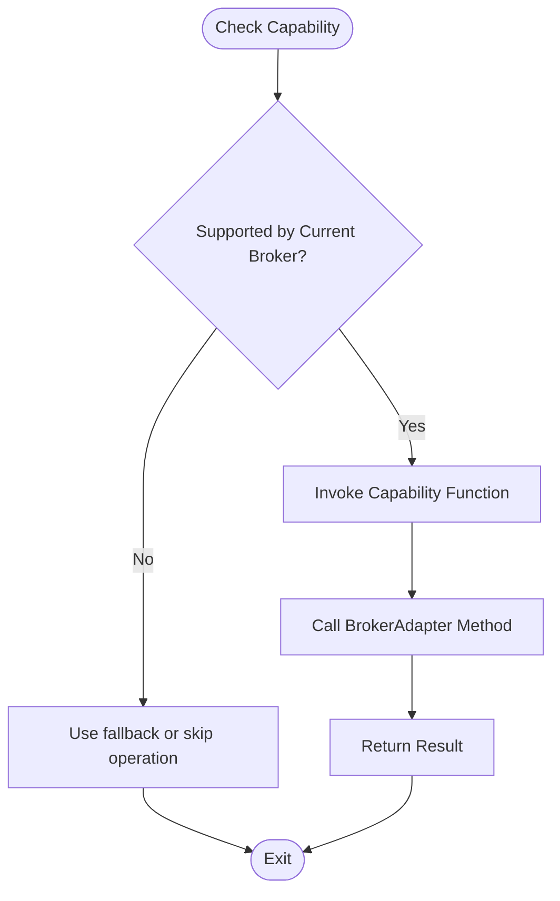
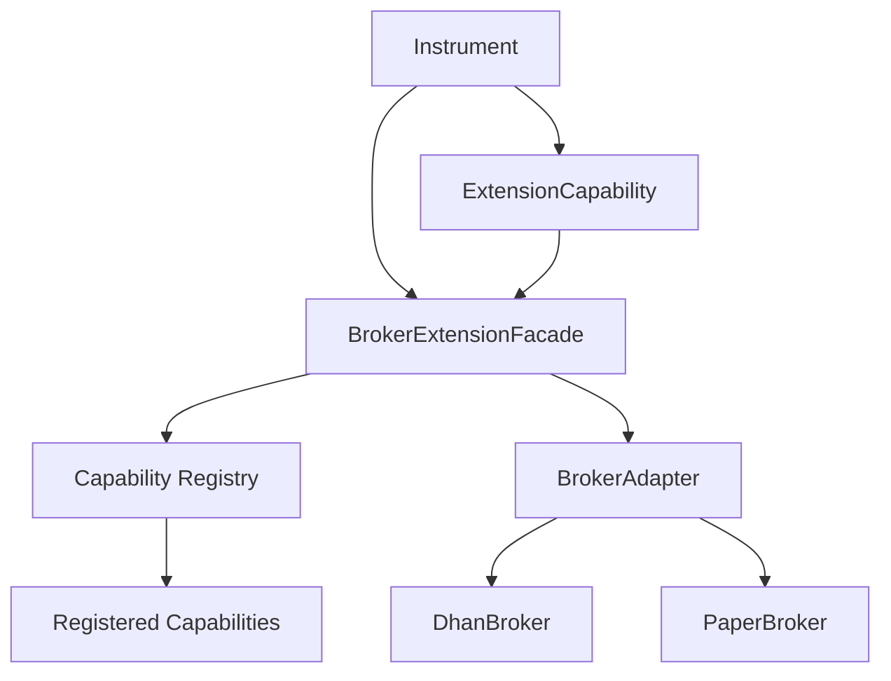

# Broker Capabilities System

<cite>
**Referenced Files in This Document**
- [capabilities.py](file://ntrade/brokers/capabilities.py)
- [base.py](file://ntrade/brokers/base.py)
- [dhan.py](file://ntrade/brokers/dhan.py)
- [paper.py](file://ntrade/brokers/paper.py)
- [__init__.py](file://ntrade/brokers/__init__.py)
- [base.py](file://ntrade/domain/instruments/base.py)
- [capabilities.py](file://ntrade/domain/instruments/capabilities.py)
- [test_brokers.py](file://tests/test_brokers.py)
</cite>

## Table of Contents
1. [Introduction](#introduction)
2. [Project Structure](#project-structure)
3. [Core Components](#core-components)
4. [Architecture Overview](#architecture-overview)
5. [Detailed Component Analysis](#detailed-component-analysis)
6. [Dependency Analysis](#dependency-analysis)
7. [Performance Considerations](#performance-considerations)
8. [Troubleshooting Guide](#troubleshooting-guide)
9. [Conclusion](#conclusion)
10. [Appendices](#appendices)

## Introduction
This document explains the broker capabilities system that enables dynamic feature discovery and conditional functionality based on what a specific broker implementation supports. It covers how capabilities are defined, registered, and queried at runtime; how code can adapt behavior without hardcoding broker-specific logic; and how capability flags relate to abstract base class method implementations. The system is designed for fail-fast behavior when a capability is not supported, while providing introspection tools to discover available features.

## Project Structure
The capabilities system spans three layers:
- Capability registry and facade (broker extension mechanism)
- Abstract broker interface with optional methods
- Concrete broker implementations registering capabilities

**Diagram sources**
- [capabilities.py:1-74](file://ntrade/brokers/capabilities.py#L1-L74)
- [base.py:1-163](file://ntrade/brokers/base.py#L1-L163)
- [dhan.py:1-1171](file://ntrade/brokers/dhan.py#L1-L1171)
- [paper.py:1-216](file://ntrade/brokers/paper.py#L1-L216)
- [base.py:1-305](file://ntrade/domain/instruments/base.py#L1-L305)
- [capabilities.py:1-383](file://ntrade/domain/instruments/capabilities.py#L1-L383)

**Section sources**
- [capabilities.py:1-74](file://ntrade/brokers/capabilities.py#L1-L74)
- [base.py:1-163](file://ntrade/brokers/base.py#L1-L163)
- [dhan.py:1-1171](file://ntrade/brokers/dhan.py#L1-L1171)
- [paper.py:1-216](file://ntrade/brokers/paper.py#L1-L216)
- [base.py:1-305](file://ntrade/domain/instruments/base.py#L1-L305)
- [capabilities.py:1-383](file://ntrade/domain/instruments/capabilities.py#L1-L383)

## Core Components
- Capability registry and decorator:
  - Global registry stores named capabilities with allowed brokers.
  - Decorator registers functions as capabilities bound to specific broker names.
- BrokerExtensionFacade:
  - Provides attribute-style access to capabilities via instrument.broker.<name>.
  - Supports availability introspection and fail-fast errors for unsupported features.
- Instrument integration:
  - Instrument exposes broker property returning BrokerExtensionFacade.
  - ExtensionCapability bridges class-based extensions to string-based capabilities.
- Abstract base methods:
  - BrokerAdapter defines core and optional methods; optional ones raise NotImplementedError by default.
- Concrete brokers:
  - DhanBroker implements many optional methods and registers numerous capabilities.
  - PaperBroker implements a subset suitable for tests/backtests.

Key behaviors:
- Dynamic resolution: attribute access resolves to a capability if supported by the current broker.
- Fail-fast: AttributeError raised when capability is missing or unsupported.
- Introspection: available() returns list of supported capability names for the current broker.

**Section sources**
- [capabilities.py:16-74](file://ntrade/brokers/capabilities.py#L16-L74)
- [base.py:100-151](file://ntrade/domain/instruments/base.py#L100-L151)
- [capabilities.py:366-383](file://ntrade/domain/instruments/capabilities.py#L366-L383)
- [base.py:99-149](file://ntrade/brokers/base.py#L99-L149)
- [dhan.py:867-1171](file://ntrade/brokers/dhan.py#L867-L1171)
- [paper.py:1-216](file://ntrade/brokers/paper.py#L1-L216)

## Architecture Overview
The capability system decouples domain code from broker specifics through a registry-driven facade.

**Diagram sources**
- [capabilities.py:16-74](file://ntrade/brokers/capabilities.py#L16-L74)
- [base.py:25-163](file://ntrade/brokers/base.py#L25-L163)
- [dhan.py:54-1171](file://ntrade/brokers/dhan.py#L54-L1171)
- [paper.py:23-216](file://ntrade/brokers/paper.py#L23-L216)
- [base.py:50-151](file://ntrade/domain/instruments/base.py#L50-L151)

## Detailed Component Analysis

### Capability Registration and Resolution
Capabilities are declared using a decorator that binds a function to a name and a tuple of broker names. The global registry maps capability names to Capability objects. BrokerExtensionFacade.__getattr__ resolves attributes by looking up the capability and checking if the current broker supports it. If not supported or unknown, an AttributeError is raised.

**Diagram sources**
- [capabilities.py:32-74](file://ntrade/brokers/capabilities.py#L32-L74)
- [dhan.py:867-881](file://ntrade/brokers/dhan.py#L867-L881)
- [base.py:78-80](file://ntrade/brokers/base.py#L78-L80)

**Section sources**
- [capabilities.py:16-74](file://ntrade/brokers/capabilities.py#L16-L74)
- [dhan.py:867-881](file://ntrade/brokers/dhan.py#L867-L881)
- [base.py:78-80](file://ntrade/brokers/base.py#L78-L80)

### Capability Flags and Feature Coverage
The following capability flags are commonly used across the system:
- Order cancellation: cancel_order
- Order modification: modify_order
- Depth data: get_depth (and depth20 capability)
- Option chains: get_option_chain
- Portfolio access: get_balance, get_positions, get_holdings

Behavioral notes:
- Optional methods in BrokerAdapter raise NotImplementedError by default; concrete brokers override to support features.
- DhanBroker implements these methods and registers corresponding capabilities.
- PaperBroker provides minimal implementations for testing and backtesting.

Examples of capability registration and usage:
- depth20: capability("depth20", brokers=("dhan",))
- market_feed: capability("market_feed", brokers=("dhan",))
- order_update_stream: capability("order_update_stream", brokers=("dhan",))
- margin_calculator: capability("margin_calculator", brokers=("dhan",))
- kill_switch: capability("kill_switch", brokers=("dhan",))
- enable_pnl_based_exit: capability("enable_pnl_based_exit", brokers=("dhan",))
- expiry_list: capability("expiry_list", brokers=("dhan",))
- lot_size: capability("lot_size", brokers=("dhan",))
- future_script: capability("future_script", brokers=("dhan",))
- long_term_history: capability("long_term_history", brokers=("dhan",))
- ohlc: capability("ohlc", brokers=("dhan",))
- start_date: capability("start_date", brokers=("dhan",))
- instrument_file: capability("instrument_file", brokers=("dhan",))
- place_super_order: capability("place_super_order", brokers=("dhan",))
- place_slice_order: capability("place_slice_order", brokers=("dhan",))
- place_conditional_trigger: capability("place_conditional_trigger", brokers=("dhan",))
- place_forever_order: capability("place_forever_order", brokers=("dhan",))
- cancel_all_orders: capability("cancel_all_orders", brokers=("dhan",))
- get_super_orders: capability("get_super_orders", brokers=("dhan",))
- modify_super_order: capability("modify_super_order", brokers=("dhan",))
- cancel_super_order: capability("cancel_super_order", brokers=("dhan",))
- get_forever_orders: capability("get_forever_orders", brokers=("dhan",))
- atm_strike, itm_strike, otm_strike: capability(..., brokers=("dhan",))
- expired_option_data: capability("expired_option_data", brokers=("dhan",))
- exchange_time: capability("exchange_time", brokers=("dhan",))

These capabilities allow code to check availability and adapt behavior without hardcoding broker-specific logic.

**Section sources**
- [base.py:99-149](file://ntrade/brokers/base.py#L99-L149)
- [dhan.py:867-1171](file://ntrade/brokers/dhan.py#L867-L1171)
- [paper.py:72-111](file://ntrade/brokers/paper.py#L72-L111)

### Relationship Between Capabilities and Abstract Base Methods
- Optional methods like cancel_order, modify_order, get_option_chain, get_balance, get_positions, get_holdings are defined in BrokerAdapter with NotImplementedError defaults.
- DhanBroker overrides these methods to provide real functionality.
- Capabilities wrap broker-specific calls behind a uniform interface, enabling dynamic discovery and invocation.

**Diagram sources**
- [base.py:99-149](file://ntrade/brokers/base.py#L99-L149)
- [dhan.py:867-1171](file://ntrade/brokers/dhan.py#L867-L1171)

**Section sources**
- [base.py:99-149](file://ntrade/brokers/base.py#L99-L149)
- [dhan.py:867-1171](file://ntrade/brokers/dhan.py#L867-L1171)

### Practical Usage Patterns
- Checking capabilities before attempting operations:
  - Use instrument.broker.available() to list supported capabilities.
  - Try accessing a capability and catch AttributeError to handle missing features gracefully.
- Example patterns:
  - Attempting depth20 on PaperBroker raises AttributeError; use available() to avoid exceptions.
  - Custom capability registration via @capability decorator for new features.

**Section sources**
- [test_brokers.py:38-66](file://tests/test_brokers.py#L38-L66)
- [capabilities.py:54-74](file://ntrade/brokers/capabilities.py#L54-L74)

## Dependency Analysis
The capability system introduces loose coupling between domain code and broker implementations:
- Instrument depends on BrokerExtensionFacade for broker-specific features.
- BrokerExtensionFacade depends on the global capability registry.
- DhanBroker and PaperBroker implement BrokerAdapter and register capabilities.
- Domain capabilities (Market, Trade, Stream, Analytics, Derivatives, Extension) compose Instrument behaviors.

**Diagram sources**
- [base.py:100-151](file://ntrade/domain/instruments/base.py#L100-L151)
- [capabilities.py:16-74](file://ntrade/brokers/capabilities.py#L16-L74)
- [capabilities.py:366-383](file://ntrade/domain/instruments/capabilities.py#L366-L383)
- [base.py:25-163](file://ntrade/brokers/base.py#L25-L163)
- [dhan.py:54-1171](file://ntrade/brokers/dhan.py#L54-L1171)
- [paper.py:23-216](file://ntrade/brokers/paper.py#L23-L216)

**Section sources**
- [base.py:100-151](file://ntrade/domain/instruments/base.py#L100-L151)
- [capabilities.py:16-74](file://ntrade/brokers/capabilities.py#L16-L74)
- [capabilities.py:366-383](file://ntrade/domain/instruments/capabilities.py#L366-L383)
- [base.py:25-163](file://ntrade/brokers/base.py#L25-L163)
- [dhan.py:54-1171](file://ntrade/brokers/dhan.py#L54-L1171)
- [paper.py:23-216](file://ntrade/brokers/paper.py#L23-L216)

## Performance Considerations
- Capability lookup is O(1) dictionary access.
- Availability checks iterate over registered capabilities; cache results if frequently accessed.
- Broker method calls may involve network I/O; ensure retries and timeouts are handled appropriately.
- Avoid unnecessary capability invocations by checking availability first.

[No sources needed since this section provides general guidance]

## Troubleshooting Guide
Common issues and resolutions:
- AttributeError when accessing a capability:
  - Ensure the broker supports the capability; check available().
  - Verify the broker adapter is attached to the instrument.
- NotImplementedError from BrokerAdapter methods:
  - Implement the method in your broker subclass.
- Missing depth data:
  - Some instruments (e.g., indices) may not support depth; handle None returns.
- Option chain failures:
  - Retry with different expiries; validate underlying symbol and exchange.

**Section sources**
- [test_brokers.py:38-66](file://tests/test_brokers.py#L38-L66)
- [base.py:99-149](file://ntrade/brokers/base.py#L99-L149)
- [dhan.py:259-301](file://ntrade/brokers/dhan.py#L259-L301)

## Conclusion
The broker capabilities system provides a robust, extensible mechanism for dynamic feature discovery and conditional functionality. By registering capabilities and using the BrokerExtensionFacade, code can adapt to different broker implementations without hardcoding logic. Optional methods in BrokerAdapter define the contract, while concrete brokers implement features and expose them via capabilities. This design promotes maintainability, testability, and scalability across diverse broker environments.

[No sources needed since this section summarizes without analyzing specific files]

## Appendices
- Best practices:
  - Always check available() before invoking capabilities.
  - Handle AttributeError gracefully for unsupported features.
  - Implement optional BrokerAdapter methods for full feature parity.
- Examples:
  - See test_brokers.py for usage patterns and assertions.

**Section sources**
- [test_brokers.py:38-107](file://tests/test_brokers.py#L38-L107)
- [capabilities.py:54-74](file://ntrade/brokers/capabilities.py#L54-L74)
- [base.py:99-149](file://ntrade/brokers/base.py#L99-L149)