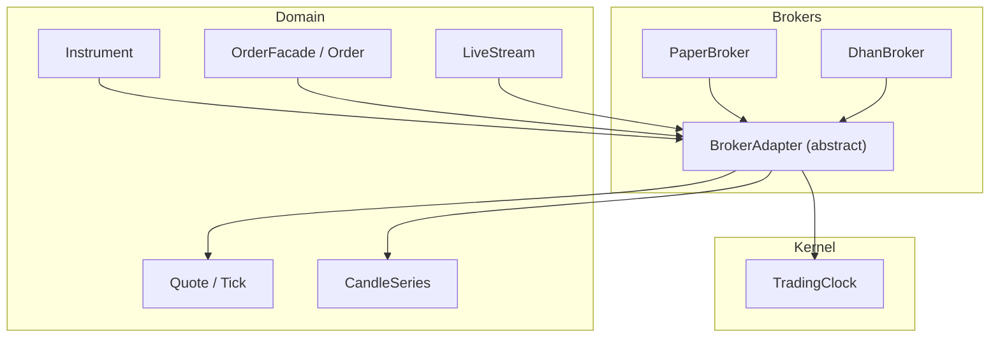
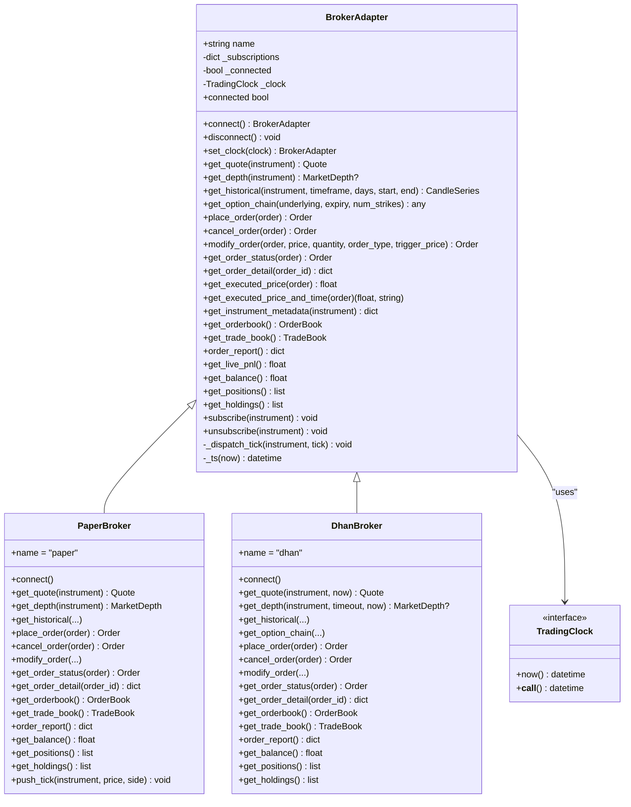
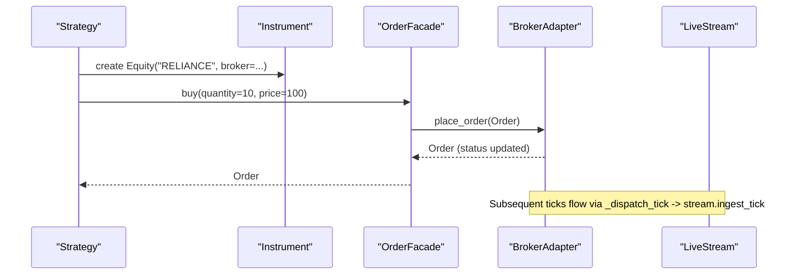
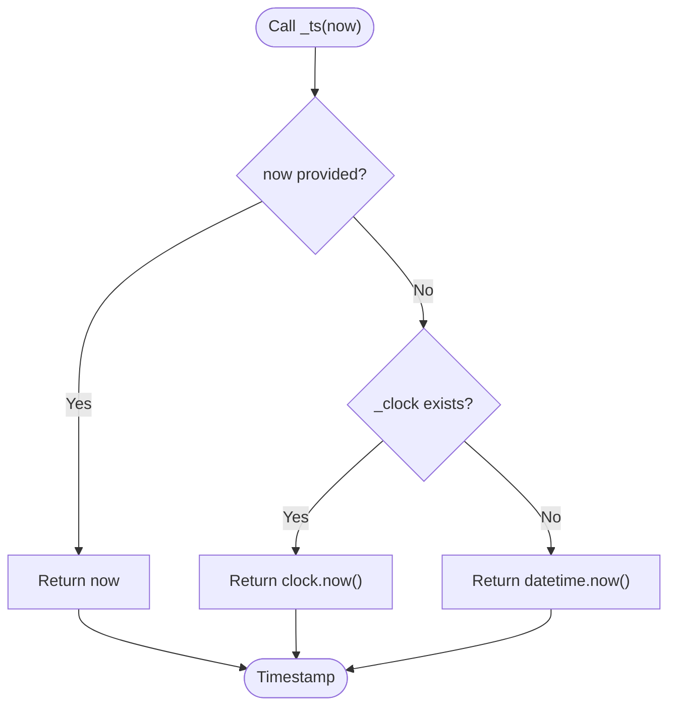
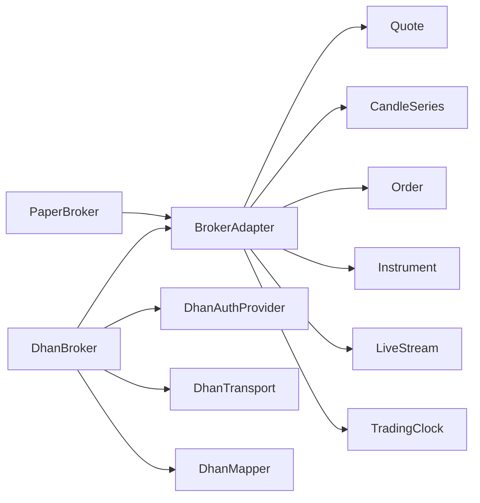

# BrokerAdapter Base Class

<cite>
**Referenced Files in This Document**
- [base.py](file://ntrade/brokers/base.py)
- [capabilities.py](file://ntrade/brokers/capabilities.py)
- [clock.py](file://ntrade/kernel/clock.py)
- [order.py](file://ntrade/domain/orders/order.py)
- [quote.py](file://ntrade/domain/market/quote.py)
- [candles.py](file://ntrade/domain/market/candles.py)
- [stream.py](file://ntrade/domain/market/stream.py)
- [paper.py](file://ntrade/brokers/paper.py)
- [dhan.py](file://ntrade/brokers/dhan.py)
- [test_brokers.py](file://tests/test_brokers.py)
</cite>

## Table of Contents
1. [Introduction](#introduction)
2. [Project Structure](#project-structure)
3. [Core Components](#core-components)
4. [Architecture Overview](#architecture-overview)
5. [Detailed Component Analysis](#detailed-component-analysis)
6. [Dependency Analysis](#dependency-analysis)
7. [Performance Considerations](#performance-considerations)
8. [Troubleshooting Guide](#troubleshooting-guide)
9. [Conclusion](#conclusion)
10. [Appendices](#appendices)

## Introduction
This document explains the BrokerAdapter base class that defines the contract for all broker implementations in nTrade. It covers:
- The abstract methods every broker must implement: connect, get_quote, get_historical, place_order
- Optional advanced methods for order lifecycle and portfolio management
- Connection lifecycle management and subscription multiplexing
- Timestamp resolution with TradingClock integration to ensure zero-parity between live, replay, and backtest
- Error handling patterns and how unsupported operations are signaled via NotImplementedError
- A minimal implementation example using PaperBroker
- Design principles behind the abstraction pattern

## Project Structure
The BrokerAdapter lives in the brokers package and is used by domain objects (instruments, orders, streams). Concrete brokers like PaperBroker and DhanBroker extend it. Time is provided by a pluggable TradingClock interface.

**Diagram sources**
- [base.py:25-163](file://ntrade/brokers/base.py#L25-L163)
- [paper.py:23-216](file://ntrade/brokers/paper.py#L23-L216)
- [dhan.py:54-200](file://ntrade/brokers/dhan.py#L54-L200)
- [clock.py:14-55](file://ntrade/kernel/clock.py#L14-L55)
- [quote.py:9-91](file://ntrade/domain/market/quote.py#L9-L91)
- [candles.py:18-67](file://ntrade/domain/market/candles.py#L18-L67)
- [stream.py:27-131](file://ntrade/domain/market/stream.py#L27-L131)
- [order.py:118-173](file://ntrade/domain/orders/order.py#L118-L173)

**Section sources**
- [base.py:25-163](file://ntrade/brokers/base.py#L25-L163)
- [paper.py:23-216](file://ntrade/brokers/paper.py#L23-L216)
- [dhan.py:54-200](file://ntrade/brokers/dhan.py#L54-L200)
- [clock.py:14-55](file://ntrade/kernel/clock.py#L14-L55)
- [quote.py:9-91](file://ntrade/domain/market/quote.py#L9-L91)
- [candles.py:18-67](file://ntrade/domain/market/candles.py#L18-L67)
- [stream.py:27-131](file://ntrade/domain/market/stream.py#L27-L131)
- [order.py:118-173](file://ntrade/domain/orders/order.py#L118-L173)

## Core Components
- BrokerAdapter: Abstract base defining the broker contract, connection state, timestamp source, market data, order placement, optional order lifecycle, portfolio accessors, and streaming subscriptions.
- TradingClock: Pluggable time source enabling deterministic timestamps for replay/backtest parity.
- Quote/Tick/CandleSeries: Domain types returned by broker adapters.
- LiveStream: Per-instrument subscription lifecycle; broker adapter multiplexes subscriptions.
- OrderFacade/Order: High-level order entry and lifecycle helpers that delegate to the broker adapter.
- Capability system: Optional broker-specific extensions exposed through instrument.broker.<capability>().

Key responsibilities:
- Enforce consistent API across brokers
- Hide transport details from domain code
- Provide zero-parity timestamps
- Centralize subscription management
- Offer optional features via capability registration

**Section sources**
- [base.py:25-163](file://ntrade/brokers/base.py#L25-L163)
- [clock.py:14-55](file://ntrade/kernel/clock.py#L14-L55)
- [quote.py:9-91](file://ntrade/domain/market/quote.py#L9-L91)
- [candles.py:18-67](file://ntrade/domain/market/candles.py#L18-L67)
- [stream.py:27-131](file://ntrade/domain/market/stream.py#L27-L131)
- [order.py:118-173](file://ntrade/domain/orders/order.py#L118-L173)
- [capabilities.py:16-74](file://ntrade/brokers/capabilities.py#L16-L74)

## Architecture Overview
The BrokerAdapter sits at the boundary between domain logic and broker transports. Instruments, orders, and streams call into the adapter without knowing about REST/websocket specifics.

**Diagram sources**
- [base.py:25-163](file://ntrade/brokers/base.py#L25-L163)
- [paper.py:23-216](file://ntrade/brokers/paper.py#L23-L216)
- [dhan.py:54-200](file://ntrade/brokers/dhan.py#L54-L200)
- [clock.py:14-55](file://ntrade/kernel/clock.py#L14-L55)

## Detailed Component Analysis

### Abstract Contract and Required Implementations
Every concrete broker must implement:
- connect(): Establish session/auth and set internal connected state.
- get_quote(instrument, **kwargs): Return a Quote with at least LTP and timestamp.
- get_historical(instrument, timeframe, days, start, end): Return a CandleSeries.
- place_order(order): Submit an order and return the updated Order object.

Optional but recommended:
- cancel_order(order), modify_order(order, ...), get_order_status(order), get_order_detail(order_id)
- get_orderbook(), get_trade_book(), order_report()
- get_balance(), get_positions(), get_holdings(), get_live_pnl()
- get_depth(instrument), get_option_chain(underlying, ...)

Unsupported optional methods should raise NotImplementedError with a clear message indicating the broker does not support the feature.

**Section sources**
- [base.py:60-136](file://ntrade/brokers/base.py#L60-L136)

### Connection Lifecycle Management
- connect() initializes the broker session and sets _connected to True.
- disconnect() clears subscriptions and notifies each subscribed stream of disconnect.
- connected property exposes current connection state.

Subscriptions are tracked per symbol and cleared on disconnect. Streams receive a disconnect event so consumers can react.

**Section sources**
- [base.py:64-73](file://ntrade/brokers/base.py#L64-L73)
- [stream.py:124-131](file://ntrade/domain/market/stream.py#L124-L131)

### Timestamp Resolution with TradingClock
- set_clock(clock) injects a TradingClock instance for deterministic time.
- _ts(now=None) resolves timestamps with priority: explicit now > injected clock > wall clock.
- This ensures zero-parity across live, replay, and backtest environments.

Concrete brokers may propagate the clock to their transport layers to keep downstream calls parity-safe.

**Section sources**
- [base.py:36-57](file://ntrade/brokers/base.py#L36-L57)
- [clock.py:14-55](file://ntrade/kernel/clock.py#L14-L55)
- [dhan.py:96-104](file://ntrade/brokers/dhan.py#L96-L104)

### Subscription Management and Streaming
- subscribe(instrument) registers an instrument and marks its stream as SUBSCRIBED.
- unsubscribe(instrument) removes the subscription and marks NOT_SUBSCRIBED.
- _dispatch_tick(instrument, tick) forwards ticks to the instrument’s stream for ingestion.

LiveStream manages callbacks and state transitions, emitting events such as tick, quote, trade, depth, disconnect, reconnect.

**Section sources**
- [base.py:152-163](file://ntrade/brokers/base.py#L152-L163)
- [stream.py:27-131](file://ntrade/domain/market/stream.py#L27-L131)

### Order Placement and Lifecycle
- place_order(order) returns an Order with status updated according to broker behavior.
- Optional methods:
  - cancel_order(order): Cancel open orders and update status.
  - modify_order(order, ...): Modify fields like price, quantity, order type, trigger price.
  - get_order_status(order): Refresh order state from broker.
  - get_order_detail(order_id): Retrieve raw order details.
  - get_executed_price(order), get_executed_price_and_time(order): Execution metadata.

OrderFacade and Order provide high-level APIs that delegate to the broker adapter when available.

**Section sources**
- [base.py:96-136](file://ntrade/brokers/base.py#L96-L136)
- [order.py:118-173](file://ntrade/domain/orders/order.py#L118-L173)

### Portfolio and Account Accessors
- get_live_pnl(): Realized + unrealised P&L reported by the broker (default 0.0).
- get_balance(), get_positions(), get_holdings(): Default raises NotImplementedError; override if supported.

These allow strategies to query account state consistently across brokers.

**Section sources**
- [base.py:138-149](file://ntrade/brokers/base.py#L138-L149)

### Capabilities Pattern for Advanced Features
- Capability decorator registers broker-specific functions with optional broker filtering.
- BrokerExtensionFacade exposes capabilities via instrument.broker.<name>(), raising AttributeError if unsupported.
- This avoids giant if/else blocks and keeps the base API clean.

Examples include depth20 or other provider-specific features.

**Section sources**
- [capabilities.py:16-74](file://ntrade/brokers/capabilities.py#L16-L74)

### Minimal Implementation Example: PaperBroker
PaperBroker demonstrates a minimal yet complete implementation:
- Always connected for testing
- Seeds quotes and history deterministically
- Implements get_quote, get_depth, get_historical, place_order
- Supports cancel_order, modify_order, get_order_status, get_order_detail
- Exposes order book, trade book, balance, positions, holdings
- Pushes ticks via _dispatch_tick

This shows how to satisfy the BrokerAdapter contract while providing rich functionality for tests and backtests.

**Section sources**
- [paper.py:23-216](file://ntrade/brokers/paper.py#L23-L216)

### Sequence: Order Placement Flow

**Diagram sources**
- [order.py:118-173](file://ntrade/domain/orders/order.py#L118-L173)
- [base.py:96-136](file://ntrade/brokers/base.py#L96-L136)
- [stream.py:106-131](file://ntrade/domain/market/stream.py#L106-L131)

### Flowchart: Timestamp Resolution

**Diagram sources**
- [base.py:46-57](file://ntrade/brokers/base.py#L46-L57)
- [clock.py:14-55](file://ntrade/kernel/clock.py#L14-L55)

## Dependency Analysis
BrokerAdapter depends on domain types (Quote, CandleSeries, Order, Instrument) and optionally on TradingClock. Concrete brokers depend on additional providers (e.g., DhanBroker uses auth, transport, mapper).

**Diagram sources**
- [base.py:25-163](file://ntrade/brokers/base.py#L25-L163)
- [paper.py:23-216](file://ntrade/brokers/paper.py#L23-L216)
- [dhan.py:54-200](file://ntrade/brokers/dhan.py#L54-L200)
- [quote.py:9-91](file://ntrade/domain/market/quote.py#L9-L91)
- [candles.py:18-67](file://ntrade/domain/market/candles.py#L18-L67)
- [order.py:118-173](file://ntrade/domain/orders/order.py#L118-L173)
- [stream.py:27-131](file://ntrade/domain/market/stream.py#L27-L131)
- [clock.py:14-55](file://ntrade/kernel/clock.py#L14-L55)

**Section sources**
- [base.py:25-163](file://ntrade/brokers/base.py#L25-L163)
- [dhan.py:54-200](file://ntrade/brokers/dhan.py#L54-L200)

## Performance Considerations
- Avoid unnecessary network calls by caching quotes/history where appropriate.
- Use retries judiciously for flaky endpoints (as seen in DhanBroker’s get_quote).
- Multiplex subscriptions to minimize concurrent connections.
- Prefer deterministic timestamps via TradingClock for reproducible runs.
- Keep error paths fast and non-blocking to avoid starving the event loop.

[No sources needed since this section provides general guidance]

## Troubleshooting Guide
Common issues and resolutions:
- NotImplementedError raised for unsupported operations: Ensure your broker implements required methods or intentionally leaves optional ones unimplemented.
- Timestamp drift in replay/backtest: Verify set_clock is called before operations and propagated to transports.
- Subscription not receiving ticks: Confirm subscribe was called and _dispatch_tick is invoked by the transport.
- Disconnect not propagating: Ensure disconnect() is called and streams are notified.

Error handling patterns:
- Raise NotImplementedError with descriptive messages for unsupported features.
- Catch transient errors and retry where appropriate (e.g., network timeouts).
- Gracefully degrade to wall clock if clock injection fails during tests.

**Section sources**
- [base.py:92-136](file://ntrade/brokers/base.py#L92-L136)
- [base.py:46-57](file://ntrade/brokers/base.py#L46-L57)
- [stream.py:124-131](file://ntrade/domain/market/stream.py#L124-L131)
- [test_brokers.py:68-88](file://tests/test_brokers.py#L68-L88)

## Conclusion
BrokerAdapter centralizes the broker contract, ensuring consistent APIs across implementations while hiding transport complexity. Its design enables zero-parity testing via TradingClock, robust subscription management, and extensible capabilities. By following the documented patterns—implementing required methods, raising NotImplementedError for unsupported features, and leveraging the capability system—you can build reliable, testable broker integrations.

[No sources needed since this section summarizes without analyzing specific files]

## Appendices

### How to Implement a Minimal Broker Adapter
Steps:
1. Extend BrokerAdapter and set name.
2. Implement connect(), get_quote(), get_historical(), place_order().
3. Optionally implement cancel_order(), modify_order(), get_order_status(), get_order_detail().
4. If supporting streaming, use subscribe/unsubscribe and _dispatch_tick.
5. For deterministic timestamps, accept clock in __init__ and call set_clock.

Example reference: PaperBroker demonstrates these steps comprehensively.

**Section sources**
- [paper.py:23-216](file://ntrade/brokers/paper.py#L23-L216)
- [base.py:25-163](file://ntrade/brokers/base.py#L25-L163)

### Testing Patterns
- Use PaperBroker for unit tests and replays.
- Assert subscription states and disconnect notifications.
- Validate capability availability and AttributeError for unsupported features.

**Section sources**
- [test_brokers.py:10-107](file://tests/test_brokers.py#L10-L107)