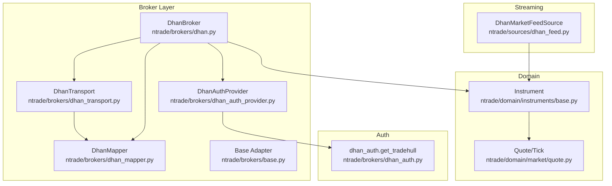
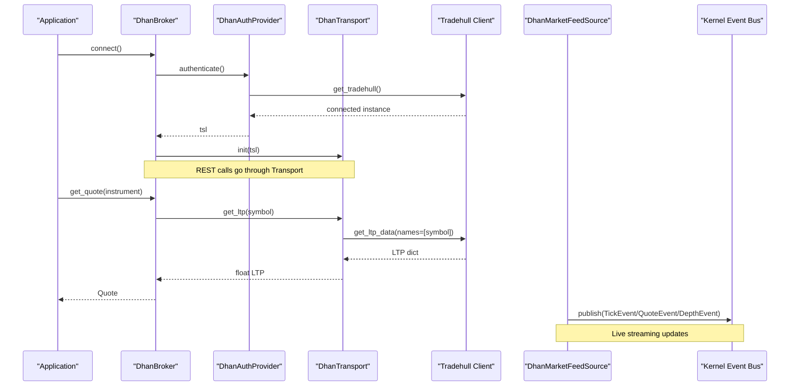
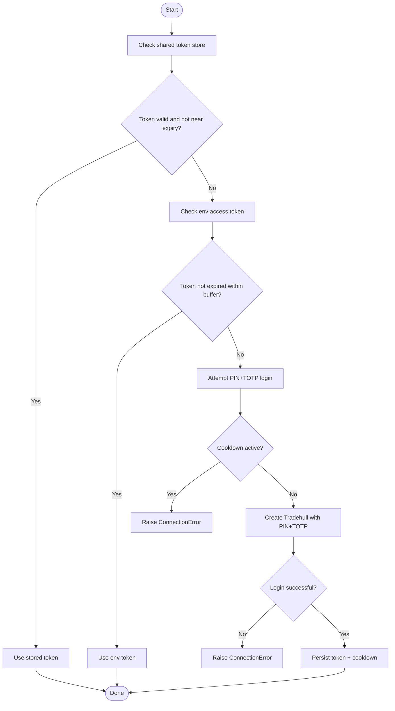
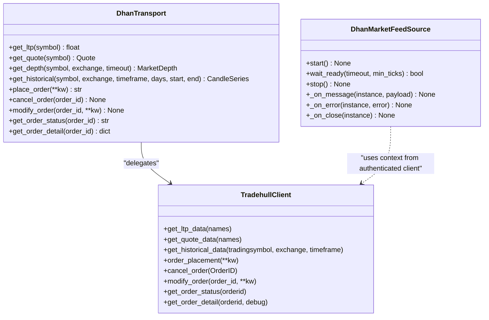
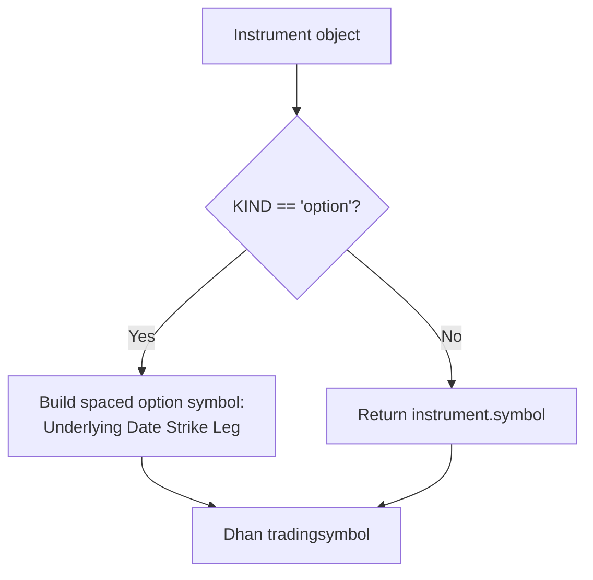
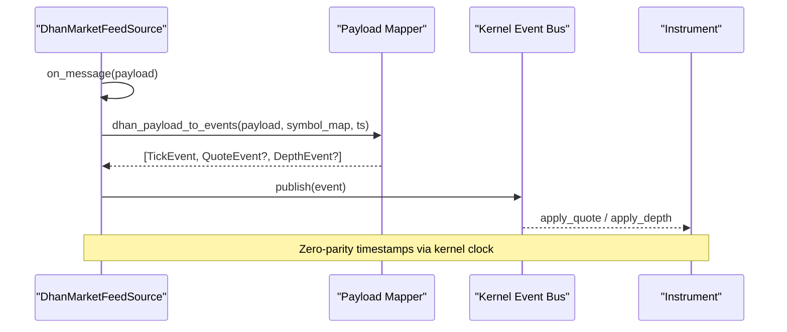
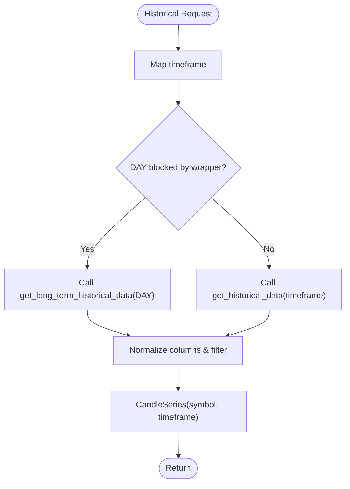
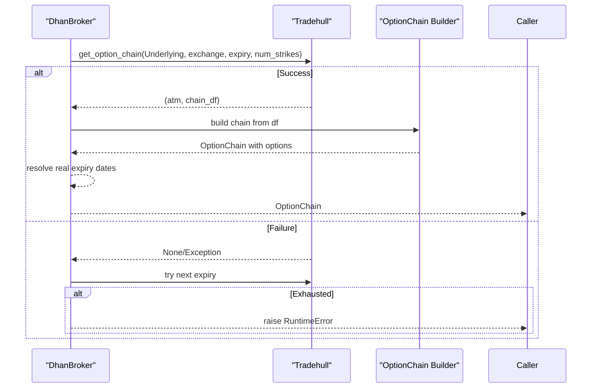
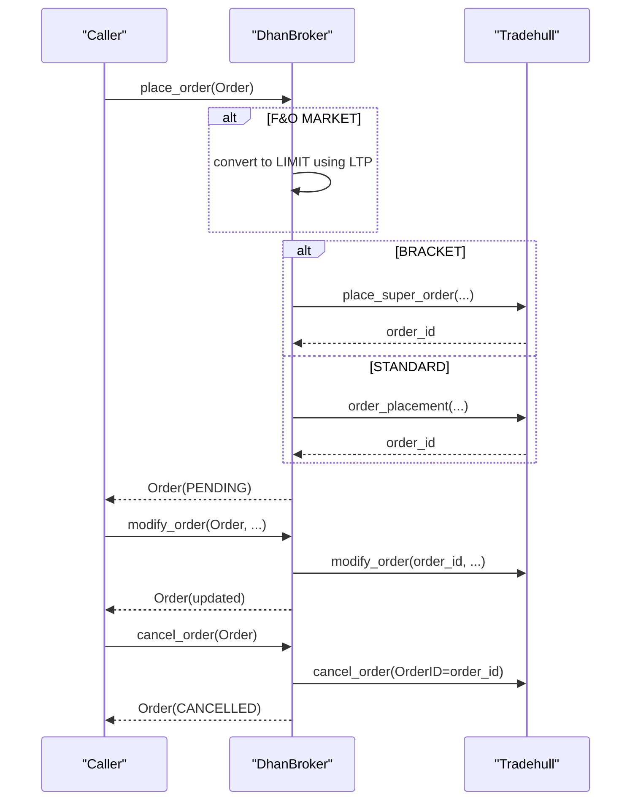
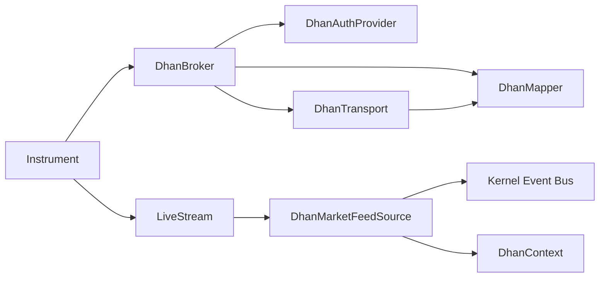

# Dhan Broker Implementation

<cite>
**Referenced Files in This Document**
- [dhan.py](file://ntrade/brokers/dhan.py)
- [dhan_auth.py](file://ntrade/brokers/dhan_auth.py)
- [dhan_transport.py](file://ntrade/brokers/dhan_transport.py)
- [dhan_mapper.py](file://ntrade/brokers/dhan_mapper.py)
- [dhan_auth_provider.py](file://ntrade/brokers/dhan_auth_provider.py)
- [base.py](file://ntrade/brokers/base.py)
- [capabilities.py](file://ntrade/brokers/capabilities.py)
- [dhan_feed.py](file://ntrade/sources/dhan_feed.py)
- [base.py](file://ntrade/domain/instruments/base.py)
- [quote.py](file://ntrade/domain/market/quote.py)
</cite>

## Table of Contents
1. [Introduction](#introduction)
2. [Project Structure](#project-structure)
3. [Core Components](#core-components)
4. [Architecture Overview](#architecture-overview)
5. [Detailed Component Analysis](#detailed-component-analysis)
6. [Dependency Analysis](#dependency-analysis)
7. [Performance Considerations](#performance-considerations)
8. [Troubleshooting Guide](#troubleshooting-guide)
9. [Conclusion](#conclusion)

## Introduction
This document explains the Dhan broker implementation used as the primary production broker in nTrade. It covers authentication and token lifecycle, transport layer for REST and WebSocket, instrument mapping, market data streaming, historical data retrieval with caching strategies, option chain support, order workflows (placement, modification, cancellation), error handling, configuration, and troubleshooting guidance. The goal is to make the system understandable for both developers and operators while remaining precise about how each piece fits into nTrade’s domain model and execution pipeline.

## Project Structure
The Dhan broker is implemented as a set of focused modules:
- Broker adapter: DhanBroker implements the BrokerAdapter interface and orchestrates auth, transport, and mapping.
- Authentication: dhan_auth provides credential loading and Tradehull instance creation; dhan_auth_provider manages token refresh and proactive scheduling.
- Transport: DhanTransport wraps Tradehull calls with retry and normalization.
- Mapping: DhanMapper normalizes raw responses into domain objects and maps symbols/timeframes.
- Streaming: DhanMarketFeedSource adapts the live websocket feed into canonical events.
- Domain integration: Instrument and Quote types are updated by the broker via adapters and streams.

**Diagram sources**
- [dhan.py:1-120](file://ntrade/brokers/dhan.py#L1-L120)
- [dhan_auth_provider.py:1-80](file://ntrade/brokers/dhan_auth_provider.py#L1-L80)
- [dhan_transport.py:1-80](file://ntrade/brokers/dhan_transport.py#L1-L80)
- [dhan_mapper.py:1-60](file://ntrade/brokers/dhan_mapper.py#L1-L60)
- [dhan_auth.py:114-173](file://ntrade/brokers/dhan_auth.py#L114-L173)
- [dhan_feed.py:1-60](file://ntrade/sources/dhan_feed.py#L1-L60)
- [base.py:1-60](file://ntrade/brokers/base.py#L1-L60)
- [base.py:1-60](file://ntrade/domain/instruments/base.py#L1-L60)
- [quote.py:1-40](file://ntrade/domain/market/quote.py#L1-L40)

**Section sources**
- [dhan.py:1-120](file://ntrade/brokers/dhan.py#L1-L120)
- [dhan_auth.py:1-60](file://ntrade/brokers/dhan_auth.py#L1-L60)
- [dhan_transport.py:1-60](file://ntrade/brokers/dhan_transport.py#L1-L60)
- [dhan_mapper.py:1-60](file://ntrade/brokers/dhan_mapper.py#L1-L60)
- [dhan_auth_provider.py:1-60](file://ntrade/brokers/dhan_auth_provider.py#L1-L60)
- [dhan_feed.py:1-60](file://ntrade/sources/dhan_feed.py#L1-L60)
- [base.py:1-60](file://ntrade/brokers/base.py#L1-L60)
- [base.py:1-60](file://ntrade/domain/instruments/base.py#L1-L60)
- [quote.py:1-40](file://ntrade/domain/market/quote.py#L1-L40)

## Core Components
- DhanBroker: Implements BrokerAdapter, composes DhanAuthProvider, DhanTransport, and DhanMapper. Provides quote, depth, history, option chain, orders, portfolio, and metadata methods.
- DhanAuthProvider: Manages authentication lifecycle and proactive token refresh using PIN+TOTP when APP tokens expire or near-expire.
- DhanTransport: Wraps Tradehull API calls with retry policies, consistent error propagation, and normalization helpers.
- DhanMapper: Pure functions to map Dhan payloads to nTrade domain objects and normalize symbol/timeframe conversions.
- DhanMarketFeedSource: Adapts the live websocket feed to publish TickEvent, QuoteEvent, DepthEvent to the kernel event bus.

Key responsibilities:
- Authentication and session management: secure token acquisition, shared store usage, cooldown protection, proactive refresh.
- Transport resilience: retries for flaky endpoints, timeout-bounded depth snapshots, graceful fallbacks.
- Data normalization: consistent domain objects across quotes, depth, history, orders, positions, holdings.
- Streaming: robust parsing of payload types and safe event emission.

**Section sources**
- [dhan.py:54-120](file://ntrade/brokers/dhan.py#L54-L120)
- [dhan_auth_provider.py:28-80](file://ntrade/brokers/dhan_auth_provider.py#L28-L80)
- [dhan_transport.py:48-120](file://ntrade/brokers/dhan_transport.py#L48-L120)
- [dhan_mapper.py:35-73](file://ntrade/brokers/dhan_mapper.py#L35-L73)
- [dhan_feed.py:98-173](file://ntrade/sources/dhan_feed.py#L98-L173)

## Architecture Overview
The Dhan broker integrates with nTrade through a layered architecture:
- DhanBroker sits above DhanAuthProvider and DhanTransport, delegating network calls and handling business rules.
- DhanMapper ensures all external data is normalized before entering the domain.
- DhanMarketFeedSource bridges the live websocket into the kernel event bus.
- Instruments own their state (quote, depth, stream) and update via broker adapter methods and stream events.

**Diagram sources**
- [dhan.py:69-120](file://ntrade/brokers/dhan.py#L69-L120)
- [dhan_auth_provider.py:47-74](file://ntrade/brokers/dhan_auth_provider.py#L47-L74)
- [dhan_transport.py:80-117](file://ntrade/brokers/dhan_transport.py#L80-L117)
- [dhan_feed.py:206-225](file://ntrade/sources/dhan_feed.py#L206-L225)

## Detailed Component Analysis

### Authentication Flow and Token Management
- Credential resolution order:
  - Shared token store (DHAN_TOKEN_PATH) if present and not near expiry.
  - Environment access token (DHAN_ACCESS_TOKEN) if not expired within buffer.
  - PIN+TOTP fallback (DHAN_PIN, DHAN_TOTP_SECRET) with cooldown protection.
- Proactive refresh:
  - DhanAuthProvider schedules background timers to refresh tokens before expiry.
  - On critical operations, _ensure_tsl checks token validity and refreshes if needed.
- Error handling:
  - Missing credentials raise ConnectionError.
  - Cooldown active raises ConnectionError to prevent rapid TOTP attempts.
  - Invalid/expired tokens trigger fallback flows automatically.

**Diagram sources**
- [dhan_auth.py:114-173](file://ntrade/brokers/dhan_auth.py#L114-L173)
- [dhan_auth_provider.py:58-74](file://ntrade/brokers/dhan_auth_provider.py#L58-L74)

**Section sources**
- [dhan_auth.py:114-173](file://ntrade/brokers/dhan_auth.py#L114-L173)
- [dhan_auth_provider.py:28-101](file://ntrade/brokers/dhan_auth_provider.py#L28-L101)

### Transport Layer: REST and WebSocket
- REST:
  - DhanTransport wraps Tradehull calls with retry policies for flaky endpoints like LTP.
  - Historical data uses intraday endpoint for most instruments; DAY routed via long-term endpoint for FUT-type contracts.
  - Order placement/modification/cancellation delegates to Tradehull with consistent error propagation.
- WebSocket:
  - DhanMarketFeedSource subscribes to ticker/quote/full/depth modes.
  - Payloads are mapped to canonical events and published to the kernel bus.
  - Timeout-bounded depth snapshot retrieval prevents hangs.

**Diagram sources**
- [dhan_transport.py:48-177](file://ntrade/brokers/dhan_transport.py#L48-L177)
- [dhan_feed.py:146-173](file://ntrade/sources/dhan_feed.py#L146-L173)

**Section sources**
- [dhan_transport.py:48-177](file://ntrade/brokers/dhan_transport.py#L48-L177)
- [dhan_feed.py:98-173](file://ntrade/sources/dhan_feed.py#L98-L173)

### Instrument Mapping Between nTrade and Dhan
- Symbol mapping:
  - Options use spaced format for Dhan (e.g., "NIFTY 04 AUG 24400 CALL").
  - Non-options pass through unchanged.
- Timeframe mapping:
  - User timeframes map to Dhan interval strings; unsupported values raise ValueError.
- Exchange mapping:
  - Derivatives exchanges mapped to cash exchange IDs for instrument file lookups.
- Metadata hydration:
  - Tick size, lot size, freeze qty resolved from instrument file rows.

**Diagram sources**
- [dhan_mapper.py:40-59](file://ntrade/brokers/dhan_mapper.py#L40-L59)
- [dhan_mapper.py:63-73](file://ntrade/brokers/dhan_mapper.py#L63-L73)
- [dhan_mapper.py:30-33](file://ntrade/brokers/dhan_mapper.py#L30-L33)

**Section sources**
- [dhan_mapper.py:40-73](file://ntrade/brokers/dhan_mapper.py#L40-L73)
- [dhan_mapper.py:30-33](file://ntrade/brokers/dhan_mapper.py#L30-L33)

### Market Data Streaming and Real-Time Quotes
- Streaming modes:
  - ticker, quote, full, depth (v2 forbids depth-only mode; use full).
- Payload mapping:
  - LTP → TickEvent; quote/full → QuoteEvent + TickEvent; depth → DepthEvent + TickEvent.
- Kernel integration:
  - Events published via kernel clock timestamps for zero-parity replay.
- Quote retrieval:
  - get_quote retries LTP fetch and enriches with quote data; returns Quote with timestamp.

**Diagram sources**
- [dhan_feed.py:38-95](file://ntrade/sources/dhan_feed.py#L38-L95)
- [dhan_feed.py:206-225](file://ntrade/sources/dhan_feed.py#L206-L225)
- [base.py:153-184](file://ntrade/domain/instruments/base.py#L153-L184)

**Section sources**
- [dhan_feed.py:98-173](file://ntrade/sources/dhan_feed.py#L98-L173)
- [dhan_feed.py:38-95](file://ntrade/sources/dhan_feed.py#L38-L95)
- [base.py:153-184](file://ntrade/domain/instruments/base.py#L153-L184)

### Historical Data Retrieval and Caching Strategies
- Intraday path:
  - Uses get_historical_data with mapped timeframe; empty frame returned on failure.
- Daily path:
  - For FUT-type contracts blocked by intraday wrapper, routes to get_long_term_historical_data with DAY timeframe.
- Normalization and filtering:
  - Columns lowercased and filtered by days/start/end; timezone-aware cutoffs applied.
- Caching strategy:
  - No explicit cache in transport; rely on Dhan-Tradehull behavior and caller-side caching where needed.
  - Timestamps derived from injected clock for replay parity.

**Diagram sources**
- [dhan.py:189-257](file://ntrade/brokers/dhan.py#L189-L257)
- [dhan_transport.py:146-194](file://ntrade/brokers/dhan_transport.py#L146-L194)
- [dhan_mapper.py:97-136](file://ntrade/brokers/dhan_mapper.py#L97-L136)

**Section sources**
- [dhan.py:189-257](file://ntrade/brokers/dhan.py#L189-L257)
- [dhan_transport.py:146-194](file://ntrade/brokers/dhan_transport.py#L146-L194)
- [dhan_mapper.py:97-136](file://ntrade/brokers/dhan_mapper.py#L97-L136)

### Option Chain Support
- Fetching chains:
  - get_option_chain tries requested expiry and falls back to next expiries on failure.
  - ATM strike and chain DataFrame returned; real expiry dates resolved from expiry list.
- Building OptionChain:
  - CE/PE legs constructed with Greeks when available; underlying symbol preserved.
- Expiry utilities:
  - get_expiry_list and get_expiry_date return date lists; failures yield empty lists.

**Diagram sources**
- [dhan.py:259-301](file://ntrade/brokers/dhan.py#L259-L301)
- [dhan_mapper.py:274-315](file://ntrade/brokers/dhan_mapper.py#L274-L315)

**Section sources**
- [dhan.py:259-301](file://ntrade/brokers/dhan.py#L259-L301)
- [dhan_mapper.py:274-315](file://ntrade/brokers/dhan_mapper.py#L274-L315)

### Order Workflows: Placement, Modification, Cancellation
- Placement:
  - MARKET orders for F&O converted to LIMIT with price based on LTP ± small offset.
  - Bracket orders routed to place_super_order with target and stop-loss legs.
  - Standard orders use order_placement with trade_type and order_type.
- Modification:
  - modify_order accepts price, quantity, trigger_price, order_type; updates local order fields.
- Cancellation:
  - cancel_order calls cancel_order with order ID; status updated to CANCELLED.
- Status and details:
  - get_order_status maps Dhan statuses to domain statuses; fills and avg price refreshed via detail query.
  - get_executed_price and get_executed_price_and_time provide execution info.

**Diagram sources**
- [dhan.py:304-387](file://ntrade/brokers/dhan.py#L304-L387)
- [dhan_transport.py:276-316](file://ntrade/brokers/dhan_transport.py#L276-L316)

**Section sources**
- [dhan.py:304-387](file://ntrade/brokers/dhan.py#L304-L387)
- [dhan_transport.py:276-316](file://ntrade/brokers/dhan_transport.py#L276-L316)

### Portfolio and Metadata
- Balance:
  - get_balance returns float; no silent collapse to 0.0 on failure to avoid corrupting position sync.
- Positions and holdings:
  - get_positions raises on failure to preserve previous state; get_holdings returns empty list on exception.
- Metadata:
  - get_instrument_metadata resolves tick size, lot size, freeze qty from instrument file; fallback for commodity FUTCOM.

**Section sources**
- [dhan.py:499-533](file://ntrade/brokers/dhan.py#L499-L533)
- [dhan.py:507-524](file://ntrade/brokers/dhan.py#L507-L524)
- [dhan.py:608-633](file://ntrade/brokers/dhan.py#L608-L633)

## Dependency Analysis
- DhanBroker depends on:
  - DhanAuthProvider for authentication and token refresh.
  - DhanTransport for resilient REST calls and normalization.
  - DhanMapper for pure data transformations.
- DhanMarketFeedSource depends on:
  - Dhan-Tradehull’s MarketFeed and DhanContext for websocket connectivity.
  - Kernel event bus for publishing canonical events.
- Domain coupling:
  - Instrument owns state and updates via broker adapter methods and stream events.
  - Quote and Tick are immutable value objects used throughout.

**Diagram sources**
- [dhan.py:54-74](file://ntrade/brokers/dhan.py#L54-L74)
- [dhan_auth_provider.py:28-56](file://ntrade/brokers/dhan_auth_provider.py#L28-L56)
- [dhan_transport.py:48-60](file://ntrade/brokers/dhan_transport.py#L48-L60)
- [dhan_mapper.py:35-40](file://ntrade/brokers/dhan_mapper.py#L35-L40)
- [dhan_feed.py:98-120](file://ntrade/sources/dhan_feed.py#L98-L120)
- [base.py:96-115](file://ntrade/domain/instruments/base.py#L96-L115)

**Section sources**
- [dhan.py:54-74](file://ntrade/brokers/dhan.py#L54-L74)
- [dhan_auth_provider.py:28-56](file://ntrade/brokers/dhan_auth_provider.py#L28-L56)
- [dhan_transport.py:48-60](file://ntrade/brokers/dhan_transport.py#L48-L60)
- [dhan_mapper.py:35-40](file://ntrade/brokers/dhan_mapper.py#L35-L40)
- [dhan_feed.py:98-120](file://ntrade/sources/dhan_feed.py#L98-L120)
- [base.py:96-115](file://ntrade/domain/instruments/base.py#L96-L115)

## Performance Considerations
- Retry policies:
  - LTP fetch retries multiple times to mitigate flakiness; spacing attempts avoids rate limiting.
- Timeframe validation:
  - Strict mapping prevents silent fallbacks to wrong intervals.
- Depth snapshots:
  - Timeout-bounded thread prevents blocking on slow websocket reads.
- Timestamp parity:
  - Injected clock ensures replay consistency without wall-clock drift.
- Avoiding silent zeros:
  - Balance and positions handle failures explicitly to prevent corrupting downstream computations.

[No sources needed since this section provides general guidance]

## Troubleshooting Guide
Common issues and resolutions:
- Authentication failures:
  - Ensure DHAN_CLIENT_ID is set; regenerate access token if missing or invalid.
  - If PIN+TOTP fails, verify DHAN_PIN and DHAN_TOTP_SECRET; wait for cooldown (~90s).
- Token expiry:
  - APP tokens cannot be renewed; proactive refresh scheduled by provider; check EXPIRY_BUFFER_S.
- Network errors:
  - LTP and quote endpoints may fail intermittently; retries built-in; monitor BrokerDataError.
- Rate limiting:
  - Space retries; avoid excessive polling; consider reducing frequency.
- WebSocket disconnects:
  - FeedDisconnectedEvent published; restart feed if necessary; ensure credentials valid.
- Unsupported timeframe:
  - ValueError raised for unsupported intervals; use supported values (1m/2m/3m/4m/5m/15m/25m/60m/DAY).

**Section sources**
- [dhan_auth.py:154-167](file://ntrade/brokers/dhan_auth.py#L154-L167)
- [dhan_auth_provider.py:124-132](file://ntrade/brokers/dhan_auth_provider.py#L124-L132)
- [dhan_transport.py:80-117](file://ntrade/brokers/dhan_transport.py#L80-L117)
- [dhan_feed.py:215-225](file://ntrade/sources/dhan_feed.py#L215-L225)
- [dhan_mapper.py:63-73](file://ntrade/brokers/dhan_mapper.py#L63-L73)

## Conclusion
The Dhan broker implementation in nTrade provides a robust, resilient integration with Dhan’s APIs through clear separation of concerns: authentication lifecycle management, transport-level resilience, pure data mapping, and event-driven streaming. By adhering to strict timeframe mappings, proactive token refresh, and careful error handling, it ensures reliable operation in production environments. Operators should configure credentials carefully, monitor feed connectivity, and leverage the provided capabilities for advanced features like option chains and metadata hydration.

[No sources needed since this section summarizes without analyzing specific files]