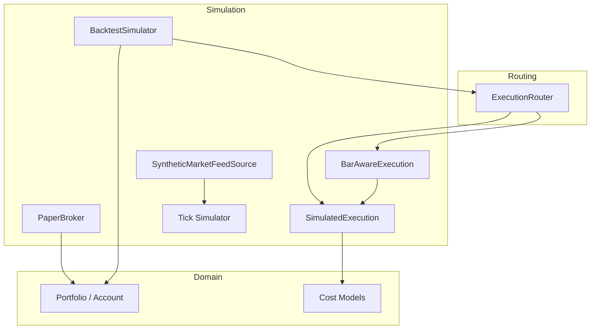
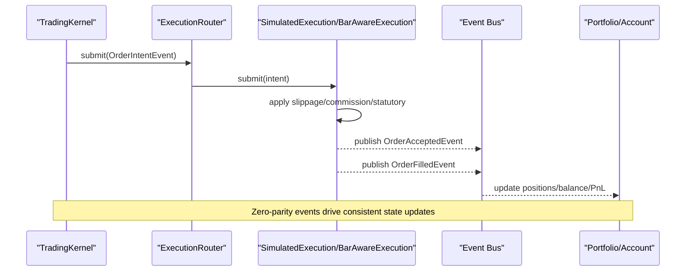
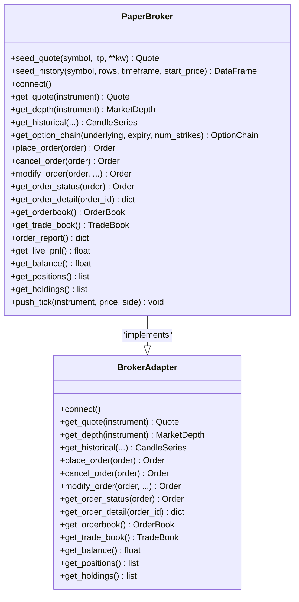
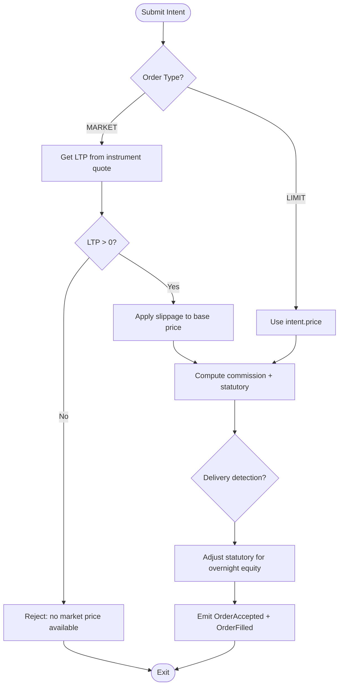
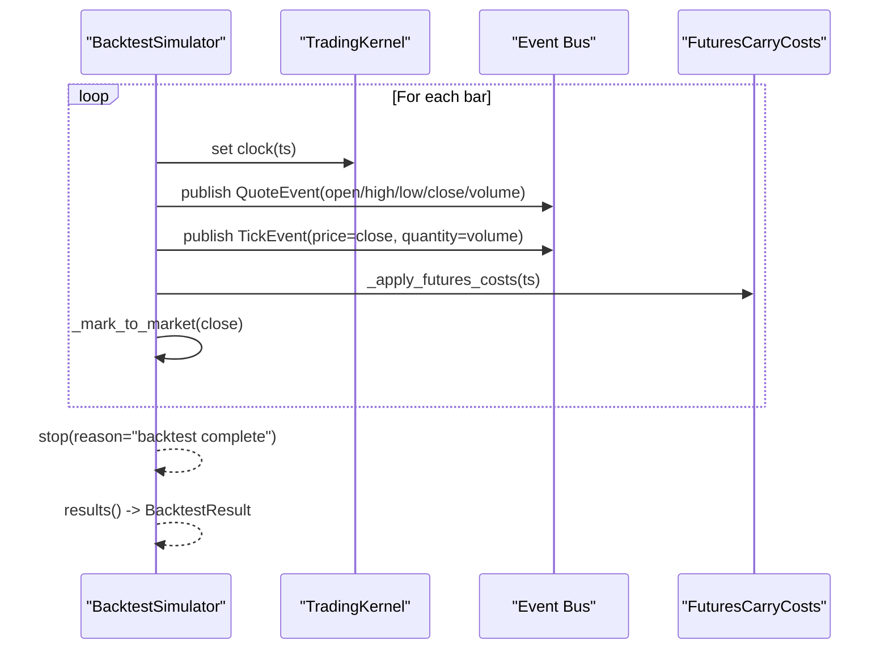
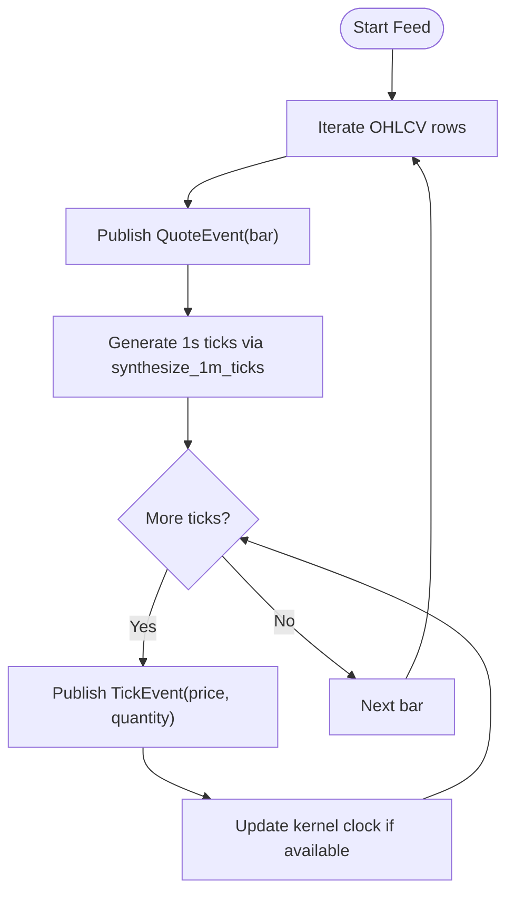
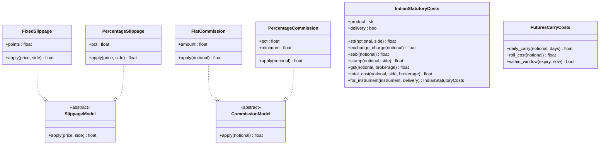
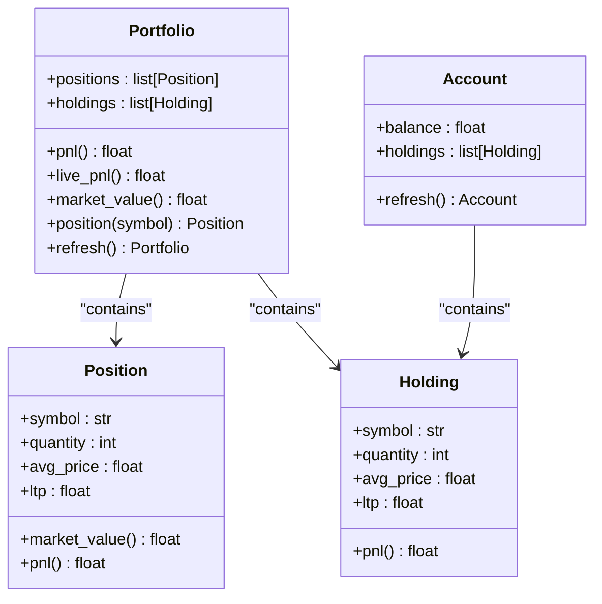
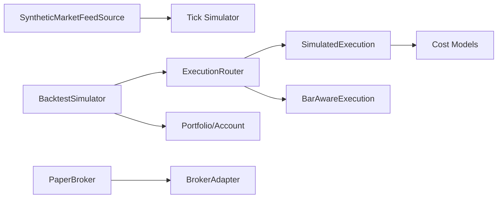

# Paper Broker Simulation

<cite>
**Referenced Files in This Document**
- [paper.py](file://ntrade/brokers/paper.py)
- [base.py](file://ntrade/brokers/base.py)
- [simulator.py](file://ntrade/backtest/simulator.py)
- [fills.py](file://ntrade/backtest/fills.py)
- [simulator.py](file://ntrade/execution/simulator.py)
- [costs.py](file://ntrade/execution/costs.py)
- [tick_simulator.py](file://ntrade/sim/tick_simulator.py)
- [synthetic_feed.py](file://ntrade/sources/synthetic_feed.py)
- [portfolio.py](file://ntrade/domain/portfolio.py)
- [router.py](file://ntrade/execution/router.py)
- [paper_gate_run.py](file://scripts/paper_gate_run.py)
</cite>

## Table of Contents
1. [Introduction](#introduction)
2. [Project Structure](#project-structure)
3. [Core Components](#core-components)
4. [Architecture Overview](#architecture-overview)
5. [Detailed Component Analysis](#detailed-component-analysis)
6. [Dependency Analysis](#dependency-analysis)
7. [Performance Considerations](#performance-considerations)
8. [Troubleshooting Guide](#troubleshooting-guide)
9. [Conclusion](#conclusion)
10. [Appendices](#appendices)

## Introduction
This document explains the Paper broker implementation and its surrounding simulation ecosystem used for testing, replay, and backtesting within the project. It focuses on how realistic trading behavior is simulated without actual market connectivity: order matching logic, fill generation, position tracking, simulated market data, price movement models, slippage simulation, portfolio simulation with virtual cash balances, margin considerations, and P&L tracking. It also clarifies differences from live trading behavior and provides configuration guidance and usage examples for strategy development and backtesting scenarios.

## Project Structure
The paper simulation spans several modules that together provide zero-parity execution across paper, replay, and backtest modes:
- PaperBroker implements the BrokerAdapter contract to provide in-memory quotes, depth, history, and order lifecycle methods.
- SimulatedExecution and BarAwareExecution implement deterministic fills against instrument quote state and bar-aware limit rules.
- BacktestSimulator drives the kernel over historical OHLCV bars, publishes QuoteEvent/TickEvent, and computes results including costs and drawdown.
- SyntheticMarketFeedSource and tick simulator generate deterministic 1-second ticks from 1-minute OHLCV bars.
- Cost models define slippage, commission, and statutory charges (Indian H6), ensuring P&L convergence with live.
- Portfolio and Account domain objects track positions, holdings, and balance for P&L and equity calculations.

**Diagram sources**
- [paper.py:23-216](file://ntrade/brokers/paper.py#L23-L216)
- [simulator.py:58-113](file://ntrade/backtest/simulator.py#L58-L113)
- [fills.py:44-72](file://ntrade/backtest/fills.py#L44-L72)
- [simulator.py:43-147](file://ntrade/execution/simulator.py#L43-L147)
- [tick_simulator.py:51-82](file://ntrade/sim/tick_simulator.py#L51-L82)
- [synthetic_feed.py:19-77](file://ntrade/sources/synthetic_feed.py#L19-L77)
- [portfolio.py:63-173](file://ntrade/domain/portfolio.py#L63-L173)
- [costs.py:21-285](file://ntrade/execution/costs.py#L21-L285)
- [router.py:19-49](file://ntrade/execution/router.py#L19-L49)

**Section sources**
- [paper.py:23-216](file://ntrade/brokers/paper.py#L23-L216)
- [simulator.py:58-113](file://ntrade/backtest/simulator.py#L58-L113)
- [fills.py:16-72](file://ntrade/backtest/fills.py#L16-L72)
- [simulator.py:43-147](file://ntrade/execution/simulator.py#L43-L147)
- [tick_simulator.py:51-82](file://ntrade/sim/tick_simulator.py#L51-L82)
- [synthetic_feed.py:19-77](file://ntrade/sources/synthetic_feed.py#L19-L77)
- [portfolio.py:63-173](file://ntrade/domain/portfolio.py#L63-L173)
- [costs.py:21-285](file://ntrade/execution/costs.py#L21-L285)
- [router.py:19-49](file://ntrade/execution/router.py#L19-L49)

## Core Components
- PaperBroker: In-memory broker providing quotes, depth, history, option chains, and order lifecycle operations. Always connected; uses a seeded RNG for deterministic outputs; supports clock injection for replay/backtest time alignment.
- SimulatedExecution: Deterministic fill engine that applies slippage, commissions, and statutory costs; tracks delivery detection for overnight equity exits; emits OrderAcceptedEvent and OrderFilledEvent.
- BarAwareExecution: Extends SimulatedExecution to enforce bar-aware limit fill rules using FillPolicy; rejects limit orders when the bar does not touch the limit.
- BacktestSimulator: Orchestrates the TradingKernel over OHLCV bars, publishes QuoteEvent and TickEvent per bar, accrues futures carry/roll costs, and produces BacktestResult with equity curve, trades, and cost totals.
- SyntheticMarketFeedSource: Converts 1m OHLCV into deterministic 1-second ticks while preserving high/low and volume distribution; publishes canonical events identical to live feeds.
- Cost Models: SlippageModel, CommissionModel, IndianStatutoryCosts, and FuturesCarryCosts ensure realistic charge modeling and product-specific schedules.
- Portfolio/Account: Track positions, holdings, and balance; compute P&L and market value; integrate with broker adapters for refresh.

**Section sources**
- [paper.py:23-216](file://ntrade/brokers/paper.py#L23-L216)
- [simulator.py:43-147](file://ntrade/execution/simulator.py#L43-L147)
- [fills.py:16-72](file://ntrade/backtest/fills.py#L16-L72)
- [simulator.py:58-113](file://ntrade/backtest/simulator.py#L58-L113)
- [synthetic_feed.py:19-77](file://ntrade/sources/synthetic_feed.py#L19-L77)
- [costs.py:21-285](file://ntrade/execution/costs.py#L21-L285)
- [portfolio.py:63-173](file://ntrade/domain/portfolio.py#L63-L173)

## Architecture Overview
The simulation architecture maintains zero parity between live and simulated environments by routing all order intents through an ExecutionRouter to a target execution engine. The same event model (QuoteEvent, TickEvent, OrderIntentEvent, OrderFilledEvent) is used across synthetic feeds, backtests, and paper trading.

**Diagram sources**
- [router.py:19-49](file://ntrade/execution/router.py#L19-L49)
- [simulator.py:72-147](file://ntrade/execution/simulator.py#L72-L147)
- [fills.py:59-72](file://ntrade/backtest/fills.py#L59-L72)
- [simulator.py:116-143](file://ntrade/backtest/simulator.py#L116-L143)

**Section sources**
- [router.py:19-49](file://ntrade/execution/router.py#L19-L49)
- [simulator.py:72-147](file://ntrade/execution/simulator.py#L72-L147)
- [fills.py:59-72](file://ntrade/backtest/fills.py#L59-L72)
- [simulator.py:116-143](file://ntrade/backtest/simulator.py#L116-L143)

## Detailed Component Analysis

### PaperBroker
PaperBroker implements the BrokerAdapter contract to provide deterministic market data and order lifecycle functionality:
- Seeded RNG ensures reproducibility for quotes, depth levels, and generated history.
- seed_quote and seed_history create initial state for instruments and historical candles.
- get_depth synthesizes bid/ask levels around LTP with random quantities.
- place_order immediately completes orders with a fill price derived from current quote or order price; assigns sequential IDs and sets status COMPLETED.
- cancel_order and modify_order operate on stored orders; get_order_status and get_order_detail reflect internal state.
- get_orderbook and get_trade_book expose order/trade snapshots.
- get_balance returns a fixed virtual balance; get_positions and get_holdings return empty lists (positions are tracked via kernel’s portfolio).
- push_tick dispatches TickEvent to subscribed instruments.

**Diagram sources**
- [base.py:25-163](file://ntrade/brokers/base.py#L25-L163)
- [paper.py:23-216](file://ntrade/brokers/paper.py#L23-L216)

**Section sources**
- [paper.py:23-216](file://ntrade/brokers/paper.py#L23-L216)
- [base.py:25-163](file://ntrade/brokers/base.py#L25-L163)

### SimulatedExecution and BarAwareExecution
SimulatedExecution provides deterministic fills:
- For MARKET orders, base price comes from instrument._quote.ltp; slippage is applied.
- For LIMIT orders, intent.price is used directly unless overridden by BarAwareExecution.
- Emits OrderAcceptedEvent and OrderFilledEvent with computed commission and statutory costs.
- Delivery detection adjusts statutory charges for overnight equity exits.

BarAwareExecution enforces bar-aware limit fills:
- Consults FillPolicy.limit_fill against the current bar; if not touched, returns OrderRejectedEvent.
- Otherwise, replaces intent.price with the bar-aware fill price and delegates to parent submit.

**Diagram sources**
- [simulator.py:72-147](file://ntrade/execution/simulator.py#L72-L147)
- [fills.py:59-72](file://ntrade/backtest/fills.py#L59-L72)

**Section sources**
- [simulator.py:43-147](file://ntrade/execution/simulator.py#L43-L147)
- [fills.py:44-72](file://ntrade/backtest/fills.py#L44-L72)

### BacktestSimulator
BacktestSimulator runs the standard kernel over historical OHLCV bars:
- Publishes QuoteEvent and TickEvent per bar to keep engines consistent with live.
- Applies futures carry and roll costs when configured.
- Tracks equity curve and computes final metrics: total return, max drawdown, commissions, statutory, futures costs.

**Diagram sources**
- [simulator.py:116-143](file://ntrade/backtest/simulator.py#L116-L143)
- [simulator.py:145-191](file://ntrade/backtest/simulator.py#L145-L191)
- [simulator.py:194-220](file://ntrade/backtest/simulator.py#L194-L220)

**Section sources**
- [simulator.py:58-113](file://ntrade/backtest/simulator.py#L58-L113)
- [simulator.py:116-143](file://ntrade/backtest/simulator.py#L116-L143)
- [simulator.py:145-191](file://ntrade/backtest/simulator.py#L145-L191)
- [simulator.py:194-220](file://ntrade/backtest/simulator.py#L194-L220)

### SyntheticMarketFeedSource and Tick Simulator
SyntheticMarketFeedSource converts 1m OHLCV into deterministic 1-second ticks:
- Publishes QuoteEvent per bar to maintain OHLCV consistency.
- Uses synthesize_1m_ticks to produce one tick per second respecting high/low and distributing volume proportionally to price moves.
- Updates kernel clock when available to align timestamps.

**Diagram sources**
- [synthetic_feed.py:52-77](file://ntrade/sources/synthetic_feed.py#L52-L77)
- [tick_simulator.py:51-82](file://ntrade/sim/tick_simulator.py#L51-L82)

**Section sources**
- [synthetic_feed.py:19-77](file://ntrade/sources/synthetic_feed.py#L19-L77)
- [tick_simulator.py:51-82](file://ntrade/sim/tick_simulator.py#L51-L82)

### Cost Models and Statutory Charges
Cost models ensure realistic P&L simulation:
- SlippageModel: FixedSlippage and PercentageSlippage adjust base prices for BUY/SELL.
- CommissionModel: FlatCommission and PercentageCommission calculate brokerage per notional.
- IndianStatutoryCosts: Computes STT, exchange charges, SEBI fee, GST, stamp duty; product-specific schedules via for_instrument; supports delivery flag for overnight equity.
- FuturesCarryCosts: Daily carry and roll costs for futures holding periods.

**Diagram sources**
- [costs.py:21-285](file://ntrade/execution/costs.py#L21-L285)

**Section sources**
- [costs.py:21-285](file://ntrade/execution/costs.py#L21-L285)

### Portfolio and Account Tracking
Portfolio and Account manage positions, holdings, and balance:
- Position and Holding compute market_value and pnl based on avg_price and ltp.
- Portfolio aggregates positions and holdings; exposes live_pnl via broker adapter when available.
- Account holds balance and holdings; can be refreshed from broker adapter.

**Diagram sources**
- [portfolio.py:19-173](file://ntrade/domain/portfolio.py#L19-L173)

**Section sources**
- [portfolio.py:19-173](file://ntrade/domain/portfolio.py#L19-L173)

## Dependency Analysis
Key dependencies and interactions:
- ExecutionRouter selects SimulatedExecution or BarAwareExecution based on strategy name or default target.
- BacktestSimulator wires ExecutionRouter with chosen execution target and registers it with the kernel.
- SyntheticMarketFeedSource depends on tick_simulator to generate deterministic ticks from OHLCV.
- PaperBroker depends on BrokerAdapter for timestamp resolution and streaming infrastructure.
- SimulatedExecution depends on cost models for slippage, commission, and statutory charges.

**Diagram sources**
- [router.py:19-49](file://ntrade/execution/router.py#L19-L49)
- [simulator.py:86-109](file://ntrade/backtest/simulator.py#L86-L109)
- [synthetic_feed.py:52-77](file://ntrade/sources/synthetic_feed.py#L52-L77)
- [paper.py:23-36](file://ntrade/brokers/paper.py#L23-L36)
- [simulator.py:43-71](file://ntrade/execution/simulator.py#L43-L71)

**Section sources**
- [router.py:19-49](file://ntrade/execution/router.py#L19-L49)
- [simulator.py:86-109](file://ntrade/backtest/simulator.py#L86-L109)
- [synthetic_feed.py:52-77](file://ntrade/sources/synthetic_feed.py#L52-L77)
- [paper.py:23-36](file://ntrade/brokers/paper.py#L23-L36)
- [simulator.py:43-71](file://ntrade/execution/simulator.py#L43-L71)

## Performance Considerations
- Deterministic RNG seeding ensures reproducible simulations; avoid excessive randomness in custom components to maintain stability.
- Bar-aware limit fills reduce unnecessary rejections by checking bar extremes before submitting limits.
- Volume distribution proportional to price moves avoids unrealistic tick patterns and keeps backtests efficient.
- Using ReplayClock/SimulationClock prevents wall-clock drift and ensures consistent timing across runs.
- Minimizing object allocations in tight loops (e.g., tick generation) improves throughput for large datasets.

## Troubleshooting Guide
Common issues and resolutions:
- No fills produced: Ensure instrument is registered with the kernel and quotes are available; verify limit orders are touched by bar highs/lows.
- Unexpected rejections: Check for invalid fill prices or missing market prices; confirm slippage models do not invert prices.
- Equity mismatch: Verify futures carry costs are applied correctly; ensure delivery detection is enabled for overnight equity exits.
- Clock synchronization: Use ReplayClock/SimulationClock to align timestamps; ensure feed sources update kernel clock when available.

**Section sources**
- [simulator.py:72-96](file://ntrade/execution/simulator.py#L72-L96)
- [fills.py:59-72](file://ntrade/backtest/fills.py#L59-L72)
- [simulator.py:145-191](file://ntrade/backtest/simulator.py#L145-L191)

## Conclusion
The Paper broker and simulation ecosystem provide a robust, zero-parity environment for strategy development and backtesting. By combining deterministic market data generation, realistic cost modeling, and consistent event-driven execution, the system closely mirrors live trading behavior while enabling safe experimentation and validation. Proper configuration of slippage, commission, statutory costs, and futures carry ensures P&L convergence with live markets.

## Appendices

### Configuration Examples
- Basic backtest setup with default costs and bar-aware limit fills:
  - Initialize BacktestSimulator with symbol, exchange, timeframe, initial_cash, and optional fill_policy.
  - Register strategy and run over OHLCV data.
- Paper gate validation:
  - Use scripts/paper_gate_run.py to run a strategy over real historical data in synth/paper mode and print validation checklist.

**Section sources**
- [simulator.py:58-113](file://ntrade/backtest/simulator.py#L58-L113)
- [paper_gate_run.py:22-66](file://scripts/paper_gate_run.py#L22-L66)