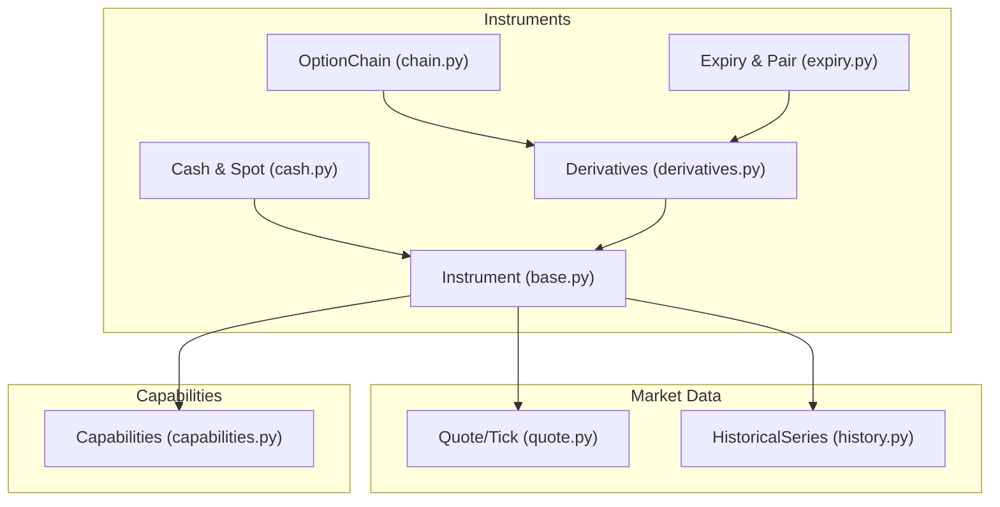
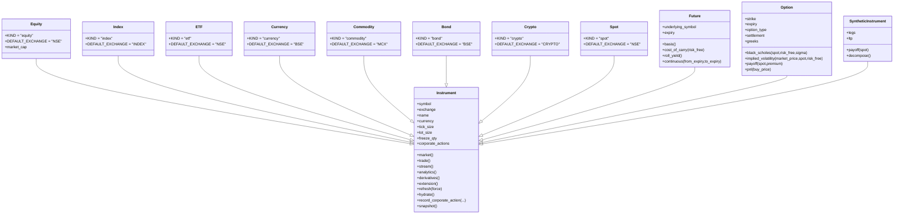
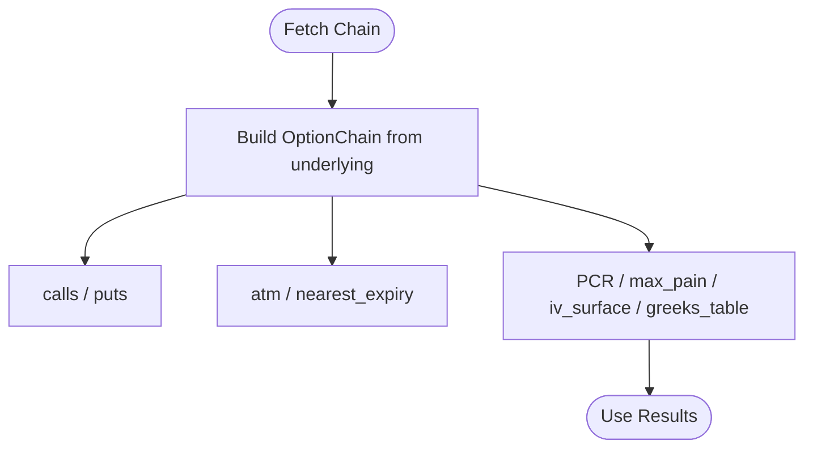
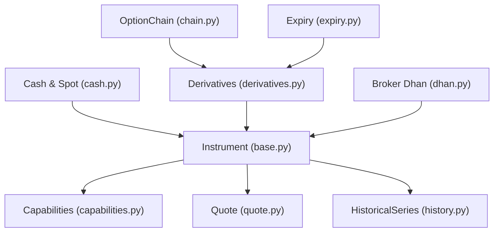

# Asset-Specific Instruments

<cite>
**Referenced Files in This Document**
- [__init__.py](file://ntrade/domain/instruments/__init__.py)
- [base.py](file://ntrade/domain/instruments/base.py)
- [cash.py](file://ntrade/domain/instruments/cash.py)
- [derivatives.py](file://ntrade/domain/instruments/derivatives.py)
- [capabilities.py](file://ntrade/domain/instruments/capabilities.py)
- [chain.py](file://ntrade/domain/instruments/chain.py)
- [expiry.py](file://ntrade/domain/instruments/expiry.py)
- [quote.py](file://ntrade/domain/market/quote.py)
- [history.py](file://ntrade/domain/market/history.py)
- [test_instruments.py](file://tests/test_instruments.py)
- [test_mission_gaps.py](file://tests/test_mission_gaps.py)
- [dhan.py](file://ntrade/brokers/dhan.py)
</cite>

## Table of Contents
1. [Introduction](#introduction)
2. [Project Structure](#project-structure)
3. [Core Components](#core-components)
4. [Architecture Overview](#architecture-overview)
5. [Detailed Component Analysis](#detailed-component-analysis)
6. [Dependency Analysis](#dependency-analysis)
7. [Performance Considerations](#performance-considerations)
8. [Troubleshooting Guide](#troubleshooting-guide)
9. [Conclusion](#conclusion)

## Introduction
This document explains asset-specific instrument implementations in nTrade, focusing on how different asset classes are modeled and used across trading workflows. It covers Equity, Index, ETF, Currency, Commodity, Bond, Crypto, and Spot instruments, detailing their properties, validation rules, pricing mechanisms, and market microstructure considerations. It also documents corporate actions for cash-settled equities, synthetic index calculation via composite instruments, NAV tracking concepts for ETFs, bid-ask spreads and cross-rate handling for currencies, delivery and storage considerations for commodities, fixed-income yield and credit risk modeling for bonds, blockchain integration and volatility modeling for crypto, and immediate settlement semantics for spot trading. Examples illustrate creating instruments and accessing asset-specific metadata through the capability system.

## Project Structure
The instrument hierarchy is organized under domain/instruments with a shared base class and specialized subclasses per asset type. Market data primitives (Quote, Tick) and historical series are separate modules that instruments own internally. Broker capabilities and extensions are exposed via a capability facade.



**Diagram sources**
- [base.py](file://ntrade/domain/instruments/base.py)
- [cash.py](file://ntrade/domain/instruments/cash.py)
- [derivatives.py](file://ntrade/domain/instruments/derivatives.py)
- [chain.py](file://ntrade/domain/instruments/chain.py)
- [expiry.py](file://ntrade/domain/instruments/expiry.py)
- [quote.py](file://ntrade/domain/market/quote.py)
- [history.py](file://ntrade/domain/market/history.py)
- [capabilities.py](file://ntrade/domain/instruments/capabilities.py)

**Section sources**
- [__init__.py](file://ntrade/domain/instruments/__init__.py)
- [base.py](file://ntrade/domain/instruments/base.py)
- [cash.py](file://ntrade/domain/instruments/cash.py)
- [derivatives.py](file://ntrade/domain/instruments/derivatives.py)
- [capabilities.py](file://ntrade/domain/instruments/capabilities.py)
- [chain.py](file://ntrade/domain/instruments/chain.py)
- [expiry.py](file://ntrade/domain/instruments/expiry.py)
- [quote.py](file://ntrade/domain/market/quote.py)
- [history.py](file://ntrade/domain/market/history.py)

## Core Components
- Instrument base: Owns quote, depth, history, stream, indicators, signals, annotations, tags, metadata, session state, and corporate actions. Provides lazy broker wiring and capability accessors.
- Capability system: Decomposes behavior into MarketCapability, TradeCapability, StreamCapability, AnalyticsCapability, DerivativesCapability, and ExtensionCapability.
- Market data: Quote and Tick are immutable value objects; HistoricalSeries wraps pandas DataFrame with caching and fetch lifecycle.
- Derivatives: Future, Option, SyntheticInstrument provide analytics like basis, cost-of-carry, roll yield, Black-Scholes pricing, Greeks, and payoff/PnL.
- Chains: OptionChain organizes options by expiry and strike, exposing ATM/ITM/OTM views, PCR, max pain, IV surface, and Greeks table.

Key behaviors:
- Hydration: Metadata (tick size, lot size, freeze qty, circuit limits) fetched once from broker adapter.
- Corporate actions: Record dividend/split/bonus/merger events with dates and descriptions.
- Streaming: Subscribe/unsubscribe and event handlers for ticks, quotes, trades, depth, disconnect.
- Order entry: Fluent builder for buy/sell orders with market/limit/stop types and bracket legs.

**Section sources**
- [base.py](file://ntrade/domain/instruments/base.py)
- [capabilities.py](file://ntrade/domain/instruments/capabilities.py)
- [quote.py](file://ntrade/domain/market/quote.py)
- [history.py](file://ntrade/domain/market/history.py)
- [derivatives.py](file://ntrade/domain/instruments/derivatives.py)
- [chain.py](file://ntrade/domain/instruments/chain.py)
- [expiry.py](file://ntrade/domain/instruments/expiry.py)

## Architecture Overview
The instrument architecture follows a composition pattern where each Instrument owns its market state and delegates to capabilities. Broker adapters are optional and injected lazily. The capability facade exposes provider-specific features without polluting the core API.



**Diagram sources**
- [base.py](file://ntrade/domain/instruments/base.py)
- [cash.py](file://ntrade/domain/instruments/cash.py)
- [derivatives.py](file://ntrade/domain/instruments/derivatives.py)

## Detailed Component Analysis

### Equity Instruments
Equity instruments represent tradable stocks with cash settlement. They support:
- Properties: symbol, exchange, name, currency, tick_size, lot_size, freeze_qty, and metadata such as market_cap.
- Validation: Inherits base validations; default exchange NSE.
- Pricing mechanisms: LTP, bid/ask spread, mid price, VWAP, volume, OI, change/change_pct via Quote.
- Market microstructure: Circuit limits hydrated from broker; depth imbalance and absorption detection via capabilities.
- Corporate actions: Dividends, splits, bonuses, mergers recorded with ex_date and record_date.

Examples:
- Create an equity and refresh quote via broker adapter.
- Access metadata like market_cap from _metadata.
- Record and query corporate actions.

**Section sources**
- [cash.py](file://ntrade/domain/instruments/cash.py)
- [base.py](file://ntrade/domain/instruments/base.py)
- [quote.py](file://ntrade/domain/market/quote.py)
- [test_instruments.py](file://tests/test_instruments.py)
- [test_mission_gaps.py](file://tests/test_mission_gaps.py)

### Index Instruments
Index instruments model market indices with synthetic calculation capabilities:
- Default exchange INDEX; KIND index.
- Synthetic composition: Use SyntheticInstrument to aggregate underlying components or futures/options to compute synthetic index values.
- Pricing mechanisms: Composite LTP computed as sum of leg prices; continuous series can be back-adjusted similarly to futures.
- Basket composition: Maintain legs list representing constituent instruments; decompose to retrieve constituents.

Examples:
- Build a synthetic index from a basket of equities or futures.
- Compute synthetic LTP and payoff profiles.

**Section sources**
- [cash.py](file://ntrade/domain/instruments/cash.py)
- [derivatives.py](file://ntrade/domain/instruments/derivatives.py)

### ETF Instruments
ETF instruments combine equity and index characteristics:
- Default exchange NSE; KIND etf.
- NAV tracking: Track Net Asset Value via metadata fields or external feeds; premium/discount analysis compares market LTP vs NAV.
- Pricing mechanisms: Spread and mid-price reflect market dynamics; corporate actions may apply to underlying holdings.
- Microstructure: Depth and streaming behave like equities; metadata hydration includes tick/lot/freeze.

Examples:
- Create an ETF and compare LTP to NAV stored in metadata.
- Analyze premium/discount using Quote fields and metadata.

**Section sources**
- [cash.py](file://ntrade/domain/instruments/cash.py)
- [quote.py](file://ntrade/domain/market/quote.py)

### Currency Instruments
Currency instruments model forex pairs:
- Default exchange BSE; KIND currency.
- Bid-ask spreads: Quote.bid and Quote.ask define spreads; mid_price computed when both sides present.
- Cross-rate calculations: Combine base and quote currency quotes to derive cross rates; use capabilities to compute derived metrics.
- Volatility modeling: Use analytics.compute to calculate volatility and other indicators over historical series.

Examples:
- Construct a currency pair and compute spread and mid-price.
- Calculate cross-rates by combining two currency quotes.

**Section sources**
- [cash.py](file://ntrade/domain/instruments/cash.py)
- [quote.py](file://ntrade/domain/market/quote.py)
- [capabilities.py](file://ntrade/domain/instruments/capabilities.py)

### Commodity Instruments
Commodity instruments represent physical goods:
- Default exchange MCX; KIND commodity.
- Delivery specifications: Metadata fields encode contract specs (e.g., grade, delivery month); lot_size and freeze_qty enforced by broker metadata.
- Storage costs: Model carrying costs via metadata or analytics; incorporate into pricing models and roll strategies.
- Pricing mechanisms: LTP, spread, and historical series enable technical analysis and strategy development.

Examples:
- Create a commodity instrument and inspect metadata for delivery terms.
- Incorporate storage costs into carry calculations.

**Section sources**
- [cash.py](file://ntrade/domain/instruments/cash.py)
- [base.py](file://ntrade/domain/instruments/base.py)

### Bond Instruments
Bond instruments model fixed-income securities:
- Default exchange BSE; KIND bond.
- Yield calculations: Use historical series and Quote fields to compute current yield, yield-to-maturity, and duration; integrate with analytics.compute for statistical measures.
- Credit risk assessment: Metadata fields capture issuer, rating, maturity; combine with spreads and volatility to assess risk.
- Pricing mechanisms: Spread over benchmark rates; corporate actions like coupon payments recorded as actions.

Examples:
- Create a bond and compute yield metrics using historical closes and metadata.
- Record coupon payments as corporate actions.

**Section sources**
- [cash.py](file://ntrade/domain/instruments/cash.py)
- [base.py](file://ntrade/domain/instruments/base.py)
- [history.py](file://ntrade/domain/market/history.py)

### Crypto Instruments
Crypto instruments model digital assets:
- Default exchange CRYPTO; KIND crypto.
- Blockchain integration: Broker adapters may expose on-chain metrics via capabilities; metadata can include network, token standard.
- Volatility modeling: High-frequency ticks and historical series enable volatility estimation; analytics.compute provides statistical summaries.
- Pricing mechanisms: LTP and spread reflect exchange liquidity; cross-pair rates derived from base quotes.

Examples:
- Create a crypto instrument and analyze volatility using analytics.
- Access blockchain-related metadata via instrument._metadata.

**Section sources**
- [cash.py](file://ntrade/domain/instruments/cash.py)
- [quote.py](file://ntrade/domain/market/quote.py)
- [capabilities.py](file://ntrade/domain/instruments/capabilities.py)

### Spot Instruments
Spot instruments represent immediate settlement trading:
- Default exchange NSE; KIND spot.
- Settlement semantics: Trades settle immediately; no delivery lag; suitable for intraday strategies.
- Pricing mechanisms: Quote fields provide real-time LTP, bid/ask, volume; streaming supports live updates.
- Microstructure: Depth and imbalance indicators assist execution decisions.

Examples:
- Create a spot instrument and subscribe to live ticks.
- Execute market orders with immediate settlement.

**Section sources**
- [cash.py](file://ntrade/domain/instruments/cash.py)
- [quote.py](file://ntrade/domain/market/quote.py)
- [capabilities.py](file://ntrade/domain/instruments/capabilities.py)

### Derivatives and Synthetic Instruments
Derivatives add advanced pricing and analytics:
- Futures: Basis, cost-of-carry, roll yield, continuous series construction.
- Options: Greeks, Black-Scholes pricing, implied volatility, intrinsic/extrinsic value, moneyness classification.
- SyntheticInstrument: Composite of legs with aggregated LTP and payoff computation.

```mermaid
sequenceDiagram
participant User as "User Code"
participant Opt as "Option"
participant BS as "BlackScholes"
participant Greeks as "Greeks"
User->>Opt : black_scholes(spot, risk_free, sigma)
Opt->>BS : price(spot, strike, t, risk_free, sigma, option_type)
BS-->>Opt : theoretical_price
Opt-->>User : theoretical_price
User->>Opt : set_greeks(greeks)
Opt->>Greeks : store greeks
Opt-->>User : iv updated if available
```

**Diagram sources**
- [derivatives.py](file://ntrade/domain/instruments/derivatives.py)

**Section sources**
- [derivatives.py](file://ntrade/domain/instruments/derivatives.py)

### Option Chain Navigation
OptionChain provides structured navigation over expiries and strikes:
- Views: calls, puts, nearest_expiry, atm, itm, otm.
- Analytics: PCR, max_pain, IV surface, Greeks table.
- Lifecycle: subscribe, refresh, indexing by strike.



**Diagram sources**
- [chain.py](file://ntrade/domain/instruments/chain.py)

**Section sources**
- [chain.py](file://ntrade/domain/instruments/chain.py)
- [expiry.py](file://ntrade/domain/instruments/expiry.py)

## Dependency Analysis
Instrument classes depend on base Instrument for state and capabilities. Derivatives extend functionality with pricing and analytics. Brokers provide metadata and market data through adapters. Tests validate behavior across creation, hydration, corporate actions, and derivatives.



**Diagram sources**
- [base.py](file://ntrade/domain/instruments/base.py)
- [capabilities.py](file://ntrade/domain/instruments/capabilities.py)
- [quote.py](file://ntrade/domain/market/quote.py)
- [history.py](file://ntrade/domain/market/history.py)
- [cash.py](file://ntrade/domain/instruments/cash.py)
- [derivatives.py](file://ntrade/domain/instruments/derivatives.py)
- [chain.py](file://ntrade/domain/instruments/chain.py)
- [expiry.py](file://ntrade/domain/instruments/expiry.py)
- [dhan.py](file://ntrade/brokers/dhan.py)

**Section sources**
- [__init__.py](file://ntrade/domain/instruments/__init__.py)
- [base.py](file://ntrade/domain/instruments/base.py)
- [cash.py](file://ntrade/domain/instruments/cash.py)
- [derivatives.py](file://ntrade/domain/instruments/derivatives.py)
- [chain.py](file://ntrade/domain/instruments/chain.py)
- [expiry.py](file://ntrade/domain/instruments/expiry.py)
- [dhan.py](file://ntrade/brokers/dhan.py)

## Performance Considerations
- Lazy hydration: Metadata fetched once to avoid repeated broker calls.
- Cached history: HistoricalSeries caches data per timeframe; force refresh only when needed.
- Immutability: Quote and Tick are immutable, reducing side effects and improving thread safety.
- Capability delegation: Stateless capability objects minimize overhead while providing rich APIs.
- Streaming efficiency: LiveStream manages subscriptions and event handlers efficiently.

[No sources needed since this section provides general guidance]

## Troubleshooting Guide
Common issues and resolutions:
- No broker adapter: Ensure broker is passed to instrument constructor or via factory; otherwise refresh and history fetch will fail.
- Stale quotes: Check Quote.is_stale and refresh via instrument.refresh().
- Missing metadata: Call hydrate() to populate tick_size, lot_size, freeze_qty, circuit limits.
- Invalid option type: Option requires CE or PE; ValueError raised otherwise.
- Corporate actions: Verify recording and clearing methods; actions are frozen dataclasses.

**Section sources**
- [base.py](file://ntrade/domain/instruments/base.py)
- [derivatives.py](file://ntrade/domain/instruments/derivatives.py)
- [test_instruments.py](file://tests/test_instruments.py)
- [test_mission_gaps.py](file://tests/test_mission_gaps.py)

## Conclusion
nTrade’s instrument framework provides a robust, extensible foundation for modeling diverse asset classes. Each instrument type encapsulates specific properties, validation rules, and pricing mechanisms while leveraging shared capabilities for market data, trading, streaming, analytics, and derivatives. Corporate actions, synthetic compositions, and metadata hydration enhance realism and usability. By adhering to the capability pattern and immutable data structures, the system ensures clarity, performance, and maintainability across equity, index, ETF, currency, commodity, bond, crypto, and spot instruments.

[No sources needed since this section summarizes without analyzing specific files]