# Base Instrument Class

<cite>
**Referenced Files in This Document**
- [base.py](file://ntrade/domain/instruments/base.py)
- [capabilities.py](file://ntrade/domain/instruments/capabilities.py)
- [base.py](file://ntrade/brokers/base.py)
- [capabilities.py](file://ntrade/brokers/capabilities.py)
- [cash.py](file://ntrade/domain/instruments/cash.py)
- [test_instruments.py](file://tests/test_instruments.py)
</cite>

## Update Summary
**Changes Made**
- Updated capability objects section to reflect removal of TradeCapability and ExtensionCapability
- Revised architecture diagrams to show only four remaining capabilities
- Updated usage patterns to remove references to trade and extension capabilities
- Enhanced canonical accessor pattern documentation
- Removed all references to direct quote attribute access patterns

## Table of Contents
1. Introduction
2. Project Structure
3. Core Components
4. Architecture Overview
5. Detailed Component Analysis
6. Dependency Analysis
7. Performance Considerations
8. Troubleshooting Guide
9. Conclusion

## Introduction
This document explains the base Instrument class that serves as the foundation for all financial instruments in nTrade. It covers the abstract design, common properties (symbol, exchange, name, currency, tick_size, lot_size, freeze_qty), four capability objects (market, stream, analytics, derivatives), broker integration via BrokerAdapter and BrokerExtensionFacade, event-driven state updates through apply_quote() and apply_depth(), lifecycle methods refresh() and hydrate(), corporate action handling with CorporateAction, signal management, serialization/cloning/tagging/annotation, and practical usage patterns using canonical accessor methods.

## Project Structure
The Instrument root lives under domain/instruments and composes capabilities from a dedicated module. Broker transport is isolated under brokers, with an adapter and capability facade enabling provider-specific features without polluting the core API. Concrete instrument types (Equity, Index, etc.) extend the base to specialize defaults like exchange and kind.

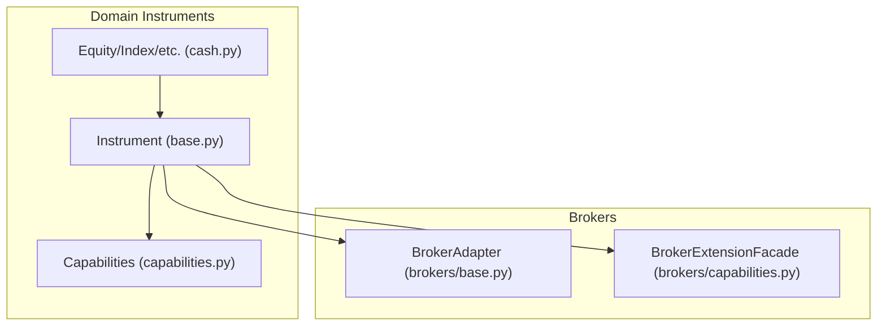

**Diagram sources**
- [base.py:50-152](file://ntrade/domain/instruments/base.py#L50-L152)
- [capabilities.py:34-250](file://ntrade/domain/instruments/capabilities.py#L34-L250)
- [base.py:25-163](file://ntrade/brokers/base.py#L25-L163)
- [capabilities.py:48-74](file://ntrade/brokers/capabilities.py#L48-L74)
- [cash.py:8-50](file://ntrade/domain/instruments/cash.py#L8-L50)

**Section sources**
- [base.py:50-152](file://ntrade/domain/instruments/base.py#L50-L152)
- [capabilities.py:1-30](file://ntrade/domain/instruments/capabilities.py#L1-L30)
- [cash.py:8-50](file://ntrade/domain/instruments/cash.py#L8-L50)

## Core Components
- **Instrument**: Abstract root holding identity, market state, streaming state, session/market status, metadata, tags, annotations, signals, and corporate actions. Exposes four lazy-cached capability objects and broker wiring.
- **Capabilities**: Stateless views over Instrument state grouped by concern:
  - **MarketCapability**: read-only quote/depth/history accessors and derived metrics
  - **StreamCapability**: live subscription and callbacks
  - **AnalyticsCapability**: indicators, statistics, pattern detection
  - **DerivativesCapability**: option chain retrieval
- **BrokerAdapter**: Abstract transport boundary for quotes, depth, history, orders, and subscriptions; optional metadata hydration.
- **BrokerExtensionFacade**: Dynamic capability registry enabling instrument.broker.<name>() per supported broker.

Key responsibilities:
- State ownership remains on Instrument; capabilities are read-only or delegate operations.
- Broker interactions are optional and lazily resolved so instruments can be created without a broker.
- Event-driven updates use apply_quote() and apply_depth() to mutate internal state.
- **Updated**: Direct quote attribute access is no longer supported - use canonical accessor methods through `instrument.market` instead.

**Section sources**
- [base.py:50-152](file://ntrade/domain/instruments/base.py#L50-L152)
- [capabilities.py:34-250](file://ntrade/domain/instruments/capabilities.py#L34-L250)
- [base.py:25-163](file://ntrade/brokers/base.py#L25-L163)
- [capabilities.py:16-74](file://ntrade/brokers/capabilities.py#L16-L74)

## Architecture Overview
The Instrument composes capabilities and optionally wires a BrokerAdapter. Capability objects are cached once per instance to avoid repeated instantiation overhead. Broker-specific features are accessed through a facade that enforces availability per broker.

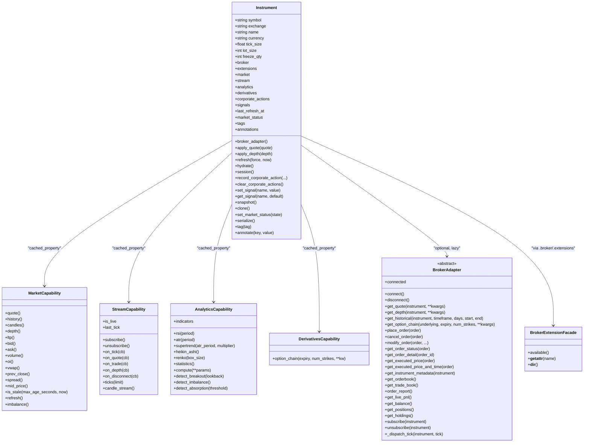

**Diagram sources**
- [base.py:50-152](file://ntrade/domain/instruments/base.py#L50-L152)
- [capabilities.py:34-250](file://ntrade/domain/instruments/capabilities.py#L34-L250)
- [base.py:25-163](file://ntrade/brokers/base.py#L25-L163)
- [capabilities.py:48-74](file://ntrade/brokers/capabilities.py#L48-L74)

## Detailed Component Analysis

### Instrument Base Class
- Identity and metadata: symbol, exchange, name, currency, tick_size, lot_size, freeze_qty, plus arbitrary metadata dict.
- Internal state: quote, depth, historical series, live stream, indicators cache, signals, annotations, tags, corporate actions list, session and market status.
- Broker wiring: optional broker and broker_factory; broker property returns a facade for dynamic capabilities.
- Capabilities: four cached_property getters returning capability instances bound to self.
- Event-driven updates: apply_quote() and apply_depth() replace internal state snapshots.
- Lifecycle: refresh() pulls latest quote/depth via broker (with hydrate() on first run); hydrate() fetches broker-known metadata once.
- Corporate actions: record_corporate_action() appends CorporateAction entries; clear and list accessors provided.
- Signals: set/get and snapshot of strategy/pattern signals.
- Serialization and cloning: snapshot() and serialize() produce a dict; clone() creates a fresh independent copy preserving identity and broker.
- Tagging and annotation: tag() and annotate() maintain sets/dicts for labeling and notes.

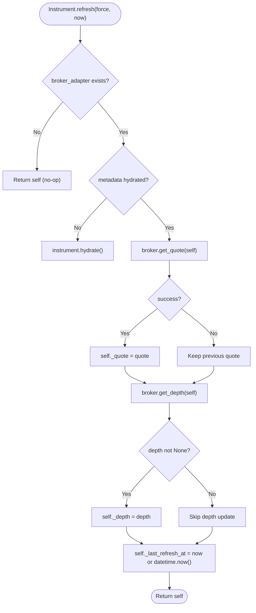

**Diagram sources**
- [base.py:161-176](file://ntrade/domain/instruments/base.py#L161-L176)

**Section sources**
- [base.py:50-152](file://ntrade/domain/instruments/base.py#L50-L152)
- [base.py:161-201](file://ntrade/domain/instruments/base.py#L161-L201)
- [base.py:207-226](file://ntrade/domain/instruments/base.py#L207-L226)
- [base.py:228-240](file://ntrade/domain/instruments/base.py#L228-L240)

### Four Capability Objects
- **MarketCapability**: exposes quote, depth, history, scalar fields (ltp, bid, ask, volume, oi, vwap, prev_close), spread/mid price, staleness check, refresh delegation, and imbalance.
- **StreamCapability**: subscribe/unsubscribe, event hooks (tick/quote/trade/depth/disconnect), ticks buffer, live candle DataFrame, is_live and last_tick accessors.
- **AnalyticsCapability**: scalar indicators (RSI, ATR), series computations (Supertrend, Heikin-Ashi, Renko), statistics, bulk compute bundle, pattern detection (breakout, imbalance, absorption).
- **DerivativesCapability**: option chain fetching via OptionChain.fetch().

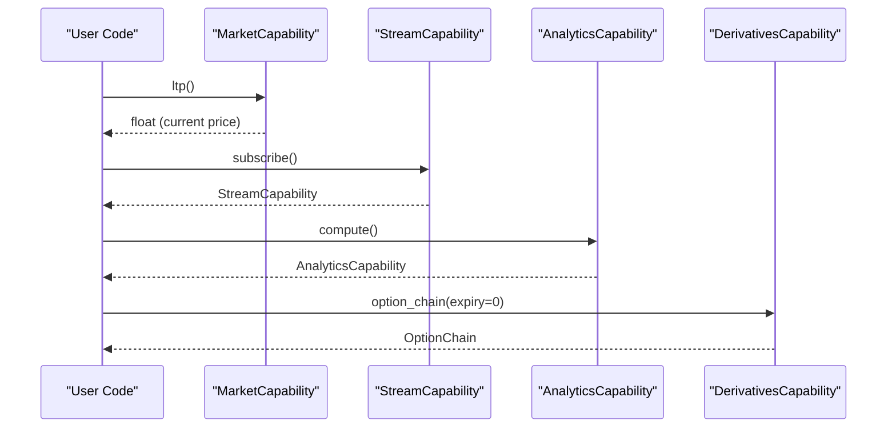

**Diagram sources**
- [capabilities.py:34-104](file://ntrade/domain/instruments/capabilities.py#L34-L104)
- [capabilities.py:103-153](file://ntrade/domain/instruments/capabilities.py#L103-L153)
- [capabilities.py:159-235](file://ntrade/domain/instruments/capabilities.py#L159-L235)
- [capabilities.py:241-250](file://ntrade/domain/instruments/capabilities.py#L241-L250)

**Section sources**
- [capabilities.py:34-104](file://ntrade/domain/instruments/capabilities.py#L34-L104)
- [capabilities.py:103-153](file://ntrade/domain/instruments/capabilities.py#L103-L153)
- [capabilities.py:159-235](file://ntrade/domain/instruments/capabilities.py#L159-L235)
- [capabilities.py:241-250](file://ntrade/domain/instruments/capabilities.py#L241-L250)

### Broker Integration Pattern
- **BrokerAdapter**: abstract transport defining get_quote, get_depth, get_historical, place_order, and optional methods like get_instrument_metadata, cancel/modify order, books, portfolio queries, and streaming helpers.
- **BrokerExtensionFacade**: registers capabilities globally and resolves them dynamically by name; raises AttributeError if unsupported by the current broker.
- Instrument.broker and Instrument.extensions both return the same facade; provides dynamic capability resolution.

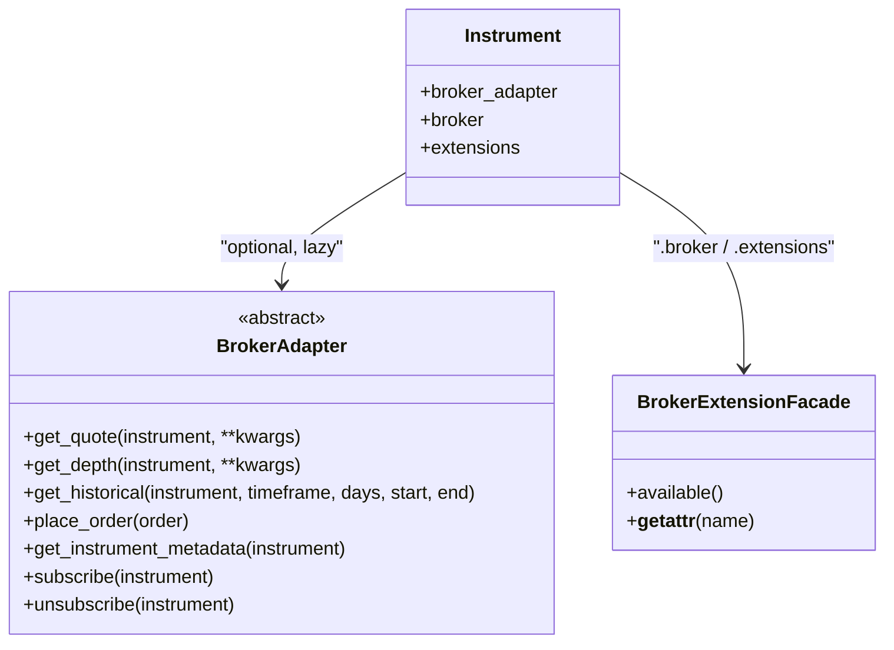

**Diagram sources**
- [base.py:25-163](file://ntrade/brokers/base.py#L25-L163)
- [capabilities.py:48-74](file://ntrade/brokers/capabilities.py#L48-L74)
- [base.py:97-117](file://ntrade/domain/instruments/base.py#L97-L117)

**Section sources**
- [base.py:25-163](file://ntrade/brokers/base.py#L25-L163)
- [capabilities.py:16-74](file://ntrade/brokers/capabilities.py#L16-L74)
- [base.py:97-117](file://ntrade/domain/instruments/base.py#L97-L117)

### Event-Driven State Management
- **apply_quote()**: replaces internal quote snapshot; used by kernel when QuoteUpdatedEvent arrives.
- **apply_depth()**: replaces internal depth snapshot.
- These methods keep the instrument as a consistent read model updated by events rather than polling.

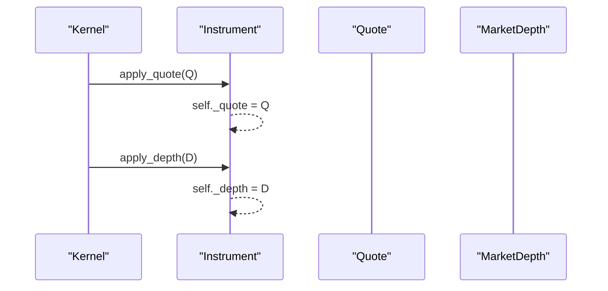

**Diagram sources**
- [base.py:146-158](file://ntrade/domain/instruments/base.py#L146-L158)

**Section sources**
- [base.py:146-158](file://ntrade/domain/instruments/base.py#L146-L158)

### Lifecycle Methods and Session Management
- **refresh(force=False, now=None)**: pulls latest quote and optional depth via broker; hydrates metadata on first run; records last refresh timestamp.
- **hydrate()**: fetches broker-known metadata (tick size, lot size, freeze qty, circuit limits) once; updates quote with circuit bounds if available.
- **session()**: returns SessionState for this instrument; set_market_status() updates internal state and enters corresponding session state.

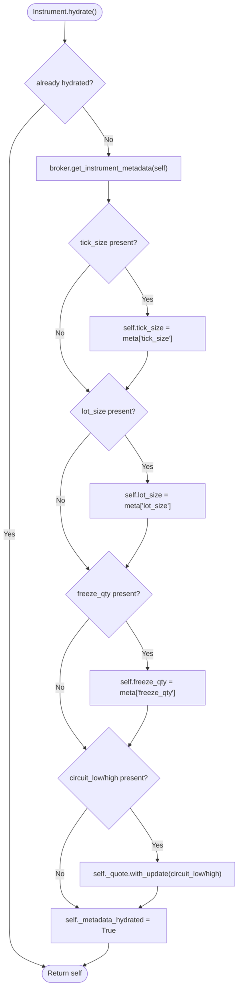

**Diagram sources**
- [base.py:178-201](file://ntrade/domain/instruments/base.py#L178-L201)

**Section sources**
- [base.py:161-201](file://ntrade/domain/instruments/base.py#L161-L201)

### Corporate Action Handling
- **CorporateAction dataclass** captures action_type, amount, ratio, ex_date, record_date, description.
- **record_corporate_action()** appends entries; corporate_actions returns a copy; clear_corporate_actions() resets.

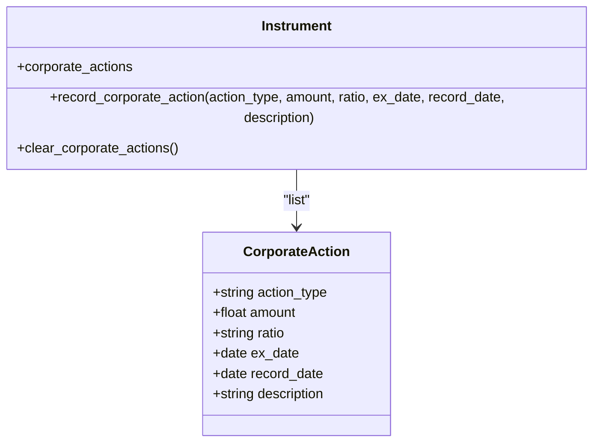

**Diagram sources**
- [base.py:35-45](file://ntrade/domain/instruments/base.py#L35-L45)
- [base.py:207-226](file://ntrade/domain/instruments/base.py#L207-L226)

**Section sources**
- [base.py:35-45](file://ntrade/domain/instruments/base.py#L35-L45)
- [base.py:207-226](file://ntrade/domain/instruments/base.py#L207-L226)

### Signal Management
- **set_signal(name, value)** stores strategy/pattern signals keyed by name.
- **get_signal(name, default)** retrieves values; signals property returns a snapshot dict.

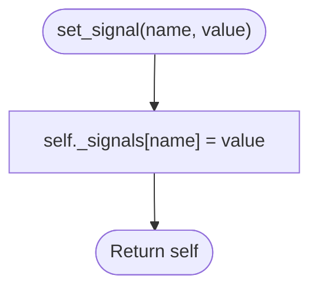

**Diagram sources**
- [base.py:228-240](file://ntrade/domain/instruments/base.py#L228-L240)

**Section sources**
- [base.py:228-240](file://ntrade/domain/instruments/base.py#L228-L240)

### Serialization, Cloning, Tagging, and Annotation
- **snapshot()/serialize()**: produce a dictionary representation including symbol, exchange, kind, name, quote dict, stream/live flags, market/session states, and last refresh time.
- **clone()**: constructs a new instance with same identity and broker reference, but independent state.
- **tag(tag)/annotate(key, value)**: maintain tags set and annotations dict; tags and annotations properties expose copies.

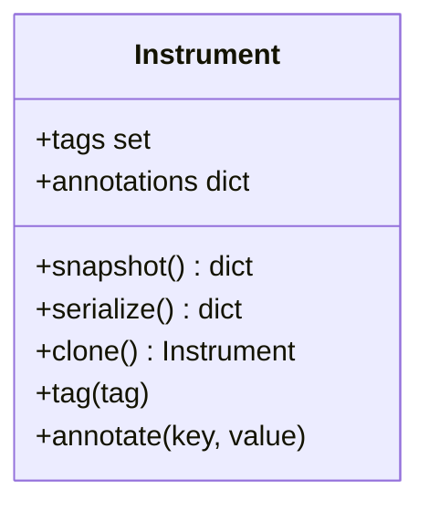

**Diagram sources**
- [base.py:245-290](file://ntrade/domain/instruments/base.py#L245-L290)

**Section sources**
- [base.py:245-290](file://ntrade/domain/instruments/base.py#L245-L290)

### Usage Patterns and Examples
- **Instrument creation**: instantiate Equity/Index/etc. with symbol and optional broker; defaults include exchange and kind.
- **Canonical accessor pattern**: Use `instrument.market.ltp()`, `instrument.market.bid()`, `instrument.market.ask()`, `instrument.market.volume()`, `instrument.market.spread()`, `instrument.market.mid_price()` instead of direct quote attribute access.
- **Capability usage**:
  - Streaming: `instrument.stream.subscribe()`, `instrument.stream.on_tick(callback)`, `instrument.stream.is_live`.
  - Analytics: `instrument.analytics.compute()`, `instrument.analytics.rsi(14)`, `instrument.analytics.statistics()`.
  - Derivatives: `instrument.derivatives.option_chain(expiry=0, num_strikes=10)`.
  - Broker extensions: `instrument.broker.depth20()` (if supported by broker).

**Updated** Direct quote attribute access patterns are no longer supported. Always use canonical accessor methods through `instrument.market` for reading quote data.

These patterns are validated in tests covering state ownership, refresh via PaperBroker, subscription lifecycle, live tick handlers, history fetch/delegation, freshness caching, indicator bundles, defaults, tagging/annotation, cloning independence, and serialization.

**Section sources**
- [cash.py:8-50](file://ntrade/domain/instruments/cash.py#L8-L50)
- [test_instruments.py:11-165](file://tests/test_instruments.py#L11-L165)

## Dependency Analysis
Instrument depends on:
- Domain market models: Quote, MarketDepth, HistoricalSeries, LiveStream, SessionState, MarketState.
- Capabilities: MarketCapability, StreamCapability, AnalyticsCapability, DerivativesCapability.
- Optional BrokerAdapter and BrokerExtensionFacade for transport and provider-specific features.
- Concrete instrument subclasses (Equity, Index, ETF, Currency, Commodity, Bond, Crypto, Spot) override KIND and DEFAULT_EXCHANGE.

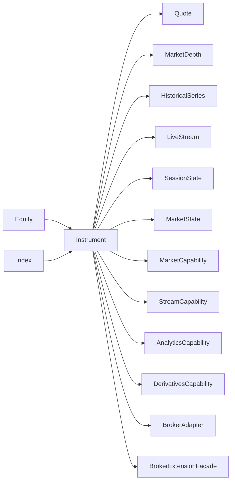

**Diagram sources**
- [base.py:18-35](file://ntrade/domain/instruments/base.py#L18-L35)
- [base.py:50-152](file://ntrade/domain/instruments/base.py#L50-L152)
- [cash.py:8-50](file://ntrade/domain/instruments/cash.py#L8-L50)

**Section sources**
- [base.py:18-35](file://ntrade/domain/instruments/base.py#L18-L35)
- [cash.py:8-50](file://ntrade/domain/instruments/cash.py#L8-L50)

## Performance Considerations
- Lazy loading: capabilities are cached_property instances, instantiated only once per Instrument.
- Metadata hydration runs at most once; refresh() avoids redundant network calls when broker is absent.
- History caching: HistoricalSeries caches fetched data per timeframe to prevent re-downloads.
- Staleness checks: market.is_stale() helps decide whether to refresh based on timestamps.
- Minimal object churn: capabilities are stateless views over Instrument state.

## Troubleshooting Guide
- No broker attached: refresh() becomes a no-op; ensure broker or broker_factory is provided.
- Unsupported capability: instrument.broker.<name>() raises AttributeError if the current broker does not support it; check available() to list supported names.
- Empty history: analytics.compute() requires non-empty history; fetch timeframe before computing indicators.
- Stale data: use market.is_stale() to detect outdated quotes and trigger refresh.
- Subscription issues: verify stream.is_live after subscribe(); ensure broker.push_* methods are used in test environments.
- **Updated**: If accessing quote data directly fails, use canonical accessor methods through `instrument.market` instead of direct attribute access.

**Section sources**
- [base.py:161-176](file://ntrade/domain/instruments/base.py#L161-L176)
- [capabilities.py:48-74](file://ntrade/brokers/capabilities.py#L48-L74)
- [test_instruments.py:42-64](file://tests/test_instruments.py#L42-L64)

## Conclusion
The Instrument class centralizes identity, state, and behavior for all financial instruments while delegating specialized functionality through four capability objects. Broker integration is cleanly abstracted behind BrokerAdapter and BrokerExtensionFacade, enabling provider-specific features without coupling the core domain. Event-driven updates, lifecycle methods, corporate actions, signals, and serialization/cloning/tagging/annotation provide a robust foundation for trading strategies and systems built on nTrade. The simplified capability system with canonical accessor patterns ensures cleaner, more maintainable code while providing comprehensive market data access through well-defined interfaces.