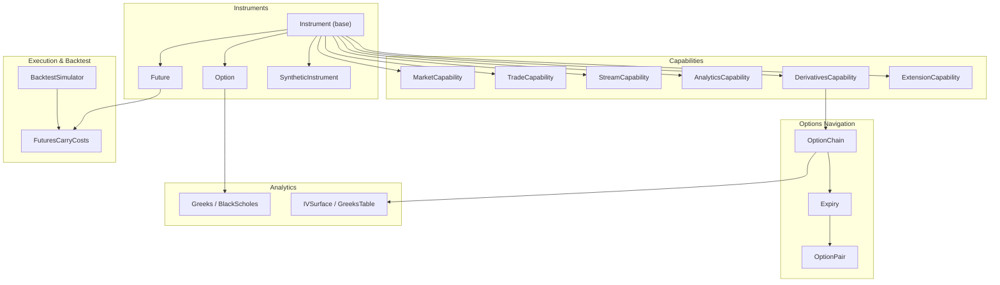
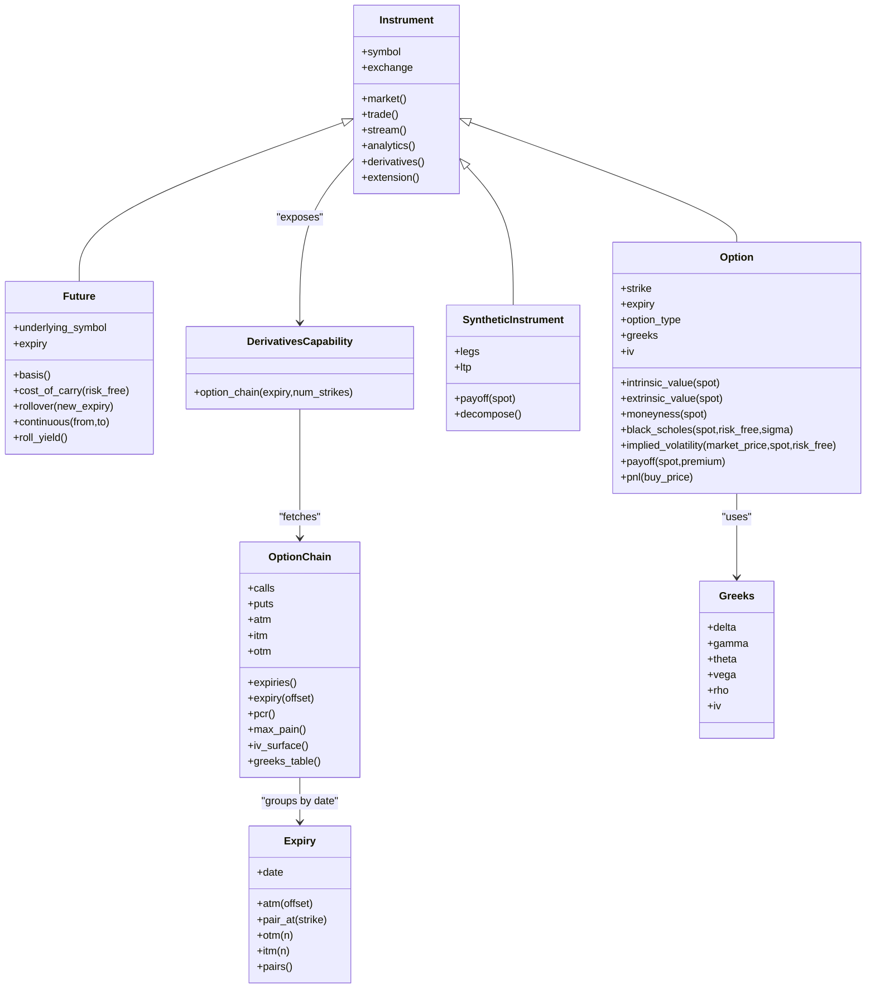
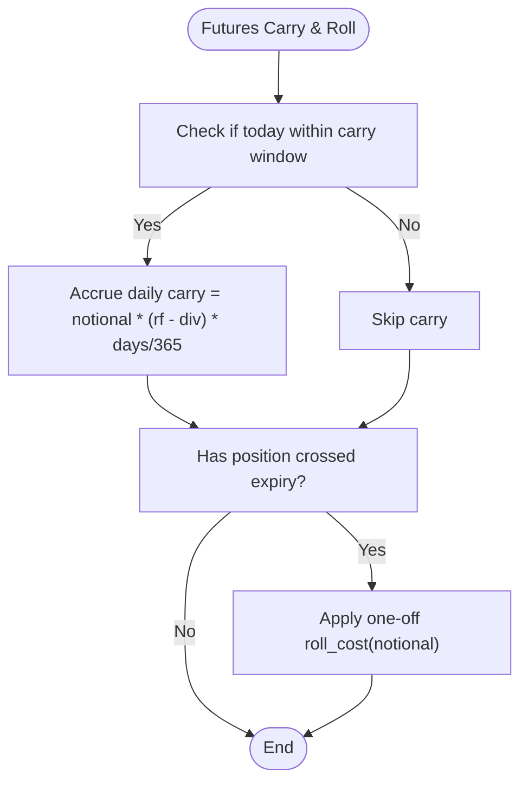
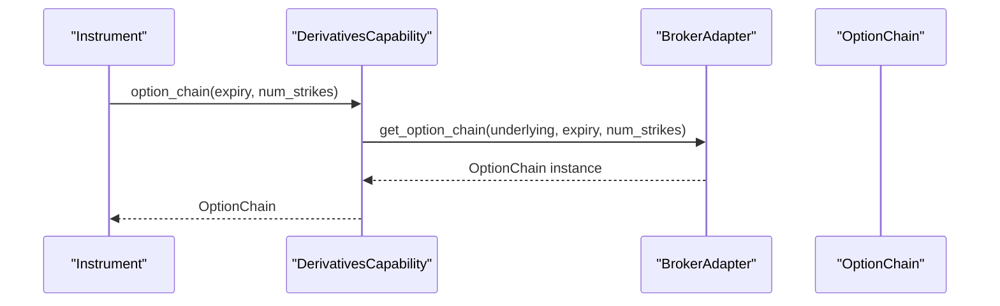
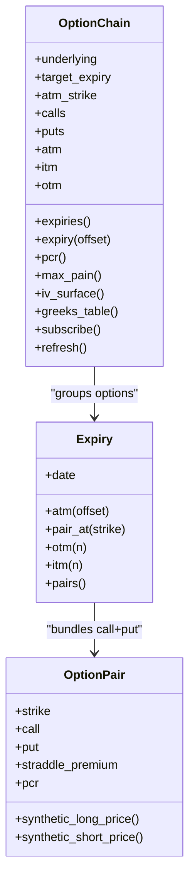
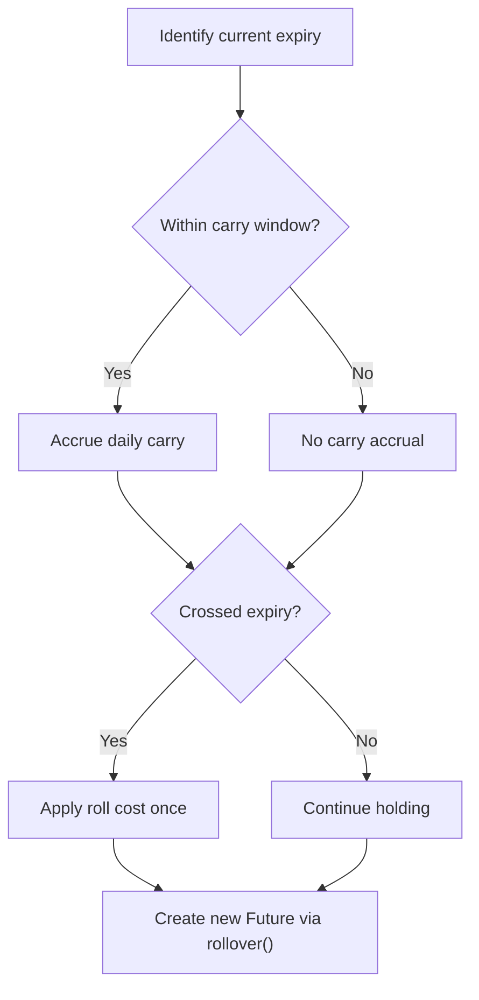
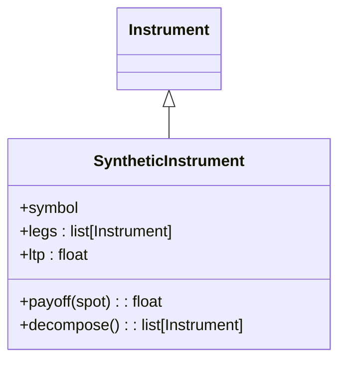
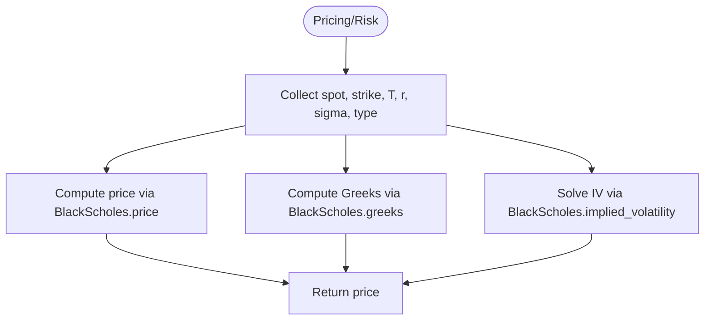
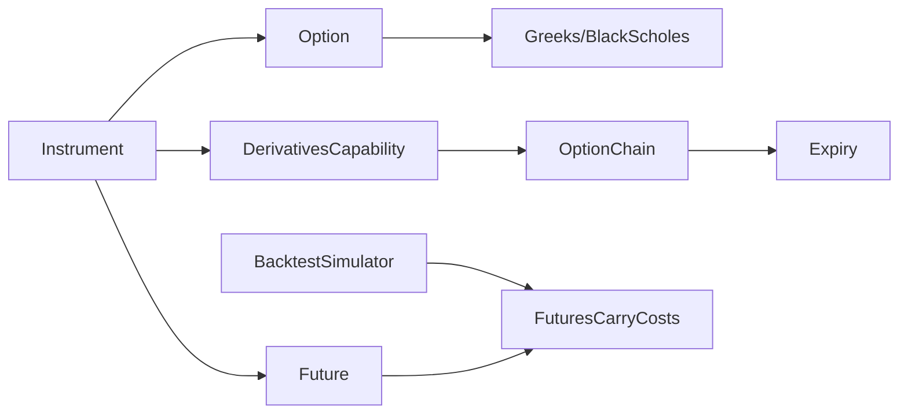

# Derivatives & Options

<cite>
**Referenced Files in This Document**
- [derivatives.py](file://ntrade/domain/instruments/derivatives.py)
- [capabilities.py](file://ntrade/domain/instruments/capabilities.py)
- [chain.py](file://ntrade/domain/instruments/chain.py)
- [expiry.py](file://ntrade/domain/instruments/expiry.py)
- [greeks.py](file://ntrade/domain/analytics/greeks.py)
- [surface.py](file://ntrade/domain/analytics/surface.py)
- [base.py](file://ntrade/domain/instruments/base.py)
- [costs.py](file://ntrade/execution/costs.py)
- [simulator.py](file://ntrade/backtest/simulator.py)
- [factories.py](file://ntrade/factories.py)
- [test_options_analytics.py](file://tests/test_options_analytics.py)
- [test_futures_carry_costs.py](file://tests/test_futures_carry_costs.py)
</cite>

## Table of Contents
1. Introduction
2. Project Structure
3. Core Components
4. Architecture Overview
5. Detailed Component Analysis
6. Dependency Analysis
7. Performance Considerations
8. Troubleshooting Guide
9. Conclusion
10. Appendices

## Introduction
This document explains how nTrade models and operates derivatives and options instruments. It covers futures contracts (underlying exposure, basis, carry costs, roll mechanics), options (calls/puts, strikes, expiries, chains), the DerivativesCapability class for analytics (Greeks, implied volatility, pricing), Option Chain management (navigation, moneyness, multi-strike analysis), expiry handling and rolling strategies, synthetic instrument creation via composite patterns, and lifecycle considerations such as assignment/exercise/expiration. Practical examples are included to demonstrate creating derivative instruments, navigating option chains, and implementing options strategies.

## Project Structure
The derivatives and options domain is implemented across a small set of cohesive modules:
- Instrument base and capabilities define the composition model and accessors.
- Derivative instruments (Future, Option, SyntheticInstrument) encapsulate product-specific logic.
- OptionChain and Expiry provide structured navigation over option universes.
- Greeks and Black-Scholes implement pricing and risk analytics.
- Execution costs model futures carry and roll behavior for backtesting.
- Factories simplify instrument creation.



**Diagram sources**
- [base.py](file://ntrade/domain/instruments/base.py)
- [derivatives.py](file://ntrade/domain/instruments/derivatives.py)
- [capabilities.py](file://ntrade/domain/instruments/capabilities.py)
- [chain.py](file://ntrade/domain/instruments/chain.py)
- [expiry.py](file://ntrade/domain/instruments/expiry.py)
- [greeks.py](file://ntrade/domain/analytics/greeks.py)
- [surface.py](file://ntrade/domain/analytics/surface.py)
- [costs.py](file://ntrade/execution/costs.py)
- [simulator.py](file://ntrade/backtest/simulator.py)

**Section sources**
- [base.py](file://ntrade/domain/instruments/base.py)
- [derivatives.py](file://ntrade/domain/instruments/derivatives.py)
- [capabilities.py](file://ntrade/domain/instruments/capabilities.py)
- [chain.py](file://ntrade/domain/instruments/chain.py)
- [expiry.py](file://ntrade/domain/instruments/expiry.py)
- [greeks.py](file://ntrade/domain/analytics/greeks.py)
- [surface.py](file://ntrade/domain/analytics/surface.py)
- [costs.py](file://ntrade/execution/costs.py)
- [simulator.py](file://ntrade/backtest/simulator.py)

## Core Components
- Futures: Underlying exposure with basis calculation, cost-of-carry estimation, roll-over helper, continuous series construction, and roll yield using linked next-month contract.
- Options: Call/put varieties with strike/expiry, intrinsic/extrinsic value, moneyness classification, Black-Scholes pricing, implied volatility solver, payoff/PnL helpers, and optional Greeks attachment.
- SyntheticInstrument: Composite pattern enabling complex strategies by summing leg prices/payoffs.
- DerivativesCapability: Provides option chain fetching through the underlying’s broker adapter.
- OptionChain: First-class composite of Option instruments with ATM selection, ITM/OTM filters, PCR/max pain, IV surface and Greeks table generation, and subscription support.
- Expiry and OptionPair: Date-based grouping and strike-pair views with ATM offset, OTM/ITM selection, and pair-level analytics (straddle premium, PCR, synthetic forward).
- Greeks and BlackScholes: Pure-math engine for price, greeks, and implied volatility.
- FuturesCarryCosts: Daily carry and one-off roll cost modeling for backtests.

**Section sources**
- [derivatives.py](file://ntrade/domain/instruments/derivatives.py)
- [capabilities.py](file://ntrade/domain/instruments/capabilities.py)
- [chain.py](file://ntrade/domain/instruments/chain.py)
- [expiry.py](file://ntrade/domain/instruments/expiry.py)
- [greeks.py](file://ntrade/domain/analytics/greeks.py)
- [surface.py](file://ntrade/domain/analytics/surface.py)
- [costs.py](file://ntrade/execution/costs.py)

## Architecture Overview
The system composes capabilities onto a common Instrument root. Derivatives extend this root with specialized behaviors. Option chains are fetched via the broker adapter exposed on the underlying instrument. Pricing and risk analytics are provided by a pure-math module that can be attached to options or used directly.



**Diagram sources**
- [base.py](file://ntrade/domain/instruments/base.py)
- [derivatives.py](file://ntrade/domain/instruments/derivatives.py)
- [capabilities.py](file://ntrade/domain/instruments/capabilities.py)
- [chain.py](file://ntrade/domain/instruments/chain.py)
- [expiry.py](file://ntrade/domain/instruments/expiry.py)
- [greeks.py](file://ntrade/domain/analytics/greeks.py)

## Detailed Component Analysis

### Futures Contracts
- Underlying exposure: Linked via set_underlying; basis computed as future LTP minus spot LTP.
- Cost of carry: Annualized estimate from basis and days-to-expiry.
- Roll mechanics: rollover creates a new Future for a target expiry; continuous builds a back-adjusted series; roll_yield uses linked next-month contract.
- Backtest integration: FuturesCarryCosts applies daily carry within a window and a one-off roll cost when crossing expiry.



**Diagram sources**
- [costs.py](file://ntrade/execution/costs.py)
- [simulator.py](file://ntrade/backtest/simulator.py)

**Section sources**
- [derivatives.py](file://ntrade/domain/instruments/derivatives.py)
- [costs.py](file://ntrade/execution/costs.py)
- [simulator.py](file://ntrade/backtest/simulator.py)
- [test_futures_carry_costs.py](file://tests/test_futures_carry_costs.py)

### Options Instruments
- Varieties: Calls (CE) and Puts (PE) with strike and expiry.
- Moneyness: ITM/ATM/OTM classification based on spot vs strike and type.
- Valuation: Intrinsic/extrinsic values; Black-Scholes price; implied volatility via bisection solver.
- Risk: Optional Greeks object; convenience properties for delta/gamma/theta/vega/rho.
- Payoff/PnL: Per-leg payoff and PnL accounting with lot size.

```mermaid
sequenceDiagram
participant User as "User Code"
participant Opt as "Option"
participant BS as "BlackScholes"
User->>Opt : black_scholes(spot, risk_free, sigma?)
Opt->>BS : price(spot, strike, years, risk_free, sigma, type)
BS-->>Opt : theoretical price
Opt-->>User : price rounded
User->>Opt : implied_volatility(market_price, spot, risk_free)
Opt->>BS : implied_volatility(market_price, spot, strike, years, risk_free, type)
BS-->>Opt : IV or None
Opt-->>User : IV rounded
```

**Diagram sources**
- [derivatives.py](file://ntrade/domain/instruments/derivatives.py)
- [greeks.py](file://ntrade/domain/analytics/greeks.py)

**Section sources**
- [derivatives.py](file://ntrade/domain/instruments/derivatives.py)
- [greeks.py](file://ntrade/domain/analytics/greeks.py)
- [test_options_analytics.py](file://tests/test_options_analytics.py)

### DerivativesCapability
- Purpose: Centralizes derivatives-related operations, notably option chain retrieval.
- Usage: instrument.derivatives.option_chain(expiry=..., num_strikes=...) returns an OptionChain built by the underlying’s broker adapter.



**Diagram sources**
- [capabilities.py](file://ntrade/domain/instruments/capabilities.py)
- [chain.py](file://ntrade/domain/instruments/chain.py)

**Section sources**
- [capabilities.py](file://ntrade/domain/instruments/capabilities.py)
- [chain.py](file://ntrade/domain/instruments/chain.py)

### Option Chain Management
- Construction: Built from broker-provided data; maintains strike map for O(1) lookup.
- Navigation: calls/puts lists; nearest expiry; ATM selection by explicit strike or nearest to LTP; ITM/OTM filters.
- Analytics: PCR, max pain, IV surface, Greeks table.
- Lifecycle: subscribe refreshes subscriptions across all options.



**Diagram sources**
- [chain.py](file://ntrade/domain/instruments/chain.py)
- [expiry.py](file://ntrade/domain/instruments/expiry.py)

**Section sources**
- [chain.py](file://ntrade/domain/instruments/chain.py)
- [expiry.py](file://ntrade/domain/instruments/expiry.py)
- [test_chain_navigation.py](file://tests/test_chain_navigation.py)

### Expiry Handling and Rolling Strategies
- Expiry grouping: Expiry aggregates options by date and provides ATM/ITM/OTM selection and pair views.
- Rolling: For futures, rollover constructs a new contract at a target expiry; backtest simulator enforces carry window and roll slippage.



**Diagram sources**
- [expiry.py](file://ntrade/domain/instruments/expiry.py)
- [derivatives.py](file://ntrade/domain/instruments/derivatives.py)
- [simulator.py](file://ntrade/backtest/simulator.py)
- [costs.py](file://ntrade/execution/costs.py)

**Section sources**
- [expiry.py](file://ntrade/domain/instruments/expiry.py)
- [derivatives.py](file://ntrade/domain/instruments/derivatives.py)
- [simulator.py](file://ntrade/backtest/simulator.py)
- [costs.py](file://ntrade/execution/costs.py)

### Synthetic Instruments and Complex Strategies
- Composite pattern: SyntheticInstrument sums leg prices and payoffs; decompose exposes constituent legs.
- Use cases: Straddles, strangles, spreads, and custom multi-leg strategies.



**Diagram sources**
- [derivatives.py](file://ntrade/domain/instruments/derivatives.py)

**Section sources**
- [derivatives.py](file://ntrade/domain/instruments/derivatives.py)
- [factories.py](file://ntrade/factories.py)

### Options Greeks, Implied Volatility, and Pricing Models
- Greeks: Dataclass with delta/gamma/theta/vega/rho/iv; computed via BlackScholes.greeks.
- Pricing: BlackScholes.price supports CE/PE with dividend and risk-free inputs.
- Implied Volatility: Bisection solver returns NOT_COMPUTED sentinel when no solution exists.



**Diagram sources**
- [greeks.py](file://ntrade/domain/analytics/greeks.py)

**Section sources**
- [greeks.py](file://ntrade/domain/analytics/greeks.py)
- [test_options_analytics.py](file://tests/test_options_analytics.py)

### Basis Trading Concepts and Futures Carry
- Basis: Difference between futures and spot; informs contango/backwardation.
- Cost of carry: Annualized rate implied by basis and time to expiry.
- Roll yield: Ratio of near vs next month prices indicates term structure effects.

**Section sources**
- [derivatives.py](file://ntrade/domain/instruments/derivatives.py)

### Options Lifecycle Management
- Exercise/Assignment: European-style exercise style supported; settlement can be cash or physical.
- Expiration: Expiry dates drive chain grouping and analytics; backtest simulator handles post-expiry roll logic for futures.

**Section sources**
- [derivatives.py](file://ntrade/domain/instruments/derivatives.py)
- [simulator.py](file://ntrade/backtest/simulator.py)

## Dependency Analysis
- Instrument base composes capabilities; derivatives extend Instrument.
- OptionChain depends on broker adapter to fetch live chains.
- Option relies on Greeks/BlackScholes for analytics.
- Backtest simulator integrates FuturesCarryCosts to adjust equity and track costs.



**Diagram sources**
- [base.py](file://ntrade/domain/instruments/base.py)
- [capabilities.py](file://ntrade/domain/instruments/capabilities.py)
- [chain.py](file://ntrade/domain/instruments/chain.py)
- [greeks.py](file://ntrade/domain/analytics/greeks.py)
- [costs.py](file://ntrade/execution/costs.py)
- [simulator.py](file://ntrade/backtest/simulator.py)

**Section sources**
- [base.py](file://ntrade/domain/instruments/base.py)
- [capabilities.py](file://ntrade/domain/instruments/capabilities.py)
- [chain.py](file://ntrade/domain/instruments/chain.py)
- [greeks.py](file://ntrade/domain/analytics/greeks.py)
- [costs.py](file://ntrade/execution/costs.py)
- [simulator.py](file://ntrade/backtest/simulator.py)

## Performance Considerations
- OptionChain strike map enables O(1) lookups by strike.
- Greeks and IV computations are pure math; avoid repeated recalculations by caching where appropriate.
- Continuous series normalization avoids seams but requires full history; use filtered ranges to limit computation.
- Futures carry accrual is bounded by a configurable window to prevent double-counting.

[No sources needed since this section provides general guidance]

## Troubleshooting Guide
- No broker adapter: OptionChain.fetch raises when underlying has no broker adapter; ensure broker is wired.
- Missing strikes: OptionChain.__getitem__ raises KeyError for absent strikes; verify chain content.
- Invalid option types: Option constructor validates CE/PE; ensure correct codes.
- IV solver sentinel: When market price is below intrinsic or parameters invalid, IV returns NOT_COMPUTED; validate inputs.
- Futures carry zero outside window: Ensure expiry and dates fall within carry_window_days to accrue costs.

**Section sources**
- [chain.py](file://ntrade/domain/instruments/chain.py)
- [derivatives.py](file://ntrade/domain/instruments/derivatives.py)
- [greeks.py](file://ntrade/domain/analytics/greeks.py)
- [costs.py](file://ntrade/execution/costs.py)

## Conclusion
nTrade’s derivatives and options framework provides a robust, composable architecture for modeling futures and options, navigating option chains, computing Greeks and implied volatility, and simulating realistic carry and roll behavior. The capability-based design keeps the API clean while exposing powerful analytics and execution hooks.

[No sources needed since this section summarizes without analyzing specific files]

## Appendices

### Examples and Usage Patterns
- Create a future and compute basis/carry:
  - See [derivatives.py](file://ntrade/domain/instruments/derivatives.py) for basis and cost_of_carry methods.
- Navigate an option chain:
  - See [chain.py](file://ntrade/domain/instruments/chain.py) for atm, itm, otm, pcr, max_pain, iv_surface, greeks_table.
- Compute Greeks and IV:
  - See [greeks.py](file://ntrade/domain/analytics/greeks.py) for BlackScholes functions and Greeks dataclass.
- Model futures carry and roll in backtests:
  - See [costs.py](file://ntrade/execution/costs.py) and [simulator.py](file://ntrade/backtest/simulator.py).
- Factory helpers:
  - See [factories.py](file://ntrade/factories.py) for convenient instrument creation.

**Section sources**
- [derivatives.py](file://ntrade/domain/instruments/derivatives.py)
- [chain.py](file://ntrade/domain/instruments/chain.py)
- [greeks.py](file://ntrade/domain/analytics/greeks.py)
- [costs.py](file://ntrade/execution/costs.py)
- [simulator.py](file://ntrade/backtest/simulator.py)
- [factories.py](file://ntrade/factories.py)
- [test_options_analytics.py](file://tests/test_options_analytics.py)
- [test_futures_carry_costs.py](file://tests/test_futures_carry_costs.py)