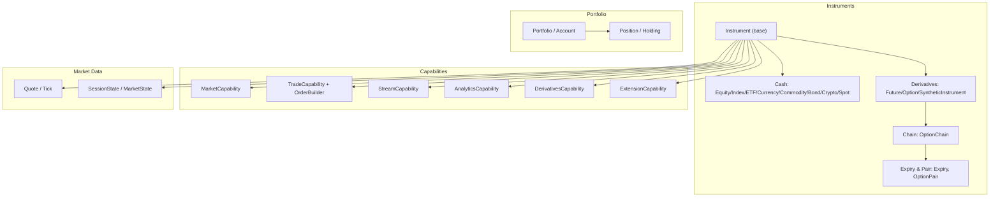
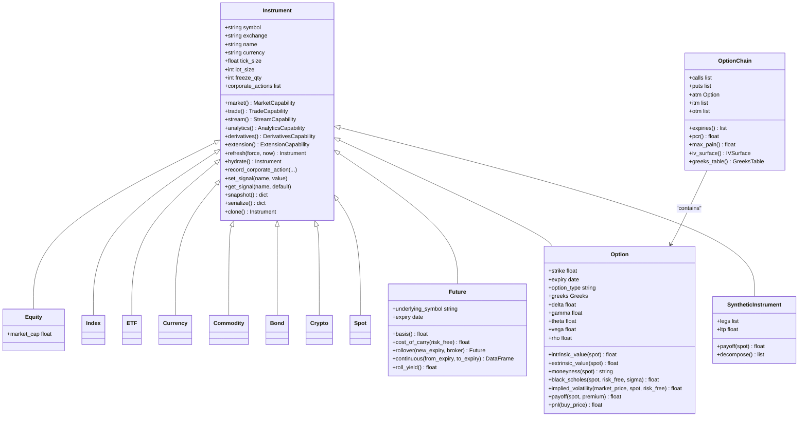
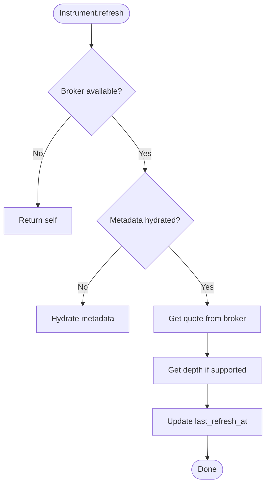
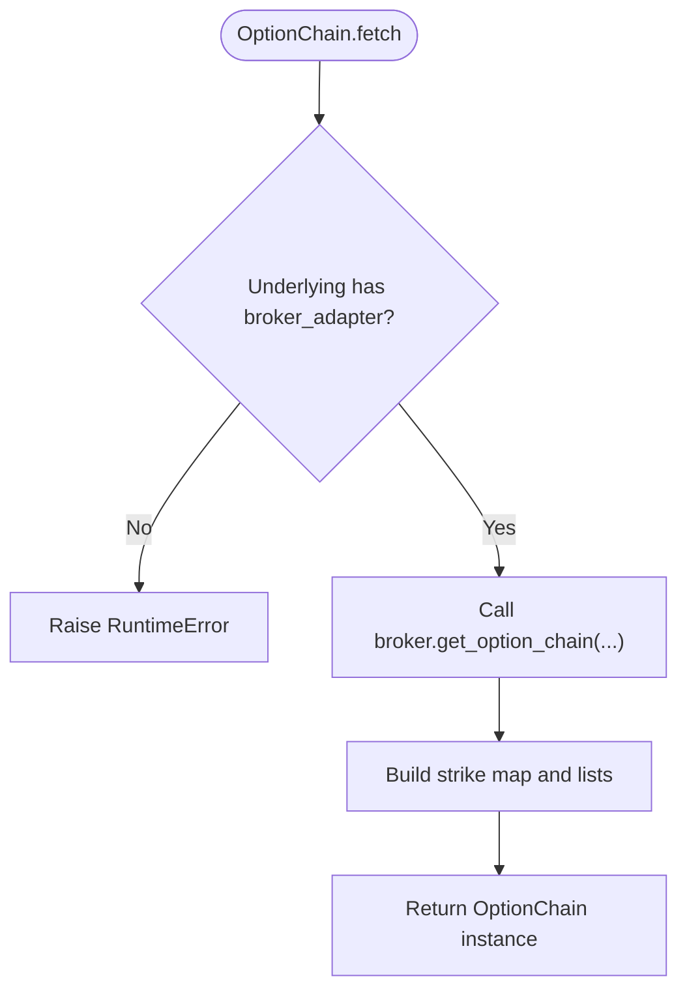
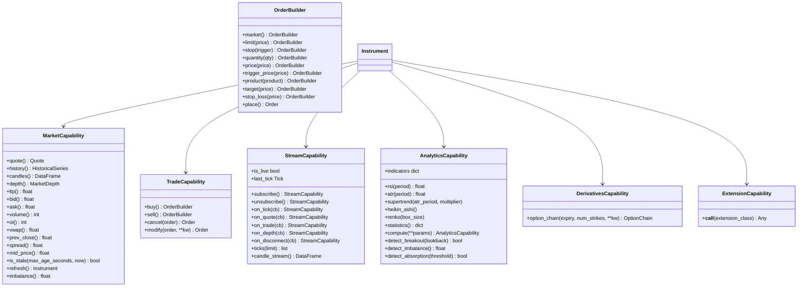
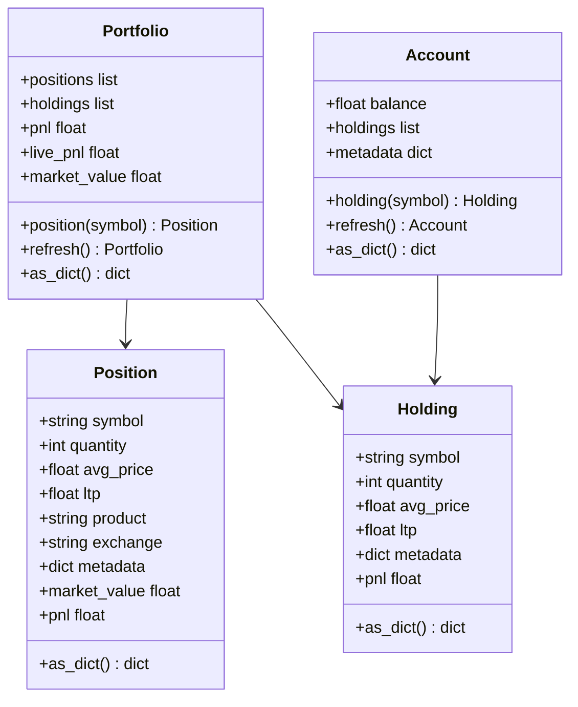
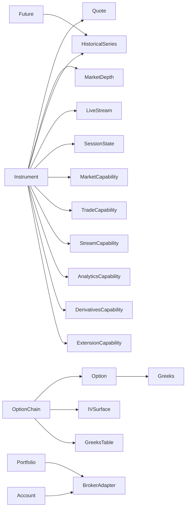

# Domain Model Hierarchy

<cite>
**Referenced Files in This Document**
- [__init__.py](file://ntrade/domain/instruments/__init__.py)
- [base.py](file://ntrade/domain/instruments/base.py)
- [cash.py](file://ntrade/domain/instruments/cash.py)
- [derivatives.py](file://ntrade/domain/instruments/derivatives.py)
- [capabilities.py](file://ntrade/domain/instruments/capabilities.py)
- [chain.py](file://ntrade/domain/instruments/chain.py)
- [expiry.py](file://ntrade/domain/instruments/expiry.py)
- [quote.py](file://ntrade/domain/market/quote.py)
- [session.py](file://ntrade/domain/session.py)
- [portfolio.py](file://ntrade/domain/portfolio.py)
- [test_instruments.py](file://tests/test_instruments.py)
- [test_domain_types.py](file://tests/test_domain_types.py)
</cite>

## Table of Contents
1. [Introduction](#introduction)
2. [Project Structure](#project-structure)
3. [Core Components](#core-components)
4. [Architecture Overview](#architecture-overview)
5. [Detailed Component Analysis](#detailed-component-analysis)
6. [Dependency Analysis](#dependency-analysis)
7. [Performance Considerations](#performance-considerations)
8. [Troubleshooting Guide](#troubleshooting-guide)
9. [Conclusion](#conclusion)
10. [Appendices](#appendices)

## Introduction
This document explains nTrade’s domain model hierarchy for financial instruments and related concepts. It covers the base Instrument class, asset-specific types (Equity, Index, ETF, Currency, Commodity, Bond, Crypto, Spot), derivatives (Futures and Options) with chain navigation, corporate actions, lifecycle management, Portfolio and Account models, capability-based extensions, validation rules, serialization patterns, and immutability practices used across the domain.

## Project Structure
The domain model is organized under ntrade/domain/instruments with supporting market data and session state types nearby. The module exposes a clean public API through its package init, re-exporting instrument classes, capabilities, and chain utilities.



**Diagram sources**
- [__init__.py:1-24](file://ntrade/domain/instruments/__init__.py#L1-L24)
- [base.py:50-151](file://ntrade/domain/instruments/base.py#L50-L151)
- [cash.py:8-50](file://ntrade/domain/instruments/cash.py#L8-L50)
- [derivatives.py:16-245](file://ntrade/domain/instruments/derivatives.py#L16-L245)
- [capabilities.py:37-383](file://ntrade/domain/instruments/capabilities.py#L37-L383)
- [chain.py:19-202](file://ntrade/domain/instruments/chain.py#L19-L202)
- [expiry.py:18-171](file://ntrade/domain/instruments/expiry.py#L18-L171)
- [quote.py:9-91](file://ntrade/domain/market/quote.py#L9-L91)
- [session.py:10-46](file://ntrade/domain/session.py#L10-L46)
- [portfolio.py:19-173](file://ntrade/domain/portfolio.py#L19-L173)

**Section sources**
- [__init__.py:1-24](file://ntrade/domain/instruments/__init__.py#L1-L24)

## Core Components
- Instrument: Abstract root holding symbol, exchange, metadata, quote, depth, history, stream, indicators, signals, tags, annotations, session state, and broker wiring. Provides capabilities via cached properties and lifecycle methods like refresh/hydrate.
- Cash Instruments: Equity, Index, ETF, Currency, Commodity, Bond, Crypto, Spot — lightweight subclasses that set KIND and default exchanges; Equity adds market_cap from metadata.
- Derivatives: Future (basis, cost_of_carry, rollover, continuous series, roll yield), Option (greeks, intrinsic/extrinsic value, moneyness, Black-Scholes pricing, implied volatility, payoff/P&L), SyntheticInstrument (composite legs).
- Option Chain: Composite over Option instruments with ATM/ITM/OTM selection, strike indexing, expiries, pairs, PCR, max pain, IV surface, Greeks table, and subscription.
- Capabilities: MarketCapability (read-only market view), TradeCapability with fluent OrderBuilder, StreamCapability (live subscriptions), AnalyticsCapability (indicators and pattern detection), DerivativesCapability (option chain access), ExtensionCapability (broker-specific features).
- Market Data: Quote and Tick are immutable value objects owned by instruments.
- Session State: MarketState enum and SessionState track instrument-level market session transitions.
- Portfolio and Account: Position/Holding value objects with P&L calculations; Portfolio aggregates positions and holdings, supports live P&L via broker; Account holds balance and holdings.

**Section sources**
- [base.py:50-305](file://ntrade/domain/instruments/base.py#L50-L305)
- [cash.py:8-50](file://ntrade/domain/instruments/cash.py#L8-L50)
- [derivatives.py:16-245](file://ntrade/domain/instruments/derivatives.py#L16-L245)
- [capabilities.py:37-383](file://ntrade/domain/instruments/capabilities.py#L37-L383)
- [chain.py:19-202](file://ntrade/domain/instruments/chain.py#L19-L202)
- [expiry.py:18-171](file://ntrade/domain/instruments/expiry.py#L18-L171)
- [quote.py:9-91](file://ntrade/domain/market/quote.py#L9-L91)
- [session.py:10-46](file://ntrade/domain/session.py#L10-L46)
- [portfolio.py:19-173](file://ntrade/domain/portfolio.py#L19-L173)

## Architecture Overview
The Instrument acts as a composition root. Instead of exposing many methods directly, it delegates to six capability objects. Broker transport is hidden behind a BrokerAdapter injected at construction or lazily created via a factory. Corporate actions, signals, and session state are part of the instrument’s internal read model.



**Diagram sources**
- [base.py:50-151](file://ntrade/domain/instruments/base.py#L50-L151)
- [cash.py:8-50](file://ntrade/domain/instruments/cash.py#L8-L50)
- [derivatives.py:16-245](file://ntrade/domain/instruments/derivatives.py#L16-L245)
- [chain.py:19-202](file://ntrade/domain/instruments/chain.py#L19-L202)

## Detailed Component Analysis

### Base Instrument
- Responsibilities: Owns identity (symbol, exchange, name, currency), trading parameters (tick/lot/freeze), internal state (quote, depth, history, stream, indicators, signals, annotations, tags), session state, and broker wiring.
- Lifecycle: refresh pulls latest quote/depth via broker adapter; hydrate fetches metadata once; set_market_status updates session state.
- Corporate Actions: record_corporate_action appends typed action records; clear_corporate_actions resets them.
- Serialization: snapshot returns a stable dict representation; serialize delegates to snapshot.
- Immutability patterns: Quote is immutable; instrument uses replace-like updates on quote internally; clone creates independent copies.



**Diagram sources**
- [base.py:169-209](file://ntrade/domain/instruments/base.py#L169-L209)

**Section sources**
- [base.py:50-305](file://ntrade/domain/instruments/base.py#L50-L305)

### Cash Instruments
- Equity: Adds market_cap from metadata.
- Index/ETF/Currency/Commodity/Bond/Crypto/Spot: Set KIND and DEFAULT_EXCHANGE per asset class.

**Section sources**
- [cash.py:8-50](file://ntrade/domain/instruments/cash.py#L8-L50)

### Derivatives: Futures and Options
- Future:
  - Links underlying and neighboring contracts (front_month, next_month).
  - Computes basis, cost_of_carry, roll yield, and builds continuous series via proportional back-adjustment.
  - Supports rollover to new expiry.
- Option:
  - Validates option_type (CE/PE).
  - Provides greeks accessor (returns zero-filled object when unset), intrinsic/extrinsic values, moneyness, Black-Scholes price, implied volatility, payoff, and P&L.
- SyntheticInstrument:
  - Aggregates legs, computes composite LTP and payoff, decomposes into legs.

```mermaid
sequenceDiagram
participant User as "User Code"
participant Opt as "Option"
participant BS as "BlackScholes"
User->>Opt : black_scholes(spot, risk_free, sigma)
Opt->>Opt : _years_to_expiry()
Opt->>BS : price(spot, strike, t, risk_free, sigma, type)
BS-->>Opt : theoretical price
Opt-->>User : price
```

**Diagram sources**
- [derivatives.py:200-209](file://ntrade/domain/instruments/derivatives.py#L200-L209)

**Section sources**
- [derivatives.py:16-245](file://ntrade/domain/instruments/derivatives.py#L16-L245)

### Option Chain Navigation
- OptionChain:
  - Built via fetch from underlying’s broker adapter.
  - Provides calls/puts lists, expiries, nearest expiry, strikes, ATM/ITM/OTM selection, PCR, max pain, IV surface, Greeks table, and subscription helpers.
- Expiry and OptionPair:
  - Group options by expiry; provide ATM pair selection, ITM/OTM interleaved lists, and derived metrics (straddle premium, PCR, synthetic prices).



**Diagram sources**
- [chain.py:56-63](file://ntrade/domain/instruments/chain.py#L56-L63)

**Section sources**
- [chain.py:19-202](file://ntrade/domain/instruments/chain.py#L19-L202)
- [expiry.py:18-171](file://ntrade/domain/instruments/expiry.py#L18-L171)

### Capability-Based Extensions
- MarketCapability: Read-only access to quote, depth, history, candles, and scalar fields (ltp, bid, ask, volume, oi, vwap, prev_close, spread, mid_price); staleness checks; refresh.
- TradeCapability + OrderBuilder: Fluent order entry (buy/sell) with market/limit/stop types, quantity, price, trigger, product, target/stop-loss legs; place delegates to OrderFacade.
- StreamCapability: Subscribe/unsubscribe, event hooks (tick, quote, trade, depth, disconnect), ticks buffer, live candle stream, live status.
- AnalyticsCapability: Indicators (RSI, ATR), series analytics (supertrend, Heikin-Ashi, Renko), statistics, bulk compute bundle, pattern detection (breakout, imbalance, absorption).
- DerivativesCapability: Access to option chains via derivatives.option_chain().
- ExtensionCapability: Class-based resolution of provider-specific extensions through BrokerExtensionFacade.



**Diagram sources**
- [capabilities.py:37-383](file://ntrade/domain/instruments/capabilities.py#L37-L383)

**Section sources**
- [capabilities.py:37-383](file://ntrade/domain/instruments/capabilities.py#L37-L383)

### Corporate Actions and Lifecycle
- CorporateAction: Typed record for dividend/split/bonus/merger with amount, ratio, ex_date, record_date, description.
- Lifecycle: refresh/hydrate manage metadata and quote updates; set_market_status updates SessionState; clone provides independent copies; snapshot/serialize produce stable representations.

**Section sources**
- [base.py:38-94](file://ntrade/domain/instruments/base.py#L38-L94)
- [base.py:169-234](file://ntrade/domain/instruments/base.py#L169-L234)
- [base.py:253-283](file://ntrade/domain/instruments/base.py#L253-L283)

### Portfolio and Account Models
- Position: Tracks symbol, quantity, avg_price, ltp, product, exchange; computes market_value and pnl.
- Holding: Similar to Position but for cash holdings; includes pnl and as_dict.
- Portfolio: Aggregates positions and holdings; provides symbol alias, total pnl, live_pnl via broker, market_value, position lookup, refresh, iteration, and dict serialization.
- Account: Holds balance and holdings; supports refresh from broker and dict serialization.



**Diagram sources**
- [portfolio.py:19-173](file://ntrade/domain/portfolio.py#L19-L173)

**Section sources**
- [portfolio.py:19-173](file://ntrade/domain/portfolio.py#L19-L173)

### Validation Rules
- Option requires valid option_type ("CE" or "PE"); invalid values raise ValueError.
- Other validations include staleness checks on Quote and empty chain handling in OptionChain.

**Section sources**
- [derivatives.py:126-131](file://ntrade/domain/instruments/derivatives.py#L126-L131)
- [quote.py:59-63](file://ntrade/domain/market/quote.py#L59-L63)
- [chain.py:56-63](file://ntrade/domain/instruments/chain.py#L56-L63)

### Serialization and Immutability Patterns
- Quote and Tick are frozen dataclasses; updates use replace semantics (with_update).
- Instrument.snapshot/serialize produce stable dicts; clone creates independent copies.
- OrderBook/TradeBook entries are frozen dataclasses ensuring immutability across boundaries.

**Section sources**
- [quote.py:9-91](file://ntrade/domain/market/quote.py#L9-L91)
- [base.py:253-283](file://ntrade/domain/instruments/base.py#L253-L283)
- [base.py:264-270](file://ntrade/domain/instruments/base.py#L264-L270)

## Dependency Analysis
- Instrument depends on market data types (Quote, MarketDepth, HistoricalSeries, LiveStream) and session state.
- Capabilities depend on Instrument internals but remain stateless views.
- Derivatives depend on analytics modules (Greeks, Black-Scholes) and pandas for series operations.
- OptionChain depends on broker adapter for fetching chains and on analytics surfaces for IV/Greeks tables.
- Portfolio/Account depend on BrokerAdapter for snapshots and live P&L.



**Diagram sources**
- [base.py:18-35](file://ntrade/domain/instruments/base.py#L18-L35)
- [capabilities.py:37-383](file://ntrade/domain/instruments/capabilities.py#L37-L383)
- [derivatives.py:16-245](file://ntrade/domain/instruments/derivatives.py#L16-L245)
- [chain.py:19-202](file://ntrade/domain/instruments/chain.py#L19-L202)
- [portfolio.py:63-173](file://ntrade/domain/portfolio.py#L63-L173)

**Section sources**
- [base.py:18-35](file://ntrade/domain/instruments/base.py#L18-L35)
- [capabilities.py:37-383](file://ntrade/domain/instruments/capabilities.py#L37-L383)
- [derivatives.py:16-245](file://ntrade/domain/instruments/derivatives.py#L16-L245)
- [chain.py:19-202](file://ntrade/domain/instruments/chain.py#L19-L202)
- [portfolio.py:63-173](file://ntrade/domain/portfolio.py#L63-L173)

## Performance Considerations
- Cached properties for capabilities reduce repeated instantiation overhead.
- Quote staleness checks avoid unnecessary network calls.
- History caching per timeframe prevents redundant downloads.
- OptionChain strike map enables O(1) lookups.
- Continuous futures series uses simple proportional back-adjustment for efficiency.

[No sources needed since this section provides general guidance]

## Troubleshooting Guide
- No broker adapter: OptionChain.fetch raises RuntimeError if underlying has no broker adapter.
- Invalid option type: Option constructor raises ValueError for unsupported option_type.
- Stale quotes: Quote.is_stale helps detect outdated data; ensure refresh is called before relying on stale-free assumptions.
- Missing chain data: Ensure broker supports get_option_chain and returns expected structure.

**Section sources**
- [chain.py:56-63](file://ntrade/domain/instruments/chain.py#L56-L63)
- [derivatives.py:126-131](file://ntrade/domain/instruments/derivatives.py#L126-L131)
- [quote.py:59-63](file://ntrade/domain/market/quote.py#L59-L63)

## Conclusion
nTrade’s domain model centers on a robust Instrument base with capability-driven behavior, rich derivatives support, and clear separation between state and read-only views. The design emphasizes immutability, validation, and extensibility, enabling consistent instrument creation, property access, type checking, and portfolio management across brokers and strategies.

[No sources needed since this section summarizes without analyzing specific files]

## Appendices

### Examples of Usage Patterns
- Instrument creation and property access:
  - Create an Equity/Index and access symbol, exchange, kind, and market data via instrument.market.ltp(), etc.
  - Validate defaults for Index and Commodity exchanges.
- Type checking:
  - Verify KIND values for different instrument subclasses.
- Option validation:
  - Passing invalid option_type raises ValueError.
- Future basis calculation:
  - Link underlying and compute basis using LTP values.

**Section sources**
- [test_instruments.py:11-165](file://tests/test_instruments.py#L11-L165)
- [test_domain_types.py:215-239](file://tests/test_domain_types.py#L215-L239)