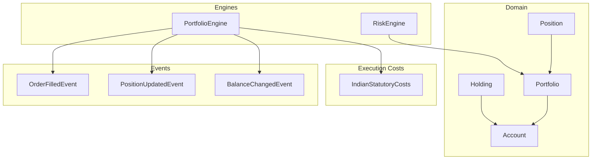
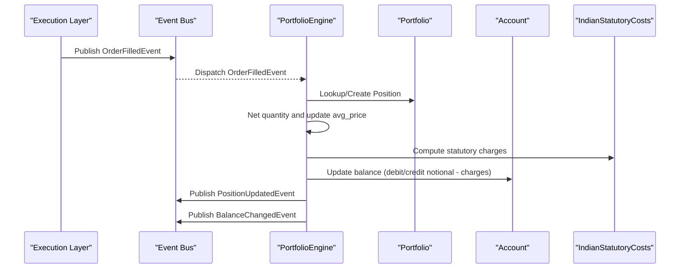
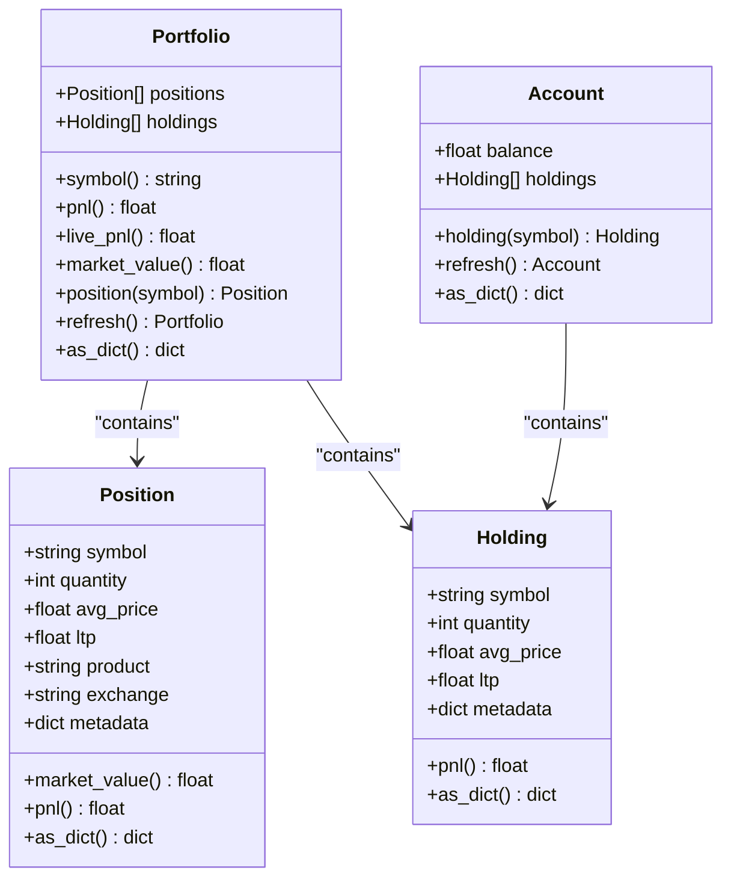
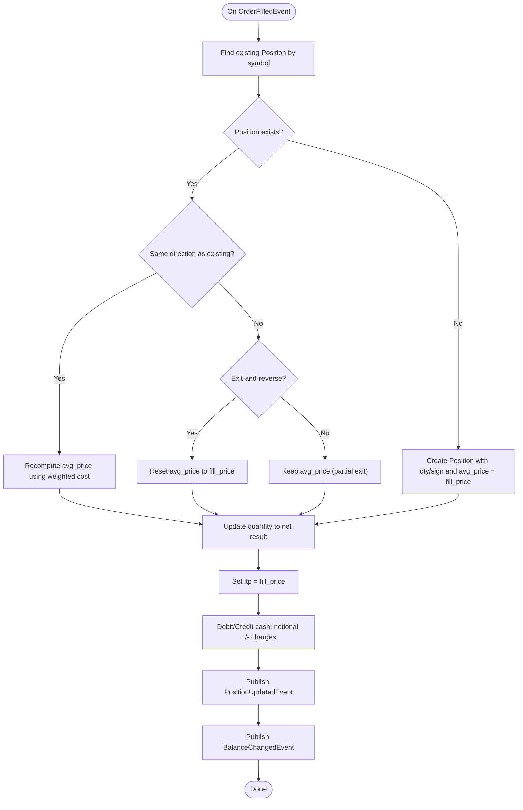
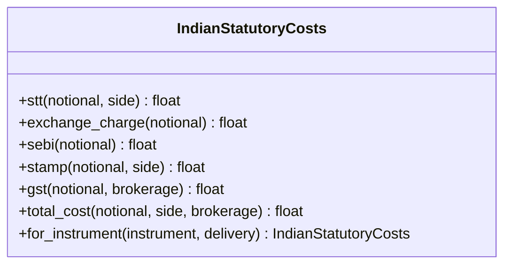
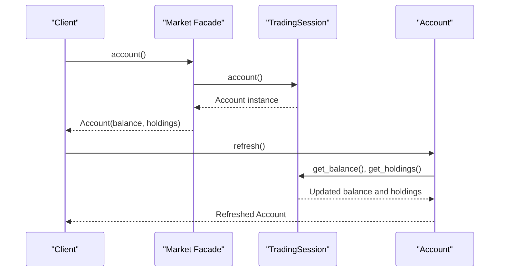
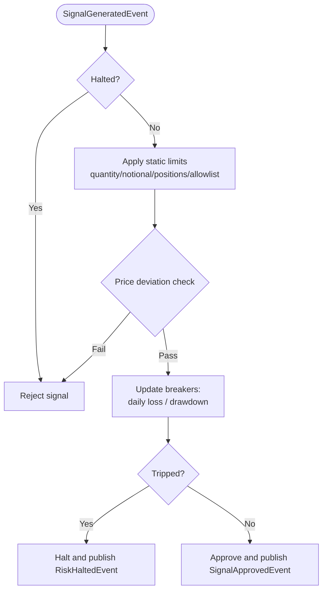
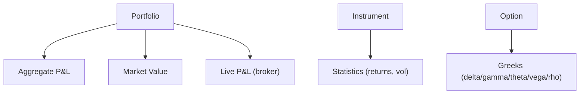
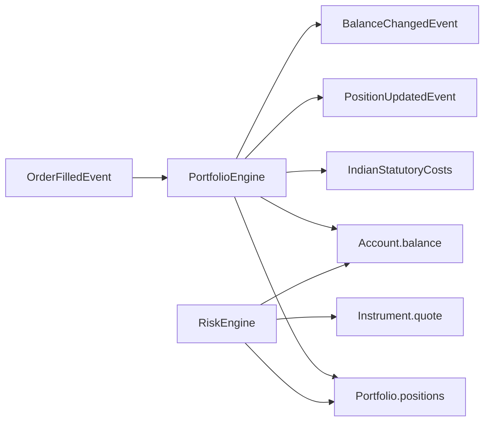

# Portfolio & Position Management

<cite>
**Referenced Files in This Document**
- [portfolio.py](file://ntrade/domain/portfolio.py)
- [portfolio_engine.py](file://ntrade/engines/portfolio_engine.py)
- [portfolio_events.py](file://ntrade/events/portfolio.py)
- [order_events.py](file://ntrade/events/order.py)
- [costs.py](file://ntrade/execution/costs.py)
- [risk_engine.py](file://ntrade/engines/risk_engine.py)
- [facade.py](file://ntrade/facade.py)
- [test_portfolio_account.py](file://tests/test_portfolio_account.py)
- [test_portfolio_exit_cost.py](file://tests/test_portfolio_exit_cost.py)
</cite>

## Table of Contents
1. Introduction
2. Project Structure
3. Core Components
4. Architecture Overview
5. Detailed Component Analysis
6. Dependency Analysis
7. Performance Considerations
8. Troubleshooting Guide
9. Conclusion

## Introduction
This document explains the portfolio and position management domain in nTrade, focusing on how positions are tracked, aggregated at the account level, and updated in response to fills. It covers P&L calculations (realized and unrealized), cost basis management, cash flow updates, risk controls, and analytics touchpoints. The goal is to provide a clear mental model for both developers and non-technical readers.

## Project Structure
The portfolio and position system spans three layers:
- Domain models: Position, Holding, Portfolio, Account
- Event-driven engine: PortfolioEngine that reacts to OrderFilledEvent
- Execution costs: statutory charges and slippage/commission models used by execution to compute realized costs

**Diagram sources**
- [portfolio.py:1-173](file://ntrade/domain/portfolio.py#L1-L173)
- [portfolio_engine.py:1-69](file://ntrade/engines/portfolio_engine.py#L1-L69)
- [portfolio_events.py:1-27](file://ntrade/events/portfolio.py#L1-L27)
- [order_events.py:1-91](file://ntrade/events/order.py#L1-L91)
- [costs.py:1-285](file://ntrade/execution/costs.py#L1-L285)
- [risk_engine.py:1-141](file://ntrade/engines/risk_engine.py#L1-L141)

**Section sources**
- [portfolio.py:1-173](file://ntrade/domain/portfolio.py#L1-L173)
- [portfolio_engine.py:1-69](file://ntrade/engines/portfolio_engine.py#L1-L69)
- [portfolio_events.py:1-27](file://ntrade/events/portfolio.py#L1-L27)
- [order_events.py:1-91](file://ntrade/events/order.py#L1-L91)
- [costs.py:1-285](file://ntrade/execution/costs.py#L1-L285)
- [risk_engine.py:1-141](file://ntrade/engines/risk_engine.py#L1-L141)

## Core Components
- Position: Tracks symbol, quantity, average entry price, last traded price, product/exchange metadata; exposes market value and P&L.
- Holding: Similar to Position but represents long holdings with P&L and serialization helpers.
- Portfolio: Aggregates positions and holdings; computes aggregate P&L and market value; supports broker-backed refresh and live P&L fallback.
- Account: Holds balance and holdings; supports broker-backed refresh and lookup.
- PortfolioEngine: Subscribes to OrderFilledEvent; nets quantities, re-averages entry prices, debits/credits cash including statutory charges, and publishes PositionUpdatedEvent and BalanceChangedEvent.
- RiskEngine: Computes session equity (cash + mark-to-market), enforces static limits and circuit breakers (daily loss, drawdown, price deviation).

Key behaviors:
- Realized P&L is reflected via cash changes after each fill (notional +/- charges).
- Unrealized P&L is derived from current LTP vs average entry price per position.
- Partial exits preserve the original average price; exit-and-reverse resets the average price to the new side’s entry.

**Section sources**
- [portfolio.py:19-135](file://ntrade/domain/portfolio.py#L19-L135)
- [portfolio_engine.py:15-69](file://ntrade/engines/portfolio_engine.py#L15-L69)
- [risk_engine.py:19-141](file://ntrade/engines/risk_engine.py#L19-L141)

## Architecture Overview
The system is event-driven. When an order fills, the PortfolioEngine updates the read models (positions and cash) and emits events consumed by other components (e.g., UI, risk, reporting).

**Diagram sources**
- [portfolio_engine.py:15-69](file://ntrade/engines/portfolio_engine.py#L15-L69)
- [order_events.py:49-64](file://ntrade/events/order.py#L49-L64)
- [portfolio_events.py:11-27](file://ntrade/events/portfolio.py#L11-L27)
- [costs.py:164-174](file://ntrade/execution/costs.py#L164-L174)

## Detailed Component Analysis

### Portfolio and Position Data Model
- Position fields include symbol, quantity, avg_price, ltp, product, exchange, and metadata. Market value equals quantity times ltp; P&L equals (ltp - avg_price) times quantity.
- Portfolio aggregates positions and holdings, provides convenience methods to find a position by symbol, iterate, and serialize state. It also offers live P&L via broker if available.
- Account holds balance and holdings, with broker-backed refresh capabilities.

**Diagram sources**
- [portfolio.py:19-135](file://ntrade/domain/portfolio.py#L19-L135)

**Section sources**
- [portfolio.py:19-135](file://ntrade/domain/portfolio.py#L19-L135)
- [test_portfolio_account.py:9-56](file://tests/test_portfolio_account.py#L9-L56)

### Position Lifecycle and Fill Processing
- On OrderFilledEvent, the engine creates a new Position if none exists or updates an existing one.
- Quantity netting rules:
  - Same direction: average price is reweighted by total cost over new quantity.
  - Exit-and-reverse: residual becomes a fresh opposite-side position with entry price set to the fill price.
  - Partial exit: keeps the original average price.
- Cash updates:
  - BUY: debit notional plus charges.
  - SELL: credit notional minus charges.
- Events published:
  - PositionUpdatedEvent with symbol, exchange, quantity, avg_price, ltp.
  - BalanceChangedEvent with updated balance.

**Diagram sources**
- [portfolio_engine.py:20-69](file://ntrade/engines/portfolio_engine.py#L20-L69)
- [order_events.py:49-64](file://ntrade/events/order.py#L49-L64)
- [portfolio_events.py:11-27](file://ntrade/events/portfolio.py#L11-L27)

**Section sources**
- [portfolio_engine.py:15-69](file://ntrade/engines/portfolio_engine.py#L15-L69)
- [test_portfolio_exit_cost.py:21-47](file://tests/test_portfolio_exit_cost.py#L21-L47)

### Cost Basis and Statutory Charges
- Statutory costs include STT, exchange transaction charges, SEBI fee, GST on brokerage, and stamp duty. These are computed per leg and deducted from cash on every fill to ensure backtest/live parity.
- IndianStatutoryCosts provides methods for STT, exchange charge, SEBI fee, stamp duty, GST, and total cost aggregation. It adapts rates based on product type (equity/futures/options) and delivery/intraday flags.
- Commission and slippage models are pluggable; statutory costs are additive and configurable.

**Diagram sources**
- [costs.py:70-204](file://ntrade/execution/costs.py#L70-L204)

**Section sources**
- [costs.py:70-204](file://ntrade/execution/costs.py#L70-L204)

### Account Management and Cash Flow
- Account tracks balance and holdings; can be refreshed from a broker adapter.
- Cash flows occur on fills:
  - BUY reduces cash by notional plus charges.
  - SELL increases cash by notional minus charges.
- Additional cash movements (deposits/withdrawals) would follow the same pattern: update balance and publish BalanceChangedEvent. In this codebase, explicit deposit/withdrawal handlers are not present in the analyzed files; the mechanism is consistent with the event-driven approach.

**Diagram sources**
- [facade.py:80-86](file://ntrade/facade.py#L80-L86)
- [portfolio.py:137-173](file://ntrade/domain/portfolio.py#L137-L173)

**Section sources**
- [facade.py:80-86](file://ntrade/facade.py#L80-L86)
- [portfolio.py:137-173](file://ntrade/domain/portfolio.py#L137-L173)

### Risk Controls and Equity Calculation
- RiskEngine computes session equity as cash balance plus open-position mark-to-market (sum of position market values).
- Circuit breakers:
  - Max daily loss: halts trading when equity drops below start balance by configured threshold.
  - Max drawdown: halts when peak equity to current equity exceeds threshold.
  - Price deviation guard: rejects orders deviating beyond configured percentage from reference price.
  - Static limits: max quantity, notional, position count, allowlist.

**Diagram sources**
- [risk_engine.py:19-141](file://ntrade/engines/risk_engine.py#L19-L141)

**Section sources**
- [risk_engine.py:19-141](file://ntrade/engines/risk_engine.py#L19-L141)

### Analytics and Performance Metrics
- Portfolio-level metrics:
  - Aggregate P&L: sum of individual position P&L.
  - Market value: sum of position market values.
  - Live P&L: broker-reported combined realized/unrealized when available; otherwise falls back to computed P&L.
- Instrument-level statistics (via analytics capability) include return, volatility, min/max/mean, useful for performance attribution and exposure analysis.
- Greeks and Black-Scholes support options analytics (delta, gamma, theta, vega, rho, implied volatility), enabling risk-aware position sizing and hedging strategies.

**Diagram sources**
- [portfolio.py:63-135](file://ntrade/domain/portfolio.py#L63-L135)
- [greeks.py:1-120](file://ntrade/domain/analytics/greeks.py#L1-L120)

**Section sources**
- [portfolio.py:63-135](file://ntrade/domain/portfolio.py#L63-L135)
- [greeks.py:1-120](file://ntrade/domain/analytics/greeks.py#L1-L120)

## Dependency Analysis
- PortfolioEngine depends on:
  - OrderFilledEvent for input signals.
  - Portfolio and Account read models for state updates.
  - IndianStatutoryCosts for accurate realized cost computation.
  - Event bus to publish PositionUpdatedEvent and BalanceChangedEvent.
- RiskEngine depends on:
  - Portfolio for mark-to-market calculation.
  - Account for cash balance.
  - Instrument quote/reference price for deviation checks.

**Diagram sources**
- [portfolio_engine.py:15-69](file://ntrade/engines/portfolio_engine.py#L15-L69)
- [order_events.py:49-64](file://ntrade/events/order.py#L49-L64)
- [portfolio_events.py:11-27](file://ntrade/events/portfolio.py#L11-L27)
- [costs.py:164-174](file://ntrade/execution/costs.py#L164-L174)
- [risk_engine.py:44-141](file://ntrade/engines/risk_engine.py#L44-L141)

**Section sources**
- [portfolio_engine.py:15-69](file://ntrade/engines/portfolio_engine.py#L15-L69)
- [risk_engine.py:19-141](file://ntrade/engines/risk_engine.py#L19-L141)

## Performance Considerations
- P&L computations are O(n) across positions; keep position lists bounded by strategy or symbol filters where possible.
- Broker refresh operations should be throttled; use cached snapshots and avoid excessive polling.
- Statutory cost calculations are additive and constant-time per fill; ensure correct product/delivery flags to avoid mispricing.
- Risk checks run per signal; batch heavy computations outside hot paths.

[No sources needed since this section provides general guidance]

## Troubleshooting Guide
Common issues and resolutions:
- Position not found: Ensure symbol matches exactly; verify case and exchange. Use Portfolio.position(symbol) before accessing.
- Unexpected average price after partial exit: Partial exits preserve the original average price; only exit-and-reverse resets it.
- Cash discrepancies: Verify statutory charges and commission applied per leg; confirm BUY debits and SELL credits are correctly applied.
- Risk halts: Review daily loss and drawdown thresholds; check peak equity tracking and start balance initialization.

**Section sources**
- [test_portfolio_exit_cost.py:21-47](file://tests/test_portfolio_exit_cost.py#L21-L47)
- [portfolio_engine.py:20-69](file://ntrade/engines/portfolio_engine.py#L20-L69)
- [risk_engine.py:113-141](file://ntrade/engines/risk_engine.py#L113-L141)

## Conclusion
nTrade’s portfolio and position management combines simple, robust data structures with an event-driven engine to maintain accurate real-time state. Positions track cost basis and unrealized P&L, while cash reflects realized outcomes including statutory charges. Risk controls safeguard capital through dynamic circuit breakers. Analytics and Greeks enable deeper performance attribution and risk-aware strategies. Together, these components deliver a reliable foundation for portfolio creation, monitoring, and reporting.