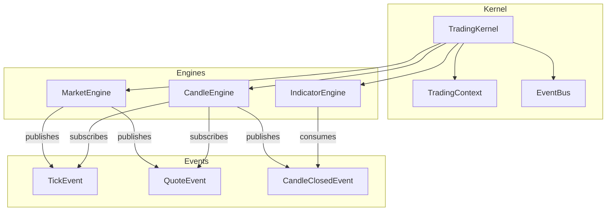
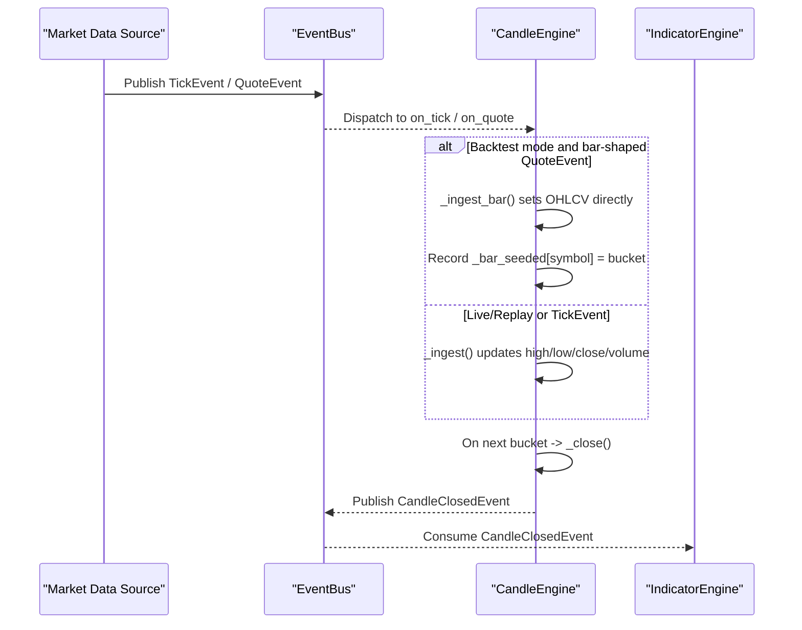
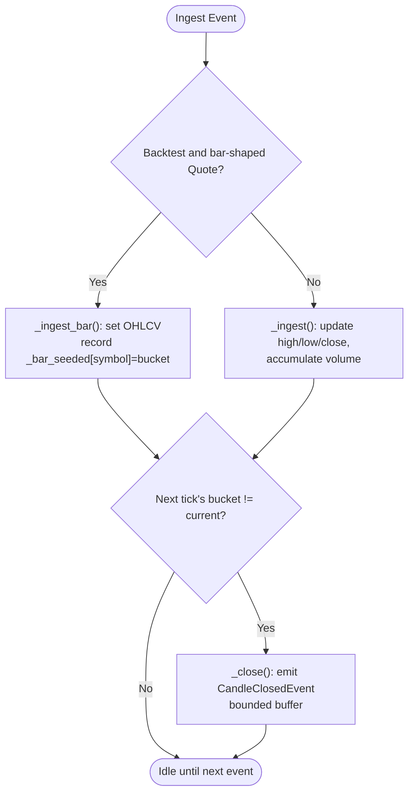
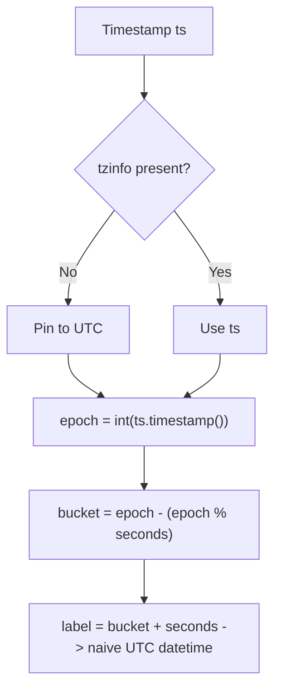
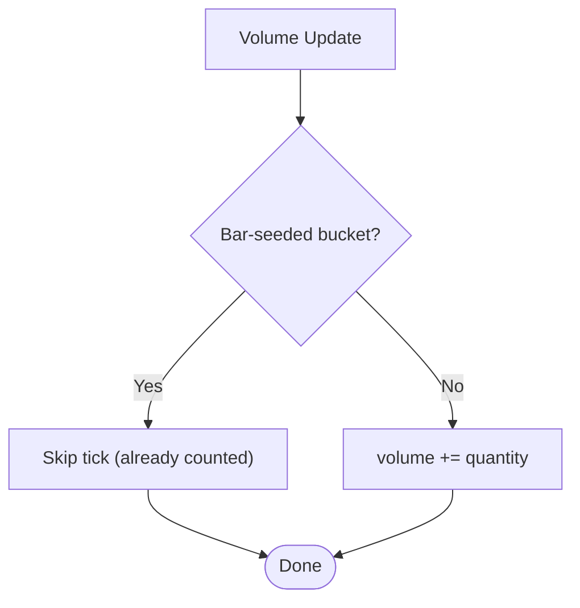
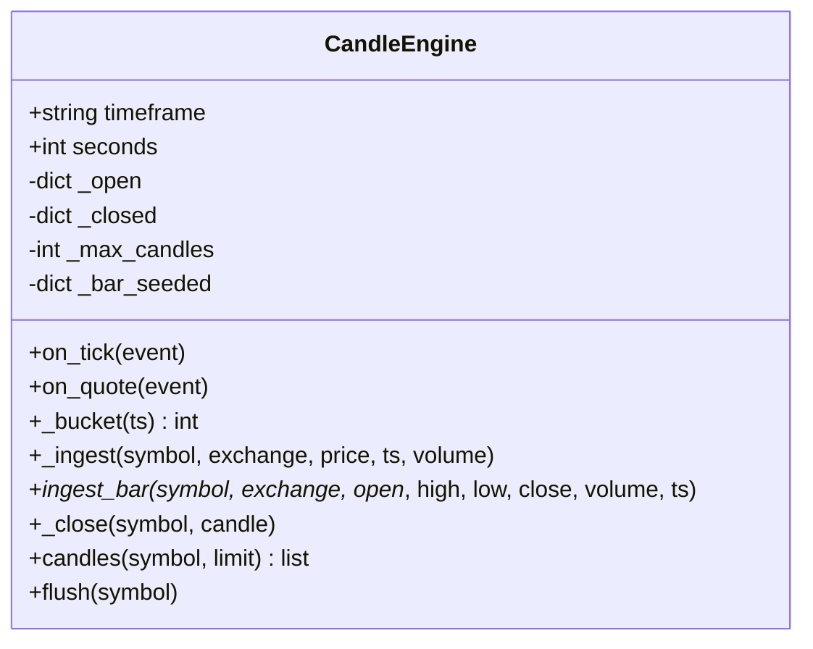
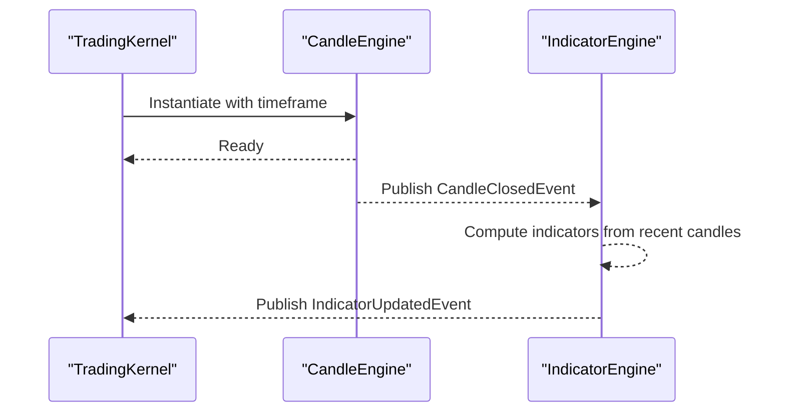

# Candle Engine

<cite>
**Referenced Files in This Document**
- [candle_engine.py](file://ntrade/engines/candle_engine.py)
- [market.py](file://ntrade/events/market.py)
- [session.py](file://ntrade/kernel/session.py)
- [context.py](file://ntrade/kernel/context.py)
- [simulator.py](file://ntrade/backtest/simulator.py)
- [indicators.py](file://ntrade/domain/analytics/indicators.py)
- [test_candle_timezone.py](file://tests/test_candle_timezone.py)
- [test_candle_engine.py](file://tests/test_candle_engine.py)
</cite>

## Table of Contents
1. [Introduction](#introduction)
2. [Project Structure](#project-structure)
3. [Core Components](#core-components)
4. [Architecture Overview](#architecture-overview)
5. [Detailed Component Analysis](#detailed-component-analysis)
6. [Dependency Analysis](#dependency-analysis)
7. [Performance Considerations](#performance-considerations)
8. [Troubleshooting Guide](#troubleshooting-guide)
9. [Conclusion](#conclusion)

## Introduction
This document explains the CandleEngine, which aggregates tick data into OHLCV candles and emits completed candle events for downstream consumers (indicators, strategies, scanners). It covers the aggregation algorithm, time-based windowing, volume calculation, event subscriptions, timestamp handling, timezone behavior, configuration options, memory management, and performance considerations for real-time operation.

## Project Structure
CandleEngine lives under the engines package and integrates with the kernel’s event bus to subscribe to market events. It is instantiated by the TradingKernel and flushed at session end to close any partial candles.



**Diagram sources**
- [session.py:70-85](file://ntrade/kernel/session.py#L70-L85)
- [candle_engine.py:19-33](file://ntrade/engines/candle_engine.py#L19-L33)
- [market.py:11-61](file://ntrade/events/market.py#L11-L61)

**Section sources**
- [session.py:70-85](file://ntrade/kernel/session.py#L70-L85)
- [candle_engine.py:19-33](file://ntrade/engines/candle_engine.py#L19-L33)

## Core Components
- CandleEngine: Aggregates ticks into per-symbol, per-timeframe candles; emits CandleClosedEvent on bucket transitions or flush.
- Events: TickEvent (single trade print), QuoteEvent (bar-shaped in backtest mode), CandleClosedEvent (completed candle).
- Context: Provides mode (live/replay/backtest) and event bus wiring.

Key responsibilities:
- Time-based bucketing using UTC-pinned epochs.
- Rolling state maintenance for open candles per symbol.
- Volume accumulation from ticks; authoritative bar ingestion in backtest mode.
- Bounded storage of closed candles.

**Section sources**
- [candle_engine.py:19-33](file://ntrade/engines/candle_engine.py#L19-L33)
- [market.py:11-61](file://ntrade/events/market.py#L11-L61)
- [context.py:26-46](file://ntrade/kernel/context.py#L26-L46)

## Architecture Overview
The CandleEngine subscribes to TickEvent and QuoteEvent via the shared EventBus. In backtest mode, it ingests bar-shaped QuoteEvent authoritatively and skips the paired close tick to avoid double-counting volume. In live/replay modes, it ignores QuoteEvent and only processes TickEvent. A new tick arriving in a later bucket closes the current candle and publishes CandleClosedEvent.



**Diagram sources**
- [candle_engine.py:42-100](file://ntrade/engines/candle_engine.py#L42-L100)
- [simulator.py:124-137](file://ntrade/backtest/simulator.py#L124-L137)
- [indicators.py:28-54](file://ntrade/domain/analytics/indicators.py#L28-L54)

## Detailed Component Analysis

### Candle Aggregation Algorithm
- Bucketing: Each timestamp is mapped to a bucket epoch aligned to the timeframe interval. Naive timestamps are pinned to UTC before computing the epoch to ensure host-timezone independence.
- Open candle state: Per symbol, maintains an in-memory dict with bucket, exchange, open/high/low/close, and volume.
- Closing rule: When a tick arrives whose bucket differs from the current open candle’s bucket, the prior candle is closed and emitted.
- Flush: At session end, any remaining partial candle is closed and emitted.



**Diagram sources**
- [candle_engine.py:57-86](file://ntrade/engines/candle_engine.py#L57-L86)
- [candle_engine.py:87-100](file://ntrade/engines/candle_engine.py#L87-L100)

**Section sources**
- [candle_engine.py:36-41](file://ntrade/engines/candle_engine.py#L36-L41)
- [candle_engine.py:57-86](file://ntrade/engines/candle_engine.py#L57-L86)
- [candle_engine.py:87-100](file://ntrade/engines/candle_engine.py#L87-L100)

### Time-Based Windowing and Timestamp Handling
- Buckets are computed from UTC-pinned epoch seconds modulo the timeframe interval.
- Closed candle label is the naive UTC wall-clock time at the end of the bucket boundary, ensuring consistent labeling across hosts regardless of local timezone.



**Diagram sources**
- [candle_engine.py:36-41](file://ntrade/engines/candle_engine.py#L36-L41)
- [candle_engine.py:87-95](file://ntrade/engines/candle_engine.py#L87-L95)

**Section sources**
- [test_candle_timezone.py:32-55](file://tests/test_candle_timezone.py#L32-L55)

### Volume Calculation
- Tick path: volume accumulates from each TickEvent.quantity.
- Backtest bar path: volume is set authoritatively from QuoteEvent.volume; the paired close tick sharing the same bucket is skipped to prevent double-counting.



**Diagram sources**
- [candle_engine.py:42-56](file://ntrade/engines/candle_engine.py#L42-L56)
- [candle_engine.py:57-71](file://ntrade/engines/candle_engine.py#L57-L71)

**Section sources**
- [simulator.py:124-137](file://ntrade/backtest/simulator.py#L124-L137)
- [test_candle_engine.py:106-116](file://tests/test_candle_engine.py#L106-L116)

### Event Subscriptions and State Maintenance
- Subscriptions:
  - TickEvent → on_tick
  - QuoteEvent → on_quote (only effective in backtest mode)
- Rolling state:
  - _open: per-symbol current candle dict keyed by symbol.
  - _closed: per-symbol list of completed CandleClosedEvent objects.
  - _bar_seeded: per-symbol last bucket seeded by a bar-shaped QuoteEvent.



**Diagram sources**
- [candle_engine.py:19-33](file://ntrade/engines/candle_engine.py#L19-L33)
- [candle_engine.py:36-112](file://ntrade/engines/candle_engine.py#L36-L112)

**Section sources**
- [candle_engine.py:19-33](file://ntrade/engines/candle_engine.py#L19-L33)
- [candle_engine.py:36-112](file://ntrade/engines/candle_engine.py#L36-L112)

### Candle Formation Rules
- First tick in a bucket initializes open/high/low/close to the first price and volume to zero.
- Subsequent ticks update high, low, close, and accumulate volume.
- In backtest mode, a bar-shaped QuoteEvent sets open/high/low/close/volume authoritatively for that bucket.
- A candle closes when a new tick arrives in a different bucket; the closed candle includes a naive UTC timestamp label equal to the bucket end.

**Section sources**
- [candle_engine.py:57-86](file://ntrade/engines/candle_engine.py#L57-L86)
- [candle_engine.py:87-100](file://ntrade/engines/candle_engine.py#L87-L100)

### Configuration Options and Custom Intervals
- Supported intervals are defined internally; constructing with an unsupported timeframe raises an error.
- max_candles controls the bounded size of the closed-candle buffer per symbol.

Examples:
- Create a 5-minute engine with a 10,000 candle buffer:
  - Construct with timeframe="5m", max_candles=10_000.
- To use custom intervals beyond the built-in set, extend the internal mapping and pass the new key to the constructor.

**Section sources**
- [candle_engine.py:14-22](file://ntrade/engines/candle_engine.py#L14-L22)
- [candle_engine.py:20-28](file://ntrade/engines/candle_engine.py#L20-L28)

### Integration With Kernel and Downstream Consumers
- The TradingKernel instantiates CandleEngine with the configured timeframe and wires it into the event bus.
- IndicatorEngine consumes CandleClosedEvent to compute indicator bundles and publish IndicatorUpdatedEvent.



**Diagram sources**
- [session.py:70-85](file://ntrade/kernel/session.py#L70-L85)
- [indicators.py:28-54](file://ntrade/domain/analytics/indicators.py#L28-L54)

**Section sources**
- [session.py:70-85](file://ntrade/kernel/session.py#L70-L85)
- [indicators.py:28-54](file://ntrade/domain/analytics/indicators.py#L28-L54)

## Dependency Analysis
CandleEngine depends on:
- Event types: TickEvent, QuoteEvent, CandleClosedEvent.
- Context: mode flag and event bus for publishing.
- Kernel lifecycle: flush called at session stop.

```mermaid
graph LR
CE["CandleEngine"] --> TE["TickEvent"]
CE --> QE["QuoteEvent"]
CE --> CCE["CandleClosedEvent"]
CE --> Ctx["TradingContext"]
K["TradingKernel"] --> CE
K --> |stop()| CE
```

**Diagram sources**
- [candle_engine.py:19-33](file://ntrade/engines/candle_engine.py#L19-L33)
- [session.py:122-132](file://ntrade/kernel/session.py#L122-L132)

**Section sources**
- [candle_engine.py:19-33](file://ntrade/engines/candle_engine.py#L19-L33)
- [session.py:122-132](file://ntrade/kernel/session.py#L122-L132)

## Performance Considerations
- Memory management:
  - _closed buffers are bounded per symbol by max_candles; older entries are pruned automatically when exceeded.
  - _open holds one dict per active symbol; negligible overhead.
- Real-time throughput:
  - O(1) operations per tick: bucket computation, dict lookup/update, optional close and publish.
  - Avoids heavy object creation except on candle close; uses lightweight dataclasses for events.
- Timezone safety:
  - Naive timestamps are pinned to UTC before bucketing to ensure deterministic behavior across hosts.
- Backtest parity:
  - Bar-shaped QuoteEvent ingestion avoids degenerate candles and ensures accurate OHLCV for indicators.

[No sources needed since this section provides general guidance]

## Troubleshooting Guide
Common issues and resolutions:
- Degenerate candles (open=high=low=close):
  - Cause: Only ticks processed without bar-shaped QuoteEvent in backtest mode.
  - Fix: Ensure backtest producer emits QuoteEvent with full OHLCV; CandleEngine will skip paired close tick to avoid double volume.
- Unexpected timezone shifts in labels:
  - Cause: Using local timezone for naive timestamps.
  - Fix: Buckets are pinned to UTC; labels are naive UTC. Tests validate correctness across timezones.
- Missing candles after session end:
  - Cause: Partial candle not flushed.
  - Fix: Call flush() at session stop; TradingKernel already does this.
- Excessive memory usage:
  - Cause: Large _closed buffers.
  - Fix: Reduce max_candles to cap memory per symbol.

**Section sources**
- [test_candle_engine.py:106-116](file://tests/test_candle_engine.py#L106-L116)
- [test_candle_timezone.py:32-55](file://tests/test_candle_timezone.py#L32-L55)
- [session.py:122-132](file://ntrade/kernel/session.py#L122-L132)

## Conclusion
CandleEngine provides robust, timezone-safe, and memory-bounded OHLCV candle generation from tick streams. It supports both tick-driven aggregation and authoritative bar ingestion in backtest mode, emitting standardized CandleClosedEvent for downstream analytics. Proper configuration of timeframe and max_candles ensures predictable behavior and efficient resource usage in both live and simulated environments.