# Engine Stack Architecture

<cite>
**Referenced Files in This Document**
- [ntrade/engines/__init__.py](file://ntrade/engines/__init__.py)
- [ntrade/kernel/trading_session.py](file://ntrade/kernel/trading_session.py)
- [ntrade/kernel/event_bus.py](file://ntrade/kernel/event_bus.py)
- [ntrade/facade.py](file://ntrade/facade.py)
- [ntrade/engines/market_engine.py](file://ntrade/engines/market_engine.py)
- [ntrade/engines/candle_engine.py](file://ntrade/engines/candle_engine.py)
- [ntrade/engines/strategy_engine.py](file://ntrade/engines/strategy_engine.py)
- [ntrade/engines/risk_engine.py](file://ntrade/engines/risk_engine.py)
- [ntrade/engines/order_engine.py](file://ntrade/engines/order_engine.py)
- [ntrade/engines/portfolio_engine.py](file://ntrade/engines/portfolio_engine.py)
- [ntrade/engines/indicator_engine.py](file://ntrade/engines/indicator_engine.py)
- [ntrade/kernel/session.py](file://ntrade/kernel/session.py)
- [ntrade/events/base.py](file://ntrade/events/base.py)
- [ntrade/events/market.py](file://ntrade/events/market.py)
- [ARCHITECTURE.md](file://ARCHITECTURE.md)
</cite>

## Table of Contents
1. Introduction
2. Project Structure
3. Core Components
4. Architecture Overview
5. Detailed Component Analysis
6. Dependency Analysis
7. Performance Considerations
8. Troubleshooting Guide
9. Conclusion
10. Appendices

## Introduction
This document explains nTrade’s engine stack architecture and how specialized engines process different event types through the trading pipeline. It covers MarketEngine for real-time price updates, CandleEngine for OHLCV aggregation, StrategyEngine for signal generation and execution coordination, RiskEngine for circuit breakers and position limits, OrderEngine for OMS integration, and PortfolioEngine for P&L tracking. It also details orchestration by TradingKernel, communication via EventBus, lifecycle management, error isolation, performance optimization, and how to add new engines.

## Project Structure
The engine stack is organized under ntrade/engines and orchestrated by the kernel subsystem. The public entry points are TradingSession (preferred) and the legacy Market facade. Events are defined in ntrade/events and consumed across engines.

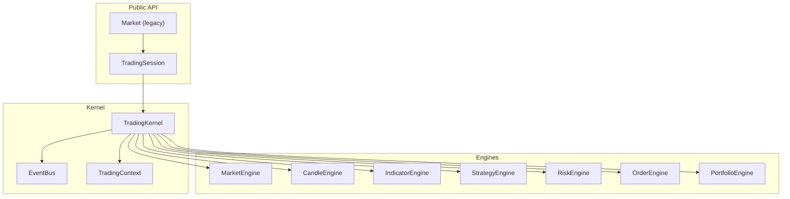

**Diagram sources**
- [ntrade/kernel/trading_session.py:39-116](file://ntrade/kernel/trading_session.py#L39-L116)
- [ntrade/facade.py:27-36](file://ntrade/facade.py#L27-L36)
- [ntrade/kernel/session.py:38-103](file://ntrade/kernel/session.py#L38-L103)
- [ntrade/kernel/event_bus.py:24-38](file://ntrade/kernel/event_bus.py#L24-L38)

**Section sources**
- [ntrade/kernel/trading_session.py:39-116](file://ntrade/kernel/trading_session.py#L39-L116)
- [ntrade/facade.py:27-36](file://ntrade/facade.py#L27-L36)
- [ntrade/kernel/session.py:38-103](file://ntrade/kernel/session.py#L38-L103)
- [ntrade/kernel/event_bus.py:24-38](file://ntrade/kernel/event_bus.py#L24-L38)

## Core Components
- MarketEngine: Normalizes raw market events into instrument read-model state and broadcasts QuoteUpdatedEvent.
- CandleEngine: Aggregates ticks into OHLCV candles per timeframe and emits CandleClosedEvent.
- IndicatorEngine: Recomputes indicator bundles on candle close and publishes IndicatorUpdatedEvent.
- StrategyEngine: Dispatches kernel events to registered strategies; strategies emit signals via SignalGeneratedEvent.
- RiskEngine: Screens signals with static limits and circuit breakers; publishes approved/rejected/halt/resume events.
- OrderEngine: Converts approved signals into order intents and submits them via the execution router.
- PortfolioEngine: Updates positions and account balance from fills and publishes portfolio events.

These components are wired together by TradingKernel and communicate exclusively through EventBus.

**Section sources**
- [ntrade/engines/market_engine.py:15-64](file://ntrade/engines/market_engine.py#L15-L64)
- [ntrade/engines/candle_engine.py:19-113](file://ntrade/engines/candle_engine.py#L19-L113)
- [ntrade/engines/indicator_engine.py:18-55](file://ntrade/engines/indicator_engine.py#L18-L55)
- [ntrade/engines/strategy_engine.py:18-102](file://ntrade/engines/strategy_engine.py#L18-L102)
- [ntrade/engines/risk_engine.py:19-141](file://ntrade/engines/risk_engine.py#L19-L141)
- [ntrade/engines/order_engine.py:14-34](file://ntrade/engines/order_engine.py#L14-L34)
- [ntrade/engines/portfolio_engine.py:15-69](file://ntrade/engines/portfolio_engine.py#L15-L69)

## Architecture Overview
The kernel orchestrates a deterministic, zero-parity pipeline where every subsystem communicates via an event bus. Engines subscribe to specific event types, mutate read models, and publish downstream events. Execution targets (simulated or broker-backed) are interchangeable without changing the engine stack.

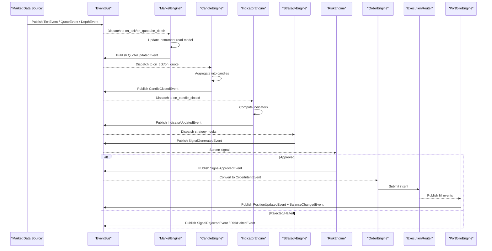

**Diagram sources**
- [ntrade/engines/market_engine.py:25-51](file://ntrade/engines/market_engine.py#L25-L51)
- [ntrade/engines/candle_engine.py:42-100](file://ntrade/engines/candle_engine.py#L42-L100)
- [ntrade/engines/indicator_engine.py:28-51](file://ntrade/engines/indicator_engine.py#L28-L51)
- [ntrade/engines/strategy_engine.py:48-102](file://ntrade/engines/strategy_engine.py#L48-L102)
- [ntrade/engines/risk_engine.py:73-111](file://ntrade/engines/risk_engine.py#L73-L111)
- [ntrade/engines/order_engine.py:21-34](file://ntrade/engines/order_engine.py#L21-L34)
- [ntrade/engines/portfolio_engine.py:20-69](file://ntrade/engines/portfolio_engine.py#L20-L69)

## Detailed Component Analysis

### MarketEngine
Responsibilities:
- Subscribes to TickEvent, QuoteEvent, DepthEvent.
- Projects data into instrument read models via apply methods.
- Broadcasts QuoteUpdatedEvent for downstream consumers.

Key behaviors:
- on_tick constructs a Tick and ingests it into the instrument stream, then publishes QuoteUpdatedEvent.
- on_quote applies a full quote snapshot and publishes QuoteUpdatedEvent.
- on_depth builds a MarketDepth object and applies it to the instrument.

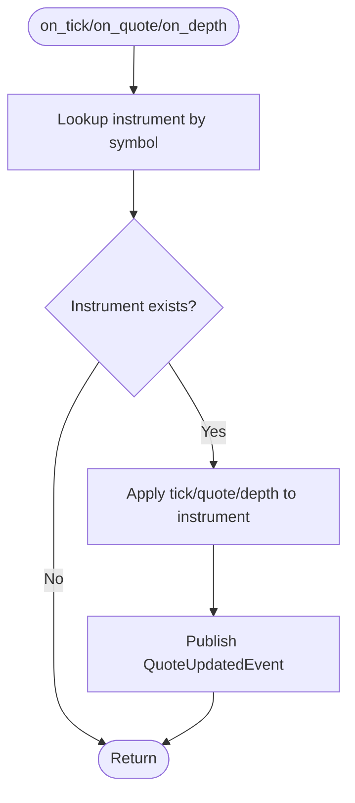

**Diagram sources**
- [ntrade/engines/market_engine.py:25-64](file://ntrade/engines/market_engine.py#L25-L64)

**Section sources**
- [ntrade/engines/market_engine.py:15-64](file://ntrade/engines/market_engine.py#L15-L64)

### CandleEngine
Responsibilities:
- Aggregates ticks into OHLCV candles per timeframe.
- Supports backtest seeding from bar-shaped QuoteEvent.
- Emits CandleClosedEvent when a bucket closes; supports flush at session end.

Key behaviors:
- _bucket maps timestamps to fixed-width buckets.
- on_tick accumulates price/volume; on_quote seeds bars in backtest mode.
- _close emits CandleClosedEvent and maintains a bounded buffer.

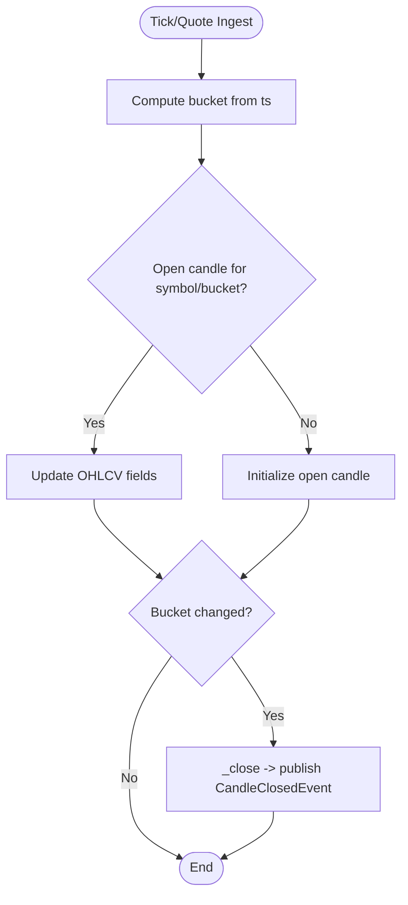

**Diagram sources**
- [ntrade/engines/candle_engine.py:42-100](file://ntrade/engines/candle_engine.py#L42-L100)

**Section sources**
- [ntrade/engines/candle_engine.py:19-113](file://ntrade/engines/candle_engine.py#L19-L113)

### IndicatorEngine
Responsibilities:
- Maintains rolling OHLCV windows per symbol/timeframe.
- Computes indicator bundles on each candle close.
- Publishes IndicatorUpdatedEvent with latest bundle.

Key behaviors:
- on_candle_closed appends row, trims history, computes bundle if enough rows.
- Updates instrument._indicators and publishes IndicatorUpdatedEvent.

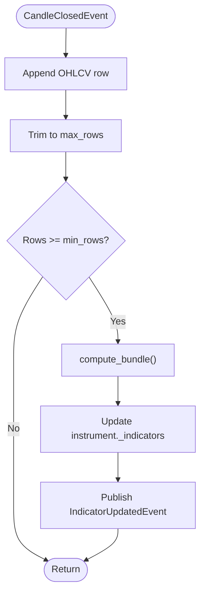

**Diagram sources**
- [ntrade/engines/indicator_engine.py:28-51](file://ntrade/engines/indicator_engine.py#L28-L51)

**Section sources**
- [ntrade/engines/indicator_engine.py:18-55](file://ntrade/engines/indicator_engine.py#L18-L55)

### StrategyEngine
Responsibilities:
- Registers strategies and dispatches kernel events to their hooks.
- Strategies emit trade signals via emit_signal which publishes SignalGeneratedEvent.
- Provides enable/disable and hot-detach capabilities.

Key behaviors:
- _HOOKS map event types to strategy method names.
- _dispatch wraps hook calls with exception isolation.
- emit_signal constructs and publishes SignalGeneratedEvent.

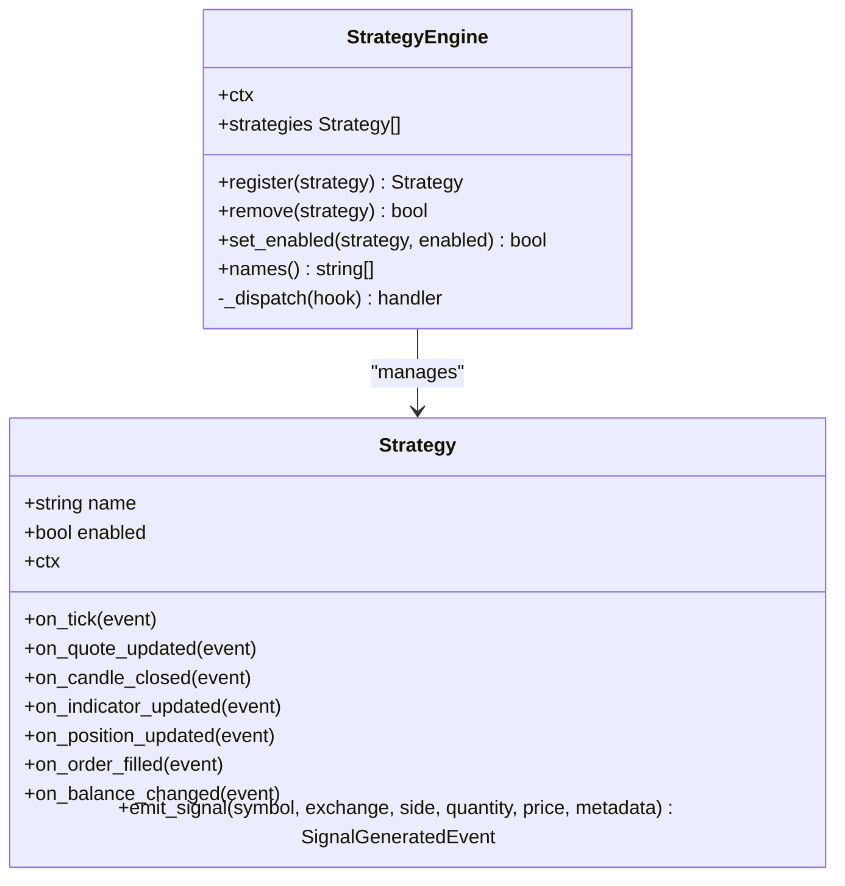

**Diagram sources**
- [ntrade/engines/strategy_engine.py:18-102](file://ntrade/engines/strategy_engine.py#L18-L102)

**Section sources**
- [ntrade/engines/strategy_engine.py:18-102](file://ntrade/engines/strategy_engine.py#L18-L102)

### RiskEngine
Responsibilities:
- Screens SignalGeneratedEvent against static limits and circuit breakers.
- Publishes SignalApprovedEvent or SignalRejectedEvent.
- Implements daily-loss cap, drawdown halt, and price-deviation guard.
- Exposes halt/resume and equity calculation; publishes RiskHaltedEvent/RiskResumedEvent.

Key behaviors:
- on_signal checks allowlist, quantity, notional, position count, price deviation.
- _update_breakers evaluates equity vs start and peak-to-trough drawdown.
- check() allows periodic evaluation outside signal flow.

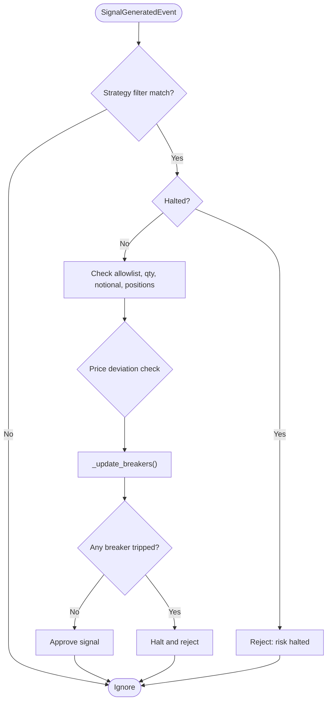

**Diagram sources**
- [ntrade/engines/risk_engine.py:73-141](file://ntrade/engines/risk_engine.py#L73-L141)

**Section sources**
- [ntrade/engines/risk_engine.py:19-141](file://ntrade/engines/risk_engine.py#L19-L141)

### OrderEngine (OMS)
Responsibilities:
- Consumes SignalApprovedEvent and materializes OrderIntentEvent.
- Submits intent via the execution router and republishes rejections.

Key behaviors:
- on_signal_approved constructs intent with LIMIT/MARKET based on price presence.
- Calls router.submit(intent) and handles rejection events.

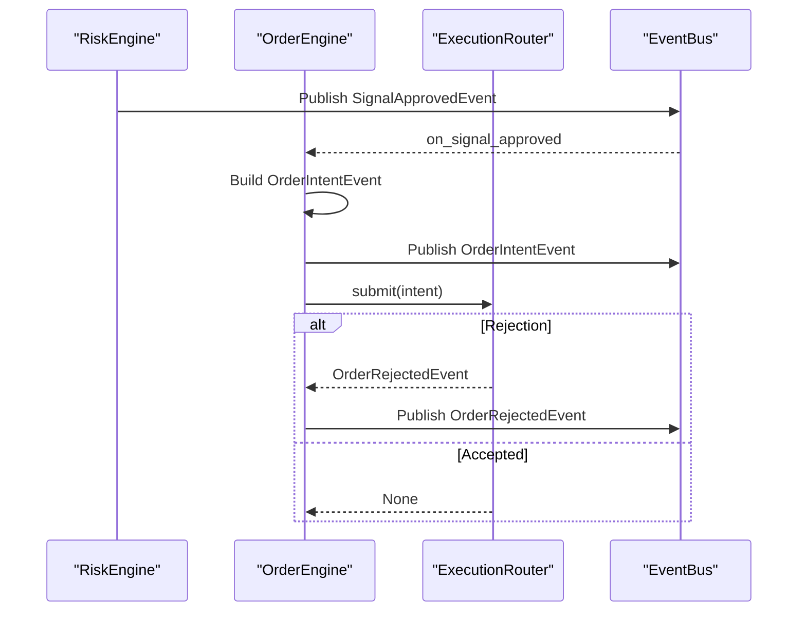

**Diagram sources**
- [ntrade/engines/order_engine.py:21-34](file://ntrade/engines/order_engine.py#L21-L34)

**Section sources**
- [ntrade/engines/order_engine.py:14-34](file://ntrade/engines/order_engine.py#L14-L34)

### PortfolioEngine
Responsibilities:
- Maintains Portfolio and Account read models from fills.
- Nets positions, averages entry prices, debits/credits cash including statutory charges.
- Publishes PositionUpdatedEvent and BalanceChangedEvent.

Key behaviors:
- on_filled creates or updates positions, adjusts average price on same-direction trades, resets on exit.
- Deducts commission/statutory costs on both sides and rounds balances.

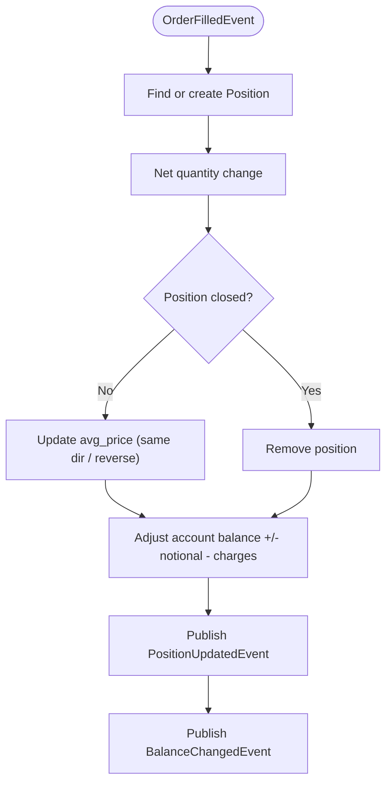

**Diagram sources**
- [ntrade/engines/portfolio_engine.py:20-69](file://ntrade/engines/portfolio_engine.py#L20-L69)

**Section sources**
- [ntrade/engines/portfolio_engine.py:15-69](file://ntrade/engines/portfolio_engine.py#L15-L69)

### Orchestrator: TradingKernel
Responsibilities:
- Initializes and wires all engines, context, clock, and execution router.
- Manages lifecycle (start/stop), replay, polling, and OMS passthroughs.
- Ensures zero parity across live/replay/backtest modes.

Key behaviors:
- Constructs EventBus, TradingContext, and all engines.
- Adds execution targets (BrokerExecution or SimulatedExecution).
- start/stop publish lifecycle events; run_replay feeds timestamped events deterministically.

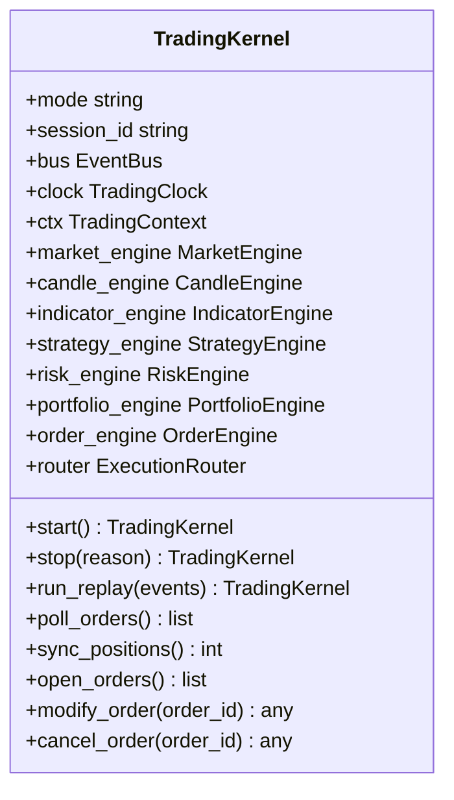

**Diagram sources**
- [ntrade/kernel/session.py:38-103](file://ntrade/kernel/session.py#L38-L103)
- [ntrade/kernel/session.py:121-147](file://ntrade/kernel/session.py#L121-L147)

**Section sources**
- [ntrade/kernel/session.py:38-200](file://ntrade/kernel/session.py#L38-L200)

### Communication: EventBus
Responsibilities:
- Synchronous pub/sub with MRO-based subscription (base classes receive subclass events).
- Thread-safe dispatch using RLock; exceptions in handlers are swallowed.
- Maintains bounded event history for replay and inspection.

Key behaviors:
- subscribe/unsubscribe manage handlers per event type.
- publish iterates MRO, invokes handlers, records event, and logs errors.

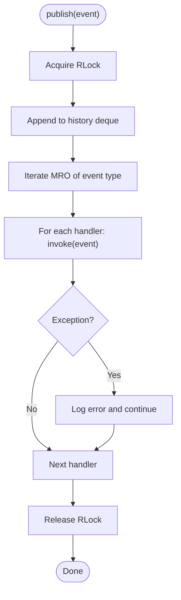

**Diagram sources**
- [ntrade/kernel/event_bus.py:47-66](file://ntrade/kernel/event_bus.py#L47-L66)

**Section sources**
- [ntrade/kernel/event_bus.py:24-81](file://ntrade/kernel/event_bus.py#L24-L81)

## Dependency Analysis
Engines depend on shared context and event bus; they do not call each other directly. Dependencies are decoupled via canonical events.

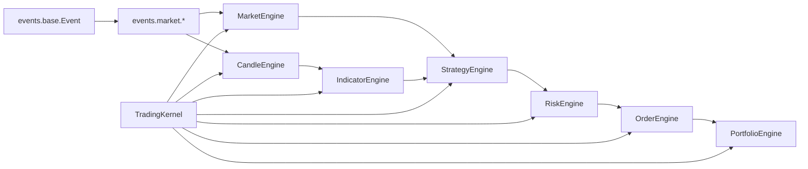

**Diagram sources**
- [ntrade/events/base.py:16-22](file://ntrade/events/base.py#L16-L22)
- [ntrade/events/market.py:11-83](file://ntrade/events/market.py#L11-L83)
- [ntrade/kernel/session.py:79-103](file://ntrade/kernel/session.py#L79-L103)

**Section sources**
- [ntrade/events/base.py:16-22](file://ntrade/events/base.py#L16-L22)
- [ntrade/events/market.py:11-83](file://ntrade/events/market.py#L11-L83)
- [ntrade/kernel/session.py:79-103](file://ntrade/kernel/session.py#L79-L103)

## Performance Considerations
- Event serialization: EventBus uses RLock to serialize dispatch; keep handlers lightweight to avoid blocking.
- History bounds: EventBus history and CandleEngine buffers are bounded; tune max_history and max_candles to memory constraints.
- Indicator computation: IndicatorEngine batches recent rows and computes only after warmup; adjust max_rows and MIN_ROWS for responsiveness.
- Risk checks: RiskEngine performs minimal arithmetic per signal; periodic check() enables mid-session halts without extra overhead.
- Execution polling: poll_orders should be called at appropriate intervals to balance latency and throughput.

[No sources needed since this section provides general guidance]

## Troubleshooting Guide
Common issues and remedies:
- Handler exceptions: EventBus swallows exceptions; inspect logs for “handler raised” messages to identify failing subscribers.
- Missing instruments: MarketEngine ignores unknown symbols; ensure instruments are registered before subscribing to events.
- Stale quotes: If QuoteUpdatedEvent lacks bid/ask, verify upstream QuoteEvent completeness.
- Candle misalignment: Ensure timestamps are timezone-aware; CandleEngine normalizes naive UTC timestamps.
- Risk halts: Check halt_reason and equity; resume only after addressing underlying cause.
- Order rejections: Inspect OrderRejectedEvent reason; validate price, quantity, and allowlist settings.

**Section sources**
- [ntrade/kernel/event_bus.py:58-66](file://ntrade/kernel/event_bus.py#L58-L66)
- [ntrade/engines/market_engine.py:25-38](file://ntrade/engines/market_engine.py#L25-L38)
- [ntrade/engines/candle_engine.py:36-41](file://ntrade/engines/candle_engine.py#L36-L41)
- [ntrade/engines/risk_engine.py:49-63](file://ntrade/engines/risk_engine.py#L49-L63)
- [ntrade/engines/order_engine.py:21-34](file://ntrade/engines/order_engine.py#L21-L34)

## Conclusion
nTrade’s engine stack delivers a robust, event-driven trading pipeline with clear separation of concerns, deterministic behavior across modes, and strong error isolation. Engines communicate via EventBus, orchestrated by TradingKernel, enabling scalable extension and reliable operation. Adding new engines follows the established patterns: subscribe to relevant events, update read models, and publish downstream events.

[No sources needed since this section summarizes without analyzing specific files]

## Appendices

### How to Add a New Engine
Steps:
- Define event subscriptions in __init__ using context.bus.subscribe for required event types.
- Implement handlers that update read models and publish downstream events.
- Wire the engine in TradingKernel initialization alongside existing engines.
- Ensure thread safety when mutating shared state; use ctx.lock if necessary.
- Test with replay/backtest to confirm zero parity.

**Section sources**
- [ntrade/engines/market_engine.py:15-21](file://ntrade/engines/market_engine.py#L15-L21)
- [ntrade/kernel/session.py:79-103](file://ntrade/kernel/session.py#L79-L103)
- [ntrade/kernel/context.py:51-55](file://ntrade/kernel/context.py#L51-L55)

### Lifecycle Management
- Start: Publishing KernelStartedEvent and SessionStartedEvent initializes the session.
- Stop: Flush pending candles and publish SessionStoppedEvent.
- Replay: Deterministic time progression via ReplayClock ensures identical decisions across runs.

**Section sources**
- [ntrade/kernel/session.py:121-147](file://ntrade/kernel/session.py#L121-L147)

### Error Isolation
- EventBus swallows handler exceptions to prevent cascading failures.
- StrategyEngine isolates per-strategy hook exceptions.
- RiskEngine enforces hard limits and halts to contain risky behavior.

**Section sources**
- [ntrade/kernel/event_bus.py:58-66](file://ntrade/kernel/event_bus.py#L58-L66)
- [ntrade/engines/strategy_engine.py:90-101](file://ntrade/engines/strategy_engine.py#L90-L101)
- [ntrade/engines/risk_engine.py:49-63](file://ntrade/engines/risk_engine.py#L49-L63)