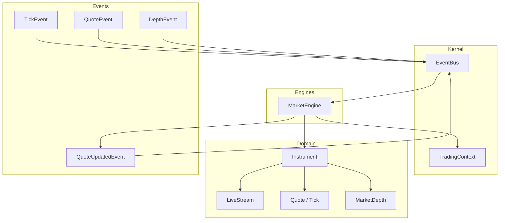
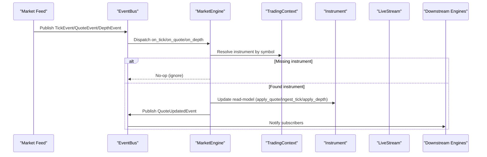
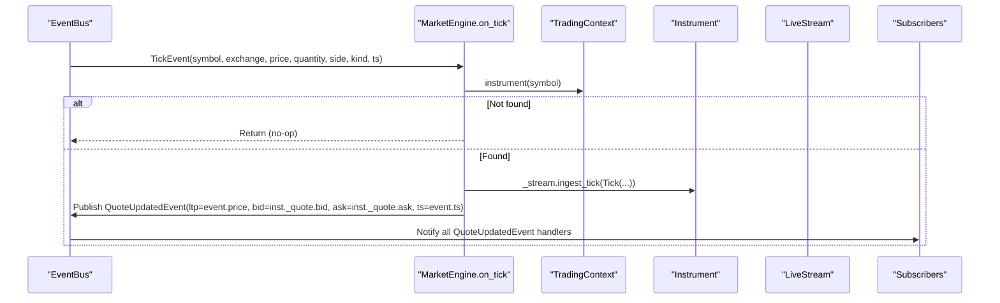
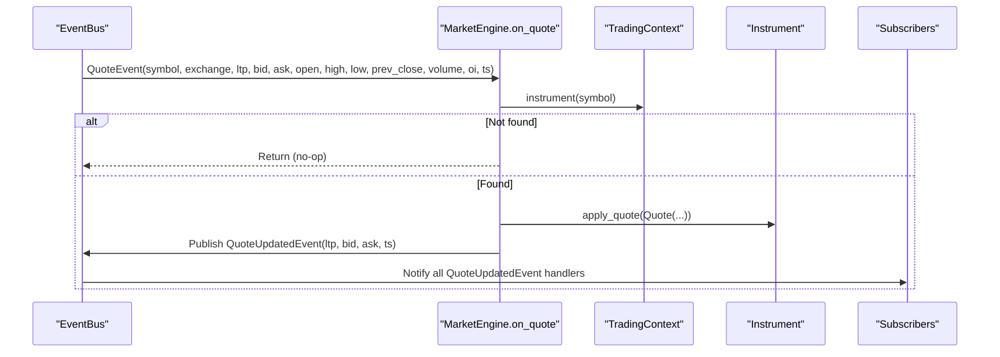
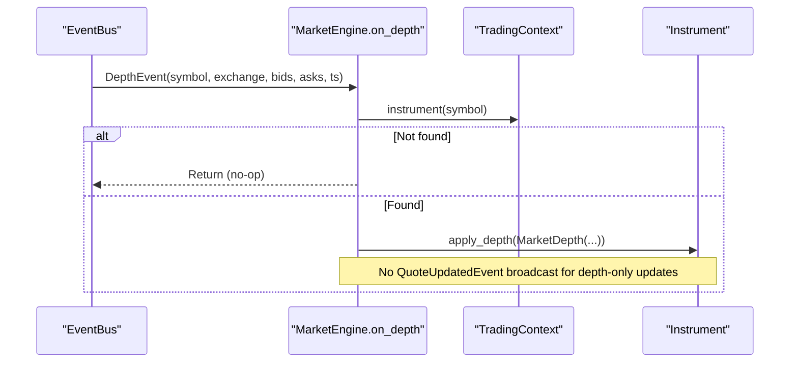
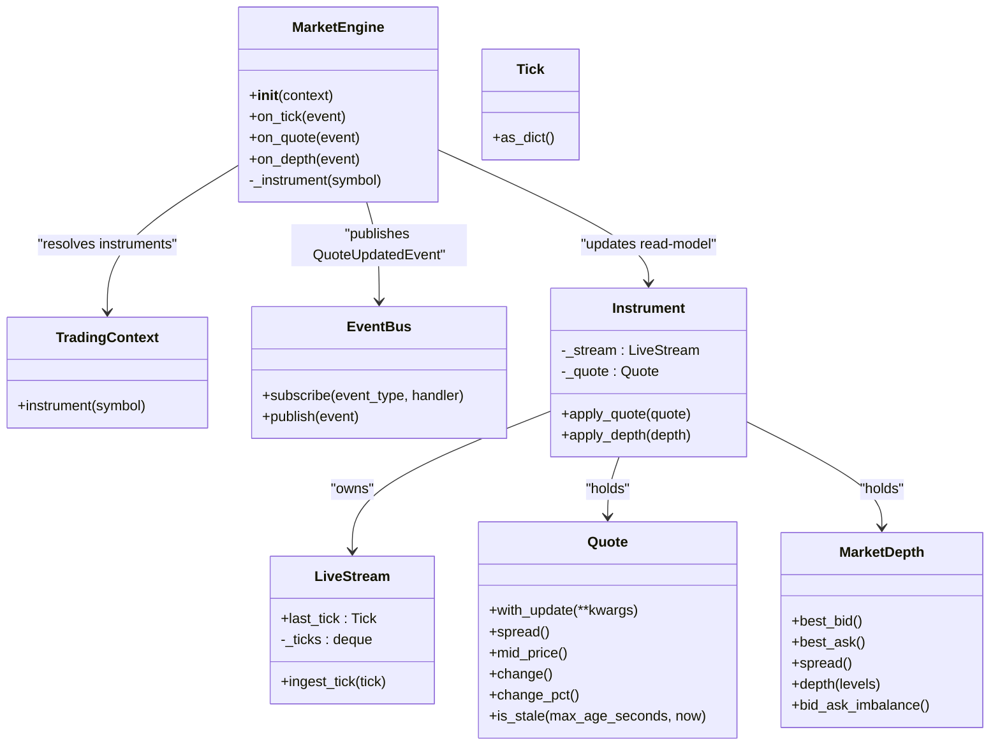

# Market Engine

<cite>
**Referenced Files in This Document**
- [market_engine.py](file://ntrade/engines/market_engine.py)
- [market.py](file://ntrade/events/market.py)
- [quote.py](file://ntrade/domain/market/quote.py)
- [depth.py](file://ntrade/domain/market/depth.py)
- [stream.py](file://ntrade/domain/market/stream.py)
- [base.py](file://ntrade/domain/instruments/base.py)
- [event_bus.py](file://ntrade/kernel/event_bus.py)
- [session.py](file://ntrade/kernel/session.py)
- [test_kernel_engines.py](file://tests/test_kernel_engines.py)
</cite>

## Table of Contents
1. [Introduction](#introduction)
2. [Project Structure](#project-structure)
3. [Core Components](#core-components)
4. [Architecture Overview](#architecture-overview)
5. [Detailed Component Analysis](#detailed-component-analysis)
6. [Dependency Analysis](#dependency-analysis)
7. [Performance Considerations](#performance-considerations)
8. [Troubleshooting Guide](#troubleshooting-guide)
9. [Conclusion](#conclusion)

## Introduction
The MarketEngine component is the central adapter that normalizes heterogeneous market data events into a single, consistent stream for downstream consumers. It subscribes to raw TickEvent, QuoteEvent, and DepthEvent from any source (live broker, replay, or simulator), updates each instrument’s read-model state, and publishes a normalized QuoteUpdatedEvent so other engines can react uniformly.

Key responsibilities:
- Normalize incoming market events into instrument state changes
- Maintain per-instrument quote and depth snapshots
- Emit a unified QuoteUpdatedEvent after each update
- Provide robust handling for missing instruments and high-frequency tick processing

## Project Structure
MarketEngine lives under the engines package and integrates with the kernel’s event bus and context. It consumes domain-level value objects (Quote, Tick, MarketDepth) and interacts with Instrument instances via their internal read-model methods.

**Diagram sources**
- [market_engine.py:15-20](file://ntrade/engines/market_engine.py#L15-L20)
- [event_bus.py:24-38](file://ntrade/kernel/event_bus.py#L24-L38)
- [session.py:79-85](file://ntrade/kernel/session.py#L79-L85)
- [base.py:78-93](file://ntrade/domain/instruments/base.py#L78-L93)
- [stream.py:27-36](file://ntrade/domain/market/stream.py#L27-L36)
- [quote.py:9-28](file://ntrade/domain/market/quote.py#L9-L28)
- [depth.py:16-25](file://ntrade/domain/market/depth.py#L16-L25)
- [market.py:11-48](file://ntrade/events/market.py#L11-L48)

**Section sources**
- [session.py:79-85](file://ntrade/kernel/session.py#L79-L85)
- [event_bus.py:24-38](file://ntrade/kernel/event_bus.py#L24-L38)

## Core Components
- MarketEngine: Subscribes to raw market events, updates instrument state, and broadcasts normalized QuoteUpdatedEvent.
- Events: TickEvent, QuoteEvent, DepthEvent are inputs; QuoteUpdatedEvent is the normalized output.
- Instrument: Owns read-model state (_quote, _depth, _stream) and exposes apply_quote and apply_depth for event-driven projection.
- LiveStream: Per-instrument subscription lifecycle and tick ingestion pipeline.
- Quote and Tick: Immutable value objects representing point-in-time quotes and ticks.
- MarketDepth: Immutable order-book snapshot with best bid/ask and spread utilities.

**Section sources**
- [market_engine.py:15-20](file://ntrade/engines/market_engine.py#L15-L20)
- [market.py:11-48](file://ntrade/events/market.py#L11-L48)
- [base.py:154-166](file://ntrade/domain/instruments/base.py#L154-L166)
- [stream.py:106-123](file://ntrade/domain/market/stream.py#L106-L123)
- [quote.py:9-28](file://ntrade/domain/market/quote.py#L9-L28)
- [depth.py:16-25](file://ntrade/domain/market/depth.py#L16-L25)

## Architecture Overview
MarketEngine acts as an event transformer between raw market feeds and the rest of the system. It uses TradingContext to resolve instruments by symbol and EventBus to publish normalized events.

**Diagram sources**
- [market_engine.py:25-37](file://ntrade/engines/market_engine.py#L25-L37)
- [market_engine.py:39-51](file://ntrade/engines/market_engine.py#L39-L51)
- [market_engine.py:53-64](file://ntrade/engines/market_engine.py#L53-L64)
- [event_bus.py:47-66](file://ntrade/kernel/event_bus.py#L47-L66)
- [session.py:79-85](file://ntrade/kernel/session.py#L79-L85)

## Detailed Component Analysis

### MarketEngine Class
Responsibilities:
- Subscribe to TickEvent, QuoteEvent, DepthEvent during initialization
- Resolve instruments via context
- Normalize events into instrument state updates
- Broadcast QuoteUpdatedEvent with latest LTP, bid, ask, and timestamp

Key methods:
- on_tick: Builds a Tick value object, ingests it into the instrument’s stream, then publishes QuoteUpdatedEvent using current instrument quote fields and the tick price as LTP.
- on_quote: Constructs a Quote from the event and applies it to the instrument, then publishes QuoteUpdatedEvent with the provided ltp/bid/ask.
- on_depth: Converts raw bids/asks into MarketDepth and applies it to the instrument.

Error handling:
- If the instrument is not found in context, the method returns early without error propagation.

**Section sources**
- [market_engine.py:15-20](file://ntrade/engines/market_engine.py#L15-L20)
- [market_engine.py:25-37](file://ntrade/engines/market_engine.py#L25-L37)
- [market_engine.py:39-51](file://ntrade/engines/market_engine.py#L39-L51)
- [market_engine.py:53-64](file://ntrade/engines/market_engine.py#L53-L64)

#### Sequence Diagram: Tick Processing

**Diagram sources**
- [market_engine.py:25-37](file://ntrade/engines/market_engine.py#L25-L37)
- [stream.py:106-123](file://ntrade/domain/market/stream.py#L106-L123)
- [event_bus.py:47-66](file://ntrade/kernel/event_bus.py#L47-L66)

#### Sequence Diagram: Quote Processing

**Diagram sources**
- [market_engine.py:39-51](file://ntrade/engines/market_engine.py#L39-L51)
- [event_bus.py:47-66](file://ntrade/kernel/event_bus.py#L47-L66)

#### Sequence Diagram: Depth Processing

**Diagram sources**
- [market_engine.py:53-64](file://ntrade/engines/market_engine.py#L53-L64)

### Event Types
- TickEvent: Single trade/quote/depth print with symbol, exchange, price, quantity, side, kind, and timestamp.
- QuoteEvent: Full snapshot including ltp, bid, ask, OHLC, prev_close, volume, and OI.
- DepthEvent: Order book snapshot with tuples of (price, quantity, orders).
- QuoteUpdatedEvent: Normalized output containing symbol, exchange, ltp, bid, ask, and timestamp.

These events are immutable dataclasses designed for safe propagation across threads.

**Section sources**
- [market.py:11-48](file://ntrade/events/market.py#L11-L48)
- [market.py:64-73](file://ntrade/events/market.py#L64-L73)

### Instrument Read-Model State
Each Instrument maintains:
- _quote: Current Quote snapshot
- _depth: Current MarketDepth snapshot
- _stream: LiveStream managing subscriptions and tick history

Methods used by MarketEngine:
- apply_quote: Replaces the current Quote with a new one
- apply_depth: Replaces the current MarketDepth with a new snapshot
- _stream.ingest_tick: Updates last_tick, appends bounded tick history, and mutates Quote based on tick kind

LiveStream behavior:
- For kind="quote": sets ltp/bid/ask to tick.price and emits quote/tick events
- For kind="trade": updates ltp and emits trade/tick events
- For kind="depth": emits depth/tick events
- Maintains a deque of up to 10,000 ticks to bound memory usage

**Section sources**
- [base.py:78-93](file://ntrade/domain/instruments/base.py#L78-L93)
- [base.py:154-166](file://ntrade/domain/instruments/base.py#L154-L166)
- [stream.py:106-123](file://ntrade/domain/market/stream.py#L106-L123)
- [stream.py:34](file://ntrade/domain/market/stream.py#L34)

### Quote and Tick Value Objects
Quote provides derived metrics such as spread(), mid_price(), change(), change_pct(), and staleness checks via is_stale(). It supports immutable updates through with_update().

Tick represents a single market print with symbol, price, quantity, side, timestamp, and kind.

**Section sources**
- [quote.py:9-28](file://ntrade/domain/market/quote.py#L9-L28)
- [quote.py:30-63](file://ntrade/domain/market/quote.py#L30-L63)
- [quote.py:74-91](file://ntrade/domain/market/quote.py#L74-L91)

### MarketDepth Snapshot
MarketDepth holds ordered bids and asks as tuples of DepthLevel (price, quantity, orders). It provides best_bid(), best_ask(), spread(), depth(levels), and bid_ask_imbalance() for quick analytics.

**Section sources**
- [depth.py:16-25](file://ntrade/domain/market/depth.py#L16-L25)
- [depth.py:27-48](file://ntrade/domain/market/depth.py#L27-L48)

### Event Bus Integration
The EventBus ensures thread-safe dispatch with reentrant locking, records event history, and swallows handler exceptions to prevent failures from cascading. MarketEngine subscribes to three event types and publishes QuoteUpdatedEvent for downstream consumers.

**Section sources**
- [event_bus.py:24-38](file://ntrade/kernel/event_bus.py#L24-L38)
- [event_bus.py:47-66](file://ntrade/kernel/event_bus.py#L47-L66)

### Kernel Wiring
TradingKernel constructs the engine stack and wires MarketEngine into the context. Instruments are registered via ctx.register(instrument), enabling MarketEngine to resolve them by symbol.

**Section sources**
- [session.py:79-85](file://ntrade/kernel/session.py#L79-L85)

## Dependency Analysis
MarketEngine depends on:
- Context for instrument resolution
- EventBus for publishing normalized events
- Domain value objects (Quote, Tick, MarketDepth)
- Instrument read-model methods for state projection

**Diagram sources**
- [market_engine.py:15-20](file://ntrade/engines/market_engine.py#L15-L20)
- [base.py:78-93](file://ntrade/domain/instruments/base.py#L78-L93)
- [stream.py:27-36](file://ntrade/domain/market/stream.py#L27-L36)
- [quote.py:9-28](file://ntrade/domain/market/quote.py#L9-L28)
- [depth.py:16-25](file://ntrade/domain/market/depth.py#L16-L25)

**Section sources**
- [market_engine.py:15-20](file://ntrade/engines/market_engine.py#L15-L20)
- [base.py:78-93](file://ntrade/domain/instruments/base.py#L78-L93)

## Performance Considerations
- High-frequency tick processing:
  - LiveStream maintains a bounded deque of up to 10,000 ticks to prevent unbounded memory growth.
  - Quote updates use immutable with_update() to avoid shared mutable state issues.
- Thread safety:
  - EventBus uses a reentrant lock around publish operations, ensuring serialized dispatch even when multiple producer threads emit events concurrently.
  - Handler exceptions are swallowed to keep the bus resilient.
- Instrument resolution:
  - Fast symbol lookup via TradingContext.instrument() avoids unnecessary overhead.
- Memory footprint:
  - Immutable value objects (Quote, Tick, MarketDepth) reduce accidental mutations and simplify reasoning about state transitions.

[No sources needed since this section provides general guidance]

## Troubleshooting Guide
Common issues and resolutions:
- Missing instrument:
  - Symptom: No QuoteUpdatedEvent published after receiving market events.
  - Cause: Instrument not registered in TradingContext.
  - Resolution: Ensure ctx.register(instrument) is called before subscribing to events.
- Stale quotes:
  - Symptom: Strategies see outdated prices.
  - Cause: Quote timestamp older than acceptable threshold.
  - Resolution: Use Quote.is_stale() to detect staleness and refresh via instrument.refresh() if needed.
- Depth-only updates:
  - Symptom: No QuoteUpdatedEvent emitted after DepthEvent.
  - Cause: MarketEngine only broadcasts QuoteUpdatedEvent for tick and quote events; depth updates do not trigger it.
  - Resolution: Subscribe to DepthEvent directly if you need depth-specific reactions.

**Section sources**
- [market_engine.py:25-37](file://ntrade/engines/market_engine.py#L25-L37)
- [market_engine.py:39-51](file://ntrade/engines/market_engine.py#L39-L51)
- [market_engine.py:53-64](file://ntrade/engines/market_engine.py#L53-L64)
- [quote.py:59-63](file://ntrade/domain/market/quote.py#L59-L63)
- [base.py:169-184](file://ntrade/domain/instruments/base.py#L169-L184)

## Conclusion
MarketEngine serves as the normalization layer that transforms diverse market events into a consistent QuoteUpdatedEvent stream while maintaining accurate instrument read-model state. Its design emphasizes immutability, thread safety, and performance under high-frequency conditions. By delegating state updates to Instrument and LiveStream, it keeps concerns separated and enables downstream engines to consume a single, reliable source of truth for market data.

[No sources needed since this section summarizes without analyzing specific files]