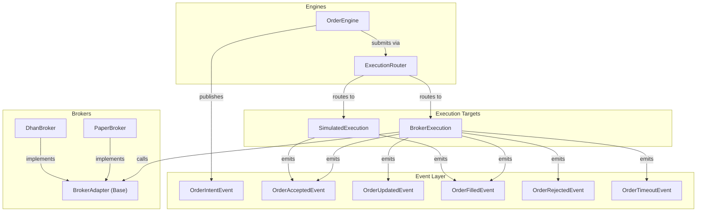
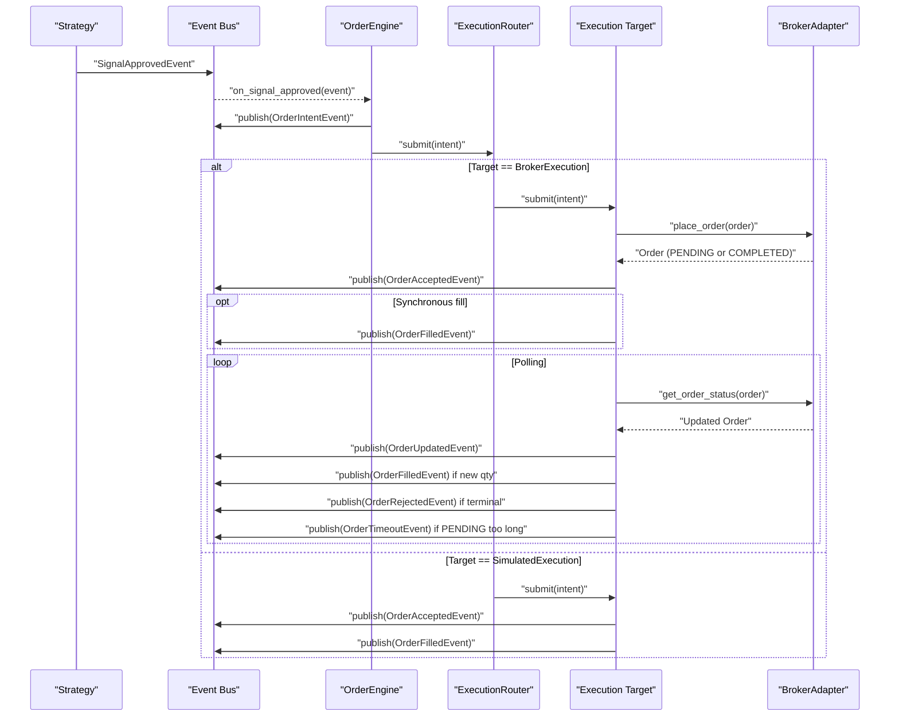
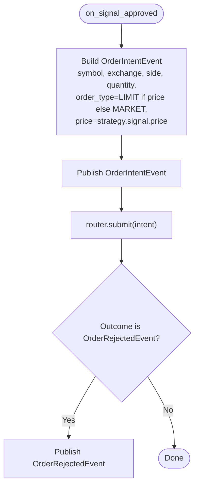
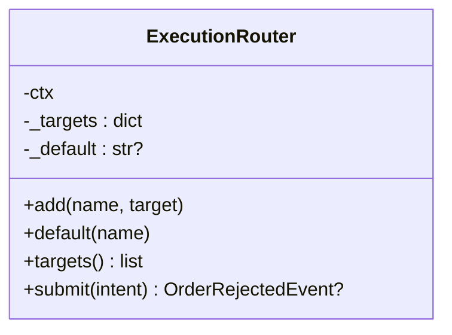
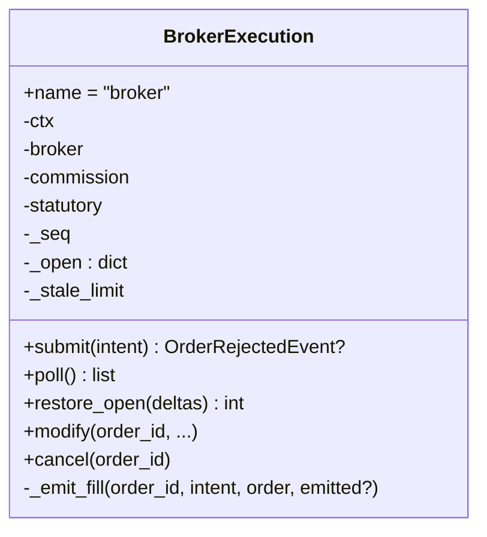
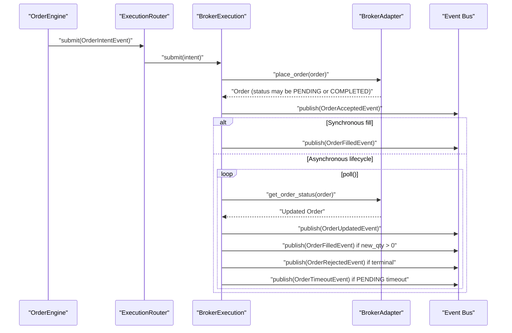
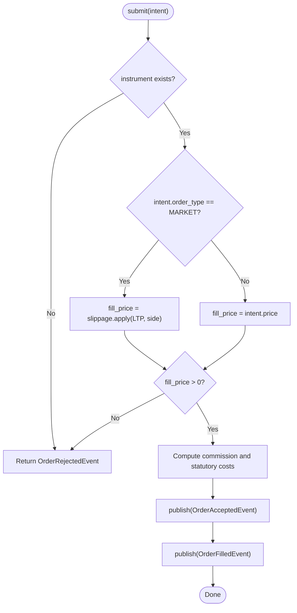
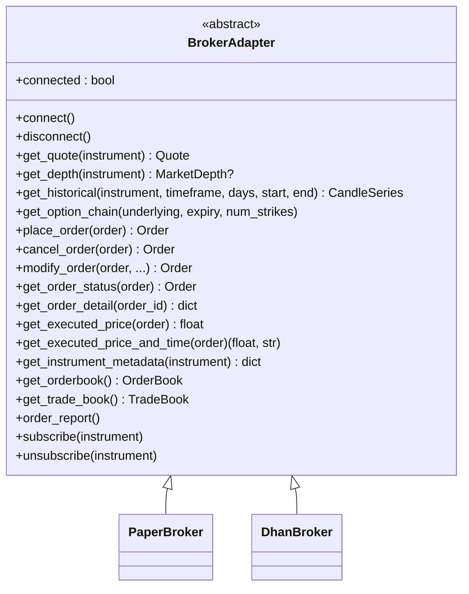
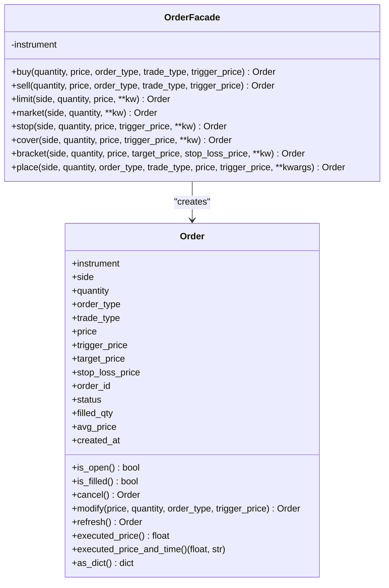
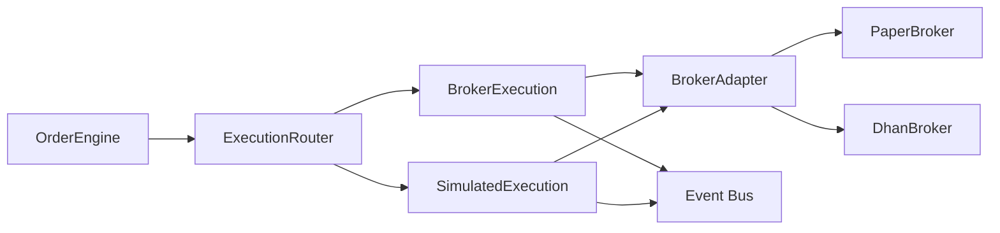

# Order Engine

<cite>
**Referenced Files in This Document**
- [order_engine.py](file://ntrade/engines/order_engine.py)
- [router.py](file://ntrade/execution/router.py)
- [broker_executor.py](file://ntrade/execution/broker_executor.py)
- [simulator.py](file://ntrade/execution/simulator.py)
- [retry.py](file://ntrade/execution/retry.py)
- [base.py](file://ntrade/brokers/base.py)
- [paper.py](file://ntrade/brokers/paper.py)
- [dhan.py](file://ntrade/brokers/dhan.py)
- [order.py](file://ntrade/domain/orders/order.py)
- [book.py](file://ntrade/domain/orders/book.py)
- [order_events.py](file://ntrade/events/order.py)
</cite>

## Table of Contents
1. [Introduction](#introduction)
2. [Project Structure](#project-structure)
3. [Core Components](#core-components)
4. [Architecture Overview](#architecture-overview)
5. [Detailed Component Analysis](#detailed-component-analysis)
6. [Dependency Analysis](#dependency-analysis)
7. [Performance Considerations](#performance-considerations)
8. [Troubleshooting Guide](#troubleshooting-guide)
9. [Conclusion](#conclusion)
10. [Appendices](#appendices)

## Introduction
This document explains the OrderEngine and its role in managing the order lifecycle and integrating with broker execution systems (OMS). It covers how signals become order intents, how routing selects an execution target, how orders are placed and tracked, and how fills and state changes are processed. It also documents supported order types, modification and cancellation flows, partial fill handling, retry mechanisms, order book management, trade history tracking, and reconciliation patterns for robust operation.

## Project Structure
The OrderEngine sits at the intersection of event-driven orchestration and execution targets:
- OrderEngine consumes approved signals and publishes order intents to the router.
- ExecutionRouter selects a target by strategy or default.
- BrokerExecution handles live broker integration; SimulatedExecution provides deterministic fills for paper/backtests.
- BrokerAdapter abstracts broker connectivity and order operations.
- Domain models define orders, statuses, and immutable books for open orders and trades.
- Events model the full lifecycle from intent to acceptance, updates, fills, rejections, and timeouts.

**Diagram sources**
- [order_engine.py:14-34](file://ntrade/engines/order_engine.py#L14-L34)
- [router.py:19-49](file://ntrade/execution/router.py#L19-L49)
- [broker_executor.py:53-107](file://ntrade/execution/broker_executor.py#L53-L107)
- [simulator.py:43-146](file://ntrade/execution/simulator.py#L43-L146)
- [base.py:25-163](file://ntrade/brokers/base.py#L25-L163)
- [paper.py:23-216](file://ntrade/brokers/paper.py#L23-L216)
- [dhan.py:54-200](file://ntrade/brokers/dhan.py#L54-L200)
- [order_events.py:11-91](file://ntrade/events/order.py#L11-L91)

**Section sources**
- [order_engine.py:14-34](file://ntrade/engines/order_engine.py#L14-L34)
- [router.py:19-49](file://ntrade/execution/router.py#L19-L49)
- [broker_executor.py:53-107](file://ntrade/execution/broker_executor.py#L53-L107)
- [simulator.py:43-146](file://ntrade/execution/simulator.py#L43-L146)
- [base.py:25-163](file://ntrade/brokers/base.py#L25-L163)
- [paper.py:23-216](file://ntrade/brokers/paper.py#L23-L216)
- [dhan.py:54-200](file://ntrade/brokers/dhan.py#L54-L200)
- [order_events.py:11-91](file://ntrade/events/order.py#L11-L91)

## Core Components
- OrderEngine: Translates approved signals into order intents and submits them through the router. It republishes immediate rejections from the router.
- ExecutionRouter: Selects an execution target based on the intent’s strategy or a configured default.
- BrokerExecution: Live execution target that places orders via the broker adapter, tracks open orders, polls status, emits accepted/updated/filled/rejected/timeout events, and supports modify/cancel.
- SimulatedExecution: Deterministic execution target for paper/backtests with configurable slippage, commission, and statutory costs.
- BrokerAdapter: Abstract interface for market data and order operations; implemented by PaperBroker and DhanBroker.
- Order domain model: Defines order attributes, lifecycle helpers, and facade methods for placing orders directly against instruments.
- Order and Trade books: Immutable value objects representing open orders and executed trades returned by brokers.
- Events: Typed events for each stage of the order lifecycle.

Key responsibilities:
- Order routing and target selection
- Asynchronous order lifecycle management
- Partial fill tracking and idempotent emission
- Timeout detection and stale-order eviction
- Reconciliation via restore_open from persisted deltas
- Cost modeling for simulated and live fills

**Section sources**
- [order_engine.py:14-34](file://ntrade/engines/order_engine.py#L14-L34)
- [router.py:19-49](file://ntrade/execution/router.py#L19-L49)
- [broker_executor.py:53-290](file://ntrade/execution/broker_executor.py#L53-L290)
- [simulator.py:43-146](file://ntrade/execution/simulator.py#L43-L146)
- [base.py:25-163](file://ntrade/brokers/base.py#L25-L163)
- [paper.py:23-216](file://ntrade/brokers/paper.py#L23-L216)
- [dhan.py:54-200](file://ntrade/brokers/dhan.py#L54-L200)
- [order.py:44-173](file://ntrade/domain/orders/order.py#L44-L173)
- [book.py:14-120](file://ntrade/domain/orders/book.py#L14-L120)
- [order_events.py:11-91](file://ntrade/events/order.py#L11-L91)

## Architecture Overview
The order flow is event-driven and decoupled:
- Strategy produces SignalApprovedEvent.
- OrderEngine converts it to OrderIntentEvent and publishes it.
- ExecutionRouter routes to the appropriate target (BrokerExecution or SimulatedExecution).
- Target publishes OrderAcceptedEvent immediately; fills and updates arrive asynchronously (live) or synchronously (simulated).
- BrokerExecution maintains an in-memory open-order tracker, polls broker status, and emits lifecycle events.

**Diagram sources**
- [order_engine.py:21-34](file://ntrade/engines/order_engine.py#L21-L34)
- [router.py:37-49](file://ntrade/execution/router.py#L37-L49)
- [broker_executor.py:70-107](file://ntrade/execution/broker_executor.py#L70-L107)
- [broker_executor.py:118-181](file://ntrade/execution/broker_executor.py#L118-L181)
- [simulator.py:72-146](file://ntrade/execution/simulator.py#L72-L146)
- [order_events.py:11-91](file://ntrade/events/order.py#L11-L91)

## Detailed Component Analysis

### OrderEngine
Responsibilities:
- Subscribe to SignalApprovedEvent.
- Build OrderIntentEvent from signal fields.
- Publish intent to bus and submit to router.
- Republish any immediate rejection from router.

Order type mapping:
- If signal.price is set, order_type becomes LIMIT; otherwise MARKET.

**Diagram sources**
- [order_engine.py:21-34](file://ntrade/engines/order_engine.py#L21-L34)

**Section sources**
- [order_engine.py:14-34](file://ntrade/engines/order_engine.py#L14-L34)

### ExecutionRouter
Responsibilities:
- Maintain named targets and a default target.
- Route submit calls to the target matching intent.strategy or fallback to default.
- Return OrderRejectedEvent when no target is found.

**Diagram sources**
- [router.py:19-49](file://ntrade/execution/router.py#L19-L49)

**Section sources**
- [router.py:19-49](file://ntrade/execution/router.py#L19-L49)

### BrokerExecution (Live OMS Integration)
Responsibilities:
- Place orders via instrument.order.place using OrderType and TradeType.
- Assign unique order_id (fallback BRK-xxxxxx if broker returns None).
- Immediately publish OrderAcceptedEvent.
- Track open orders in _open map with intent, order, filled count, status, and placement time.
- Poll broker for status updates; emit OrderUpdatedEvent on status change.
- Emit partial-safe OrderFilledEvent for newly filled quantities.
- Handle terminal states (COMPLETED, REJECTED, CANCELLED), evict from _open, and emit remaining-rejection if applicable.
- Detect timeouts for PENDING orders older than threshold and emit OrderTimeoutEvent.
- Provide modify and cancel operations for open orders.
- Restore open orders from persisted deltas for crash recovery.

**Diagram sources**
- [broker_executor.py:53-290](file://ntrade/execution/broker_executor.py#L53-L290)

#### Sequence: Order Placement and Fill Processing

**Diagram sources**
- [broker_executor.py:70-107](file://ntrade/execution/broker_executor.py#L70-L107)
- [broker_executor.py:118-181](file://ntrade/execution/broker_executor.py#L118-L181)
- [broker_executor.py:253-290](file://ntrade/execution/broker_executor.py#L253-L290)

**Section sources**
- [broker_executor.py:53-290](file://ntrade/execution/broker_executor.py#L53-L290)

### SimulatedExecution (Paper/Backtest)
Responsibilities:
- Determine fill price: market uses current quote LTP with slippage; limit uses intent.price.
- Publish OrderAcceptedEvent immediately.
- Compute commission and statutory costs per instrument product schedule.
- Support delivery detection for equity overnight exits to align simulated costs with live.
- Publish OrderFilledEvent with computed costs.

**Diagram sources**
- [simulator.py:72-146](file://ntrade/execution/simulator.py#L72-L146)

**Section sources**
- [simulator.py:43-146](file://ntrade/execution/simulator.py#L43-L146)

### BrokerAdapter and Implementations
- BrokerAdapter defines the contract for connect/disconnect, market data, order placement, lifecycle operations (cancel, modify, get_order_status), order/trade books, and streaming subscriptions.
- PaperBroker implements all methods in-memory for testing and backtesting, including orderbook and tradebook generation.
- DhanBroker implements real broker integration with authentication, transport, retries, depth retrieval, and order status mapping.

**Diagram sources**
- [base.py:25-163](file://ntrade/brokers/base.py#L25-L163)
- [paper.py:23-216](file://ntrade/brokers/paper.py#L23-L216)
- [dhan.py:54-200](file://ntrade/brokers/dhan.py#L54-L200)

**Section sources**
- [base.py:25-163](file://ntrade/brokers/base.py#L25-L163)
- [paper.py:23-216](file://ntrade/brokers/paper.py#L23-L216)
- [dhan.py:54-200](file://ntrade/brokers/dhan.py#L54-L200)

### Order Domain Model and Facade
- Order dataclass holds instrument, side, quantity, order_type, trade_type, price, trigger/target/stop prices, order_id, status, filled_qty, avg_price, created_at.
- Helpers: is_open, is_filled, cancel, modify, refresh, executed_price, executed_price_and_time, as_dict.
- OrderFacade provides convenient buy/sell/limit/market/stop/cover/bracket methods bound to an Instrument.

Supported order types:
- LIMIT, MARKET, STOP_LIMIT, STOP_MARKET, COVER, BRACKET.

Modification capabilities:
- Modify price, quantity, order_type, trigger_price via broker adapter.

Cancellation handling:
- Cancel via broker adapter; status transitions handled by broker and reflected in subsequent polls.

**Diagram sources**
- [order.py:44-173](file://ntrade/domain/orders/order.py#L44-L173)

**Section sources**
- [order.py:44-173](file://ntrade/domain/orders/order.py#L44-L173)

### Order and Trade Books
- OrderBookEntry and OrderBook represent open orders with symbol, order_id, side, quantity, price, status, exchange, timestamp.
- TradeBookEntry and TradeBook represent executed trades with symbol, trade_id, order_id, side, quantity, price, timestamp.
- Both are frozen dataclasses with tuple entries for thread-safe reads and provide filtering and dict conversion utilities.

**Section sources**
- [book.py:14-120](file://ntrade/domain/orders/book.py#L14-L120)

### Events
- OrderIntentEvent: Pre-execution intent with symbol, exchange, side, quantity, order_type, price, strategy.
- OrderAcceptedEvent: Immediate acceptance with order_id and details.
- OrderUpdatedEvent: Status changes for open orders (including PARTIALLY_FILLED).
- OrderFilledEvent: Fills with quantity, fill_price, commission, statutory costs, strategy.
- OrderRejectedEvent: Rejections with reason.
- OrderTimeoutEvent: Timeouts for PENDING orders beyond threshold.

**Section sources**
- [order_events.py:11-91](file://ntrade/events/order.py#L11-L91)

## Dependency Analysis
High-level dependencies:
- OrderEngine depends on context.bus and router.
- ExecutionRouter depends on TradingContext and registered targets.
- BrokerExecution depends on context.instrument, broker adapter, cost models, and event bus.
- SimulatedExecution depends on context.instrument and cost models.
- BrokerAdapter implementations depend on their specific transports and mappers.

**Diagram sources**
- [order_engine.py:14-34](file://ntrade/engines/order_engine.py#L14-L34)
- [router.py:19-49](file://ntrade/execution/router.py#L19-L49)
- [broker_executor.py:53-107](file://ntrade/execution/broker_executor.py#L53-L107)
- [simulator.py:43-146](file://ntrade/execution/simulator.py#L43-L146)
- [base.py:25-163](file://ntrade/brokers/base.py#L25-L163)

**Section sources**
- [order_engine.py:14-34](file://ntrade/engines/order_engine.py#L14-L34)
- [router.py:19-49](file://ntrade/execution/router.py#L19-L49)
- [broker_executor.py:53-107](file://ntrade/execution/broker_executor.py#L53-L107)
- [simulator.py:43-146](file://ntrade/execution/simulator.py#L43-L146)
- [base.py:25-163](file://ntrade/brokers/base.py#L25-L163)

## Performance Considerations
- Polling cadence: BrokerExecution.poll should be called at a reasonable interval to balance latency and load. Stale limits prevent memory leaks from unresponsive orders.
- Event bus throughput: High-frequency updates (partial fills, status changes) can saturate subscribers; consider batching or throttling downstream consumers.
- Cost computation: Statutory cost calculations are per-fill; ensure efficient instrument resolution to avoid repeated lookups.
- Retry policies: Use RetryPolicy and RateLimiter around flaky broker calls to reduce failures and respect rate limits.
- Memory usage: Keep _open map bounded; leverage restore_open to rebuild state after crashes without retaining stale entries.

[No sources needed since this section provides general guidance]

## Troubleshooting Guide
Common issues and resolutions:
- No execution target for strategy: Ensure ExecutionRouter has a target registered for the strategy name or set a default target.
- Missing broker-backed instrument: Verify context.instrument resolves to an instrument with a broker_adapter attached.
- Order rejected immediately: Inspect OrderRejectedEvent.reason; check broker constraints (e.g., invalid price, insufficient margin).
- Stale orders not updating: Broker.get_order_status may fail; BrokerExecution.evicts after _stale_limit consecutive failures. Investigate network/auth issues.
- Timeouts: PENDING orders exceeding threshold emit OrderTimeoutEvent; review broker responsiveness and polling frequency.
- Partial fill mismatches: _emit_fill ensures only newly filled quantities are emitted; verify filled_qty increments and record["filled"] updates.
- Crash recovery: Use restore_open with persisted deltas to resume tracking open orders without re-emitting already-filled quantities.

Operational tips:
- Monitor OrderUpdatedEvent streams for status drift.
- Log OrderTimeoutEvent occurrences to detect broker latency spikes.
- Validate OrderFilledEvent commission/statutory values against expected models.

**Section sources**
- [router.py:37-49](file://ntrade/execution/router.py#L37-L49)
- [broker_executor.py:70-107](file://ntrade/execution/broker_executor.py#L70-L107)
- [broker_executor.py:118-181](file://ntrade/execution/broker_executor.py#L118-L181)
- [broker_executor.py:253-290](file://ntrade/execution/broker_executor.py#L253-L290)
- [broker_executor.py:188-231](file://ntrade/execution/broker_executor.py#L188-L231)

## Conclusion
The OrderEngine orchestrates a clean, event-driven order lifecycle from signal approval to execution and fill processing. ExecutionRouter enables interchangeable execution targets, while BrokerExecution provides robust live OMS integration with asynchronous lifecycle management, partial fill safety, timeout detection, and crash recovery. SimulatedExecution offers deterministic fills with aligned cost modeling. Together with BrokerAdapter abstractions and rich domain models, the system supports comprehensive order types, modifications, cancellations, and reconciliation across paper and live environments.

[No sources needed since this section summarizes without analyzing specific files]

## Appendices

### Order Types Supported
- LIMIT, MARKET, STOP_LIMIT, STOP_MARKET, COVER, BRACKET.

### Modification Capabilities
- Update price, quantity, order_type, trigger_price via broker adapter.

### Cancellation Handling
- Cancel via broker adapter; status transitions reflected in subsequent polls and events.

### Examples of Workflows
- Order placement workflow: SignalApprovedEvent → OrderIntentEvent → ExecutionRouter → BrokerExecution → OrderAcceptedEvent → (optional) OrderFilledEvent.
- Partial fill handling: poll() detects new filled_qty, emits OrderFilledEvent for delta, continues tracking until terminal.
- Order state transitions: PENDING → PARTIALLY_FILLED → COMPLETED; or PENDING → REJECTED/CANCELLED; timeouts emit OrderTimeoutEvent.

### Order Book Management and Trade History
- OrderBook and TradeBook provide immutable snapshots of open orders and executed trades, filterable by symbol and convertible to dicts.

### Reconciliation Processes
- restore_open reconstructs in-memory open-order tracker from persisted deltas, ensuring continued lifecycle monitoring and accurate partial fill emissions.

**Section sources**
- [order.py:44-173](file://ntrade/domain/orders/order.py#L44-L173)
- [book.py:14-120](file://ntrade/domain/orders/book.py#L14-L120)
- [broker_executor.py:188-231](file://ntrade/execution/broker_executor.py#L188-L231)
- [order_events.py:11-91](file://ntrade/events/order.py#L11-L91)