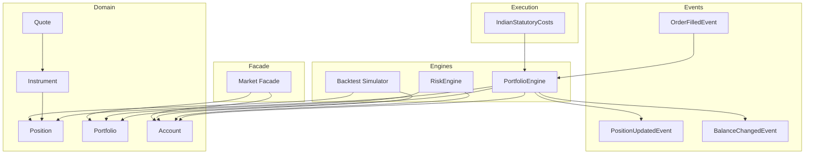
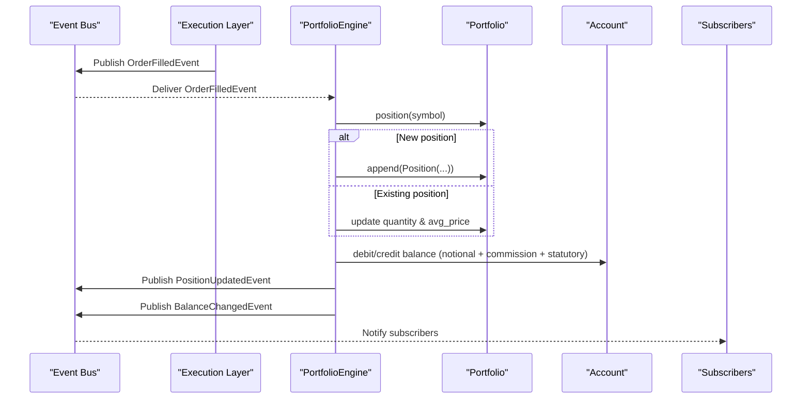
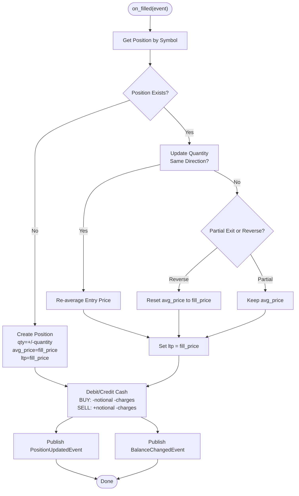
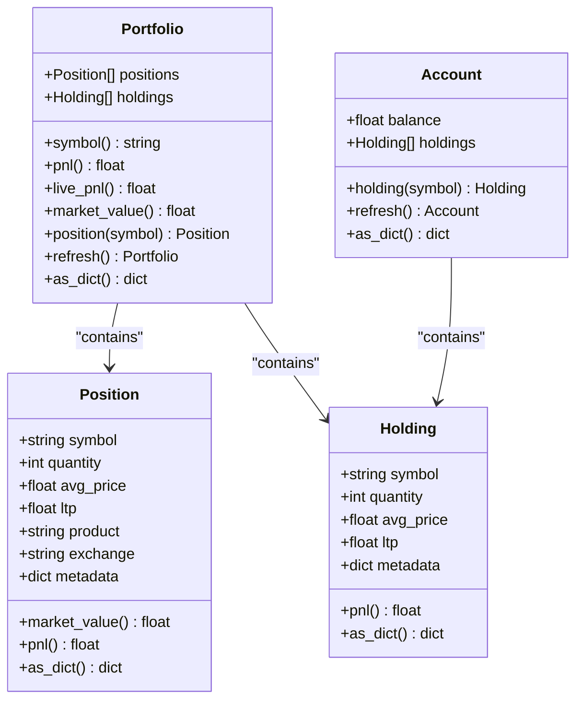
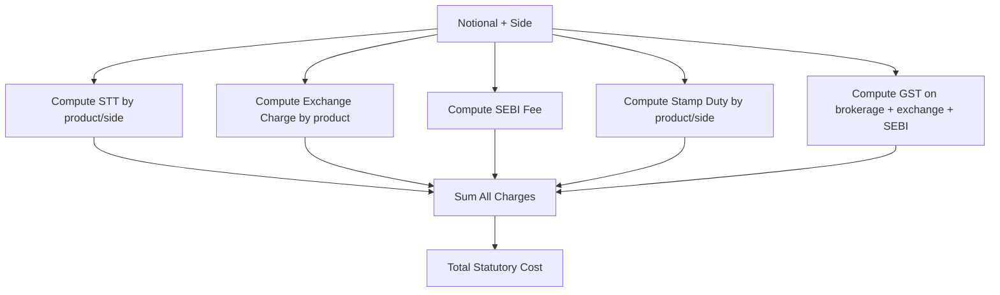
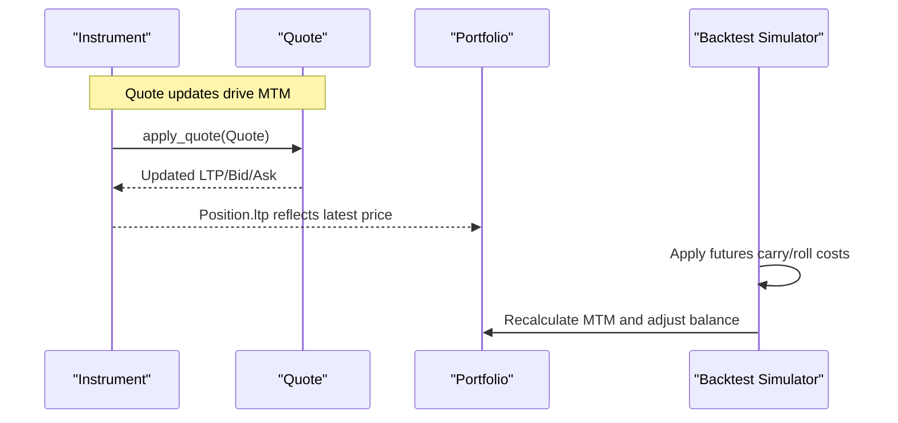
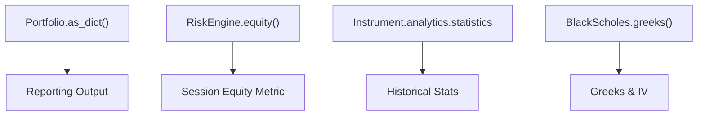
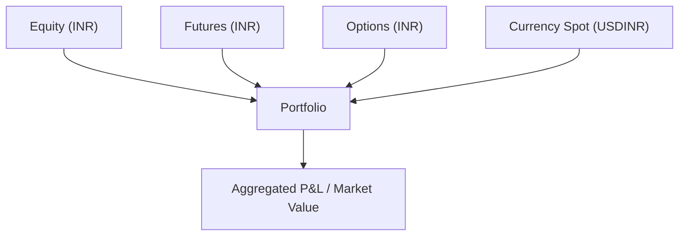
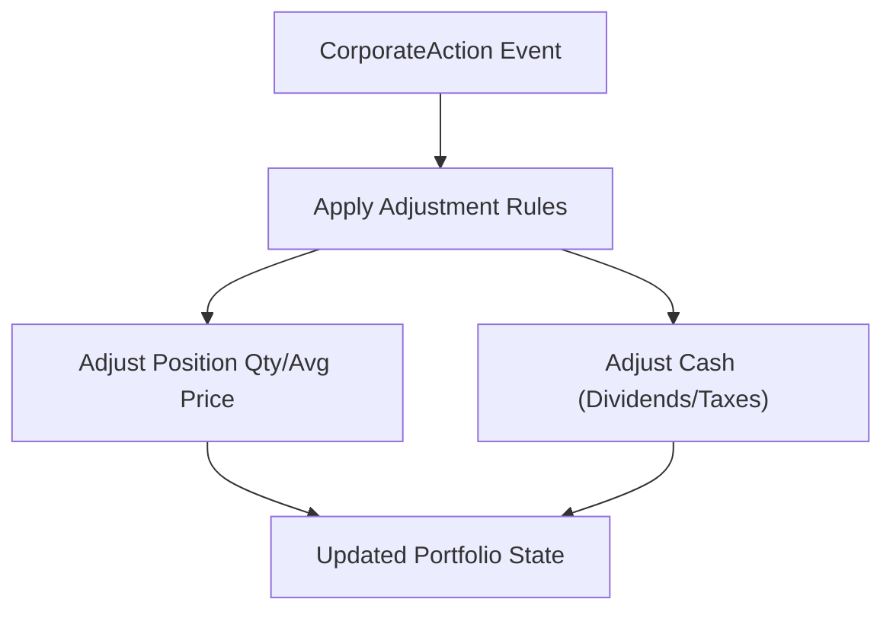
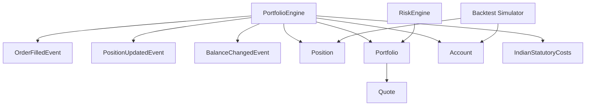

# Portfolio Engine

<cite>
**Referenced Files in This Document**
- [portfolio_engine.py](file://ntrade/engines/portfolio_engine.py)
- [portfolio.py](file://ntrade/domain/portfolio.py)
- [order.py](file://ntrade/events/order.py)
- [portfolio_events.py](file://ntrade/events/portfolio.py)
- [costs.py](file://ntrade/execution/costs.py)
- [quote.py](file://ntrade/domain/market/quote.py)
- [base.py](file://ntrade/domain/instruments/base.py)
- [simulator.py](file://ntrade/backtest/simulator.py)
- [risk_engine.py](file://ntrade/engines/risk_engine.py)
- [facade.py](file://ntrade/facade.py)
</cite>

## Table of Contents
1. [Introduction](#introduction)
2. [Project Structure](#project-structure)
3. [Core Components](#core-components)
4. [Architecture Overview](#architecture-overview)
5. [Detailed Component Analysis](#detailed-component-analysis)
6. [Dependency Analysis](#dependency-analysis)
7. [Performance Considerations](#performance-considerations)
8. [Troubleshooting Guide](#troubleshooting-guide)
9. [Conclusion](#conclusion)
10. [Appendices](#appendices)

## Introduction
This document explains the PortfolioEngine responsible for P&L tracking and portfolio state management. It covers position accounting, cost basis calculations, unrealized and realized P&L computation, integration with order fills and market data for mark-to-market valuation, portfolio analytics, performance metrics, reporting capabilities, multi-asset portfolio management, currency handling via instruments, corporate action metadata, and tax lot considerations. The goal is to provide both a conceptual overview and code-level details so that readers can understand how positions are updated, how costs are applied, and how P&L is derived across live, paper, and backtest environments.

## Project Structure
The portfolio subsystem spans several modules:
- Domain models define Position, Holding, Portfolio, and Account.
- The PortfolioEngine consumes OrderFilledEvent to update positions and cash balances.
- Market quotes feed mark-to-market updates through Instrument quote state.
- Execution costs model statutory charges and slippage/commission.
- Backtest simulator applies futures carry and roll costs and performs MTM.
- Risk engine computes session equity and enforces circuit breakers.
- Facade exposes portfolio/account queries.

**Diagram sources**
- [portfolio_engine.py:15-69](file://ntrade/engines/portfolio_engine.py#L15-L69)
- [portfolio.py:19-135](file://ntrade/domain/portfolio.py#L19-L135)
- [order.py:50-64](file://ntrade/events/order.py#L50-L64)
- [portfolio_events.py:11-27](file://ntrade/events/portfolio.py#L11-L27)
- [costs.py:70-174](file://ntrade/execution/costs.py#L70-L174)
- [quote.py:9-72](file://ntrade/domain/market/quote.py#L9-L72)
- [base.py:50-94](file://ntrade/domain/instruments/base.py#L50-L94)
- [simulator.py:161-191](file://ntrade/backtest/simulator.py#L161-L191)
- [risk_engine.py:44-47](file://ntrade/engines/risk_engine.py#L44-L47)
- [facade.py:80-86](file://ntrade/facade.py#L80-L86)

**Section sources**
- [portfolio_engine.py:1-69](file://ntrade/engines/portfolio_engine.py#L1-L69)
- [portfolio.py:1-173](file://ntrade/domain/portfolio.py#L1-L173)
- [order.py:1-91](file://ntrade/events/order.py#L1-L91)
- [portfolio_events.py:1-27](file://ntrade/events/portfolio.py#L1-L27)
- [costs.py:1-285](file://ntrade/execution/costs.py#L1-L285)
- [quote.py:1-91](file://ntrade/domain/market/quote.py#L1-L91)
- [base.py:38-237](file://ntrade/domain/instruments/base.py#L38-L237)
- [simulator.py:161-191](file://ntrade/backtest/simulator.py#L161-L191)
- [risk_engine.py:1-141](file://ntrade/engines/risk_engine.py#L1-L141)
- [facade.py:1-101](file://ntrade/facade.py#L1-L101)

## Core Components
- Position and Holding: lightweight read models carrying symbol, quantity, avg_price, ltp, product/exchange, and computed pnl/market_value.
- Portfolio: aggregates positions and holdings; provides total pnl, market value, broker-backed refresh, and dictionary serialization.
- Account: holds balance and holdings; supports broker-backed refresh and dictionary serialization.
- PortfolioEngine: event-driven updater that processes OrderFilledEvent to net positions, average entry price, debit/credit cash (notional + commission + statutory), and publish PositionUpdatedEvent and BalanceChangedEvent.
- Costs: IndianStatutoryCosts models STT, exchange charges, SEBI fee, GST, stamp duty; FuturesCarryCosts models daily carry and roll costs for futures.
- Quote: immutable market snapshot used by instruments for MTM and derived metrics.
- RiskEngine: computes session equity (cash + MTM) and enforces circuit breakers.
- Backtest Simulator: applies futures carry/roll and performs MTM adjustments to account balance.
- Facade: exposes portfolio/account queries for consumers.

**Section sources**
- [portfolio.py:19-135](file://ntrade/domain/portfolio.py#L19-L135)
- [portfolio_engine.py:15-69](file://ntrade/engines/portfolio_engine.py#L15-L69)
- [costs.py:70-174](file://ntrade/execution/costs.py#L70-L174)
- [quote.py:9-72](file://ntrade/domain/market/quote.py#L9-L72)
- [risk_engine.py:44-47](file://ntrade/engines/risk_engine.py#L44-L47)
- [simulator.py:161-191](file://ntrade/backtest/simulator.py#L161-L191)
- [facade.py:80-86](file://ntrade/facade.py#L80-L86)

## Architecture Overview
The PortfolioEngine is an event-driven component that maintains the read model of positions and cash after each fill. It uses the context’s portfolio and account objects and publishes events to downstream consumers. Market data flows into instruments via Quote updates; PortfolioEngine uses fill prices directly for MTM on the position at fill time, while ongoing MTM relies on instrument quotes or external pricing feeds.

**Diagram sources**
- [portfolio_engine.py:20-69](file://ntrade/engines/portfolio_engine.py#L20-L69)
- [order.py:50-64](file://ntrade/events/order.py#L50-L64)
- [portfolio_events.py:11-27](file://ntrade/events/portfolio.py#L11-L27)

## Detailed Component Analysis

### PortfolioEngine: Fill Processing and Position Accounting
- Consumes OrderFilledEvent and nets quantity based on side.
- Creates new Position if none exists; otherwise updates existing position:
  - Same-direction adds average cost weighted by quantities.
  - Partial exit keeps original avg_price.
  - Exit-and-reverse resets avg_price to fill price for residual opposite position.
- Updates ltp to fill price at execution time.
- Adjusts account balance:
  - BUY: subtract notional and charges.
  - SELL: add notional minus charges.
- Publishes PositionUpdatedEvent and BalanceChangedEvent with current state.

**Diagram sources**
- [portfolio_engine.py:20-69](file://ntrade/engines/portfolio_engine.py#L20-L69)

**Section sources**
- [portfolio_engine.py:20-69](file://ntrade/engines/portfolio_engine.py#L20-L69)

### Position and Portfolio Models: P&L and MTM
- Position.pnl computes unrealized P&L as (ltp - avg_price) * quantity.
- Position.market_value computes quantity * ltp.
- Portfolio.pnl sums all position pnl; Portfolio.market_value sums all position market values.
- Portfolio.refresh pulls fresh positions/holdings from broker adapter when available.
- Account tracks balance and holdings; refresh pulls from broker.

**Diagram sources**
- [portfolio.py:19-135](file://ntrade/domain/portfolio.py#L19-L135)

**Section sources**
- [portfolio.py:19-135](file://ntrade/domain/portfolio.py#L19-L135)

### Cost Basis and Statutory Charges
- IndianStatutoryCosts models STT, exchange transaction charges, SEBI fee, GST, and stamp duty.
- Product-specific schedules apply for equity delivery/intraday vs F&O.
- total_cost(notional, side) returns full charge per leg; brokerage can be overridden per call.
- FuturesCarryCosts models daily carry and one-off roll costs for futures contracts.

**Diagram sources**
- [costs.py:122-174](file://ntrade/execution/costs.py#L122-L174)

**Section sources**
- [costs.py:70-174](file://ntrade/execution/costs.py#L70-L174)
- [costs.py:207-258](file://ntrade/execution/costs.py#L207-L258)

### Mark-to-Market Integration
- At fill time, PortfolioEngine sets position.ltp to fill_price and adjusts cash accordingly.
- Ongoing MTM relies on instrument Quote updates; Portfolio.live_pnl attempts to fetch broker-reported live P&L when available.
- Backtest Simulator deducts futures carry and roll costs and recalculates MTM per close.

**Diagram sources**
- [quote.py:9-72](file://ntrade/domain/market/quote.py#L9-L72)
- [portfolio.py:84-95](file://ntrade/domain/portfolio.py#L84-L95)
- [simulator.py:161-191](file://ntrade/backtest/simulator.py#L161-L191)

**Section sources**
- [quote.py:9-72](file://ntrade/domain/market/quote.py#L9-L72)
- [portfolio.py:84-95](file://ntrade/domain/portfolio.py#L84-L95)
- [simulator.py:161-191](file://ntrade/backtest/simulator.py#L161-L191)

### Portfolio Analytics and Reporting
- Portfolio.as_dict serializes positions, holdings, pnl, and market_value for reporting.
- RiskEngine.equity computes session equity as cash + MTM for risk checks and reporting.
- Instrument.analytics.statistics provides historical stats (mean, std, volatility, return).
- Greeks and Black-Scholes support options analytics (delta, gamma, theta, vega, rho, IV).

**Diagram sources**
- [portfolio.py:126-135](file://ntrade/domain/portfolio.py#L126-L135)
- [risk_engine.py:44-47](file://ntrade/engines/risk_engine.py#L44-L47)
- [capabilities.py:299-332](file://ntrade/domain/instruments/capabilities.py#L299-L332)
- [greeks.py:46-120](file://ntrade/domain/analytics/greeks.py#L46-L120)

**Section sources**
- [portfolio.py:126-135](file://ntrade/domain/portfolio.py#L126-L135)
- [risk_engine.py:44-47](file://ntrade/engines/risk_engine.py#L44-L47)
- [capabilities.py:299-332](file://ntrade/domain/instruments/capabilities.py#L299-L332)
- [greeks.py:46-120](file://ntrade/domain/analytics/greeks.py#L46-L120)

### Multi-Asset Portfolio Management
- Instruments carry currency metadata (e.g., INR) enabling currency-aware modeling.
- Portfolio aggregates positions across asset classes (equities, indices, commodities, currencies, derivatives).
- Broker adapters normalize positions/holdings into domain objects for consistent processing.

**Diagram sources**
- [base.py:50-94](file://ntrade/domain/instruments/base.py#L50-L94)
- [portfolio.py:63-135](file://ntrade/domain/portfolio.py#L63-L135)

**Section sources**
- [base.py:50-94](file://ntrade/domain/instruments/base.py#L50-L94)
- [portfolio.py:63-135](file://ntrade/domain/portfolio.py#L63-L135)

### Currency Conversion and Corporate Actions
- Instruments store currency metadata; conversion logic should be implemented at the reporting layer using instrument.currency and external FX rates.
- CorporateAction records dividend/split/bonus/merger metadata per instrument; application should apply adjustments to positions and cost basis when processing these events.

**Diagram sources**
- [base.py:38-48](file://ntrade/domain/instruments/base.py#L38-L48)

**Section sources**
- [base.py:38-48](file://ntrade/domain/instruments/base.py#L38-L48)

### Tax Lot Accounting
- Current Position model does not maintain multiple tax lots; it averages cost basis per symbol.
- For tax lot accounting, extend Position to track individual lots with acquisition dates/prices and apply FIFO/LIFO/SPI strategies on exits.
- Until implemented, realized P&L reflects aggregated average-cost method.

[No sources needed since this section provides general guidance]

## Dependency Analysis
PortfolioEngine depends on:
- Events: OrderFilledEvent input; PositionUpdatedEvent and BalanceChangedEvent outputs.
- Domain: Position, Portfolio, Account.
- Execution: statutory costs influence cash debits/credits.
- Market: Quote updates inform MTM indirectly via instrument state.
- Risk: Session equity calculation uses portfolio MTM.
- Backtest: Simulator applies additional costs and MTM adjustments.

**Diagram sources**
- [portfolio_engine.py:15-69](file://ntrade/engines/portfolio_engine.py#L15-L69)
- [order.py:50-64](file://ntrade/events/order.py#L50-L64)
- [portfolio_events.py:11-27](file://ntrade/events/portfolio.py#L11-L27)
- [portfolio.py:19-135](file://ntrade/domain/portfolio.py#L19-L135)
- [costs.py:70-174](file://ntrade/execution/costs.py#L70-L174)
- [quote.py:9-72](file://ntrade/domain/market/quote.py#L9-L72)
- [risk_engine.py:44-47](file://ntrade/engines/risk_engine.py#L44-L47)
- [simulator.py:161-191](file://ntrade/backtest/simulator.py#L161-L191)

**Section sources**
- [portfolio_engine.py:15-69](file://ntrade/engines/portfolio_engine.py#L15-L69)
- [portfolio.py:19-135](file://ntrade/domain/portfolio.py#L19-L135)
- [order.py:50-64](file://ntrade/events/order.py#L50-L64)
- [portfolio_events.py:11-27](file://ntrade/events/portfolio.py#L11-L27)
- [costs.py:70-174](file://ntrade/execution/costs.py#L70-L174)
- [quote.py:9-72](file://ntrade/domain/market/quote.py#L9-L72)
- [risk_engine.py:44-47](file://ntrade/engines/risk_engine.py#L44-L47)
- [simulator.py:161-191](file://ntrade/backtest/simulator.py#L161-L191)

## Performance Considerations
- Event-driven updates minimize synchronous coupling; ensure event bus throughput is sufficient for high-frequency fills.
- Position lookups are linear in number of positions; consider indexing by symbol for large portfolios.
- MTM computations sum over positions; batch operations where possible.
- Statutory cost calculations are additive and constant-time per fill; avoid redundant recomputation.
- Backtest carry/roll deductions run per bar; limit frequency to trading days and expiry windows.

[No sources needed since this section provides general guidance]

## Troubleshooting Guide
Common issues and resolutions:
- Incorrect avg_price after partial exits: verify same-direction vs reverse logic; partial exits should preserve original avg_price.
- Cash imbalance: ensure statutory charges and commission are correctly included in debit/credit calculations.
- MTM discrepancies: confirm instrument Quote updates are applied and ltp reflects latest price; check broker live_pnl availability.
- Futures carry/roll anomalies: validate expiry window and daily carry accrual logic; ensure roll cost applied once per contract.
- Risk halts: inspect equity drift and drawdown thresholds; confirm start balance and peak equity tracking.

**Section sources**
- [portfolio_engine.py:20-69](file://ntrade/engines/portfolio_engine.py#L20-L69)
- [costs.py:122-174](file://ntrade/execution/costs.py#L122-L174)
- [portfolio.py:84-95](file://ntrade/domain/portfolio.py#L84-L95)
- [simulator.py:161-191](file://ntrade/backtest/simulator.py#L161-L191)
- [risk_engine.py:113-128](file://ntrade/engines/risk_engine.py#L113-L128)

## Conclusion
The PortfolioEngine provides a robust, event-driven foundation for position accounting, cost basis averaging, and cash balance updates upon order fills. Combined with domain models for positions and accounts, statutory cost modeling, and market data integration, it enables accurate unrealized and realized P&L computation. Extensions for tax lot accounting, currency conversion, and corporate actions can be layered atop the existing structure to meet advanced requirements.

[No sources needed since this section summarizes without analyzing specific files]

## Appendices

### Example Portfolio Queries and Reporting
- Retrieve portfolio snapshot: use facade to access portfolio and account composites.
- Query positions by symbol: Portfolio.position(symbol) returns Position or None.
- Serialize for reporting: Portfolio.as_dict() includes positions, holdings, pnl, market_value.
- Session equity: RiskEngine.equity() computes cash + MTM for risk reporting.

**Section sources**
- [facade.py:80-86](file://ntrade/facade.py#L80-L86)
- [portfolio.py:101-105](file://ntrade/domain/portfolio.py#L101-L105)
- [portfolio.py:126-135](file://ntrade/domain/portfolio.py#L126-L135)
- [risk_engine.py:44-47](file://ntrade/engines/risk_engine.py#L44-L47)

### Historical Analysis and Multi-Asset Management
- Use Instrument.analytics.statistics for historical stats (mean, std, volatility, return).
- Aggregate across asset classes via Portfolio; ensure currency metadata is considered for cross-currency reporting.
- Apply corporate actions to adjust positions and cost basis in reporting layer.

**Section sources**
- [capabilities.py:299-332](file://ntrade/domain/instruments/capabilities.py#L299-L332)
- [base.py:50-94](file://ntrade/domain/instruments/base.py#L50-L94)
- [base.py:38-48](file://ntrade/domain/instruments/base.py#L38-L48)