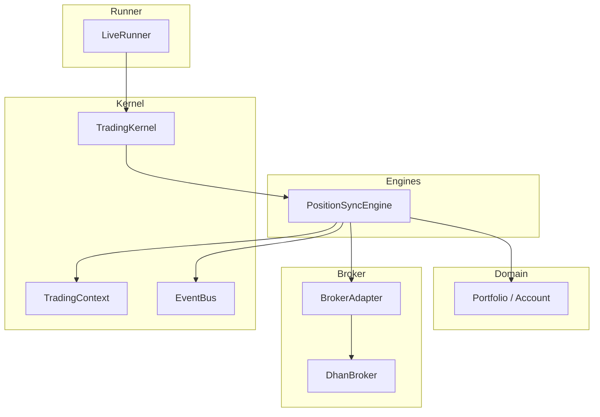
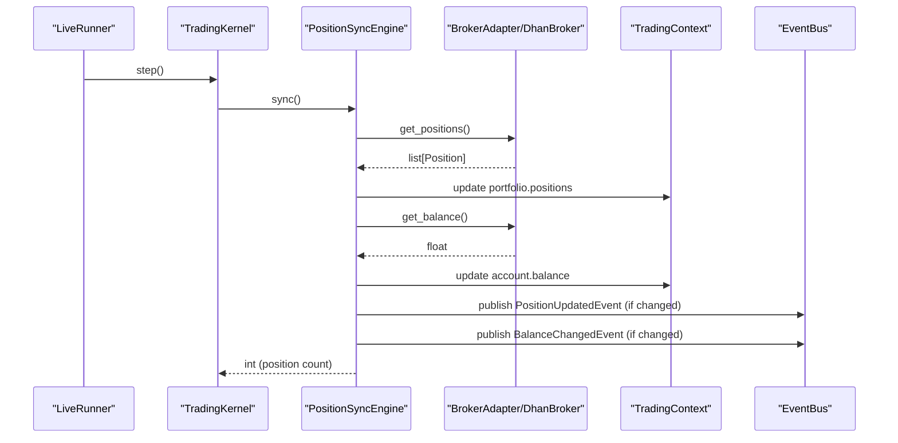
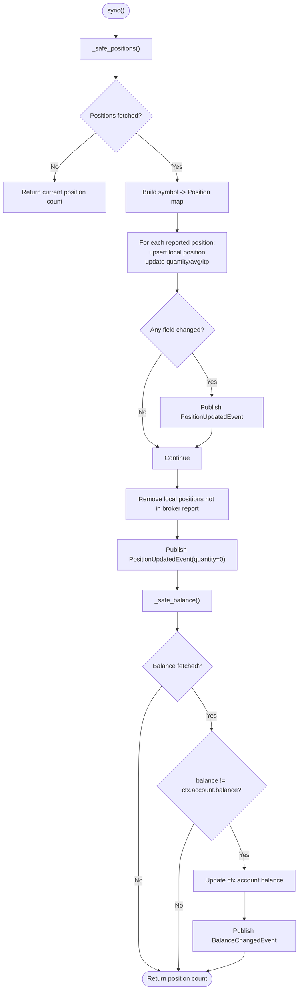
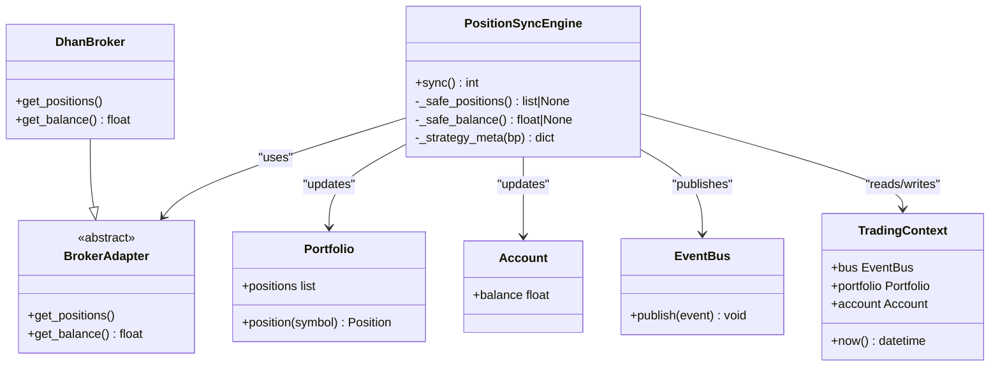

# Position Sync Engine

<cite>
**Referenced Files in This Document**
- [position_sync.py](file://ntrade/engines/position_sync.py)
- [portfolio.py](file://ntrade/domain/portfolio.py)
- [base.py](file://ntrade/brokers/base.py)
- [dhan.py](file://ntrade/brokers/dhan.py)
- [event_bus.py](file://ntrade/kernel/event_bus.py)
- [context.py](file://ntrade/kernel/context.py)
- [session.py](file://ntrade/kernel/session.py)
- [live_runner.py](file://ntrade/runner/live_runner.py)
- [portfolio_events.py](file://ntrade/events/portfolio.py)
- [test_live_execution.py](file://tests/test_live_execution.py)
</cite>

## Table of Contents
1. Introduction
2. Project Structure
3. Core Components
4. Architecture Overview
5. Detailed Component Analysis
6. Dependency Analysis
7. Performance Considerations
8. Troubleshooting Guide
9. Conclusion
10. Appendices

## Introduction
The PositionSyncEngine synchronizes the kernel’s local portfolio and account state with the broker’s authoritative state during live trading. It reconciles positions and cash, publishes canonical events for downstream consumers (strategies, recording, risk), and is resilient to transient network failures by preserving existing state when broker calls fail. The engine is invoked periodically by the LiveRunner to keep the kernel consistent with external activity such as manual trades or corporate actions.

## Project Structure
PositionSyncEngine lives under engines and integrates with:
- Domain models for positions and accounts
- Broker adapters for data retrieval
- Event bus for canonical event publishing
- TradingContext for shared mutable state
- TradingKernel for orchestration and exposure
- LiveRunner for scheduling periodic syncs

**Diagram sources**
- [position_sync.py:22-80](file://ntrade/engines/position_sync.py#L22-L80)
- [portfolio.py:63-135](file://ntrade/domain/portfolio.py#L63-L135)
- [base.py:25-163](file://ntrade/brokers/base.py#L25-L163)
- [dhan.py:498-540](file://ntrade/brokers/dhan.py#L498-L540)
- [event_bus.py:24-81](file://ntrade/kernel/event_bus.py#L24-L81)
- [context.py:17-79](file://ntrade/kernel/context.py#L17-L79)
- [session.py:165-169](file://ntrade/kernel/session.py#L165-L169)
- [live_runner.py:75-95](file://ntrade/runner/live_runner.py#L75-L95)

**Section sources**
- [position_sync.py:1-110](file://ntrade/engines/position_sync.py#L1-L110)
- [session.py:165-169](file://ntrade/kernel/session.py#L165-L169)
- [live_runner.py:75-95](file://ntrade/runner/live_runner.py#L75-L95)

## Core Components
- PositionSyncEngine: Performs reconciliation of broker-reported positions and balance into the kernel’s Portfolio and Account read models; publishes canonical events only on actual changes.
- Portfolio and Account: Read models that hold positions and holdings and expose derived metrics like market value and P&L.
- BrokerAdapter and DhanBroker: Abstraction and concrete implementation for fetching positions and balance from the broker.
- EventBus: Synchronous publish/subscribe bus used to emit PositionUpdatedEvent and BalanceChangedEvent.
- TradingContext: Shared mutable state holding portfolio, account, clock, and bus.
- TradingKernel: Wires engines and exposes sync_positions() which delegates to PositionSyncEngine.
- LiveRunner: Periodically invokes kernel.sync_positions() based on a configurable interval.

**Section sources**
- [position_sync.py:22-110](file://ntrade/engines/position_sync.py#L22-L110)
- [portfolio.py:19-135](file://ntrade/domain/portfolio.py#L19-L135)
- [base.py:25-163](file://ntrade/brokers/base.py#L25-L163)
- [dhan.py:498-540](file://ntrade/brokers/dhan.py#L498-L540)
- [event_bus.py:24-81](file://ntrade/kernel/event_bus.py#L24-L81)
- [context.py:17-79](file://ntrade/kernel/context.py#L17-L79)
- [session.py:165-169](file://ntrade/kernel/session.py#L165-L169)
- [live_runner.py:75-95](file://ntrade/runner/live_runner.py#L75-L95)

## Architecture Overview
The sync flow ensures the broker remains the source of truth for positions and cash while keeping the kernel consistent and observable via canonical events.

**Diagram sources**
- [live_runner.py:75-95](file://ntrade/runner/live_runner.py#L75-L95)
- [session.py:165-169](file://ntrade/kernel/session.py#L165-L169)
- [position_sync.py:28-80](file://ntrade/engines/position_sync.py#L28-L80)
- [base.py:145-149](file://ntrade/brokers/base.py#L145-L149)
- [dhan.py:498-540](file://ntrade/brokers/dhan.py#L498-L540)
- [event_bus.py:47-66](file://ntrade/kernel/event_bus.py#L47-L66)

## Detailed Component Analysis

### PositionSyncEngine
Responsibilities:
- Safely fetch broker positions and balance
- Upsert local positions and drop stale ones
- Update account balance if changed
- Publish canonical events only when state actually changes
- Preserve existing state on transient broker errors

Key behaviors:
- Drift detection compares quantity, avg_price, ltp per position before emitting updates
- Strategy metadata adoption prefers broker-reported strategy name when present
- Failure safety returns previous position count and avoids wiping portfolio or zeroing balance

**Diagram sources**
- [position_sync.py:28-80](file://ntrade/engines/position_sync.py#L28-L80)
- [position_sync.py:88-109](file://ntrade/engines/position_sync.py#L88-L109)

**Section sources**
- [position_sync.py:22-110](file://ntrade/engines/position_sync.py#L22-L110)

### Portfolio and Account Models
- Position holds symbol, quantity, avg_price, ltp, product, exchange, and metadata; provides derived pnl and market_value
- Portfolio aggregates positions and supports lookup, iteration, and refresh from broker
- Account holds balance and holdings; supports refresh from broker

These models are mutated by PositionSyncEngine during reconciliation and observed by other engines via events.

**Section sources**
- [portfolio.py:19-135](file://ntrade/domain/portfolio.py#L19-L135)

### BrokerAdapter and DhanBroker
- BrokerAdapter defines the contract for positions, balance, holdings, and lifecycle
- DhanBroker implements get_positions() and get_balance(), ensuring token refresh and safe conversions; raises on failure to preserve kernel state

Important notes:
- get_positions() raises on failure so PositionSyncEngine can detect transient errors and skip reconciliation
- get_balance() returns raw float without collapsing to 0.0 on error; consumers guard themselves

**Section sources**
- [base.py:145-149](file://ntrade/brokers/base.py#L145-L149)
- [dhan.py:498-540](file://ntrade/brokers/dhan.py#L498-L540)

### Event Bus and Events
- EventBus serializes dispatches and records history for replay/audit
- PositionUpdatedEvent and BalanceChangedEvent are published only when values change

**Section sources**
- [event_bus.py:24-81](file://ntrade/kernel/event_bus.py#L24-L81)
- [portfolio_events.py:11-27](file://ntrade/events/portfolio.py#L11-L27)

### TradingContext and TradingKernel
- TradingContext holds bus, clock, portfolio, account, and thread-safe locks
- TradingKernel wires engines and exposes sync_positions() which delegates to PositionSyncEngine

**Section sources**
- [context.py:17-79](file://ntrade/kernel/context.py#L17-L79)
- [session.py:165-169](file://ntrade/kernel/session.py#L165-L169)

### LiveRunner Scheduling
- LiveRunner.step() periodically calls kernel.sync_positions() based on sync_interval
- Maintains counters and logs for observability

**Section sources**
- [live_runner.py:75-95](file://ntrade/runner/live_runner.py#L75-L95)

## Dependency Analysis
PositionSyncEngine depends on:
- BrokerAdapter for data retrieval
- Portfolio/Account domain models for state mutation
- EventBus for canonical event emission
- TradingContext for shared state access

**Diagram sources**
- [position_sync.py:22-110](file://ntrade/engines/position_sync.py#L22-L110)
- [base.py:25-163](file://ntrade/brokers/base.py#L25-L163)
- [dhan.py:498-540](file://ntrade/brokers/dhan.py#L498-L540)
- [portfolio.py:63-135](file://ntrade/domain/portfolio.py#L63-L135)
- [event_bus.py:24-81](file://ntrade/kernel/event_bus.py#L24-L81)
- [context.py:17-79](file://ntrade/kernel/context.py#L17-L79)

**Section sources**
- [position_sync.py:22-110](file://ntrade/engines/position_sync.py#L22-L110)
- [base.py:25-163](file://ntrade/brokers/base.py#L25-L163)
- [dhan.py:498-540](file://ntrade/brokers/dhan.py#L498-L540)
- [portfolio.py:63-135](file://ntrade/domain/portfolio.py#L63-L135)
- [event_bus.py:24-81](file://ntrade/kernel/event_bus.py#L24-L81)
- [context.py:17-79](file://ntrade/kernel/context.py#L17-L79)

## Performance Considerations
- Incremental updates: PositionSyncEngine emits events only when fields change, minimizing downstream processing
- Efficient upsert: Builds a symbol-to-position map once per sync and iterates local positions once to drop stale entries
- Safe numeric parsing: _safe_float prevents exceptions from malformed broker responses
- Large portfolios:
  - Consider batching or incremental reconciliation strategies if broker APIs support partial queries
  - Use indexes or caches keyed by symbol to reduce repeated lookups
  - Tune LiveRunner.sync_interval to balance freshness vs. API load
- Network resilience: Transient failures return previous state, avoiding unnecessary recomputation and preventing cascading resets

[No sources needed since this section provides general guidance]

## Troubleshooting Guide
Common issues and resolutions:
- Network failure during sync:
  - Behavior: sync() returns previous position count; no events emitted; portfolio and balance unchanged
  - Action: Verify broker connectivity; retry later; monitor sync intervals
- Stale positions after broker close:
  - Behavior: Positions not reported by broker are removed and cleared via events
  - Action: Confirm broker state; ensure correct symbols/exchanges
- Metadata drift:
  - Behavior: If broker reports a strategy name, it overwrites local metadata
  - Action: Validate broker metadata; consider customizing mapping if needed
- Non-numeric balance or price:
  - Behavior: _safe_balance and _safe_float handle conversion errors gracefully
  - Action: Inspect broker response format; add validation at adapter layer if necessary

Evidence from tests:
- Transient failure preserves state and emits no events
- Quiet sync when nothing changed
- Dropping stale positions and adopting broker strategy metadata

**Section sources**
- [test_live_execution.py:424-454](file://tests/test_live_execution.py#L424-L454)
- [test_live_execution.py:270-283](file://tests/test_live_execution.py#L270-L283)
- [test_live_execution.py:457-491](file://tests/test_live_execution.py#L457-L491)

## Conclusion
PositionSyncEngine provides robust, event-driven reconciliation between the broker and the kernel’s read models. It emphasizes failure safety, minimal event emission, and clear separation of concerns through the BrokerAdapter abstraction. With proper scheduling via LiveRunner and observability through the EventBus, it maintains consistency across live trading environments while supporting performance optimizations for large portfolios.

[No sources needed since this section summarizes without analyzing specific files]

## Appendices

### Manual Reconciliation Procedures
- Trigger a one-off sync: call kernel.sync_positions() directly
- Inspect events: query bus.history for PositionUpdatedEvent and BalanceChangedEvent
- Validate state: check ctx.portfolio.positions and ctx.account.balance
- Force re-sync: restart LiveRunner loop or invoke sync_positions() multiple times until stable

**Section sources**
- [session.py:165-169](file://ntrade/kernel/session.py#L165-L169)
- [event_bus.py:68-71](file://ntrade/kernel/event_bus.py#L68-L71)

### Monitoring Dashboards
- Metrics to track:
  - Last sync timestamp and duration
  - Number of positions reconciled per sync
  - Count of PositionUpdatedEvent and BalanceChangedEvent emitted
  - Error rate from broker.get_positions() and get_balance()
- Alerts:
  - Sync failures exceeding threshold
  - Balance divergence beyond tolerance
  - Stale positions detected (local-only entries)

[No sources needed since this section provides general guidance]