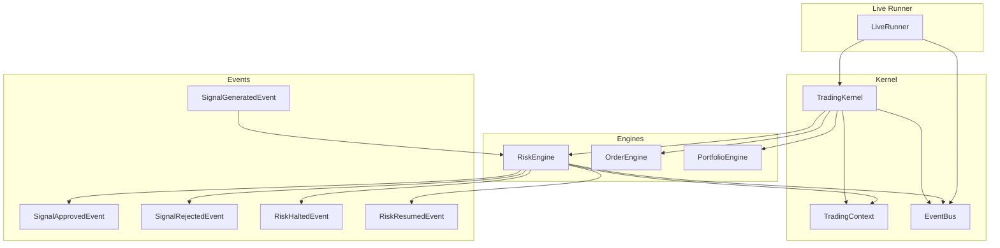
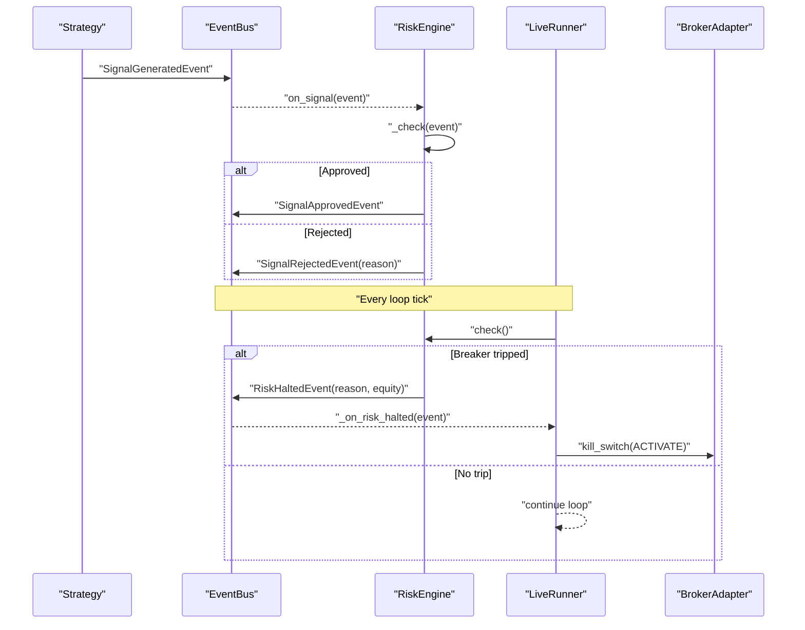
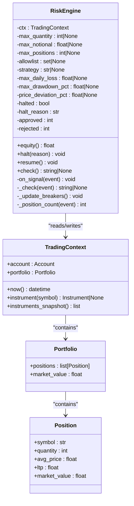
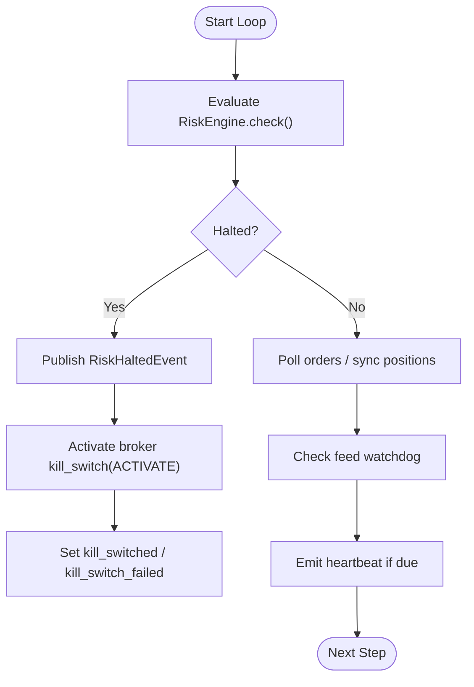
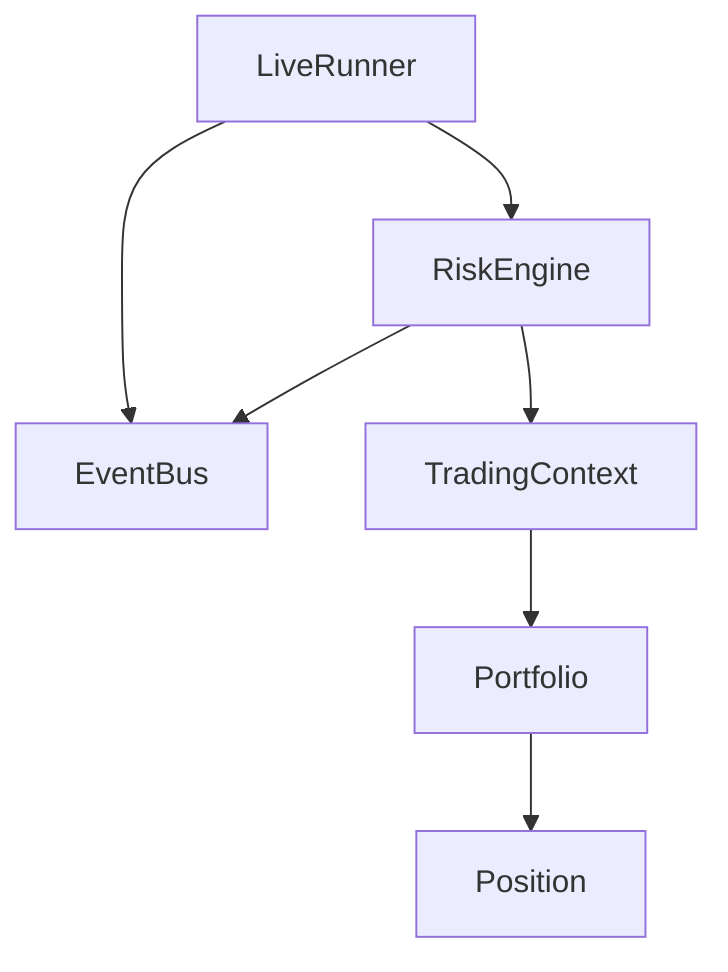
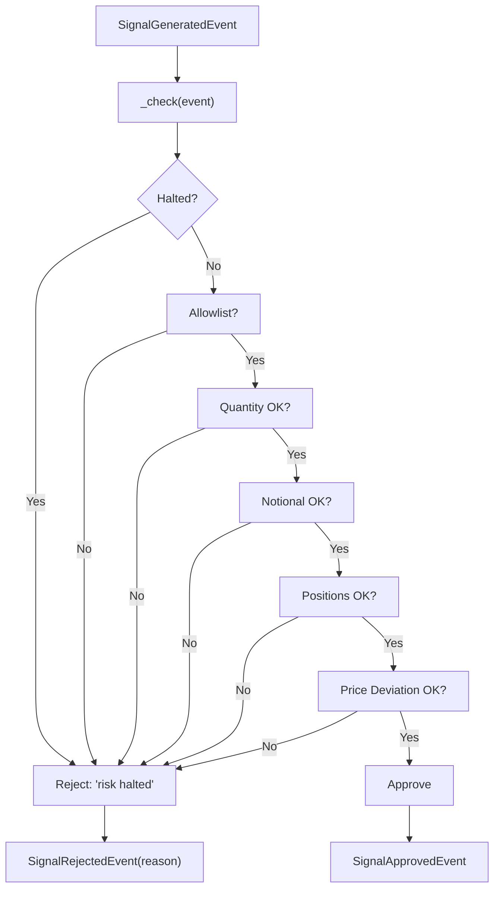
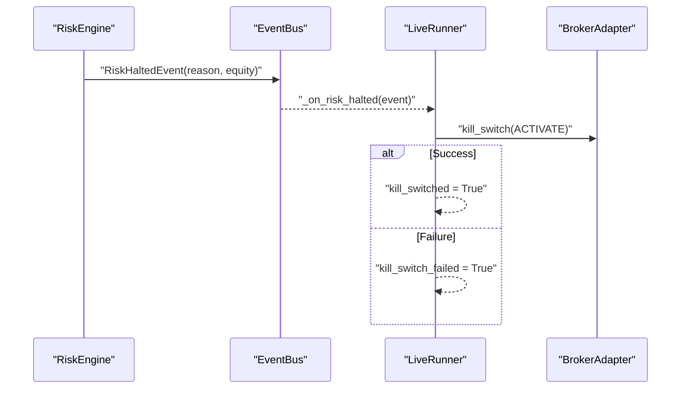

# Risk Engine

<cite>
**Referenced Files in This Document**
- [risk_engine.py](file://ntrade/engines/risk_engine.py)
- [risk.py](file://ntrade/events/risk.py)
- [session.py](file://ntrade/kernel/session.py)
- [live_runner.py](file://ntrade/runner/live_runner.py)
- [event_bus.py](file://ntrade/kernel/event_bus.py)
- [context.py](file://ntrade/kernel/context.py)
- [portfolio.py](file://ntrade/domain/portfolio.py)
- [test_risk_breakers.py](file://tests/test_risk_breakers.py)
- [test_kill_switch_wiring.py](file://tests/test_kill_switch_wiring.py)
</cite>

## Table of Contents
1. [Introduction](#introduction)
2. [Project Structure](#project-structure)
3. [Core Components](#core-components)
4. [Architecture Overview](#architecture-overview)
5. [Detailed Component Analysis](#detailed-component-analysis)
6. [Dependency Analysis](#dependency-analysis)
7. [Performance Considerations](#performance-considerations)
8. [Troubleshooting Guide](#troubleshooting-guide)
9. [Conclusion](#conclusion)
10. [Appendices](#appendices)

## Introduction
This document explains the RiskEngine that enforces circuit breakers, position limits, and risk controls across the trading system. It covers the risk validation pipeline from pre-trade checks to post-trade monitoring, built-in rules (daily loss limits, drawdown halts, price deviation guards), the kill switch mechanism, event propagation, audit logging, and compliance reporting hooks. It also provides guidance for composing custom risk validators and integrating them into the existing pipeline.

## Project Structure
The RiskEngine is part of the engine stack wired by the TradingKernel and orchestrated by the LiveRunner. The key files are:
- ntrade/engines/risk_engine.py — core risk logic and circuit breakers
- ntrade/events/risk.py — risk-related events
- ntrade/kernel/session.py — wiring of engines including RiskEngine
- ntrade/runner/live_runner.py — live loop that evaluates risk between signals and triggers kill switch
- ntrade/kernel/event_bus.py — synchronous pub/sub bus used for event propagation
- ntrade/kernel/context.py — shared mutable state (account, portfolio, instruments)
- ntrade/domain/portfolio.py — Position and Account models used by equity calculations

**Diagram sources**
- [session.py:84](file://ntrade/kernel/session.py#L84)
- [risk_engine.py:19-41](file://ntrade/engines/risk_engine.py#L19-L41)
- [live_runner.py:21-52](file://ntrade/runner/live_runner.py#L21-L52)
- [risk.py:11-52](file://ntrade/events/risk.py#L11-L52)

**Section sources**
- [session.py:38-103](file://ntrade/kernel/session.py#L38-L103)
- [risk_engine.py:1-41](file://ntrade/engines/risk_engine.py#L1-L41)
- [live_runner.py:1-52](file://ntrade/runner/live_runner.py#L1-L52)
- [risk.py:1-52](file://ntrade/events/risk.py#L1-L52)

## Core Components
- RiskEngine: subscribes to SignalGeneratedEvent, performs pre-trade checks, enforces circuit breakers, and publishes approval/rejection or halt/resume events.
- Events: SignalGeneratedEvent, SignalApprovedEvent, SignalRejectedEvent, RiskHaltedEvent, RiskResumedEvent define the contract between strategies, risk, and execution.
- LiveRunner: calls RiskEngine.check() every loop iteration to detect mid-session breaches and reacts to RiskHaltedEvent by activating broker kill switches.
- EventBus: serializes event dispatch, records history, and isolates handler exceptions.
- TradingContext: provides account balance, portfolio positions, and instrument quotes used by risk calculations.
- Portfolio/Account: supply market values and balances for equity computation.

Key responsibilities:
- Pre-trade checks: allowlist, quantity, notional, position count, price deviation guard.
- Circuit breakers: daily loss cap, max drawdown percentage.
- Post-trade monitoring: periodic check() evaluation and feed watchdog-triggered halts.
- Kill switch: broker-level deactivation on halt.

**Section sources**
- [risk_engine.py:19-141](file://ntrade/engines/risk_engine.py#L19-L141)
- [risk.py:11-52](file://ntrade/events/risk.py#L11-L52)
- [live_runner.py:96-103](file://ntrade/runner/live_runner.py#L96-L103)
- [event_bus.py:24-81](file://ntrade/kernel/event_bus.py#L24-L81)
- [context.py:17-79](file://ntrade/kernel/context.py#L17-L79)
- [portfolio.py:19-173](file://ntrade/domain/portfolio.py#L19-L173)

## Architecture Overview
The risk pipeline integrates with the kernel’s event-driven architecture:
- Strategies emit SignalGeneratedEvent.
- RiskEngine screens the signal and either approves it (SignalApprovedEvent) or rejects it (SignalRejectedEvent).
- If a circuit breaker trips, RiskEngine publishes RiskHaltedEvent; LiveRunner activates broker kill switches.
- LiveRunner periodically calls RiskEngine.check() to evaluate breakers even without new signals.

**Diagram sources**
- [risk_engine.py:73-111](file://ntrade/engines/risk_engine.py#L73-L111)
- [live_runner.py:96-103](file://ntrade/runner/live_runner.py#L96-L103)
- [live_runner.py:181-196](file://ntrade/runner/live_runner.py#L181-L196)
- [risk.py:11-52](file://ntrade/events/risk.py#L11-L52)

## Detailed Component Analysis

### RiskEngine Class
Responsibilities:
- Subscribe to SignalGeneratedEvent and route through _check().
- Enforce static limits: allowlist, max_quantity, max_notional, max_positions.
- Enforce dynamic circuit breakers: daily loss cap, max drawdown percentage.
- Compute session equity using account balance and portfolio MTM.
- Publish SignalApprovedEvent or SignalRejectedEvent.
- Publish RiskHaltedEvent when breakers trip; publish RiskResumedEvent on resume.

Pre-trade checks order:
1. Halt state (if halted, reject immediately).
2. Allowlist membership.
3. Quantity limit.
4. Notional limit (price × quantity).
5. Position count limit (per strategy or global).
6. Price deviation guard (fat-finger protection against unverifiable or extreme prices).

Circuit breakers:
- Daily loss: compares start-of-session balance vs current equity.
- Drawdown: tracks peak equity and computes percentage drop.

Post-trade monitoring:
- check() method evaluates breakers without requiring a signal; called by LiveRunner each loop.

Kill switch integration:
- RiskEngine itself does not call broker APIs; it publishes RiskHaltedEvent. LiveRunner handles activation.

**Diagram sources**
- [risk_engine.py:19-141](file://ntrade/engines/risk_engine.py#L19-L141)
- [context.py:17-79](file://ntrade/kernel/context.py#L17-L79)
- [portfolio.py:19-173](file://ntrade/domain/portfolio.py#L19-L173)

**Section sources**
- [risk_engine.py:19-141](file://ntrade/engines/risk_engine.py#L19-L141)

### Risk Events
Events define the contract between components:
- SignalGeneratedEvent: carries symbol, exchange, side, quantity, price, strategy, metadata.
- SignalApprovedEvent: passes approved signal downstream.
- SignalRejectedEvent: includes reason for rejection.
- RiskHaltedEvent: reason and equity snapshot at halt time.
- RiskResumedEvent: indicates resumption after manual or automated recovery.

These events propagate via EventBus, which serializes dispatch and records history for audit and replay.

**Section sources**
- [risk.py:11-52](file://ntrade/events/risk.py#L11-L52)
- [event_bus.py:24-81](file://ntrade/kernel/event_bus.py#L24-L81)

### LiveRunner Integration and Kill Switch
LiveRunner orchestrates the live loop:
- Subscribes to RiskHaltedEvent and OrderFilledEvent.
- Calls RiskEngine.check() every step to catch bleeding positions between signals.
- On RiskHaltedEvent, iterates instruments and attempts broker.kill_switch(ACTIVATE) per instrument’s broker adapter.
- Tracks kill_switched and kill_switch_failed flags for observability.
- Feed watchdog monitors tick freshness; if no ticks for N checks, publishes RiskHaltedEvent to halt trading.

**Diagram sources**
- [live_runner.py:96-103](file://ntrade/runner/live_runner.py#L96-L103)
- [live_runner.py:181-196](file://ntrade/runner/live_runner.py#L181-L196)
- [live_runner.py:154-174](file://ntrade/runner/live_runner.py#L154-L174)

**Section sources**
- [live_runner.py:21-52](file://ntrade/runner/live_runner.py#L21-L52)
- [live_runner.py:96-103](file://ntrade/runner/live_runner.py#L96-L103)
- [live_runner.py:154-174](file://ntrade/runner/live_runner.py#L154-L174)
- [live_runner.py:181-196](file://ntrade/runner/live_runner.py#L181-L196)

### Built-in Risk Rules
- Allowlist: restricts symbols to an explicit set.
- Max quantity: caps order size per signal.
- Max notional: caps price × quantity exposure per signal.
- Max positions: limits number of open positions (global or per strategy).
- Price deviation guard: rejects signals where price deviates beyond threshold from reference (ltp or prev_close); rejects but does not halt.
- Daily loss cap: halts trading when session equity drops below start balance by configured amount.
- Max drawdown: halts trading when equity falls below configured percentage of peak equity.

Behavioral notes:
- Price deviation guard returns a rejection reason without halting.
- Circuit breakers cause a hard halt and reject all subsequent signals until resume().
- check() enables mid-session halts even without new signals.

**Section sources**
- [risk_engine.py:84-111](file://ntrade/engines/risk_engine.py#L84-L111)
- [risk_engine.py:113-128](file://ntrade/engines/risk_engine.py#L113-L128)
- [test_risk_breakers.py:30-110](file://tests/test_risk_breakers.py#L30-L110)

### Custom Risk Validators and Rule Composition
To extend risk control:
- Create a custom validator function that accepts SignalGeneratedEvent and returns None (approve) or a reason string (reject).
- Compose multiple validators in a chain before final approval.
- Optionally integrate with context for additional checks (e.g., volatility filters, correlation constraints).
- For post-trade monitoring, implement a separate monitor that consumes fills and updates exposure metrics, publishing RiskHaltedEvent when thresholds are breached.

Integration points:
- Extend _check() or wrap on_signal() to run composed validators.
- Use EventBus to publish custom risk events for audit and dashboards.
- Ensure idempotency and thread-safety when reading/writing shared state via TradingContext.lock.

Example composition pattern:
- Validate allowlist → validate quantity → validate notional → validate position count → validate price deviation → apply custom validators → approve or reject.

Note: The repository does not include a built-in rule composition framework; compose manually in your RiskEngine subclass or wrapper.

[No sources needed since this section provides general guidance]

### Audit Logging and Compliance Reporting
- EventBus.history captures all events (including risk events) for deterministic replay and audit trails.
- LiveRunner emits HeartbeatEvent with tick counts and open orders for operational visibility.
- RiskHaltedEvent and RiskResumedEvent provide clear markers for compliance reports.
- Optional EventStore can be attached to TradingKernel to persist events for long-term audit.

Compliance recommendations:
- Persist RiskHaltedEvent and RiskResumedEvent with timestamps and equity snapshots.
- Record SignalRejectedEvent reasons for regulatory review.
- Export HeartbeatEvent sequences to monitor feed health and trading continuity.

**Section sources**
- [event_bus.py:47-71](file://ntrade/kernel/event_bus.py#L47-L71)
- [live_runner.py:143-152](file://ntrade/runner/live_runner.py#L143-L152)
- [session.py:71-77](file://ntrade/kernel/session.py#L71-L77)

## Dependency Analysis
RiskEngine depends on:
- EventBus for event subscription and publication.
- TradingContext for account balance, portfolio positions, and instrument quotes.
- Portfolio and Position for MTM calculations.
- LiveRunner for periodic breaker evaluation and kill switch activation.

**Diagram sources**
- [risk_engine.py:19-41](file://ntrade/engines/risk_engine.py#L19-L41)
- [event_bus.py:24-81](file://ntrade/kernel/event_bus.py#L24-L81)
- [context.py:17-79](file://ntrade/kernel/context.py#L17-L79)
- [portfolio.py:63-135](file://ntrade/domain/portfolio.py#L63-L135)
- [live_runner.py:21-52](file://ntrade/runner/live_runner.py#L21-L52)

**Section sources**
- [risk_engine.py:19-41](file://ntrade/engines/risk_engine.py#L19-L41)
- [event_bus.py:24-81](file://ntrade/kernel/event_bus.py#L24-L81)
- [context.py:17-79](file://ntrade/kernel/context.py#L17-L79)
- [portfolio.py:63-135](file://ntrade/domain/portfolio.py#L63-L135)
- [live_runner.py:21-52](file://ntrade/runner/live_runner.py#L21-L52)

## Performance Considerations
- Equity calculation sums portfolio positions; keep position lists bounded and avoid unnecessary recomputation.
- check() is lightweight but called every loop; ensure instrument quote access is efficient.
- EventBus uses a reentrant lock; handler exceptions are swallowed to prevent cascade failures.
- Feed watchdog prevents stale data from causing silent risk violations.

Optimization tips:
- Cache recent instrument quotes where appropriate.
- Limit max_history in EventBus to bound memory usage.
- Avoid heavy computations inside on_signal; defer to background tasks if necessary.

[No sources needed since this section provides general guidance]

## Troubleshooting Guide
Common issues and resolutions:
- Signals rejected due to allowlist or limits: verify configuration parameters and instrument registration.
- Price deviation rejections: ensure timely TickEvent or Quote updates; otherwise, price may be unverifiable.
- Unexpected halts: inspect daily loss and drawdown thresholds; confirm start balance and peak equity tracking.
- Kill switch not activating: verify broker adapter presence and kill_switch capability; check logs for failure flags.

Diagnostic steps:
- Inspect EventBus.history for SignalRejectedEvent and RiskHaltedEvent entries.
- Check LiveRunner.kill_switched and LiveRunner.kill_switch_failed flags.
- Validate feed watchdog warnings indicating frozen feeds.

**Section sources**
- [test_risk_breakers.py:30-110](file://tests/test_risk_breakers.py#L30-L110)
- [test_kill_switch_wiring.py:36-74](file://tests/test_kill_switch_wiring.py#L36-L74)
- [live_runner.py:154-174](file://ntrade/runner/live_runner.py#L154-L174)

## Conclusion
The RiskEngine provides robust pre-trade screening and post-trade monitoring with configurable circuit breakers and a broker-integrated kill switch. Its event-driven design ensures clear separation of concerns, while the LiveRunner guarantees continuous risk evaluation and emergency response. By leveraging built-in rules and extending with custom validators, teams can enforce comprehensive risk policies aligned with operational and compliance requirements.

[No sources needed since this section summarizes without analyzing specific files]

## Appendices

### Risk Validation Pipeline Flow

**Diagram sources**
- [risk_engine.py:84-111](file://ntrade/engines/risk_engine.py#L84-L111)

### Kill Switch Activation Sequence

**Diagram sources**
- [live_runner.py:181-196](file://ntrade/runner/live_runner.py#L181-L196)