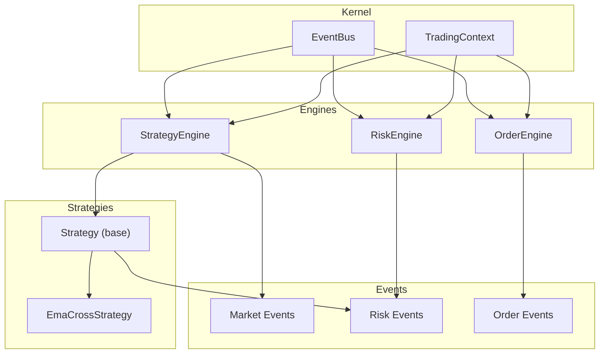
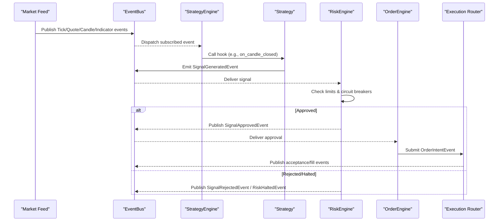
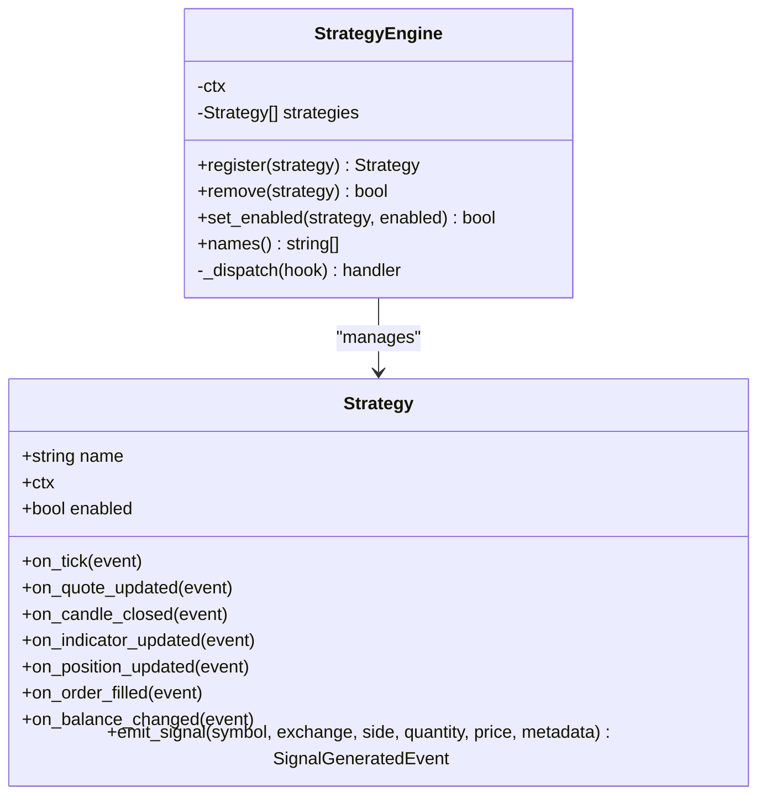
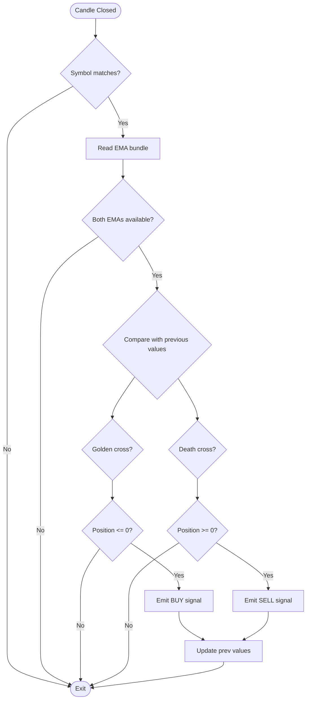
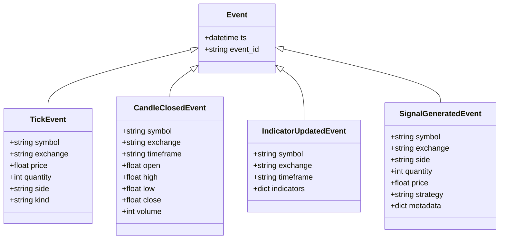
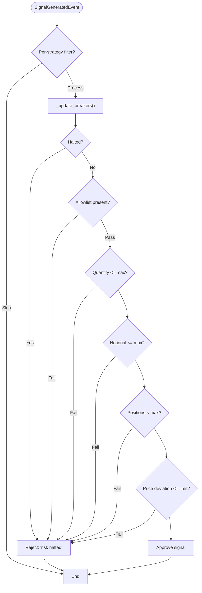
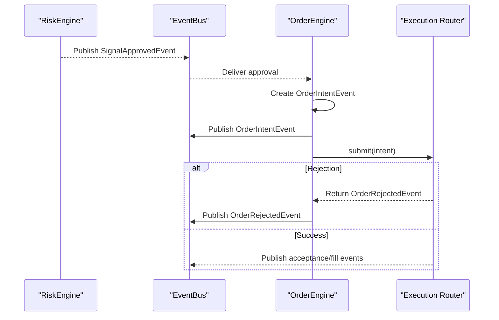
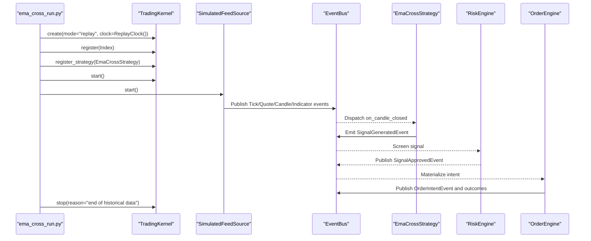
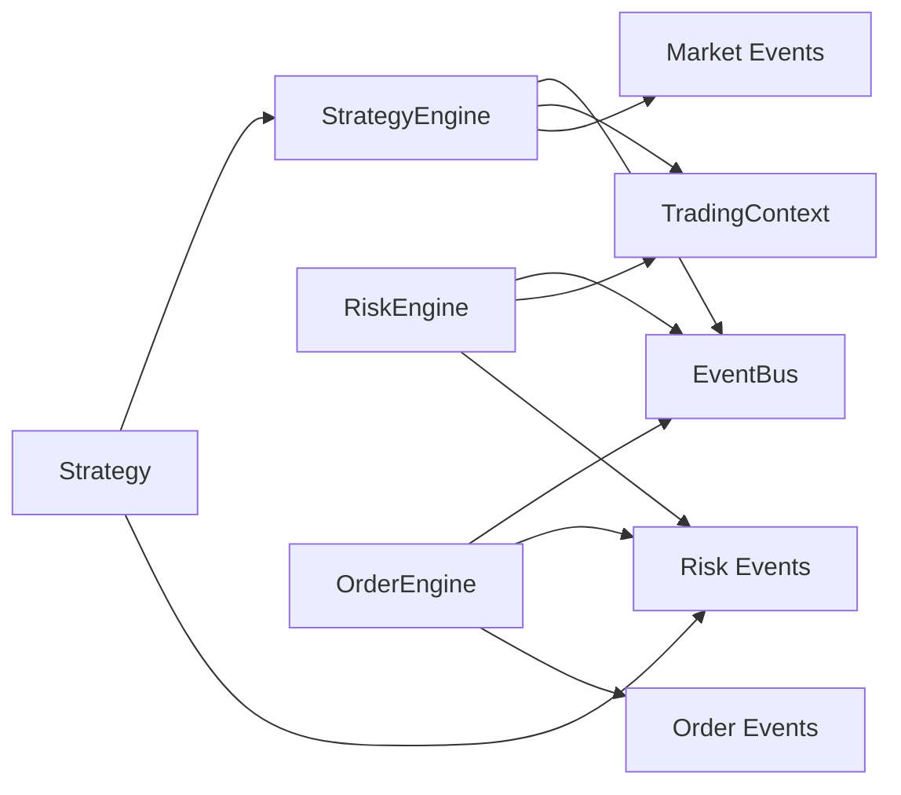

# Strategy Engine

<cite>
**Referenced Files in This Document**
- [strategy_engine.py](file://ntrade/engines/strategy_engine.py)
- [strategies.py](file://ntrade/engines/strategies.py)
- [event_bus.py](file://ntrade/kernel/event_bus.py)
- [risk_engine.py](file://ntrade/engines/risk_engine.py)
- [order_engine.py](file://ntrade/engines/order_engine.py)
- [base.py](file://ntrade/events/base.py)
- [market.py](file://ntrade/events/market.py)
- [risk.py](file://ntrade/events/risk.py)
- [context.py](file://ntrade/kernel/context.py)
- [ema_cross_run.py](file://scripts/ema_cross_run.py)
</cite>

## Table of Contents
1. [Introduction](#introduction)
2. [Project Structure](#project-structure)
3. [Core Components](#core-components)
4. [Architecture Overview](#architecture-overview)
5. [Detailed Component Analysis](#detailed-component-analysis)
6. [Dependency Analysis](#dependency-analysis)
7. [Performance Considerations](#performance-considerations)
8. [Troubleshooting Guide](#troubleshooting-guide)
9. [Conclusion](#conclusion)
10. [Appendices](#appendices)

## Introduction
This document explains the StrategyEngine and its surrounding orchestration for trading strategy execution. It covers how strategies are registered, initialized, and managed; how signals are generated from market events; how orders are dispatched through risk and order engines; and how state is maintained across the lifecycle. It also provides guidance on custom strategy implementation, event-driven patterns, performance monitoring, isolation, error recovery, and debugging techniques.

## Project Structure
The StrategyEngine lives within a kernel that wires together market data, indicators, strategies, risk controls, and order management via an event bus. The key files involved in this documentation are:
- Strategy base class and engine dispatcher
- Built-in example strategy
- Event bus and canonical event types
- Risk and Order engines
- Context for shared state
- A script demonstrating end-to-end flow

**Diagram sources**
- [strategy_engine.py](file://ntrade/engines/strategy_engine.py)
- [strategies.py](file://ntrade/engines/strategies.py)
- [event_bus.py](file://ntrade/kernel/event_bus.py)
- [risk_engine.py](file://ntrade/engines/risk_engine.py)
- [order_engine.py](file://ntrade/engines/order_engine.py)
- [base.py](file://ntrade/events/base.py)
- [market.py](file://ntrade/events/market.py)
- [risk.py](file://ntrade/events/risk.py)
- [context.py](file://ntrade/kernel/context.py)

**Section sources**
- [strategy_engine.py](file://ntrade/engines/strategy_engine.py)
- [strategies.py](file://ntrade/engines/strategies.py)
- [event_bus.py](file://ntrade/kernel/event_bus.py)
- [risk_engine.py](file://ntrade/engines/risk_engine.py)
- [order_engine.py](file://ntrade/engines/order_engine.py)
- [base.py](file://ntrade/events/base.py)
- [market.py](file://ntrade/events/market.py)
- [risk.py](file://ntrade/events/risk.py)
- [context.py](file://ntrade/kernel/context.py)

## Core Components
- Strategy base class: defines hooks for reacting to market/portfolio events and a helper to emit trade signals.
- StrategyEngine: subscribes to canonical events and dispatches them to all registered strategies, isolating errors per strategy.
- EmaCrossStrategy: a built-in momentum strategy using EMA crossovers on candle close events.
- EventBus: thread-safe publish/subscribe with history recording and MRO-based dispatch.
- RiskEngine: screens signals against static limits and circuit breakers, publishing approval or rejection.
- OrderEngine: materializes approved signals into order intents and submits them via a router.
- TradingContext: shared mutable state including bus, clock, instruments, portfolio, and account.

Key responsibilities:
- Event-driven strategy lifecycle: subscribe → register → enable/disable → remove.
- Signal generation pipeline: market events → indicator updates → strategy hooks → signal emission.
- Risk gating: allowlist, quantity/notional caps, position count, daily loss, drawdown, fat-finger guard.
- Order dispatch: approved signals become order intents routed to broker/simulator.

**Section sources**
- [strategy_engine.py](file://ntrade/engines/strategy_engine.py)
- [strategies.py](file://ntrade/engines/strategies.py)
- [event_bus.py](file://ntrade/kernel/event_bus.py)
- [risk_engine.py](file://ntrade/engines/risk_engine.py)
- [order_engine.py](file://ntrade/engines/order_engine.py)
- [context.py](file://ntrade/kernel/context.py)

## Architecture Overview
The system follows an event-driven architecture where each component publishes and consumes immutable events. Strategies never poll; they react to events through hooks and emit signals via a standardized event. Risk and Order Engines form a pipeline between strategy signals and execution.

**Diagram sources**
- [strategy_engine.py](file://ntrade/engines/strategy_engine.py)
- [strategies.py](file://ntrade/engines/strategies.py)
- [event_bus.py](file://ntrade/kernel/event_bus.py)
- [risk_engine.py](file://ntrade/engines/risk_engine.py)
- [order_engine.py](file://ntrade/engines/order_engine.py)
- [market.py](file://ntrade/events/market.py)
- [risk.py](file://ntrade/events/risk.py)

## Detailed Component Analysis

### Strategy Base Class and Lifecycle
- Hooks: on_tick, on_quote_updated, on_candle_closed, on_indicator_updated, on_position_updated, on_order_filled, on_balance_changed.
- State: ctx (shared context), enabled flag.
- Signal emission: emit_signal constructs a SignalGeneratedEvent with timestamp from ctx.now() and publishes it.

Lifecycle operations:
- Register: attaches context and adds to internal list.
- Remove: detaches by identity or name.
- set_enabled: toggles without detaching.
- names: returns registered strategy names.

Dispatch behavior:
- Subscribes to canonical events and forwards to matching hooks.
- Per-strategy exception handling ensures one failing strategy does not affect others.

**Diagram sources**
- [strategy_engine.py](file://ntrade/engines/strategy_engine.py)

**Section sources**
- [strategy_engine.py](file://ntrade/engines/strategy_engine.py)

### Built-in Strategy: EmaCrossStrategy
- Purpose: Momentum strategy based on fast/slow EMA crossover.
- Inputs: EMA values from indicator bundle projected onto instrument; falls back if missing.
- Logic: Detects golden/death cross; reverses positions instead of stacking; emits BUY/SELL signals on crossing conditions.
- Position awareness: Uses ctx.portfolio.position to determine current exposure.

**Diagram sources**
- [strategies.py](file://ntrade/engines/strategies.py)

**Section sources**
- [strategies.py](file://ntrade/engines/strategies.py)

### Event Bus and Canonical Events
- EventBus:
  - Thread-safe with reentrant lock.
  - Supports subscribing to base event types and receives subclasses via MRO.
  - Records event history for replay/backtest determinism.
  - Swallows handler exceptions to protect the kernel.
- Event model:
  - Base Event includes ts (from TradingClock) and event_id.
  - Market events include Tick, Quote, Depth, CandleClosed, QuoteUpdated, IndicatorUpdated.
  - Risk events include SignalGenerated, SignalApproved, SignalRejected, RiskHalted, RiskResumed.

**Diagram sources**
- [base.py](file://ntrade/events/base.py)
- [market.py](file://ntrade/events/market.py)
- [risk.py](file://ntrade/events/risk.py)

**Section sources**
- [event_bus.py](file://ntrade/kernel/event_bus.py)
- [base.py](file://ntrade/events/base.py)
- [market.py](file://ntrade/events/market.py)
- [risk.py](file://ntrade/events/risk.py)

### RiskEngine: Signal Screening and Circuit Breakers
- Responsibilities:
  - Subscribe to SignalGeneratedEvent.
  - Apply static limits: allowlist, max_quantity, max_notional, max_positions.
  - Enforce circuit breakers: max_daily_loss, max_drawdown_pct, price_deviation_pct.
  - Publish SignalApprovedEvent or SignalRejectedEvent; halt/resume via RiskHaltedEvent/RiskResumedEvent.
- Equity calculation: cash balance plus mark-to-market of open positions.
- Position counting: supports global or per-strategy counts.

**Diagram sources**
- [risk_engine.py](file://ntrade/engines/risk_engine.py)
- [risk.py](file://ntrade/events/risk.py)

**Section sources**
- [risk_engine.py](file://ntrade/engines/risk_engine.py)
- [risk.py](file://ntrade/events/risk.py)

### OrderEngine: From Approved Signals to Execution
- Responsibilities:
  - Subscribe to SignalApprovedEvent.
  - Build OrderIntentEvent with side, quantity, price, and strategy metadata.
  - Publish intent to the bus and submit via router.
  - Republish any OrderRejectedEvent from the router.

**Diagram sources**
- [order_engine.py](file://ntrade/engines/order_engine.py)
- [risk.py](file://ntrade/events/risk.py)

**Section sources**
- [order_engine.py](file://ntrade/engines/order_engine.py)

### TradingContext: Shared Mutable State
- Holds bus, clock, mode, instruments registry, portfolio, account, session_id, and metadata.
- Provides now() from TradingClock for deterministic timestamps.
- Thread-safe instrument registration and snapshots.

Usage in strategies:
- Access ctx.instrument(symbol) for indicator bundles.
- Access ctx.portfolio.position(symbol) for position-aware logic.
- Use ctx.bus.publish(...) indirectly via Strategy.emit_signal.

**Section sources**
- [context.py](file://ntrade/kernel/context.py)

### End-to-End Example Flow
The script demonstrates running an EMA crossover strategy over historical data through the kernel:
- Connect to data source and fetch OHLCV series.
- Initialize TradingKernel in replay mode with a ReplayClock.
- Register instrument and strategy.
- Start kernel and feed simulated events.
- Report event flow counts and fills.

**Diagram sources**
- [ema_cross_run.py](file://scripts/ema_cross_run.py)
- [strategies.py](file://ntrade/engines/strategies.py)
- [event_bus.py](file://ntrade/kernel/event_bus.py)
- [risk_engine.py](file://ntrade/engines/risk_engine.py)
- [order_engine.py](file://ntrade/engines/order_engine.py)

**Section sources**
- [ema_cross_run.py](file://scripts/ema_cross_run.py)

## Dependency Analysis
- StrategyEngine depends on:
  - EventBus for subscription and dispatch.
  - TradingContext for timestamps and shared state.
  - Event types from market and risk modules.
- RiskEngine depends on:
  - EventBus and TradingContext for equity and position queries.
  - Risk event types for approvals/rejections/halts.
- OrderEngine depends on:
  - EventBus and a router abstraction for submission.
  - Risk and order event types.

**Diagram sources**
- [strategy_engine.py](file://ntrade/engines/strategy_engine.py)
- [event_bus.py](file://ntrade/kernel/event_bus.py)
- [context.py](file://ntrade/kernel/context.py)
- [market.py](file://ntrade/events/market.py)
- [risk.py](file://ntrade/events/risk.py)
- [order_engine.py](file://ntrade/engines/order_engine.py)

**Section sources**
- [strategy_engine.py](file://ntrade/engines/strategy_engine.py)
- [event_bus.py](file://ntrade/kernel/event_bus.py)
- [context.py](file://ntrade/kernel/context.py)
- [market.py](file://ntrade/events/market.py)
- [risk.py](file://ntrade/events/risk.py)
- [order_engine.py](file://ntrade/engines/order_engine.py)

## Performance Considerations
- Event bus serialization:
  - Single-threaded dispatch under a reentrant lock prevents torn states during concurrent producers.
  - History deque bounded by max_history to control memory usage.
- Strategy isolation:
  - Exceptions in one strategy’s hook do not propagate to others; maintain robustness under load.
- Indicator warm-up:
  - Strategies should guard against insufficient data (e.g., EMA warm-up) to avoid spurious signals.
- Risk checks:
  - Static checks are O(1) except position counting which may be O(n) over positions; consider per-strategy filtering to reduce overhead.
- Replay/backtest determinism:
  - Timestamps come from TradingClock; ensure consistent time progression for reproducible runs.

[No sources needed since this section provides general guidance]

## Troubleshooting Guide
Common issues and remedies:
- No signals emitted:
  - Verify strategy is registered and enabled.
  - Ensure indicator bundles are available (warm-up period).
  - Confirm event subscriptions on the bus.
- Excessive rejections:
  - Review RiskEngine limits (allowlist, quantity, notional, position count, price deviation).
  - Inspect halt reasons from RiskHaltedEvent.
- Missing fills:
  - Check OrderEngine routing and broker/simulator responses.
  - Validate OrderIntentEvent fields and order type selection (LIMIT vs MARKET).
- Debugging tips:
  - Inspect bus.history to trace event flow and counts.
  - Log ctx.now() timestamps to verify clock behavior.
  - Use set_enabled to toggle strategies dynamically during runtime.

**Section sources**
- [event_bus.py](file://ntrade/kernel/event_bus.py)
- [risk_engine.py](file://ntrade/engines/risk_engine.py)
- [order_engine.py](file://ntrade/engines/order_engine.py)
- [ema_cross_run.py](file://scripts/ema_cross_run.py)

## Conclusion
The StrategyEngine orchestrates an event-driven trading pipeline where strategies react to canonical events, emit signals, and pass through risk and order engines before execution. Its design emphasizes isolation, resilience, and determinism, enabling robust live, replay, and backtest environments. By following the documented patterns for custom strategies and leveraging the provided tools for monitoring and debugging, developers can implement complex trading logic safely and efficiently.

[No sources needed since this section summarizes without analyzing specific files]

## Appendices

### Custom Strategy Implementation Checklist
- Inherit from Strategy and override relevant hooks.
- Use ctx.instrument(symbol) to access indicator bundles.
- Use ctx.portfolio.position(symbol) for position-aware decisions.
- Emit signals via emit_signal with correct side, quantity, and price.
- Handle warm-up periods and missing data gracefully.
- Keep hooks lightweight; offload heavy computation to background tasks if necessary.

**Section sources**
- [strategy_engine.py](file://ntrade/engines/strategy_engine.py)
- [strategies.py](file://ntrade/engines/strategies.py)
- [context.py](file://ntrade/kernel/context.py)

### Event-Driven Patterns Reference
- Subscribe to base event types to receive subclasses automatically.
- Use immutable events for deterministic replay and comparison.
- Publish only canonical events; avoid direct coupling between components.

**Section sources**
- [event_bus.py](file://ntrade/kernel/event_bus.py)
- [base.py](file://ntrade/events/base.py)

### Performance Monitoring Techniques
- Count event kinds via bus.history to validate flow.
- Track RiskEngine.approved/rejected counters for throughput analysis.
- Measure latency between SignalGeneratedEvent and OrderFilledEvent.

**Section sources**
- [ema_cross_run.py](file://scripts/ema_cross_run.py)
- [risk_engine.py](file://ntrade/engines/risk_engine.py)