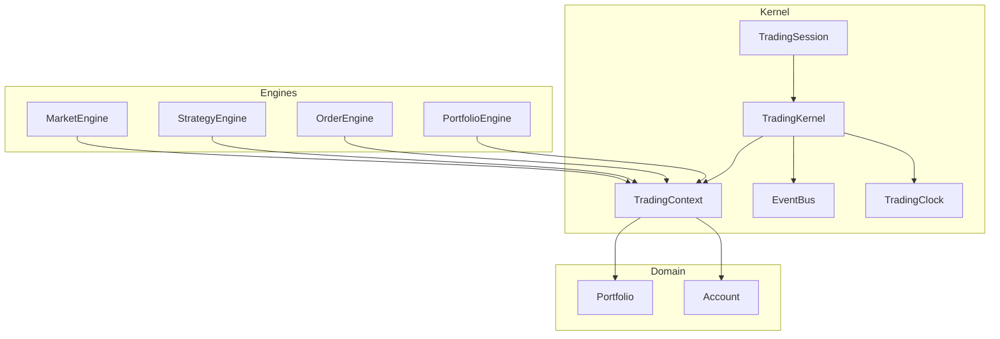
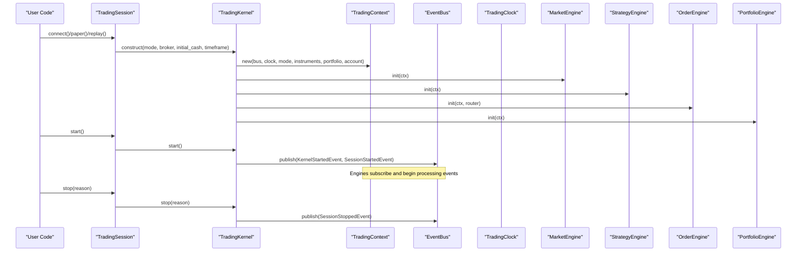
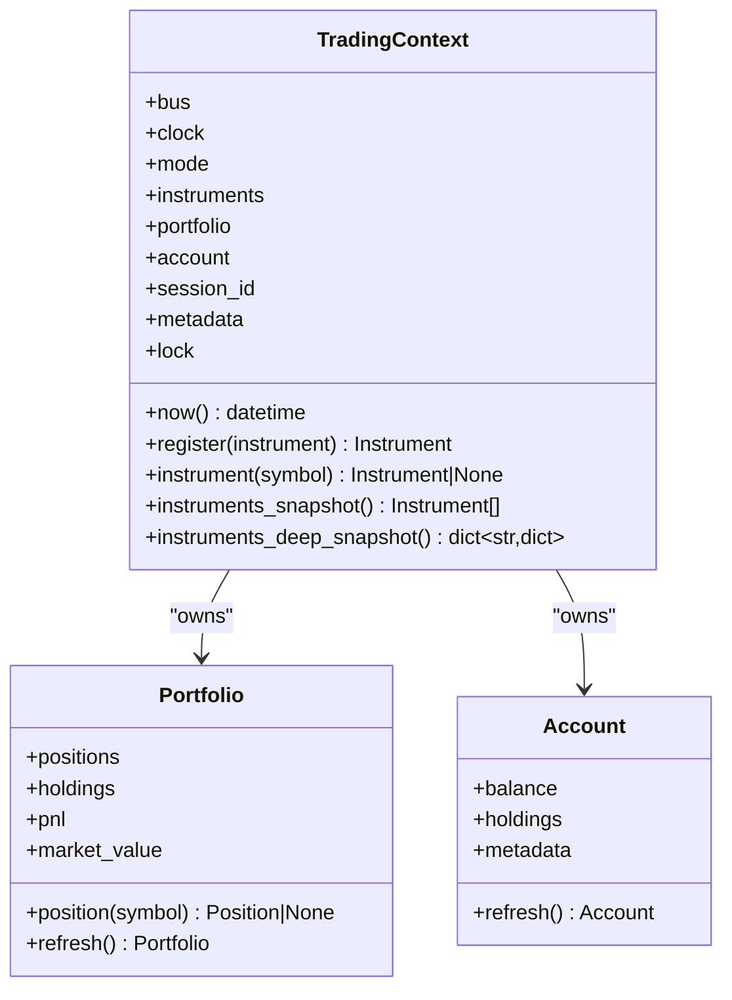
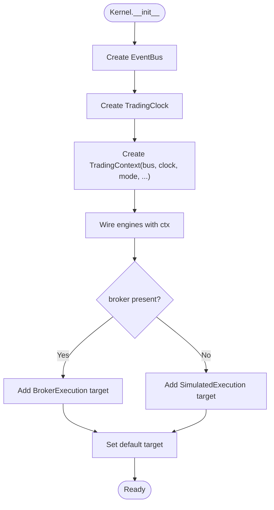
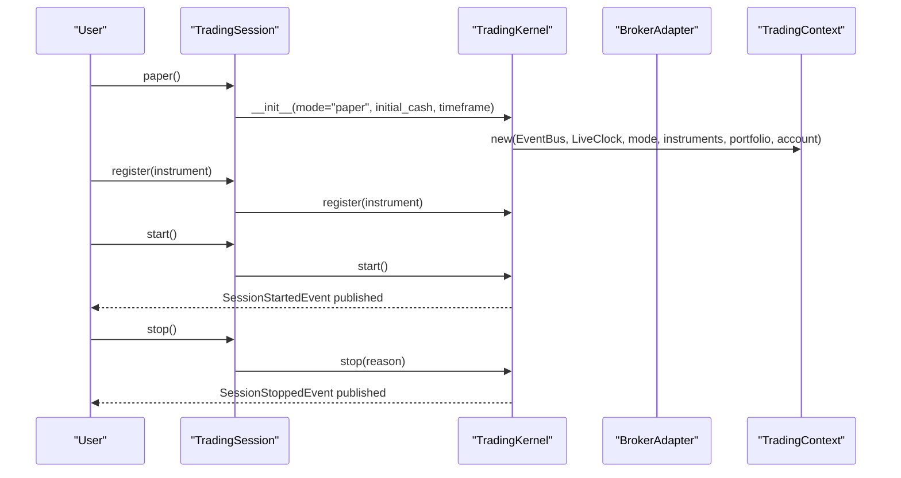
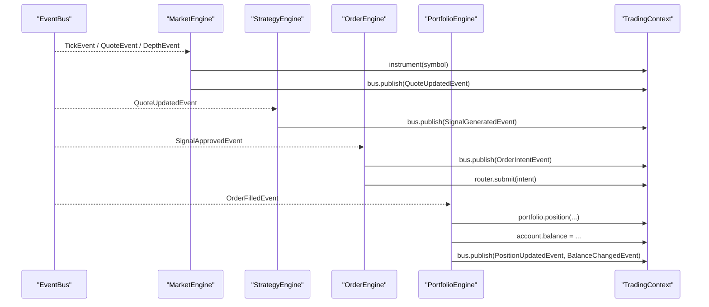
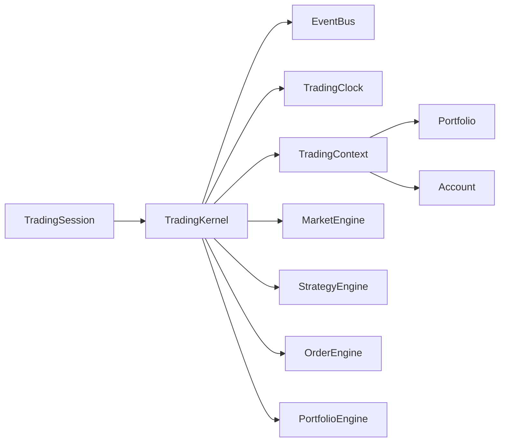

# Context Management System

<cite>
**Referenced Files in This Document**
- [context.py](file://ntrade/kernel/context.py)
- [session.py](file://ntrade/kernel/session.py)
- [trading_session.py](file://ntrade/kernel/trading_session.py)
- [event_bus.py](file://ntrade/kernel/event_bus.py)
- [clock.py](file://ntrade/kernel/clock.py)
- [portfolio.py](file://ntrade/domain/portfolio.py)
- [market_engine.py](file://ntrade/engines/market_engine.py)
- [strategy_engine.py](file://ntrade/engines/strategy_engine.py)
- [order_engine.py](file://ntrade/engines/order_engine.py)
- [portfolio_engine.py](file://ntrade/engines/portfolio_engine.py)
- [test_context.py](file://tests/test_context.py)
</cite>

## Table of Contents
1. [Introduction](#introduction)
2. [Project Structure](#project-structure)
3. [Core Components](#core-components)
4. [Architecture Overview](#architecture-overview)
5. [Detailed Component Analysis](#detailed-component-analysis)
6. [Dependency Analysis](#dependency-analysis)
7. [Performance Considerations](#performance-considerations)
8. [Troubleshooting Guide](#troubleshooting-guide)
9. [Conclusion](#conclusion)
10. [Appendices](#appendices)

## Introduction
This document explains the context management system that maintains session state and configuration throughout the trading lifecycle. The TradingContext object provides scoped access to shared resources such as the event bus, trading clock, instrument registry, portfolio, and account. It is created during kernel initialization and consumed by engines and strategies to read and update state consistently across threads. The documentation covers the lifecycle from initialization through cleanup, error handling, resource management, thread-safety guarantees, and best practices for multi-threaded environments. It also includes examples of creating custom contexts, accessing shared state, and implementing context-aware components.

## Project Structure
The context system centers around a small set of core modules:
- TradingContext: holds shared mutable state and thread-safe accessors
- TradingKernel: wires engines and creates the context
- TradingSession: unified entry point for sessions (live/paper/replay)
- EventBus: synchronous publish/subscribe with serialization
- TradingClock: deterministic time source (live/replay/simulation)
- Portfolio and Account: domain models managed by the context
- Engines: consume and mutate context state via events

**Diagram sources**
- [trading_session.py:39-143](file://ntrade/kernel/trading_session.py#L39-L143)
- [session.py:38-104](file://ntrade/kernel/session.py#L38-L104)
- [context.py:17-79](file://ntrade/kernel/context.py#L17-L79)
- [event_bus.py:24-81](file://ntrade/kernel/event_bus.py#L24-L81)
- [clock.py:14-55](file://ntrade/kernel/clock.py#L14-L55)
- [portfolio.py:63-173](file://ntrade/domain/portfolio.py#L63-L173)
- [market_engine.py:15-64](file://ntrade/engines/market_engine.py#L15-L64)
- [strategy_engine.py:48-102](file://ntrade/engines/strategy_engine.py#L48-L102)
- [order_engine.py:14-34](file://ntrade/engines/order_engine.py#L14-L34)
- [portfolio_engine.py:15-69](file://ntrade/engines/portfolio_engine.py#L15-L69)

**Section sources**
- [trading_session.py:39-143](file://ntrade/kernel/trading_session.py#L39-L143)
- [session.py:38-104](file://ntrade/kernel/session.py#L38-L104)
- [context.py:17-79](file://ntrade/kernel/context.py#L17-L79)
- [event_bus.py:24-81](file://ntrade/kernel/event_bus.py#L24-L81)
- [clock.py:14-55](file://ntrade/kernel/clock.py#L14-L55)
- [portfolio.py:63-173](file://ntrade/domain/portfolio.py#L63-L173)

## Core Components
- TradingContext: central store for bus, clock, mode, instruments map, portfolio, account, session_id, metadata, and a reentrant lock for thread safety. Provides methods to register/instrument lookup and snapshots.
- TradingKernel: constructs the context, wires engines, sets up execution targets, and manages lifecycle events.
- TradingSession: high-level API to create live/paper/replay sessions, manage instruments, strategies, and broker connections.
- EventBus: thread-safe pub/sub with history and serialized dispatch.
- TradingClock: abstracts time; LiveClock for wall time, ReplayClock/SimulationClock for deterministic replay/backtest.
- Portfolio and Account: domain objects representing positions/holdings and cash balance.

Key responsibilities:
- Provide consistent, thread-safe access to shared state
- Ensure deterministic behavior across modes via clock abstraction
- Centralize lifecycle events and engine wiring

**Section sources**
- [context.py:17-79](file://ntrade/kernel/context.py#L17-L79)
- [session.py:38-104](file://ntrade/kernel/session.py#L38-L104)
- [trading_session.py:39-143](file://ntrade/kernel/trading_session.py#L39-L143)
- [event_bus.py:24-81](file://ntrade/kernel/event_bus.py#L24-L81)
- [clock.py:14-55](file://ntrade/kernel/clock.py#L14-L55)
- [portfolio.py:63-173](file://ntrade/domain/portfolio.py#L63-L173)

## Architecture Overview
The context is created once per session and injected into all engines. Engines subscribe to events on the bus and mutate context state under locks where necessary. The kernel orchestrates start/stop and optional replay flows.

**Diagram sources**
- [trading_session.py:73-143](file://ntrade/kernel/trading_session.py#L73-L143)
- [session.py:42-104](file://ntrade/kernel/session.py#L42-L104)
- [context.py:26-46](file://ntrade/kernel/context.py#L26-L46)
- [event_bus.py:47-66](file://ntrade/kernel/event_bus.py#L47-L66)
- [clock.py:24-55](file://ntrade/kernel/clock.py#L24-L55)
- [market_engine.py:15-24](file://ntrade/engines/market_engine.py#L15-L24)
- [strategy_engine.py:48-68](file://ntrade/engines/strategy_engine.py#L48-L68)
- [order_engine.py:14-34](file://ntrade/engines/order_engine.py#L14-L34)
- [portfolio_engine.py:15-21](file://ntrade/engines/portfolio_engine.py#L15-L21)

## Detailed Component Analysis

### TradingContext
TradingContext encapsulates shared mutable state and exposes thread-safe operations:
- Attributes: bus, clock, mode, instruments dict, portfolio, account, session_id, metadata, lock
- Methods: now(), register(instrument), instrument(symbol), instruments_snapshot(), instruments_deep_snapshot()
- Thread safety: uses a reentrant lock to protect instrument registration and iteration; deep snapshot captures each instrument’s state atomically under the lock

**Diagram sources**
- [context.py:17-79](file://ntrade/kernel/context.py#L17-L79)
- [portfolio.py:63-173](file://ntrade/domain/portfolio.py#L63-L173)

**Section sources**
- [context.py:17-79](file://ntrade/kernel/context.py#L17-L79)
- [portfolio.py:63-173](file://ntrade/domain/portfolio.py#L63-L173)

### TradingKernel
TradingKernel builds the context and wires the engine stack:
- Creates EventBus and TradingClock instances
- Constructs TradingContext with mode, instruments, portfolio, account, session_id
- Wires MarketEngine, CandleEngine, IndicatorEngine, StrategyEngine, RiskEngine, PortfolioEngine
- Configures ExecutionRouter with BrokerExecution or SimulatedExecution based on presence of broker
- Publishes lifecycle events on start/stop and supports replay

**Diagram sources**
- [session.py:42-104](file://ntrade/kernel/session.py#L42-L104)

**Section sources**
- [session.py:38-104](file://ntrade/kernel/session.py#L38-L104)

### TradingSession
TradingSession is the user-facing facade:
- Constructors: connect(broker), paper(), replay(events)
- Instrument factory integration for creating equities, indices, derivatives
- Account/portfolio/balance accessors that delegate to broker when available or use kernel context otherwise
- Lifecycle: start() triggers kernel.start() and optionally runs replay events; stop() calls kernel.stop()
- Scanner facade lazily created

**Diagram sources**
- [trading_session.py:96-143](file://ntrade/kernel/trading_session.py#L96-L143)
- [session.py:122-132](file://ntrade/kernel/session.py#L122-L132)

**Section sources**
- [trading_session.py:39-143](file://ntrade/kernel/trading_session.py#L39-L143)
- [session.py:122-132](file://ntrade/kernel/session.py#L122-L132)

### Event Bus and Clock
- EventBus: serializes publish calls with an RLock, records history, and swallows handler exceptions to keep the kernel resilient
- TradingClock: base contract with implementations for LiveClock (wall time), ReplayClock (set/advance), SimulationClock (speed factor)

These abstractions ensure deterministic behavior and robustness across threads and modes.

**Section sources**
- [event_bus.py:24-81](file://ntrade/kernel/event_bus.py#L24-L81)
- [clock.py:14-55](file://ntrade/kernel/clock.py#L14-L55)

### Engines and Context Usage
Engines subscribe to events and read/write context state:
- MarketEngine: updates instrument state from ticks/quotes/depth and publishes QuoteUpdatedEvent
- StrategyEngine: dispatches events to strategy hooks; strategies emit signals via ctx.bus
- OrderEngine: converts approved signals into order intents and submits via router
- PortfolioEngine: updates positions and account balance on fills and broadcasts portfolio events

**Diagram sources**
- [market_engine.py:15-64](file://ntrade/engines/market_engine.py#L15-L64)
- [strategy_engine.py:48-102](file://ntrade/engines/strategy_engine.py#L48-L102)
- [order_engine.py:14-34](file://ntrade/engines/order_engine.py#L14-L34)
- [portfolio_engine.py:15-69](file://ntrade/engines/portfolio_engine.py#L15-L69)

**Section sources**
- [market_engine.py:15-64](file://ntrade/engines/market_engine.py#L15-L64)
- [strategy_engine.py:48-102](file://ntrade/engines/strategy_engine.py#L48-L102)
- [order_engine.py:14-34](file://ntrade/engines/order_engine.py#L14-L34)
- [portfolio_engine.py:15-69](file://ntrade/engines/portfolio_engine.py#L15-L69)

## Dependency Analysis
- TradingKernel depends on EventBus, TradingClock, TradingContext, and multiple engines
- Engines depend on TradingContext for shared state and bus for communication
- TradingSession composes TradingKernel and optionally a BrokerAdapter
- Domain models (Portfolio, Account) are owned by TradingContext and mutated by engines

**Diagram sources**
- [trading_session.py:39-143](file://ntrade/kernel/trading_session.py#L39-L143)
- [session.py:38-104](file://ntrade/kernel/session.py#L38-L104)
- [context.py:17-79](file://ntrade/kernel/context.py#L17-L79)
- [portfolio.py:63-173](file://ntrade/domain/portfolio.py#L63-L173)

**Section sources**
- [trading_session.py:39-143](file://ntrade/kernel/trading_session.py#L39-L143)
- [session.py:38-104](file://ntrade/kernel/session.py#L38-L104)
- [context.py:17-79](file://ntrade/kernel/context.py#L17-L79)
- [portfolio.py:63-173](file://ntrade/domain/portfolio.py#L63-L173)

## Performance Considerations
- Use instruments_snapshot() for fast shallow copies when iterating instruments; prefer instruments_deep_snapshot() when you need internally consistent snapshots of instrument state
- Avoid holding the context lock across long-running operations; engines should minimize critical sections
- Prefer event-driven updates rather than polling context state directly
- In replay/backtest modes, leverage ReplayClock/SimulationClock to avoid real-time delays and enable deterministic runs

[No sources needed since this section provides general guidance]

## Troubleshooting Guide
Common issues and resolutions:
- Deadlocks under context lock: ensure no long-held locks; verify that handlers do not call back into context methods that acquire the same lock recursively unless necessary
- Missing instruments: confirm instruments are registered before market events arrive; use ctx.instrument(symbol) checks in handlers
- Inconsistent snapshots: use instruments_deep_snapshot() when serializing or publishing state to avoid torn reads
- Event handler exceptions: the bus swallows exceptions; check logs to identify failing handlers

Validation evidence:
- Thread-safety tests demonstrate concurrent register and read without crashes or deadlocks
- Barrier storm tests validate that dictionary iteration remains safe under heavy concurrency

**Section sources**
- [test_context.py:14-69](file://tests/test_context.py#L14-L69)
- [test_context.py:72-118](file://tests/test_context.py#L72-L118)
- [event_bus.py:47-66](file://ntrade/kernel/event_bus.py#L47-L66)

## Conclusion
The context management system provides a robust, thread-safe foundation for managing session state and configuration across the trading lifecycle. By centralizing shared resources in TradingContext and enforcing disciplined access patterns through locks and events, the system ensures consistency and determinism across live, paper, and replay modes. Following the best practices outlined here will help developers build reliable, scalable, and maintainable trading components.

[No sources needed since this section summarizes without analyzing specific files]

## Appendices

### Creating Custom Contexts
- Instantiate a TradingContext with your own EventBus and TradingClock if you need isolation or custom time semantics
- Initialize Portfolio and Account with desired starting balances and holdings
- Pass the context to engines that require it

Example references:
- [context.py:26-46](file://ntrade/kernel/context.py#L26-L46)
- [session.py:61-66](file://ntrade/kernel/session.py#L61-L66)

### Accessing Shared State
- Read-only access: ctx.instrument(symbol), ctx.instruments_snapshot(), ctx.now()
- Mutating state: ctx.register(instrument); engines update ctx.portfolio and ctx.account via events

Example references:
- [context.py:51-79](file://ntrade/kernel/context.py#L51-L79)
- [portfolio_engine.py:20-69](file://ntrade/engines/portfolio_engine.py#L20-L69)

### Implementing Context-Aware Components
- Subscribe to relevant events on ctx.bus in your component’s initializer
- Emit events via ctx.bus.publish(...) to communicate outcomes
- Use ctx.now() for timestamps instead of direct datetime calls

Example references:
- [strategy_engine.py:37-45](file://ntrade/engines/strategy_engine.py#L37-L45)
- [event_bus.py:47-66](file://ntrade/kernel/event_bus.py#L47-L66)

### Thread-Safety Best Practices
- Always use ctx.lock around critical sections that mutate shared structures beyond provided APIs
- Prefer ctx.instruments_deep_snapshot() for consistent reads under concurrency
- Keep event handlers short and exception-safe; rely on the bus to swallow errors

Example references:
- [context.py:20-24](file://ntrade/kernel/context.py#L20-L24)
- [test_context.py:72-118](file://tests/test_context.py#L72-L118)