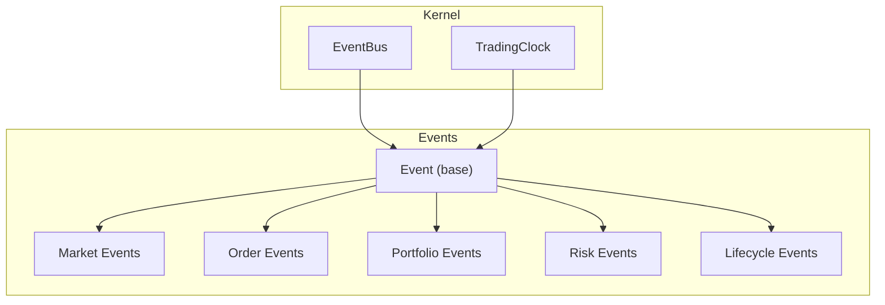
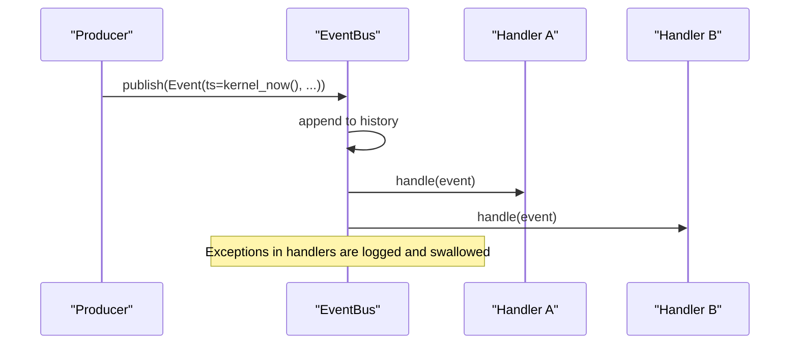
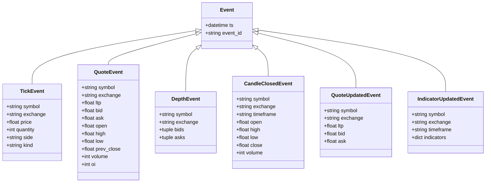
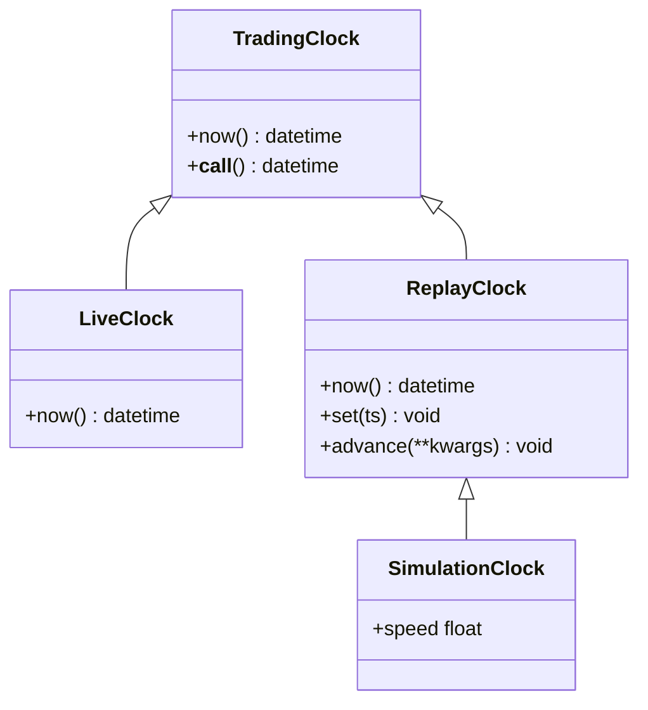
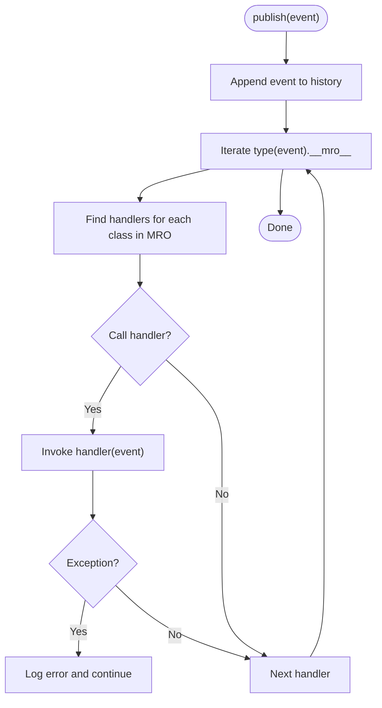
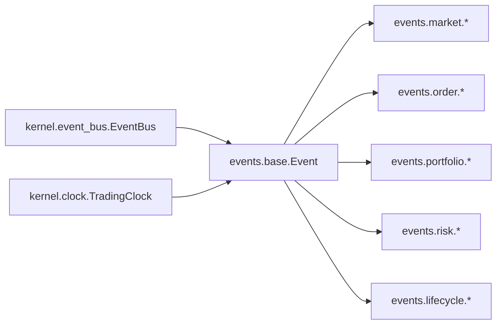

# Base Event Class

<cite>
**Referenced Files in This Document**
- [base.py](file://ntrade/events/base.py)
- [clock.py](file://ntrade/kernel/clock.py)
- [event_bus.py](file://ntrade/kernel/event_bus.py)
- [market.py](file://ntrade/events/market.py)
- [order.py](file://ntrade/events/order.py)
- [portfolio.py](file://ntrade/events/portfolio.py)
- [risk.py](file://ntrade/events/risk.py)
- [lifecycle.py](file://ntrade/events/lifecycle.py)
- [__init__.py](file://ntrade/events/__init__.py)
- [test_event_bus_clock.py](file://tests/test_event_bus_clock.py)
</cite>

## Table of Contents
1. Introduction
2. Project Structure
3. Core Components
4. Architecture Overview
5. Detailed Component Analysis
6. Dependency Analysis
7. Performance Considerations
8. Troubleshooting Guide
9. Conclusion
10. Appendices

## Introduction
This document explains the base Event class that underpins the entire event system in the trading kernel. It focuses on the frozen dataclass design pattern, immutable properties (ts timestamp from TradingClock and event_id UUID), and why immutability is essential for deterministic replay/backtesting. It also covers canonical event model principles, how events act as the lingua franca between subsystems, and why kernel-clock timestamps are preferred over datetime.now(). Finally, it provides guidance on extending the base Event class and best practices for creating events.

## Project Structure
The event system centers around a small, cohesive set of modules:
- The base Event definition and its contract
- Specialized event types grouped by domain (market, order, portfolio, risk, lifecycle)
- A synchronous EventBus for publish/subscribe messaging
- A TradingClock abstraction providing deterministic time sources

**Diagram sources**
- [base.py:16-22](file://ntrade/events/base.py#L16-L22)
- [market.py:11-83](file://ntrade/events/market.py#L11-L83)
- [order.py:11-91](file://ntrade/events/order.py#L11-L91)
- [portfolio.py:11-27](file://ntrade/events/portfolio.py#L11-L27)
- [risk.py:11-52](file://ntrade/events/risk.py#L11-L52)
- [lifecycle.py:11-57](file://ntrade/events/lifecycle.py#L11-L57)
- [clock.py:14-55](file://ntrade/kernel/clock.py#L14-L55)
- [event_bus.py:24-81](file://ntrade/kernel/event_bus.py#L24-L81)

**Section sources**
- [base.py:1-22](file://ntrade/events/base.py#L1-L22)
- [__init__.py:1-44](file://ntrade/events/__init__.py#L1-L44)

## Core Components
- Event (base): A frozen dataclass with two fields:
  - ts: datetime — the canonical kernel-clock timestamp
  - event_id: str — a unique identifier generated per instance
- TradingClock: An abstract clock interface with concrete implementations:
  - LiveClock: wall-clock time
  - ReplayClock: deterministic time driven by replayed events
  - SimulationClock: deterministic time with speed scaling
- EventBus: A thread-safe, synchronous pub/sub bus that records history and dispatches to handlers subscribed to exact or base event types.

Key properties and behaviors:
- Immutability via frozen=True ensures events cannot be mutated after creation, enabling safe hashing, storage, and deterministic replay.
- Kernel-clock timestamps ensure identical behavior across live, replay, and backtest modes.
- Unique event IDs enable deduplication, tracing, and auditability.

**Section sources**
- [base.py:16-22](file://ntrade/events/base.py#L16-L22)
- [clock.py:14-55](file://ntrade/kernel/clock.py#L14-L55)
- [event_bus.py:24-81](file://ntrade/kernel/event_bus.py#L24-L81)

## Architecture Overview
The event system enforces a strict separation of concerns:
- Producers create immutable events with kernel-clock timestamps and publish them to the EventBus.
- Consumers subscribe to specific event types or base Event to receive relevant messages.
- The EventBus serializes dispatch using a reentrant lock, records bounded history, and isolates handler exceptions so one bad subscriber cannot crash the kernel.

**Diagram sources**
- [event_bus.py:47-66](file://ntrade/kernel/event_bus.py#L47-L66)

## Detailed Component Analysis

### Base Event Design
- Frozen dataclass: Prevents mutation; enables hashing and safe sharing across threads and processes.
- Canonical fields:
  - ts: datetime from TradingClock ensures deterministic ordering and reproducibility.
  - event_id: str uniquely identifies each event instance for tracing and deduplication.
- kw_only=True: Enforces explicit keyword construction, reducing accidental misuse.

Why immutability matters:
- Deterministic replay/backtesting: Immutable snapshots guarantee that recorded streams produce identical decisions when replayed.
- Thread safety: No shared mutable state reduces race conditions in multi-threaded producers/consumers.
- Hashability: Enables efficient indexing, caching, and set-based operations.

Best practices for extending Event:
- Always use @dataclass(frozen=True, kw_only=True).
- Provide only immutable, hashable fields.
- Use default_factory for complex defaults (e.g., dicts, lists) to avoid shared mutable defaults.
- Derive new event types from Event to inherit ts and event_id semantics.

**Diagram sources**
- [base.py:16-22](file://ntrade/events/base.py#L16-L22)
- [market.py:11-83](file://ntrade/events/market.py#L11-L83)

**Section sources**
- [base.py:16-22](file://ntrade/events/base.py#L16-L22)
- [market.py:11-83](file://ntrade/events/market.py#L11-L83)

### Time Model: TradingClock vs datetime.now()
- TradingClock defines a single source of truth for time:
  - LiveClock returns wall-clock time for live trading.
  - ReplayClock returns deterministic time based on replayed events.
  - SimulationClock adds a speed factor for accelerated backtests.
- Using kernel-clock timestamps ensures parity across environments and makes replay/backtest identical to live execution.

**Diagram sources**
- [clock.py:14-55](file://ntrade/kernel/clock.py#L14-L55)

**Section sources**
- [clock.py:14-55](file://ntrade/kernel/clock.py#L14-L55)

### Event Bus Integration
- Subscribers can listen to exact event types or base Event to receive all subclasses.
- Dispatch walks the MRO to match handlers, ensuring both precise and generic subscriptions work.
- History is bounded and thread-safe; exceptions in handlers are logged and do not propagate.

**Diagram sources**
- [event_bus.py:47-66](file://ntrade/kernel/event_bus.py#L47-L66)

**Section sources**
- [event_bus.py:24-81](file://ntrade/kernel/event_bus.py#L24-L81)

### Domain Event Families
- Market events: Tick, Quote, Depth, CandleClosed, QuoteUpdated, IndicatorUpdated
- Order events: OrderIntent, OrderAccepted, OrderRejected, OrderFilled, OrderUpdated, OrderTimeout
- Portfolio events: PositionUpdated, BalanceChanged
- Risk events: SignalGenerated, SignalApproved, SignalRejected, RiskHalted, RiskResumed
- Lifecycle events: KernelStarted, SessionStarted, SessionStopped, RunnerStarted, RunnerStopped, Heartbeat, FeedDisconnected

These families share the same immutable contract and kernel-clock timestamping, enabling consistent processing across engines.

**Section sources**
- [market.py:11-83](file://ntrade/events/market.py#L11-L83)
- [order.py:11-91](file://ntrade/events/order.py#L11-L91)
- [portfolio.py:11-27](file://ntrade/events/portfolio.py#L11-L27)
- [risk.py:11-52](file://ntrade/events/risk.py#L11-L52)
- [lifecycle.py:11-57](file://ntrade/events/lifecycle.py#L11-L57)

## Dependency Analysis
- All specialized events import and extend the base Event class.
- The EventBus depends on Event as the typed payload for publishing and subscribing.
- TradingClock is used by producers to generate ts values for events.

**Diagram sources**
- [base.py:16-22](file://ntrade/events/base.py#L16-L22)
- [market.py:11-83](file://ntrade/events/market.py#L11-L83)
- [order.py:11-91](file://ntrade/events/order.py#L11-L91)
- [portfolio.py:11-27](file://ntrade/events/portfolio.py#L11-L27)
- [risk.py:11-52](file://ntrade/events/risk.py#L11-L52)
- [lifecycle.py:11-57](file://ntrade/events/lifecycle.py#L11-L57)
- [event_bus.py:24-81](file://ntrade/kernel/event_bus.py#L24-L81)
- [clock.py:14-55](file://ntrade/kernel/clock.py#L14-L55)

**Section sources**
- [__init__.py:1-44](file://ntrade/events/__init__.py#L1-L44)

## Performance Considerations
- Frozen dataclasses are lightweight and hashable, minimizing overhead and enabling efficient caching and indexing.
- EventBus uses a deque with a bounded maxlen to prevent unbounded memory growth while retaining recent history.
- Reentrant locking ensures thread-safe dispatch without deadlocks in reentrant scenarios.
- Avoid heavy computations inside event handlers; prefer offloading to background tasks if necessary.

[No sources needed since this section provides general guidance]

## Troubleshooting Guide
Common issues and resolutions:
- Mutating an event raises an exception because events are frozen. Ensure you construct new events instead of modifying existing ones.
- Non-deterministic behavior often stems from using datetime.now() directly. Always obtain timestamps from TradingClock.
- Handler exceptions do not crash the bus; check logs for errors raised within subscribers.
- If events appear duplicated, verify producer logic; event_id uniqueness is guaranteed per instance but duplicates may arise from multiple publishes.

Validation references:
- Tests confirm immutability, uniqueness of event_id, and bus behavior including isolation of handler errors and bounded history.

**Section sources**
- [test_event_bus_clock.py:13-27](file://tests/test_event_bus_clock.py#L13-L27)
- [test_event_bus_clock.py:52-66](file://tests/test_event_bus_clock.py#L52-L66)
- [test_event_bus_clock.py:100-107](file://tests/test_event_bus_clock.py#L100-L107)

## Conclusion
The base Event class establishes a robust, immutable, and deterministic foundation for the trading kernel’s event system. By enforcing kernel-clock timestamps and unique identifiers, it guarantees reproducibility across live, replay, and backtest environments. Extending Event with frozen dataclasses and adhering to canonical patterns ensures reliable communication between subsystems through the EventBus. Following the best practices outlined here will help maintain consistency, performance, and correctness throughout the system.

[No sources needed since this section summarizes without analyzing specific files]

## Appendices

### Best Practices for Creating Events
- Always derive from Event to inherit ts and event_id semantics.
- Use @dataclass(frozen=True, kw_only=True) for immutability and explicit construction.
- Prefer immutable, hashable field types; use default_factory for mutable defaults.
- Obtain ts exclusively from TradingClock to ensure determinism.
- Keep payloads minimal and focused; avoid embedding large objects.

**Section sources**
- [base.py:16-22](file://ntrade/events/base.py#L16-L22)
- [clock.py:14-55](file://ntrade/kernel/clock.py#L14-L55)

### Example Patterns for Extending Event
- Market data extension: Add symbol, exchange, and market-specific fields while preserving ts and event_id.
- Order lifecycle extension: Include order identifiers, sides, quantities, and status transitions.
- Portfolio updates: Emit position and balance changes with current snapshot values.
- Risk signals: Carry intended trade parameters and metadata for downstream OMS processing.
- Lifecycle events: Announce kernel/session states and periodic heartbeats.

**Section sources**
- [market.py:11-83](file://ntrade/events/market.py#L11-L83)
- [order.py:11-91](file://ntrade/events/order.py#L11-L91)
- [portfolio.py:11-27](file://ntrade/events/portfolio.py#L11-L27)
- [risk.py:11-52](file://ntrade/events/risk.py#L11-L52)
- [lifecycle.py:11-57](file://ntrade/events/lifecycle.py#L11-L57)