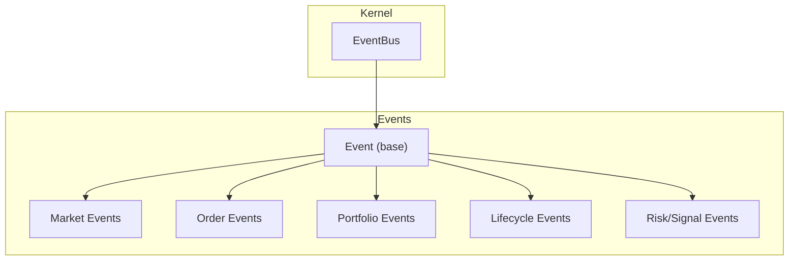
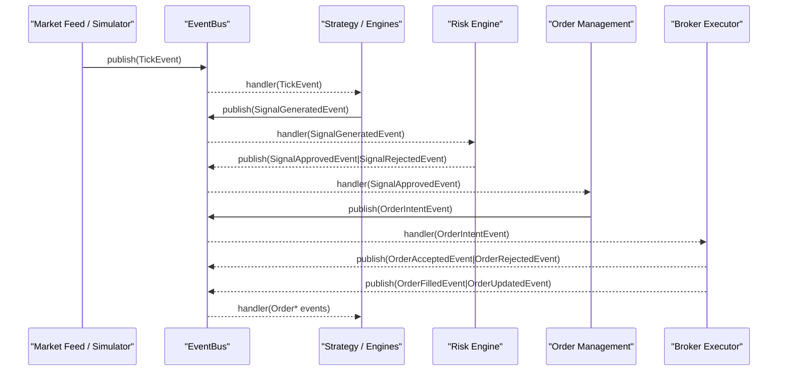
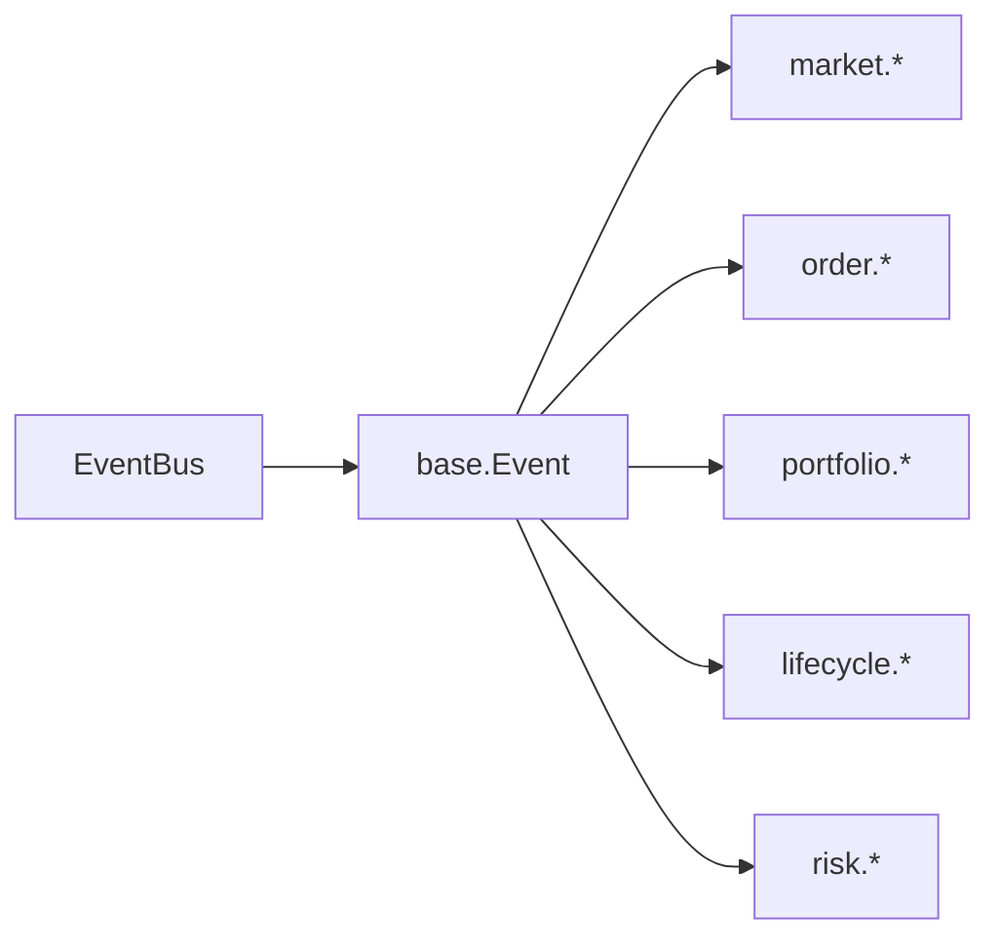
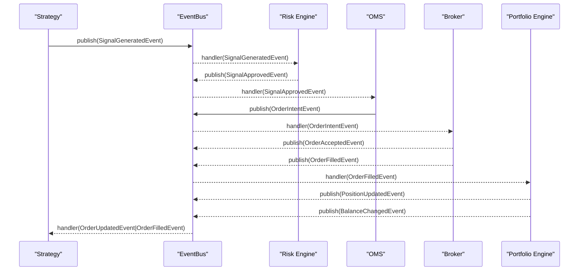

# Event Types Hierarchy

<cite>
**Referenced Files in This Document**
- [events/__init__.py](file://ntrade/events/__init__.py)
- [events/base.py](file://ntrade/events/base.py)
- [events/market.py](file://ntrade/events/market.py)
- [events/order.py](file://ntrade/events/order.py)
- [events/portfolio.py](file://ntrade/events/portfolio.py)
- [events/lifecycle.py](file://ntrade/events/lifecycle.py)
- [events/risk.py](file://ntrade/events/risk.py)
- [kernel/event_bus.py](file://ntrade/kernel/event_bus.py)
- [tests/test_event_bus_clock.py](file://tests/test_event_bus_clock.py)
- [tests/test_order_state_events.py](file://tests/test_order_state_events.py)
</cite>

## Table of Contents
1. Introduction
2. Project Structure
3. Core Components
4. Architecture Overview
5. Detailed Component Analysis
6. Dependency Analysis
7. Performance Considerations
8. Troubleshooting Guide
9. Conclusion
10. Appendices

## Introduction
This document explains the event types hierarchy used across the trading kernel, from the base Event class to specialized categories for market data, order lifecycle, portfolio state, kernel/session lifecycle, and risk/signal flow. It covers inheritance patterns, common fields, serialization requirements, event ordering guarantees, and best practices for building event-driven strategies. It also provides guidance on creating custom events and handling different event categories consistently.

## Project Structure
The event system is organized by category under ntrade/events with a shared base type and a central event bus in ntrade/kernel. The module-level __init__ re-exports canonical event names for consumers.

**Diagram sources**
- [events/base.py:16-22](file://ntrade/events/base.py#L16-L22)
- [events/market.py:11-83](file://ntrade/events/market.py#L11-L83)
- [events/order.py:11-91](file://ntrade/events/order.py#L11-L91)
- [events/portfolio.py:11-27](file://ntrade/events/portfolio.py#L11-L27)
- [events/lifecycle.py:11-57](file://ntrade/events/lifecycle.py#L11-L57)
- [events/risk.py:11-52](file://ntrade/events/risk.py#L11-L52)
- [kernel/event_bus.py:24-81](file://ntrade/kernel/event_bus.py#L24-L81)

**Section sources**
- [events/__init__.py:1-44](file://ntrade/events/__init__.py#L1-L44)
- [events/base.py:1-22](file://ntrade/events/base.py#L1-L22)
- [kernel/event_bus.py:1-81](file://ntrade/kernel/event_bus.py#L1-L81)

## Core Components
- Base Event: Immutable, hashable dataclass carrying a deterministic timestamp from TradingClock and a unique event_id. All events inherit these fields.
- EventBus: Synchronous publish/subscribe with thread-safe dispatch using a reentrant lock. Supports subscribing to base types to receive subclasses via MRO. Exceptions in handlers are logged and swallowed to protect the kernel. Maintains bounded history for replay/debugging.

Key properties:
- Immutability and determinism: frozen dataclasses ensure stable hashing and replay fidelity.
- Timestamp source: ts must come from TradingClock implementations (LiveClock, ReplayClock, SimulationClock).
- Ordering: publish() holds a lock during dispatch; handlers run sequentially per event. History preserves insertion order.

**Section sources**
- [events/base.py:16-22](file://ntrade/events/base.py#L16-L22)
- [kernel/event_bus.py:24-81](file://ntrade/kernel/event_bus.py#L24-L81)
- [tests/test_event_bus_clock.py:13-26](file://tests/test_event_bus_clock.py#L13-L26)
- [tests/test_event_bus_clock.py:29-36](file://tests/test_event_bus_clock.py#L29-L36)
- [tests/test_event_bus_clock.py:52-66](file://tests/test_event_bus_clock.py#L52-L66)
- [tests/test_event_bus_clock.py:100-107](file://tests/test_event_bus_clock.py#L100-L107)

## Architecture Overview
The event bus is the single coordination point. Producers (feeds, engines, brokers) publish immutable events; consumers (engines, strategies, risk, OMS) subscribe to specific or base event types. Dispatch walks the subclass MRO so subscribers to Event receive all events.

**Diagram sources**
- [kernel/event_bus.py:47-66](file://ntrade/kernel/event_bus.py#L47-L66)
- [events/market.py:11-21](file://ntrade/events/market.py#L11-L21)
- [events/risk.py:11-36](file://ntrade/events/risk.py#L11-L36)
- [events/order.py:11-64](file://ntrade/events/order.py#L11-L64)

## Detailed Component Analysis

### Base Event and Inheritance Pattern
All events derive from Event, which provides:
- ts: datetime from TradingClock
- event_id: unique hex string generated at construction

Inheritance pattern:
- Category modules define frozen dataclasses inheriting from Event.
- Consumers can subscribe to Event to receive all events or to specific categories/types.

Serialization requirements:
- Frozen dataclasses are serializable via standard tools (e.g., JSON, msgpack) due to immutability and simple field types.
- Use ts directly (datetime) or serialize to ISO strings; event_id is a stable identifier for deduplication and tracing.

Best practices:
- Never mutate events after creation.
- Always set ts from TradingClock to ensure replay/live parity.
- Keep payloads minimal and typed.

**Section sources**
- [events/base.py:16-22](file://ntrade/events/base.py#L16-L22)
- [events/__init__.py:1-44](file://ntrade/events/__init__.py#L1-L44)

### Market Events
Categories include raw prints, quotes, depth snapshots, candle completions, and derived updates.

- TickEvent: Single trade/quote/depth print with symbol, exchange, price, quantity, side, kind.
- QuoteEvent: Full quote snapshot including ltp, bid/ask, OHLC, volume, open interest.
- DepthEvent: Order book snapshot with bids/asks tuples.
- CandleClosedEvent: Completed candle with timeframe and OHLCV.
- QuoteUpdatedEvent: Broadcast after projection into an instrument.
- IndicatorUpdatedEvent: Bundle of indicators computed over latest completed candle.

Common fields: symbol, exchange; additional fields depend on granularity and purpose.

Usage examples:
- Feeds emit TickEvent/QuoteEvent/DepthEvent.
- Candle engine emits CandleClosedEvent when a bar completes.
- Market engine emits QuoteUpdatedEvent and IndicatorUpdatedEvent after processing.

**Section sources**
- [events/market.py:11-83](file://ntrade/events/market.py#L11-L83)
- [tests/test_event_bus_clock.py:13-19](file://tests/test_event_bus_clock.py#L13-L19)

### Order Events
Represent the full order lifecycle from intent through acceptance, updates, fills, and timeouts.

- OrderIntentEvent: Pre-execution signal materialized into an order intent.
- OrderAcceptedEvent: Execution target accepted the order.
- OrderRejectedEvent: Execution target or risk rejected the order.
- OrderFilledEvent: Fully filled with fill_price, commission, statutory charges.
- OrderUpdatedEvent: Open order status changes (PENDING/PARTIALLY_FILLED/COMPLETED/CANCELLED).
- OrderTimeoutEvent: PENDING order exceeded timeout threshold.

Common fields: order_id, symbol, exchange, side, quantity, strategy; fill-specific fields appear on fills and updates.

Processing notes:
- OMS consumes OrderIntentEvent and publishes acceptance/rejection/update/fill/timeout events.
- Strategies consume update/fill events to adjust logic or manage positions.

**Section sources**
- [events/order.py:11-91](file://ntrade/events/order.py#L11-L91)
- [tests/test_order_state_events.py:83-109](file://tests/test_order_state_events.py#L83-L109)

### Portfolio Events
Emit position and balance changes driven by fills and other cash movements.

- PositionUpdatedEvent: Quantity and average price updated after a fill; includes last traded price.
- BalanceChangedEvent: Account balance change after fills or cash adjustments.

These events enable real-time PnL tracking, margin checks, and reporting.

**Section sources**
- [events/portfolio.py:11-27](file://ntrade/events/portfolio.py#L11-L27)

### Lifecycle Events
Kernel and session orchestration events.

- KernelStartedEvent: Kernel wiring complete; mode indicates live/replay/backtest.
- SessionStartedEvent: Start of a trading session with session_id.
- SessionStoppedEvent: End of session with optional reason.
- RunnerStartedEvent/RunnerStoppedEvent: LiveRunner lifecycle.
- HeartbeatEvent: Periodic heartbeat with tick_count and open_orders.
- FeedDisconnectedEvent: Market feed websocket disconnected with reason.

Use these to coordinate startup/shutdown, monitoring, and resilience.

**Section sources**
- [events/lifecycle.py:11-57](file://ntrade/events/lifecycle.py#L11-L57)
- [tests/test_event_bus_clock.py:119-128](file://tests/test_event_bus_clock.py#L119-L128)

### Risk and Signal Events
Bridge between strategy signals and execution.

- SignalGeneratedEvent: Strategy-decided action with parameters and metadata.
- SignalApprovedEvent: Risk passed the signal; OMS may materialize it.
- SignalRejectedEvent: Risk blocked the signal with reason.
- RiskHaltedEvent: Circuit breaker tripped; trading must stop; includes equity snapshot.
- RiskResumedEvent: Circuit breaker cleared; trading may resume.

These enforce risk limits and provide auditability for decisions.

Note: While the objective mentions RiskLimitBreached and KillSwitchActivated, the implemented equivalents are RiskHaltedEvent and RiskResumedEvent. Use these for circuit-breaker behavior.

**Section sources**
- [events/risk.py:11-52](file://ntrade/events/risk.py#L11-L52)

### Creating Custom Event Types
To add a new event:
- Define a frozen dataclass inheriting from Event with kw_only=True.
- Include ts from TradingClock and any domain-specific fields.
- Re-export the event from events/__init__.py for canonical access.
- Subscribe handlers in relevant engines or strategies.

Guidelines:
- Keep payloads immutable and minimal.
- Use clear, typed fields; avoid nested mutable structures.
- Ensure event_id uniqueness is inherited automatically.

Example references:
- See how existing events are structured in each category module.

**Section sources**
- [events/base.py:16-22](file://ntrade/events/base.py#L16-L22)
- [events/__init__.py:1-44](file://ntrade/events/__init__.py#L1-L44)

### Handling Different Event Categories
Recommended patterns:
- Subscribe to base Event for global logging/monitoring.
- Subscribe to category-specific events for focused logic (e.g., TickEvent for alpha, OrderFilledEvent for position updates).
- Use MRO-based subscription to handle both base and derived events without duplication.

Thread safety:
- Handlers run synchronously under the bus lock; avoid long-running work inside handlers. Offload heavy tasks asynchronously if needed.

Error isolation:
- Handler exceptions are caught and logged; they do not propagate to the bus. Ensure idempotency and defensive coding.

**Section sources**
- [kernel/event_bus.py:47-66](file://ntrade/kernel/event_bus.py#L47-L66)
- [tests/test_event_bus_clock.py:52-66](file://tests/test_event_bus_clock.py#L52-L66)

### Implementing Event-Driven Strategies
Typical flow:
- Subscribe to TickEvent/QuoteUpdatedEvent/IndicatorUpdatedEvent.
- Emit SignalGeneratedEvent when conditions are met.
- Consume SignalApprovedEvent to proceed; handle SignalRejectedEvent for fallback logic.
- Observe OrderUpdatedEvent and OrderFilledEvent to manage state and risk.

References:
- Example usage patterns in tests demonstrate emitting signals and reacting to order state changes.

**Section sources**
- [tests/test_order_state_events.py:61-86](file://tests/test_order_state_events.py#L61-L86)
- [events/risk.py:11-36](file://ntrade/events/risk.py#L11-L36)
- [events/order.py:11-91](file://ntrade/events/order.py#L11-L91)

### Event Ordering Guarantees
- Within a single publish(), handlers execute sequentially under a reentrant lock.
- History preserves insertion order; max_history bounds memory.
- Cross-event ordering across producers is determined by publish call order; there is no global cross-thread ordering guarantee beyond per-publish atomicity.

Implications:
- Do not rely on interleaving assumptions between independent publishers.
- For causal chains, use event_id and timestamps to reconstruct order when necessary.

**Section sources**
- [kernel/event_bus.py:47-66](file://ntrade/kernel/event_bus.py#L47-L66)
- [kernel/event_bus.py:68-81](file://ntrade/kernel/event_bus.py#L68-L81)
- [tests/test_event_bus_clock.py:100-107](file://tests/test_event_bus_clock.py#L100-L107)

### Best Practices for Event Processing
- Use immutable events and deterministic timestamps from TradingClock.
- Keep handlers fast and exception-safe; log errors rather than crashing.
- Prefer subscribing to specific event types to reduce overhead.
- Use event_id for deduplication and correlation across subsystems.
- Record important events in external stores for auditability and replay.

[No sources needed since this section provides general guidance]

## Dependency Analysis
The event system has clear boundaries:
- Events depend only on base.Event and standard library types.
- EventBus depends on base.Event and threading primitives.
- Tests validate behavior and ordering.

**Diagram sources**
- [events/base.py:16-22](file://ntrade/events/base.py#L16-L22)
- [events/market.py:11-83](file://ntrade/events/market.py#L11-L83)
- [events/order.py:11-91](file://ntrade/events/order.py#L11-L91)
- [events/portfolio.py:11-27](file://ntrade/events/portfolio.py#L11-L27)
- [events/lifecycle.py:11-57](file://ntrade/events/lifecycle.py#L11-L57)
- [events/risk.py:11-52](file://ntrade/events/risk.py#L11-L52)
- [kernel/event_bus.py:24-81](file://ntrade/kernel/event_bus.py#L24-L81)

**Section sources**
- [events/__init__.py:1-44](file://ntrade/events/__init__.py#L1-L44)
- [kernel/event_bus.py:24-81](file://ntrade/kernel/event_bus.py#L24-L81)

## Performance Considerations
- EventBus uses a reentrant lock for thread safety; keep handlers lightweight to avoid blocking.
- History is bounded by max_history; tune based on memory constraints and debugging needs.
- Frozen dataclasses minimize copying overhead and enable safe sharing.
- Avoid heavy computations in handlers; offload to background workers if necessary.

[No sources needed since this section provides general guidance]

## Troubleshooting Guide
Common issues and resolutions:
- Handler crashes: EventBus logs and continues; inspect logs for “raised on” messages.
- Missing events: Verify subscriptions to correct event types; remember MRO allows base subscriptions.
- Out-of-order expectations: Rely on event_id and ts for reconstruction; do not assume cross-producer ordering.
- Memory growth: Reduce max_history or prune history periodically.

Relevant test coverage:
- Exception isolation and logging.
- Unsubscribe correctness.
- Bounded history behavior.

**Section sources**
- [kernel/event_bus.py:47-66](file://ntrade/kernel/event_bus.py#L47-L66)
- [tests/test_event_bus_clock.py:52-66](file://tests/test_event_bus_clock.py#L52-L66)
- [tests/test_event_bus_clock.py:100-107](file://tests/test_event_bus_clock.py#L100-L107)

## Conclusion
The event system provides a robust, deterministic foundation for the trading kernel. By adhering to immutable events, deterministic timestamps, and disciplined handler design, you can build reliable, scalable strategies that react to market data, manage orders, track portfolio state, and respect risk controls. Use the provided categories and patterns to extend functionality while maintaining clarity and performance.

[No sources needed since this section summarizes without analyzing specific files]

## Appendices

### Appendix A: Event Class Diagram

```mermaid
classDiagram
class Event {
+datetime ts
+string event_id
}
class TickEvent {
+string symbol
+string exchange
+float price
+int quantity
+string side
+string kind
}
class QuoteEvent {
+string symbol
+string exchange
+float ltp
+float bid
+float ask
+float open
+float high
+float low
+float prev_close
+int volume
+int oi
}
class DepthEvent {
+string symbol
+string exchange
+tuple bids
+tuple asks
}
class CandleClosedEvent {
+string symbol
+string exchange
+string timeframe
+float open
+float high
+float low
+float close
+int volume
}
class QuoteUpdatedEvent {
+string symbol
+string exchange
+float ltp
+float bid
+float ask
}
class IndicatorUpdatedEvent {
+string symbol
+string exchange
+string timeframe
+dict indicators
}
class OrderIntentEvent {
+string symbol
+string exchange
+string side
+int quantity
+string order_type
+float price
+string strategy
}
class OrderAcceptedEvent {
+string order_id
+string symbol
+string exchange
+string side
+int quantity
+string strategy
}
class OrderRejectedEvent {
+string order_id
+string symbol
+string exchange
+string side
+int quantity
+string reason
+string strategy
}
class OrderFilledEvent {
+string order_id
+string symbol
+string exchange
+string side
+int quantity
+float fill_price
+float commission
+float statutory
+string strategy
}
class OrderUpdatedEvent {
+string order_id
+string symbol
+string exchange
+string side
+string status
+int filled_qty
+float avg_price
+string strategy
}
class OrderTimeoutEvent {
+string order_id
+string symbol
+string exchange
+string side
+int quantity
+float age_seconds
+string strategy
}
class PositionUpdatedEvent {
+string symbol
+string exchange
+int quantity
+float avg_price
+float ltp
}
class BalanceChangedEvent {
+float balance
}
class KernelStartedEvent {
+string mode
}
class SessionStartedEvent {
+string session_id
}
class SessionStoppedEvent {
+string session_id
+string reason
}
class RunnerStartedEvent
class RunnerStoppedEvent {
+string reason
}
class HeartbeatEvent {
+int tick_count
+int open_orders
}
class FeedDisconnectedEvent {
+string reason
}
class SignalGeneratedEvent {
+string symbol
+string exchange
+string side
+int quantity
+float price
+string strategy
+dict metadata
}
class SignalApprovedEvent {
+SignalGeneratedEvent signal
}
class SignalRejectedEvent {
+SignalGeneratedEvent signal
+string reason
}
class RiskHaltedEvent {
+string reason
+float equity
}
class RiskResumedEvent {
+string reason
}
Event <|-- TickEvent
Event <|-- QuoteEvent
Event <|-- DepthEvent
Event <|-- CandleClosedEvent
Event <|-- QuoteUpdatedEvent
Event <|-- IndicatorUpdatedEvent
Event <|-- OrderIntentEvent
Event <|-- OrderAcceptedEvent
Event <|-- OrderRejectedEvent
Event <|-- OrderFilledEvent
Event <|-- OrderUpdatedEvent
Event <|-- OrderTimeoutEvent
Event <|-- PositionUpdatedEvent
Event <|-- BalanceChangedEvent
Event <|-- KernelStartedEvent
Event <|-- SessionStartedEvent
Event <|-- SessionStoppedEvent
Event <|-- RunnerStartedEvent
Event <|-- RunnerStoppedEvent
Event <|-- HeartbeatEvent
Event <|-- FeedDisconnectedEvent
Event <|-- SignalGeneratedEvent
Event <|-- SignalApprovedEvent
Event <|-- SignalRejectedEvent
Event <|-- RiskHaltedEvent
Event <|-- RiskResumedEvent
```

**Diagram sources**
- [events/base.py:16-22](file://ntrade/events/base.py#L16-L22)
- [events/market.py:11-83](file://ntrade/events/market.py#L11-L83)
- [events/order.py:11-91](file://ntrade/events/order.py#L11-L91)
- [events/portfolio.py:11-27](file://ntrade/events/portfolio.py#L11-L27)
- [events/lifecycle.py:11-57](file://ntrade/events/lifecycle.py#L11-L57)
- [events/risk.py:11-52](file://ntrade/events/risk.py#L11-L52)

### Appendix B: Sequence of a Typical Trade Flow

**Diagram sources**
- [events/risk.py:11-36](file://ntrade/events/risk.py#L11-L36)
- [events/order.py:11-64](file://ntrade/events/order.py#L11-L64)
- [events/portfolio.py:11-27](file://ntrade/events/portfolio.py#L11-L27)
- [kernel/event_bus.py:47-66](file://ntrade/kernel/event_bus.py#L47-L66)