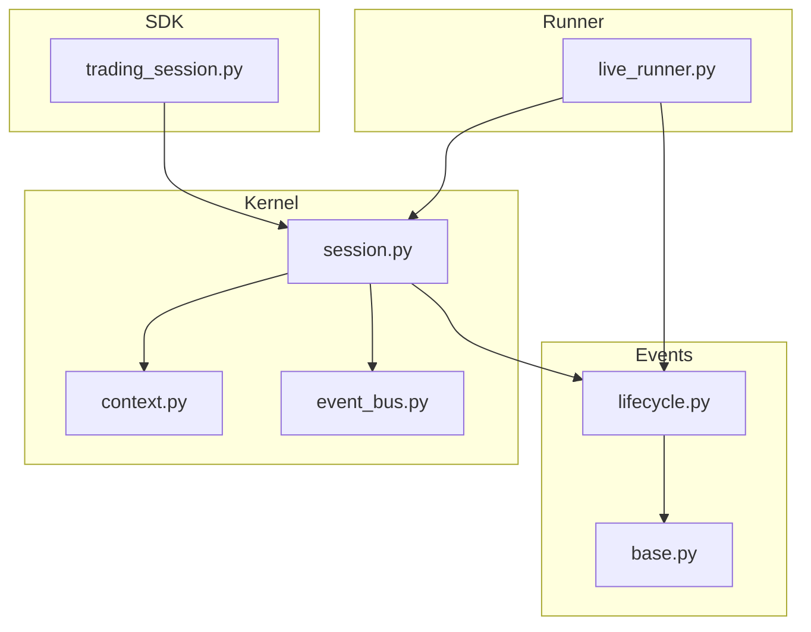
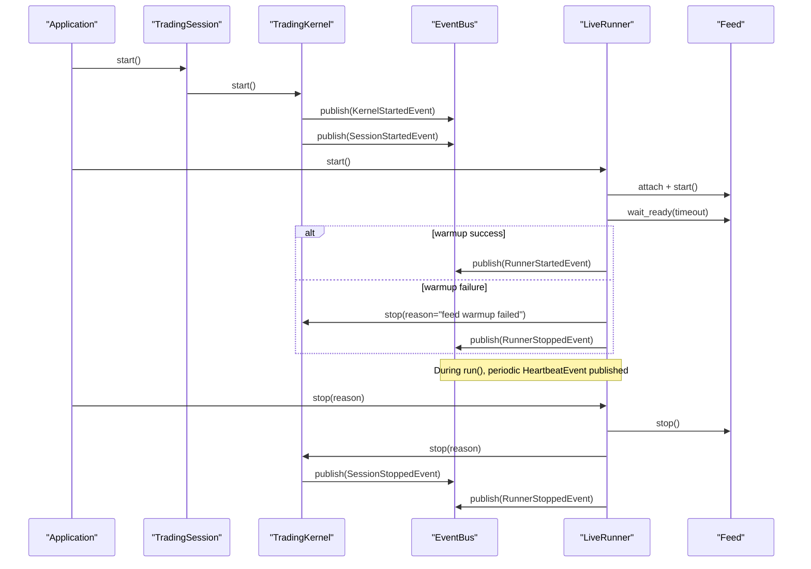
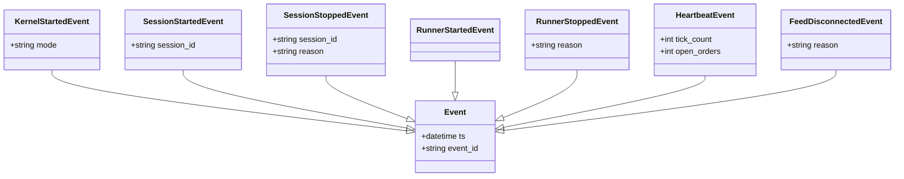
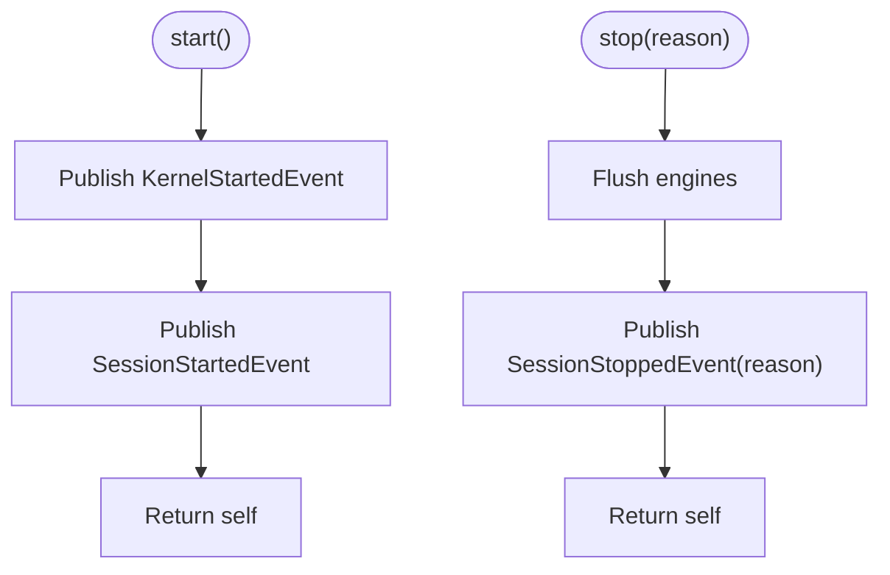
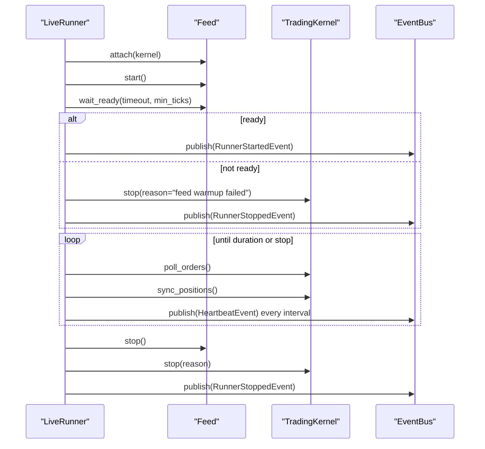
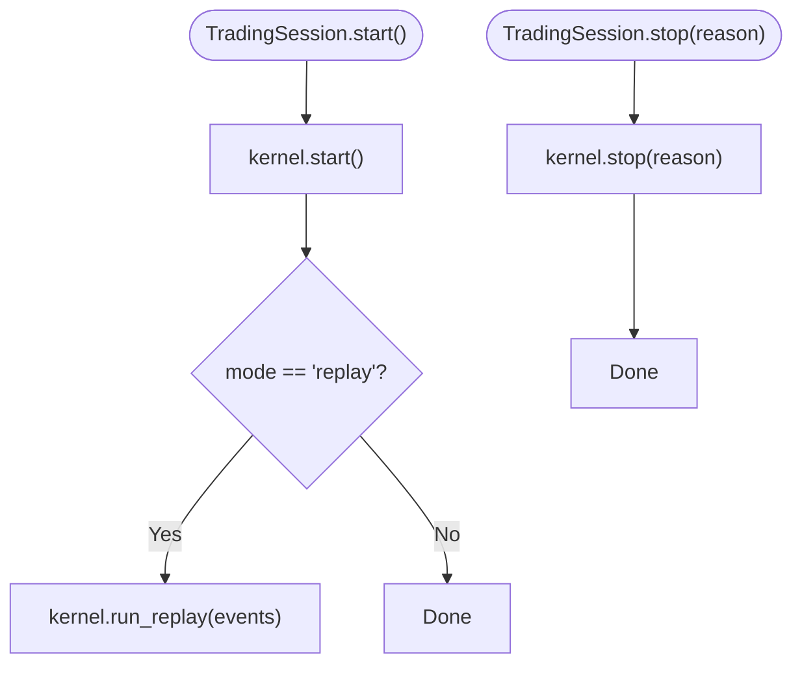
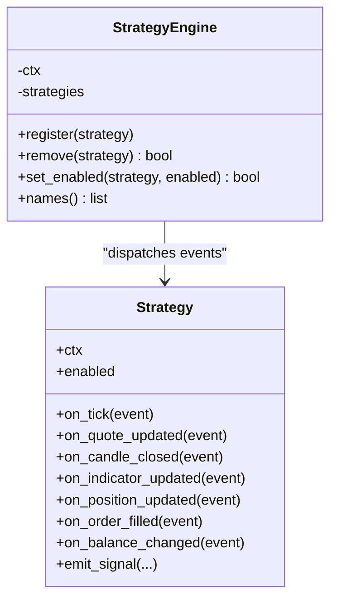
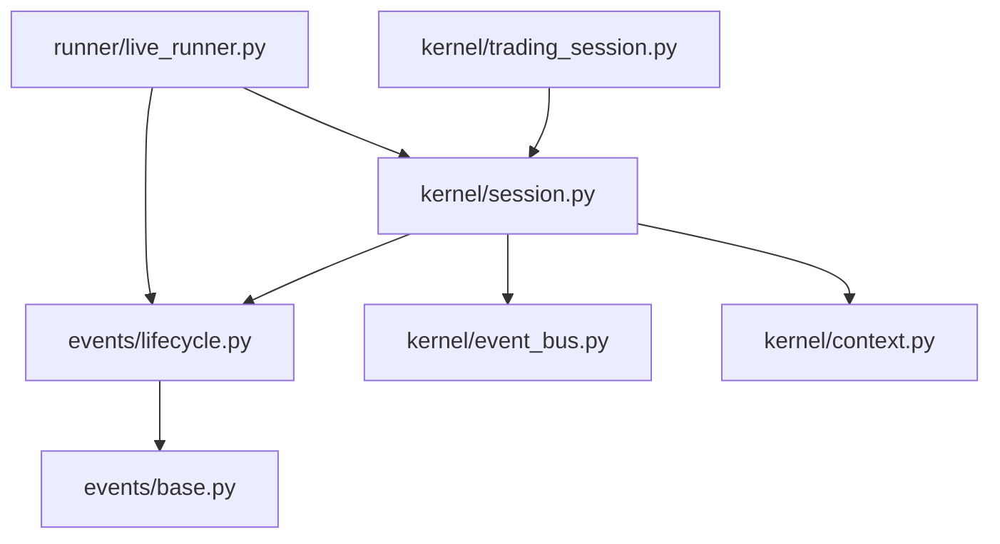

# Lifecycle Events

<cite>
**Referenced Files in This Document**
- [lifecycle.py](file://ntrade/events/lifecycle.py)
- [base.py](file://ntrade/events/base.py)
- [event_bus.py](file://ntrade/kernel/event_bus.py)
- [session.py](file://ntrade/kernel/session.py)
- [trading_session.py](file://ntrade/kernel/trading_session.py)
- [live_runner.py](file://ntrade/runner/live_runner.py)
- [context.py](file://ntrade/kernel/context.py)
- [strategy_engine.py](file://ntrade/engines/strategy_engine.py)
- [test_trading_session.py](file://tests/test_trading_session.py)
</cite>

## Table of Contents
1. [Introduction](#introduction)
2. [Project Structure](#project-structure)
3. [Core Components](#core-components)
4. [Architecture Overview](#architecture-overview)
5. [Detailed Component Analysis](#detailed-component-analysis)
6. [Dependency Analysis](#dependency-analysis)
7. [Performance Considerations](#performance-considerations)
8. [Troubleshooting Guide](#troubleshooting-guide)
9. [Conclusion](#conclusion)
10. [Appendices](#appendices)

## Introduction
This document explains the trading session lifecycle events and how they coordinate initialization, operation, and graceful shutdown across the system. It focuses on SessionStarted, SessionStopped, KernelStarted, RunnerStarted, RunnerStopped, Heartbeat, and FeedDisconnected events, detailing their ordering during startup/shutdown and how components should respond to lifecycle changes. It also provides guidance for building session-aware components and handling transitions correctly.

## Project Structure
The lifecycle is orchestrated by a small set of core modules:
- Event definitions live under ntrade/events/lifecycle.py and inherit from a common base event type.
- The EventBus handles publish/subscribe semantics with thread-safe dispatch and history recording.
- TradingKernel publishes kernel/session lifecycle events and coordinates engines.
- LiveRunner drives the live loop, manages feed lifecycle, and emits runner-level lifecycle events.
- TradingSession is the user-facing entry point that wires broker, kernel, and runner.

**Diagram sources**
- [lifecycle.py:1-57](file://ntrade/events/lifecycle.py#L1-L57)
- [base.py:1-22](file://ntrade/events/base.py#L1-L22)
- [session.py:1-200](file://ntrade/kernel/session.py#L1-L200)
- [event_bus.py:1-81](file://ntrade/kernel/event_bus.py#L1-L81)
- [context.py:1-79](file://ntrade/kernel/context.py#L1-L79)
- [live_runner.py:1-196](file://ntrade/runner/live_runner.py#L1-L196)
- [trading_session.py:1-306](file://ntrade/kernel/trading_session.py#L1-L306)

**Section sources**
- [lifecycle.py:1-57](file://ntrade/events/lifecycle.py#L1-L57)
- [base.py:1-22](file://ntrade/events/base.py#L1-L22)
- [event_bus.py:1-81](file://ntrade/kernel/event_bus.py#L1-L81)
- [session.py:1-200](file://ntrade/kernel/session.py#L1-L200)
- [trading_session.py:1-306](file://ntrade/kernel/trading_session.py#L1-L306)
- [live_runner.py:1-196](file://ntrade/runner/live_runner.py#L1-L196)
- [context.py:1-79](file://ntrade/kernel/context.py#L1-L79)

## Core Components
- Event model: All events are immutable dataclasses carrying a kernel-clock timestamp and a unique identifier. This ensures deterministic replay and consistent ordering.
- EventBus: A synchronous, thread-safe pub/sub bus with reentrant locking, MRO-based dispatch (handlers registered on base types receive subclass events), and per-handler exception isolation.
- TradingKernel: Wires engines and execution targets; publishes KernelStartedEvent and SessionStartedEvent on start; publishes SessionStoppedEvent on stop; supports replay mode via run_replay.
- LiveRunner: Orchestrates the live day loop; attaches and starts the feed; publishes RunnerStartedEvent after warmup; publishes RunnerStoppedEvent on normal or error exit; periodically emits HeartbeatEvent; reacts to risk halts.
- TradingSession: User-facing API that constructs broker, kernel, and runner; delegates start/stop to kernel; optional replay event feeding.

Key responsibilities:
- Initialization order: KernelStartedEvent -> SessionStartedEvent -> RunnerStartedEvent (after feed warmup).
- Shutdown order: RunnerStoppedEvent -> SessionStoppedEvent (with reason).
- Operational heartbeat: HeartbeatEvent emitted periodically to signal liveness and open orders.

**Section sources**
- [base.py:1-22](file://ntrade/events/base.py#L1-L22)
- [event_bus.py:1-81](file://ntrade/kernel/event_bus.py#L1-L81)
- [session.py:122-132](file://ntrade/kernel/session.py#L122-L132)
- [live_runner.py:55-73](file://ntrade/runner/live_runner.py#L55-L73)
- [live_runner.py:135-141](file://ntrade/runner/live_runner.py#L135-L141)
- [trading_session.py:240-249](file://ntrade/kernel/trading_session.py#L240-L249)

## Architecture Overview
The lifecycle flows through three layers: SDK (TradingSession), Kernel (TradingKernel), and Runner (LiveRunner). Events travel via EventBus, ensuring decoupled communication and deterministic timestamps.

**Diagram sources**
- [trading_session.py:240-249](file://ntrade/kernel/trading_session.py#L240-L249)
- [session.py:122-132](file://ntrade/kernel/session.py#L122-L132)
- [live_runner.py:55-73](file://ntrade/runner/live_runner.py#L55-L73)
- [live_runner.py:135-141](file://ntrade/runner/live_runner.py#L135-L141)
- [live_runner.py:143-152](file://ntrade/runner/live_runner.py#L143-L152)

## Detailed Component Analysis

### Event Model and Bus
- Base Event carries ts and event_id; all lifecycle events inherit this contract.
- EventBus subscribes handlers to event types and subclasses; exceptions in handlers are caught and logged without stopping the bus. History is retained for replay and diagnostics.

**Diagram sources**
- [base.py:16-22](file://ntrade/events/base.py#L16-L22)
- [lifecycle.py:11-57](file://ntrade/events/lifecycle.py#L11-L57)

**Section sources**
- [base.py:1-22](file://ntrade/events/base.py#L1-L22)
- [event_bus.py:24-81](file://ntrade/kernel/event_bus.py#L24-L81)
- [lifecycle.py:1-57](file://ntrade/events/lifecycle.py#L1-L57)

### TradingKernel Lifecycle
- On start(): publishes KernelStartedEvent followed immediately by SessionStartedEvent.
- On stop(reason): flushes state and publishes SessionStoppedEvent with the provided reason.
- Replay mode: run_replay sets clock time per event and publishes each event through the bus deterministically.

**Diagram sources**
- [session.py:122-132](file://ntrade/kernel/session.py#L122-L132)

**Section sources**
- [session.py:122-132](file://ntrade/kernel/session.py#L122-L132)
- [session.py:135-147](file://ntrade/kernel/session.py#L135-L147)

### LiveRunner Orchestration
- start(): attaches feed, starts feed, optionally waits for warmup; publishes RunnerStartedEvent on success; otherwise stops kernel and publishes RunnerStoppedEvent.
- run(duration): enters main loop; step() performs periodic poll_orders and sync_positions; monitors feed watchdog; emits HeartbeatEvent at intervals.
- stop(reason): stops feed, calls kernel.stop(reason), publishes RunnerStoppedEvent.

**Diagram sources**
- [live_runner.py:55-73](file://ntrade/runner/live_runner.py#L55-L73)
- [live_runner.py:105-133](file://ntrade/runner/live_runner.py#L105-L133)
- [live_runner.py:135-141](file://ntrade/runner/live_runner.py#L135-L141)
- [live_runner.py:143-152](file://ntrade/runner/live_runner.py#L143-L152)

**Section sources**
- [live_runner.py:55-73](file://ntrade/runner/live_runner.py#L55-L73)
- [live_runner.py:105-133](file://ntrade/runner/live_runner.py#L105-L133)
- [live_runner.py:135-141](file://ntrade/runner/live_runner.py#L135-L141)
- [live_runner.py:143-152](file://ntrade/runner/live_runner.py#L143-L152)

### TradingSession Entry Point
- Provides constructors for live, paper, and replay modes.
- start() delegates to kernel.start(); in replay mode, feeds prebuilt events through kernel.run_replay.
- stop(reason) delegates to kernel.stop(reason).

**Diagram sources**
- [trading_session.py:240-249](file://ntrade/kernel/trading_session.py#L240-L249)

**Section sources**
- [trading_session.py:240-249](file://ntrade/kernel/trading_session.py#L240-L249)

### Strategy Hooks and Lifecycle Awareness
Strategies react to market and portfolio events via hooks. While strategies do not directly handle lifecycle events, they can be made lifecycle-aware by:
- Subscribing to RunnerStartedEvent to initialize resources or mark readiness.
- Subscribing to RunnerStoppedEvent to perform cleanup or finalize state.
- Using context.now() for deterministic timestamps.

**Diagram sources**
- [strategy_engine.py:18-102](file://ntrade/engines/strategy_engine.py#L18-L102)

**Section sources**
- [strategy_engine.py:1-102](file://ntrade/engines/strategy_engine.py#L1-L102)

## Dependency Analysis
- Events depend on base.Event for timestamping and identity.
- TradingKernel depends on EventBus for publishing lifecycle events and on engines for processing.
- LiveRunner depends on TradingKernel and EventBus; it orchestrates feed lifecycle and emits runner-level events.
- TradingSession depends on TradingKernel and optionally BrokerAdapter; it exposes a simple start/stop interface.

**Diagram sources**
- [lifecycle.py:1-57](file://ntrade/events/lifecycle.py#L1-L57)
- [base.py:1-22](file://ntrade/events/base.py#L1-L22)
- [session.py:1-200](file://ntrade/kernel/session.py#L1-L200)
- [event_bus.py:1-81](file://ntrade/kernel/event_bus.py#L1-L81)
- [context.py:1-79](file://ntrade/kernel/context.py#L1-L79)
- [live_runner.py:1-196](file://ntrade/runner/live_runner.py#L1-L196)
- [trading_session.py:1-306](file://ntrade/kernel/trading_session.py#L1-L306)

**Section sources**
- [lifecycle.py:1-57](file://ntrade/events/lifecycle.py#L1-L57)
- [base.py:1-22](file://ntrade/events/base.py#L1-L22)
- [session.py:1-200](file://ntrade/kernel/session.py#L1-L200)
- [event_bus.py:1-81](file://ntrade/kernel/event_bus.py#L1-L81)
- [context.py:1-79](file://ntrade/kernel/context.py#L1-L79)
- [live_runner.py:1-196](file://ntrade/runner/live_runner.py#L1-L196)
- [trading_session.py:1-306](file://ntrade/kernel/trading_session.py#L1-L306)

## Performance Considerations
- EventBus uses a reentrant lock around publish to serialize dispatch and protect shared read-models; handler exceptions are isolated to avoid cascading failures.
- Heartbeat emission is throttled by an internal timer to reduce overhead while providing liveness signals.
- Feed warmup timeout prevents long hangs; if warmup fails, the runner stops quickly and publishes RunnerStoppedEvent.
- Replay mode sets clock per event to ensure zero-parity timing between live and backtest/replay.

[No sources needed since this section provides general guidance]

## Troubleshooting Guide
Common issues and resolutions:
- Feed warmup failure: If the feed does not become ready within the configured timeout, LiveRunner stops the kernel and publishes RunnerStoppedEvent. Inspect feed configuration and connectivity.
- Missing lifecycle events: Ensure start() is called on both TradingSession and LiveRunner; verify that the EventBus has subscribers for lifecycle events.
- Stale heartbeats: Confirm that instruments have streams reporting tick counts; check feed watchdog logic and ensure new ticks are flowing.
- Graceful shutdown: Always call stop(reason) on LiveRunner; it will stop the feed, call kernel.stop(reason), and publish RunnerStoppedEvent.

**Section sources**
- [live_runner.py:55-73](file://ntrade/runner/live_runner.py#L55-L73)
- [live_runner.py:135-141](file://ntrade/runner/live_runner.py#L135-L141)
- [live_runner.py:143-152](file://ntrade/runner/live_runner.py#L143-L152)
- [event_bus.py:47-66](file://ntrade/kernel/event_bus.py#L47-L66)

## Conclusion
The trading session lifecycle is cleanly separated into kernel-level (KernelStartedEvent, SessionStartedEvent, SessionStoppedEvent) and runner-level (RunnerStartedEvent, RunnerStoppedEvent, HeartbeatEvent) concerns. The EventBus guarantees deterministic, thread-safe dispatch, while TradingKernel and LiveRunner coordinate initialization, operation, and graceful shutdown. Strategies remain decoupled from lifecycle details but can subscribe to runner events to manage readiness and cleanup. Following the documented ordering and patterns ensures robust, reproducible sessions across live, paper, and replay modes.

[No sources needed since this section summarizes without analyzing specific files]

## Appendices

### Example: Implementing a Session-Aware Component
- Subscribe to RunnerStartedEvent to initialize resources when the runner becomes ready.
- Subscribe to RunnerStoppedEvent to perform cleanup and persist final state.
- Use context.now() for timestamps to maintain parity across modes.
- Avoid blocking operations in event handlers; offload heavy work to background tasks.

Reference implementation patterns:
- Event subscription and handler registration via EventBus.subscribe.
- Accessing context and clock via TradingContext.
- Publishing custom domain events using the same bus.

**Section sources**
- [event_bus.py:30-38](file://ntrade/kernel/event_bus.py#L30-L38)
- [context.py:17-46](file://ntrade/kernel/context.py#L17-L46)
- [lifecycle.py:34-43](file://ntrade/events/lifecycle.py#L34-L43)

### Example: Testing Lifecycle Ordering
- Create a TradingSession in paper mode.
- Call start() and stop(reason) and inspect bus.history for expected events.
- Verify that KernelStartedEvent precedes SessionStartedEvent, and SessionStoppedEvent follows stop().

**Section sources**
- [test_trading_session.py:155-166](file://tests/test_trading_session.py#L155-L166)