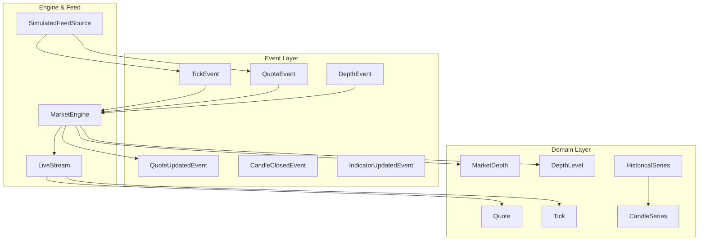
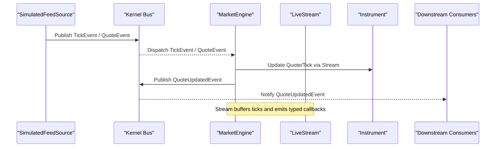
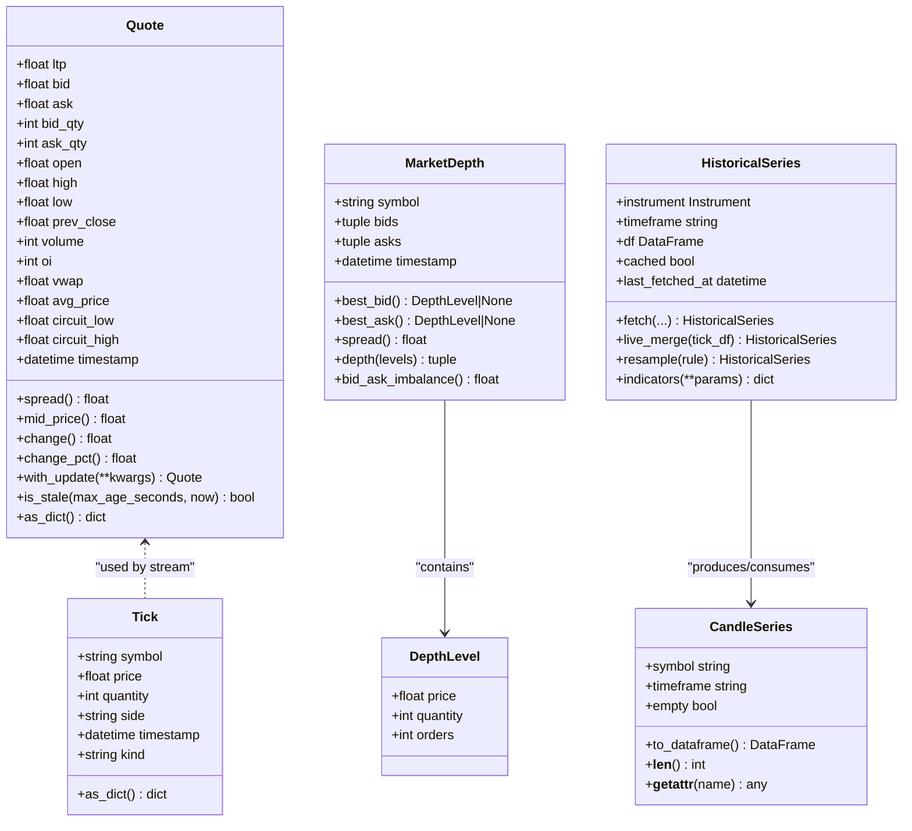
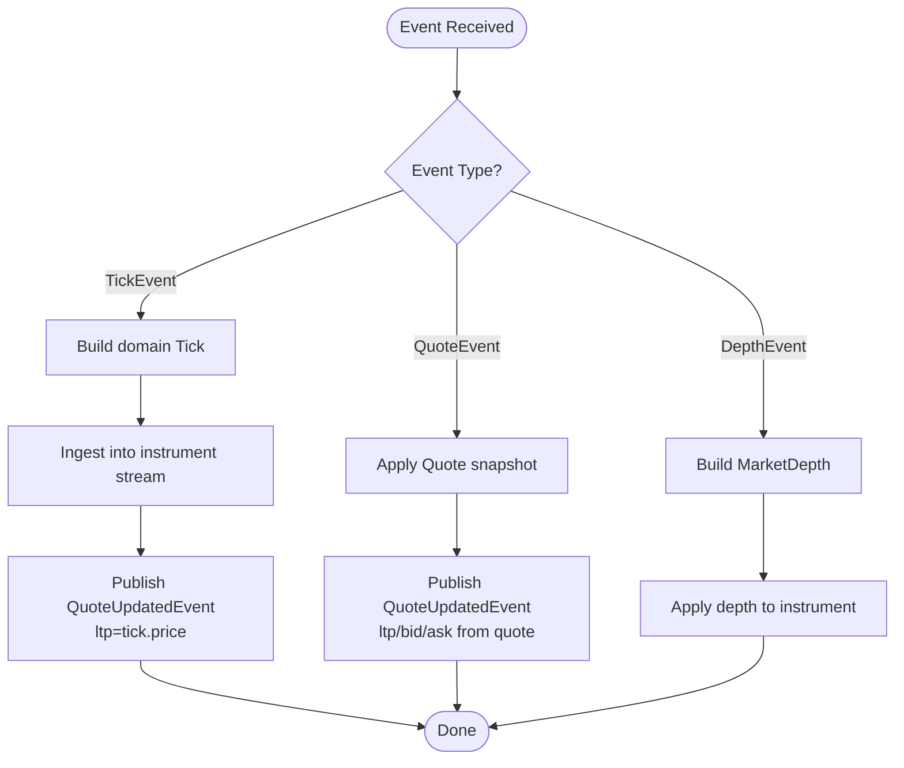
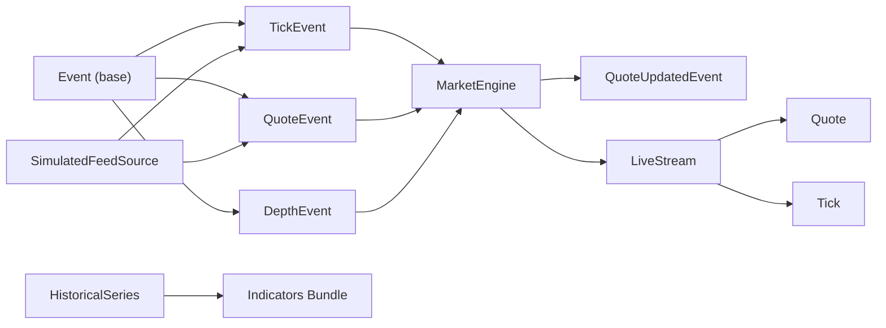

# Market Events

<cite>
**Referenced Files in This Document**
- [market.py](file://ntrade/events/market.py)
- [base.py](file://ntrade/events/base.py)
- [quote.py](file://ntrade/domain/market/quote.py)
- [depth.py](file://ntrade/domain/market/depth.py)
- [candles.py](file://ntrade/domain/market/candles.py)
- [stream.py](file://ntrade/domain/market/stream.py)
- [history.py](file://ntrade/domain/market/history.py)
- [market_engine.py](file://ntrade/engines/market_engine.py)
- [market_feed.py](file://ntrade/sources/market_feed.py)
- [tick_simulator.py](file://ntrade/sim/tick_simulator.py)
- [test_quote.py](file://tests/test_quote.py)
- [test_sources.py](file://tests/test_sources.py)
- [test_history_stream.py](file://tests/test_history_stream.py)
</cite>

## Table of Contents
1. [Introduction](#introduction)
2. [Project Structure](#project-structure)
3. [Core Components](#core-components)
4. [Architecture Overview](#architecture-overview)
5. [Detailed Component Analysis](#detailed-component-analysis)
6. [Dependency Analysis](#dependency-analysis)
7. [Performance Considerations](#performance-considerations)
8. [Troubleshooting Guide](#troubleshooting-guide)
9. [Conclusion](#conclusion)
10. [Appendices](#appendices)

## Introduction
This document explains the market-related event types and data models used to represent real-time market information in the system. It covers Quote, Tick, MarketDepth, and related events, detailing their field structures, relationships, and usage patterns within market data processing pipelines. It also documents how these events integrate with the market engine, how to subscribe to market events, and how to handle different market data scenarios such as live ticks, quote snapshots, and order book depth updates.

## Project Structure
The market event system is organized into three primary layers:
- Event layer: canonical, immutable events that flow through the kernel’s event bus
- Domain layer: value objects representing quotes, ticks, and depth snapshots
- Engine and feed layer: components that consume events, update instrument state, and broadcast normalized updates

**Diagram sources**
- [market.py:1-83](file://ntrade/events/market.py#L1-L83)
- [quote.py:1-91](file://ntrade/domain/market/quote.py#L1-L91)
- [depth.py:1-49](file://ntrade/domain/market/depth.py#L1-L49)
- [candles.py:1-67](file://ntrade/domain/market/candles.py#L1-L67)
- [stream.py:1-131](file://ntrade/domain/market/stream.py#L1-L131)
- [history.py:1-149](file://ntrade/domain/market/history.py#L1-L149)
- [market_engine.py:1-64](file://ntrade/engines/market_engine.py#L1-L64)
- [market_feed.py:1-105](file://ntrade/sources/market_feed.py#L1-L105)

**Section sources**
- [market.py:1-83](file://ntrade/events/market.py#L1-L83)
- [base.py:1-22](file://ntrade/events/base.py#L1-L22)
- [quote.py:1-91](file://ntrade/domain/market/quote.py#L1-L91)
- [depth.py:1-49](file://ntrade/domain/market/depth.py#L1-L49)
- [candles.py:1-67](file://ntrade/domain/market/candles.py#L1-L67)
- [stream.py:1-131](file://ntrade/domain/market/stream.py#L1-L131)
- [history.py:1-149](file://ntrade/domain/market/history.py#L1-L149)
- [market_engine.py:1-64](file://ntrade/engines/market_engine.py#L1-L64)
- [market_feed.py:1-105](file://ntrade/sources/market_feed.py#L1-L105)

## Core Components
- Event base: All events inherit a common base carrying a kernel-clock timestamp and unique identifier for deterministic replay and backtesting.
- Market events: TickEvent, QuoteEvent, DepthEvent, CandleClosedEvent, QuoteUpdatedEvent, IndicatorUpdatedEvent define the canonical messages exchanged across subsystems.
- Domain value objects: Quote and Tick are immutable representations of price/time data; MarketDepth and DepthLevel model order book snapshots; CandleSeries wraps OHLCV data; HistoricalSeries manages historical data lifecycle and merging with live ticks.
- Live stream: Each instrument owns a LiveStream that buffers recent ticks, maintains last tick, and emits typed callbacks (tick, quote, trade, depth).
- Market engine: Consumes raw market events, projects them into instrument read-model state, and broadcasts normalized QuoteUpdatedEvent for downstream consumers.
- Feed source: SimulatedFeedSource produces canonical events deterministically from price paths or OHLCV frames, enabling zero-parity simulation.

**Section sources**
- [base.py:1-22](file://ntrade/events/base.py#L1-L22)
- [market.py:1-83](file://ntrade/events/market.py#L1-L83)
- [quote.py:1-91](file://ntrade/domain/market/quote.py#L1-L91)
- [depth.py:1-49](file://ntrade/domain/market/depth.py#L1-L49)
- [candles.py:1-67](file://ntrade/domain/market/candles.py#L1-L67)
- [stream.py:1-131](file://ntrade/domain/market/stream.py#L1-L131)
- [history.py:1-149](file://ntrade/domain/market/history.py#L1-L149)
- [market_engine.py:1-64](file://ntrade/engines/market_engine.py#L1-L64)
- [market_feed.py:1-105](file://ntrade/sources/market_feed.py#L1-L105)

## Architecture Overview
The market pipeline transforms raw exchange or simulated inputs into normalized, instrument-level state and then broadcasts consistent updates to downstream engines.

**Diagram sources**
- [market_feed.py:70-105](file://ntrade/sources/market_feed.py#L70-L105)
- [market_engine.py:15-64](file://ntrade/engines/market_engine.py#L15-L64)
- [stream.py:105-131](file://ntrade/domain/market/stream.py#L105-L131)

## Detailed Component Analysis

### Event Types and Field Structures
- TickEvent: Represents a single print (trade, quote, or depth) with symbol, exchange, price, quantity, side, and kind. Used for granular price movement tracking.
- QuoteEvent: Full snapshot including ltp, bid, ask, open, high, low, prev_close, volume, and oi. Used when a complete quote state is available.
- DepthEvent: Order book snapshot with bids and asks tuples of (price, qty, orders). Used for liquidity analysis and spread monitoring.
- QuoteUpdatedEvent: Normalized broadcast after projection, containing ltp, bid, ask, and timestamps. The canonical signal for downstream engines.
- CandleClosedEvent: Completed candle with OHLCV fields and timeframe. Produced by the candle engine upon bar completion.
- IndicatorUpdatedEvent: Bundle of indicator values computed over the latest completed candle.

All events carry ts and event_id from the base Event class, ensuring deterministic ordering and replayability.

**Section sources**
- [market.py:11-83](file://ntrade/events/market.py#L11-L83)
- [base.py:16-22](file://ntrade/events/base.py#L16-L22)

### Domain Value Objects
- Quote: Immutable point-in-time quote with derived methods like spread(), mid_price(), change(), change_pct(), and staleness checks. Supports immutable updates via with_update().
- Tick: Immutable tick with symbol, price, quantity, side, timestamp, and kind. Useful for streaming price changes and trade direction.
- MarketDepth and DepthLevel: Immutable order book snapshot with best_bid(), best_ask(), spread(), depth slicing, and imbalance calculation.
- CandleSeries: Typed wrapper around OHLCV DataFrame with escape hatch to underlying DataFrame for analytics.
- HistoricalSeries: Lifecycle-managed history with caching, fetching, merging live ticks, resampling, and indicator computation.

**Diagram sources**
- [quote.py:9-91](file://ntrade/domain/market/quote.py#L9-L91)
- [depth.py:9-49](file://ntrade/domain/market/depth.py#L9-L49)
- [candles.py:18-67](file://ntrade/domain/market/candles.py#L18-L67)
- [history.py:14-149](file://ntrade/domain/market/history.py#L14-L149)

**Section sources**
- [quote.py:1-91](file://ntrade/domain/market/quote.py#L1-L91)
- [depth.py:1-49](file://ntrade/domain/market/depth.py#L1-L49)
- [candles.py:1-67](file://ntrade/domain/market/candles.py#L1-L67)
- [history.py:1-149](file://ntrade/domain/market/history.py#L1-L149)

### Live Stream and Subscription Patterns
- LiveStream manages per-instrument subscription lifecycle and event handlers for tick, quote, trade, depth, disconnect, reconnect.
- Ingesting a tick updates the instrument’s quote state, caches the tick, and emits appropriate callbacks based on tick kind.
- Ticks are bounded in memory to prevent unbounded growth.
- Handlers can be registered using on_tick, on_quote, on_trade, on_depth, and generic on(event, callback).

Usage pattern example (conceptual):
- Subscribe to an instrument’s stream
- Register handlers for tick and quote events
- Push ticks from broker or simulator
- Handle events in callbacks without blocking the stream

**Section sources**
- [stream.py:21-131](file://ntrade/domain/market/stream.py#L21-L131)
- [test_history_stream.py:83-125](file://tests/test_history_stream.py#L83-L125)

### Market Engine Integration
- MarketEngine subscribes to TickEvent, QuoteEvent, and DepthEvent.
- For TickEvent: constructs a domain Tick, ingests it into the instrument’s stream, and publishes QuoteUpdatedEvent with authoritative ltp from the tick.
- For QuoteEvent: applies a full Quote snapshot to the instrument and publishes QuoteUpdatedEvent with updated fields.
- For DepthEvent: constructs MarketDepth and applies it to the instrument.

**Diagram sources**
- [market_engine.py:15-64](file://ntrade/engines/market_engine.py#L15-L64)

**Section sources**
- [market_engine.py:1-64](file://ntrade/engines/market_engine.py#L1-L64)

### Feed Sources and Simulation
- SimulatedFeedSource produces canonical events deterministically from either a list of prices or an OHLCV DataFrame.
- When fed prices, it publishes TickEvent per price step.
- When fed OHLCV frames, it publishes both QuoteEvent and TickEvent per row, enabling candle engine to close bars and strategies to react consistently.
- Clock integration ensures deterministic time progression during replay.

**Section sources**
- [market_feed.py:47-105](file://ntrade/sources/market_feed.py#L47-L105)
- [test_sources.py:26-49](file://tests/test_sources.py#L26-L49)

### Tick Synthesis for Backtesting
- synthesize_1m_ticks generates deterministic 1-second ticks from a 1-minute OHLCV bar while preserving invariants:
  - One tick per second
  - First tick equals open, last equals close
  - All prices within [low, high]
  - High and low touched exactly once
  - Sum of quantities equals bar volume
  - Deterministic output given same seed

**Section sources**
- [tick_simulator.py:20-82](file://ntrade/sim/tick_simulator.py#L20-L82)
- [test_tick_simulator.py:1-73](file://tests/test_tick_simulator.py#L1-L73)

## Dependency Analysis
- Events depend on the base Event for timestamp and id.
- MarketEngine depends on domain Quote/Tick/MarketDepth and events to project state and broadcast updates.
- LiveStream depends on domain Quote/Tick and provides per-instrument event handling.
- SimulatedFeedSource depends on events and integrates with kernel clock for deterministic replay.
- HistoricalSeries depends on pandas DataFrame and exposes indicators via analytics bundle.

**Diagram sources**
- [base.py:16-22](file://ntrade/events/base.py#L16-L22)
- [market.py:11-83](file://ntrade/events/market.py#L11-L83)
- [market_engine.py:15-64](file://ntrade/engines/market_engine.py#L15-L64)
- [stream.py:105-131](file://ntrade/domain/market/stream.py#L105-L131)
- [market_feed.py:70-105](file://ntrade/sources/market_feed.py#L70-L105)
- [history.py:126-133](file://ntrade/domain/market/history.py#L126-L133)

**Section sources**
- [base.py:1-22](file://ntrade/events/base.py#L1-L22)
- [market.py:1-83](file://ntrade/events/market.py#L1-L83)
- [market_engine.py:1-64](file://ntrade/engines/market_engine.py#L1-L64)
- [stream.py:1-131](file://ntrade/domain/market/stream.py#L1-L131)
- [market_feed.py:1-105](file://ntrade/sources/market_feed.py#L1-L105)
- [history.py:1-149](file://ntrade/domain/market/history.py#L1-L149)

## Performance Considerations
- Immutability: Quote and Tick are frozen dataclasses to ensure safe sharing and deterministic comparisons.
- Memory bounds: LiveStream caps tick buffer size to avoid unbounded growth under high-frequency feeds.
- Deterministic timing: Kernel clock timestamps replace wall-clock calls to maintain identical behavior across live, replay, and backtest modes.
- Efficient projections: MarketEngine normalizes diverse inputs into a single QuoteUpdatedEvent stream, reducing branching in downstream consumers.
- Dataframe interop: CandleSeries and HistoricalSeries delegate to pandas where needed, keeping domain boundaries clean while allowing analytical flexibility.

[No sources needed since this section provides general guidance]

## Troubleshooting Guide
- Unknown event names: LiveStream.on raises ValueError for unsupported event names; ensure you use one of the supported event names (tick, quote, trade, depth, disconnect, reconnect).
- Callback exceptions: Stream callbacks are wrapped to prevent failures from halting the stream; inspect logs to identify failing handlers.
- Stale quotes: Use Quote.is_stale to detect outdated data; refresh subscriptions or fetch fresh history if necessary.
- Missing broker adapter: HistoricalSeries.fetch requires a broker adapter; ensure the instrument is properly wired before fetching history.
- Invalid bar ranges: Tick synthesis validates high >= low and minimum seconds; adjust inputs accordingly.

**Section sources**
- [stream.py:83-104](file://ntrade/domain/market/stream.py#L83-L104)
- [test_quote.py:30-36](file://tests/test_quote.py#L30-L36)
- [history.py:68-77](file://ntrade/domain/market/history.py#L68-L77)
- [tick_simulator.py:54-58](file://ntrade/sim/tick_simulator.py#L54-L58)

## Conclusion
The market event system provides a robust, deterministic foundation for real-time market data processing. Canonical events (TickEvent, QuoteEvent, DepthEvent) are projected into instrument state via MarketEngine and normalized into QuoteUpdatedEvent for downstream consumption. Domain value objects (Quote, Tick, MarketDepth) encapsulate market semantics with immutability and derived metrics. LiveStream offers per-instrument subscription and buffering, while SimulatedFeedSource enables zero-parity simulation. Together, these components form a cohesive pipeline suitable for live trading, replay, and backtesting.

[No sources needed since this section summarizes without analyzing specific files]

## Appendices

### Usage Patterns and Examples
- Subscribing to market events:
  - Create an instrument and attach a broker adapter
  - Call instrument.stream.subscribe()
  - Register handlers via on_tick, on_quote, on_trade, on_depth
  - Push ticks from broker or simulator; handle events in callbacks
- Handling different scenarios:
  - Trade ticks: Update last traded price and optionally side
  - Quote snapshots: Replace bid/ask/ltp and daily stats
  - Depth updates: Rebuild order book and compute spread/imbalance
  - Candle closures: Trigger strategy logic based on completed bars
  - Indicator updates: Compute and consume indicator bundles

**Section sources**
- [test_history_stream.py:83-125](file://tests/test_history_stream.py#L83-L125)
- [test_sources.py:26-49](file://tests/test_sources.py#L26-L49)
- [stream.py:83-131](file://ntrade/domain/market/stream.py#L83-L131)
- [market_engine.py:25-64](file://ntrade/engines/market_engine.py#L25-L64)