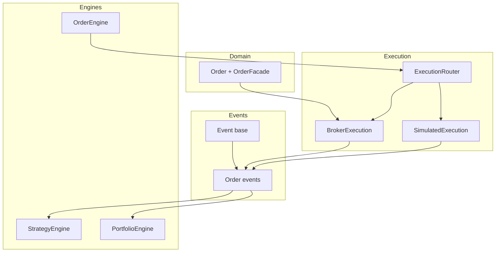
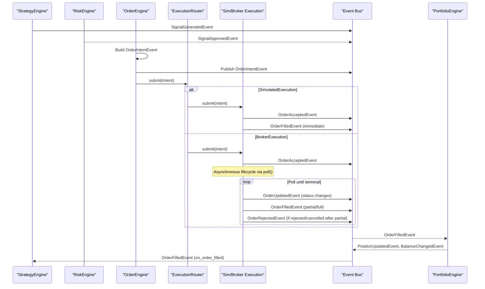
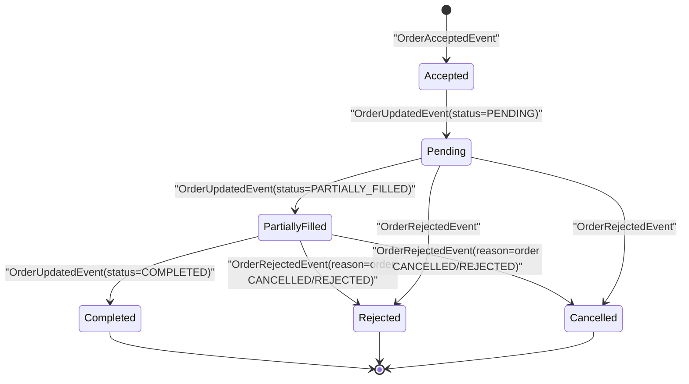
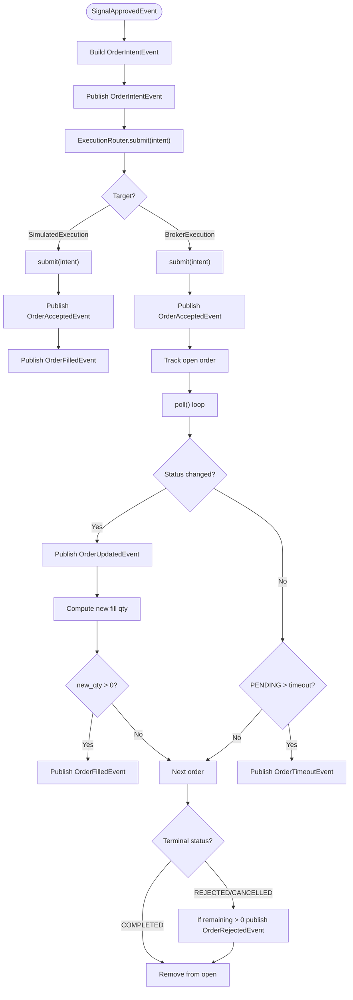
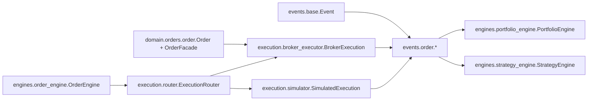

# Order Events

<cite>
**Referenced Files in This Document**
- [ntrade/events/order.py](file://ntrade/events/order.py)
- [ntrade/domain/orders/order.py](file://ntrade/domain/orders/order.py)
- [ntrade/engines/order_engine.py](file://ntrade/engines/order_engine.py)
- [ntrade/execution/router.py](file://ntrade/execution/router.py)
- [ntrade/execution/broker_executor.py](file://ntrade/execution/broker_executor.py)
- [ntrade/execution/simulator.py](file://ntrade/execution/simulator.py)
- [ntrade/engines/portfolio_engine.py](file://ntrade/engines/portfolio_engine.py)
- [ntrade/engines/strategy_engine.py](file://ntrade/engines/strategy_engine.py)
- [ntrade/events/base.py](file://ntrade/events/base.py)
- [tests/test_order_state_events.py](file://tests/test_order_state_events.py)
</cite>

## Table of Contents
1. Introduction
2. Project Structure
3. Core Components
4. Architecture Overview
5. Detailed Component Analysis
6. Dependency Analysis
7. Performance Considerations
8. Troubleshooting Guide
9. Conclusion

## Introduction
This document explains the order lifecycle events and state machine used by the system, focusing on OrderPlaced (OrderAccepted), OrderFilled, OrderCancelled, OrderRejected, and partial fill events. It details how orders flow through the execution pipeline, event ordering guarantees, idempotency considerations, and practical patterns for handling order state changes in strategies.

## Project Structure
The order lifecycle spans several modules:
- Event definitions define immutable events with timestamps from a kernel clock.
- The domain model defines order types, sides, statuses, and an Order facade for placing/modifying/canceling.
- Engines transform signals into order intents and route them to execution targets.
- Execution targets simulate fills or interact with brokers, publishing accepted/filled/rejected/updated events.
- Portfolio and strategy engines consume filled events to update positions and drive further logic.

**Diagram sources**
- [ntrade/events/base.py:1-22](file://ntrade/events/base.py#L1-L22)
- [ntrade/events/order.py:1-91](file://ntrade/events/order.py#L1-L91)
- [ntrade/domain/orders/order.py:1-173](file://ntrade/domain/orders/order.py#L1-L173)
- [ntrade/engines/order_engine.py:1-34](file://ntrade/engines/order_engine.py#L1-L34)
- [ntrade/execution/router.py:1-49](file://ntrade/execution/router.py#L1-L49)
- [ntrade/execution/simulator.py:1-147](file://ntrade/execution/simulator.py#L1-L147)
- [ntrade/execution/broker_executor.py:1-290](file://ntrade/execution/broker_executor.py#L1-L290)
- [ntrade/engines/portfolio_engine.py:1-69](file://ntrade/engines/portfolio_engine.py#L1-L69)
- [ntrade/engines/strategy_engine.py:1-102](file://ntrade/engines/strategy_engine.py#L1-L102)

**Section sources**
- [ntrade/events/base.py:1-22](file://ntrade/events/base.py#L1-L22)
- [ntrade/events/order.py:1-91](file://ntrade/events/order.py#L1-L91)
- [ntrade/domain/orders/order.py:1-173](file://ntrade/domain/orders/order.py#L1-L173)
- [ntrade/engines/order_engine.py:1-34](file://ntrade/engines/order_engine.py#L1-L34)
- [ntrade/execution/router.py:1-49](file://ntrade/execution/router.py#L1-L49)
- [ntrade/execution/simulator.py:1-147](file://ntrade/execution/simulator.py#L1-L147)
- [ntrade/execution/broker_executor.py:1-290](file://ntrade/execution/broker_executor.py#L1-L290)
- [ntrade/engines/portfolio_engine.py:1-69](file://ntrade/engines/portfolio_engine.py#L1-L69)
- [ntrade/engines/strategy_engine.py:1-102](file://ntrade/engines/strategy_engine.py#L1-L102)

## Core Components
- Order events: Immutable dataclasses carrying symbol, exchange, side, quantity, status, prices, costs, and timestamps. Includes OrderIntentEvent, OrderAcceptedEvent, OrderRejectedEvent, OrderFilledEvent, OrderUpdatedEvent, and OrderTimeoutEvent.
- Domain Order model: Defines OrderSide, OrderType, TradeType, OrderStatus, and an Order class with lifecycle helpers and an OrderFacade for placement.
- OrderEngine: Converts approved signals into OrderIntentEvent and submits via router; republishes rejections immediately.
- ExecutionRouter: Routes intents to a target by strategy name or default.
- SimulatedExecution: Deterministic fills against instrument quotes with configurable slippage/commission/statutory costs.
- BrokerExecution: Live execution with asynchronous broker lifecycle, open-order tracking, timeouts, status updates, and partial-fill safety.
- PortfolioEngine: Consumes OrderFilledEvent to update positions and balances.
- StrategyEngine: Dispatches OrderFilledEvent to strategy hooks.

**Section sources**
- [ntrade/events/order.py:1-91](file://ntrade/events/order.py#L1-L91)
- [ntrade/domain/orders/order.py:1-173](file://ntrade/domain/orders/order.py#L1-L173)
- [ntrade/engines/order_engine.py:1-34](file://ntrade/engines/order_engine.py#L1-L34)
- [ntrade/execution/router.py:1-49](file://ntrade/execution/router.py#L1-L49)
- [ntrade/execution/simulator.py:1-147](file://ntrade/execution/simulator.py#L1-L147)
- [ntrade/execution/broker_executor.py:1-290](file://ntrade/execution/broker_executor.py#L1-L290)
- [ntrade/engines/portfolio_engine.py:1-69](file://ntrade/engines/portfolio_engine.py#L1-L69)
- [ntrade/engines/strategy_engine.py:1-102](file://ntrade/engines/strategy_engine.py#L1-L102)

## Architecture Overview
The order lifecycle flows from signal approval to execution and then to portfolio/strategy reactions.

**Diagram sources**
- [ntrade/engines/order_engine.py:1-34](file://ntrade/engines/order_engine.py#L1-L34)
- [ntrade/execution/router.py:1-49](file://ntrade/execution/router.py#L1-L49)
- [ntrade/execution/simulator.py:1-147](file://ntrade/execution/simulator.py#L1-L147)
- [ntrade/execution/broker_executor.py:1-290](file://ntrade/execution/broker_executor.py#L1-L290)
- [ntrade/engines/portfolio_engine.py:1-69](file://ntrade/engines/portfolio_engine.py#L1-L69)
- [ntrade/engines/strategy_engine.py:1-102](file://ntrade/engines/strategy_engine.py#L1-L102)

## Detailed Component Analysis

### Order State Machine and Events
The order state machine is driven by events and broker-reported statuses:
- PENDING: Initial state after acceptance.
- PARTIALLY_FILLED: Partial fill(s) reported.
- COMPLETED: Fully filled.
- REJECTED/CANCELLED: Terminal negative outcomes.

Key events:
- OrderAcceptedEvent: Published when the execution target accepts the order.
- OrderUpdatedEvent: Published whenever an open order’s status changes between polls.
- OrderFilledEvent: Published for each incremental fill (partial-safe).
- OrderRejectedEvent: Published if rejected at submission or later due to cancellation/rejection after partial fills.
- OrderTimeoutEvent: Published when a PENDING order exceeds timeout threshold.

**Diagram sources**
- [ntrade/execution/broker_executor.py:1-290](file://ntrade/execution/broker_executor.py#L1-L290)
- [ntrade/events/order.py:1-91](file://ntrade/events/order.py#L1-L91)
- [ntrade/domain/orders/order.py:1-173](file://ntrade/domain/orders/order.py#L1-L173)

**Section sources**
- [ntrade/events/order.py:1-91](file://ntrade/events/order.py#L1-L91)
- [ntrade/domain/orders/order.py:1-173](file://ntrade/domain/orders/order.py#L1-L173)
- [ntrade/execution/broker_executor.py:1-290](file://ntrade/execution/broker_executor.py#L1-L290)

### Field Definitions for Each Event Type
- OrderIntentEvent: symbol, exchange, side, quantity, order_type, price, strategy, ts.
- OrderAcceptedEvent: order_id, symbol, exchange, side, quantity, strategy, ts.
- OrderRejectedEvent: order_id (optional), symbol, exchange, side, quantity, reason, strategy, ts.
- OrderFilledEvent: order_id, symbol, exchange, side, quantity, fill_price, commission, statutory, strategy, ts.
- OrderUpdatedEvent: order_id, symbol, exchange, side, status, filled_qty, avg_price, strategy, ts.
- OrderTimeoutEvent: order_id, symbol, exchange, side, quantity, age_seconds, strategy, ts.

All events inherit a canonical Event base with ts (kernel-clock timestamp) and event_id.

**Section sources**
- [ntrade/events/order.py:1-91](file://ntrade/events/order.py#L1-L91)
- [ntrade/events/base.py:1-22](file://ntrade/events/base.py#L1-L22)

### Order Flow Through the Execution Pipeline
- OrderEngine consumes SignalApprovedEvent, builds OrderIntentEvent, publishes it, and submits via ExecutionRouter.
- ExecutionRouter selects a target by intent.strategy or default.
- SimulatedExecution returns immediate OrderAcceptedEvent and OrderFilledEvent deterministically.
- BrokerExecution returns OrderAcceptedEvent immediately and asynchronously emits OrderUpdatedEvent, OrderFilledEvent (partial-safe), and OrderRejectedEvent as the broker reports.

**Diagram sources**
- [ntrade/engines/order_engine.py:1-34](file://ntrade/engines/order_engine.py#L1-L34)
- [ntrade/execution/router.py:1-49](file://ntrade/execution/router.py#L1-L49)
- [ntrade/execution/simulator.py:1-147](file://ntrade/execution/simulator.py#L1-L147)
- [ntrade/execution/broker_executor.py:1-290](file://ntrade/execution/broker_executor.py#L1-L290)

**Section sources**
- [ntrade/engines/order_engine.py:1-34](file://ntrade/engines/order_engine.py#L1-L34)
- [ntrade/execution/router.py:1-49](file://ntrade/execution/router.py#L1-L49)
- [ntrade/execution/simulator.py:1-147](file://ntrade/execution/simulator.py#L1-L147)
- [ntrade/execution/broker_executor.py:1-290](file://ntrade/execution/broker_executor.py#L1-L290)

### Event Ordering Guarantees and Idempotency
- Timestamps: All events carry ts from the TradingClock, ensuring deterministic replay/backtest/live parity.
- Ordering within a poll: BrokerExecution.poll() processes open orders sequentially and publishes events in a deterministic order per poll iteration.
- Idempotency:
  - Fills are partial-safe: _emit_fill computes new_qty since last poll and never re-emits already-filled quantities.
  - Status updates only occur when status changes; repeated polls do not duplicate OrderUpdatedEvent.
  - Terminal states remove orders from tracking, preventing duplicate emissions.
- Rejections: Immediate rejection from router or broker surfaces as OrderRejectedEvent without creating open-order state.

**Section sources**
- [ntrade/events/base.py:1-22](file://ntrade/events/base.py#L1-L22)
- [ntrade/execution/broker_executor.py:1-290](file://ntrade/execution/broker_executor.py#L1-L290)

### Handling Order State Changes in Strategies
- Strategies receive OrderFilledEvent via on_order_filled hook.
- Use OrderUpdatedEvent to track intermediate states (e.g., PARTIALLY_FILLED) if needed.
- Avoid relying on exact timing; use event-driven updates to adjust position sizing or exit logic.
- For cancel/modify actions, use OrderFacade methods or BrokerExecution.cancel/modify where applicable.

Practical patterns:
- Accumulate partial fills and compute realized PnL incrementally.
- Gate subsequent signals based on current position derived from OrderFilledEvent consumption.
- Handle OrderRejectedEvent to log reasons and avoid retry storms.

**Section sources**
- [ntrade/engines/strategy_engine.py:1-102](file://ntrade/engines/strategy_engine.py#L1-L102)
- [ntrade/engines/portfolio_engine.py:1-69](file://ntrade/engines/portfolio_engine.py#L1-L69)
- [ntrade/domain/orders/order.py:1-173](file://ntrade/domain/orders/order.py#L1-L173)

### Practical Examples of Order Event Handling
- Test coverage demonstrates:
  - Polling triggers OrderUpdatedEvent on status transitions (PENDING → PARTIALLY_FILLED → COMPLETED).
  - Cancel operations propagate CANCELLED status via OrderUpdatedEvent.
- These tests validate that the OMS emits correct state events and that cancel flows work end-to-end.

**Section sources**
- [tests/test_order_state_events.py:1-109](file://tests/test_order_state_events.py#L1-L109)

## Dependency Analysis

**Diagram sources**
- [ntrade/events/base.py:1-22](file://ntrade/events/base.py#L1-L22)
- [ntrade/events/order.py:1-91](file://ntrade/events/order.py#L1-L91)
- [ntrade/domain/orders/order.py:1-173](file://ntrade/domain/orders/order.py#L1-L173)
- [ntrade/engines/order_engine.py:1-34](file://ntrade/engines/order_engine.py#L1-L34)
- [ntrade/execution/router.py:1-49](file://ntrade/execution/router.py#L1-L49)
- [ntrade/execution/simulator.py:1-147](file://ntrade/execution/simulator.py#L1-L147)
- [ntrade/execution/broker_executor.py:1-290](file://ntrade/execution/broker_executor.py#L1-L290)
- [ntrade/engines/portfolio_engine.py:1-69](file://ntrade/engines/portfolio_engine.py#L1-L69)
- [ntrade/engines/strategy_engine.py:1-102](file://ntrade/engines/strategy_engine.py#L1-L102)

**Section sources**
- [ntrade/engines/order_engine.py:1-34](file://ntrade/engines/order_engine.py#L1-L34)
- [ntrade/execution/router.py:1-49](file://ntrade/execution/router.py#L1-L49)
- [ntrade/execution/simulator.py:1-147](file://ntrade/execution/simulator.py#L1-L147)
- [ntrade/execution/broker_executor.py:1-290](file://ntrade/execution/broker_executor.py#L1-L290)
- [ntrade/engines/portfolio_engine.py:1-69](file://ntrade/engines/portfolio_engine.py#L1-L69)
- [ntrade/engines/strategy_engine.py:1-102](file://ntrade/engines/strategy_engine.py#L1-L102)

## Performance Considerations
- Deterministic simulation: SimulatedExecution avoids network overhead and provides reproducible fills.
- Efficient polling: BrokerExecution tracks open orders and only emits deltas; stale detection evicts unresponsive entries.
- Cost models: Configurable slippage/commission/statutory costs ensure realistic backtests while keeping computation minimal.
- Event bus throughput: Immutable events reduce copying overhead; timestamps from a shared clock simplify replay.

[No sources needed since this section provides general guidance]

## Troubleshooting Guide
Common issues and resolutions:
- No execution target for strategy: Ensure ExecutionRouter has a target registered for the strategy name or set a default.
- Missing instrument: SimulatedExecution rejects intents for unknown instruments; verify registration.
- No market price: Market orders require a valid LTP; handle rejections gracefully.
- Stale orders: BrokerExecution evicts orders after consecutive failures; investigate broker connectivity and error handling.
- Duplicate fills: Verify consumers are idempotent; _emit_fill ensures partial-safe emission.
- Cancel/modify not applied: Confirm order remains in open tracker before calling cancel/modify.

**Section sources**
- [ntrade/execution/router.py:1-49](file://ntrade/execution/router.py#L1-L49)
- [ntrade/execution/simulator.py:1-147](file://ntrade/execution/simulator.py#L1-L147)
- [ntrade/execution/broker_executor.py:1-290](file://ntrade/execution/broker_executor.py#L1-L290)

## Conclusion
The order lifecycle is event-driven, deterministic, and robust across simulated and live environments. OrderAccepted, OrderUpdated, OrderFilled, OrderRejected, and OrderTimeout events provide complete visibility into order states. Idempotency and partial-fill safety ensure reliable downstream processing. Strategies should react to OrderFilledEvent and optionally monitor OrderUpdatedEvent for nuanced state management.