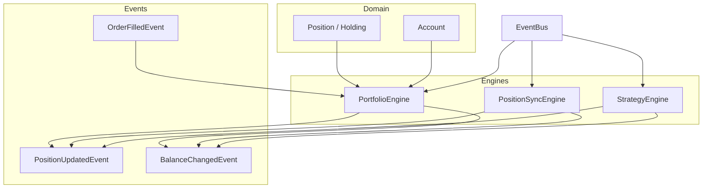
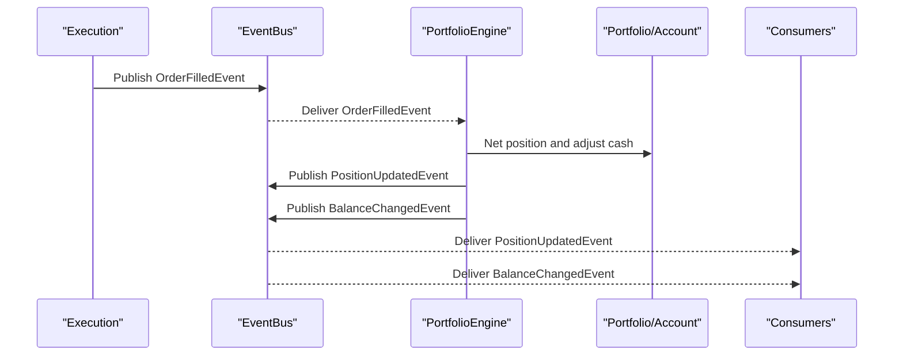
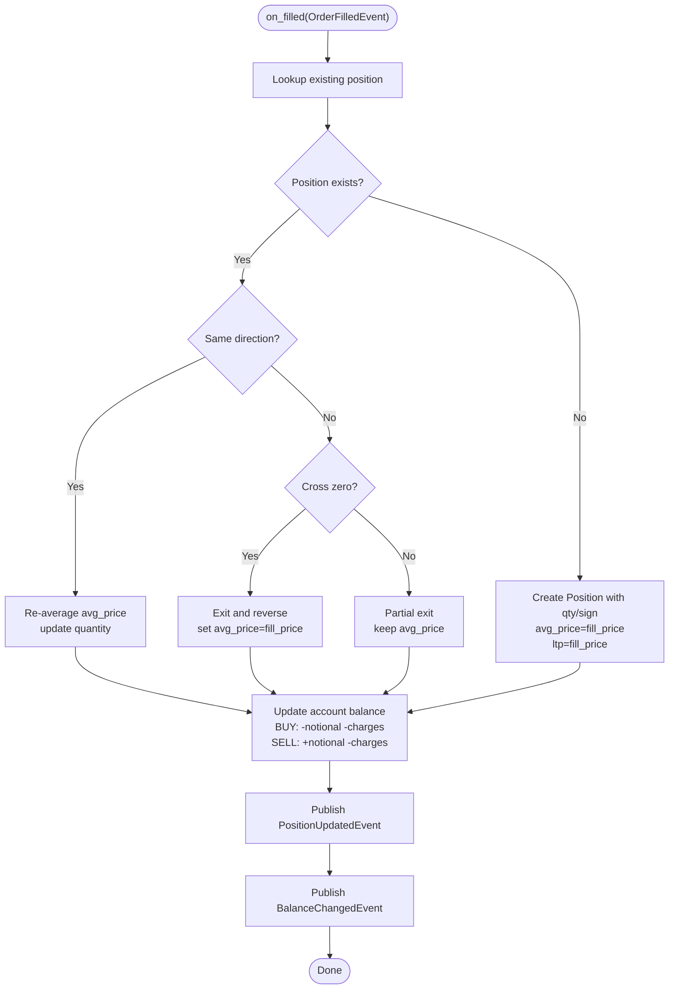
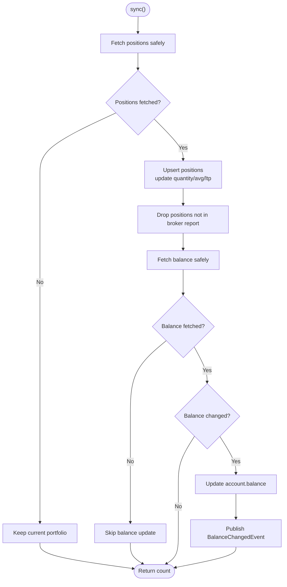
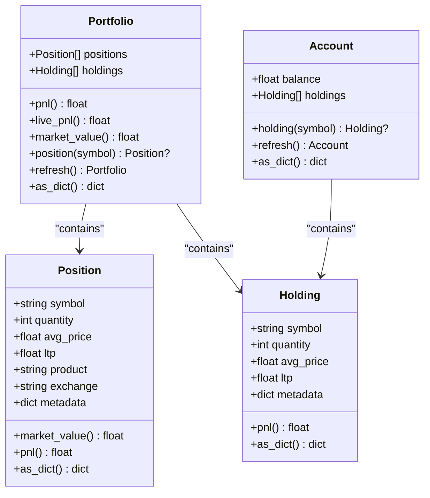
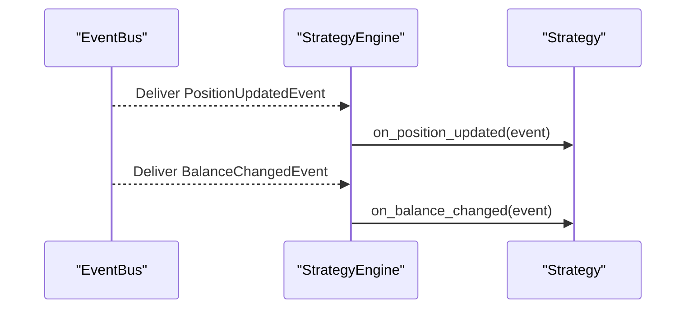
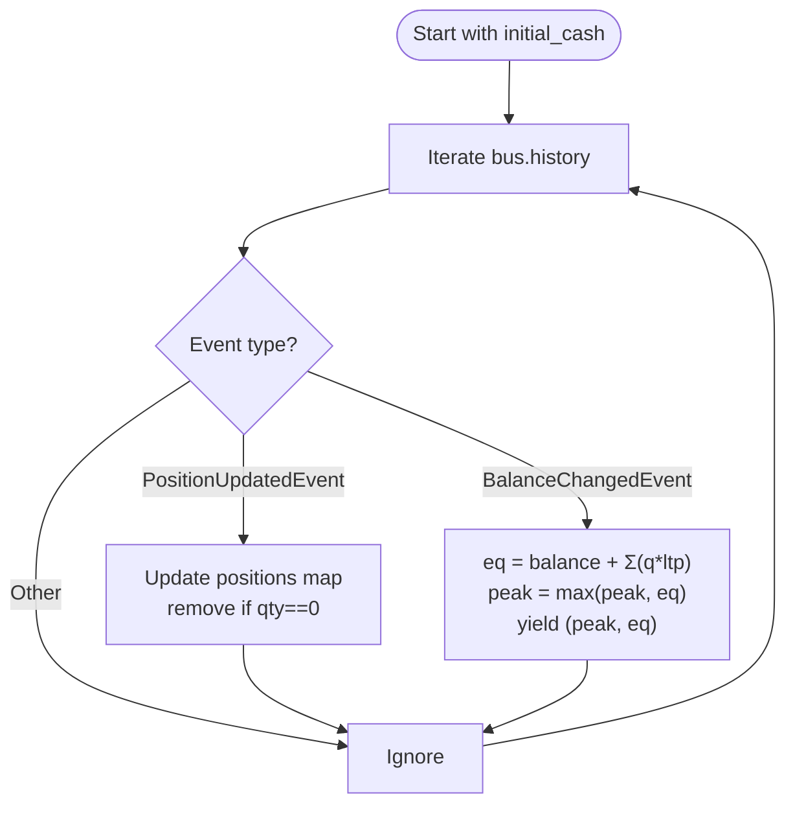
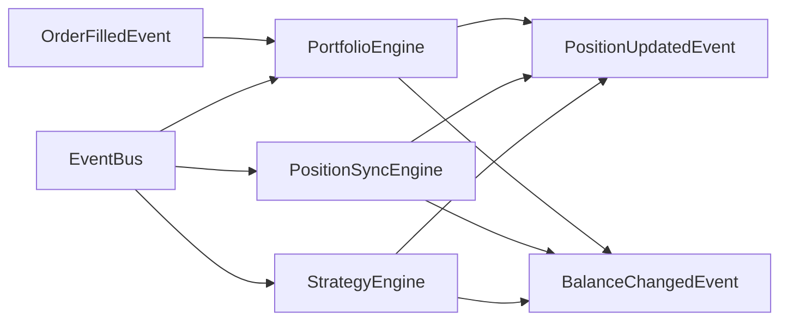

# Portfolio Events

<cite>
**Referenced Files in This Document**
- [portfolio_engine.py](file://ntrade/engines/portfolio_engine.py)
- [position_sync.py](file://ntrade/engines/position_sync.py)
- [portfolio.py](file://ntrade/domain/portfolio.py)
- [portfolio.py](file://ntrade/events/portfolio.py)
- [order.py](file://ntrade/events/order.py)
- [base.py](file://ntrade/events/base.py)
- [event_bus.py](file://ntrade/kernel/event_bus.py)
- [strategy_engine.py](file://ntrade/engines/strategy_engine.py)
- [gate.py](file://ntrade/runner/gate.py)
- [test_portfolio_account.py](file://tests/test_portfolio_account.py)
</cite>

## Table of Contents
1. Introduction
2. Project Structure
3. Core Components
4. Architecture Overview
5. Detailed Component Analysis
6. Dependency Analysis
7. Performance Considerations
8. Troubleshooting Guide
9. Conclusion

## Introduction
This document explains portfolio-related events that reflect changes in holdings, cash balances, and performance metrics. It focuses on PositionUpdatedEvent and BalanceChangedEvent, how they are produced by order fills and broker reconciliation, and how consumers (strategies, monitoring, reporting) should respond to maintain consistent portfolio state. It also clarifies the relationship between OrderFilledEvent and portfolio updates, and provides best practices for reliable portfolio monitoring and event-driven state management.

## Project Structure
Portfolio state is modeled as domain objects and updated via engines that publish canonical events. The key files involved are:
- Domain models for positions and accounts
- Engines that update read models from fills and broker sync
- Event definitions for portfolio state changes
- Event bus for publishing/consuming events
- Strategy engine for hooking into portfolio events
- Gate utilities for equity tracing using portfolio events

**Diagram sources**
- [portfolio_engine.py:1-69](file://ntrade/engines/portfolio_engine.py#L1-L69)
- [position_sync.py:1-110](file://ntrade/engines/position_sync.py#L1-L110)
- [strategy_engine.py:1-102](file://ntrade/engines/strategy_engine.py#L1-L102)
- [portfolio.py:1-173](file://ntrade/domain/portfolio.py#L1-L173)
- [order.py:1-91](file://ntrade/events/order.py#L1-L91)
- [portfolio.py:1-27](file://ntrade/events/portfolio.py#L1-L27)
- [event_bus.py:1-81](file://ntrade/kernel/event_bus.py#L1-L81)

**Section sources**
- [portfolio_engine.py:1-69](file://ntrade/engines/portfolio_engine.py#L1-L69)
- [position_sync.py:1-110](file://ntrade/engines/position_sync.py#L1-L110)
- [portfolio.py:1-173](file://ntrade/domain/portfolio.py#L1-L173)
- [order.py:1-91](file://ntrade/events/order.py#L1-L91)
- [portfolio.py:1-27](file://ntrade/events/portfolio.py#L1-L27)
- [event_bus.py:1-81](file://ntrade/kernel/event_bus.py#L1-L81)
- [strategy_engine.py:1-102](file://ntrade/engines/strategy_engine.py#L1-L102)

## Core Components
- PositionUpdatedEvent: Emitted when a position’s quantity, average price, or last traded price changes due to a fill or broker reconciliation.
- BalanceChangedEvent: Emitted when account balance changes after a fill or when reconciling with the broker’s authoritative balance.
- OrderFilledEvent: The source trigger for portfolio updates; consumed by PortfolioEngine to net positions and adjust cash.
- PortfolioEngine: Maintains the kernel’s Portfolio and Account read models and publishes PositionUpdatedEvent and BalanceChangedEvent after each fill.
- PositionSyncEngine: Reconciles broker-reported positions and balance into the kernel, emitting the same canonical portfolio events.
- StrategyEngine: Dispatches portfolio events to strategy hooks for reactive behavior.
- EventBus: Synchronous pub/sub backbone ensuring deterministic dispatch and history recording.

**Section sources**
- [portfolio_engine.py:1-69](file://ntrade/engines/portfolio_engine.py#L1-L69)
- [position_sync.py:1-110](file://ntrade/engines/position_sync.py#L1-L110)
- [order.py:1-91](file://ntrade/events/order.py#L1-L91)
- [portfolio.py:1-27](file://ntrade/events/portfolio.py#L1-L27)
- [event_bus.py:1-81](file://ntrade/kernel/event_bus.py#L1-L81)
- [strategy_engine.py:1-102](file://ntrade/engines/strategy_engine.py#L1-L102)

## Architecture Overview
The portfolio subsystem follows an event-driven architecture:
- Order execution produces OrderFilledEvent.
- PortfolioEngine consumes it, updates local read models, and publishes PositionUpdatedEvent followed by BalanceChangedEvent.
- PositionSyncEngine periodically reconciles broker state and emits the same canonical events.
- Consumers (strategies, risk, reporting) subscribe to these events to react consistently.

**Diagram sources**
- [portfolio_engine.py:1-69](file://ntrade/engines/portfolio_engine.py#L1-L69)
- [event_bus.py:1-81](file://ntrade/kernel/event_bus.py#L1-L81)
- [order.py:1-91](file://ntrade/events/order.py#L1-L91)

## Detailed Component Analysis

### Portfolio Engine
Responsibilities:
- Subscribe to OrderFilledEvent.
- Update the Portfolio read model: create new positions, net quantities, re-average entry prices, handle exits/reversals, and set LTP.
- Update Account balance by debiting/crediting notional plus charges.
- Publish PositionUpdatedEvent and BalanceChangedEvent with timestamps from the event source.

Key behaviors:
- New position creation on first buy leg.
- Averaging entry price for same-direction adds.
- Exit-and-reverse logic when crossing zero.
- Partial exits preserve original average price.
- Charges include commission and statutory fees per leg.

**Diagram sources**
- [portfolio_engine.py:1-69](file://ntrade/engines/portfolio_engine.py#L1-L69)

**Section sources**
- [portfolio_engine.py:1-69](file://ntrade/engines/portfolio_engine.py#L1-L69)

### Position Sync Engine
Responsibilities:
- Periodically reconcile broker-reported positions and balance into the kernel’s read models.
- Upsert positions, drop positions no longer reported, and update metadata (e.g., strategy origin).
- Publish PositionUpdatedEvent whenever a position changes and BalanceChangedEvent when balance differs from local.

Safety:
- Transient broker errors do not wipe state; previous values are retained.
- Numeric conversion is guarded to avoid corrupting state.

**Diagram sources**
- [position_sync.py:1-110](file://ntrade/engines/position_sync.py#L1-L110)

**Section sources**
- [position_sync.py:1-110](file://ntrade/engines/position_sync.py#L1-L110)

### Portfolio and Account Models
Models provide read-only views and derived metrics:
- Position: tracks symbol, quantity, avg_price, ltp, product, exchange; exposes market_value and pnl.
- Holding: similar to Position but for long holdings.
- Portfolio: aggregates positions, computes total pnl and market value, supports lookup and refresh from broker.
- Account: holds balance and holdings, supports lookup and refresh from broker.

These models are updated by engines and used by consumers for metrics and reporting.

**Diagram sources**
- [portfolio.py:1-173](file://ntrade/domain/portfolio.py#L1-L173)

**Section sources**
- [portfolio.py:1-173](file://ntrade/domain/portfolio.py#L1-L173)

### Strategy Integration with Portfolio Events
StrategyEngine maps portfolio events to strategy hooks:
- PositionUpdatedEvent -> on_position_updated
- BalanceChangedEvent -> on_balance_changed

Strategies can implement these hooks to react to portfolio changes without polling.

**Diagram sources**
- [strategy_engine.py:1-102](file://ntrade/engines/strategy_engine.py#L1-L102)

**Section sources**
- [strategy_engine.py:1-102](file://ntrade/engines/strategy_engine.py#L1-L102)

### Equity Tracing Using Portfolio Events
The gate utility reconstructs equity from the event stream:
- Tracks per-symbol (quantity, ltp) on PositionUpdatedEvent.
- Computes equity on BalanceChangedEvent as cash + sum(quantity * ltp).
- Yields peak and equity points for drawdown analysis.

This ensures consistency with RiskEngine-equivalent equity calculations.

**Diagram sources**
- [gate.py:1-79](file://ntrade/runner/gate.py#L1-L79)

**Section sources**
- [gate.py:1-79](file://ntrade/runner/gate.py#L1-L79)

## Dependency Analysis
- PortfolioEngine depends on OrderFilledEvent and publishes PositionUpdatedEvent and BalanceChangedEvent.
- PositionSyncEngine reads broker state and publishes the same portfolio events.
- StrategyEngine subscribes to portfolio events and forwards to strategies.
- EventBus serializes dispatch and records history for replay and auditing.

**Diagram sources**
- [portfolio_engine.py:1-69](file://ntrade/engines/portfolio_engine.py#L1-L69)
- [position_sync.py:1-110](file://ntrade/engines/position_sync.py#L1-L110)
- [strategy_engine.py:1-102](file://ntrade/engines/strategy_engine.py#L1-L102)
- [event_bus.py:1-81](file://ntrade/kernel/event_bus.py#L1-L81)
- [order.py:1-91](file://ntrade/events/order.py#L1-L91)
- [portfolio.py:1-27](file://ntrade/events/portfolio.py#L1-L27)

**Section sources**
- [portfolio_engine.py:1-69](file://ntrade/engines/portfolio_engine.py#L1-L69)
- [position_sync.py:1-110](file://ntrade/engines/position_sync.py#L1-L110)
- [strategy_engine.py:1-102](file://ntrade/engines/strategy_engine.py#L1-L102)
- [event_bus.py:1-81](file://ntrade/kernel/event_bus.py#L1-L81)
- [order.py:1-91](file://ntrade/events/order.py#L1-L91)
- [portfolio.py:1-27](file://ntrade/events/portfolio.py#L1-L27)

## Performance Considerations
- Event dispatch is synchronous and serialized; handler exceptions are swallowed to protect the kernel.
- History buffer size is configurable; ensure sufficient capacity for replay and audit needs.
- Avoid heavy computation inside event handlers; offload to background tasks if necessary.
- Minimize redundant state updates by checking deltas before publishing events (already implemented in PositionSyncEngine).

[No sources needed since this section provides general guidance]

## Troubleshooting Guide
Common issues and remedies:
- Missing PositionUpdatedEvent: Verify that OrderFilledEvent is published and PortfolioEngine subscription is active. Check that the symbol matches exactly.
- Incorrect balance drift: Ensure statutory charges and commissions are included in OrderFilledEvent fields and that both BUY and SELL branches apply charges correctly.
- Stale positions after broker reconnect: Confirm PositionSyncEngine runs regularly and handles transient errors gracefully.
- Inconsistent equity traces: Ensure equity is computed only on BalanceChangedEvent after PositionUpdatedEvent has been processed.

**Section sources**
- [portfolio_engine.py:1-69](file://ntrade/engines/portfolio_engine.py#L1-L69)
- [position_sync.py:1-110](file://ntrade/engines/position_sync.py#L1-L110)
- [event_bus.py:1-81](file://ntrade/kernel/event_bus.py#L1-L81)
- [gate.py:1-79](file://ntrade/runner/gate.py#L1-L79)

## Conclusion
Portfolio events form a robust, event-driven foundation for tracking holdings, cash, and performance. By relying on PositionUpdatedEvent and BalanceChangedEvent emitted deterministically from fills and broker reconciliation, consumers can maintain consistent state, compute accurate metrics, and react promptly to changes. Best practices include subscribing to canonical events, avoiding direct polling, handling transient failures gracefully, and computing equity only on settled balance updates.

[No sources needed since this section summarizes without analyzing specific files]