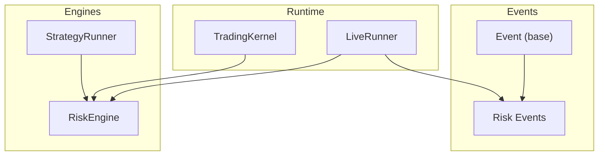
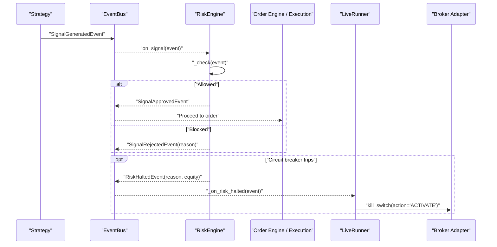
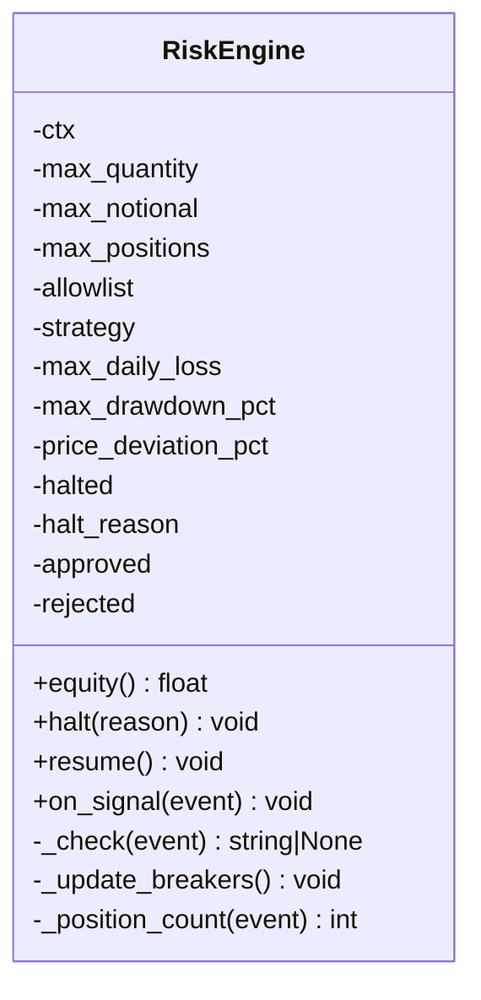
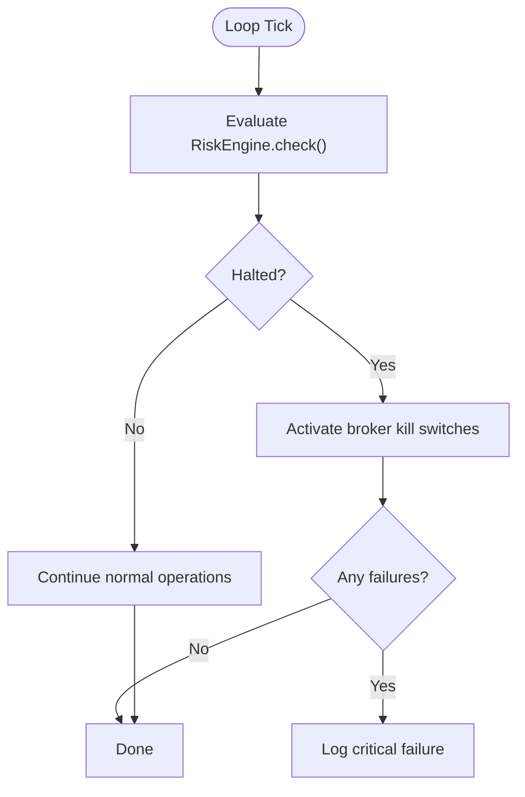
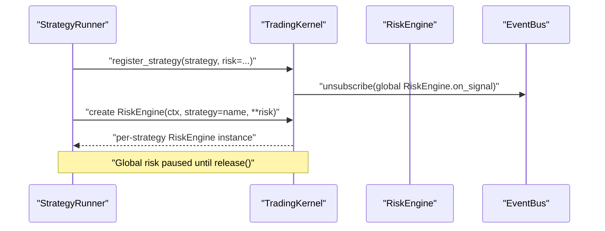
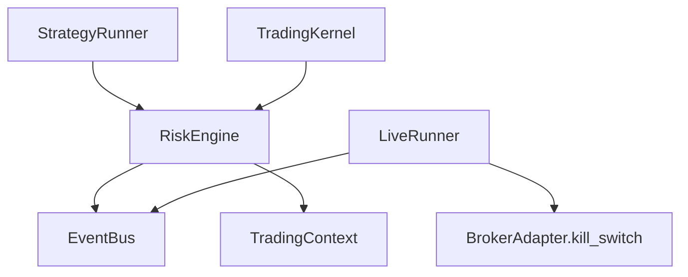

# Risk Events

<cite>
**Referenced Files in This Document**
- [risk_engine.py](file://ntrade/engines/risk_engine.py)
- [risk.py](file://ntrade/events/risk.py)
- [base.py](file://ntrade/events/base.py)
- [live_runner.py](file://ntrade/runner/live_runner.py)
- [session.py](file://ntrade/kernel/session.py)
- [runner.py](file://ntrade/kernel/runner.py)
- [test_risk_breakers.py](file://tests/test_risk_breakers.py)
- [test_kill_switch_wiring.py](file://tests/test_kill_switch_wiring.py)
</cite>

## Table of Contents
1. [Introduction](#introduction)
2. [Project Structure](#project-structure)
3. [Core Components](#core-components)
4. [Architecture Overview](#architecture-overview)
5. [Detailed Component Analysis](#detailed-component-analysis)
6. [Dependency Analysis](#dependency-analysis)
7. [Performance Considerations](#performance-considerations)
8. [Troubleshooting Guide](#troubleshooting-guide)
9. [Conclusion](#conclusion)
10. [Appendices](#appendices)

## Introduction
This document explains the risk management event system and circuit breaker mechanisms that protect live trading from excessive losses, drawdowns, and malformed orders. It covers how risk events are generated by the risk engine, their severity levels, and response protocols. It also details automatic kill switch triggers and how strategies should handle risk events. Finally, it provides guidance for implementing custom risk validators and responding to risk events appropriately.

## Project Structure
The risk system spans a small set of focused modules:
- Event definitions for signals and risk states
- The risk engine that screens signals and enforces circuit breakers
- The live runner that reacts to risk halts with broker-level kill switches
- Kernel wiring that instantiates and manages risk engines per strategy

**Diagram sources**
- [base.py:1-22](file://ntrade/events/base.py#L1-L22)
- [risk.py:1-52](file://ntrade/events/risk.py#L1-L52)
- [risk_engine.py:1-141](file://ntrade/engines/risk_engine.py#L1-L141)
- [session.py:1-200](file://ntrade/kernel/session.py#L1-L200)
- [runner.py:37-160](file://ntrade/kernel/runner.py#L37-L160)
- [live_runner.py:1-196](file://ntrade/runner/live_runner.py#L1-L196)

**Section sources**
- [base.py:1-22](file://ntrade/events/base.py#L1-L22)
- [risk.py:1-52](file://ntrade/events/risk.py#L1-L52)
- [risk_engine.py:1-141](file://ntrade/engines/risk_engine.py#L1-L141)
- [session.py:1-200](file://ntrade/kernel/session.py#L1-L200)
- [runner.py:37-160](file://ntrade/kernel/runner.py#L37-L160)
- [live_runner.py:1-196](file://ntrade/runner/live_runner.py#L1-L196)

## Core Components
- Signal and risk events define the contract between strategies, risk engine, and runtime components.
- RiskEngine performs pre-trade checks and circuit breaker enforcement.
- LiveRunner monitors the loop and activates broker kill switches on risk halts.
- StrategyRunner can attach per-strategy RiskEngine instances with isolated limits.

Key responsibilities:
- Generate and publish risk events when thresholds are breached or conditions change.
- Provide deterministic approval/rejection of signals based on static and dynamic limits.
- Ensure broker-side safety via kill switch activation on critical risk events.

**Section sources**
- [risk.py:1-52](file://ntrade/events/risk.py#L1-L52)
- [risk_engine.py:1-141](file://ntrade/engines/risk_engine.py#L1-L141)
- [live_runner.py:1-196](file://ntrade/runner/live_runner.py#L1-L196)
- [runner.py:37-160](file://ntrade/kernel/runner.py#L37-L160)

## Architecture Overview
The risk flow is event-driven and decoupled:
- Strategies emit SignalGeneratedEvent.
- RiskEngine evaluates static and dynamic constraints; publishes SignalApprovedEvent or SignalRejectedEvent.
- If circuit breakers trip, RiskEngine publishes RiskHaltedEvent.
- LiveRunner subscribes to RiskHaltedEvent and calls broker kill switches.

**Diagram sources**
- [risk.py:1-52](file://ntrade/events/risk.py#L1-L52)
- [risk_engine.py:1-141](file://ntrade/engines/risk_engine.py#L1-L141)
- [live_runner.py:1-196](file://ntrade/runner/live_runner.py#L1-L196)

## Detailed Component Analysis

### Risk Events
The risk subsystem defines immutable events used across the kernel:
- SignalGeneratedEvent: carries intended trade parameters (symbol, exchange, side, quantity, price, strategy).
- SignalApprovedEvent: indicates risk passed the signal.
- SignalRejectedEvent: indicates risk blocked the signal with a reason.
- RiskHaltedEvent: indicates a circuit breaker tripped; includes reason and current equity.
- RiskResumedEvent: indicates risk has been cleared and trading may resume.

Severity model:
- Rejections are non-fatal and do not halt trading.
- Halts are fatal until explicitly resumed; they trigger broker kill switches in live mode.

**Section sources**
- [risk.py:1-52](file://ntrade/events/risk.py#L1-L52)
- [base.py:1-22](file://ntrade/events/base.py#L1-L22)

### RiskEngine
Responsibilities:
- Subscribe to SignalGeneratedEvent and screen each signal.
- Enforce static limits: allowlist, max quantity, max notional, max positions.
- Enforce dynamic circuit breakers: daily loss cap, max drawdown percentage.
- Protect against fat-finger prices via price deviation check.
- Publish SignalApprovedEvent or SignalRejectedEvent accordingly.
- On circuit breaker trip, publish RiskHaltedEvent and stop approving further signals until resume().
- Expose check() to evaluate breakers even without a signal (used by LiveRunner).

Key methods:
- equity(): computes session equity from account balance and position MTM.
- halt(reason): sets halted state and publishes RiskHaltedEvent.
- resume(): clears halted state and publishes RiskResumedEvent.
- _check(event): applies all validations and returns rejection reason if any.
- _update_breakers(): updates peak equity and checks daily loss and drawdown thresholds.
- _position_count(event): counts relevant open positions (global or per-strategy).

**Diagram sources**
- [risk_engine.py:1-141](file://ntrade/engines/risk_engine.py#L1-L141)

**Section sources**
- [risk_engine.py:1-141](file://ntrade/engines/risk_engine.py#L1-L141)

### LiveRunner Kill Switch Wiring
Responsibilities:
- Subscribe to RiskHaltedEvent and activate broker kill switches for all instruments with a broker adapter.
- Evaluate risk breakers every loop iteration via RiskEngine.check(), ensuring mid-session halts occur even without new signals.
- Maintain flags for halted state, successful kill switch activation, and failures.

Behavior:
- On RiskHaltedEvent, iterates over instruments and calls instrument.broker.kill_switch(action="ACTIVATE").
- Logs critical errors if kill switch activation fails.
- Ensures no crash if no broker is present.

**Diagram sources**
- [live_runner.py:1-196](file://ntrade/runner/live_runner.py#L1-L196)

**Section sources**
- [live_runner.py:1-196](file://ntrade/runner/live_runner.py#L1-L196)

### Kernel Wiring and Per-Strategy Risk Engines
- TradingKernel instantiates a global RiskEngine and wires the engine stack.
- StrategyRunner can register per-strategy RiskEngine instances with isolated limits and pause the global risk engine while active.
- Status reporting exposes per-strategy risk configuration and approve/reject counts.

**Diagram sources**
- [session.py:1-200](file://ntrade/kernel/session.py#L1-L200)
- [runner.py:37-160](file://ntrade/kernel/runner.py#L37-L160)

**Section sources**
- [session.py:1-200](file://ntrade/kernel/session.py#L1-L200)
- [runner.py:37-160](file://ntrade/kernel/runner.py#L37-L160)

### Circuit Breakers and Automatic Kill Switch Triggers
Circuit breakers enforced by RiskEngine:
- Daily loss cap: halts trading when session equity drops below start balance by more than configured amount.
- Max drawdown percentage: halts trading when equity falls below peak equity by more than configured percentage.
- Price deviation guard: rejects signals where price deviates beyond threshold from reference (ltp or prev close).

Automatic kill switch behavior:
- LiveRunner subscribes to RiskHaltedEvent and activates broker kill switches for all instruments with a broker adapter.
- Failures are logged critically; the system continues but warns that the broker may still accept orders.

Validation coverage:
- Unit tests verify daily loss halts, drawdown halts, price deviation rejections, idempotent check(), and resume emitting RiskResumedEvent.
- Integration tests verify kill switch activation on RiskHaltedEvent in live mode.

**Section sources**
- [risk_engine.py:1-141](file://ntrade/engines/risk_engine.py#L1-L141)
- [live_runner.py:1-196](file://ntrade/runner/live_runner.py#L1-L196)
- [test_risk_breakers.py:1-111](file://tests/test_risk_breakers.py#L1-L111)
- [test_kill_switch_wiring.py:1-33](file://tests/test_kill_switch_wiring.py#L1-L33)

### How Strategies Should Handle Risk Events
Recommended practices:
- Monitor SignalRejectedEvent to understand why signals were blocked and adjust logic (e.g., reduce size, avoid disallowed symbols).
- React to RiskHaltedEvent by pausing strategy activity, logging diagnostics, and awaiting manual or automated resume.
- Use RiskResumedEvent to safely restart trading after conditions normalize.
- For per-strategy isolation, rely on StrategyRunner’s per-engine setup so one strategy’s halt does not affect others unless configured globally.

[No sources needed since this section provides general guidance]

### Implementing Custom Risk Validators
Approach:
- Extend RiskEngine or wrap its _check method to add custom validation rules (e.g., exposure warnings, sector concentration limits).
- Emit additional events (e.g., ExposureWarning) via the EventBus if you need downstream consumers to react without halting trading.
- Keep custom validators idempotent and fast; avoid blocking I/O in hot paths.
- Integrate with per-strategy RiskEngine via StrategyRunner to scope limits per strategy.

Example pattern:
- Add a validator function that inspects portfolio exposures and returns a warning message if thresholds are exceeded.
- Publish an ExposureWarning event with symbol, exposure metrics, and severity level.
- Consumers (dashboards, alerting systems) subscribe to ExposureWarning and act accordingly.

[No sources needed since this section provides general guidance]

## Dependency Analysis
Risk-related dependencies:
- RiskEngine depends on context (account, portfolio, instruments), EventBus, and event types.
- LiveRunner depends on RiskHaltedEvent and broker adapters’ kill_switch capability.
- StrategyRunner creates per-strategy RiskEngine instances and temporarily pauses the global risk engine.

**Diagram sources**
- [risk_engine.py:1-141](file://ntrade/engines/risk_engine.py#L1-L141)
- [live_runner.py:1-196](file://ntrade/runner/live_runner.py#L1-L196)
- [runner.py:37-160](file://ntrade/kernel/runner.py#L37-L160)
- [session.py:1-200](file://ntrade/kernel/session.py#L1-L200)

**Section sources**
- [risk_engine.py:1-141](file://ntrade/engines/risk_engine.py#L1-L141)
- [live_runner.py:1-196](file://ntrade/runner/live_runner.py#L1-L196)
- [runner.py:37-160](file://ntrade/kernel/runner.py#L37-L160)
- [session.py:1-200](file://ntrade/kernel/session.py#L1-L200)

## Performance Considerations
- Risk checks are lightweight and run per signal; ensure custom validators remain O(1) or O(n) over small datasets.
- Equity computation sums position market values; keep position lists bounded and avoid redundant recomputation.
- LiveRunner’s check() runs every loop tick; avoid heavy operations inside _update_breakers.
- Idempotency: check() must not re-publish RiskHaltedEvent multiple times; the implementation ensures this.

[No sources needed since this section provides general guidance]

## Troubleshooting Guide
Common issues and resolutions:
- Signals rejected unexpectedly: inspect SignalRejectedEvent.reason for allowlist, quantity, notional, position count, or price deviation violations.
- Unexpected halts: verify daily loss and drawdown thresholds; review equity calculations and position MTM.
- Kill switch not activating: ensure broker adapter implements kill_switch and instruments have broker_adapter set; check logs for critical failures.
- Resume not working: call RiskEngine.resume() to clear halted state and reset peak equity/start balance; confirm RiskResumedEvent is published.

**Section sources**
- [test_risk_breakers.py:1-111](file://tests/test_risk_breakers.py#L1-L111)
- [test_kill_switch_wiring.py:1-33](file://tests/test_kill_switch_wiring.py#L1-L33)
- [live_runner.py:1-196](file://ntrade/runner/live_runner.py#L1-L196)

## Conclusion
The risk system provides robust protection through event-driven signal screening, circuit breakers, and automatic broker kill switches. Strategies should monitor risk events, adapt behavior based on rejections, and respond to halts by pausing activity. Custom validators can be integrated to extend protections without compromising performance. Proper configuration and testing ensure safe and reliable live trading.

[No sources needed since this section summarizes without analyzing specific files]

## Appendices

### Event Reference
- SignalGeneratedEvent: fields include symbol, exchange, side, quantity, price, strategy, metadata.
- SignalApprovedEvent: carries original signal.
- SignalRejectedEvent: carries original signal and reason.
- RiskHaltedEvent: includes reason and equity snapshot.
- RiskResumedEvent: optional reason field.

**Section sources**
- [risk.py:1-52](file://ntrade/events/risk.py#L1-L52)
- [base.py:1-22](file://ntrade/events/base.py#L1-L22)

### Configuration Options
RiskEngine supports:
- max_quantity: maximum allowed order quantity.
- max_notional: maximum allowed order notional.
- max_positions: maximum number of open positions.
- allowlist: set of allowed symbols.
- strategy: restrict engine to a specific strategy name.
- max_daily_loss: daily loss cap in currency units.
- max_drawdown_pct: maximum drawdown percentage from peak equity.
- price_deviation_pct: maximum allowed price deviation percentage.

**Section sources**
- [risk_engine.py:1-141](file://ntrade/engines/risk_engine.py#L1-L141)