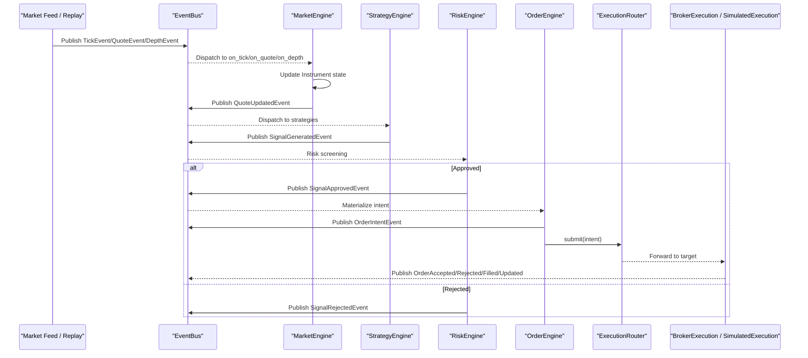
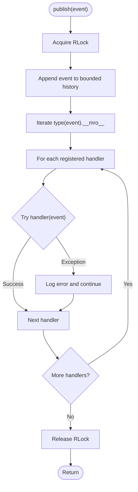
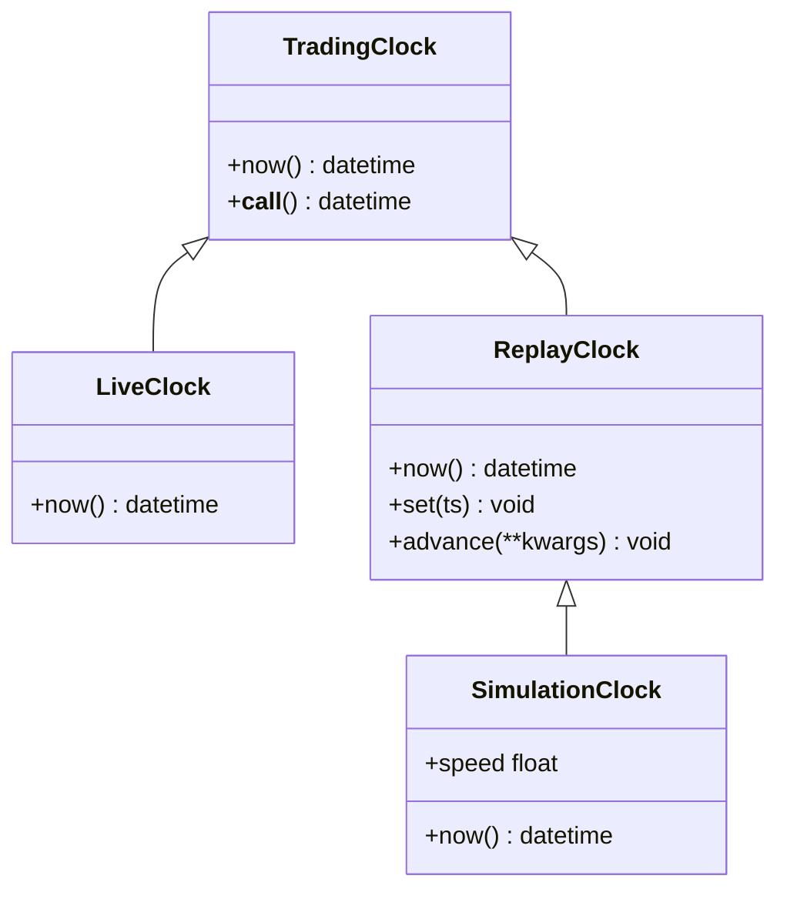
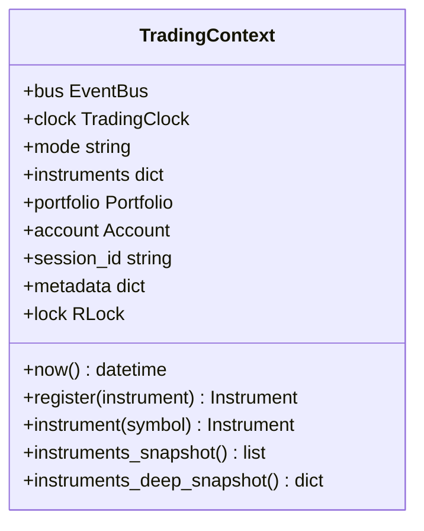
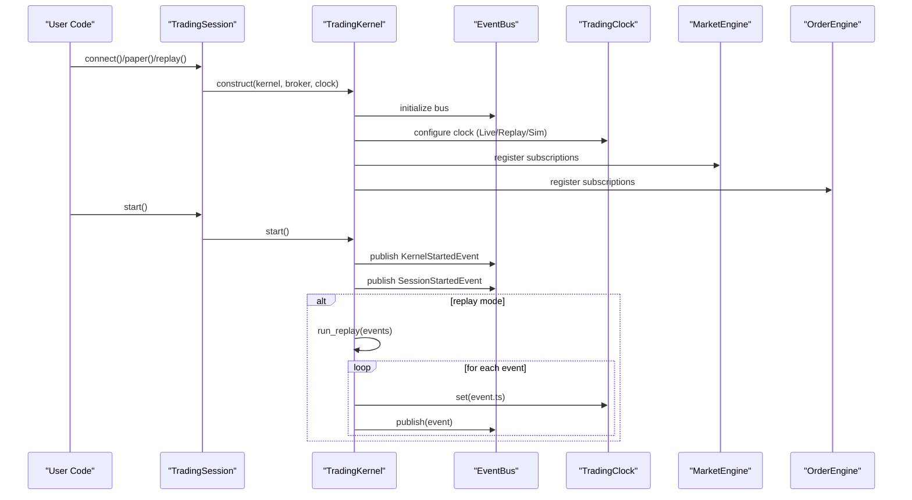
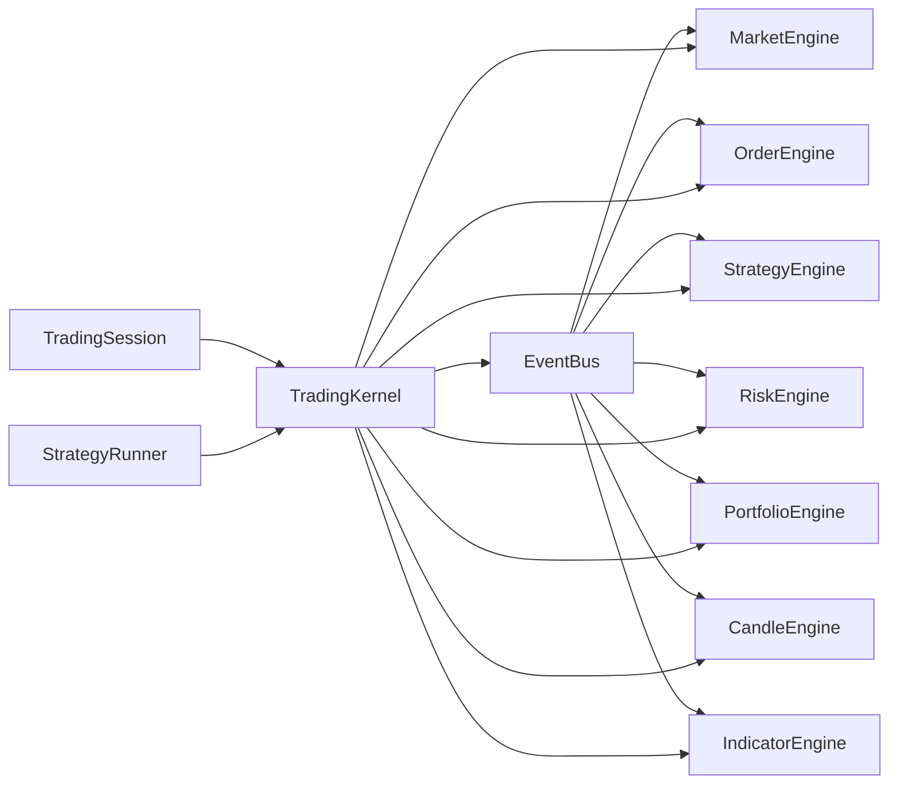

# Event-Driven Trading Kernel

<cite>
**Referenced Files in This Document**
- [event_bus.py](file://ntrade/kernel/event_bus.py)
- [clock.py](file://ntrade/kernel/clock.py)
- [context.py](file://ntrade/kernel/context.py)
- [base.py](file://ntrade/events/base.py)
- [lifecycle.py](file://ntrade/events/lifecycle.py)
- [market.py](file://ntrade/events/market.py)
- [order.py](file://ntrade/events/order.py)
- [portfolio.py](file://ntrade/events/portfolio.py)
- [risk.py](file://ntrade/events/risk.py)
- [session.py](file://ntrade/kernel/session.py)
- [trading_session.py](file://ntrade/kernel/trading_session.py)
- [runner.py](file://ntrade/kernel/runner.py)
- [market_engine.py](file://ntrade/engines/market_engine.py)
- [order_engine.py](file://ntrade/engines/order_engine.py)
- [test_event_bus_clock.py](file://tests/test_event_bus_clock.py)
- [test_context.py](file://tests/test_context.py)
</cite>

## Table of Contents
1. [Introduction](#introduction)
2. [Project Structure](#project-structure)
3. [Core Components](#core-components)
4. [Architecture Overview](#architecture-overview)
5. [Detailed Component Analysis](#detailed-component-analysis)
6. [Dependency Analysis](#dependency-analysis)
7. [Performance Considerations](#performance-considerations)
8. [Troubleshooting Guide](#troubleshooting-guide)
9. [Conclusion](#conclusion)

## Introduction
This document explains nTrade’s event-driven trading kernel architecture with a focus on the EventBus publish-subscribe system, the TradingClock abstraction for time control across live, replay, and backtest modes, and the TradingContext that maintains session state and configuration. It also documents the event type hierarchy (base Event through market, order, portfolio, lifecycle, and risk events), shows concrete publishing and subscription patterns, and outlines error handling strategies. Finally, it describes how the kernel coordinates subsystems while maintaining zero parity across execution modes and addresses performance considerations such as async processing, memory management, and ordering guarantees.

## Project Structure
The kernel is organized around a small set of core modules:
- Events: immutable dataclasses representing domain facts
- EventBus: synchronous, thread-safe pub/sub dispatcher
- TradingClock: abstract clock with live/replay/simulation implementations
- TradingContext: shared mutable state protected by a reentrant lock
- Engines: MarketEngine, OrderEngine, StrategyEngine, RiskEngine, PortfolioEngine, CandleEngine, IndicatorEngine
- Orchestration: TradingKernel wires engines and execution targets; TradingSession provides a unified API; StrategyRunner manages multiple strategies and per-strategy risk

```mermaid
graph TB
subgraph "Kernel Core"
bus["EventBus"]
clock["TradingClock<br/>LiveClock / ReplayClock / SimulationClock"]
ctx["TradingContext"]
end
subgraph "Events"
base["Event"]
mkt["Market Events"]
ord["Order Events"]
port["Portfolio Events"]
life["Lifecycle Events"]
risk["Risk Events"]
end
subgraph "Engines"
me["MarketEngine"]
oe["OrderEngine"]
se["StrategyEngine"]
re["RiskEngine"]
pe["PortfolioEngine"]
ce["CandleEngine"]
ie["IndicatorEngine"]
end
subgraph "Orchestration"
tk["TradingKernel"]
ts["TradingSession"]
sr["StrategyRunner"]
end
base --> mkt
base --> ord
base --> port
base --> life
base --> risk
bus < --> me
bus < --> oe
bus < --> se
bus < --> re
bus < --> pe
bus < --> ce
bus < --> ie
tk --> bus
tk --> clock
tk --> ctx
tk --> me
tk --> oe
tk --> se
tk --> re
tk --> pe
tk --> ce
tk --> ie
ts --> tk
sr --> tk
```

**Diagram sources**
- [event_bus.py](file://ntrade/kernel/event_bus.py)
- [clock.py](file://ntrade/kernel/clock.py)
- [context.py](file://ntrade/kernel/context.py)
- [base.py](file://ntrade/events/base.py)
- [market.py](file://ntrade/events/market.py)
- [order.py](file://ntrade/events/order.py)
- [portfolio.py](file://ntrade/events/portfolio.py)
- [lifecycle.py](file://ntrade/events/lifecycle.py)
- [risk.py](file://ntrade/events/risk.py)
- [session.py](file://ntrade/kernel/session.py)
- [trading_session.py](file://ntrade/kernel/trading_session.py)
- [runner.py](file://ntrade/kernel/runner.py)
- [market_engine.py](file://ntrade/engines/market_engine.py)
- [order_engine.py](file://ntrade/engines/order_engine.py)

**Section sources**
- [session.py](file://ntrade/kernel/session.py)
- [trading_session.py](file://ntrade/kernel/trading_session.py)
- [runner.py](file://ntrade/kernel/runner.py)

## Core Components
- EventBus: Synchronous, thread-safe publish-subscribe bus with MRO-based dispatch, bounded history, and exception isolation for handlers.
- TradingClock: Abstract clock interface with LiveClock (wall time), ReplayClock (deterministic time from events), and SimulationClock (speed scaling).
- TradingContext: Shared session state including bus, clock, instruments, portfolio, account, and a reentrant lock for safe concurrent access.
- Event Hierarchy: Base Event with timestamped, immutable dataclasses for market, order, portfolio, lifecycle, and risk domains.
- Orchestration: TradingKernel wires engines and execution targets; TradingSession provides a unified entry point; StrategyRunner manages multi-strategy lifecycle and scoped risk.

**Section sources**
- [event_bus.py](file://ntrade/kernel/event_bus.py)
- [clock.py](file://ntrade/kernel/clock.py)
- [context.py](file://ntrade/kernel/context.py)
- [base.py](file://ntrade/events/base.py)
- [lifecycle.py](file://ntrade/events/lifecycle.py)
- [market.py](file://ntrade/events/market.py)
- [order.py](file://ntrade/events/order.py)
- [portfolio.py](file://ntrade/events/portfolio.py)
- [risk.py](file://ntrade/events/risk.py)
- [session.py](file://ntrade/kernel/session.py)
- [trading_session.py](file://ntrade/kernel/trading_session.py)
- [runner.py](file://ntrade/kernel/runner.py)

## Architecture Overview
The kernel uses an event-driven pipeline where raw market data flows into normalized instrument state, then to strategy signals, risk checks, order materialization, and execution. The same pipeline runs identically in live, replay, and backtest modes because all timestamps come from the TradingClock and the bus serializes dispatch.



**Diagram sources**
- [market_engine.py](file://ntrade/engines/market_engine.py)
- [order_engine.py](file://ntrade/engines/order_engine.py)
- [session.py](file://ntrade/kernel/session.py)
- [event_bus.py](file://ntrade/kernel/event_bus.py)

## Detailed Component Analysis

### EventBus: Publish-Subscribe Dispatcher
- Responsibilities:
  - Subscribe/unsubscribe handlers for specific event types or base classes via MRO dispatch.
  - Publish events to matching handlers in most-derived-first order.
  - Maintain bounded history for replay and audit.
  - Isolate handler exceptions so one bad subscriber cannot crash the kernel.
- Concurrency:
  - Uses a reentrant lock to serialize dispatch and protect internal structures.
  - Designed for multiple producer threads (e.g., WebSocket callbacks and runner loops).
- Error Handling:
  - Exceptions in handlers are caught and logged; dispatch continues for remaining handlers.
- Ordering Guarantees:
  - Dispatch is serialized per publish call; MRO ensures deterministic handler invocation order.



**Diagram sources**
- [event_bus.py](file://ntrade/kernel/event_bus.py)

**Section sources**
- [event_bus.py](file://ntrade/kernel/event_bus.py)
- [test_event_bus_clock.py](file://tests/test_event_bus_clock.py)

### TradingClock: Time Abstraction for Zero Parity
- Responsibilities:
  - Provide a single source of time for all components.
  - Support wall-clock time (live), deterministic time (replay), and speed-scaled time (simulation/backtest).
- Implementations:
  - LiveClock: returns current wall time.
  - ReplayClock: deterministic time driven by event timestamps; supports set() and advance().
  - SimulationClock: extends ReplayClock with a speed factor for accelerated backtests.
- Zero Parity:
  - All events carry timestamps from the clock, ensuring identical decisions across modes given the same event stream.



**Diagram sources**
- [clock.py](file://ntrade/kernel/clock.py)

**Section sources**
- [clock.py](file://ntrade/kernel/clock.py)
- [test_event_bus_clock.py](file://tests/test_event_bus_clock.py)

### TradingContext: Session State and Configuration
- Responsibilities:
  - Hold the EventBus, TradingClock, mode, instruments map, Portfolio, Account, session_id, and metadata.
  - Provide thread-safe registration and snapshotting of instruments.
  - Expose now() via the clock for consistent time usage.
- Concurrency:
  - A reentrant lock protects instrument registration and iteration to avoid torn snapshots under concurrent updates.
- Usage Patterns:
  - Engines subscribe to the bus and read/write context state under the lock when necessary.



**Diagram sources**
- [context.py](file://ntrade/kernel/context.py)

**Section sources**
- [context.py](file://ntrade/kernel/context.py)
- [test_context.py](file://tests/test_context.py)

### Event Types Hierarchy
- Base Event:
  - Immutable dataclass with timestamp and unique event_id.
- Market Events:
  - TickEvent, QuoteEvent, DepthEvent, CandleClosedEvent, QuoteUpdatedEvent, IndicatorUpdatedEvent.
- Order Events:
  - OrderIntentEvent, OrderAcceptedEvent, OrderRejectedEvent, OrderFilledEvent, OrderUpdatedEvent, OrderTimeoutEvent.
- Portfolio Events:
  - PositionUpdatedEvent, BalanceChangedEvent.
- Lifecycle Events:
  - KernelStartedEvent, SessionStartedEvent, SessionStoppedEvent, RunnerStartedEvent, RunnerStoppedEvent, HeartbeatEvent, FeedDisconnectedEvent.
- Risk Events:
  - SignalGeneratedEvent, SignalApprovedEvent, SignalRejectedEvent, RiskHaltedEvent, RiskResumedEvent.

```mermaid
classDiagram
class Event {
+ts datetime
+event_id string
}
class TickEvent {
+symbol string
+exchange string
+price float
+quantity int
+side string
+kind string
}
class QuoteEvent {
+symbol string
+exchange string
+ltp float
+bid float
+ask float
+open float
+high float
+low float
+prev_close float
+volume int
+oi int
}
class DepthEvent {
+symbol string
+exchange string
+bids tuple
+asks tuple
}
class CandleClosedEvent {
+symbol string
+exchange string
+timeframe string
+open float
+high float
+low float
+close float
+volume int
}
class QuoteUpdatedEvent {
+symbol string
+exchange string
+ltp float
+bid float
+ask float
}
class IndicatorUpdatedEvent {
+symbol string
+exchange string
+timeframe string
+indicators dict
}
class OrderIntentEvent {
+symbol string
+exchange string
+side string
+quantity int
+order_type string
+price float
+strategy string
}
class OrderAcceptedEvent {
+order_id string
+symbol string
+exchange string
+side string
+quantity int
+strategy string
}
class OrderRejectedEvent {
+order_id string
+symbol string
+exchange string
+side string
+quantity int
+reason string
+strategy string
}
class OrderFilledEvent {
+order_id string
+symbol string
+exchange string
+side string
+quantity int
+fill_price float
+commission float
+statutory float
+strategy string
}
class OrderUpdatedEvent {
+order_id string
+symbol string
+exchange string
+side string
+status string
+filled_qty int
+avg_price float
+strategy string
}
class OrderTimeoutEvent {
+order_id string
+symbol string
+exchange string
+side string
+quantity int
+age_seconds float
+strategy string
}
class PositionUpdatedEvent {
+symbol string
+exchange string
+quantity int
+avg_price float
+ltp float
}
class BalanceChangedEvent {
+balance float
}
class KernelStartedEvent {
+mode string
}
class SessionStartedEvent {
+session_id string
}
class SessionStoppedEvent {
+session_id string
+reason string
}
class RunnerStartedEvent
class RunnerStoppedEvent {
+reason string
}
class HeartbeatEvent {
+tick_count int
+open_orders int
}
class FeedDisconnectedEvent {
+reason string
}
class SignalGeneratedEvent {
+symbol string
+exchange string
+side string
+quantity int
+price float
+strategy string
+metadata dict
}
class SignalApprovedEvent {
+signal SignalGeneratedEvent
}
class SignalRejectedEvent {
+signal SignalGeneratedEvent
+reason string
}
class RiskHaltedEvent {
+reason string
+equity float
}
class RiskResumedEvent {
+reason string
}
Event <|-- TickEvent
Event <|-- QuoteEvent
Event <|-- DepthEvent
Event <|-- CandleClosedEvent
Event <|-- QuoteUpdatedEvent
Event <|-- IndicatorUpdatedEvent
Event <|-- OrderIntentEvent
Event <|-- OrderAcceptedEvent
Event <|-- OrderRejectedEvent
Event <|-- OrderFilledEvent
Event <|-- OrderUpdatedEvent
Event <|-- OrderTimeoutEvent
Event <|-- PositionUpdatedEvent
Event <|-- BalanceChangedEvent
Event <|-- KernelStartedEvent
Event <|-- SessionStartedEvent
Event <|-- SessionStoppedEvent
Event <|-- RunnerStartedEvent
Event <|-- RunnerStoppedEvent
Event <|-- HeartbeatEvent
Event <|-- FeedDisconnectedEvent
Event <|-- SignalGeneratedEvent
Event <|-- SignalApprovedEvent
Event <|-- SignalRejectedEvent
Event <|-- RiskHaltedEvent
Event <|-- RiskResumedEvent
```



**Diagram sources**
- [base.py](file://ntrade/events/base.py)
- [market.py](file://ntrade/events/market.py)
- [order.py](file://ntrade/events/order.py)
- [portfolio.py](file://ntrade/events/portfolio.py)
- [lifecycle.py](file://ntrade/events/lifecycle.py)
- [risk.py](file://ntrade/events/risk.py)

**Section sources**
- [base.py](file://ntrade/events/base.py)
- [market.py](file://ntrade/events/market.py)
- [order.py](file://ntrade/events/order.py)
- [portfolio.py](file://ntrade/events/portfolio.py)
- [lifecycle.py](file://ntrade/events/lifecycle.py)
- [risk.py](file://ntrade/events/risk.py)

### Orchestration: TradingKernel, TradingSession, StrategyRunner
- TradingKernel:
  - Wires engine stack (MarketEngine, CandleEngine, IndicatorEngine, StrategyEngine, RiskEngine, PortfolioEngine).
  - Configures execution target (BrokerExecution or SimulatedExecution) via ExecutionRouter.
  - Provides start/stop, broker execution helpers, and run_replay for deterministic execution.
- TradingSession:
  - Unified entry point combining broker connection, instrument creation, kernel, and strategy runner.
  - Supports connect(), paper(), replay() constructors for different modes.
- StrategyRunner:
  - Manages multiple strategies with per-strategy RiskEngine scoping.
  - Hot attach/detach strategies and toggle enabled state.
  - Pauses global risk engine during takeover and restores on release.



**Diagram sources**
- [trading_session.py](file://ntrade/kernel/trading_session.py)
- [session.py](file://ntrade/kernel/session.py)
- [event_bus.py](file://ntrade/kernel/event_bus.py)
- [clock.py](file://ntrade/kernel/clock.py)
- [market_engine.py](file://ntrade/engines/market_engine.py)
- [order_engine.py](file://ntrade/engines/order_engine.py)

**Section sources**
- [session.py](file://ntrade/kernel/session.py)
- [trading_session.py](file://ntrade/kernel/trading_session.py)
- [runner.py](file://ntrade/kernel/runner.py)

### Concrete Publishing and Subscription Patterns
- Example: Subscribing to base Event to record all events for replay/audit.
- Example: Subscribing to specific market events (TickEvent, QuoteEvent, DepthEvent) to update instrument state.
- Example: Subscribing to risk events (SignalGeneratedEvent) to enforce per-strategy limits.
- Example: Subscribing to lifecycle events (HeartbeatEvent) for health monitoring.

Patterns are validated by tests demonstrating exact and base-type subscriptions, unsubscribe behavior, and exception isolation.

**Section sources**
- [event_bus.py](file://ntrade/kernel/event_bus.py)
- [test_event_bus_clock.py](file://tests/test_event_bus_clock.py)

### Error Handling Strategies
- Handler Exceptions:
  - Caught and logged; dispatch continues for remaining handlers.
- Risk Circuit Breakers:
  - RiskHaltedEvent/RiskResumedEvent signal stop/resume of trading.
- Feed Disconnections:
  - FeedDisconnectedEvent indicates loss of market feed connectivity.
- Order Rejections:
  - OrderRejectedEvent communicates failures from execution targets.

**Section sources**
- [event_bus.py](file://ntrade/kernel/event_bus.py)
- [lifecycle.py](file://ntrade/events/lifecycle.py)
- [order.py](file://ntrade/events/order.py)
- [risk.py](file://ntrade/events/risk.py)

## Dependency Analysis
The kernel exhibits low coupling between components via the EventBus. Engines depend only on event types and the context, not on each other directly. Execution targets are interchangeable through the router.



**Diagram sources**
- [session.py](file://ntrade/kernel/session.py)
- [trading_session.py](file://ntrade/kernel/trading_session.py)
- [runner.py](file://ntrade/kernel/runner.py)
- [event_bus.py](file://ntrade/kernel/event_bus.py)
- [market_engine.py](file://ntrade/engines/market_engine.py)
- [order_engine.py](file://ntrade/engines/order_engine.py)

**Section sources**
- [session.py](file://ntrade/kernel/session.py)
- [trading_session.py](file://ntrade/kernel/trading_session.py)
- [runner.py](file://ntrade/kernel/runner.py)

## Performance Considerations
- Async Event Processing:
  - EventBus is synchronous and serialized per publish call; this avoids race conditions but can become a bottleneck under high throughput. Consider batching or offloading heavy handlers to background workers if needed.
- Memory Management:
  - EventBus maintains a bounded deque history; tune max_history to balance replay needs vs memory footprint.
  - Events are frozen dataclasses, minimizing mutation overhead and enabling hashing for deduplication or caching.
- Event Ordering Guarantees:
  - MRO-based dispatch ensures deterministic handler invocation order within a single publish.
  - For cross-thread consistency, use TradingContext.lock around critical sections that mutate shared state.
- Zero Parity Across Modes:
  - Deterministic clocks (ReplayClock/SimulationClock) ensure identical decisions given the same event stream.
  - Broker adapters should respect the injected clock to maintain timestamp consistency.

[No sources needed since this section provides general guidance]

## Troubleshooting Guide
- Symptoms: Handlers not receiving events
  - Verify subscription to correct event type or base class; check MRO dispatch behavior.
  - Ensure handlers are not unsubscribed accidentally.
- Symptoms: Kernel stalls or deadlocks
  - Check for long-running handlers blocking the bus; consider moving work off the critical path.
  - Validate proper acquisition/release of TradingContext.lock in custom code.
- Symptoms: Inconsistent snapshots
  - Use instruments_deep_snapshot for internally consistent reads under the context lock.
- Symptoms: Missing fills or rejections
  - Inspect OrderRejectedEvent and OrderUpdatedEvent payloads for reasons and status changes.
- Symptoms: Risk circuit breaker tripping
  - Review RiskHaltedEvent reason and equity levels; adjust risk limits accordingly.

**Section sources**
- [event_bus.py](file://ntrade/kernel/event_bus.py)
- [context.py](file://ntrade/kernel/context.py)
- [order.py](file://ntrade/events/order.py)
- [risk.py](file://ntrade/events/risk.py)

## Conclusion
nTrade’s event-driven kernel achieves robust, decoupled communication through a disciplined EventBus, deterministic time via TradingClock, and thread-safe state management with TradingContext. The event hierarchy cleanly separates concerns across market, order, portfolio, lifecycle, and risk domains. The orchestration layer ensures zero parity across live, replay, and backtest modes by standardizing timestamps and event flows. With careful attention to performance—bounded history, serialization, and locking—the kernel remains reliable and scalable for production trading systems.