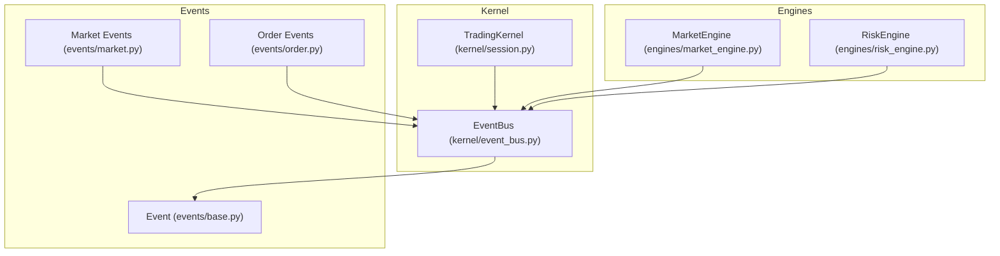
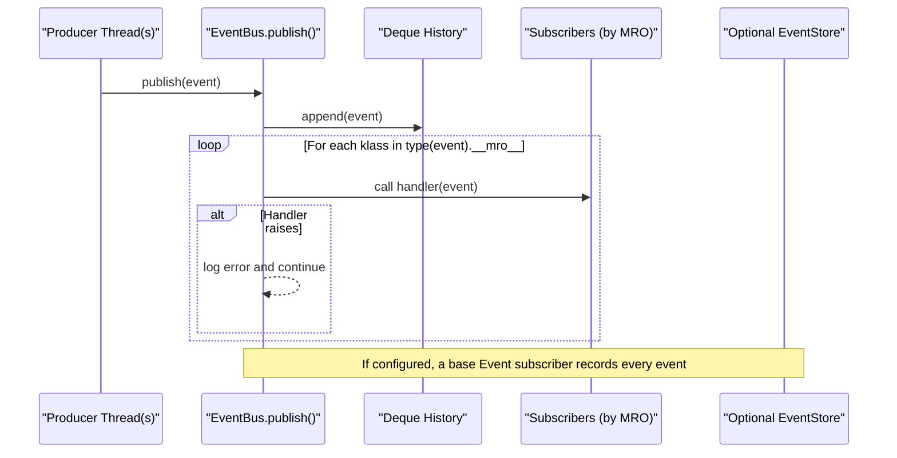
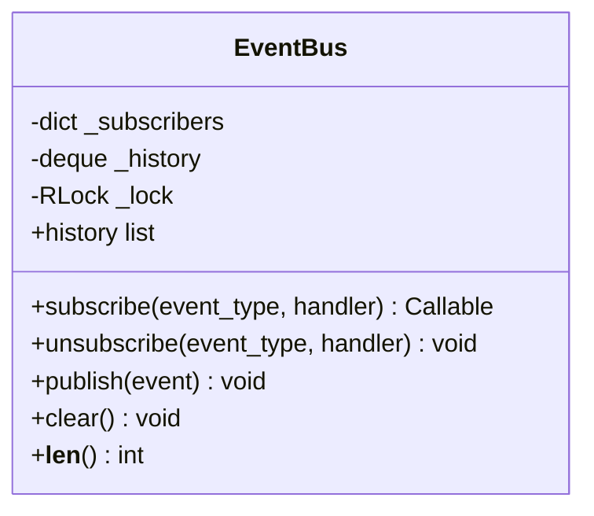
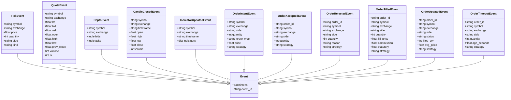
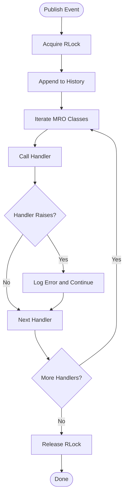
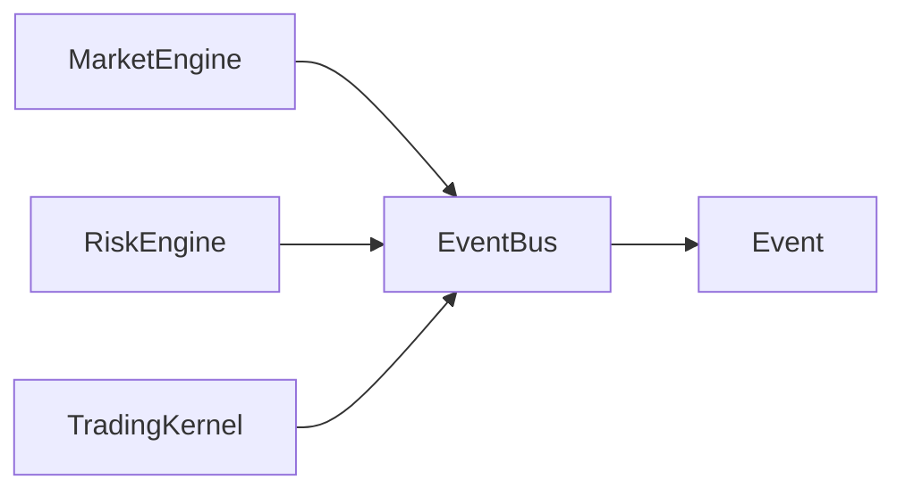

# EventBus Implementation

<cite>
**Referenced Files in This Document**
- [event_bus.py](file://ntrade/kernel/event_bus.py)
- [base.py](file://ntrade/events/base.py)
- [market.py](file://ntrade/events/market.py)
- [order.py](file://ntrade/events/order.py)
- [session.py](file://ntrade/kernel/session.py)
- [market_engine.py](file://ntrade/engines/market_engine.py)
- [risk_engine.py](file://ntrade/engines/risk_engine.py)
- [test_event_bus_clock.py](file://tests/test_event_bus_clock.py)
- [test_event_bus_threads.py](file://tests/test_event_bus_threads.py)
</cite>

## Table of Contents
1. [Introduction](#introduction)
2. [Project Structure](#project-structure)
3. [Core Components](#core-components)
4. [Architecture Overview](#architecture-overview)
5. [Detailed Component Analysis](#detailed-component-analysis)
6. [Dependency Analysis](#dependency-analysis)
7. [Performance Considerations](#performance-considerations)
8. [Troubleshooting Guide](#troubleshooting-guide)
9. [Conclusion](#conclusion)

## Introduction
This document explains the EventBus implementation that powers nTrade’s event-driven kernel. It focuses on:
- The publish-subscribe pattern with MRO-based dispatch so handlers registered on a base class receive subclass events.
- Thread-safe design using a reentrant lock to serialize publishes and protect shared state across multiple producer threads.
- Event history with configurable max_history for replay and auditing.
- Practical usage patterns for subscribing, publishing, and handling exceptions gracefully.
- Performance considerations including memory management via deque-based history and handler isolation to prevent a single bad handler from taking down the kernel.

## Project Structure
The EventBus lives under the kernel module and is used throughout the trading stack. Events are defined in the events package and consumed by engines and orchestration components.

**Diagram sources**
- [event_bus.py:1-80](file://ntrade/kernel/event_bus.py#L1-L80)
- [base.py:1-22](file://ntrade/events/base.py#L1-L22)
- [market.py:1-83](file://ntrade/events/market.py#L1-L83)
- [order.py:1-91](file://ntrade/events/order.py#L1-L91)
- [session.py:1-200](file://ntrade/kernel/session.py#L1-L200)
- [market_engine.py:1-64](file://ntrade/engines/market_engine.py#L1-L64)
- [risk_engine.py:1-141](file://ntrade/engines/risk_engine.py#L1-L141)

**Section sources**
- [event_bus.py:1-80](file://ntrade/kernel/event_bus.py#L1-L80)
- [session.py:1-200](file://ntrade/kernel/session.py#L1-L200)

## Core Components
- EventBus: Central pub/sub hub with thread-safe operations, MRO-based dispatch, bounded history, and exception isolation.
- Event model: Immutable, hashable dataclasses carrying a deterministic timestamp from the TradingClock.
- Engines and Kernel: Subscribe to specific event types; publish derived events; optionally record all events via a store.

Key responsibilities:
- EventBus manages subscriber registration, event dispatch, history, and concurrency control.
- Event subclasses encapsulate domain-specific payloads while sharing common fields like timestamp and unique id.
- Engines subscribe to input events and publish normalized or derived events back to the bus.

**Section sources**
- [event_bus.py:24-80](file://ntrade/kernel/event_bus.py#L24-L80)
- [base.py:16-22](file://ntrade/events/base.py#L16-L22)
- [market_engine.py:15-64](file://ntrade/engines/market_engine.py#L15-L64)
- [session.py:38-120](file://ntrade/kernel/session.py#L38-L120)

## Architecture Overview
The EventBus sits at the center of the kernel. Producers (feeds, engines, lifecycle) publish events; consumers (engines, risk, portfolio, recording) subscribe to event types. Dispatch follows Python’s Method Resolution Order (MRO), enabling base-class subscriptions to catch subclass events.

**Diagram sources**
- [event_bus.py:47-66](file://ntrade/kernel/event_bus.py#L47-L66)
- [session.py:71-78](file://ntrade/kernel/session.py#L71-L78)

## Detailed Component Analysis

### EventBus Class
Responsibilities:
- Subscriber registry keyed by event class.
- Bounded event history using a deque with configurable maxlen.
- Reentrant lock to serialize all mutable operations and ensure consistent reads.
- MRO-based dispatch ensuring base-class subscribers receive subclass events.
- Exception isolation: handler errors are logged and do not interrupt other handlers.

Concurrency model:
- All public methods that mutate state or read history acquire an RLock.
- publish holds the lock across the entire dispatch, preventing interleaving between producers and during handler execution.
- Reentrancy allows a handler to safely publish additional events without deadlock.

Dispatch algorithm:
- Append event to history.
- Iterate through type(event).__mro__.
- For each class, iterate over its handler list and invoke handlers.
- Catch and log exceptions per handler; continue dispatching remaining handlers.

History and replay:
- History is bounded by max_history; oldest events are dropped when full.
- Exposed via a property returning a snapshot list under the lock.
- Used for diagnostics, replay, and audit trails.

**Diagram sources**
- [event_bus.py:24-80](file://ntrade/kernel/event_bus.py#L24-L80)

**Section sources**
- [event_bus.py:24-80](file://ntrade/kernel/event_bus.py#L24-L80)

### Event Model
Design principles:
- Frozen dataclasses ensure immutability and determinism.
- Each event carries a timestamp from the TradingClock and a unique identifier.
- Subclasses extend the base Event with domain-specific fields.

Examples of event types:
- Market events: ticks, quotes, depth, candle close, indicator updates.
- Order lifecycle events: intent, accepted, rejected, filled, updated, timeout.

**Diagram sources**
- [base.py:16-22](file://ntrade/events/base.py#L16-L22)
- [market.py:11-83](file://ntrade/events/market.py#L11-L83)
- [order.py:11-91](file://ntrade/events/order.py#L11-L91)

**Section sources**
- [base.py:16-22](file://ntrade/events/base.py#L16-L22)
- [market.py:11-83](file://ntrade/events/market.py#L11-L83)
- [order.py:11-91](file://ntrade/events/order.py#L11-L91)

### Usage Patterns and Integration

#### Subscribing to Event Types
- Engines subscribe to specific event classes (e.g., TickEvent, QuoteEvent, DepthEvent).
- Base-class subscriptions (e.g., Event) capture all events for recording or global monitoring.

Example references:
- MarketEngine subscribes to market events and publishes normalized QuoteUpdatedEvent.
- RiskEngine subscribes to signal events and publishes approval/rejection outcomes.
- TradingKernel can subscribe to base Event to record all events into a store.

**Section sources**
- [market_engine.py:15-21](file://ntrade/engines/market_engine.py#L15-L21)
- [risk_engine.py](file://ntrade/engines/risk_engine.py#L41)
- [session.py:71-78](file://ntrade/kernel/session.py#L71-L78)

#### Publishing Events
- Any component can publish events via the bus.
- In live mode, multiple threads may publish concurrently; the bus serializes dispatch.

References:
- MarketEngine publishes QuoteUpdatedEvent after projecting raw events.
- RiskEngine publishes SignalApprovedEvent or SignalRejectedEvent based on checks.
- TradingKernel exposes a convenience publish method delegating to the bus.

**Section sources**
- [market_engine.py:34-37](file://ntrade/engines/market_engine.py#L34-L37)
- [risk_engine.py:79-82](file://ntrade/engines/risk_engine.py#L79-L82)
- [session.py:114-116](file://ntrade/kernel/session.py#L114-L116)

#### Handling Exceptions Gracefully
- Handler exceptions are caught, logged, and do not stop further dispatch.
- Tests verify that one failing handler does not prevent other handlers from running.

**Section sources**
- [event_bus.py:58-66](file://ntrade/kernel/event_bus.py#L58-L66)
- [test_event_bus_clock.py:52-66](file://tests/test_event_bus_clock.py#L52-L66)

#### Replay and History
- History is bounded by max_history; oldest entries are evicted automatically.
- The kernel can record all events to a persistent store for replay and recovery.

**Section sources**
- [event_bus.py:25-28](file://ntrade/kernel/event_bus.py#L25-L28)
- [test_event_bus_clock.py:100-107](file://tests/test_event_bus_clock.py#L100-L107)
- [session.py:71-78](file://ntrade/kernel/session.py#L71-L78)

### Conceptual Overview
The EventBus enforces a clean separation of concerns:
- Producers focus on emitting well-defined events.
- Consumers react to relevant event types without direct coupling.
- Base-class subscriptions enable cross-cutting concerns (recording, metrics, alerts).
- Thread safety ensures correctness under concurrent production.

[No sources needed since this diagram shows conceptual workflow, not actual code structure]

## Dependency Analysis
EventBus depends on:
- Event base class for typing and shared attributes.
- Threading primitives for concurrency control.
- Collections for efficient history storage.

Components depend on EventBus:
- Engines subscribe to input events and publish derived events.
- Kernel wires engines and optional recording.

**Diagram sources**
- [event_bus.py:18-21](file://ntrade/kernel/event_bus.py#L18-L21)
- [market_engine.py:15-21](file://ntrade/engines/market_engine.py#L15-L21)
- [risk_engine.py](file://ntrade/engines/risk_engine.py#L41)
- [session.py:59-78](file://ntrade/kernel/session.py#L59-L78)

**Section sources**
- [event_bus.py:18-21](file://ntrade/kernel/event_bus.py#L18-L21)
- [market_engine.py:15-21](file://ntrade/engines/market_engine.py#L15-L21)
- [risk_engine.py](file://ntrade/engines/risk_engine.py#L41)
- [session.py:59-78](file://ntrade/kernel/session.py#L59-L78)

## Performance Considerations
- Memory management: History uses a deque with a fixed maxlen to bound memory usage and avoid unbounded growth.
- Throughput: publish serializes dispatch to maintain consistency; this avoids race conditions but introduces contention under heavy concurrency.
- Handler isolation: Exceptions are caught per handler to prevent cascading failures; logging provides visibility into issues.
- Reentrant locking: Allows safe nested publishing within handlers without deadlocks.
- MRO dispatch cost: Iterating the MRO and invoking handlers adds overhead proportional to inheritance depth and number of subscribers.

Recommendations:
- Keep handler logic lightweight and non-blocking.
- Prefer specific event subscriptions over broad base subscriptions where possible to reduce fan-out.
- Tune max_history based on workload and replay requirements.
- Monitor logs for handler exceptions and optimize or isolate problematic handlers.

[No sources needed since this section provides general guidance]

## Troubleshooting Guide
Common issues and resolutions:
- Missing handler calls: Ensure correct event type subscription; base-class subscriptions will catch subclasses.
- Unexpected event ordering: Publishes are serialized; history reflects insertion order.
- Memory pressure: Reduce max_history if necessary; monitor deque size.
- Handler failures: Check logs for “raised on” messages; fix or isolate faulty handlers.
- Concurrency anomalies: Verify that handlers do not perform long-running blocking work; consider offloading to background tasks.

Relevant tests:
- Concurrency serialization and no-event-loss guarantees.
- History bounds enforcement and clear behavior.
- Exception isolation and logging verification.

**Section sources**
- [test_event_bus_threads.py:18-62](file://tests/test_event_bus_threads.py#L18-L62)
- [test_event_bus_clock.py:52-74](file://tests/test_event_bus_clock.py#L52-L74)
- [event_bus.py:58-66](file://ntrade/kernel/event_bus.py#L58-L66)

## Conclusion
The EventBus provides a robust, thread-safe foundation for nTrade’s event-driven architecture. Its MRO-based dispatch enables flexible subscriptions, while reentrant locking ensures deterministic processing under concurrency. Bounded history supports replay and auditing, and exception isolation protects the kernel from misbehaving handlers. By following best practices—lightweight handlers, targeted subscriptions, and appropriate history sizing—the system remains performant and resilient in live trading environments.