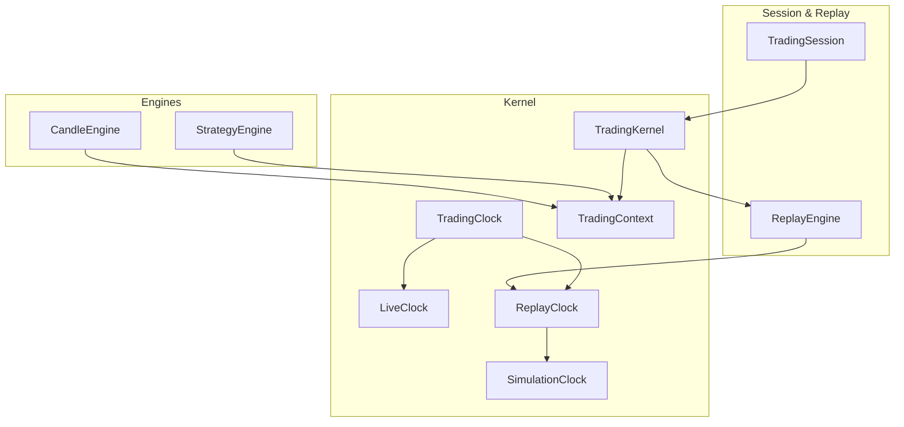
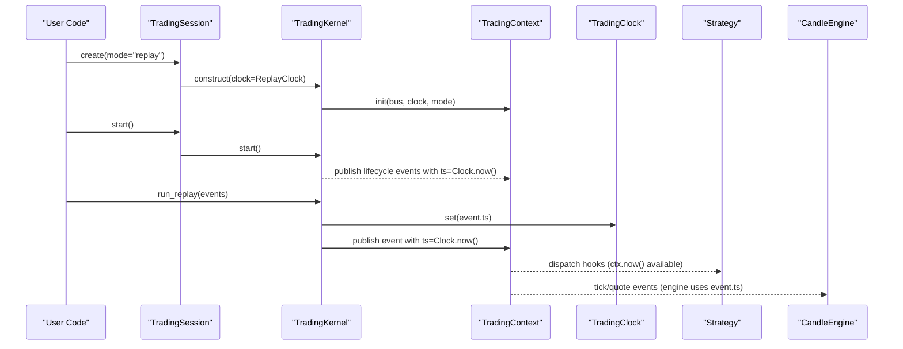
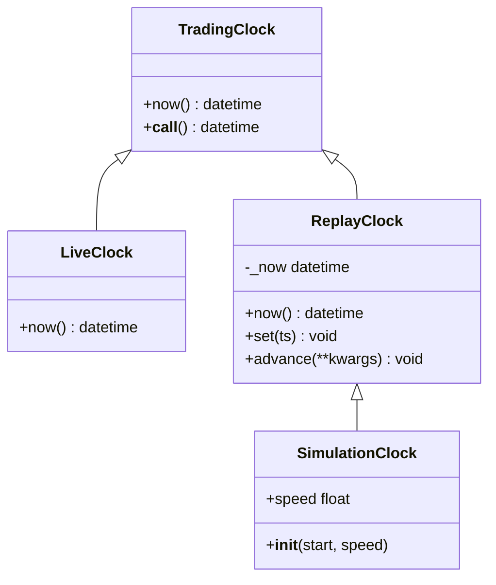
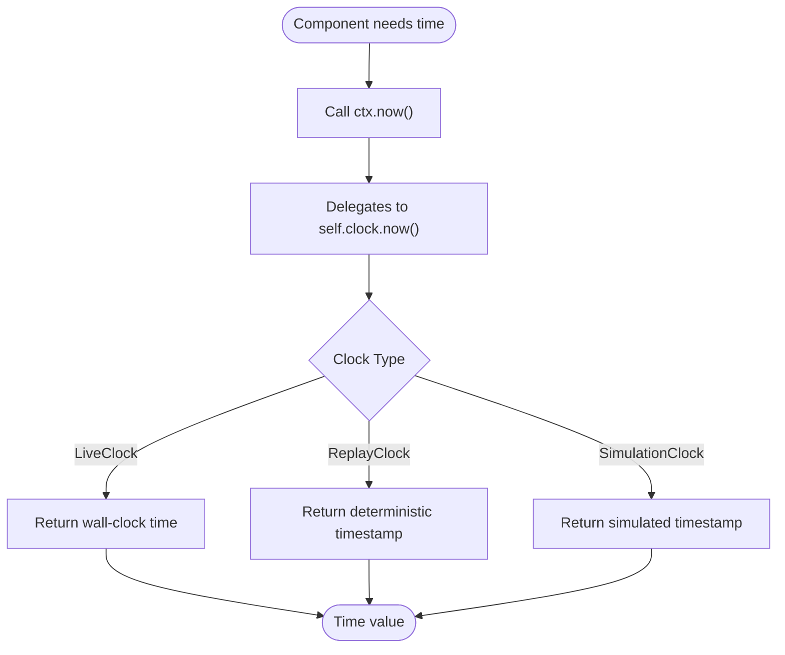
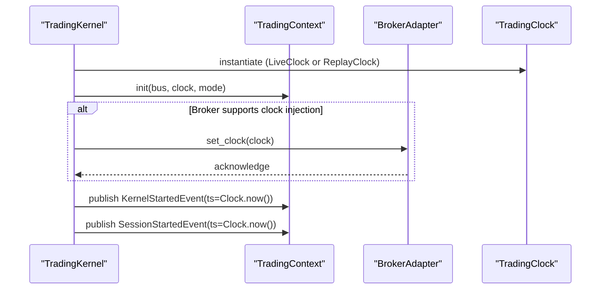
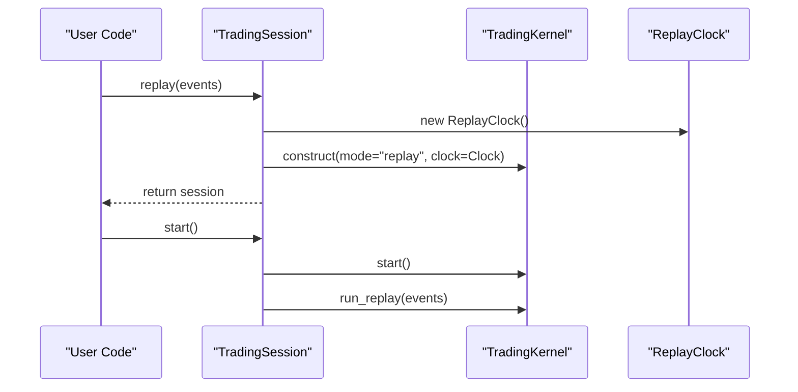
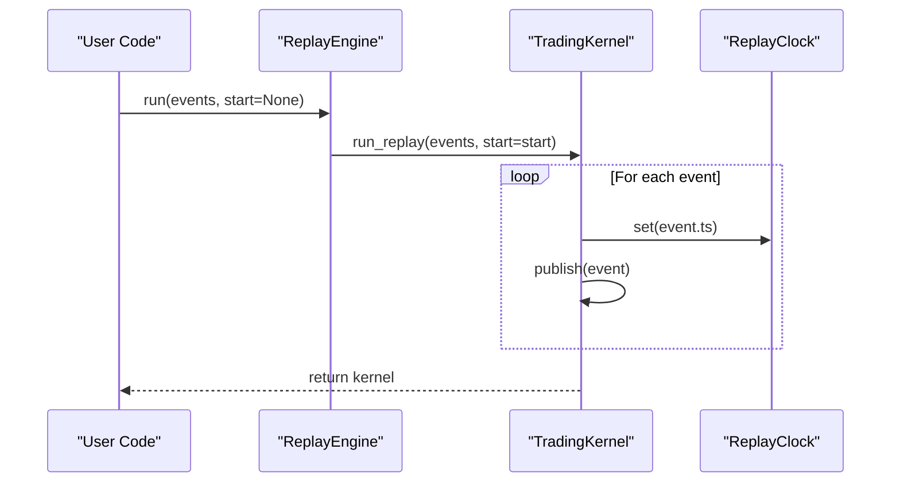
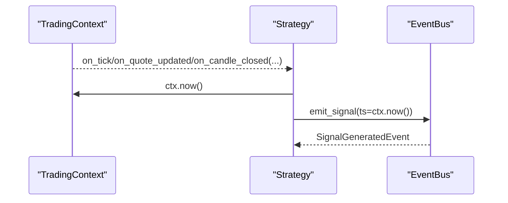
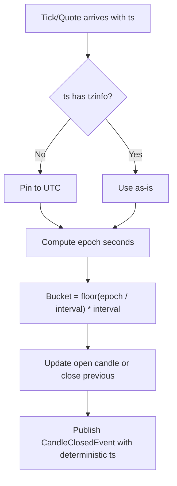
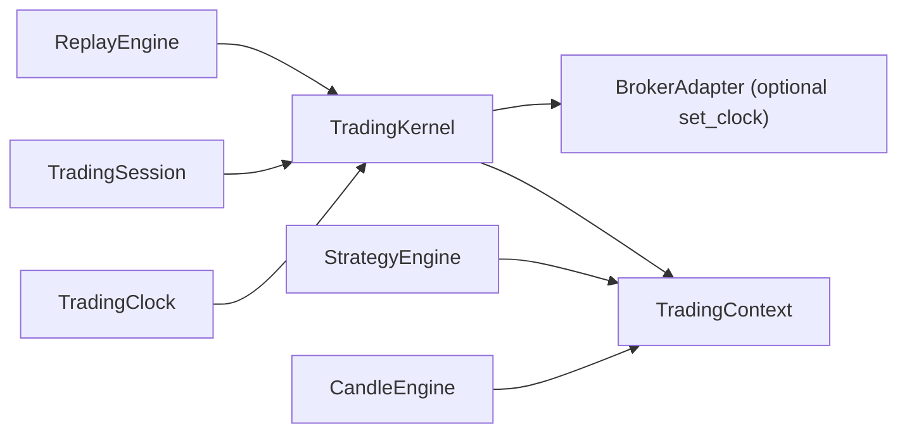

# Trading Clock Abstraction

<cite>
**Referenced Files in This Document**
- [clock.py](file://ntrade/kernel/clock.py)
- [session.py](file://ntrade/kernel/session.py)
- [context.py](file://ntrade/kernel/context.py)
- [trading_session.py](file://ntrade/kernel/trading_session.py)
- [replay_engine.py](file://ntrade/replay/replay_engine.py)
- [strategy_engine.py](file://ntrade/engines/strategy_engine.py)
- [candle_engine.py](file://ntrade/engines/candle_engine.py)
- [test_event_bus_clock.py](file://tests/test_event_bus_clock.py)
</cite>

## Table of Contents
1. Introduction
2. Project Structure
3. Core Components
4. Architecture Overview
5. Detailed Component Analysis
6. Dependency Analysis
7. Performance Considerations
8. Troubleshooting Guide
9. Conclusion

## Introduction
This document explains the trading clock abstraction that provides time-based operations across live, replay, and backtest execution modes. It covers how the clock abstracts time progression, integrates with market hours detection and timezone handling, and exposes a consistent interface for getting current time, checking if the market is open, and scheduling time-based operations. It also shows how strategies and engines use the clock to maintain deterministic behavior and accurate timing across environments.

## Project Structure
The clock abstraction lives in the kernel layer and is consumed by the session, context, engines, and replay subsystems:
- Kernel clock implementations define the contract and mode-specific behaviors.
- The trading session wires the appropriate clock per mode (live vs replay).
- The trading context exposes a unified now() accessor used by engines and strategies.
- Replay engine drives deterministic time via a replay clock.
- Engines rely on event timestamps and context.now() for time-sensitive logic.

**Diagram sources**
- [clock.py:14-55](file://ntrade/kernel/clock.py#L14-L55)
- [session.py:38-103](file://ntrade/kernel/session.py#L38-L103)
- [context.py:17-49](file://ntrade/kernel/context.py#L17-L49)
- [trading_session.py:118-142](file://ntrade/kernel/trading_session.py#L118-L142)
- [replay_engine.py:14-24](file://ntrade/replay/replay_engine.py#L14-L24)
- [strategy_engine.py:18-45](file://ntrade/engines/strategy_engine.py#L18-L45)
- [candle_engine.py:19-33](file://ntrade/engines/candle_engine.py#L19-L33)

**Section sources**
- [clock.py:14-55](file://ntrade/kernel/clock.py#L14-L55)
- [session.py:38-103](file://ntrade/kernel/session.py#L38-L103)
- [context.py:17-49](file://ntrade/kernel/context.py#L17-L49)
- [trading_session.py:118-142](file://ntrade/kernel/trading_session.py#L118-L142)
- [replay_engine.py:14-24](file://ntrade/replay/replay_engine.py#L14-L24)
- [strategy_engine.py:18-45](file://ntrade/engines/strategy_engine.py#L18-L45)
- [candle_engine.py:19-33](file://ntrade/engines/candle_engine.py#L19-L33)

## Core Components
- TradingClock: Base contract defining now() and callable semantics.
- LiveClock: Returns wall-clock time for live trading.
- ReplayClock: Deterministic clock driven by events; supports set() and advance().
- SimulationClock: Extends ReplayClock with a speed factor for backtests.
- TradingContext: Holds the active clock and exposes ctx.now() to engines and strategies.
- TradingKernel: Wires the clock into the context and injects it into brokers when available.
- TradingSession: Creates sessions with appropriate clocks per mode (live vs replay).
- ReplayEngine: Drives deterministic replay using ReplayClock.

Key responsibilities:
- Abstract time source so strategies and engines never call system time directly.
- Ensure zero-parity across live, replay, and backtest by driving time from events or controlled simulation parameters.
- Provide a single point to extend time-related capabilities (e.g., market hours checks, scheduling).

**Section sources**
- [clock.py:14-55](file://ntrade/kernel/clock.py#L14-L55)
- [context.py:17-49](file://ntrade/kernel/context.py#L17-L49)
- [session.py:38-103](file://ntrade/kernel/session.py#L38-L103)
- [trading_session.py:118-142](file://ntrade/kernel/trading_session.py#L118-L142)
- [replay_engine.py:14-24](file://ntrade/replay/replay_engine.py#L14-L24)

## Architecture Overview
The clock abstraction sits at the core of the kernel and is injected into the trading context. All engines and strategies access time through ctx.now(), ensuring consistent behavior across modes. In replay/backtest, the clock is advanced deterministically by the replay loop or simulation speed.

**Diagram sources**
- [trading_session.py:118-142](file://ntrade/kernel/trading_session.py#L118-L142)
- [session.py:122-147](file://ntrade/kernel/session.py#L122-L147)
- [context.py:48-49](file://ntrade/kernel/context.py#L48-L49)
- [clock.py:31-46](file://ntrade/kernel/clock.py#L31-L46)
- [strategy_engine.py:18-45](file://ntrade/engines/strategy_engine.py#L18-L45)
- [candle_engine.py:42-55](file://ntrade/engines/candle_engine.py#L42-L55)

## Detailed Component Analysis

### TradingClock Contract and Implementations
- TradingClock defines now() and __call__ for uniform time retrieval.
- LiveClock returns datetime.now() for real-time operation.
- ReplayClock maintains an internal timestamp and supports set() and advance() for deterministic control.
- SimulationClock adds a speed multiplier for accelerated backtesting.

**Diagram sources**
- [clock.py:14-55](file://ntrade/kernel/clock.py#L14-L55)

**Section sources**
- [clock.py:14-55](file://ntrade/kernel/clock.py#L14-L55)

### Context Integration and Time Access
- TradingContext holds the active clock and exposes ctx.now() to all components.
- Engines and strategies use ctx.now() for timestamps on signals and decisions.
- Thread-safe access to instruments and state is provided; time itself is read-only via the clock.

**Diagram sources**
- [context.py:48-49](file://ntrade/kernel/context.py#L48-L49)
- [clock.py:24-55](file://ntrade/kernel/clock.py#L24-L55)

**Section sources**
- [context.py:17-49](file://ntrade/kernel/context.py#L17-L49)

### Kernel Wiring and Broker Clock Injection
- TradingKernel constructs the context with the selected clock and injects it into brokers that support set_clock.
- This ensures broker-reported timestamps follow replay time, preserving parity.
- Lifecycle events are published with timestamps derived from the clock.

**Diagram sources**
- [session.py:56-70](file://ntrade/kernel/session.py#L56-L70)
- [session.py:122-125](file://ntrade/kernel/session.py#L122-L125)

**Section sources**
- [session.py:56-70](file://ntrade/kernel/session.py#L56-L70)
- [session.py:122-125](file://ntrade/kernel/session.py#L122-L125)

### Session Construction Across Modes
- TradingSession.connect creates a live session with LiveClock implicitly via kernel defaults.
- TradingSession.replay constructs a ReplayClock and passes it to the kernel.
- Paper mode uses a paper broker but still leverages the same kernel and clock wiring.

**Diagram sources**
- [trading_session.py:118-142](file://ntrade/kernel/trading_session.py#L118-L142)
- [session.py:38-66](file://ntrade/kernel/session.py#L38-L66)

**Section sources**
- [trading_session.py:118-142](file://ntrade/kernel/trading_session.py#L118-L142)
- [session.py:38-66](file://ntrade/kernel/session.py#L38-L66)

### Replay Engine and Deterministic Time
- ReplayEngine initializes with a ReplayClock and delegates event replay to the kernel.
- The kernel’s run_replay advances the clock per event timestamp, ensuring deterministic behavior.

**Diagram sources**
- [replay_engine.py:14-24](file://ntrade/replay/replay_engine.py#L14-L24)
- [session.py:135-147](file://ntrade/kernel/session.py#L135-L147)

**Section sources**
- [replay_engine.py:14-24](file://ntrade/replay/replay_engine.py#L14-L24)
- [session.py:135-147](file://ntrade/kernel/session.py#L135-L147)

### Strategy Usage of Time
- Strategies receive ctx.now() via ctx in their hooks and can emit signals with timestamps.
- This allows time-sensitive logic without direct system calls.

**Diagram sources**
- [strategy_engine.py:18-45](file://ntrade/engines/strategy_engine.py#L18-L45)
- [context.py:48-49](file://ntrade/kernel/context.py#L48-L49)

**Section sources**
- [strategy_engine.py:18-45](file://ntrade/engines/strategy_engine.py#L18-L45)
- [context.py:48-49](file://ntrade/kernel/context.py#L48-L49)

### Candle Engine and Timezone Handling
- CandleEngine normalizes naive timestamps to UTC before bucketing, ensuring host-timezone independence.
- Closed candle timestamps are generated deterministically from bucket boundaries.

**Diagram sources**
- [candle_engine.py:36-40](file://ntrade/engines/candle_engine.py#L36-L40)
- [candle_engine.py:87-95](file://ntrade/engines/candle_engine.py#L87-L95)

**Section sources**
- [candle_engine.py:36-40](file://ntrade/engines/candle_engine.py#L36-L40)
- [candle_engine.py:87-95](file://ntrade/engines/candle_engine.py#L87-L95)

### Market Hours Detection and Scheduling
- The current codebase does not include built-in market hours detection or a scheduler in the clock abstraction.
- Recommended approach: implement a MarketHoursChecker that uses ctx.now() and exchange calendars to determine open/close status.
- For scheduling, integrate a lightweight scheduler that queries ctx.now() and triggers callbacks based on intervals or specific times.

[No sources needed since this section proposes extensions not present in the analyzed files]

## Dependency Analysis
The clock abstraction is central to kernel wiring and is consumed by multiple layers. Dependencies are minimal and well-scoped:
- TradingKernel depends on TradingClock and injects it into TradingContext and optionally into brokers.
- TradingSession constructs kernels with appropriate clocks per mode.
- ReplayEngine depends on ReplayClock to drive deterministic replay.
- StrategyEngine and CandleEngine depend on ctx.now() and event timestamps.

**Diagram sources**
- [clock.py:14-55](file://ntrade/kernel/clock.py#L14-L55)
- [session.py:38-103](file://ntrade/kernel/session.py#L38-L103)
- [context.py:17-49](file://ntrade/kernel/context.py#L17-L49)
- [trading_session.py:118-142](file://ntrade/kernel/trading_session.py#L118-L142)
- [replay_engine.py:14-24](file://ntrade/replay/replay_engine.py#L14-L24)
- [strategy_engine.py:18-45](file://ntrade/engines/strategy_engine.py#L18-L45)
- [candle_engine.py:19-33](file://ntrade/engines/candle_engine.py#L19-L33)

**Section sources**
- [clock.py:14-55](file://ntrade/kernel/clock.py#L14-L55)
- [session.py:38-103](file://ntrade/kernel/session.py#L38-L103)
- [context.py:17-49](file://ntrade/kernel/context.py#L17-L49)
- [trading_session.py:118-142](file://ntrade/kernel/trading_session.py#L118-L142)
- [replay_engine.py:14-24](file://ntrade/replay/replay_engine.py#L14-L24)
- [strategy_engine.py:18-45](file://ntrade/engines/strategy_engine.py#L18-L45)
- [candle_engine.py:19-33](file://ntrade/engines/candle_engine.py#L19-L33)

## Performance Considerations
- Avoid direct system time calls in strategies and engines; always use ctx.now() to ensure determinism and testability.
- In replay/backtest, prefer event-driven time advancement over polling to minimize overhead.
- Use SimulationClock speed factors judiciously; excessive speeds may desynchronize downstream processing.
- Keep clock operations lightweight; they are called frequently in hot paths (tick/quote handlers).

[No sources needed since this section provides general guidance]

## Troubleshooting Guide
Common issues and resolutions:
- Non-deterministic behavior in replay: ensure the kernel uses ReplayClock and run_replay sets timestamps per event.
- Timestamp inconsistencies across hosts: verify CandleEngine normalizes naive timestamps to UTC.
- Strategies seeing unexpected times: confirm ctx.now() is used instead of datetime.now(); check clock type in context.
- Broker timestamps misaligned in replay: ensure broker.set_clock(clock) is invoked during kernel construction.

Validation references:
- ReplayClock set/advance behavior validated in tests.
- SimulationClock speed parameter usage validated in tests.

**Section sources**
- [session.py:135-147](file://ntrade/kernel/session.py#L135-L147)
- [candle_engine.py:36-40](file://ntrade/engines/candle_engine.py#L36-L40)
- [test_event_bus_clock.py:81-92](file://tests/test_event_bus_clock.py#L81-L92)

## Conclusion
The trading clock abstraction provides a clean, mode-aware time source that underpins deterministic trading across live, replay, and backtest environments. By centralizing time access through ctx.now() and injecting the appropriate clock into the kernel and brokers, the system ensures consistent timing behavior. While market hours detection and scheduling are not implemented in the clock itself, the design invites straightforward extensions that leverage ctx.now() for accurate, environment-independent time-sensitive logic.