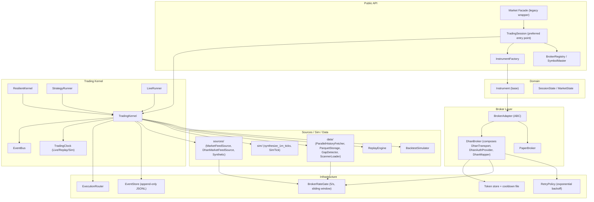
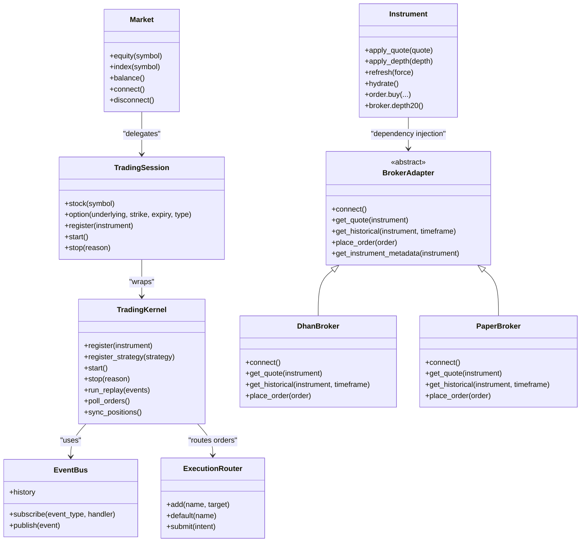
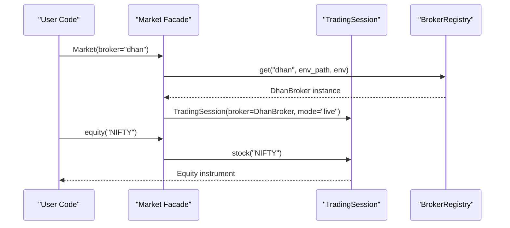
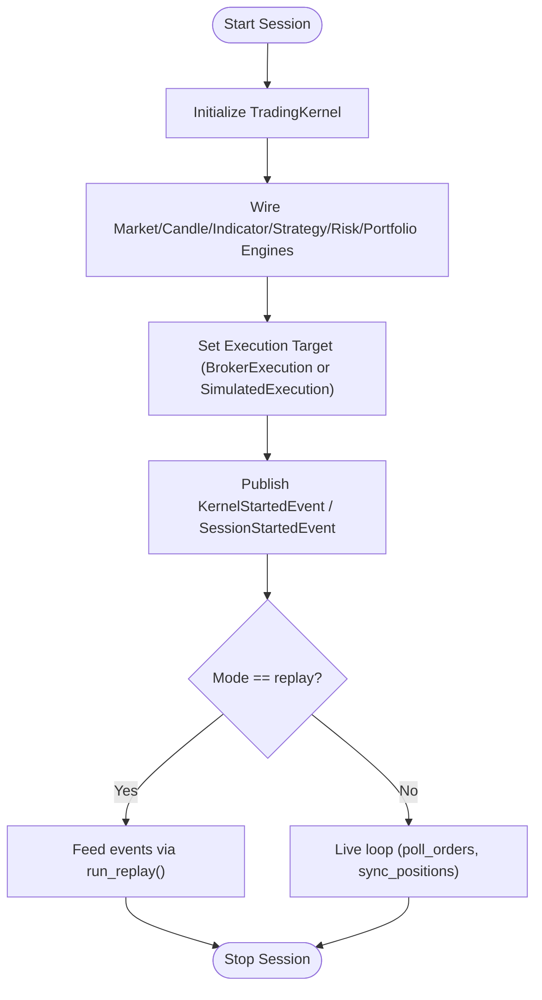
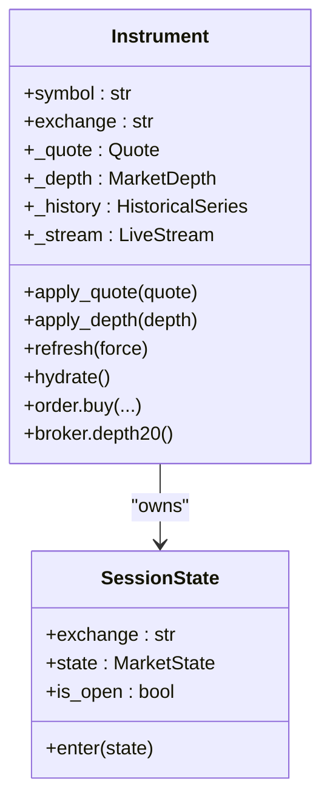
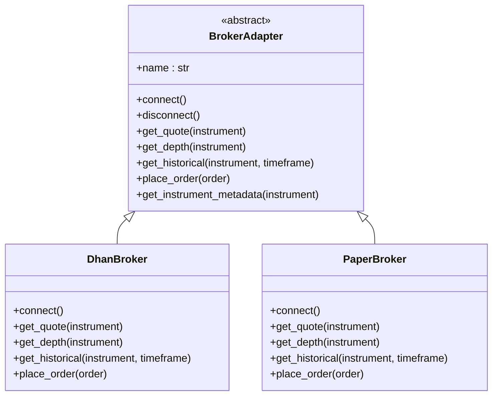
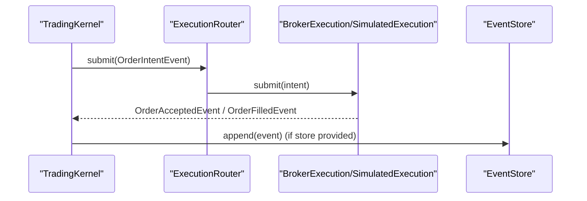
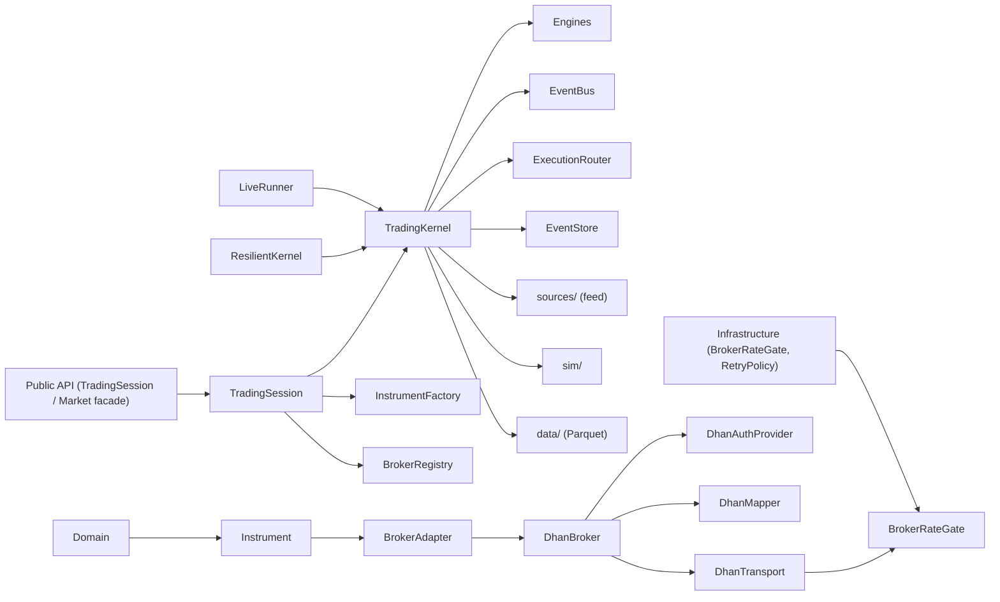

# Layered Architecture Design

<cite>
**Referenced Files in This Document**
- [ARCHITECTURE.md](file://ARCHITECTURE.md)
- [facade.py](file://ntrade/facade.py)
- [factories.py](file://ntrade/factories.py)
- [registry.py](file://ntrade/registry.py)
- [trading_session.py](file://ntrade/kernel/trading_session.py)
- [session.py](file://ntrade/kernel/session.py)
- [event_bus.py](file://ntrade/kernel/event_bus.py)
- [base.py](file://ntrade/domain/instruments/base.py)
- [session_state.py](file://ntrade/domain/session.py)
- [base_broker.py](file://ntrade/brokers/base.py)
- [dhan_broker.py](file://ntrade/brokers/dhan.py)
- [paper_broker.py](file://ntrade/brokers/paper.py)
- [router.py](file://ntrade/execution/router.py)
- [events_base.py](file://ntrade/events/base.py)
</cite>

## Table of Contents
1. Introduction
2. Project Structure
3. Core Components
4. Architecture Overview
5. Detailed Component Analysis
6. Dependency Analysis
7. Performance Considerations
8. Troubleshooting Guide
9. Conclusion

## Introduction
This document explains nTrade’s layered architecture following Clean Architecture principles. It details the strict dependency direction from public API down to infrastructure, and how each layer depends only on layers below it. The design emphasizes:
- Public API facade for market access
- Trading kernel with event bus and engines
- Pure domain objects (instruments, quotes, orders)
- Broker adapters abstracting transport
- Infrastructure for transport, persistence, and replay

The architecture enables testing isolation, component replacement, and maintainability through well-defined contracts, dependency injection, factories, and registries.

## Project Structure
At a high level, nTrade organizes code into distinct layers:
- Public API (TradingSession preferred entry point; Market facade legacy wrapper)
- Trading Kernel (event-centric, zero parity — TradingKernel, ResilientKernel, StrategyRunner, LiveRunner)
- Sources / Sim / Data (interchangeable event sources — sources/, sim/, data/)
- Domain (pure business logic and rich objects)
- Broker (adapters behind domain objects — DhanBroker composes DhanTransport/DhanAuthProvider/DhanMapper)
- Infrastructure (BrokerRateGate, RetryPolicy, token store, EventStore, transport)

**Diagram sources**
- [trading_session.py:39-306](file://ntrade/kernel/trading_session.py#L39-L306)
- [session.py:38-198](file://ntrade/kernel/session.py#L38-L198)
- [event_bus.py:24-81](file://ntrade/kernel/event_bus.py#L24-L81)
- [resilient.py:1-147](file://ntrade/kernel/resilient.py#L1-L147)
- [base.py:50-305](file://ntrade/domain/instruments/base.py#L50-305)
- [session_state.py:10-46](file://ntrade/domain/session.py#L10-L46)
- [base_broker.py:25-163](file://ntrade/brokers/base.py#L25-163)
- [dhan.py:54-200](file://ntrade/brokers/dhan.py#L54-L200)
- [paper.py:23-200](file://ntrade/brokers/paper.py#L23-L200)
- [router.py:19-49](file://ntrade/execution/router.py#L19-L49)
- [parquet_store.py:1-292](file://ntrade/data/parquet_store.py#L1-L292)

**Section sources**
- [ARCHITECTURE.md:20-75](file://ARCHITECTURE.md#L20-L75)
- [ARCHITECTURE.md:470-490](file://ARCHITECTURE.md#L470-L490)
**Section sources**
- [ARCHITECTURE.md:20-75](file://ARCHITECTURE.md#L20-L75)
- [ARCHITECTURE.md:470-490](file://ARCHITECTURE.md#L470-L490)

## Core Components
- TradingSession (preferred entry point): Combines broker connection, InstrumentFactory, TradingKernel lifecycle, and strategy/position management.
- Market Facade (legacy): Thin backward-compatible wrapper over TradingSession; use TradingSession directly for new code.
- TradingKernel: Orchestrates engines, wires EventBus, sets execution target (BrokerExecution or SimulatedExecution), and manages lifecycle.
- ResilientKernel: Crash recovery on top of EventStore — replays causal market stream without re-trading strategies.
- StrategyRunner: Multi-strategy lifecycle management on one kernel with per-strategy RiskEngine isolation.
- LiveRunner: Orchestration harness — starts kernel + feed, polls orders/syncs positions, bridges RiskHaltedEvent to broker kill-switch.
- EventBus: Synchronous pub/sub with thread-safe dispatch and history recording.
- Instrument (domain): Rich object owning state (quote, depth, history, stream, indicators, signals) and capability facades; interacts with BrokerAdapter via constructor injection.
- DhanBroker: Composes DhanTransport (BrokerRateGate choke point), DhanAuthProvider (token store + cooldown + PIN/TOTP fallback), and DhanMapper (wire→domain normalization).
- BrokerRateGate: Multi-window sliding-window rate gate (Quota.QUOTE/DATA/ORDER/NON_TRADING) — single choke point for all outbound broker REST calls.
- RetryPolicy: Exponential backoff for transient failures; DH-904 surfaced as typed RateLimited (never retried).
- EventStore: Append-only JSONL event record for audit, deterministic replay, and crash recovery.

**Section sources**
- [facade.py:27-101](file://ntrade/facade.py#L27-L101)
- [trading_session.py:39-306](file://ntrade/kernel/trading_session.py#L39-L306)
- [session.py:38-198](file://ntrade/kernel/session.py#L38-L198)
- [event_bus.py:24-81](file://ntrade/kernel/event_bus.py#L24-L81)
- [base.py:50-305](file://ntrade/domain/instruments/base.py#L50-L305)
- [base_broker.py:25-163](file://ntrade/brokers/base.py#L25-L163)
- [dhan_broker.py:54-200](file://ntrade/brokers/dhan.py#L54-L200)
- [paper_broker.py:23-200](file://ntrade/brokers/paper.py#L23-L200)
- [router.py:19-49](file://ntrade/execution/router.py#L19-L49)
- [factories.py:20-84](file://ntrade/factories.py#L20-L84)
- [registry.py:16-125](file://ntrade/registry.py#L16-L125)

## Architecture Overview
nTrade follows Clean Architecture with strict dependency direction:
- Public API uses TradingSession as the preferred entry point (Market facade is legacy)
- TradingSession depends on TradingKernel, InstrumentFactory, and BrokerRegistry
- TradingKernel depends on engines, EventBus, ExecutionRouter, sources/, sim/, data/, and optionally BrokerAdapter
- ResilientKernel wraps TradingKernel for crash recovery over EventStore
- LiveRunner orchestrates kernel + feed, bridging RiskEngine breakers to broker kill-switch
- Domain layer is pure Python with no broker imports; broker injected via constructor
- Broker layer (DhanBroker composes DhanTransport/DhanAuthProvider/DhanMapper) implements BrokerAdapter
- Infrastructure includes BrokerRateGate, RetryPolicy, token store, EventStore, and transport abstractions

**Diagram sources**
- [facade.py:27-101](file://ntrade/facade.py#L27-L101)
- [trading_session.py:39-306](file://ntrade/kernel/trading_session.py#L39-L306)
- [session.py:38-198](file://ntrade/kernel/session.py#L38-L198)
- [event_bus.py:24-81](file://ntrade/kernel/event_bus.py#L24-L81)
- [base.py:50-305](file://ntrade/domain/instruments/base.py#L50-L305)
- [base_broker.py:25-163](file://ntrade/brokers/base.py#L25-L163)
- [dhan_broker.py:54-200](file://ntrade/brokers/dhan.py#L54-L200)
- [paper_broker.py:23-200](file://ntrade/brokers/paper.py#L23-L200)
- [router.py:19-49](file://ntrade/execution/router.py#L19-L49)

## Detailed Component Analysis

### Public API Layer (Market Facade)
- Purpose: Provide a simple, backward-compatible entry point that delegates to TradingSession.
- Responsibilities: Create instruments, access account/portfolio, connect/disconnect broker.
- Dependency direction: Depends on TradingSession and BrokerRegistry; no direct broker imports.

**Diagram sources**
- [facade.py:27-101](file://ntrade/facade.py#L27-L101)
- [registry.py:61-125](file://ntrade/registry.py#L61-L125)
- [trading_session.py:39-116](file://ntrade/kernel/trading_session.py#L39-L116)

**Section sources**
- [facade.py:27-101](file://ntrade/facade.py#L27-L101)

### Trading Kernel Layer (TradingSession, EventBus, Engines)
- Purpose: Orchestrate event-driven processing, manage engines, and provide unified session API.
- Responsibilities: Register instruments/strategies, start/stop sessions, run replay, poll orders, sync positions.
- Dependency direction: Depends on engines, EventBus, ExecutionRouter, and optionally BrokerAdapter.

**Diagram sources**
- [trading_session.py:240-249](file://ntrade/kernel/trading_session.py#L240-L249)
- [session.py:120-146](file://ntrade/kernel/session.py#L120-L146)
- [session.py:156-168](file://ntrade/kernel/session.py#L156-L168)

**Section sources**
- [trading_session.py:39-306](file://ntrade/kernel/trading_session.py#L39-L306)
- [session.py:38-198](file://ntrade/kernel/session.py#L38-L198)
- [event_bus.py:24-81](file://ntrade/kernel/event_bus.py#L24-L81)

### Domain Layer (Pure Business Logic)
- Purpose: Encapsulate financial entities and behaviors without external dependencies.
- Responsibilities: Quote/depth/history/stream management, corporate actions, signals, metadata hydration, and capability facades.
- Dependency direction: No broker imports; broker injected via constructor or factory.

**Diagram sources**
- [base.py:50-305](file://ntrade/domain/instruments/base.py#L50-L305)
- [session_state.py:10-46](file://ntrade/domain/session.py#L10-L46)

**Section sources**
- [base.py:50-305](file://ntrade/domain/instruments/base.py#L50-L305)
- [session_state.py:10-46](file://ntrade/domain/session.py#L10-L46)

### Broker Layer (BrokerAdapter Implementations)
- Purpose: Abstract broker-specific transport and normalize wire formats into domain objects.
- Responsibilities: Connect/disconnect, fetch quotes/depth/historical, place orders, optional lifecycle methods.
- Dependency direction: Implements BrokerAdapter; used by domain via lazy broker_adapter property.

**Diagram sources**
- [base_broker.py:25-163](file://ntrade/brokers/base.py#L25-L163)
- [dhan_broker.py:54-200](file://ntrade/brokers/dhan.py#L54-L200)
- [paper_broker.py:23-200](file://ntrade/brokers/paper.py#L23-L200)

**Section sources**
- [base_broker.py:25-163](file://ntrade/brokers/base.py#L25-L163)
- [dhan_broker.py:54-200](file://ntrade/brokers/dhan.py#L54-L200)
- [paper_broker.py:23-200](file://ntrade/brokers/paper.py#L23-L200)

### Infrastructure Layer (Transport, Persistence, Replay)
- Purpose: Provide interchangeable execution targets and persistent event storage.
- Responsibilities: Route order intents to BrokerExecution or SimulatedExecution; record events for audit/replay.
- Dependency direction: Used by TradingKernel; independent of domain/broker specifics.

**Diagram sources**
- [session.py:87-101](file://ntrade/kernel/session.py#L87-L101)
- [router.py:37-49](file://ntrade/execution/router.py#L37-L49)

**Section sources**
- [session.py:87-101](file://ntrade/kernel/session.py#L87-L101)
- [router.py:19-49](file://ntrade/execution/router.py#L19-L49)

## Dependency Analysis
Strict dependency direction ensures maintainability and testability:
- Public API depends on TradingSession and Factories
- TradingSession depends on TradingKernel and InstrumentFactory
- TradingKernel depends on engines, EventBus, ExecutionRouter, and optionally BrokerAdapter
- Domain has no broker imports; broker injected via constructor
- Broker layer implements BrokerAdapter; domain accesses via lazy broker_adapter
- Infrastructure components are pluggable and do not depend on domain specifics

**Diagram sources**
- [facade.py:27-101](file://ntrade/facade.py#L27-L101)
- [trading_session.py:39-306](file://ntrade/kernel/trading_session.py#L39-L306)
- [session.py:38-198](file://ntrade/kernel/session.py#L38-L198)
- [base.py:50-305](file://ntrade/domain/instruments/base.py#L50-L305)
- [base_broker.py:25-163](file://ntrade/brokers/base.py#L25-L163)
- [router.py:19-49](file://ntrade/execution/router.py#L19-L49)

## Performance Considerations
- EventBus uses RLock for thread-safe dispatch; handler exceptions are swallowed to prevent kernel crashes.
- Instrument state updates are immutable snapshots (Quote, MarketDepth) to ensure consistency.
- Lazy broker initialization reduces startup overhead; hydrate metadata once per instrument.
- ExecutionRouter selects targets by strategy name, minimizing branching overhead.
- EventStore supports deterministic replay and crash recovery; selective recording avoids unnecessary I/O.
- BrokerRateGate serializes all outbound broker calls via a sliding-window deque; injectable clock for tests.
- RetryPolicy provides exponential backoff for transient LTP failures.

**Section sources**
- [ARCHITECTURE.md:20-75](file://ARCHITECTURE.md#L20-L75)
- [ARCHITECTURE.md:470-490](file://ARCHITECTURE.md#L470-L490)
- [ARCHITECTURE.md:370-400](file://ARCHITECTURE.md#L370-L400)
- [ntrade/kernel/event_bus.py:24-81](file://ntrade/kernel/event_bus.py#L24-L81)

[No sources needed since this section provides general guidance]

## Troubleshooting Guide
Common issues and resolutions:
- Broker connectivity failures: Ensure BrokerAdapter.connect() is called; check environment variables for authentication.
- Missing execution target: Verify ExecutionRouter has a default target or strategy-specific target registered.
- Event handler errors: Check logs for handler exceptions; EventBus swallows errors but logs them.
- Instrument metadata not hydrated: Call hydrate() or refresh(force=True) to fetch tick/lot/freeze qty from broker.
- Replay parity issues: Ensure TradingClock is injected into BrokerAdapter for consistent timestamps.

**Section sources**
- [event_bus.py:47-66](file://ntrade/kernel/event_bus.py#L47-L66)
- [base.py:169-209](file://ntrade/domain/instruments/base.py#L169-L209)
- [base_broker.py:36-57](file://ntrade/brokers/base.py#L36-L57)

## Conclusion
nTrade’s layered architecture enforces Clean Architecture principles with strict dependency direction, enabling:
- Testing isolation through mockable interfaces (BrokerAdapter, ExecutionRouter)
- Component replacement via dependency injection and factories
- Maintainability through clear boundaries and well-defined contracts
- Zero-parity across live, replay, and backtest modes via event-centric design

The design supports extensibility through capability patterns and open/closed principles, allowing new brokers and asset classes without modifying existing code.

[No sources needed since this section summarizes without analyzing specific files]