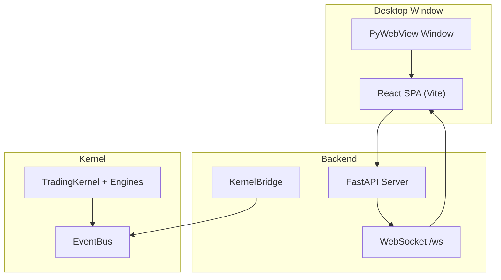
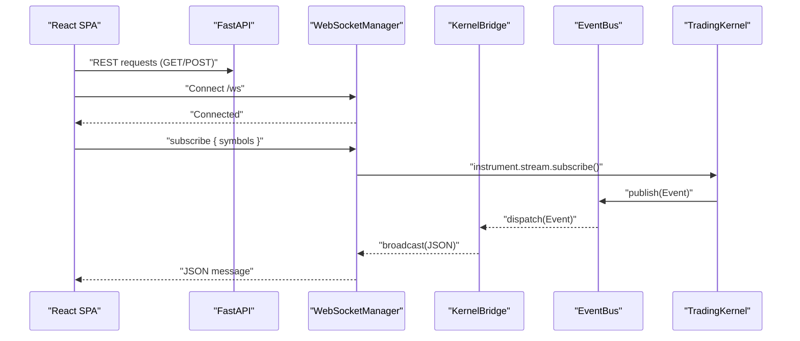
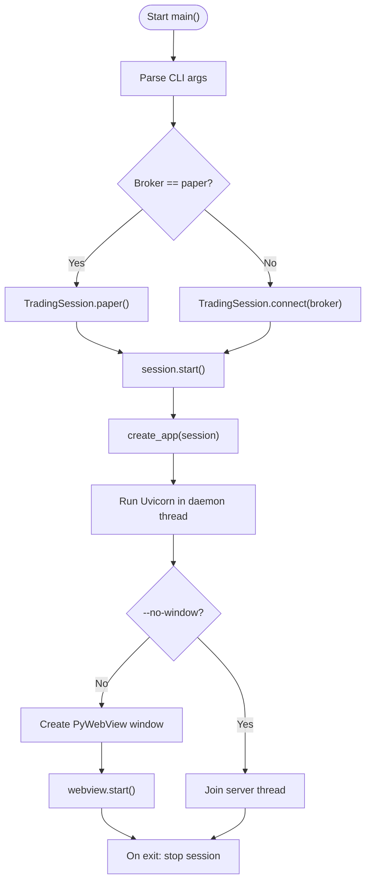
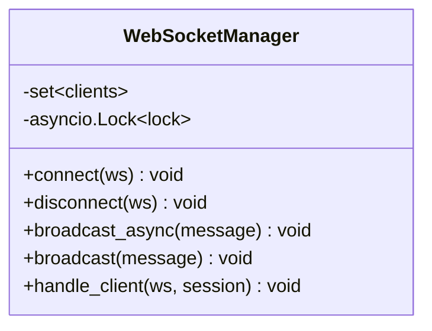
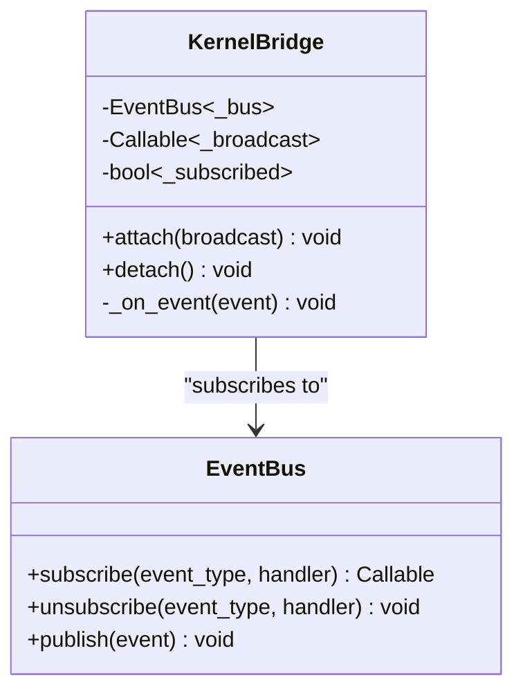
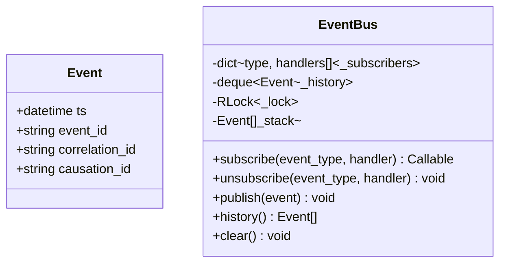
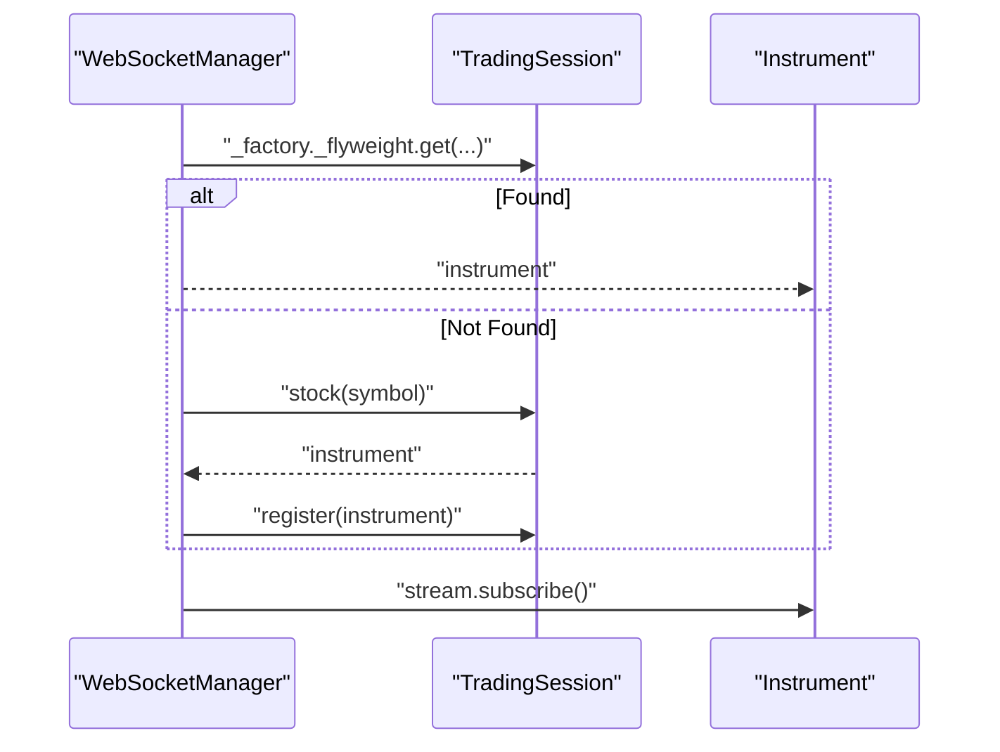
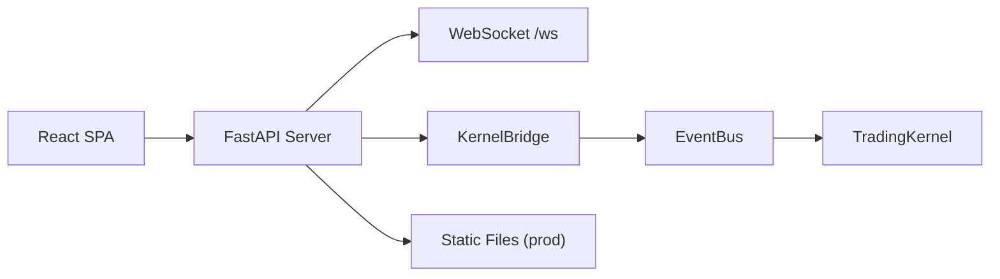

# Trading UI Design Specification

<cite>
**Referenced Files in This Document**
- [2026-08-02-trading-ui-design.md](file://docs/superpowers/specs/2026-08-02-trading-ui-design.md)
- [ARCHITECTURE.md](file://ARCHITECTURE.md)
- [main.py](file://main.py)
- [api/__init__.py](file://api/__init__.py)
- [api/bridge.py](file://api/bridge.py)
- [api/websocket.py](file://api/websocket.py)
- [event_bus.py](file://ntrade/kernel/event_bus.py)
- [base.py](file://ntrade/events/base.py)
- [session.py](file://ntrade/kernel/session.py)
- [facade.py](file://ntrade/facade.py)
- [pyproject.toml](file://pyproject.toml)
</cite>

## Table of Contents
1. [Introduction](#introduction)
2. [Project Structure](#project-structure)
3. [Core Components](#core-components)
4. [Architecture Overview](#architecture-overview)
5. [Detailed Component Analysis](#detailed-component-analysis)
6. [Dependency Analysis](#dependency-analysis)
7. [Performance Considerations](#performance-considerations)
8. [Troubleshooting Guide](#troubleshooting-guide)
9. [Conclusion](#conclusion)
10. [Appendices](#appendices)

## Introduction
This document specifies the design and implementation approach for the nTrade desktop trading UI. It defines how a modern React-based frontend communicates with the existing event-driven nTrade kernel through a FastAPI backend, exposing REST endpoints and a WebSocket stream. The specification covers screens, API contracts, the KernelBridge adapter, launcher behavior, and operational guidance.

## Project Structure
The UI is layered as:
- PyWebView native window hosting a React SPA (Vite dev or static build).
- FastAPI server providing REST endpoints and a WebSocket endpoint at /ws.
- KernelBridge subscribing to the kernel’s EventBus and broadcasting JSON messages.
- The existing nTrade kernel remains unmodified; integration occurs via events and session APIs.

**Diagram sources**
- [2026-08-02-trading-ui-design.md:15-46](file://docs/superpowers/specs/2026-08-02-trading-ui-design.md#L15-L46)
- [main.py:37-99](file://main.py#L37-L99)
- [api/websocket.py:20-90](file://api/websocket.py#L20-L90)
- [api/bridge.py:123-157](file://api/bridge.py#L123-L157)
- [event_bus.py:24-95](file://ntrade/kernel/event_bus.py#L24-L95)

**Section sources**
- [2026-08-02-trading-ui-design.md:15-46](file://docs/superpowers/specs/2026-08-02-trading-ui-design.md#L15-L46)
- [main.py:37-99](file://main.py#L37-L99)

## Core Components
- Launcher (main.py): Starts the TradingSession, creates the FastAPI app, runs Uvicorn in a daemon thread, and opens a PyWebView window.
- FastAPI Backend: Exposes REST endpoints and a WebSocket endpoint (/ws). Serves static files in production.
- WebSocketManager: Manages client connections, handles subscribe/unsubscribe commands, and broadcasts messages from the bridge.
- KernelBridge: Subscribes to the kernel EventBus, maps domain events to JSON messages, and forwards them to the WebSocket manager.
- Event Bus and Events: Immutable canonical events with timestamps from the TradingClock; EventBus provides thread-safe pub/sub with history.

Key responsibilities:
- Decouple the frontend from the kernel by using only REST and WebSocket.
- Keep the kernel unchanged; integrate via EventBus subscription and session methods.
- Provide real-time updates via WebSocket and on-demand data via REST.

**Section sources**
- [main.py:37-99](file://main.py#L37-L99)
- [api/__init__.py:1-9](file://api/__init__.py#L1-L9)
- [api/websocket.py:20-113](file://api/websocket.py#L20-L113)
- [api/bridge.py:1-157](file://api/bridge.py#L1-L157)
- [event_bus.py:24-95](file://ntrade/kernel/event_bus.py#L24-L95)
- [base.py:16-24](file://ntrade/events/base.py#L16-L24)

## Architecture Overview
The system follows a single-process architecture where the Python process hosts both the kernel and the FastAPI server. The React frontend runs inside a native window via PyWebView. Real-time data flows from the kernel through the EventBus to the KernelBridge, then over WebSocket to the SPA. User actions (orders, subscriptions) are sent via REST and WebSocket commands.

**Diagram sources**
- [api/websocket.py:64-90](file://api/websocket.py#L64-L90)
- [api/bridge.py:137-157](file://api/bridge.py#L137-L157)
- [event_bus.py:48-79](file://ntrade/kernel/event_bus.py#L48-L79)
- [2026-08-02-trading-ui-design.md:110-127](file://docs/superpowers/specs/2026-08-02-trading-ui-design.md#L110-L127)

## Detailed Component Analysis

### Launcher (main.py)
- Parses CLI arguments for broker selection, host/port, window flags, and dimensions.
- Creates a TradingSession (paper or live), starts it, and constructs the FastAPI app.
- Runs Uvicorn in a daemon thread and optionally opens a PyWebView window.
- Ensures graceful shutdown by stopping the session on exit.

**Diagram sources**
- [main.py:26-34](file://main.py#L26-L34)
- [main.py:37-99](file://main.py#L37-L99)

**Section sources**
- [main.py:26-34](file://main.py#L26-L34)
- [main.py:37-99](file://main.py#L37-L99)

### FastAPI Backend and WebSocket Manager
- REST endpoints serve account, positions, orders, watchlist, backtest, risk, and session status per the spec.
- WebSocket endpoint manages clients, subscribes/unsubscribes instruments via session, and broadcasts JSON messages.
- Broadcast is thread-safe: synchronous broadcast schedules async send on the running event loop.

**Diagram sources**
- [api/websocket.py:20-63](file://api/websocket.py#L20-L63)
- [api/websocket.py:64-90](file://api/websocket.py#L64-L90)

**Section sources**
- [api/websocket.py:20-113](file://api/websocket.py#L20-L113)

### KernelBridge
- Subscribes to the base Event type on the EventBus to receive all events.
- Maps specific kernel events to JSON messages for WebSocket clients.
- Provides attach/detach lifecycle to manage subscription and broadcast callback.

**Diagram sources**
- [api/bridge.py:123-157](file://api/bridge.py#L123-L157)
- [event_bus.py:31-47](file://ntrade/kernel/event_bus.py#L31-L47)

**Section sources**
- [api/bridge.py:1-157](file://api/bridge.py#L1-L157)

### Event Model and EventBus
- Events are immutable dataclasses with timestamps from the TradingClock.
- EventBus provides thread-safe publish/subscribe with MRO-based dispatch and history tracking.
- Handler exceptions are swallowed to ensure resilience.

**Diagram sources**
- [base.py:16-24](file://ntrade/events/base.py#L16-L24)
- [event_bus.py:24-95](file://ntrade/kernel/event_bus.py#L24-L95)

**Section sources**
- [base.py:16-24](file://ntrade/events/base.py#L16-L24)
- [event_bus.py:24-95](file://ntrade/kernel/event_bus.py#L24-L95)

### Session and Facade Integration
- TradingSession exposes broker connectivity, mode, and instrument registration.
- Facade provides convenient accessors for orderbook, tradebook, account, portfolio, and connection state.
- WebSocket symbol subscription uses session factory and instrument stream APIs.

**Diagram sources**
- [api/websocket.py:93-113](file://api/websocket.py#L93-L113)
- [session.py:272-305](file://ntrade/kernel/session.py#L272-L305)
- [facade.py:71-100](file://ntrade/facade.py#L71-L100)

**Section sources**
- [api/websocket.py:93-113](file://api/websocket.py#L93-L113)
- [session.py:272-305](file://ntrade/kernel/session.py#L272-L305)
- [facade.py:71-100](file://ntrade/facade.py#L71-L100)

### Screens and API Contracts
- Dashboard: Portfolio summary cards, equity sparkline, open positions table, session status.
- Watchlist + Chart: Live LTP panel, lightweight-charts candlestick chart with overlays, quick order entry.
- Order Book: Tabs for open orders, trade history, order history with modify/cancel capabilities.
- Backtest Lab: Strategy selector, parameter form, results panel with charts and stats.
- Risk Monitor: Circuit breaker status, exposure metrics, kill switch, heartbeat/feed status.
- REST endpoints: Account, positions, orders CRUD, watchlist management, backtest run/result, risk control, session status.
- WebSocket channels: quote, order, position, account, risk, heartbeat, feed, candle events; client commands subscribe/unsubscribe.

**Section sources**
- [2026-08-02-trading-ui-design.md:47-108](file://docs/superpowers/specs/2026-08-02-trading-ui-design.md#L47-L108)
- [2026-08-02-trading-ui-design.md:110-127](file://docs/superpowers/specs/2026-08-02-trading-ui-design.md#L110-L127)

## Dependency Analysis
The UI layer depends on:
- FastAPI and Uvicorn for HTTP/WebSocket serving.
- PyWebView for native window hosting.
- React/Vite for frontend development and build.
- The nTrade kernel indirectly via EventBus and session APIs.

**Diagram sources**
- [2026-08-02-trading-ui-design.md:166-206](file://docs/superpowers/specs/2026-08-02-trading-ui-design.md#L166-L206)
- [main.py:52-65](file://main.py#L52-L65)

**Section sources**
- [2026-08-02-trading-ui-design.md:166-206](file://docs/superpowers/specs/2026-08-02-trading-ui-design.md#L166-L206)
- [pyproject.toml:1-25](file://pyproject.toml#L1-L25)

## Performance Considerations
- EventBus serialization: Publishes are serialized with an RLock; handlers must be efficient to avoid blocking.
- WebSocket broadcast: Asynchronous fan-out with dead-client cleanup; synchronous broadcast schedules coroutines safely.
- Frontend rendering: Use lightweight-charts for performant candlesticks; AG Grid for large tables with virtualization.
- Dev/prod parity: Vite HMR for fast iteration; static build served by FastAPI reduces latency in production.
- Minimal dependencies: Avoid heavy libraries; prefer native fetch and Zustand for minimal overhead.

[No sources needed since this section provides general guidance]

## Troubleshooting Guide
- No WebSocket messages: Verify KernelBridge.attach() is called and broadcast callback is set; check EventBus subscription.
- Subscribe failures: Ensure session has a broker and instrument.stream exists; inspect logs for subscribe errors.
- Stale UI: In development, ensure no-cache headers and confirm server serves updated code; restart processes if ports are bound.
- Broker connectivity: Check session.connected and broker status; use session.start() before launching API.
- Event loss: Review EventBus history and handler exceptions; ensure handlers do not raise unhandled exceptions.

**Section sources**
- [api/websocket.py:93-113](file://api/websocket.py#L93-L113)
- [api/bridge.py:137-157](file://api/bridge.py#L137-L157)
- [event_bus.py:65-79](file://ntrade/kernel/event_bus.py#L65-L79)

## Conclusion
The nTrade Trading UI integrates seamlessly with the existing kernel through a thin, non-invasive adapter (KernelBridge) and a FastAPI backend. The design emphasizes decoupling, real-time responsiveness, and a consistent developer experience across development and production. With well-defined screens, API contracts, and robust event handling, the UI delivers a professional trading desktop experience.

[No sources needed since this section summarizes without analyzing specific files]

## Appendices

### API Endpoints Summary
- GET /api/account: Returns balance, equity, pnl.
- GET /api/positions: Returns open positions array.
- GET /api/orders: Returns orders list; GET /api/orders/{id}: Full detail.
- POST /api/orders: Place order; PUT /api/orders/{id}: Modify; DELETE /api/orders/{id}: Cancel.
- GET /api/watchlist: List symbols; POST /api/watchlist: Add; DELETE /api/watchlist/{symbol}: Remove.
- GET /api/watchlist/{symbol}/quotes: Current quote.
- GET /api/backtest/run: Run backtest; GET /api/backtest/{id}: Result.
- GET /api/risk/status: Breakers, exposure, halted; POST /api/risk/halt: Kill switch; POST /api/risk/resume: Resume.
- GET /api/session/status: Mode, connected, heartbeat, feed_status.

**Section sources**
- [2026-08-02-trading-ui-design.md:88-108](file://docs/superpowers/specs/2026-08-02-trading-ui-design.md#L88-L108)

### WebSocket Message Types
- quote, order (ACCEPTED/FILLED/REJECTED/UPDATED), position, account, risk (triggered true/false), heartbeat, feed (disconnected), candle.
- Client commands: subscribe, unsubscribe with symbols array.

**Section sources**
- [2026-08-02-trading-ui-design.md:110-127](file://docs/superpowers/specs/2026-08-02-trading-ui-design.md#L110-L127)

### Build and Run Instructions
- Development: Run FastAPI server and React dev server separately.
- Production: Build React static assets and launch main.py to serve static files and open PyWebView window.

**Section sources**
- [2026-08-02-trading-ui-design.md:228-243](file://docs/superpowers/specs/2026-08-02-trading-ui-design.md#L228-L243)
- [main.py:52-99](file://main.py#L52-L99)