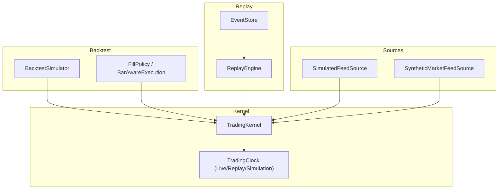
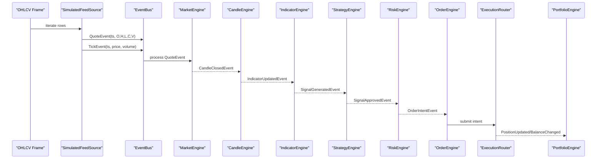
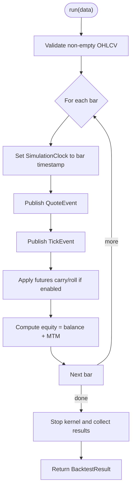
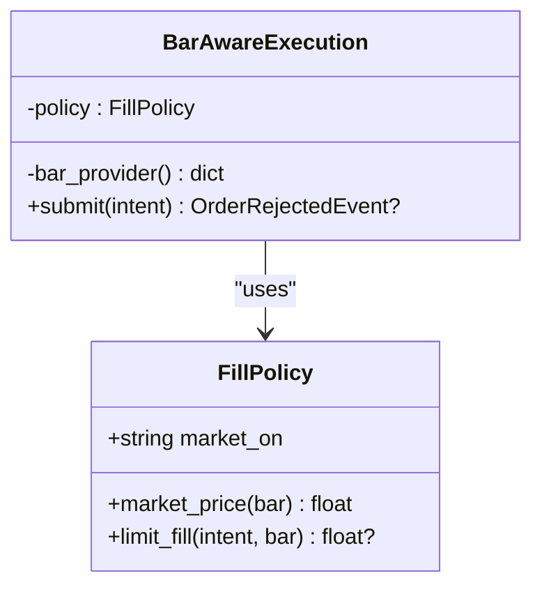
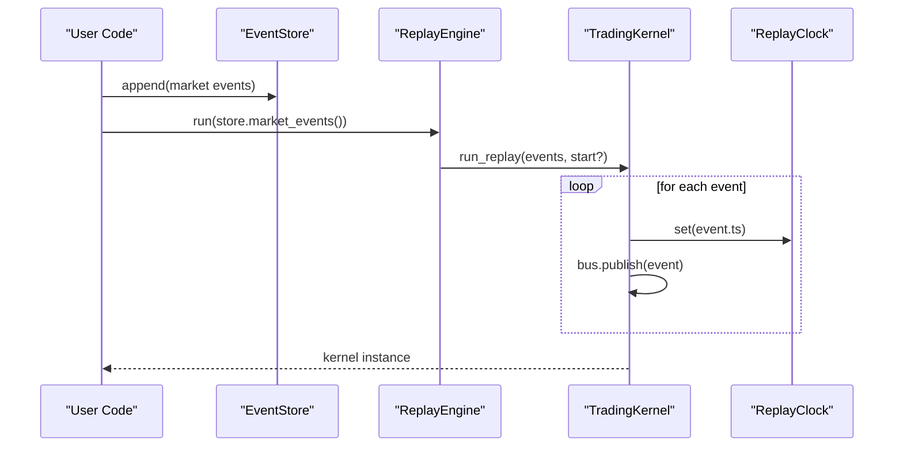
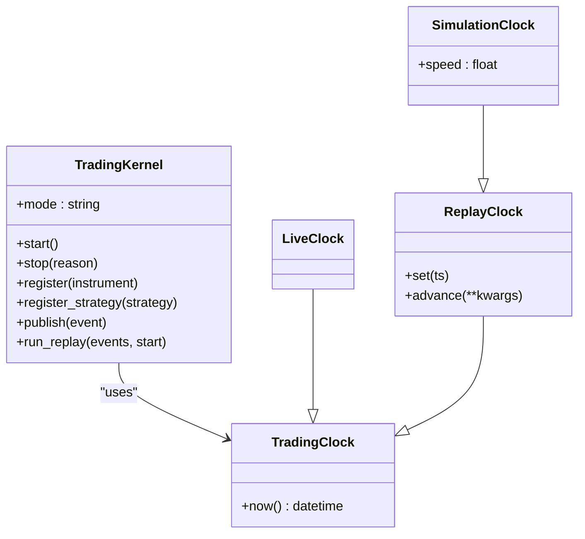
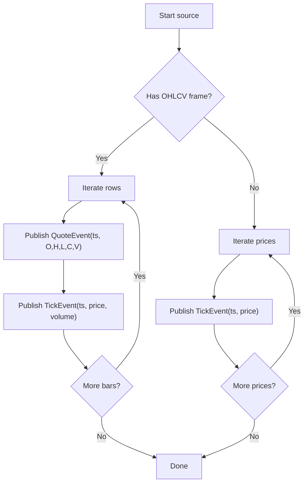
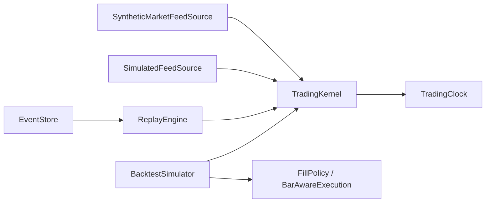

# Backtest & Replay Guide

<cite>
**Referenced Files in This Document**
- [06-simulation.md](file://user-guide/06-simulation.md)
- [simulator.py](file://ntrade/backtest/simulator.py)
- [fills.py](file://ntrade/backtest/fills.py)
- [replay_engine.py](file://ntrade/replay/replay_engine.py)
- [clock.py](file://ntrade/kernel/clock.py)
- [session.py](file://ntrade/kernel/session.py)
- [event_store.py](file://ntrade/storage/event_store.py)
- [market_feed.py](file://ntrade/sources/market_feed.py)
- [synthetic_feed.py](file://ntrade/sources/synthetic_feed.py)
- [ema_cross_run.py](file://scripts/ema_cross_run.py)
- [paper_gate_run.py](file://scripts/paper_gate_run.py)
- [test_replay_backtest.py](file://tests/test_replay_backtest.py)
</cite>

## Update Summary
**Changes Made**
- Updated document structure to reflect the migration from `backtest-replay-guide.md` to `user-guide/06-simulation.md`
- Enhanced coverage of synthetic tick generation with detailed explanation of `SyntheticMarketFeedSource`
- Expanded event store functionality documentation including recovery mechanisms
- Added comprehensive paper-to-live workflow section with gate validation
- Updated all file references and source tracking to reflect new organizational structure
- Maintained zero-parity architecture emphasis throughout all sections

## Table of Contents
1. Introduction
2. Project Structure
3. Core Components
4. Architecture Overview
5. Detailed Component Analysis
6. Dependency Analysis
7. Performance Considerations
8. Troubleshooting Guide
9. Conclusion

## Introduction
This guide explains how to run backtests and replay recorded events with nTrade while preserving zero-parity across live, replay, and backtest modes. The same kernel and engine stack are used everywhere; only the event source, execution target, and clock differ. You can use the high-level BacktestSimulator for quick bar-driven runs or the ReplayEngine for deterministic re-execution of recorded market events. For full control, drive the TradingKernel directly with feed sources that publish canonical TickEvent/QuoteEvent streams.

The content has been restructured into the comprehensive simulation guide covering the complete paper-to-live workflow, enhanced synthetic tick generation, and robust event storage mechanisms.

## Project Structure
The backtest and replay features span a small set of focused modules:
- Backtesting: bar-driven simulation over OHLCV frames
- Replay: deterministic re-execution of recorded market events
- Kernel and clocks: shared orchestration and time abstraction
- Event store: append-only persistence for recording and recovery
- Feed sources: interchangeable producers of canonical events

**Diagram sources**
- [simulator.py:1-220](file://ntrade/backtest/simulator.py#L1-L220)
- [fills.py:1-72](file://ntrade/backtest/fills.py#L1-L72)
- [replay_engine.py:1-24](file://ntrade/replay/replay_engine.py#L1-L24)
- [event_store.py:1-236](file://ntrade/storage/event_store.py#L1-L236)
- [session.py:1-200](file://ntrade/kernel/session.py#L1-L200)
- [clock.py:1-55](file://ntrade/kernel/clock.py#L1-55)
- [market_feed.py:1-105](file://ntrade/sources/market_feed.py#L1-105)
- [synthetic_feed.py:1-77](file://ntrade/sources/synthetic_feed.py#L1-77)

**Section sources**
- [06-simulation.md:1-202](file://user-guide/06-simulation.md#L1-202)

## Core Components
- BacktestSimulator: Runs the standard kernel over an OHLCV frame, publishes QuoteEvent/TickEvent per bar, applies cost models, and returns a BacktestResult with equity curve and trade details. Supports optional bar-aware limit fills via FillPolicy and FuturesCarryCosts accrual.
- ReplayEngine: Wraps a TradingKernel with a ReplayClock and replays a stream of market events deterministically.
- TradingKernel: Orchestrates engines (market, candle, indicator, strategy, risk, portfolio), wires execution targets, and exposes lifecycle and replay helpers.
- EventStore: Append-only JSONL-backed store for all events, with queries for market-only events, open-order deltas, and causal recovery sequences.
- Feed Sources: SimulatedFeedSource publishes QuoteEvent/TickEvent from OHLCV or price lists; SyntheticMarketFeedSource extrapolates 1m bars into per-second ticks.

Key usage patterns:
- One-liner backtest with BacktestSimulator.run(df)
- Deterministic replay via ReplayEngine.run(events)
- Full control by starting a TradingKernel and publishing events through feed sources

**Section sources**
- [simulator.py:29-220](file://ntrade/backtest/simulator.py#L29-L220)
- [replay_engine.py:14-24](file://ntrade/replay/replay_engine.py#L14-L24)
- [session.py:38-200](file://ntrade/kernel/session.py#L38-L200)
- [event_store.py:76-236](file://ntrade/storage/event_store.py#L76-236)
- [market_feed.py:23-105](file://ntrade/sources/market_feed.py#L23-105)
- [synthetic_feed.py:19-77](file://ntrade/sources/synthetic_feed.py#L19-77)

## Architecture Overview
The zero-parity architecture ensures identical behavior across environments by keeping the kernel and engine stack constant and swapping only the event source, execution target, and clock.

**Diagram sources**
- [market_feed.py:88-105](file://ntrade/sources/market_feed.py#L88-105)
- [session.py:79-103](file://ntrade/kernel/session.py#L79-103)

## Detailed Component Analysis

### BacktestSimulator
- Purpose: Run the kernel over historical bars and produce a BacktestResult including final equity, return percentage, trades, equity curve, and aggregated costs.
- Behavior:
  - Publishes QuoteEvent and TickEvent per bar to keep the engine pipeline identical to live.
  - Applies futures carry and roll costs when configured.
  - Optionally uses BarAwareExecution with FillPolicy for realistic limit fills against bar ranges.
- Result fields: final_equity, total_return_pct, n_trades, trades, equity_curve, commissions_total, statutory_total, max_drawdown_pct, futures_costs_total.

**Diagram sources**
- [simulator.py:116-143](file://ntrade/backtest/simulator.py#L116-143)
- [simulator.py:145-187](file://ntrade/backtest/simulator.py#L145-187)
- [simulator.py:188-220](file://ntrade/backtest/simulator.py#L188-220)

**Section sources**
- [simulator.py:29-220](file://ntrade/backtest/simulator.py#L29-220)

### FillPolicy and BarAwareExecution
- FillPolicy defines bar-aware rules for MARKET and LIMIT fills:
  - MARKET orders fill at configured bar price (open/close).
  - LIMIT orders fill only when the bar's range touches the limit; fill price is the better of limit and open.
- BarAwareExecution wraps SimulatedExecution to enforce these rules during backtests.

**Diagram sources**
- [fills.py:16-42](file://ntrade/backtest/fills.py#L16-42)
- [fills.py:44-72](file://ntrade/backtest/fills.py#L44-72)

**Section sources**
- [fills.py:1-72](file://ntrade/backtest/fills.py#L1-72)

### ReplayEngine and EventStore
- ReplayEngine constructs a TradingKernel with a ReplayClock and replays a stream of events deterministically.
- EventStore records every event (optionally to JSONL), supports querying market-only events, reconstructing open-order deltas, and producing causal sequences for crash recovery.

**Diagram sources**
- [replay_engine.py:14-24](file://ntrade/replay/replay_engine.py#L14-24)
- [session.py:135-147](file://ntrade/kernel/session.py#L135-147)
- [event_store.py:126-136](file://ntrade/storage/event_store.py#L126-136)

**Section sources**
- [replay_engine.py:1-24](file://ntrade/replay/replay_engine.py#L1-24)
- [event_store.py:76-236](file://ntrade/storage/event_store.py#L76-236)

### TradingKernel and Clocks
- TradingKernel wires the engine stack, registers instruments and strategies, manages lifecycle, and provides replay helpers.
- Clocks abstract time:
  - LiveClock: wall-clock time
  - ReplayClock: deterministic time driven by events
  - SimulationClock: extends ReplayClock with speed scaling

**Diagram sources**
- [session.py:38-200](file://ntrade/kernel/session.py#L38-200)
- [clock.py:14-55](file://ntrade/kernel/clock.py#L14-55)

**Section sources**
- [session.py:1-200](file://ntrade/kernel/session.py#L1-200)
- [clock.py:1-55](file://ntrade/kernel/clock.py#L1-55)

### Feed Sources
- SimulatedFeedSource: Publishes QuoteEvent/TickEvent from an OHLCV frame or a price list, advancing the clock deterministically when supported.
- SyntheticMarketFeedSource: Extrapolates 1m OHLCV into per-second ticks using a seeded simulator, publishing QuoteEvent per bar and TickEvent per simulated second.

**Diagram sources**
- [market_feed.py:88-105](file://ntrade/sources/market_feed.py#L88-105)
- [synthetic_feed.py:52-77](file://ntrade/sources/synthetic_feed.py#L52-77)

**Section sources**
- [market_feed.py:1-105](file://ntrade/sources/market_feed.py#L1-105)
- [synthetic_feed.py:1-77](file://ntrade/sources/synthetic_feed.py#L1-77)

### Example Scripts
- ema_cross_run.py: Demonstrates fetching real historical data, running the kernel in replay mode with SimulatedFeedSource, and reporting fills and state.
- paper_gate_run.py: Validates a strategy over synthetic ticks derived from history and enforces go-live checks (e.g., minimum trades, drawdown cap).

**Section sources**
- [ema_cross_run.py:1-87](file://scripts/ema_cross_run.py#L1-87)
- [paper_gate_run.py:1-66](file://scripts/paper_gate_run.py#L1-66)

## Dependency Analysis
High-level dependencies between core components:

**Diagram sources**
- [simulator.py:86-113](file://ntrade/backtest/simulator.py#L86-113)
- [replay_engine.py:14-24](file://ntrade/replay/replay_engine.py#L14-24)
- [event_store.py:126-136](file://ntrade/storage/event_store.py#L126-136)
- [market_feed.py:23-46](file://ntrade/sources/market_feed.py#L23-46)
- [synthetic_feed.py:19-35](file://ntrade/sources/synthetic_feed.py#L19-35)
- [session.py:38-103](file://ntrade/kernel/session.py#L38-103)
- [clock.py:14-55](file://ntrade/kernel/clock.py#L14-55)

**Section sources**
- [simulator.py:1-220](file://ntrade/backtest/simulator.py#L1-220)
- [replay_engine.py:1-24](file://ntrade/replay/replay_engine.py#L1-24)
- [event_store.py:1-236](file://ntrade/storage/event_store.py#L1-236)
- [session.py:1-200](file://ntrade/kernel/session.py#L1-200)
- [clock.py:1-55](file://ntrade/kernel/clock.py#L1-55)
- [market_feed.py:1-105](file://ntrade/sources/market_feed.py#L1-105)
- [synthetic_feed.py:1-77](file://ntrade/sources/synthetic_feed.py#L1-77)

## Performance Considerations
- Prefer BacktestSimulator for fast, synchronous bar-driven runs without background threads.
- Use SyntheticMarketFeedSource judiciously; it spawns a background thread and generates many ticks per bar. Ensure proper join/stop handling.
- EventStore writes to JSONL on append; for large datasets, consider batching or limiting stored event types to reduce I/O overhead.
- Limit order processing in backtests via FillPolicy to avoid unnecessary rejections and ensure deterministic fills.

## Troubleshooting Guide
Common issues and resolutions:
- Zero parity mismatch: Ensure you replay only market events (Tick/Quote/Depth) via EventStore.market_events(). Replaying derived events (signals/fills) causes double-application.
- Crash recovery divergence: Use EventStore.recovery_events() which sorts by timestamp and original append order to preserve causality.
- Limit orders not filling: Verify FillPolicy configuration and that the bar's range touches the limit price.
- Missing fills in backtest: Confirm that MARKET orders fill at the configured bar price and that your strategy emits signals at appropriate times.
- Threaded sources not stopping: Call stop/join on SyntheticMarketFeedSource before stopping the kernel.

**Section sources**
- [event_store.py:126-136](file://ntrade/storage/event_store.py#L126-136)
- [event_store.py:183-210](file://ntrade/storage/event_store.py#L183-210)
- [fills.py:28-42](file://ntrade/backtest/fills.py#L28-42)
- [synthetic_feed.py:44-51](file://ntrade/sources/synthetic_feed.py#L44-51)
- [test_replay_backtest.py:72-100](file://tests/test_replay_backtest.py#L72-100)
- [test_replay_backtest.py:184-215](file://tests/test_replay_backtest.py#L184-215)

## Conclusion
nTrade's backtest and replay subsystems provide a robust, zero-parity foundation for validating strategies offline. Use BacktestSimulator for rapid bar-based evaluation, ReplayEngine for deterministic re-execution of recorded events, and the TradingKernel for full control over event flows. With configurable cost models, bar-aware fills, and comprehensive event storage, you can confidently bridge backtests and live trading.

The restructured documentation now provides comprehensive coverage of the complete simulation workflow, from initial backtesting through synthetic tick generation to live deployment validation.