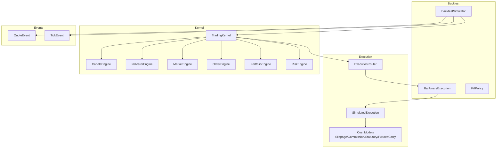
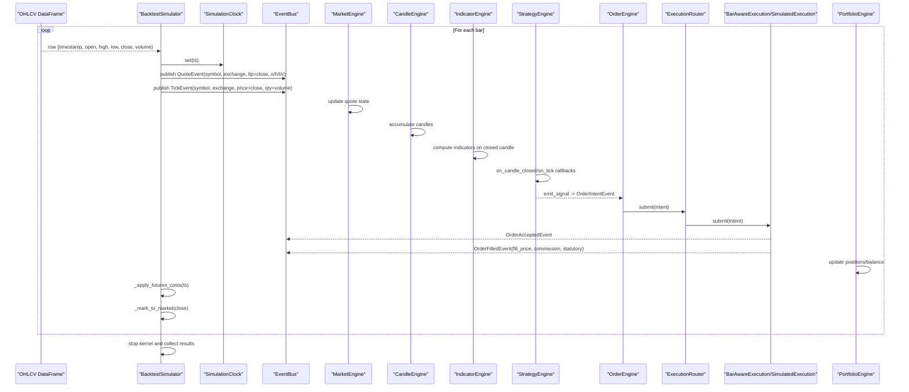
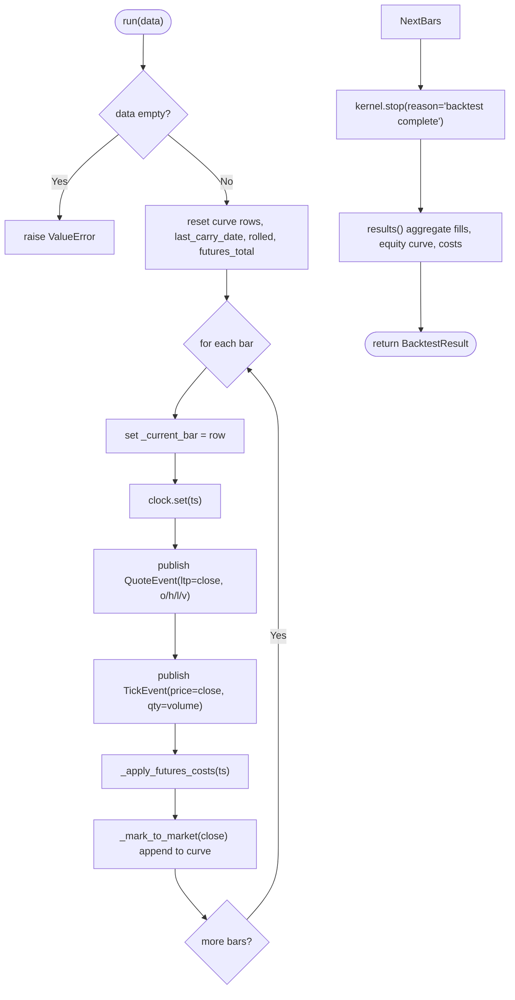
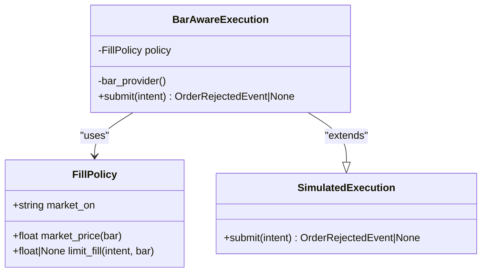
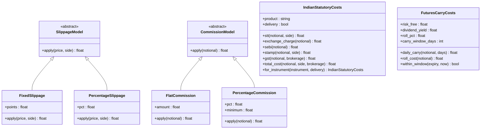
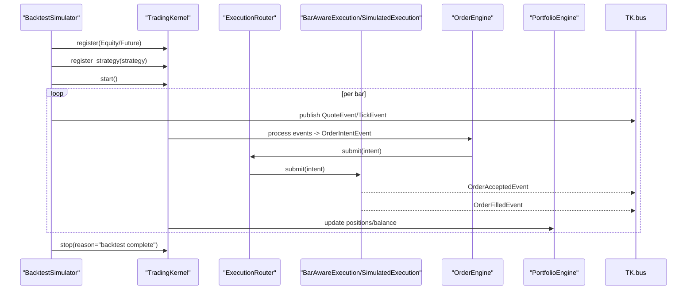
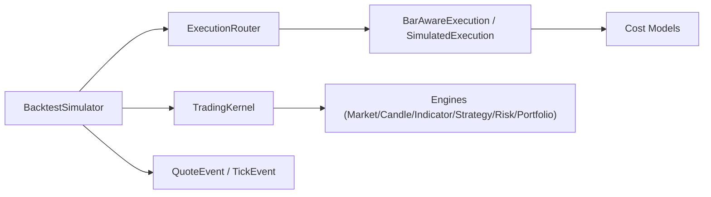

# Backtest Simulator

<cite>
**Referenced Files in This Document**
- [simulator.py](file://ntrade/backtest/simulator.py)
- [fills.py](file://ntrade/backtest/fills.py)
- [execution_simulator.py](file://ntrade/execution/simulator.py)
- [costs.py](file://ntrade/execution/costs.py)
- [session.py](file://ntrade/kernel/session.py)
- [clock.py](file://ntrade/kernel/clock.py)
- [market_events.py](file://ntrade/events/market.py)
- [router.py](file://ntrade/execution/router.py)
- [replay_engine.py](file://ntrade/replay/replay_engine.py)
- [test_replay_backtest.py](file://tests/test_replay_backtest.py)
- [test_futures_carry_costs.py](file://tests/test_futures_carry_costs.py)
</cite>

## Table of Contents
1. [Introduction](#introduction)
2. [Project Structure](#project-structure)
3. [Core Components](#core-components)
4. [Architecture Overview](#architecture-overview)
5. [Detailed Component Analysis](#detailed-component-analysis)
6. [Dependency Analysis](#dependency-analysis)
7. [Performance Considerations](#performance-considerations)
8. [Troubleshooting Guide](#troubleshooting-guide)
9. [Conclusion](#conclusion)
10. [Appendices](#appendices)

## Introduction
This document explains the BacktestSimulator component and how it provides zero-parity testing across live, replay, and backtest modes. It details the BarAwareExecution system for realistic limit order filling based on bar price action, the fill model configuration (slippage, commission, statutory costs), partial fill handling via deterministic fills, and the full backtest lifecycle from initialization through execution to result analysis. It also covers historical data loading, event generation, strategy execution timing, and integration with the trading kernel and engine stack during backtesting mode.

## Project Structure
The backtesting subsystem is implemented under ntrade/backtest and integrates tightly with the execution and kernel layers:
- BacktestSimulator orchestrates a TradingKernel configured for backtest mode, drives events from OHLCV bars, and aggregates results.
- BarAwareExecution extends SimulatedExecution to enforce bar-aware limit fills using FillPolicy.
- SimulatedExecution implements the deterministic fill pipeline used by paper trading, replay, and backtest.
- Costs models define slippage, commissions, Indian statutory charges, and futures carry/roll costs.
- The TradingKernel wires the engine stack (market, candle, indicator, strategy, risk, portfolio) and the execution router.
- Clock abstractions ensure deterministic time control for replay and simulation.

**Diagram sources**
- [simulator.py:58-113](file://ntrade/backtest/simulator.py#L58-L113)
- [fills.py:44-72](file://ntrade/backtest/fills.py#L44-L72)
- [execution_simulator.py:43-147](file://ntrade/execution/simulator.py#L43-L147)
- [costs.py:21-64](file://ntrade/execution/costs.py#L21-L64)
- [session.py:38-101](file://ntrade/kernel/session.py#L38-L101)
- [market_events.py:24-38](file://ntrade/events/market.py#L24-L38)

**Section sources**
- [simulator.py:1-110](file://ntrade/backtest/simulator.py#L1-L110)
- [session.py:38-101](file://ntrade/kernel/session.py#L38-L101)

## Core Components
- BacktestSimulator: Initializes a TradingKernel in backtest mode, registers an instrument, configures the execution target (BarAwareExecution or SimulatedExecution), publishes QuoteEvent and TickEvent per bar, accrues futures carrying costs, computes mark-to-market equity, and returns BacktestResult aggregating trades, equity curve, and cost totals.
- BarAwareExecution: Extends SimulatedExecution to intercept non-MARKET orders and apply bar-aware limit logic via FillPolicy; MARKET orders pass through unchanged.
- SimulatedExecution: Deterministic fill engine that applies slippage, commission, and statutory costs; supports delivery detection for equities; publishes OrderAcceptedEvent and OrderFilledEvent; tracks fills.
- FillPolicy: Encapsulates market-on behavior and limit-fill rules based on bar open/high/low/close.
- Cost Models: SlippageModel (FixedSlippage, PercentageSlippage), CommissionModel (FlatCommission, PercentageCommission), IndianStatutoryCosts (H6 charges), FuturesCarryCosts (daily carry and roll).
- TradingKernel: Wires engines and execution router; supports live/replay/backtest modes with identical stack; manages session lifecycle and replay.

**Section sources**
- [simulator.py:29-113](file://ntrade/backtest/simulator.py#L29-L113)
- [fills.py:16-72](file://ntrade/backtest/fills.py#L16-L72)
- [execution_simulator.py:43-147](file://ntrade/execution/simulator.py#L43-L147)
- [costs.py:21-205](file://ntrade/execution/costs.py#L21-L205)
- [session.py:38-101](file://ntrade/kernel/session.py#L38-L101)

## Architecture Overview
Zero-parity is achieved by keeping the same TradingKernel + engine stack + execution target across live, replay, and backtest. Differences are limited to:
- Event source: Live broker feed vs ReplayClock-driven events vs BacktestSimulator-generated Quote/Tick events from OHLCV bars.
- Clock: LiveClock vs ReplayClock vs SimulationClock.
- Execution target: BrokerExecution (live) vs SimulatedExecution (paper/backtest/replay) vs BarAwareExecution (backtest limit fills).

**Diagram sources**
- [simulator.py:116-143](file://ntrade/backtest/simulator.py#L116-L143)
- [session.py:79-101](file://ntrade/kernel/session.py#L79-L101)
- [execution_simulator.py:72-147](file://ntrade/execution/simulator.py#L72-L147)
- [fills.py:59-72](file://ntrade/backtest/fills.py#L59-L72)

## Detailed Component Analysis

### BacktestSimulator
Responsibilities:
- Initialize TradingKernel in backtest mode with SimulationClock and timeframe.
- Register instrument (default Equity if none provided).
- Configure execution target: BarAwareExecution when fill_policy is provided, else SimulatedExecution.
- Publish QuoteEvent and TickEvent per bar to drive the engine stack deterministically.
- Accrue futures holding-period costs after bar state updates positions.
- Compute mark-to-market equity at each bar and finalize results.

Key behaviors:
- Zero-parity: Uses the same kernel and engine stack as live; only clock and execution differ.
- Deterministic fills: No randomness; fills are computed from bar ranges and policy.
- Futures carry/roll: Optional modeling via FuturesCarryCosts applied daily within window and once on expiry crossing.

**Diagram sources**
- [simulator.py:116-143](file://ntrade/backtest/simulator.py#L116-L143)
- [simulator.py:145-191](file://ntrade/backtest/simulator.py#L145-L191)

**Section sources**
- [simulator.py:58-113](file://ntrade/backtest/simulator.py#L58-L113)
- [simulator.py:116-143](file://ntrade/backtest/simulator.py#L116-L143)
- [simulator.py:145-191](file://ntrade/backtest/simulator.py#L145-L191)
- [simulator.py:194-220](file://ntrade/backtest/simulator.py#L194-L220)

### BarAwareExecution and FillPolicy
BarAwareExecution wraps SimulatedExecution to enforce bar-aware limit fills:
- Non-MARKET orders: consult FillPolicy against current bar; if not touched, return OrderRejectedEvent with reason "limit not touched".
- If touched: adjust intent price to bar-aware fill price (better of limit and open depending on side) and delegate to parent submit.
- MARKET orders: bypass policy and execute via parent.

FillPolicy rules:
- Market orders fill at configured bar price (open or close).
- Limit buy fills when bar low <= limit; fill price is min(limit, open).
- Limit sell fills when bar high >= limit; fill price is max(limit, open).

**Diagram sources**
- [fills.py:16-42](file://ntrade/backtest/fills.py#L16-L42)
- [fills.py:44-72](file://ntrade/backtest/fills.py#L44-L72)
- [execution_simulator.py:43-147](file://ntrade/execution/simulator.py#L43-L147)

**Section sources**
- [fills.py:16-72](file://ntrade/backtest/fills.py#L16-L72)

### SimulatedExecution and Cost Models
SimulatedExecution implements deterministic fills:
- Validates instrument availability and price.
- Applies slippage for MARKET orders; uses intent.price otherwise.
- Publishes OrderAcceptedEvent and OrderFilledEvent with commission and statutory costs.
- Delivery detection for equities: adjusts STT/stamp uplift when closing overnight positions.
- Tracks fills for later aggregation.

Cost models:
- SlippageModel: FixedSlippage (points), PercentageSlippage (pct).
- CommissionModel: FlatCommission (fixed amount), PercentageCommission (pct with minimum).
- IndianStatutoryCosts: STT, exchange charge, SEBI fee, GST on brokerage, stamp duty; product-specific schedules for equity/futures/options; delivery flag affects equity schedules.
- FuturesCarryCosts: daily_carry(notional, days) and roll_cost(notional); within_window(expiry, now) limits accrual near expiry.

**Diagram sources**
- [execution_simulator.py:43-147](file://ntrade/execution/simulator.py#L43-L147)
- [costs.py:21-64](file://ntrade/execution/costs.py#L21-L64)
- [costs.py:70-205](file://ntrade/execution/costs.py#L70-L205)
- [costs.py:207-258](file://ntrade/execution/costs.py#L207-L258)

**Section sources**
- [execution_simulator.py:43-147](file://ntrade/execution/simulator.py#L43-L147)
- [costs.py:21-205](file://ntrade/execution/costs.py#L21-L205)
- [costs.py:207-258](file://ntrade/execution/costs.py#L207-L258)

### Kernel Integration and Engine Stack
TradingKernel wires the engine stack identically across modes:
- MarketEngine updates instrument quotes from QuoteEvent/TickEvent.
- CandleEngine builds candles from ticks/quotes.
- IndicatorEngine computes indicator bundles on closed candles.
- StrategyEngine executes strategies reacting to signals and events.
- RiskEngine approves signals before order submission.
- OrderEngine routes intents via ExecutionRouter to execution targets.
- PortfolioEngine updates positions and balances upon fills.

BacktestSimulator injects BarAwareExecution or SimulatedExecution into the router and sets the default target.

**Diagram sources**
- [session.py:79-101](file://ntrade/kernel/session.py#L79-L101)
- [session.py:120-130](file://ntrade/kernel/session.py#L120-L130)
- [router.py:19-49](file://ntrade/execution/router.py#L19-L49)

**Section sources**
- [session.py:38-101](file://ntrade/kernel/session.py#L38-L101)
- [router.py:19-49](file://ntrade/execution/router.py#L19-L49)

### Historical Data Loading, Event Generation, and Timing
- Historical data: BacktestSimulator.run accepts a pandas DataFrame with columns timestamp/open/high/low/close/volume.
- Event generation: For each bar, publishes QuoteEvent (full snapshot) then TickEvent (close price and volume).
- Timing: SimulationClock.set advances deterministic time; strategies receive events in chronological order ensuring zero parity.
- Result analysis: Aggregates fills, computes equity curve, total commissions/statutory/futures costs, and max drawdown.

**Section sources**
- [simulator.py:116-143](file://ntrade/backtest/simulator.py#L116-L143)
- [market_events.py:24-38](file://ntrade/events/market.py#L24-L38)
- [clock.py:49-55](file://ntrade/kernel/clock.py#L49-L55)
- [simulator.py:194-220](file://ntrade/backtest/simulator.py#L194-L220)

### Backtest Lifecycle Examples
- Basic setup: Create BacktestSimulator with timeframe, initial cash, optional statutory=None for zero-cost mode; register strategy; run with OHLCV DataFrame; inspect BacktestResult fields.
- Limit fills: Use FillPolicy(market_on="close"/"open"); limit orders only fill if bar range touches limit; fill price determined by policy rules.
- Commissions: Configure PercentageCommission(pct=...) to simulate proportional fees; verify commissions_total in results.
- Futures carry: Provide FuturesCarryCosts(risk_free, dividend_yield, roll_pct, carry_window_days); simulator accrues daily carry within window and one-off roll on expiry crossing.

Examples are validated in tests:
- test_backtest_simulator_produces_equity_curve
- test_backtest_fill_policy
- test_backtest_commissions_and_drawdown
- test_backtest_limit_fills_bar_aware
- test_backtest_market_orders_ignore_policy
- test_futures_backtest_charges_carry_and_roll
- test_futures_costs_only_within_carry_window

**Section sources**
- [test_replay_backtest.py:133-241](file://tests/test_replay_backtest.py#L133-L241)
- [test_futures_carry_costs.py:60-101](file://tests/test_futures_carry_costs.py#L60-L101)

## Dependency Analysis
BacktestSimulator depends on:
- TradingKernel for engine stack wiring and lifecycle.
- ExecutionRouter for routing order intents to execution targets.
- BarAwareExecution or SimulatedExecution for deterministic fills.
- Cost models for slippage, commission, statutory, and futures carry.
- Events (QuoteEvent, TickEvent, OrderFilledEvent) for driving engines and aggregating results.

**Diagram sources**
- [simulator.py:58-113](file://ntrade/backtest/simulator.py#L58-L113)
- [session.py:79-101](file://ntrade/kernel/session.py#L79-L101)
- [execution_simulator.py:43-147](file://ntrade/execution/simulator.py#L43-L147)
- [costs.py:21-205](file://ntrade/execution/costs.py#L21-L205)

**Section sources**
- [simulator.py:58-113](file://ntrade/backtest/simulator.py#L58-L113)
- [session.py:79-101](file://ntrade/kernel/session.py#L79-L101)

## Performance Considerations
- Deterministic execution: No network calls; fills computed locally from bar ranges and policies.
- Efficient event publishing: QuoteEvent and TickEvent per bar minimize overhead while preserving fidelity.
- Futures carry accrual: Applied once per day per position; bounded by carry window to avoid double-counting.
- Equity curve computation: Simple accumulation per bar; O(n) over number of bars.
- Memory usage: Stores fills and curve rows; consider streaming large datasets if memory constrained.

[No sources needed since this section provides general guidance]

## Troubleshooting Guide
Common issues and resolutions:
- Empty or invalid data: Ensure OHLCV DataFrame is non-empty and contains required columns; BacktestSimulator raises ValueError otherwise.
- Unknown instrument: Verify instrument registration; SimulatedExecution rejects intents for unknown symbols.
- No market price: MARKET orders require valid LTP; ensure QuoteEvent sets ltp correctly.
- Limit orders not filling: Check bar ranges and limit prices; use FillPolicy.limit_fill to validate touch conditions.
- Unexpected commissions/statutory costs: Confirm cost model configuration; STATUTORY_DEFAULT enables realistic Indian charges; None disables them.
- Futures costs not applied: Ensure FuturesCarryCosts is provided and positions are held within carry window; check expiry dates.

**Section sources**
- [simulator.py:116-120](file://ntrade/backtest/simulator.py#L116-L120)
- [execution_simulator.py:72-96](file://ntrade/execution/simulator.py#L72-L96)
- [fills.py:59-72](file://ntrade/backtest/fills.py#L59-L72)
- [costs.py:276-285](file://ntrade/execution/costs.py#L276-L285)

## Conclusion
BacktestSimulator delivers zero-parity backtesting by reusing the exact TradingKernel and engine stack as live trading, differing only in event source, clock, and execution target. BarAwareExecution ensures realistic limit fills based on bar price action, while SimulatedExecution provides deterministic fills with configurable slippage, commissions, and statutory costs. The lifecycle from initialization through execution to result analysis is fully deterministic, enabling reliable validation of strategies across live, replay, and backtest modes.

[No sources needed since this section summarizes without analyzing specific files]

## Appendices

### Configuration Examples
- Basic backtest:
  - Initialize BacktestSimulator(timeframe="5m", initial_cash=100_000.0, statutory=None).
  - Register strategy and run with OHLCV DataFrame.
  - Inspect BacktestResult.trades, equity_curve, commissions_total, max_drawdown_pct.

- Limit fills with bar awareness:
  - Use FillPolicy(market_on="close").
  - Emit LIMIT signals; policy determines fill price or rejection.

- Commissions and drawdown:
  - Configure PercentageCommission(pct=0.01).
  - Verify commissions_total matches expected sums.

- Futures carry and roll:
  - Provide FuturesCarryCosts(risk_free=0.065, dividend_yield=0.0, roll_pct=0.0002, carry_window_days=5).
  - Hold positions across bars and expiry to observe daily carry and one-off roll.

**Section sources**
- [test_replay_backtest.py:133-241](file://tests/test_replay_backtest.py#L133-L241)
- [test_futures_carry_costs.py:60-101](file://tests/test_futures_carry_costs.py#L60-L101)

### Integration with Replay and Live Modes
- ReplayEngine runs recorded events through TradingKernel with ReplayClock for zero-parity replay.
- Live mode uses LiveClock and BrokerExecution; backtest uses SimulationClock and SimulatedExecution/BarAwareExecution.
- Same event bus and engine stack ensure consistent behavior across modes.

**Section sources**
- [replay_engine.py:14-24](file://ntrade/replay/replay_engine.py#L14-L24)
- [session.py:38-101](file://ntrade/kernel/session.py#L38-L101)
- [clock.py:24-55](file://ntrade/kernel/clock.py#L24-L55)