# Backtesting & Simulation

<cite>
**Referenced Files in This Document**
- [simulator.py](file://ntrade/backtest/simulator.py)
- [fills.py](file://ntrade/backtest/fills.py)
- [tick_simulator.py](file://ntrade/sim/tick_simulator.py)
- [replay_engine.py](file://ntrade/replay/replay_engine.py)
- [event_store.py](file://ntrade/storage/event_store.py)
- [synthetic_feed.py](file://ntrade/sources/synthetic_feed.py)
- [simulator.py](file://ntrade/execution/simulator.py)
- [costs.py](file://ntrade/execution/costs.py)
- [clock.py](file://ntrade/kernel/clock.py)
- [session.py](file://ntrade/kernel/session.py)
- [test_tick_simulator.py](file://tests/test_tick_simulator.py)
- [test_synthetic_feed.py](file://tests/test_synthetic_feed.py)
- [test_kernel_recording.py](file://tests/test_kernel_recording.py)
- [test_replay_backtest.py](file://tests/test_replay_backtest.py)
</cite>

## Table of Contents
1. Introduction
2. Project Structure
3. Core Components
4. Architecture Overview
5. Detailed Component Analysis
6. Dependency Analysis
7. Performance Considerations
8. Troubleshooting Guide
9. Conclusion

## Introduction
This document explains the backtesting and simulation capabilities that provide zero-parity behavior across live, replay, and backtest modes. It covers:
- BacktestSimulator for running strategies over historical OHLCV with deterministic fills and cost modeling
- BarAwareExecution for realistic limit order filling based on bar price action
- Tick simulator for generating deterministic 1-second ticks from 1-minute OHLCV bars
- ReplayEngine for deterministic replay of recorded sessions with exact timing and event ordering
- EventStore for append-only event persistence enabling audit trails and crash recovery
- Synthetic feed system for offline testing without live market connections
- Configuration of fill models, recording, performance optimization, and result analysis techniques

## Project Structure
The backtesting and simulation features are implemented across several modules:
- Backtest orchestration and results: ntrade/backtest
- Deterministic tick synthesis: ntrade/sim
- Replay engine: ntrade/replay
- Append-only event store: ntrade/storage
- Synthetic feed source: ntrade/sources
- Simulated execution and costs: ntrade/execution
- Kernel and clock abstractions: ntrade/kernel

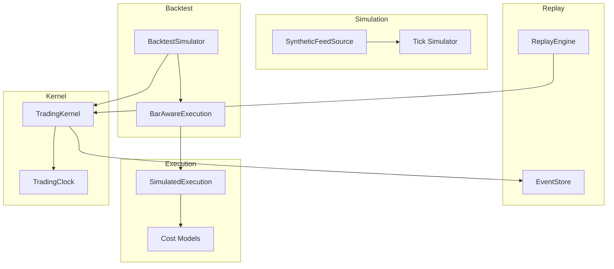

**Diagram sources**
- [simulator.py:58-113](file://ntrade/backtest/simulator.py#L58-L113)
- [fills.py:44-72](file://ntrade/backtest/fills.py#L44-L72)
- [tick_simulator.py:51-82](file://ntrade/sim/tick_simulator.py#L51-L82)
- [synthetic_feed.py:19-77](file://ntrade/sources/synthetic_feed.py#L19-L77)
- [replay_engine.py:14-24](file://ntrade/replay/replay_engine.py#L14-L24)
- [event_store.py:76-100](file://ntrade/storage/event_store.py#L76-L100)
- [simulator.py:43-147](file://ntrade/execution/simulator.py#L43-L147)
- [costs.py:70-200](file://ntrade/execution/costs.py#L70-L200)
- [clock.py:14-55](file://ntrade/kernel/clock.py#L14-L55)
- [session.py:38-101](file://ntrade/kernel/session.py#L38-L101)

**Section sources**
- [simulator.py:58-113](file://ntrade/backtest/simulator.py#L58-L113)
- [fills.py:16-72](file://ntrade/backtest/fills.py#L16-L72)
- [tick_simulator.py:20-82](file://ntrade/sim/tick_simulator.py#L20-L82)
- [synthetic_feed.py:19-77](file://ntrade/sources/synthetic_feed.py#L19-L77)
- [replay_engine.py:14-24](file://ntrade/replay/replay_engine.py#L14-L24)
- [event_store.py:76-100](file://ntrade/storage/event_store.py#L76-L100)
- [simulator.py:43-147](file://ntrade/execution/simulator.py#L43-L147)
- [costs.py:70-200](file://ntrade/execution/costs.py#L70-L200)
- [clock.py:14-55](file://ntrade/kernel/clock.py#L14-L55)
- [session.py:38-101](file://ntrade/kernel/session.py#L38-L101)

## Core Components
- BacktestSimulator: Drives a TradingKernel over an OHLCV DataFrame, publishing QuoteEvent and TickEvent per bar, applying futures carry/roll costs, and producing BacktestResult with equity curve and trade details.
- BarAwareExecution: Extends SimulatedExecution to enforce bar-aware limit fills using FillPolicy; MARKET orders behave identically to parent.
- Tick Simulator: Generates deterministic 1-second ticks from 1-minute OHLCV respecting open/close anchors, high/low bounds, and volume distribution.
- ReplayEngine: Replays an event stream through a TradingKernel with ReplayClock, ensuring identical decisions as live trading.
- EventStore: Append-only persistence of events to JSONL or memory; supports querying, reconstruction of open-order deltas, and causal recovery events.
- SyntheticMarketFeedSource: Converts 1m OHLCV into deterministic 1-second ticks and publishes QuoteEvent per bar; integrates seamlessly with kernel.
- SimulatedExecution: Deterministic fill pipeline with configurable slippage, commission, statutory charges, and delivery detection.
- Cost Models: SlippageModel, CommissionModel, IndianStatutoryCosts for accurate PnL convergence with live markets.
- Clock Abstraction: LiveClock, ReplayClock, SimulationClock ensure time determinism across modes.

**Section sources**
- [simulator.py:58-113](file://ntrade/backtest/simulator.py#L58-L113)
- [fills.py:16-72](file://ntrade/backtest/fills.py#L16-L72)
- [tick_simulator.py:51-82](file://ntrade/sim/tick_simulator.py#L51-L82)
- [replay_engine.py:14-24](file://ntrade/replay/replay_engine.py#L14-L24)
- [event_store.py:76-100](file://ntrade/storage/event_store.py#L76-L100)
- [synthetic_feed.py:19-77](file://ntrade/sources/synthetic_feed.py#L19-L77)
- [simulator.py:43-147](file://ntrade/execution/simulator.py#L43-L147)
- [costs.py:70-200](file://ntrade/execution/costs.py#L70-L200)
- [clock.py:14-55](file://ntrade/kernel/clock.py#L14-L55)

## Architecture Overview
Zero-parity is achieved by keeping the same TradingKernel + engine stack + execution target across live, replay, and backtest. Only the event source, clock, and execution target differ.

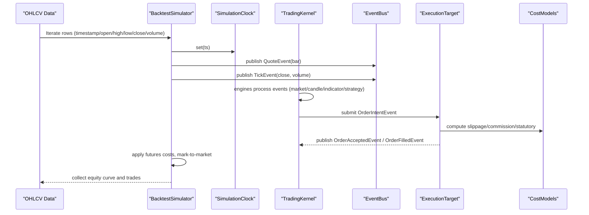

**Diagram sources**
- [simulator.py:116-143](file://ntrade/backtest/simulator.py#L116-L143)
- [session.py:133-145](file://ntrade/kernel/session.py#L133-L145)
- [simulator.py:72-147](file://ntrade/execution/simulator.py#L72-L147)
- [costs.py:164-174](file://ntrade/execution/costs.py#L164-L174)

## Detailed Component Analysis

### BacktestSimulator
- Initializes a TradingKernel in backtest mode with SimulationClock and optional custom instrument.
- Registers an ExecutionRouter with either BarAwareExecution (when fill_policy provided) or SimulatedExecution.
- For each bar, publishes QuoteEvent and TickEvent, applies futures carry/roll costs, and records equity curve.
- Results aggregate fills, commissions, statutory costs, futures costs, max drawdown, and total return.

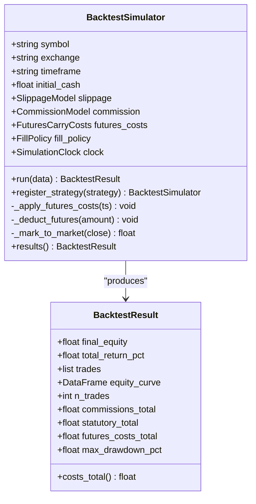

**Diagram sources**
- [simulator.py:29-56](file://ntrade/backtest/simulator.py#L29-L56)
- [simulator.py:58-113](file://ntrade/backtest/simulator.py#L58-L113)
- [simulator.py:194-219](file://ntrade/backtest/simulator.py#L194-L219)

**Section sources**
- [simulator.py:58-113](file://ntrade/backtest/simulator.py#L58-L113)
- [simulator.py:116-143](file://ntrade/backtest/simulator.py#L116-L143)
- [simulator.py:145-192](file://ntrade/backtest/simulator.py#L145-L192)
- [simulator.py:194-219](file://ntrade/backtest/simulator.py#L194-L219)

### BarAwareExecution and FillPolicy
- FillPolicy defines market_on behavior and limit_fill logic against bar OHLC.
- BarAwareExecution wraps SimulatedExecution to reject limit orders not touched by the bar and adjust fill price accordingly.

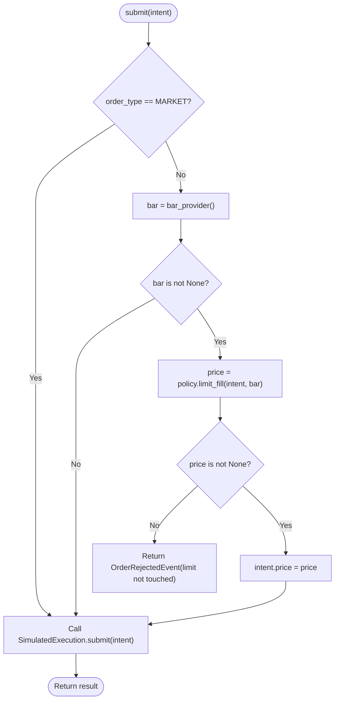

**Diagram sources**
- [fills.py:16-42](file://ntrade/backtest/fills.py#L16-L42)
- [fills.py:44-72](file://ntrade/backtest/fills.py#L44-L72)

**Section sources**
- [fills.py:16-42](file://ntrade/backtest/fills.py#L16-L42)
- [fills.py:44-72](file://ntrade/backtest/fills.py#L44-L72)

### Tick Simulator
- Generates deterministic 1-second ticks from 1-minute OHLCV with invariants:
  - One tick per second
  - First tick equals open, last equals close
  - All prices within [low, high]
  - Max/min equal high/low
  - Sum of quantities equals bar volume
  - Same seed yields identical ticks

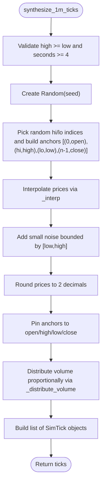

**Diagram sources**
- [tick_simulator.py:27-48](file://ntrade/sim/tick_simulator.py#L27-L48)
- [tick_simulator.py:51-82](file://ntrade/sim/tick_simulator.py#L51-L82)

**Section sources**
- [tick_simulator.py:51-82](file://ntrade/sim/tick_simulator.py#L51-L82)

### ReplayEngine
- Wraps a TradingKernel with ReplayClock to replay events deterministically.
- run(events, start=None) sets clock.start if provided and iterates events, setting clock to event.ts before publishing.

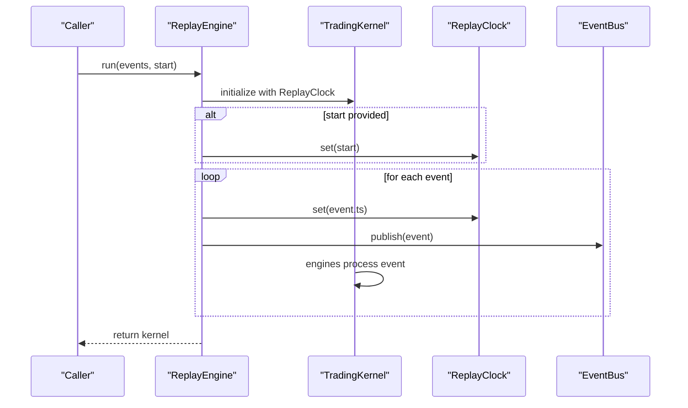

**Diagram sources**
- [replay_engine.py:14-24](file://ntrade/replay/replay_engine.py#L14-L24)
- [session.py:133-145](file://ntrade/kernel/session.py#L133-L145)
- [clock.py:31-47](file://ntrade/kernel/clock.py#L31-L47)

**Section sources**
- [replay_engine.py:14-24](file://ntrade/replay/replay_engine.py#L14-L24)
- [session.py:133-145](file://ntrade/kernel/session.py#L133-L145)

### EventStore
- Append-only storage of events with optional JSONL persistence.
- Supports querying by type/symbol, extracting market events, reconstructing open-order deltas, and providing causal recovery events sorted by timestamp and insertion order.

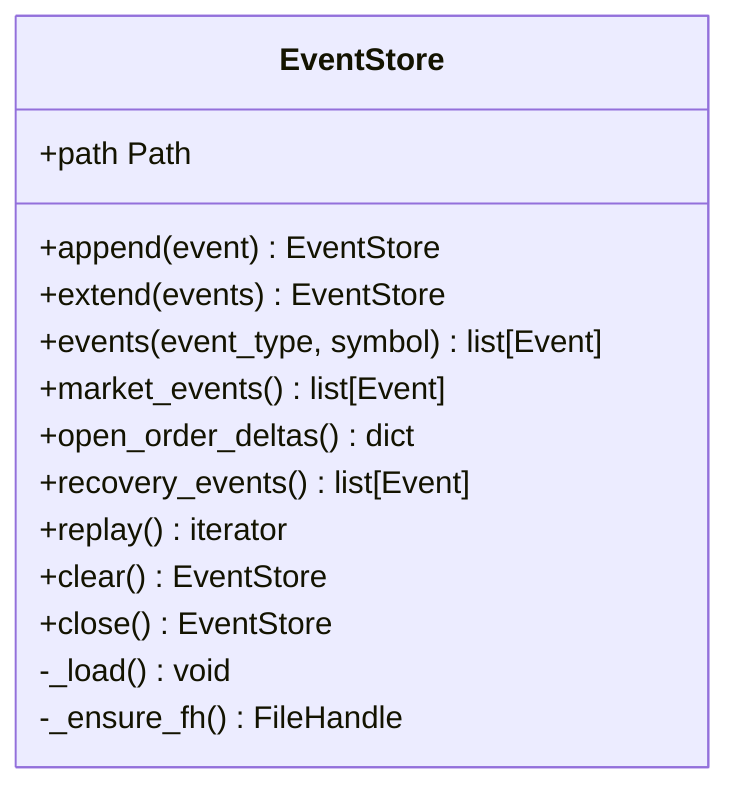

**Diagram sources**
- [event_store.py:76-100](file://ntrade/storage/event_store.py#L76-L100)
- [event_store.py:116-136](file://ntrade/storage/event_store.py#L116-L136)
- [event_store.py:137-181](file://ntrade/storage/event_store.py#L137-L181)
- [event_store.py:183-211](file://ntrade/storage/event_store.py#L183-L211)

**Section sources**
- [event_store.py:76-100](file://ntrade/storage/event_store.py#L76-L100)
- [event_store.py:116-136](file://ntrade/storage/event_store.py#L116-L136)
- [event_store.py:137-181](file://ntrade/storage/event_store.py#L137-L181)
- [event_store.py:183-211](file://ntrade/storage/event_store.py#L183-L211)

### SyntheticMarketFeedSource
- Converts 1m OHLCV into deterministic 1-second ticks using synthesize_1m_ticks.
- Publishes QuoteEvent per bar and TickEvent per simulated second; integrates with kernel clock.

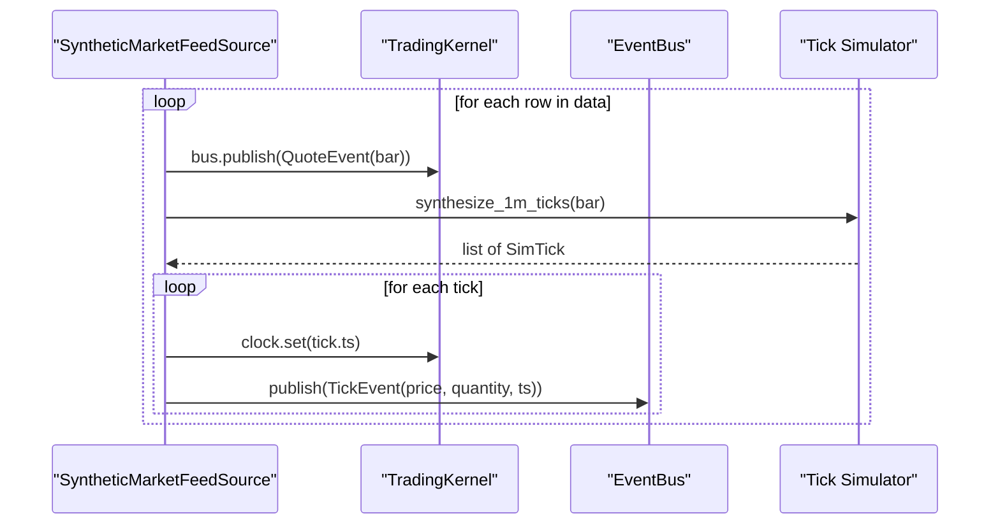

**Diagram sources**
- [synthetic_feed.py:52-77](file://ntrade/sources/synthetic_feed.py#L52-L77)
- [tick_simulator.py:51-82](file://ntrade/sim/tick_simulator.py#L51-L82)

**Section sources**
- [synthetic_feed.py:19-77](file://ntrade/sources/synthetic_feed.py#L19-L77)

### SimulatedExecution and Costs
- SimulatedExecution computes fill price, applies slippage/commission/statutory costs, handles delivery detection for equities, and publishes lifecycle events.
- Cost models include FixedSlippage, PercentageSlippage, FlatCommission, PercentageCommission, and IndianStatutoryCosts for comprehensive charge modeling.

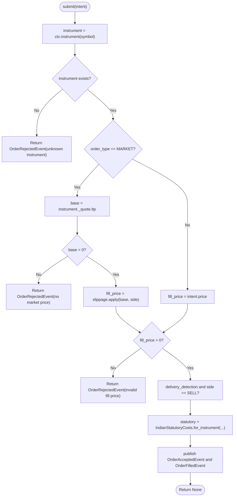

**Diagram sources**
- [simulator.py:72-147](file://ntrade/execution/simulator.py#L72-L147)
- [costs.py:164-174](file://ntrade/execution/costs.py#L164-L174)

**Section sources**
- [simulator.py:43-147](file://ntrade/execution/simulator.py#L43-L147)
- [costs.py:70-200](file://ntrade/execution/costs.py#L70-L200)

### Conceptual Overview
The zero-parity architecture ensures that the same strategy code runs identically across live, replay, and backtest modes by standardizing event types, clock behavior, and execution targets. Differences are limited to:
- Event source: live broker feed vs synthetic feed vs historical bars
- Clock: wall time vs deterministic replay/simulation clocks
- Execution target: real broker vs simulated execution with cost models

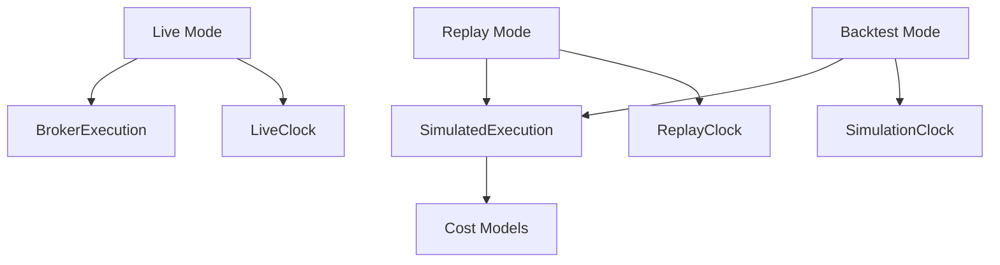

[No sources needed since this diagram shows conceptual workflow, not actual code structure]

## Dependency Analysis
Key dependencies and relationships:
- BacktestSimulator depends on TradingKernel, SimulationClock, ExecutionRouter, and either BarAwareExecution or SimulatedExecution.
- BarAwareExecution extends SimulatedExecution and uses FillPolicy and bar_provider.
- SyntheticMarketFeedSource depends on synthesize_1m_ticks and publishes QuoteEvent/TickEvent.
- ReplayEngine depends on TradingKernel and ReplayClock.
- EventStore persists all events and provides recovery utilities.
- SimulatedExecution relies on cost models and context for instrument state.

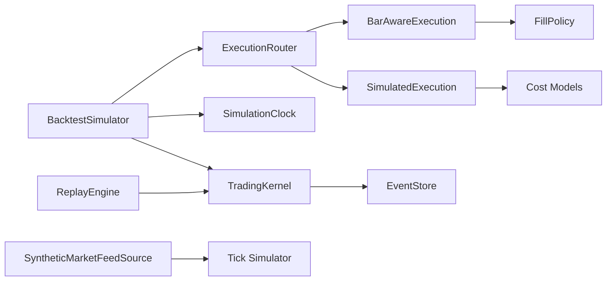

**Diagram sources**
- [simulator.py:58-113](file://ntrade/backtest/simulator.py#L58-L113)
- [fills.py:44-72](file://ntrade/backtest/fills.py#L44-L72)
- [synthetic_feed.py:19-77](file://ntrade/sources/synthetic_feed.py#L19-L77)
- [replay_engine.py:14-24](file://ntrade/replay/replay_engine.py#L14-L24)
- [event_store.py:76-100](file://ntrade/storage/event_store.py#L76-L100)
- [simulator.py:43-147](file://ntrade/execution/simulator.py#L43-L147)

**Section sources**
- [simulator.py:58-113](file://ntrade/backtest/simulator.py#L58-L113)
- [fills.py:44-72](file://ntrade/backtest/fills.py#L44-L72)
- [synthetic_feed.py:19-77](file://ntrade/sources/synthetic_feed.py#L19-L77)
- [replay_engine.py:14-24](file://ntrade/replay/replay_engine.py#L14-L24)
- [event_store.py:76-100](file://ntrade/storage/event_store.py#L76-L100)
- [simulator.py:43-147](file://ntrade/execution/simulator.py#L43-L147)

## Performance Considerations
- Large-scale backtests:
  - Use SimulationClock speed factor to accelerate time progression.
  - Prefer vectorized OHLCV processing where possible; avoid excessive Python loops inside strategies.
  - Disable unnecessary event recording when not needed for debugging.
- Memory management:
  - EventStore can grow large; use path-based JSONL persistence and clear/close after use.
  - Limit history retention in EventBus if long-running sessions.
- Result analysis:
  - BacktestResult includes equity curve, trade list, and aggregated costs; compute additional metrics (Sharpe, Sortino) externally.
  - Use market_events() and recovery_events() for focused analysis and debugging.

[No sources needed since this section provides general guidance]

## Troubleshooting Guide
Common issues and resolutions:
- Invalid OHLCV input: Ensure non-empty DataFrame with required columns (timestamp, open, high, low, close, volume).
- Limit orders not filled: Verify bar touches limit price according to FillPolicy rules; check bar provider returns correct current bar.
- Determinism failures: Confirm consistent seed usage in tick simulator and avoid non-deterministic operations in strategies.
- Recording discrepancies: Use EventStore.market_events() for replay to avoid double-applying derived events; ensure causal ordering in recovery_events().

**Section sources**
- [simulator.py:116-120](file://ntrade/backtest/simulator.py#L116-L120)
- [fills.py:28-42](file://ntrade/backtest/fills.py#L28-L42)
- [tick_simulator.py:51-58](file://ntrade/sim/tick_simulator.py#L51-L58)
- [event_store.py:116-136](file://ntrade/storage/event_store.py#L116-L136)
- [event_store.py:183-211](file://ntrade/storage/event_store.py#L183-L211)

## Conclusion
The backtesting and simulation framework achieves zero-parity across live, replay, and backtest modes by standardizing event handling, clock abstraction, and execution targets. With deterministic tick generation, realistic fill policies, comprehensive cost modeling, and robust event persistence, it enables reliable strategy validation and performance analysis. Proper configuration of fill models, recording, and performance tuning ensures scalability and accuracy for large-scale simulations.

[No sources needed since this section summarizes without analyzing specific files]