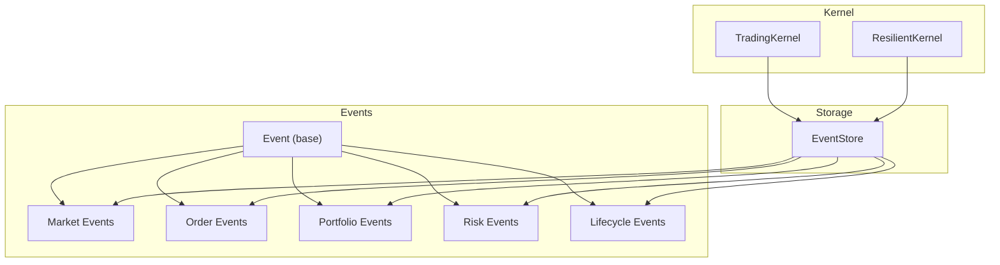
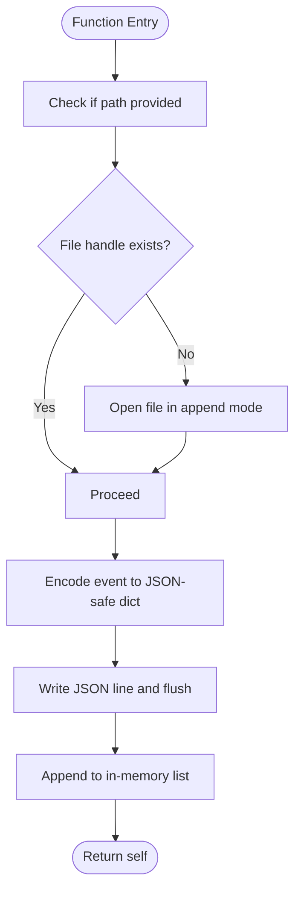
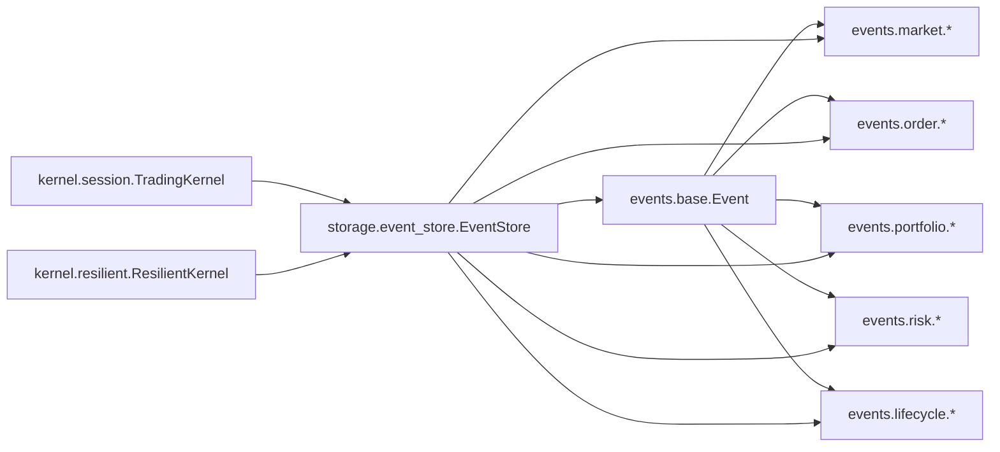

# Event Storage

<cite>
**Referenced Files in This Document**
- [event_store.py](file://ntrade/storage/event_store.py)
- [base.py](file://ntrade/events/base.py)
- [market.py](file://ntrade/events/market.py)
- [order.py](file://ntrade/events/order.py)
- [portfolio.py](file://ntrade/events/portfolio.py)
- [risk.py](file://ntrade/events/risk.py)
- [lifecycle.py](file://ntrade/events/lifecycle.py)
- [session.py](file://ntrade/kernel/session.py)
- [resilient.py](file://ntrade/kernel/resilient.py)
- [test_kernel_recording.py](file://tests/test_kernel_recording.py)
- [test_hardening_regression.py](file://tests/test_hardening_regression.py)
</cite>

## Table of Contents
1. [Introduction](#introduction)
2. [Project Structure](#project-structure)
3. [Core Components](#core-components)
4. [Architecture Overview](#architecture-overview)
5. [Detailed Component Analysis](#detailed-component-analysis)
6. [Dependency Analysis](#dependency-analysis)
7. [Performance Considerations](#performance-considerations)
8. [Troubleshooting Guide](#troubleshooting-guide)
9. [Conclusion](#conclusion)
10. [Appendices](#appendices)

## Introduction
This document provides comprehensive documentation for the EventStore component, which implements append-only event persistence for audit trails and crash recovery. It covers the event serialization format, storage backends, indexing strategies, and query APIs. It also explains how events are structured with timestamps and metadata to enable complete market session reconstruction, including examples for live recording, historical querying, and custom backend implementation. Finally, it outlines schema evolution and migration considerations for long-term compatibility.

## Project Structure
The EventStore is part of the nTrade storage subsystem and integrates tightly with the kernel’s event bus and trading lifecycle. The core files involved include:
- Event model definitions (base and domain-specific events)
- EventStore implementation and JSONL persistence
- Kernel wiring that subscribes all events to the store
- ResilientKernel that uses EventStore for deterministic crash recovery



**Diagram sources**
- [event_store.py:76-235](file://ntrade/storage/event_store.py#L76-L235)
- [base.py:16-22](file://ntrade/events/base.py#L16-L22)
- [market.py:11-83](file://ntrade/events/market.py#L11-L83)
- [order.py:11-91](file://ntrade/events/order.py#L11-L91)
- [portfolio.py:11-27](file://ntrade/events/portfolio.py#L11-L27)
- [risk.py:11-52](file://ntrade/events/risk.py#L11-L52)
- [lifecycle.py:11-57](file://ntrade/events/lifecycle.py#L11-L57)
- [session.py:71-77](file://ntrade/kernel/session.py#L71-L77)
- [resilient.py:17-78](file://ntrade/kernel/resilient.py#L17-L78)

**Section sources**
- [event_store.py:1-236](file://ntrade/storage/event_store.py#L1-L236)
- [base.py:1-22](file://ntrade/events/base.py#L1-L22)
- [session.py:71-77](file://ntrade/kernel/session.py#L71-L77)
- [resilient.py:17-78](file://ntrade/kernel/resilient.py#L17-L78)

## Core Components
- Event base class defines immutable, timestamped events used across the system.
- Domain-specific event types extend the base for market data, orders, portfolio changes, risk signals, and lifecycle milestones.
- EventStore provides append-only persistence to an in-memory list and optional JSONL file, with encoding/decoding helpers and query methods.
- TradingKernel wires the event bus to subscribe all events to the store for full auditability.
- ResilientKernel leverages EventStore to deterministically rebuild state after a crash by replaying only causal events.

Key responsibilities:
- Deterministic ordering via timestamps and append sequence
- Append-only JSONL persistence with flush-on-write
- Query APIs for filtering by type and symbol
- Recovery utilities for open-order deltas and causal event streams

**Section sources**
- [base.py:16-22](file://ntrade/events/base.py#L16-L22)
- [market.py:11-83](file://ntrade/events/market.py#L11-L83)
- [order.py:11-91](file://ntrade/events/order.py#L11-L91)
- [portfolio.py:11-27](file://ntrade/events/portfolio.py#L11-L27)
- [risk.py:11-52](file://ntrade/events/risk.py#L11-L52)
- [lifecycle.py:11-57](file://ntrade/events/lifecycle.py#L11-L57)
- [event_store.py:76-235](file://ntrade/storage/event_store.py#L76-L235)
- [session.py:71-77](file://ntrade/kernel/session.py#L71-L77)
- [resilient.py:43-78](file://ntrade/kernel/resilient.py#L43-L78)

## Architecture Overview
The EventStore sits between the kernel’s event bus and persistent storage. All events published through the bus are appended to the store. For crash recovery, the resilient kernel replays a curated subset of events (market data and fills) to reconstruct state deterministically without re-trading.

```mermaid
sequenceDiagram
participant Bus as "EventBus"
participant Kernel as "TradingKernel"
participant Store as "EventStore"
participant File as "JSONL File"
participant Resilient as "ResilientKernel"
Bus->>Kernel : publish(Event)
Kernel->>Store : append(event)
Store->>File : write(JSON line)
Note over Store,File : Append-only, flush on write
Resilient->>Store : recovery_events()
Store-->>Resilient : sorted(market + fills)
Resilient->>Kernel : run_replay(events)
Kernel->>Bus : publish(event)
Note over Kernel,Bus : Derived events recomputed; no double-application
```

**Diagram sources**
- [session.py:116-117](file://ntrade/kernel/session.py#L116-L117)
- [event_store.py:89-99](file://ntrade/storage/event_store.py#L89-L99)
- [event_store.py:183-210](file://ntrade/storage/event_store.py#L183-L210)
- [resilient.py:43-78](file://ntrade/kernel/resilient.py#L43-L78)

## Detailed Component Analysis

### Event Model and Schema
- Base Event includes a deterministic timestamp from the TradingClock and a unique identifier.
- Market events capture ticks, quotes, depth snapshots, and derived indicators/candles.
- Order events cover intent, acceptance, rejection, fill, updates, and timeouts.
- Portfolio events reflect position and balance changes.
- Risk events represent signal generation/approval/rejection and circuit breaker states.
- Lifecycle events mark kernel and session boundaries and health heartbeats.

```mermaid
classDiagram
class Event {
+datetime ts
+string event_id
}
class TickEvent {
+string symbol
+string exchange
+float price
+int quantity
+string side
+string kind
}
class QuoteEvent {
+string symbol
+string exchange
+float ltp
+float bid
+float ask
+float open
+float high
+float low
+float prev_close
+int volume
+int oi
}
class DepthEvent {
+string symbol
+string exchange
+tuple bids
+tuple asks
}
class CandleClosedEvent {
+string symbol
+string exchange
+string timeframe
+float open
+float high
+float low
+float close
+int volume
}
class IndicatorUpdatedEvent {
+string symbol
+string exchange
+string timeframe
+dict indicators
}
class OrderIntentEvent {
+string symbol
+string exchange
+string side
+int quantity
+string order_type
+float price
+string strategy
}
class OrderAcceptedEvent {
+string order_id
+string symbol
+string exchange
+string side
+int quantity
+string strategy
}
class OrderRejectedEvent {
+string order_id
+string symbol
+string exchange
+string side
+int quantity
+string reason
+string strategy
}
class OrderFilledEvent {
+string order_id
+string symbol
+string exchange
+string side
+int quantity
+float fill_price
+float commission
+float statutory
+string strategy
}
class OrderUpdatedEvent {
+string order_id
+string symbol
+string exchange
+string side
+string status
+int filled_qty
+float avg_price
+string strategy
}
class PositionUpdatedEvent {
+string symbol
+string exchange
+int quantity
+float avg_price
+float ltp
}
class BalanceChangedEvent {
+float balance
}
class SignalGeneratedEvent {
+string symbol
+string exchange
+string side
+int quantity
+float price
+string strategy
+dict metadata
}
class SignalApprovedEvent {
+SignalGeneratedEvent signal
}
class SignalRejectedEvent {
+SignalGeneratedEvent signal
+string reason
}
class KernelStartedEvent {
+string mode
}
class SessionStartedEvent {
+string session_id
}
class SessionStoppedEvent {
+string session_id
+string reason
}
Event <|-- TickEvent
Event <|-- QuoteEvent
Event <|-- DepthEvent
Event <|-- CandleClosedEvent
Event <|-- IndicatorUpdatedEvent
Event <|-- OrderIntentEvent
Event <|-- OrderAcceptedEvent
Event <|-- OrderRejectedEvent
Event <|-- OrderFilledEvent
Event <|-- OrderUpdatedEvent
Event <|-- PositionUpdatedEvent
Event <|-- BalanceChangedEvent
Event <|-- SignalGeneratedEvent
Event <|-- SignalApprovedEvent
Event <|-- SignalRejectedEvent
Event <|-- KernelStartedEvent
Event <|-- SessionStartedEvent
Event <|-- SessionStoppedEvent
```



**Diagram sources**
- [base.py:16-22](file://ntrade/events/base.py#L16-L22)
- [market.py:11-83](file://ntrade/events/market.py#L11-L83)
- [order.py:11-91](file://ntrade/events/order.py#L11-L91)
- [portfolio.py:11-27](file://ntrade/events/portfolio.py#L11-L27)
- [risk.py:11-52](file://ntrade/events/risk.py#L11-L52)
- [lifecycle.py:11-57](file://ntrade/events/lifecycle.py#L11-L57)

**Section sources**
- [base.py:16-22](file://ntrade/events/base.py#L16-L22)
- [market.py:11-83](file://ntrade/events/market.py#L11-L83)
- [order.py:11-91](file://ntrade/events/order.py#L11-L91)
- [portfolio.py:11-27](file://ntrade/events/portfolio.py#L11-L27)
- [risk.py:11-52](file://ntrade/events/risk.py#L11-L52)
- [lifecycle.py:11-57](file://ntrade/events/lifecycle.py#L11-L57)

### EventStore Implementation
- Append-only API: append(event), extend(events)
- Persistence: optional JSONL file path; writes one JSON object per line with flush
- Serialization: encodes nested events recursively; handles datetime conversion
- Deserialization: reconstructs events using registered type map; unknown types skipped gracefully
- Querying: events(event_type, symbol), market_events(), replay()
- Recovery: recovery_events() returns causally ordered market + fills; open_order_deltas() reconstructs partial-fill state



**Diagram sources**
- [event_store.py:84-99](file://ntrade/storage/event_store.py#L84-L99)
- [event_store.py:51-57](file://ntrade/storage/event_store.py#L51-L57)

**Section sources**
- [event_store.py:76-235](file://ntrade/storage/event_store.py#L76-L235)

### Kernel Integration and Crash Recovery
- TradingKernel subscribes all events to the store for full auditability.
- ResilientKernel uses EventStore to recover state deterministically:
  - Replays only causal events (market data + fills)
  - Recomputes derived events (signals, candles, indicators)
  - Rebuilds open-order deltas to resume partial fills correctly
  - Ensures execution sequence numbers do not collide with recovered IDs

```mermaid
sequenceDiagram
participant Store as "EventStore"
participant Resilient as "ResilientKernel"
participant Kernel as "TradingKernel"
participant Bus as "EventBus"
Resilient->>Store : recovery_events()
Store-->>Resilient : sorted(market + fills)
Resilient->>Kernel : run_replay(events)
Kernel->>Bus : publish(event)
Note over Kernel,Bus : Derived events recomputed; no re-trading
Resilient->>Store : open_order_deltas()
Store-->>Resilient : per-order delta map
Resilient->>Kernel : restore_open_orders(deltas)
```

**Diagram sources**
- [resilient.py:43-78](file://ntrade/kernel/resilient.py#L43-L78)
- [resilient.py:105-122](file://ntrade/kernel/resilient.py#L105-L122)
- [event_store.py:183-210](file://ntrade/storage/event_store.py#L183-L210)
- [event_store.py:137-181](file://ntrade/storage/event_store.py#L137-L181)
- [session.py:133-145](file://ntrade/kernel/session.py#L133-L145)

**Section sources**
- [session.py:71-77](file://ntrade/kernel/session.py#L71-L77)
- [resilient.py:43-78](file://ntrade/kernel/resilient.py#L43-L78)
- [resilient.py:105-122](file://ntrade/kernel/resilient.py#L105-L122)

### Usage Examples and Patterns
- Recording live sessions:
  - Create an EventStore instance (optionally with a JSONL path)
  - Pass it to TradingKernel constructor; all events will be recorded
  - Replay only market events to reproduce identical behavior
- Querying historical events:
  - Use events(event_type, symbol) to filter by type or symbol
  - Use market_events() to get only causal market data
  - Use replay() to iterate chronologically
- Custom storage backend:
  - Implement a class with append(event) and extend(events) semantics
  - Optionally implement persistence and deserialization compatible with EventStore’s expectations
  - Integrate by substituting the store passed to TradingKernel

**Section sources**
- [test_kernel_recording.py:41-94](file://tests/test_kernel_recording.py#L41-L94)
- [event_store.py:116-124](file://ntrade/storage/event_store.py#L116-L124)
- [event_store.py:126-135](file://ntrade/storage/event_store.py#L126-L135)
- [event_store.py:212-214](file://ntrade/storage/event_store.py#L212-L214)

## Dependency Analysis
EventStore depends on event types for serialization/deserialization and is integrated into the kernel’s event bus. ResilientKernel depends on EventStore for recovery.



**Diagram sources**
- [event_store.py:18-29](file://ntrade/storage/event_store.py#L18-L29)
- [session.py:71-77](file://ntrade/kernel/session.py#L71-L77)
- [resilient.py:14-38](file://ntrade/kernel/resilient.py#L14-L38)

**Section sources**
- [event_store.py:18-29](file://ntrade/storage/event_store.py#L18-L29)
- [session.py:71-77](file://ntrade/kernel/session.py#L71-L77)
- [resilient.py:14-38](file://ntrade/kernel/resilient.py#L14-L38)

## Performance Considerations
- Append-only JSONL writes ensure durability with minimal overhead; each append flushes to disk.
- In-memory list maintains O(1) appends; queries are linear scans, suitable for moderate datasets.
- Causal ordering uses timestamp plus append index to avoid inversion when timestamps tie.
- Recovery stream filters to market and fill events to minimize replay cost.
- Potential optimizations:
  - Batch writes with periodic flushing to reduce I/O frequency
  - Partitioning by symbol or date to improve query locality
  - Compression for archival storage (e.g., gzip per day)
  - Indexing structures for symbol/type lookups if large-scale analytics are required

[No sources needed since this section provides general guidance]

## Troubleshooting Guide
- Unknown event types during deserialization:
  - EventStore._decode skips unknown types gracefully; ensure all event classes are imported before loading
- Causal ordering issues:
  - Verify append order matches intended causality; recovery_events sorts by timestamp then append index
- Memory growth:
  - EventStore holds all events in memory; consider periodic clearing or partitioned stores for long sessions
- Crash recovery mismatches:
  - Ensure recovery runs before registering strategies to avoid re-trading
  - Confirm open-order deltas are rebuilt to resume partial fills correctly

**Section sources**
- [event_store.py:60-73](file://ntrade/storage/event_store.py#L60-L73)
- [event_store.py:183-210](file://ntrade/storage/event_store.py#L183-L210)
- [resilient.py:43-78](file://ntrade/kernel/resilient.py#L43-L78)
- [test_hardening_regression.py:25-50](file://tests/test_hardening_regression.py#L25-L50)

## Conclusion
EventStore provides a robust, append-only event persistence layer tailored for audit trails and deterministic crash recovery in trading systems. Its integration with the kernel ensures full observability, while its recovery utilities enable precise state reconstruction. With careful attention to ordering, serialization, and performance, EventStore supports reliable live operations and accurate historical analysis.

[No sources needed since this section summarizes without analyzing specific files]

## Appendices

### Event Stream API Reference
- append(event): Add a single event to the store
- extend(events): Add multiple events
- events(event_type=None, symbol=None): Filter events by type and/or symbol
- market_events(): Retrieve only causal market data events
- recovery_events(): Get causally ordered market + fills for crash recovery
- open_order_deltas(): Reconstruct partial-fill state for open orders
- replay(): Iterate events in chronological order
- clear(): Reset in-memory state and remove persisted file
- close(): Close any open file handles

**Section sources**
- [event_store.py:89-104](file://ntrade/storage/event_store.py#L89-L104)
- [event_store.py:116-124](file://ntrade/storage/event_store.py#L116-L124)
- [event_store.py:126-135](file://ntrade/storage/event_store.py#L126-L135)
- [event_store.py:137-181](file://ntrade/storage/event_store.py#L137-L181)
- [event_store.py:183-210](file://ntrade/storage/event_store.py#L183-L210)
- [event_store.py:212-214](file://ntrade/storage/event_store.py#L212-L214)
- [event_store.py:216-229](file://ntrade/storage/event_store.py#L216-L229)

### Storage Backend Options
- In-memory only: No path provided; events retained in process memory
- JSONL file: Path provided; events persisted line-by-line with UTF-8 encoding
- Custom backend: Implement append/extend semantics and integrate with kernel/store

**Section sources**
- [event_store.py:76-87](file://ntrade/storage/event_store.py#L76-L87)
- [event_store.py:106-113](file://ntrade/storage/event_store.py#L106-L113)

### Schema Evolution and Migration
- Type registration: Event types are discovered at import time; ensure imports occur before loading stored events
- Backward compatibility: Unknown types are skipped; design migrations to preserve older records
- Versioning strategy: Include version fields in event payloads where necessary; validate during decode
- Migration procedure:
  - Add new fields with defaults
  - Provide decode-time transformations for legacy formats
  - Validate reconstructed events against expected schemas

**Section sources**
- [event_store.py:18-29](file://ntrade/storage/event_store.py#L18-L29)
- [event_store.py:60-73](file://ntrade/storage/event_store.py#L60-L73)