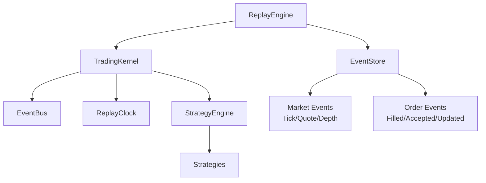
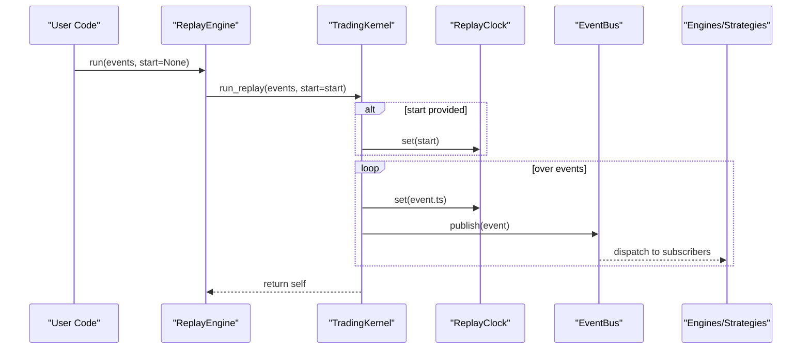
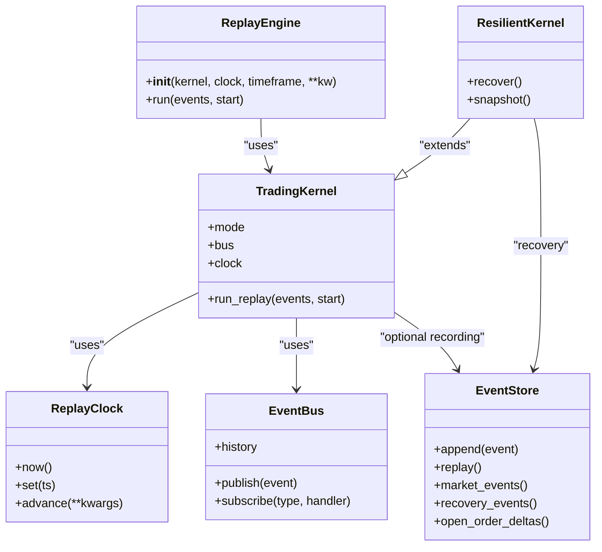

# Replay Engine

<cite>
**Referenced Files in This Document**
- [replay_engine.py](file://ntrade/replay/replay_engine.py)
- [event_store.py](file://ntrade/storage/event_store.py)
- [clock.py](file://ntrade/kernel/clock.py)
- [session.py](file://ntrade/kernel/session.py)
- [event_bus.py](file://ntrade/kernel/event_bus.py)
- [base.py](file://ntrade/events/base.py)
- [market.py](file://ntrade/events/market.py)
- [order.py](file://ntrade/events/order.py)
- [strategy_engine.py](file://ntrade/engines/strategy_engine.py)
- [resilient.py](file://ntrade/kernel/resilient.py)
- [test_replay_backtest.py](file://tests/test_replay_backtest.py)
- [test_kernel_recording.py](file://tests/test_kernel_recording.py)
</cite>

## Table of Contents
1. [Introduction](#introduction)
2. [Project Structure](#project-structure)
3. [Core Components](#core-components)
4. [Architecture Overview](#architecture-overview)
5. [Detailed Component Analysis](#detailed-component-analysis)
6. [Dependency Analysis](#dependency-analysis)
7. [Performance Considerations](#performance-considerations)
8. [Troubleshooting Guide](#troubleshooting-guide)
9. [Conclusion](#conclusion)
10. [Appendices](#appendices)

## Introduction
This document explains the ReplayEngine component and its role in deterministically replaying recorded market sessions through the trading kernel. The engine ensures that strategies execute identically during replay as they did in live trading by using a deterministic clock, strict event ordering, and state restoration mechanisms. It integrates with the EventStore for loading stored events, the TradingKernel for orchestration, and the EventBus for safe dispatch. The documentation covers time synchronization, event sequencing, speed control, pause/resume concepts, selective filtering, debugging capabilities, and examples for recording and analyzing replay results.

## Project Structure
The replay subsystem is centered around three core modules:
- ReplayEngine: thin orchestrator that wires a ReplayClock and TradingKernel to run an event stream.
- EventStore: append-only, JSONL-backed store of events with chronological iteration and causal recovery streams.
- TradingKernel: central coordinator that publishes events through the EventBus and drives engines; includes run_replay to feed events deterministically.

**Diagram sources**
- [replay_engine.py:14-23](file://ntrade/replay/replay_engine.py#L14-L23)
- [session.py:38-145](file://ntrade/kernel/session.py#L38-L145)
- [event_store.py:76-214](file://ntrade/storage/event_store.py#L76-L214)
- [clock.py:31-47](file://ntrade/kernel/clock.py#L31-L47)
- [strategy_engine.py:48-102](file://ntrade/engines/strategy_engine.py#L48-L102)

**Section sources**
- [replay_engine.py:1-23](file://ntrade/replay/replay_engine.py#L1-L23)
- [event_store.py:1-236](file://ntrade/storage/event_store.py#L1-L236)
- [session.py:1-198](file://ntrade/kernel/session.py#L1-L198)

## Core Components
- ReplayEngine: constructs or accepts a TradingKernel configured with a ReplayClock and delegates event replay via run_replay.
- EventStore: records all events (optionally persisted to JSONL), provides chronological iteration, market-only filters, and causal recovery sequences.
- TradingKernel: initializes engines, wires the EventBus, supports run_replay to set the clock per event timestamp and publish events deterministically.
- ReplayClock: deterministic clock driven by event timestamps; supports setting and advancing time.
- EventBus: thread-safe pub/sub bus with history and serialized dispatch to ensure consistent state updates.

Key behaviors:
- Deterministic time: strategies never call wall-clock functions; they use the kernel’s clock.
- Zero-parity: same event stream yields identical decisions across live, replay, and backtest modes.
- Causal ordering: recovery uses market data plus fills sorted by timestamp and original append order to preserve causality.

**Section sources**
- [replay_engine.py:14-23](file://ntrade/replay/replay_engine.py#L14-L23)
- [event_store.py:76-214](file://ntrade/storage/event_store.py#L76-L214)
- [session.py:132-145](file://ntrade/kernel/session.py#L132-L145)
- [clock.py:31-47](file://ntrade/kernel/clock.py#L31-L47)
- [event_bus.py:24-81](file://ntrade/kernel/event_bus.py#L24-L81)

## Architecture Overview
The replay flow ensures exact timing and event ordering:
- ReplayEngine creates or receives a TradingKernel with a ReplayClock.
- An iterable of events (typically from EventStore.replay() or EventStore.market_events()) is fed into TradingKernel.run_replay().
- For each event, the ReplayClock is set to the event’s timestamp, then the event is published to the EventBus.
- Engines and strategies react deterministically to these events, producing identical outcomes as live trading.

**Diagram sources**
- [replay_engine.py:21-23](file://ntrade/replay/replay_engine.py#L21-L23)
- [session.py:133-145](file://ntrade/kernel/session.py#L133-L145)
- [clock.py:31-47](file://ntrade/kernel/clock.py#L31-L47)
- [event_bus.py:47-66](file://ntrade/kernel/event_bus.py#L47-L66)

## Detailed Component Analysis

### ReplayEngine
Responsibilities:
- Owns a ReplayClock and a TradingKernel configured for replay mode.
- Exposes run(events, start=None) to drive the kernel with an event stream.

Design notes:
- Minimal wrapper around TradingKernel.run_replay; keeps replay usage simple and consistent.
- Accepts timeframe and other kwargs passed to the kernel.

Usage patterns:
- Create a ReplayEngine, register instruments and strategies on engine.kernel, then call run with an event iterator.

**Section sources**
- [replay_engine.py:14-23](file://ntrade/replay/replay_engine.py#L14-L23)

### EventStore
Responsibilities:
- Append-only storage of immutable events with optional JSONL persistence.
- Provides:
  - replay(): chronological iteration by timestamp.
  - market_events(): only causal market events (Tick/Quote/Depth).
  - recovery_events(): causal stream of market + fills, sorted by timestamp and original append index to preserve causality.
  - open_order_deltas(): reconstruct partial-fill deltas for crash recovery.

Determinism guarantees:
- All events carry ts from the TradingClock; no wall-clock calls.
- JSON serialization preserves nested event structures and datetime fields.

Filtering and selection:
- events(event_type=None, symbol=None) allows selective retrieval.
- market_events() excludes derived events to avoid double-application during replay.

**Section sources**
- [event_store.py:76-214](file://ntrade/storage/event_store.py#L76-L214)
- [base.py:16-22](file://ntrade/events/base.py#L16-L22)
- [market.py:11-83](file://ntrade/events/market.py#L11-L83)
- [order.py:11-91](file://ntrade/events/order.py#L11-L91)

### TradingKernel (run_replay)
Responsibilities:
- Wires engines, registers strategies, manages lifecycle events, and exposes run_replay.
- During run_replay:
  - Optionally sets initial clock time.
  - Iterates events, sets the ReplayClock to each event’s timestamp, and publishes to the EventBus.

Integration points:
- Optional EventStore subscription records every published event for audit and replay.
- Execution target can be simulated or broker-backed; replay works identically due to deterministic clock.

**Section sources**
- [session.py:38-145](file://ntrade/kernel/session.py#L38-L145)

### ReplayClock
Responsibilities:
- Deterministic time source used by all components.
- Supports set(ts) and advance(**kwargs) to manipulate time precisely.

Role in replay:
- Ensures strategies see event timestamps rather than wall time, guaranteeing parity.

**Section sources**
- [clock.py:31-47](file://ntrade/kernel/clock.py#L31-L47)

### EventBus
Responsibilities:
- Synchronous, thread-safe pub/sub with serialized dispatch.
- Maintains limited history for inspection and debugging.

Relevance to replay:
- Guarantees consistent handler execution order and prevents mid-dispatch state corruption.

**Section sources**
- [event_bus.py:24-81](file://ntrade/kernel/event_bus.py#L24-L81)

### ResilientKernel (crash recovery)
Responsibilities:
- Extends TradingKernel to rebuild state from EventStore after a crash without re-trading.
- Uses recovery_events() to replay only causal market and fill events, then reseeds execution sequence and restores open-order deltas.

Why it matters for replay:
- Demonstrates how the same event stream produces identical state reconstruction and avoids double-applying derived events.

**Section sources**
- [resilient.py:17-147](file://ntrade/kernel/resilient.py#L17-L147)

### StrategyEngine and Strategies
Responsibilities:
- Dispatches kernel events to registered strategies via hooks (on_tick, on_candle_closed, etc.).
- Strategies emit signals which are processed downstream (risk, orders, execution).

Replay impact:
- Since events and timestamps are deterministic, strategy behavior is identical across live and replay.

**Section sources**
- [strategy_engine.py:48-102](file://ntrade/engines/strategy_engine.py#L48-L102)

## Dependency Analysis
High-level dependencies:
- ReplayEngine depends on TradingKernel and ReplayClock.
- TradingKernel depends on EventBus, engines, and optionally EventStore.
- EventStore depends on event types and JSON serialization utilities.
- ResilientKernel extends TradingKernel and relies on EventStore for recovery.

**Diagram sources**
- [replay_engine.py:14-23](file://ntrade/replay/replay_engine.py#L14-L23)
- [session.py:38-145](file://ntrade/kernel/session.py#L38-L145)
- [clock.py:31-47](file://ntrade/kernel/clock.py#L31-L47)
- [event_store.py:76-214](file://ntrade/storage/event_store.py#L76-L214)
- [event_bus.py:24-81](file://ntrade/kernel/event_bus.py#L24-L81)
- [resilient.py:17-147](file://ntrade/kernel/resilient.py#L17-L147)

**Section sources**
- [replay_engine.py:14-23](file://ntrade/replay/replay_engine.py#L14-L23)
- [session.py:38-145](file://ntrade/kernel/session.py#L38-L145)
- [event_store.py:76-214](file://ntrade/storage/event_store.py#L76-L214)
- [clock.py:31-47](file://ntrade/kernel/clock.py#L31-L47)
- [event_bus.py:24-81](file://ntrade/kernel/event_bus.py#L24-L81)
- [resilient.py:17-147](file://ntrade/kernel/resilient.py#L17-L147)

## Performance Considerations
- EventStore.append writes to JSONL file handle lazily; flush occurs per append. For large sessions, consider batching or periodic flush strategies if needed.
- EventStore.recovery_events sorts by timestamp and original index; this is O(n log n) but ensures causality.
- EventBus maintains a bounded history deque; keep max_history reasonable to limit memory usage.
- Replay loop is synchronous; CPU-bound handlers will block subsequent events. Offload heavy work to separate threads or async tasks outside the bus dispatch.

[No sources needed since this section provides general guidance]

## Troubleshooting Guide
Common issues and resolutions:
- Unknown event types in JSONL: EventStore._load skips unknown __type__ entries gracefully. Ensure event type registration matches loaded files.
- Causality inversion: Use EventStore.recovery_events() which sorts by timestamp and original append order to maintain correct cause-effect sequence.
- Double-application of derived events: Always replay market_events() or recovery_events(), not derived events like signals or candle updates.
- Crash recovery errors: ResilientKernel.recover() must be called before registering strategies; otherwise, it raises a runtime error to prevent re-trading.
- Order ID collisions after recovery: ResilientKernel._reseed_execution bumps simulated execution sequence counters based on recovered fills.

Debugging tips:
- Inspect EventBus.history to review published events in order.
- Use EventStore.events(event_type, symbol) to filter and inspect specific events.
- Validate clock progression by checking ReplayClock.now() after replay steps.

**Section sources**
- [event_store.py:106-114](file://ntrade/storage/event_store.py#L106-L114)
- [event_store.py:183-214](file://ntrade/storage/event_store.py#L183-L214)
- [resilient.py:43-78](file://ntrade/kernel/resilient.py#L43-L78)
- [event_bus.py:68-71](file://ntrade/kernel/event_bus.py#L68-L71)

## Conclusion
The ReplayEngine, together with EventStore, TradingKernel, and ReplayClock, provides a robust, deterministic replay mechanism that mirrors live trading exactly. By enforcing strict event ordering, deterministic time, and careful separation of causal vs derived events, it enables reliable testing, debugging, and crash recovery. The integration with the EventBus ensures safe, consistent dispatch to engines and strategies, while ResilientKernel adds crash resilience by rebuilding state from recorded events without re-trading.

[No sources needed since this section summarizes without analyzing specific files]

## Appendices

### Recording Live Sessions
- Initialize a TradingKernel with an EventStore to record all events.
- Register instruments and strategies, then run_replay with your event stream.
- Persist the EventStore to JSONL for later replay.

Example references:
- Recording and replay equivalence tests demonstrate capturing and reproducing fills.

**Section sources**
- [test_kernel_recording.py:41-51](file://tests/test_kernel_recording.py#L41-L51)
- [test_kernel_recording.py:64-82](file://tests/test_kernel_recording.py#L64-L82)

### Configuring Replay Parameters
- Use ReplayEngine(kernel=..., clock=..., timeframe=...) to customize replay context.
- Pass start timestamp to run_replay to seed the clock before iterating events.

Example references:
- ReplayEngine.run forwards start to TradingKernel.run_replay.

**Section sources**
- [replay_engine.py:21-23](file://ntrade/replay/replay_engine.py#L21-L23)
- [session.py:133-145](file://ntrade/kernel/session.py#L133-L145)

### Analyzing Replay Results
- Inspect EventBus.history for ordered event logs.
- Use EventStore.events and EventStore.market_events to filter and analyze specific event types.
- Validate zero-parity by comparing fills between live and replay runs.

Example references:
- Tests assert identical fills across live and replay kernels.

**Section sources**
- [test_replay_backtest.py:83-99](file://tests/test_replay_backtest.py#L83-L99)
- [test_kernel_recording.py:74-82](file://tests/test_kernel_recording.py#L74-L82)

### Time Synchronization, Event Sequencing, and State Restoration
- Time synchronization: ReplayClock.set(event.ts) ensures deterministic timestamps.
- Event sequencing: EventStore.recovery_events sorts by timestamp and original index to preserve causality.
- State restoration: ResilientKernel.recover replays causal events, reseeds execution sequences, and restores open-order deltas.

**Section sources**
- [clock.py:31-47](file://ntrade/kernel/clock.py#L31-L47)
- [event_store.py:183-214](file://ntrade/storage/event_store.py#L183-L214)
- [resilient.py:43-78](file://ntrade/kernel/resilient.py#L43-L78)

### Debugging Capabilities
- Step-through execution: Iterate events manually and publish one at a time to observe state changes.
- Event inspection: Use EventBus.history and EventStore queries to examine event payloads and timestamps.
- Validation: Assert expected instrument prices, portfolio balances, and order fills after replay segments.

**Section sources**
- [event_bus.py:68-71](file://ntrade/kernel/event_bus.py#L68-L71)
- [event_store.py:116-124](file://ntrade/storage/event_store.py#L116-L124)
- [test_replay_backtest.py:72-81](file://tests/test_replay_backtest.py#L72-L81)