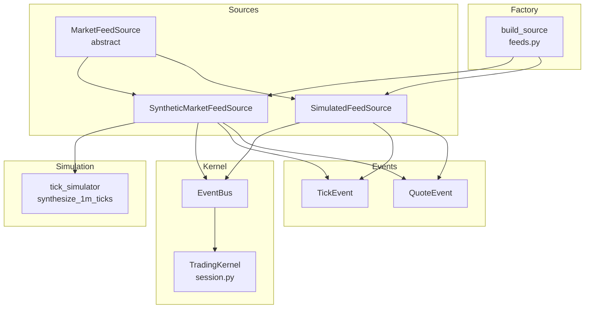
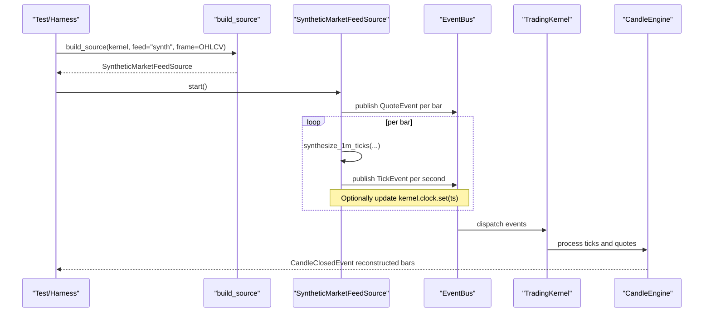
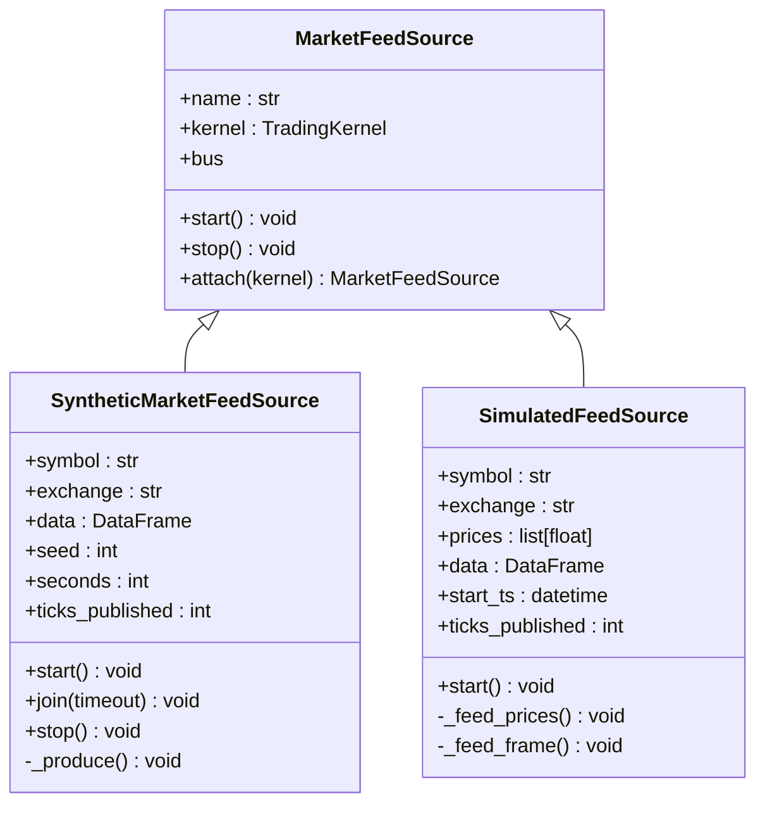
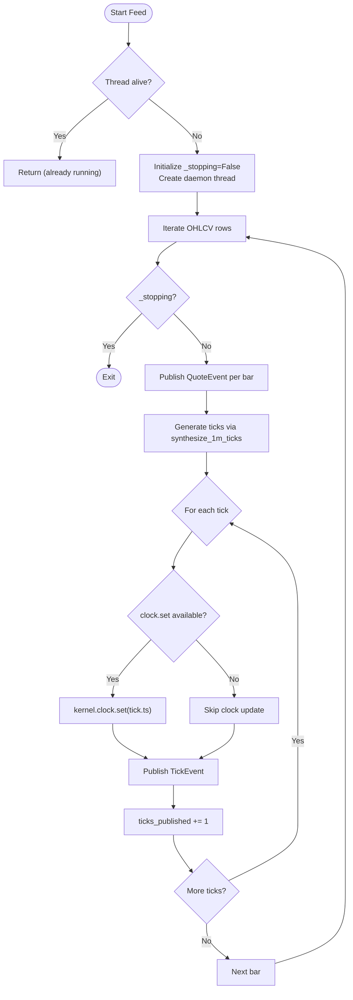
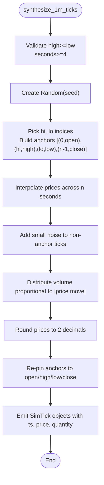
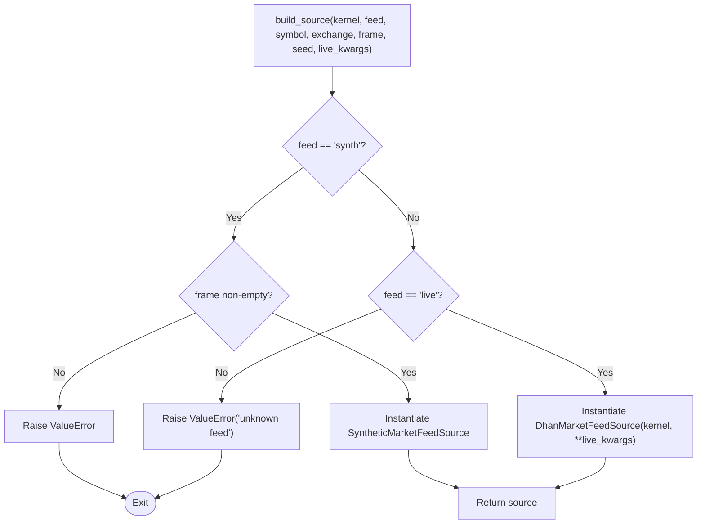
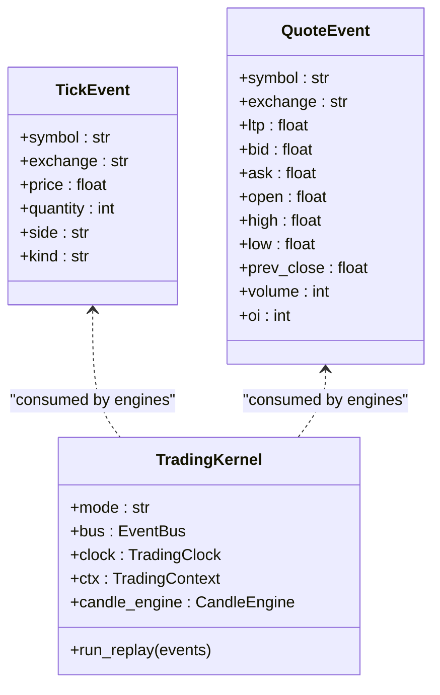
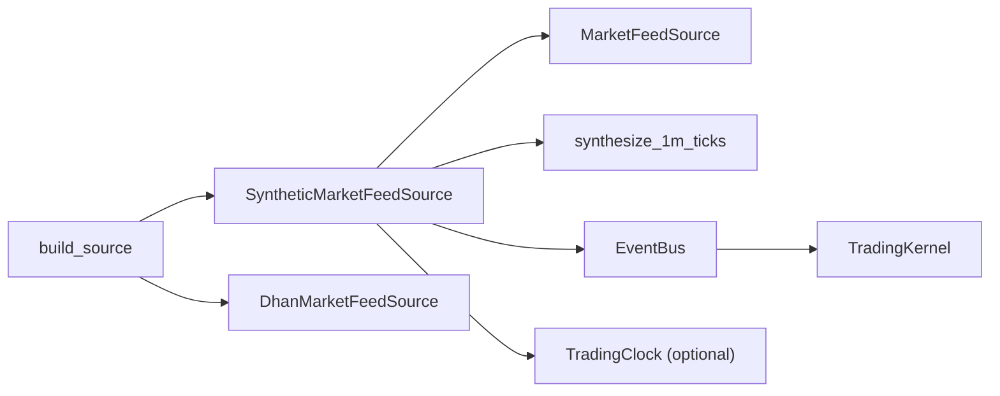

# Synthetic Feeds

<cite>
**Referenced Files in This Document**
- [synthetic_feed.py](file://ntrade/sources/synthetic_feed.py)
- [market_feed.py](file://ntrade/sources/market_feed.py)
- [tick_simulator.py](file://ntrade/sim/tick_simulator.py)
- [feeds.py](file://ntrade/runner/feeds.py)
- [__init__.py (sources)](file://ntrade/sources/__init__.py)
- [session.py](file://ntrade/kernel/session.py)
- [market.py (events)](file://ntrade/events/market.py)
- [base.py (instruments)](file://ntrade/domain/instruments/base.py)
- [test_synthetic_feed.py](file://tests/test_synthetic_feed.py)
- [test_tick_simulator.py](file://tests/test_tick_simulator.py)
- [test_runner_feeds.py](file://tests/test_runner_feeds.py)
</cite>

## Table of Contents
1. Introduction
2. Project Structure
3. Core Components
4. Architecture Overview
5. Detailed Component Analysis
6. Dependency Analysis
7. Performance Considerations
8. Troubleshooting Guide
9. Conclusion
10. Appendices

## Introduction
This document explains the synthetic feed system that enables offline testing without live market connections. It shows how synthetic feeds generate realistic, deterministic market data streams to test strategies and components in isolation while preserving zero-parity with live feeds. The documentation covers:
- How synthetic feeds produce TickEvent and QuoteEvent streams from 1-minute OHLCV bars
- The feed factory pattern for switching between synthetic and live sources
- Integration with the MarketFeedSource interface for seamless substitution
- Creating custom synthetic feeds, configuring characteristics, and validating quality
- Handling instrument metadata, corporate actions, and market hours
- Performance considerations for high-frequency generation and memory management

## Project Structure
The synthetic feed system is implemented as a set of interchangeable event sources that conform to a common abstraction. The key files are:
- MarketFeedSource abstract base class defining the feed interface
- SyntheticMarketFeedSource producing deterministic ticks from OHLCV frames
- SimulatedFeedSource for simple price-path or OHLCV-based simulation
- tick_simulator for deterministic 1-second tick synthesis from 1m bars
- build_source factory for selecting synthetic or live feeds at runtime
- Event types (TickEvent, QuoteEvent) consumed by the kernel engines

**Diagram sources**
- [market_feed.py:23-46](file://ntrade/sources/market_feed.py#L23-L46)
- [synthetic_feed.py:19-34](file://ntrade/sources/synthetic_feed.py#L19-L34)
- [tick_simulator.py:51-82](file://ntrade/sim/tick_simulator.py#L51-L82)
- [feeds.py:6-18](file://ntrade/runner/feeds.py#L6-L18)
- [session.py:38-103](file://ntrade/kernel/session.py#L38-L103)
- [market.py:11-38](file://ntrade/events/market.py#L11-L38)

**Section sources**
- [market_feed.py:1-105](file://ntrade/sources/market_feed.py#L1-L105)
- [synthetic_feed.py:1-77](file://ntrade/sources/synthetic_feed.py#L1-L77)
- [tick_simulator.py:1-82](file://ntrade/sim/tick_simulator.py#L1-L82)
- [feeds.py:1-19](file://ntrade/runner/feeds.py#L1-L19)
- [session.py:1-200](file://ntrade/kernel/session.py#L1-L200)
- [market.py:1-83](file://ntrade/events/market.py#L1-L83)

## Core Components
- MarketFeedSource: Abstract base defining start/stop and bus access for all feed implementations.
- SyntheticMarketFeedSource: Deterministic feed that converts each 1m OHLCV bar into per-second ticks and publishes QuoteEvent per bar.
- SimulatedFeedSource: Simple deterministic feed from either a list of prices or an OHLCV DataFrame.
- synthesize_1m_ticks: Pure function generating one tick per second respecting open/high/low/close/volume invariants.
- build_source: Factory that returns either SyntheticMarketFeedSource or DhanMarketFeedSource based on configuration.

Key responsibilities:
- Zero-parity event emission: synthetic events are identical to live events so the kernel cannot distinguish sources.
- Determinism: seeded RNG ensures reproducible tick paths for regression tests and backtesting.
- Time synchronization: optional clock.set updates when available to align engine timestamps.

**Section sources**
- [market_feed.py:23-46](file://ntrade/sources/market_feed.py#L23-L46)
- [synthetic_feed.py:19-77](file://ntrade/sources/synthetic_feed.py#L19-L77)
- [tick_simulator.py:20-82](file://ntrade/sim/tick_simulator.py#L20-L82)
- [feeds.py:6-18](file://ntrade/runner/feeds.py#L6-L18)

## Architecture Overview
The synthetic feed integrates seamlessly with the TradingKernel via the EventBus. Sources publish canonical events; engines consume them identically regardless of source type.

**Diagram sources**
- [feeds.py:6-18](file://ntrade/runner/feeds.py#L6-L18)
- [synthetic_feed.py:37-77](file://ntrade/sources/synthetic_feed.py#L37-L77)
- [tick_simulator.py:51-82](file://ntrade/sim/tick_simulator.py#L51-L82)
- [session.py:134-147](file://ntrade/kernel/session.py#L134-L147)

## Detailed Component Analysis

### MarketFeedSource Abstraction
Defines the contract for all market data sources:
- start(): begin producing events (blocking or background)
- stop(): graceful shutdown
- bus: access to the kernel’s event bus
- attach(kernel): bind to a TradingKernel instance

This abstraction ensures zero-parity: strategies and engines depend only on events, not on source implementation.

**Diagram sources**
- [market_feed.py:23-46](file://ntrade/sources/market_feed.py#L23-L46)
- [market_feed.py:47-105](file://ntrade/sources/market_feed.py#L47-L105)
- [synthetic_feed.py:19-77](file://ntrade/sources/synthetic_feed.py#L19-L77)

**Section sources**
- [market_feed.py:23-46](file://ntrade/sources/market_feed.py#L23-L46)
- [market_feed.py:47-105](file://ntrade/sources/market_feed.py#L47-L105)

### SyntheticMarketFeedSource
Converts a 1m OHLCV DataFrame into per-second ticks and per-bar quotes:
- Validates non-empty OHLCV input
- Publishes QuoteEvent per bar to keep instrument read-model consistent
- Generates ticks using synthesize_1m_ticks with seed and seconds parameters
- Updates kernel clock if available to maintain replay-time semantics
- Tracks ticks_published for diagnostics

**Diagram sources**
- [synthetic_feed.py:37-77](file://ntrade/sources/synthetic_feed.py#L37-L77)

**Section sources**
- [synthetic_feed.py:19-77](file://ntrade/sources/synthetic_feed.py#L19-L77)

### Tick Simulator (Deterministic Synthesis)
Produces one tick per second with strict invariants:
- First tick equals open, last equals close
- All prices within [low, high], with both extremes touched
- Sum of quantities equals bar volume
- Deterministic output given same seed and bar

Algorithm highlights:
- Anchor points include open, random high index, random low index, and close
- Piecewise-linear interpolation between anchors
- Small noise added to intermediate ticks
- Volume distributed proportionally to absolute price moves
- Rounding applied before re-pinning anchors to preserve invariants

**Diagram sources**
- [tick_simulator.py:51-82](file://ntrade/sim/tick_simulator.py#L51-L82)

**Section sources**
- [tick_simulator.py:1-82](file://ntrade/sim/tick_simulator.py#L1-L82)

### Feed Factory Pattern
The build_source function selects the appropriate feed implementation:
- feed="synth": requires a non-empty OHLCV frame; returns SyntheticMarketFeedSource
- feed="live": returns DhanMarketFeedSource with provided kwargs
- Unknown feed raises ValueError

This enables seamless switching between synthetic and live sources without changing strategy code.

**Diagram sources**
- [feeds.py:6-18](file://ntrade/runner/feeds.py#L6-L18)

**Section sources**
- [feeds.py:1-19](file://ntrade/runner/feeds.py#L1-L19)

### Events and Kernel Integration
- TickEvent and QuoteEvent are immutable dataclasses used across live, simulated, and synthetic feeds.
- TradingKernel wires engines (MarketEngine, CandleEngine, etc.) and exposes bus for event publishing.
- ReplayClock allows time to follow event timestamps, ensuring deterministic behavior.

**Diagram sources**
- [market.py:11-38](file://ntrade/events/market.py#L11-L38)
- [session.py:38-103](file://ntrade/kernel/session.py#L38-L103)

**Section sources**
- [market.py:11-38](file://ntrade/events/market.py#L11-L38)
- [session.py:38-103](file://ntrade/kernel/session.py#L38-L103)

### Instrument Metadata and Corporate Actions
- Instruments carry metadata such as tick size, lot size, freeze quantity, and currency.
- Corporate actions (dividends, splits, bonuses) are recorded and accessible via methods on instruments.
- Synthetic feeds do not alter instrument metadata; they rely on pre-registered instruments in the kernel context.

Best practices:
- Register instruments with accurate metadata before starting synthetic feeds.
- Use broker adapters to hydrate metadata where available; synthetic runs remain unaffected.

**Section sources**
- [base.py:38-76](file://ntrade/domain/instruments/base.py#L38-L76)
- [base.py:190-233](file://ntrade/domain/instruments/base.py#L190-L233)

## Dependency Analysis
Synthetic feeds depend on:
- MarketFeedSource for interface compliance
- synthesize_1m_ticks for deterministic tick generation
- EventBus for event publication
- Optional TradingClock for timestamp alignment

**Diagram sources**
- [synthetic_feed.py:19-77](file://ntrade/sources/synthetic_feed.py#L19-L77)
- [market_feed.py:23-46](file://ntrade/sources/market_feed.py#L23-L46)
- [tick_simulator.py:51-82](file://ntrade/sim/tick_simulator.py#L51-L82)
- [feeds.py:6-18](file://ntrade/runner/feeds.py#L6-L18)
- [session.py:38-103](file://ntrade/kernel/session.py#L38-L103)

**Section sources**
- [synthetic_feed.py:19-77](file://ntrade/sources/synthetic_feed.py#L19-L77)
- [market_feed.py:23-46](file://ntrade/sources/market_feed.py#L23-L46)
- [tick_simulator.py:51-82](file://ntrade/sim/tick_simulator.py#L51-L82)
- [feeds.py:6-18](file://ntrade/runner/feeds.py#L6-L18)
- [session.py:38-103](file://ntrade/kernel/session.py#L38-L103)

## Performance Considerations
High-frequency synthetic data generation requires attention to CPU and memory:
- Deterministic RNG: Using a fixed seed avoids randomness overhead variability and ensures reproducibility.
- Vectorization opportunities: If processing large OHLCV frames, consider vectorized operations for quote/tick generation outside the per-row loop.
- Memory management: Avoid retaining large intermediate lists; emit events incrementally and allow garbage collection.
- Clock updates: Only call clock.set when available; avoid unnecessary attribute checks in tight loops.
- Threading: SyntheticMarketFeedSource uses a daemon thread; ensure join timeouts are adequate to prevent hangs.
- Backpressure: If downstream consumers are slow, consider buffering limits or dropping older ticks to prevent memory growth.

Recommendations:
- Pre-validate OHLCV frames to fail fast on invalid inputs.
- Batch-publish events where possible to reduce bus overhead.
- Monitor ticks_published counters for throughput diagnostics.

[No sources needed since this section provides general guidance]

## Troubleshooting Guide
Common issues and resolutions:
- Empty OHLCV frame: SyntheticMarketFeedSource raises ValueError; ensure frame is non-empty and contains required columns.
- Invalid bar range: synthesize_1m_ticks raises ValueError if high < low; validate input bars.
- Unknown feed type: build_source raises ValueError for unsupported feed strings; use "synth" or "live".
- Missing kernel clock: clock.set is skipped if unavailable; ensure kernel is attached to sources.
- Thread lifecycle: Ensure join(timeout) is called after stop to prevent orphan threads.

Validation examples:
- Reconstruct bars exactly: CandleEngine should produce candles matching original OHLCV values.
- Quote reflects last bar: Instrument LTP should equal the final close in the frame.
- Determinism: Same seed yields identical tick sequences.

**Section sources**
- [synthetic_feed.py:25-26](file://ntrade/sources/synthetic_feed.py#L25-L26)
- [tick_simulator.py:54-57](file://ntrade/sim/tick_simulator.py#L54-L57)
- [feeds.py:10-11](file://ntrade/runner/feeds.py#L10-L11)
- [test_synthetic_feed.py:38-63](file://tests/test_synthetic_feed.py#L38-L63)
- [test_tick_simulator.py:49-72](file://tests/test_tick_simulator.py#L49-L72)

## Conclusion
The synthetic feed system provides a robust, deterministic, and zero-parity alternative to live market data for offline testing. By adhering to the MarketFeedSource interface and emitting canonical events, it enables seamless substitution between synthetic and live sources. The tick simulator guarantees realistic price paths while respecting bar constraints, and the factory pattern simplifies configuration. With careful attention to performance and validation, synthetic feeds support reliable strategy development, regression testing, and backtesting without network dependencies.

[No sources needed since this section summarizes without analyzing specific files]

## Appendices

### Creating Custom Synthetic Feeds
Steps:
- Subclass MarketFeedSource and implement start/stop
- Generate events using TickEvent and QuoteEvent
- Optionally integrate with synthesize_1m_ticks for realistic tick paths
- Register instruments and attach kernel before starting

Example patterns:
- Mean-reverting processes: Adjust price generation logic to pull toward a mean level
- Random walks: Use random increments bounded by volatility parameters
- Custom generators: Implement domain-specific price dynamics while maintaining invariants

**Section sources**
- [market_feed.py:23-46](file://ntrade/sources/market_feed.py#L23-L46)
- [synthetic_feed.py:19-77](file://ntrade/sources/synthetic_feed.py#L19-L77)
- [tick_simulator.py:51-82](file://ntrade/sim/tick_simulator.py#L51-L82)

### Configuring Data Characteristics
- Seed: Controls randomness determinism for reproducible results
- Seconds: Number of ticks per bar (default 60)
- Symbol/Exchange: Identifiers for event routing and instrument lookup
- Frame structure: Requires timestamp, open, high, low, close, and optionally volume

**Section sources**
- [synthetic_feed.py:22-34](file://ntrade/sources/synthetic_feed.py#L22-L34)
- [tick_simulator.py:51-82](file://ntrade/sim/tick_simulator.py#L51-L82)

### Validating Feed Quality
- Bar reconstruction: Verify CandleEngine outputs match original OHLCV
- Quote consistency: Ensure instrument LTP reflects latest bar close
- Invariant checks: Confirm prices stay within [low, high], extremes touched, volume sums correctly
- Determinism: Same seed produces identical tick sequences

**Section sources**
- [test_synthetic_feed.py:38-63](file://tests/test_synthetic_feed.py#L38-L63)
- [test_tick_simulator.py:49-72](file://tests/test_tick_simulator.py#L49-L72)

### Handling Market Hours
- Synthetic feeds operate independently of real market hours; timestamps are controlled by input frame
- For realistic session simulation, constrain frame timestamps to trading hours
- Use ReplayClock to align engine time with event timestamps

**Section sources**
- [session.py:134-147](file://ntrade/kernel/session.py#L134-L147)