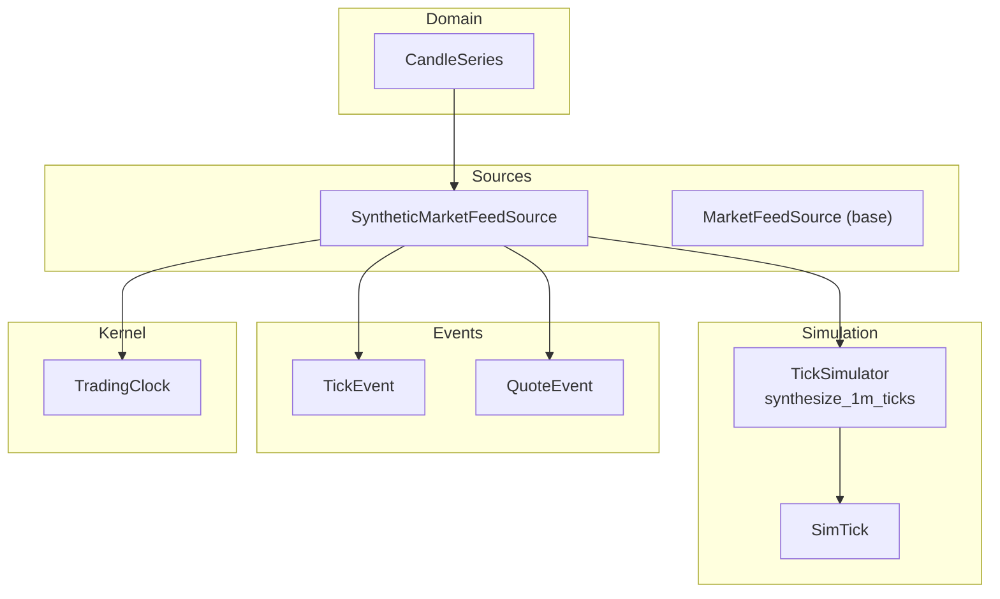
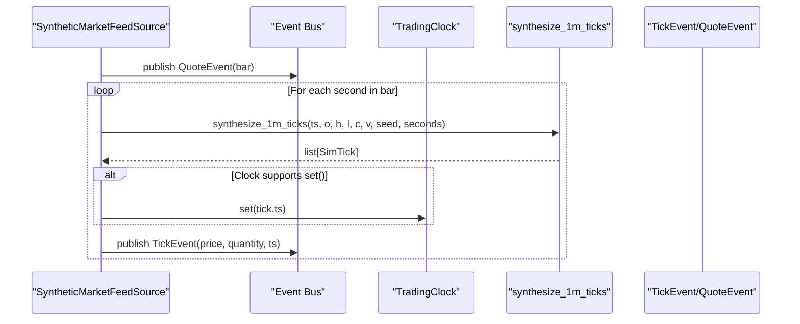
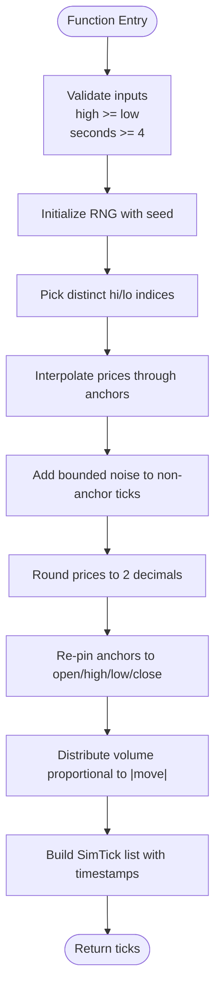
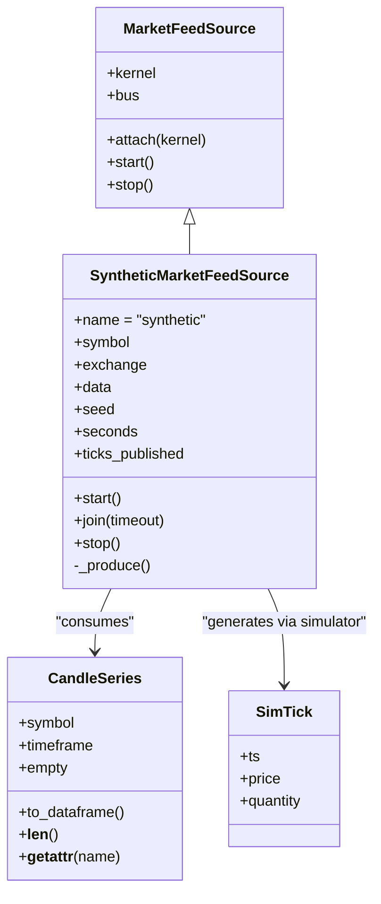
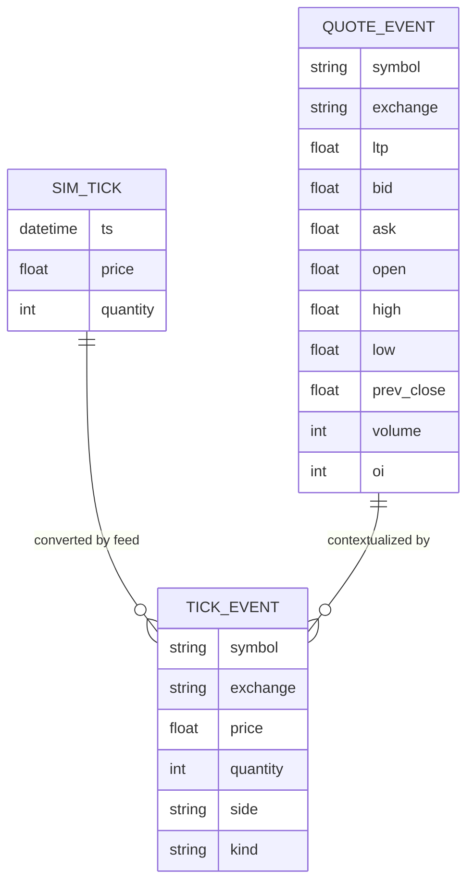
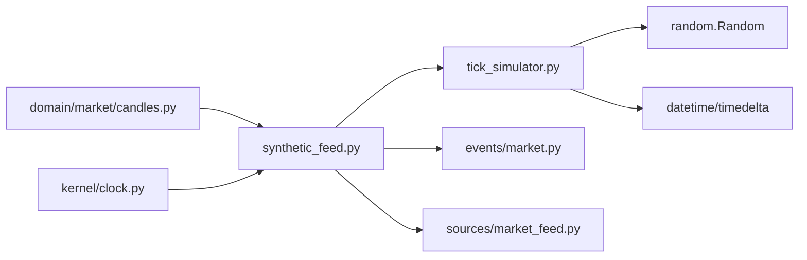

# Tick Simulator

<cite>
**Referenced Files in This Document**
- [tick_simulator.py](file://ntrade/sim/tick_simulator.py)
- [synthetic_feed.py](file://ntrade/sources/synthetic_feed.py)
- [market_feed.py](file://ntrade/sources/market_feed.py)
- [candles.py](file://ntrade/domain/market/candles.py)
- [market.py](file://ntrade/events/market.py)
- [clock.py](file://ntrade/kernel/clock.py)
- [test_tick_simulator.py](file://tests/test_tick_simulator.py)
</cite>

## Table of Contents
1. [Introduction](#introduction)
2. [Project Structure](#project-structure)
3. [Core Components](#core-components)
4. [Architecture Overview](#architecture-overview)
5. [Detailed Component Analysis](#detailed-component-analysis)
6. [Dependency Analysis](#dependency-analysis)
7. [Performance Considerations](#performance-considerations)
8. [Troubleshooting Guide](#troubleshooting-guide)
9. [Conclusion](#conclusion)
10. [Appendices](#appendices)

## Introduction
The TickSimulator component generates deterministic, realistic tick sequences from historical 1-minute OHLCV bars while preserving key market microstructure characteristics such as price bounds, extremes, and volume distribution. It is designed to be fully reproducible via a random seed and integrates seamlessly with the synthetic feed system to produce canonical market events identical to live feeds, ensuring zero parity across simulation, replay, and live environments.

## Project Structure
The TickSimulator lives under the simulation module and is consumed by the synthetic feed source that publishes canonical market events into the kernel’s event bus. The domain layer provides typed wrappers for OHLCV data, and the event layer defines the canonical TickEvent and QuoteEvent used throughout the system.

**Diagram sources**
- [tick_simulator.py:1-82](file://ntrade/sim/tick_simulator.py#L1-L82)
- [synthetic_feed.py:1-77](file://ntrade/sources/synthetic_feed.py#L1-L77)
- [market_feed.py:1-105](file://ntrade/sources/market_feed.py#L1-L105)
- [candles.py:1-67](file://ntrade/domain/market/candles.py#L1-L67)
- [market.py:1-83](file://ntrade/events/market.py#L1-L83)
- [clock.py:1-55](file://ntrade/kernel/clock.py#L1-L55)

**Section sources**
- [tick_simulator.py:1-82](file://ntrade/sim/tick_simulator.py#L1-L82)
- [synthetic_feed.py:1-77](file://ntrade/sources/synthetic_feed.py#L1-L77)
- [market_feed.py:1-105](file://ntrade/sources/market_feed.py#L1-L105)
- [candles.py:1-67](file://ntrade/domain/market/candles.py#L1-L67)
- [market.py:1-83](file://ntrade/events/market.py#L1-L83)
- [clock.py:1-55](file://ntrade/kernel/clock.py#L1-L55)

## Core Components
- SimTick: Immutable dataclass representing a simulated tick with timestamp, price, and quantity.
- synthesize_1m_ticks: Deterministic function that converts a single 1-minute OHLCV bar into a sequence of per-second ticks respecting invariants (open/close anchors, high/low bounds, volume sum).
- SyntheticMarketFeedSource: Consumes OHLCV frames and publishes QuoteEvent per bar and TickEvent per simulated second using the seeded tick simulator.
- MarketFeedSource: Abstract base defining the interface for all market data sources, enabling zero-parity integration.
- CandleSeries: Typed wrapper around OHLCV DataFrame used by sources.
- TradingClock: Deterministic clock abstraction allowing simulation to control time progression.

Key responsibilities:
- Generate realistic intra-bar price paths anchored at open/high/low/close.
- Distribute volume proportionally to absolute price moves.
- Inject bounded noise to mimic microstructure fluctuations.
- Maintain temporal consistency via timestamps derived from the bar start time.
- Provide deterministic outputs through explicit random seeds.

**Section sources**
- [tick_simulator.py:20-82](file://ntrade/sim/tick_simulator.py#L20-L82)
- [synthetic_feed.py:19-77](file://ntrade/sources/synthetic_feed.py#L19-L77)
- [market_feed.py:23-105](file://ntrade/sources/market_feed.py#L23-L105)
- [candles.py:18-67](file://ntrade/domain/market/candles.py#L18-L67)
- [clock.py:14-55](file://ntrade/kernel/clock.py#L14-L55)

## Architecture Overview
The synthetic feed orchestrates the conversion of OHLCV bars into canonical events. For each bar, it publishes a QuoteEvent and then iteratively publishes TickEvent instances generated by the tick simulator. The kernel’s clock can be advanced deterministically to maintain consistent timing across simulation runs.

**Diagram sources**
- [synthetic_feed.py:52-77](file://ntrade/sources/synthetic_feed.py#L52-L77)
- [tick_simulator.py:51-82](file://ntrade/sim/tick_simulator.py#L51-L82)
- [clock.py:40-46](file://ntrade/kernel/clock.py#L40-L46)
- [market.py:12-38](file://ntrade/events/market.py#L12-L38)

## Detailed Component Analysis

### TickSimulator: Price Path Generation and Volume Distribution
The core algorithm constructs an intra-bar price path using piecewise-linear interpolation between anchor points (open, high, low, close), injects bounded noise, rounds prices, and distributes volume based on absolute price moves.

**Diagram sources**
- [tick_simulator.py:51-82](file://ntrade/sim/tick_simulator.py#L51-L82)

Key implementation details:
- Anchors ensure open/close are fixed and both high/low are touched within the bar.
- Noise amplitude is proportional to bar range (2% of high-low), maintaining realism without violating bounds.
- Volume distribution uses absolute price changes; flat segments receive no volume, aligning with microstructure intuition.
- Rounding occurs before re-pinning anchors to preserve exact high/low values even for non-integer prices.

**Section sources**
- [tick_simulator.py:27-48](file://ntrade/sim/tick_simulator.py#L27-L48)
- [tick_simulator.py:51-82](file://ntrade/sim/tick_simulator.py#L51-L82)

### SyntheticFeed Integration
The synthetic feed bridges OHLCV data and the kernel’s event system. It validates input data, publishes quote snapshots per bar, and emits tick events using the seeded simulator. It also synchronizes the kernel’s clock when available.

**Diagram sources**
- [market_feed.py:23-105](file://ntrade/sources/market_feed.py#L23-L105)
- [synthetic_feed.py:19-77](file://ntrade/sources/synthetic_feed.py#L19-L77)
- [candles.py:18-67](file://ntrade/domain/market/candles.py#L18-L67)
- [tick_simulator.py:20-25](file://ntrade/sim/tick_simulator.py#L20-L25)

**Section sources**
- [synthetic_feed.py:19-77](file://ntrade/sources/synthetic_feed.py#L19-L77)
- [market_feed.py:23-105](file://ntrade/sources/market_feed.py#L23-L105)

### Event System Integration
The tick simulator produces SimTick objects, which are converted into canonical TickEvent instances by the synthetic feed. QuoteEvent snapshots provide OHLCV context for downstream consumers.

**Diagram sources**
- [market.py:12-38](file://ntrade/events/market.py#L12-L38)
- [market.py:24-38](file://ntrade/events/market.py#L24-L38)
- [tick_simulator.py:20-25](file://ntrade/sim/tick_simulator.py#L20-L25)

**Section sources**
- [market.py:12-38](file://ntrade/events/market.py#L12-L38)
- [market.py:24-38](file://ntrade/events/market.py#L24-L38)

## Dependency Analysis
The tick simulator has minimal external dependencies, relying only on Python’s standard library for randomness and datetime operations. Its integration points are well-defined through the synthetic feed and event system.

**Diagram sources**
- [tick_simulator.py:15-17](file://ntrade/sim/tick_simulator.py#L15-L17)
- [synthetic_feed.py:14-16](file://ntrade/sources/synthetic_feed.py#L14-L16)
- [market_feed.py:17](file://ntrade/sources/market_feed.py#L17)
- [candles.py:12](file://ntrade/domain/market/candles.py#L12)
- [clock.py:11](file://ntrade/kernel/clock.py#L11)

**Section sources**
- [tick_simulator.py:15-17](file://ntrade/sim/tick_simulator.py#L15-L17)
- [synthetic_feed.py:14-16](file://ntrade/sources/synthetic_feed.py#L14-L16)
- [market_feed.py:17](file://ntrade/sources/market_feed.py#L17)
- [candles.py:12](file://ntrade/domain/market/candles.py#L12)
- [clock.py:11](file://ntrade/kernel/clock.py#L11)

## Performance Considerations
- Time Complexity: O(n) per bar where n equals the number of seconds (default 60). Price interpolation, noise injection, and volume distribution all scale linearly.
- Memory Usage: Creates a list of SimTick objects per bar; memory footprint is proportional to seconds count.
- Randomness Overhead: Seeded RNG ensures reproducibility with negligible overhead compared to arithmetic operations.
- Volume Distribution: Uses absolute price moves; flat bars result in zero volume distribution except for remainder handling.

Optimization opportunities:
- Vectorization: For large datasets, consider numpy-based vectorization for price interpolation and volume distribution.
- Lazy Evaluation: Stream ticks instead of materializing full lists for memory-constrained environments.
- Caching: Cache repeated bar patterns if processing identical OHLCV data multiple times.

## Troubleshooting Guide
Common issues and resolutions:
- Invalid Bar Range: Raises ValueError if high < low. Ensure OHLCV data integrity before processing.
- Insufficient Seconds: Requires seconds >= 4. Adjust configuration for very short timeframes.
- Flat Bars: All ticks have identical prices; volume distribution results in zeros except last tick remainder.
- Non-Deterministic Output: Verify seed parameter is consistent across runs for reproducibility.
- Clock Synchronization: If kernel.clock lacks set() method, time synchronization is skipped but simulation continues.

Validation checklist:
- Confirm one tick per second (60 ticks for default 1-minute bar).
- Verify first tick equals open and last equals close.
- Check all prices stay within [low, high].
- Ensure max/min prices equal high/low respectively.
- Validate sum of quantities equals bar volume.
- Test determinism with same seed produces identical output.

**Section sources**
- [test_tick_simulator.py:13-73](file://tests/test_tick_simulator.py#L13-L73)
- [tick_simulator.py:54-57](file://ntrade/sim/tick_simulator.py#L54-L57)

## Conclusion
The TickSimulator provides a robust, deterministic mechanism for converting OHLCV bars into realistic tick sequences while preserving critical market microstructure properties. Its integration with the synthetic feed system enables seamless operation across simulation, replay, and live trading contexts with zero parity. The component’s design emphasizes reproducibility through seed management, temporal consistency via timestamp generation, and realistic behavior through bounded noise and volume distribution algorithms.

## Appendices

### Configuration Options
- seed: Integer seed for deterministic random number generation (default: 0)
- seconds: Number of ticks per bar (default: 60 for 1-second ticks over 1-minute bar)
- Input validation: high >= low required, seconds >= 4 enforced

### Creating Custom Price Generators
To extend the tick simulator:
1. Implement custom interpolation logic replacing _interp function
2. Modify noise injection parameters in synthesize_1m_ticks
3. Adjust volume distribution strategy in _distribute_volume
4. Maintain invariants: open/close anchors, high/low bounds, volume sum

### Example Usage Patterns
- Basic simulation: Call synthesize_1m_ticks with OHLCV data and default parameters
- Reproducible testing: Use fixed seed values for consistent test results
- Custom timeframe: Adjust seconds parameter for different tick frequencies
- Integration: Feed results into SyntheticMarketFeedSource for event publishing

### Data Quality Validation
- Statistical analysis: Compare generated tick statistics against real market data
- Microstructure metrics: Analyze bid-ask spread proxies, volume profiles, and price impact
- Temporal consistency: Verify timestamp ordering and spacing
- Boundary compliance: Ensure all prices remain within specified ranges

**Section sources**
- [tick_simulator.py:51-82](file://ntrade/sim/tick_simulator.py#L51-L82)
- [synthetic_feed.py:22-31](file://ntrade/sources/synthetic_feed.py#L22-L31)
- [test_tick_simulator.py:13-73](file://tests/test_tick_simulator.py#L13-L73)