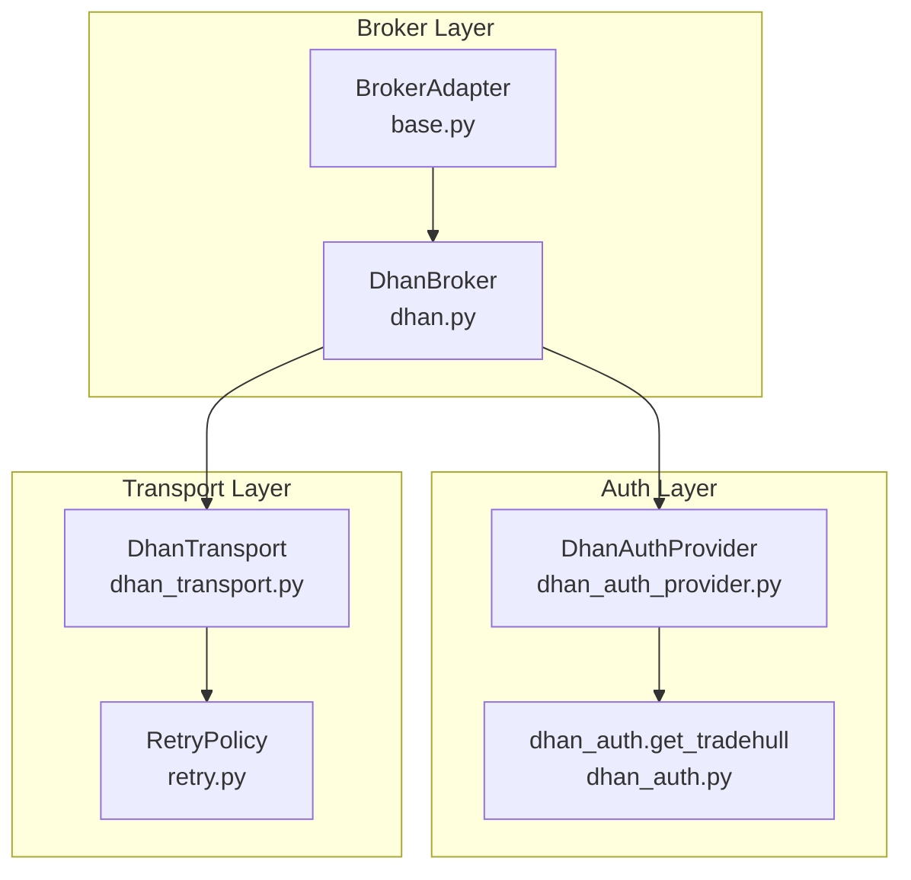
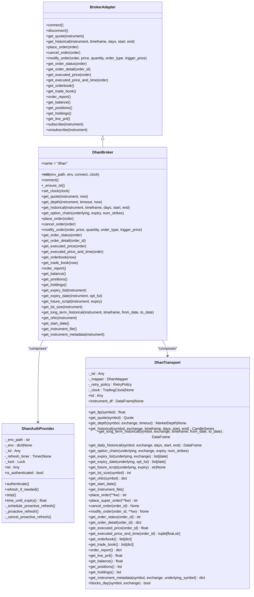
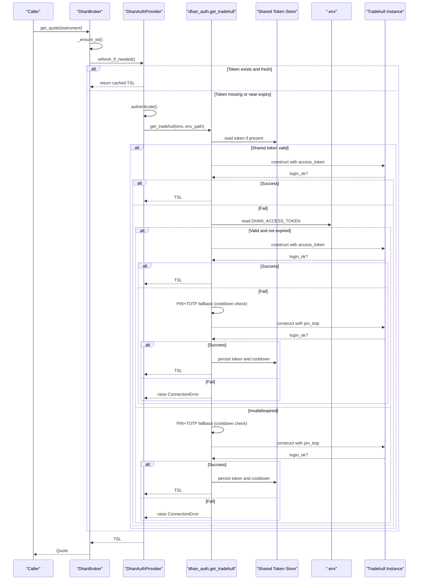
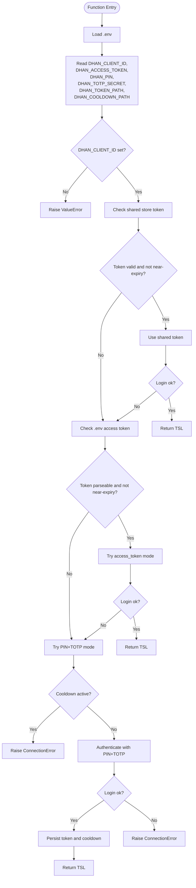
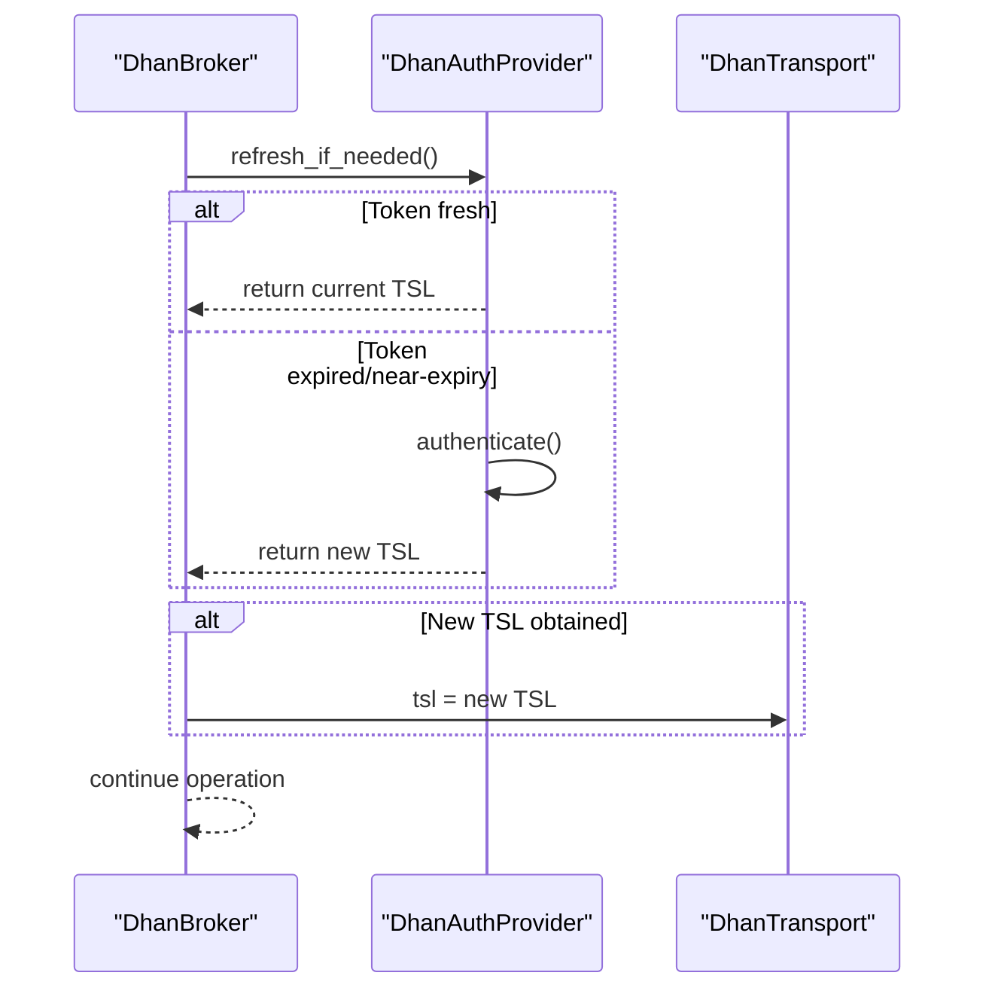
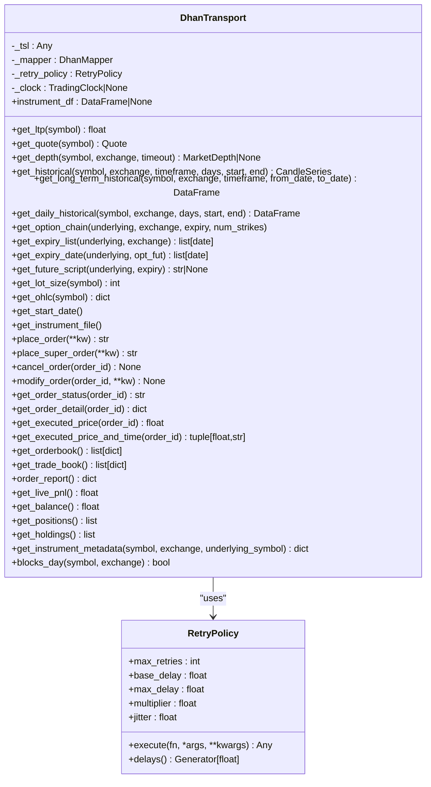
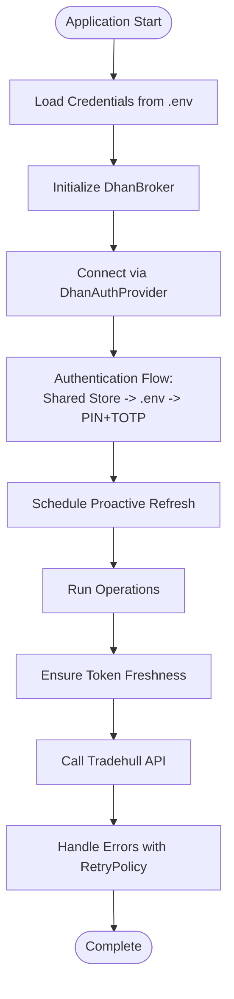
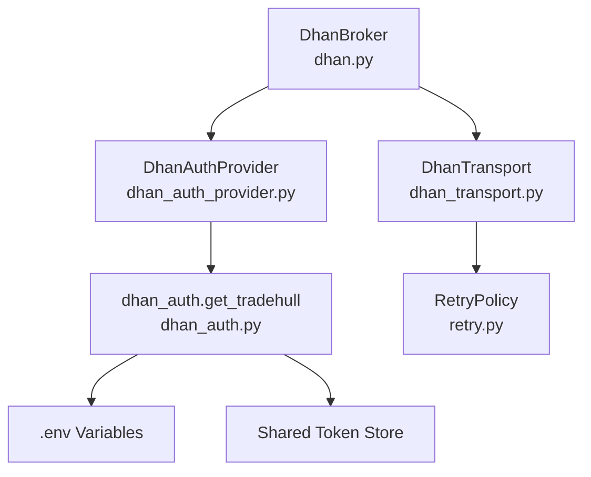

# Authentication & Security

<cite>
**Referenced Files in This Document**
- [dhan_auth.py](file://ntrade/brokers/dhan_auth.py)
- [dhan_auth_provider.py](file://ntrade/brokers/dhan_auth_provider.py)
- [dhan.py](file://ntrade/brokers/dhan.py)
- [base.py](file://ntrade/brokers/base.py)
- [dhan_transport.py](file://ntrade/brokers/dhan_transport.py)
- [retry.py](file://ntrade/execution/retry.py)
- [auth.md](file://.agents/skills/dhan-tradehull/references/auth.md)
- [check_connection.py](file://check_connection.py)
- [test_dhan_auth_unit.py](file://tests/test_dhan_auth_unit.py)
</cite>

## Table of Contents
1. Introduction
2. Project Structure
3. Core Components
4. Architecture Overview
5. Detailed Component Analysis
6. Dependency Analysis
7. Performance Considerations
8. Troubleshooting Guide
9. Conclusion

## Introduction
This document explains the authentication and security systems used across broker integrations, focusing on the Dhan integration. It covers a multi-layered authentication approach that includes PIN-based verification, TOTP (Time-based One-Time Password) generation, and secure token management. It also documents credential storage via environment variables, shared token files, and cooldown mechanisms; the authentication provider pattern for pluggable strategies; session management with proactive token refresh; automatic reconnection handling; and best practices for production deployments. Examples are provided to implement custom authentication providers, handle failures gracefully, and manage multiple broker sessions.

## Project Structure
The authentication and security logic is implemented as a layered system:
- dhan_auth.py: Shared authentication helper for Dhan, including JWT expiry parsing, shared token store, PIN+TOTP fallback, and cooldown control.
- dhan_auth_provider.py: Class-based wrapper over dhan_auth that manages lifecycle, caching, and proactive background refresh.
- dhan.py: Broker implementation composing the auth provider and transport, ensuring token freshness before critical operations.
- base.py: Abstract broker adapter defining the interface for all brokers.
- dhan_transport.py: Transport layer wrapping Tradehull API calls with retry and normalization.
- retry.py: Retry policy and rate limiter utilities used by the transport.
- check_connection.py: CLI utility to validate connection using the same auth flow.
- auth.md: Reference documentation for Tradehull modes and behavior.
- test_dhan_auth_unit.py: Unit tests validating auth helpers without live network calls.

**Diagram sources**
- [base.py:25-70](file://ntrade/brokers/base.py#L25-L70)
- [dhan.py:54-95](file://ntrade/brokers/dhan.py#L54-L95)
- [dhan_auth_provider.py:28-56](file://ntrade/brokers/dhan_auth_provider.py#L28-L56)
- [dhan_auth.py:114-167](file://ntrade/brokers/dhan_auth.py#L114-L167)
- [dhan_transport.py:48-77](file://ntrade/brokers/dhan_transport.py#L48-L77)
- [retry.py:19-56](file://ntrade/execution/retry.py#L19-L56)

**Section sources**
- [base.py:25-70](file://ntrade/brokers/base.py#L25-L70)
- [dhan.py:54-95](file://ntrade/brokers/dhan.py#L54-L95)
- [dhan_auth_provider.py:28-56](file://ntrade/brokers/dhan_auth_provider.py#L28-L56)
- [dhan_auth.py:114-167](file://ntrade/brokers/dhan_auth.py#L114-L167)
- [dhan_transport.py:48-77](file://ntrade/brokers/dhan_transport.py#L48-L77)
- [retry.py:19-56](file://ntrade/execution/retry.py#L19-L56)

## Core Components
- DhanAuthProvider: Manages authentication lifecycle, caches the authenticated Tradehull instance, and schedules proactive background refreshes before token expiry.
- dhan_auth.get_tradehull: Implements the multi-step authentication flow: prefer shared token store, then .env access token, then PIN+TOTP fallback with cooldown protection.
- DhanBroker: Composes the auth provider and transport, ensures token freshness before critical operations, and updates transport when tokens change.
- DhanTransport: Wraps Tradehull API calls with retry policies and error normalization.
- RetryPolicy: Provides exponential backoff and jitter for resilient API calls.

Key responsibilities:
- Credential loading from environment variables and shared token files.
- JWT expiry parsing and proactive buffer to avoid mid-session expiry.
- PIN+TOTP fallback with cooldown enforcement.
- Background timer to refresh tokens silently.
- Per-request checks to ensure fresh tokens before API calls.

**Section sources**
- [dhan_auth_provider.py:28-101](file://ntrade/brokers/dhan_auth_provider.py#L28-L101)
- [dhan_auth.py:42-167](file://ntrade/brokers/dhan_auth.py#L42-L167)
- [dhan.py:69-95](file://ntrade/brokers/dhan.py#L69-L95)
- [dhan_transport.py:48-116](file://ntrade/brokers/dhan_transport.py#L48-L116)
- [retry.py:19-56](file://ntrade/execution/retry.py#L19-L56)

## Architecture Overview
The authentication architecture follows a layered pattern:
- BrokerAdapter defines the abstract interface for brokers.
- DhanBroker implements broker-specific functionality and composes DhanAuthProvider and DhanTransport.
- DhanAuthProvider encapsulates authentication lifecycle and proactive refresh scheduling.
- dhan_auth provides the core authentication logic and shared token management.
- DhanTransport wraps Tradehull API calls with retry and normalization.

**Diagram sources**
- [base.py:25-163](file://ntrade/brokers/base.py#L25-L163)
- [dhan.py:54-634](file://ntrade/brokers/dhan.py#L54-L634)
- [dhan_auth_provider.py:28-141](file://ntrade/brokers/dhan_auth_provider.py#L28-L141)
- [dhan_transport.py:48-405](file://ntrade/brokers/dhan_transport.py#L48-L405)

## Detailed Component Analysis

### DhanAuthProvider
Manages the authentication lifecycle for Dhan with automatic token refresh. It caches the authenticated Tradehull instance, performs per-request freshness checks, and schedules a background timer to proactively refresh tokens before expiry.

Key behaviors:
- authenticate(): Initializes or refreshes the Tradehull instance via get_tradehull and schedules proactive refresh.
- refresh_if_needed(): Checks token expiry using jwt_expiry and EXPIRY_BUFFER_S; triggers re-authentication if near-expiry.
- time_until_expiry(): Computes remaining seconds until token expiry.
- _schedule_proactive_refresh(): Schedules a threading.Timer to call authenticate() before expiry.
- _proactive_refresh(): Logs success or failure without raising exceptions.

**Diagram sources**
- [dhan.py:75-95](file://ntrade/brokers/dhan.py#L75-L95)
- [dhan_auth_provider.py:47-74](file://ntrade/brokers/dhan_auth_provider.py#L47-L74)
- [dhan_auth.py:114-167](file://ntrade/brokers/dhan_auth.py#L114-L167)

**Section sources**
- [dhan_auth_provider.py:28-141](file://ntrade/brokers/dhan_auth_provider.py#L28-L141)
- [dhan_auth.py:42-167](file://ntrade/brokers/dhan_auth.py#L42-L167)

### dhan_auth.get_tradehull
Implements the multi-step authentication flow:
1. Prefer a valid token from the shared store (DHAN_TOKEN_PATH).
2. Else use DHAN_ACCESS_TOKEN if not provably expired.
3. Else fall back to PIN+TOTP (respecting cooldown file DHAN_COOLDOWN_PATH) and persist the fresh token back to the shared store.

Security features:
- JWT expiry parsing to detect near-expiry tokens.
- Cooldown enforcement to prevent rapid TOTP attempts.
- Restrictive file permissions (0o600) for token and cooldown files.
- Suppression of noisy library output during login.

**Diagram sources**
- [dhan_auth.py:114-167](file://ntrade/brokers/dhan_auth.py#L114-L167)

**Section sources**
- [dhan_auth.py:42-167](file://ntrade/brokers/dhan_auth.py#L42-L167)

### DhanBroker._ensure_tsl
Ensures token freshness before critical operations by calling DhanAuthProvider.refresh_if_needed(). If a new token is obtained, it updates both the broker’s tsl reference and the transport’s tsl reference.

**Diagram sources**
- [dhan.py:75-95](file://ntrade/brokers/dhan.py#L75-L95)
- [dhan_auth_provider.py:58-74](file://ntrade/brokers/dhan_auth_provider.py#L58-L74)

**Section sources**
- [dhan.py:75-95](file://ntrade/brokers/dhan.py#L75-L95)

### DhanTransport and RetryPolicy
DhanTransport wraps Tradehull API calls with retry logic and normalization. RetryPolicy provides exponential backoff with jitter to handle transient failures.

**Diagram sources**
- [dhan_transport.py:48-116](file://ntrade/brokers/dhan_transport.py#L48-L116)
- [retry.py:19-56](file://ntrade/execution/retry.py#L19-L56)

**Section sources**
- [dhan_transport.py:48-116](file://ntrade/brokers/dhan_transport.py#L48-L116)
- [retry.py:19-56](file://ntrade/execution/retry.py#L19-L56)

### Conceptual Overview
The authentication system follows a layered approach:
- Environment variables provide credentials (DHAN_CLIENT_ID, DHAN_ACCESS_TOKEN, DHAN_PIN, DHAN_TOTP_SECRET).
- Shared token store persists tokens securely with restrictive permissions.
- Proactive refresh avoids mid-session expiry by scheduling background timers.
- PIN+TOTP fallback ensures automated authentication for long-running processes.
- Retry policies handle transient failures gracefully.

[No sources needed since this diagram shows conceptual workflow, not actual code structure]

## Dependency Analysis
The authentication system has clear dependencies:
- DhanBroker depends on DhanAuthProvider and DhanTransport.
- DhanAuthProvider depends on dhan_auth.get_tradehull.
- DhanTransport depends on RetryPolicy.
- All components rely on environment variables and shared token files.

**Diagram sources**
- [dhan.py:54-95](file://ntrade/brokers/dhan.py#L54-L95)
- [dhan_auth_provider.py:28-56](file://ntrade/brokers/dhan_auth_provider.py#L28-L56)
- [dhan_auth.py:114-167](file://ntrade/brokers/dhan_auth.py#L114-L167)
- [dhan_transport.py:48-77](file://ntrade/brokers/dhan_transport.py#L48-L77)
- [retry.py:19-56](file://ntrade/execution/retry.py#L19-L56)

**Section sources**
- [dhan.py:54-95](file://ntrade/brokers/dhan.py#L54-L95)
- [dhan_auth_provider.py:28-56](file://ntrade/brokers/dhan_auth_provider.py#L28-L56)
- [dhan_auth.py:114-167](file://ntrade/brokers/dhan_auth.py#L114-L167)
- [dhan_transport.py:48-77](file://ntrade/brokers/dhan_transport.py#L48-L77)
- [retry.py:19-56](file://ntrade/execution/retry.py#L19-L56)

## Performance Considerations
- Proactive token refresh minimizes latency spikes caused by expired tokens.
- RetryPolicy with exponential backoff and jitter reduces load on flaky endpoints.
- Shared token store avoids repeated PIN+TOTP authentication.
- Cooldown mechanism prevents excessive TOTP attempts.
- Thread-safe operations ensure concurrent access doesn’t cause race conditions.

[No sources needed since this section provides general guidance]

## Troubleshooting Guide
Common issues and resolutions:
- Missing DHAN_CLIENT_ID: Ensure environment variable is set.
- Invalid or expired access token: The system will automatically fall back to PIN+TOTP.
- TOTP cooldown active: Wait approximately 90 seconds before retrying.
- Network errors: RetryPolicy handles transient failures; check logs for details.
- Permission errors on token files: Ensure files have 0o600 permissions.

Debugging techniques:
- Use check_connection.py to validate authentication and connectivity.
- Review logs for proactive refresh status and failures.
- Verify shared token store contents and expiration times.
- Test PIN+TOTP flow independently to confirm credentials.

**Section sources**
- [check_connection.py:17-38](file://check_connection.py#L17-L38)
- [test_dhan_auth_unit.py:114-147](file://tests/test_dhan_auth_unit.py#L114-L147)

## Conclusion
The authentication and security system for broker integrations provides a robust, multi-layered approach with PIN+TOTP verification, secure token management, and proactive refresh mechanisms. The design emphasizes resilience through retry policies, thread safety, and graceful error handling. By following the documented patterns and best practices, developers can implement custom authentication providers and manage multiple broker sessions effectively while maintaining security and compliance requirements.

[No sources needed since this section summarizes without analyzing specific files]